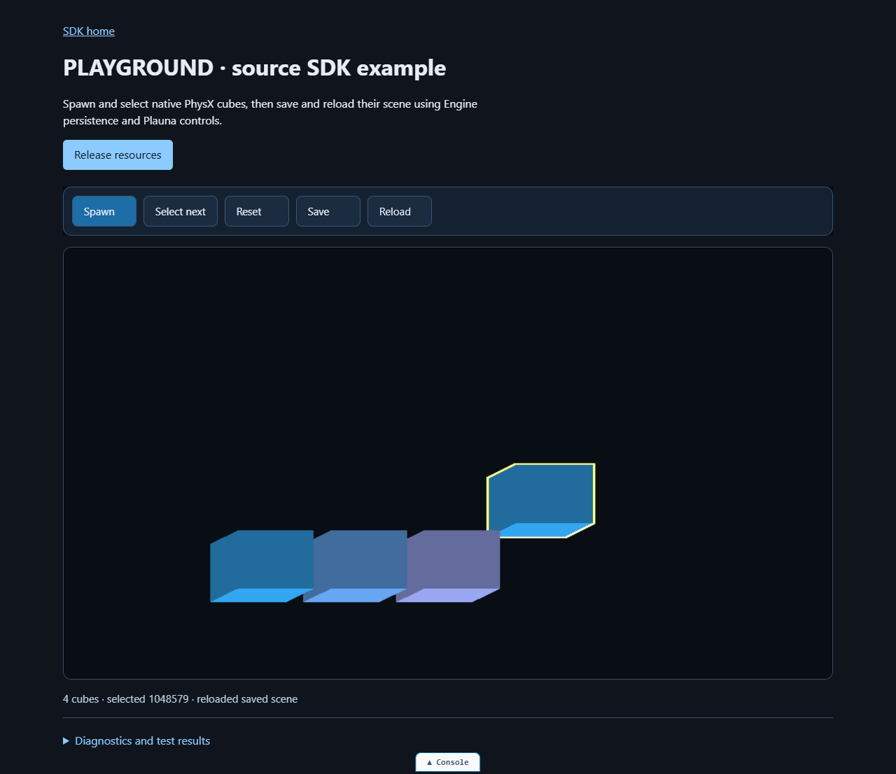

<!-- SPDX-FileCopyrightText: 2026 Jake Wehmeier (BTSpaniel) <https://github.com/BTSpaniel> -->
<!-- SPDX-License-Identifier: LicenseRef-ParticleRealms-Alpha -->

<h1 align="center">Particle Realms Engine SDK</h1>

<p align="center">
  <a href="engine-sdk/">
    
  </a>
</p>

<p align="center">
  <strong>Build worlds in the browser.</strong><br />
  WebGPU rendering, ECS, native physics and Plauna UI on one foundation.<br />
  Browser ES modules. Python tooling. No npm application setup.
</p>

<p align="center">
  <a href="https://github.com/BTSpaniel/particlerealms.engine/actions/workflows/sdk-ci.yml"></a>
  <a href="https://github.com/BTSpaniel/particlerealms.engine/releases"></a>
</p>

<p align="center">
  <a href="#quick-start"><strong>Quick start</strong></a> &nbsp; · &nbsp;
  <a href="engine-sdk/MD/guides/sdk-distribution.md">SDK guide</a> &nbsp; · &nbsp;
  <a href="https://particlerealms.online/playground/">Live playground</a> &nbsp; · &nbsp;
  <a href="https://github.com/BTSpaniel/particlerealms.engine/releases">Releases</a> &nbsp; · &nbsp;
  <a href="ci/README.md">Tests</a>
</p>

## Quick start

Clone the SDK and start its included server:

```sh
git clone https://github.com/BTSpaniel/particlerealms.engine.git
cd particlerealms.engine/engine-sdk
python serve_sdk.py --port 9002 --isolate
```

Open **[http://127.0.0.1:9002/](http://127.0.0.1:9002/)** in a browser with WebGPU support. Python serves the SDK without additional packages. Start with the **Engine + Plauna physics playground**: spawn cubes, select one, reset the scene, save it and reload it. The same application runs through source modules or the compiled runtime.

Serve modules over **HTTP on localhost** or **HTTPS in deployment**. Opening `index.html` as a file causes CORS failures. `--isolate` supplies the headers needed by threaded compute.

<details>
<summary>See the Engine + Plauna physics playground</summary>
<p></p>
<p>Actual source-mode application, including keyboard focus, mobile wrapping, saved-scene reload and resource cleanup.</p>
</details>

## Choose your starting point

| Package | What you get |
| --- | --- |
| **[Engine + Plauna SDK](engine-sdk/)** | Public source modules, compiled APIs, PhysX PE and compute assets, examples, offline docs and rebuild tools. |
| **[Template.zip](Template.zip)** | Full compiled Platform runtime, PhysX PE, required runtime resources and a ready-to-run launcher. |

The SDK gives your application **Engine + Plauna**. The Template brings together **Engine → Editor → Plauna → AGI → WebGPU OS**, with **WebGPU OS**, **Plauna Showcase** and **Blank Canvas** launch modes.

To run the Template, extract it, enter `Template/` and run `python serve.py 9002` or `launch.bat --port 9002` on Windows. Open the same localhost URL as the SDK quick start.

The current Template download is **46.2 MB** (46,204,894 bytes): one full Platform runtime, one PhysX PE binary, loaders, styles and required runtime resources. Its 721 files preserve the existing `Template/` layout. [Checksums](SHA256SUMS) and [extracted-package checks](validation/template-upgrade.json) identify this exact download.

Your application owns its canvas, frame loop and resources. Keep the supplied runtime, loader and native/worker assets together. Full source documentation and JavaScript rebuilding tools are in the SDK.

## Use the public APIs

For a module at the SDK root:

```javascript
import * as Engine from './engine/EngineBootstrap.js';

const world = Engine.createWorld({ name: 'My world' });
const entity = Engine.createEntity(world);
Engine.setEntityComponent(world, entity, 'Transform',
  Engine.createTransform({ position: [0, 2, 0] }));

// When your application is finished with this entity:
Engine.destroyEntity(world, entity);
```

Plauna's source entry point is [`plauna/index.js`](engine-sdk/plauna/index.js). Its application factory is asynchronous: use `await createPlaunaApp(...)`. Follow the [complete Plauna quick start](engine-sdk/MD/plauna/getting-started.md) for retained UI, real button interaction and cleanup. The [physics playground](engine-sdk/examples/playground.js) combines Plauna controls with Engine rendering, native physics and public scene persistence.

For compiled mode, keep the supplied loader tag from the SDK example or Template and await its verified runtime:

```javascript
const PE = await globalThis.__PE_RUNTIME_READY;
const world = PE.createWorld({ name: 'My world' });
const entity = PE.createEntity(world);
const Plauna = PE.Plauna;

// When your application is finished with this entity:
PE.destroyEntity(world, entity);
```

The full Platform Template additionally exposes `PE.Editor`, `PE.AGI` and `PE.WebGPUOS`. OS boot is explicit; use the included launcher or the subsystem's documented initialization.

## Rebuild the JavaScript runtime

From `engine-sdk/`, use the Python version and pinned tools recorded in [`sdk-build.json`](engine-sdk/sdk-build.json):

```sh
python -m pip install -r requirements-sdk.txt
python bundle_engine.py --sdk-rebuild --sdk-no-archive
```

Outputs go to `build/runtime` and `build/engine-sdk`. Install prerequisites before working offline. JavaScript builds reuse the supplied, verified native WASM; native PhysX, Blast, Flow and Rust rebuilding uses separate toolchains. See the [SDK guide](engine-sdk/MD/guides/sdk-distribution.md) for rebuilding and signed-package requirements.

## Tests and documentation

**[SDK CI](https://github.com/BTSpaniel/particlerealms.engine/actions/workflows/sdk-ci.yml)** checks the distribution and Python/browser behavior on pushes and pull requests. The [test guide](ci/README.md) lists each job's scope, requirements and local commands. Browser and GPU coverage is reported per job.

Open the latest **[SDK CI run](https://github.com/BTSpaniel/particlerealms.engine/actions/workflows/sdk-ci.yml)** for the current commit's required results. Download **`code-validation-results`** for `coverage.html`, original JSON reports, JUnit XML and exact package identities. The final gate rejects missing reports, skipped required assertions, mismatched commits and changed packages.

| Check | Evidence |
| --- | --- |
| Portable Python | Actual unittest and pytest fixture cases on Windows, Ubuntu and macOS |
| Parser and code correctness | Engine/Plauna module census; Chromium grammar; fixed source, emitted and minified behavior oracles, with WebGPU disabled |
| Public CPU contracts | Shared Plauna, strict JSON, Rig, persistence, particle planning/codecs and FFT assertions; source and compiled modes at root and nested URLs |
| Fresh Windows candidate | Recorded offline JavaScript rebuild, then API and parser tests against the rebuilt SDK; CI provenance for its actual runtime files |
| Existing browser coverage | Documentation interactions, native physics, workers and software WebGPU rendering; runtime errors and cleanup remain required |

The browser jobs execute the approved Markdown quick starts. Software WebGPU checks also read back selection-rendering pixels and exercise save/reload controls. The manual **[release validation workflow](https://github.com/BTSpaniel/particlerealms.engine/actions/workflows/sdk-release-validation.yml)** retains deterministic rebuilding, a source-change proof, 100 scene lifecycle cycles and ten minutes of simulation in each runtime mode. Windows qualifies release-byte reproducibility; the other operating systems check portability. Software adapter measurements remain labeled separately from hardware performance.

The earlier [six-job validation](https://github.com/BTSpaniel/particlerealms.engine/actions/runs/37141495043) and its [permanent reports](validation/hosted-results.json) describe their recorded revision. They are historical evidence, separate from the upgraded workflow's current results.

[Distribution identity and validation](SDK-VALIDATION.json) identifies the checked SDK and Template. CI results apply to their recorded commit and artifact hashes. The [SDK manifest](engine-sdk/manifest.json) records every distributed file and its build identity. Existing release tags remain stable; `main` can contain improvements awaiting the next tagged release.

Future release preparation uses [`tools/release.py`](tools/release.py): an explicit new version, exact tested commit, notes, package identities and complete required evidence. Validation is the default. Draft preparation is explicit, and publication is a separate action. See the [release preparation guide](ci/README.md#preparing-the-next-release).

Browse the [SDK guide](engine-sdk/MD/guides/sdk-distribution.md) and [API index](engine-sdk/MD/api/index.md), or open `MD/viewer/` on the local SDK server. [Engine Academy](https://particlerealms.online/learn/) and the [Playground](https://particlerealms.online/playground/) provide online learning and live studies.

## Credits and license

Built by [Jake Wehmeier / BTSpaniel](https://github.com/BTSpaniel). [PhysX PE](https://github.com/BTSpaniel/Physx) provides the browser physics integration; upstream authors and licenses remain credited in [AUTHORS](AUTHORS) and [NOTICE.md](NOTICE.md).

First-party code is **[source-available alpha](LICENSE)**. Personal evaluation and internal testing are permitted; commercial production and redistribution require written permission. Included third-party components retain their own licenses.
