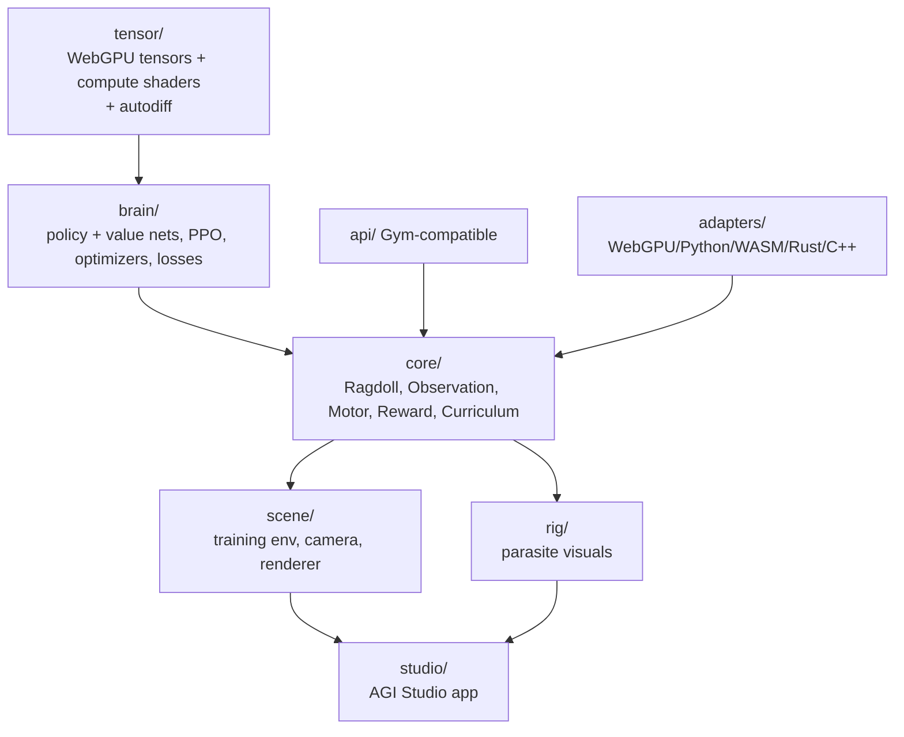

# AGI Architecture

How AGI is layered: a WebGPU tensor library at the bottom, neural networks above it, an RL control loop on top, and the rig visuals + Studio around it.

## Layers

## Tensor library (`agi/tensor/`)

A zero-dependency tensor implementation on WebGPU:

- Operations including softmax, layernorm, dropout.
- A compute graph for chaining operations.
- WebGPU compute shaders in `tensor/shaders/` (matmul, activation, reduction).
- Automatic differentiation (gradient tape) and a tensor cache for memory management.

## Neural networks (`agi/brain/`)

- **Policy network** (12→64→64→17, tanh) and **value network** (12→64→64→1, linear).
- **PPO trainer** (`brain/trainers/`), **optimizers** (Adam/AdamW/SGD), **losses** (policy/value/entropy), and training **utils** (GAE, normalizer, scheduler).
- Forward/backward passes and network serialization (save/load).

## RL control (`agi/core/`)

- **`RagdollController.js`** — the main training loop driving episodes.
- **`ObservationBuilder.js`** — builds the 12D observation each step.
- **`MotorController.js`** — applies the 17D action as bone impulses.
- **`RewardFunction.js`** — configurable reward weights.
- **`CurriculumManager.js`** — advances through the 7 training stages.
- **`MotionMatchingTeacher.js`** — motion-matching guidance.

## Scene and rig

- `scene/` — training scene controller, infinite grid ground, tracking camera, WebGPU scene renderer, debug visualizer.
- `rig/` — brain sphere with pulse animation, the 17-tentacle injection system, tentacle renderer (curved paths, electrical effects), and neural-activity visualization.

## Studio (`agi/studio/`)

A professional workspace app: core (`StudioApp`, project/workspace managers), panels (Scene/Training/Network/Curriculum), visual editors (Reward/Network/Curriculum/Action), visualizers (Graph/Network/Activation/Gradient), and tools (Exporter/Recorder/Benchmarker/Debugger).

## Multi-runtime + API

- `api/` exposes a Gym-compatible environment interface.
- `adapters/` provides optional WebGPU/Python/WASM/Rust/C++ runtime adapters.

## Performance targets

Physics 60 FPS (16.67 ms), neural inference < 5 ms/forward pass, rendering < 8 ms/frame, total memory < 1 GB.

## Genesis Ecology integration (planned)

AGI remains a shadow proposal and evaluation plane. It can score candidates,
learn proposal policies, extract descriptors, and support quality-diversity,
regulatory, role, cultural, and niche experiments. Existing PPO reward is not
the ecology's authority or universal fitness. Every candidate passes the
deterministic compiler, verifier, resource, security, and semantic-promotion
gates before CSE or ECS changes. See the
[Genesis Ecology WebGPU OS plan](../webgpu-os/genesis-ecology-os-plan.md).

## See also

- [Training Guide](training-guide.md).
- [Genesis Ecology WebGPU OS Plan](../webgpu-os/genesis-ecology-os-plan.md).
- AGI **API Reference** — `core/`, `brain/`, `tensor/`, `rig/`.
