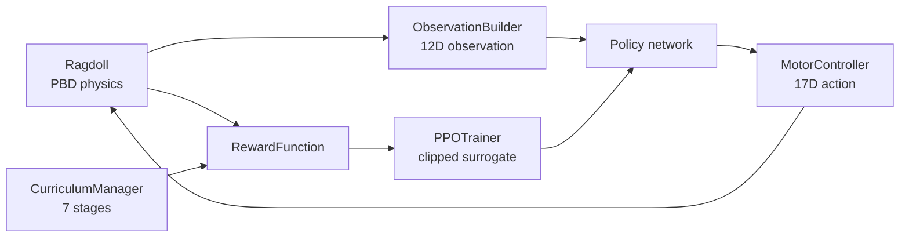

# AGI Overview

AGI (`agi/`) is a reinforcement-learning **animation rigging** system: a "Doc Octavius"-style mechanical **parasite rig** that injects into a humanoid ragdoll and learns to control it through RL. It ships its own WebGPU **tensor library**, neural networks, a curriculum system, and **AGI Studio** — a full training workspace application.

## What it provides

From `agi/README.md`:

- A custom **WebGPU tensor library** (`agi/tensor/`) with compute shaders (matmul, activation, reduction) and automatic differentiation.
- **Neural networks** (`agi/brain/`): policy + value networks, PPO trainer, experience buffer, optimizers, losses.
- **Core RL control** (`agi/core/`): ragdoll controller, observation builder, motor controller, reward function, curriculum manager, motion-matching teacher.
- A **parasite rig** visual system (`agi/rig/`): brain sphere, 17 tentacles, neural pulses, injection animation.
- **AGI Studio** (`agi/studio/`): a workspace app with panels, editors, visualizers, and tools.

## Audience

ML and animation developers training or extending the rig.

## How it works (RL loop)

- **Observation space (12D):** pelvis height, uprightness, angular velocity (3D), linear velocity (3D), ground contact (2D), target direction (2D).
- **Action space (17D):** one impulse-based action per controllable bone, range `[-1, 1]`.
- **Algorithm:** PPO (clipped surrogate objective) with GAE.

## Module map

| Module | Path | Purpose |
| --- | --- | --- |
| Core | `agi/core/` | RagdollController, ObservationBuilder, MotorController, RewardFunction, CurriculumManager, MotionMatchingTeacher |
| Brain | `agi/brain/` | policy/value networks, PPO trainer, optimizers, losses, training utils |
| Tensor | `agi/tensor/` | WebGPU tensor ops + compute shaders |
| Rig | `agi/rig/` | parasite rig visuals (injection, tentacles, brain) |
| Scene | `agi/scene/` | training scene, ground, camera, renderer, debug |
| Studio | `agi/studio/` | the AGI Studio workspace app |
| Runtime | `agi/runtime/` | runtime manager |
| API | `agi/api/` | Gym-compatible environment API |
| Adapters | `agi/adapters/` | multi-runtime adapters (WebGPU, Python, WASM, Rust, C++) |
| Loader / Config / Data | `agi/loader/`, `agi/config/`, `agi/data/` | model loading, hyperparameters/curriculum/rewards, data |

## Next steps

- [AGI Architecture](architecture.md).
- [AGI Getting Started](getting-started.md).
- [Training Guide](training-guide.md).
- AGI **API Reference** — generated from `agi/`.
