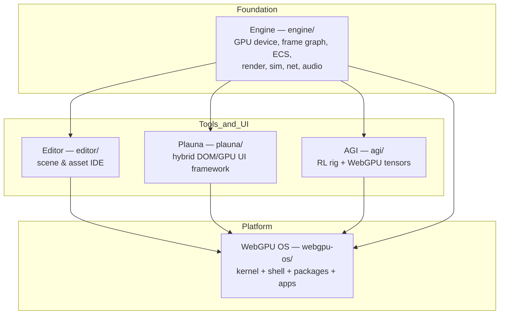

# Architecture Overview

This page is the big picture: how the engine, editor, Plauna, AGI, and the WebGPU OS compose into one system. Read it before diving into any single subsystem.

## Layered composition

The stack is built in reusable layers. Lower layers know nothing about higher ones; higher layers consume lower ones as libraries.

## The composition rule

`webgpu-os/` is **composition glue only**. It consumes `engine/`, `plauna/`, `agi/`, and `editor/` as libraries and must not fork them. If something needs fixing, it is fixed upstream in the owning subsystem, not patched inside the OS layer. (Source: `webgpu-os/AUDIT.md` §4.)

## How the OS maps onto the subsystems

The WebGPU OS does not reimplement runtime services — it *reuses* the engine and Plauna:

| OS concern | Provided by |
| --- | --- |
| Kernel / scheduler / GPU device | Engine `core/gpu/`, `core/framepipeline/`, `core/scheduler/`, `core/memory/`, plus `webgpu-os/kernel/` glue |
| Compositor / window manager / shell | Plauna `workspace/`, `surface/`, `widgets/`, `themes/` + `webgpu-os/shell/` |
| Filesystem / project / packages | Engine `core/ResourceManager.js`, `core/save/` + `webgpu-os/storage/` + `webgpu-os/packages/` |
| IPC / events / "syscalls" | Engine `core/events/`, Plauna `core/events.js` + `webgpu-os/kernel/Syscalls.js` |
| Intelligence layer | AGI `tensor/`, `brain/`, `core/` |

(Source: `webgpu-os/AUDIT.md` §3, "Asset inventory → OS subsystems".)

## Tier framing

The OS is delivered in tiers; **Tier 1 (browser-resident)** is the current implementation target:

| Tier | What it is | Status |
| --- | --- | --- |
| **1 — Browser-resident OS** | Desktop-like environment in a browser tab, built from the existing stack | **Implementation target** |
| **2 — WASM + native host** | Rust + Wasmtime/WASI host wrapping Dawn/wgpu, exposing capability-mediated APIs | Documented migration path |
| **3 — Native microkernel** | Kernel + user-space services around WebGPU/WGSL | Research-only |

A core decision (adopted from the research): **do not put WebGPU "in the kernel."** In every tier the GPU service is a user-space process owning validation, shader compilation, and pipeline creation; the kernel handles scheduling, memory protection, and device mediation only. This mirrors the browser GPU-process model.

### Tier 2 migration contract (stable surfaces)

These must survive a future Tier 2 swap, so treat them as the stable contract:

- **App manifest** — same JSON boots a Plauna panel today and a WASI sandbox tomorrow.
- **Syscall surface** (`kernel/Syscalls.js`) — JS shape today, WASI capability table tomorrow.
- **WGSL shaders** — already portable.
- **Capability gates** — the rule graph is the Tier 1 stand-in for the Tier 2 capability broker.

## Cross-cutting concerns

These topics span every subsystem and have dedicated pages:

- [Boot Sequence](boot-sequence.md) — how the OS comes up.
- [GPU Device Sharing](gpu-device-sharing.md) — one device, many apps.
- [Security & Trust Model](security-model.md) — capabilities, trust rings, package verification.
- [Data Flow](data-flow.md) — how state moves (ECS, save, collab).
- [Genesis Ecology](genesis-ecology.md) — the planned CSE, ECS, recipe, RealmForge, OS, AGI, and Virtual Realm developmental substrate.
- [History & Evolution](history-evolution.md) — why the layering looks the way it does.
