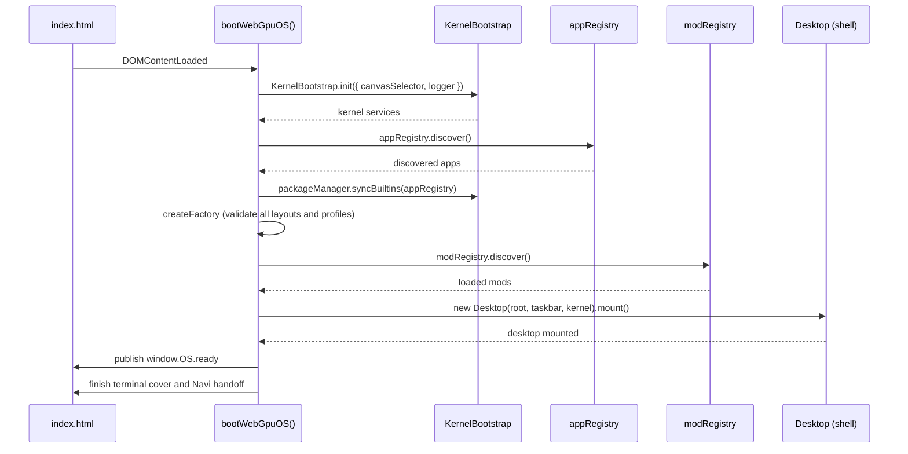

# Boot Sequence

How the WebGPU OS comes up, from the HTML page to a mounted desktop. This page describes readiness barriers and startup measurements for developers. Faster preparation does not bypass release verification, storage recovery, or operator authority.

## Entry points

- **`webgpu-os/index.js`** — a side-effect-free barrel exporting `bootWebGpuOS(options)`. Importing it does **not** auto-boot, which makes it the clean entry point for the static bundler (`bundle_engine.py --target webgpu-os`).
- **`webgpu-os/boot.js`** — a thin wrapper that calls `bootWebGpuOS()` on `DOMContentLoaded` for plain ES-module/dev usage.
- **`webgpu-os/bootstrap/boot.js`** — starts the stable host. `StableBootstrap.js` checks release routing, opens the install registry, reconciles release objects, and selects the installed runtime. Only an empty registry permits the legacy runtime path. A damaged installed release does not silently fall back to mutable source.

The packaged loader expands gzip, checks exact byte lengths and SHA-384 integrity, then executes the verified runtime. Stylesheet readiness remains ahead of runtime execution. (Sources: `webgpu-os/bootstrap/StableBootstrap.js`, `bundler/site.py`.)

Staged installed-runtime HTML uses that same verified loader with release-relative asset bases, then enters the existing guest endpoint through `boot.js`. The guest registers its parent-connection listener synchronously before waiting for loading or appearance projection; kernel startup still waits for the verified API and the parent's lifecycle context. A configured compiled-entry failure never falls back to raw source. Source-only runtime documents retain their ES-module entry path.

## The boot phases

`bootWebGpuOS()` runs these phases, updating the on-screen boot status as it goes:



1. **Initializing kernel** — `KernelBootstrap.init({ canvasSelector, logger })` brings up kernel services against the WebGPU canvas.
2. **Discovering apps** — `appRegistry.discover()` finds apps from `apps/` (errors are logged as warnings, not fatal). Discovered built-ins are synced into the package registry via `kernel.packageManager.syncBuiltins(appRegistry)` (idempotent).
3. **Factory and mods** — the Factory registers discovered app metadata and validates its built-in layouts and profiles. `modRegistry.discover()` then loads runtime mods from `mods/`, before application mounting.
4. **Mounting desktop shell** — `new Desktop(desktopRoot, taskbarRoot, kernel)` then `await desktop.mount()`. Missing shell root elements throw.
5. **Optional security self-tests** — when `window.__DEV__` is true or the URL contains `?securityAudit`: `auditSyscallGuards(kernel)`, `auditCapabilityMap()`, and `runSecurityDoctor(kernel)` run and log findings. `kernel.securityDoctor()` is also exposed for on-demand use.
6. **Ready** — the frozen `window.OS` publishes `ready: true` after required runtime and shell preparation. `bootWebGpuOS()` resolves after the terminal cover and Navi handoff settle. These are separate observable boundaries.

## Kernel init order

The kernel prepares two prerequisite lanes concurrently:

```text
GPU acquisition → scheduler
                         ↘
                          join → trust/packages → operator → intelligence → kernel-ready
                         ↗
identity → storage recovery/VFS migration → encrypted readback
```

Both lanes must settle before trust initialization. A failed or cancelled lane prevents later prerequisite publication; cleanup retires only kernel-owned resources. The shared StorageManager uses one initialization promise, becomes ready only after recovery and retention, and permits a new attempt after failure. Closing it fences late initialization work.

Trust roots precede package restoration and publisher/permission/profile setup. Operator freeze, drain, bind, and resume ordering remains unchanged. Verified Live Patch restoration precedes application mount hooks. Installed packages are re-registered, so installed apps survive a reload. (Sources: `webgpu-os/kernel/KernelBootstrap.js`, `webgpu-os/storage/StorageManager.js`.)

## Startup work that overlaps

- Factory layout/profile fetch and parsing use bounded concurrency. Registration remains in authored order, every result is validated, and Factory readiness waits for all required preparation.
- The shell prepares both GPU compositors asynchronously while independent desktop work runs. Mount and recovery wait for preparation. Cancellation and device-generation checks reject stale results; synchronous compositor mounting remains available to existing callers.
- Navi's RealmForge body host imports its default ID/radius from a small contract module, not the construction physics dependency graph. The original physics exports remain compatible.

These changes do not remove apps or disable initialization. (Sources: `webgpu-os/factory/layouts/index.js`, `webgpu-os/factory/profiles/index.js`, `webgpu-os/shell/Desktop.js`, `webgpu-os/apps/realmforge/modeler/navi/RealmForgeNaviBodyHost.js`.)

## Populated storage and verified restoration

OPFS full-tree traversal retains one iterator for the current directory across
pages instead of restarting enumeration at each numeric offset. Iterators belong
to one traversal and close on completion, cancellation, or failure. Public paged
reads retain their stateless cursor contract. Entry/depth limits remain enforced;
a larger account does not silently bypass them. Independent file metadata reads
use bounded concurrency. (Source: `webgpu-os/storage/OPFSDriver.js`.)

VirtualFS warms its synchronous text cache with a small batch of reads at a time.
Admission still follows the original size/path ordering, actual UTF-8 byte checks,
and per-path generation checks. The 64 MiB total and 16 MiB per-file defaults stay
unchanged. Full inventory and legacy migration still precede ready publication.
Its hydration receipt separates inventory, text loading, cache admission, and
migration; inventory bytes describe metadata, not the amount decoded into memory.
(Source: `webgpu-os/kernel/VirtualFS.js`.)

Kernel metadata readback reads at most four database stores concurrently and
authenticates the existing encrypted snapshot before comparing its complete
sanitized content. Unchanged content avoids a redundant encrypted rewrite; it
does not skip source reads or verification. `capturedAt` remains the durable
snapshot's capture time, while `verifiedAt` records the latest successful check.
Changed content publishes with the existing version-token comparison. Failed
verification cannot make initialization ready. (Source:
`webgpu-os/storage/KernelMetadataReadback.js`.)

AppSandbox inventory listing authenticates the generation head before and after
reading pages. A concurrent commit can retire a page; a changed head triggers a
bounded retry, including when the old page read failed. A missing or corrupt page
under an unchanged head remains an error. Listing does not repair, clear, or
rewrite conversation storage. (Source: `webgpu-os/storage/AppSandbox.js`.)

Readback verification separately measures successful lock waits, failed lock
waits, and authentication work. Segment readers compute SHA-256 and UTF-8 length
once for each freshly read immutable text value and reuse that evidence for the
observation and descriptor comparisons. There is no cross-read checksum cache;
before/after observations, bounded race retries, and encrypted entry verification
remain required. (Source: `webgpu-os/storage/AppSandbox.js`.)

AI Echo retains its restoration and verification barriers. Startup diagnostics
separate inactive-history hydration from the remaining verification-join wait and
the final head check. Provider, research, autonomy, recovery, presence, self-model,
adaptation, artifact, managed projection, and persistence work have named timings.
Concurrent branch durations overlap and must not be added to estimate wall time.
(Sources: `webgpu-os/apps/ai-echo/AgentStateStore.js`,
`webgpu-os/apps/ai-echo/factory.js`, `webgpu-os/apps/ai-echo/DiagnosticReport.js`.)

Loopback worker upgrades request reloads only from controlled top-level or
auxiliary windows within the OS scope. Nested runtime frames follow their host's
lifecycle; unrelated same-origin tabs are excluded. Production activation still
uses the existing approval flow. (Source: `webgpu-os/sw.js`.)

## Signed package assets and offline readiness

For the WebGPU OS target, the bundler moves large non-Faculty package containers into content-addressed `.prpkg` assets. Signed envelopes remain in the verified runtime. Faculty containers remain inline because their synchronous evidence checks run during boot; other build targets retain the existing inline format.

`PackageManager.init()` waits for referenced containers to pass exact-length and SHA-256 admission. Package installation still performs its existing signature and authority verification. Export cannot silently replace a missing or corrupt official asset with a locally re-signed package. Build and deployment inventories verify that the referenced assets ship with the runtime.

Verified containers remain resident for current-run offline exports. The preparation receipt separately reports how many were persisted in CacheStorage; a browser that refuses persistence cannot promise availability after a later offline restart. No late warming step is presented as completed offline preparation. (Sources: `webgpu-os/packages/OfficialPackageRegistry.js`, `webgpu-os/packages/PackageManager.js`, `bundler/official_inventory.py`.)

## Measuring the complete wait

Read `window.OS.bootTelemetry` for an immutable current snapshot:

- `durationMs` and `samples` retain the existing **runtime-only** measurements.
- `navigation.runtimeStartedAtMs`, `runtimeReadyAtMs`, and `surfaceReadyAtMs` use the current document's navigation clock. `terminalMs` covers the final cover/handoff interval. An installed guest labels its scope `runtime-frame`; its clock is not the parent page's end-to-end boot.
- `loader.stages` reports fetch, decompression, integrity, and script-evaluation durations in packaged builds. Absent or incomplete measurements are `null`, not zero. The diagnostic contains no URLs, package contents, or private error text.
- `prerequisites` reports actual GPU/storage lane wall times and overlap. Monotonic display-phase deltas are not independent lane timings.
- `shellPreparation` distinguishes ready GPU surfaces from an unavailable GPU or the existing GPU UI DOM fallback.

The normal terminal ceremony holds for 120 ms and fades for 180 ms. Reduced motion uses no extra hold or fade. Readiness, single-avatar ownership, failure/reset handling, and the hidden-cover handoff remain enforced. Diagnostic callbacks cannot turn a successful boot into a failure. (Sources: `webgpu-os/platform/runtime-host/BootTelemetry.js`, `webgpu-os/platform/runtime-host/StableBootProgress.js`, `webgpu-os/index.js`.)

Run repeatable empty-profile observations against a completed package:

```bash
python tests/run_webgpu_os_boot_performance.py --rounds 3 --output tmp/boot-observation.json
```

The output path must be new. The runner uses isolated browser contexts, measures cold and warm navigation, and never seeds a Passport or opens an assistant conversation. Results are local observations, not authenticated-account benchmarks or guaranteed latency targets.

## Boot options

`bootWebGpuOS(options)` accepts selector overrides (defaults shown):

| Option | Default |
| --- | --- |
| `canvasSelector` | `#os-gpu-canvas` |
| `desktopSelector` | `#os-desktop` |
| `taskbarSelector` | `#os-taskbar` |
| `statusSelector` | `#os-boot-status` |
| `loaderSelector` | `#os-boot-loader` |
| `logger` | `console` |

## Failure handling

If any phase throws, the boot status is set to `Boot failed: <message>`, the error is logged via `logger.error`, and the promise rejects. App/mod discovery errors are non-fatal and surface as console warnings.

## See also

- [GPU Device Sharing](gpu-device-sharing.md) — what the kernel sets up on the canvas.
- [Security & Trust Model](security-model.md) — what the boot-time audits check.
- WebGPU OS **API Reference** — `KernelBootstrap`, `AppRegistry`, `Desktop`.
