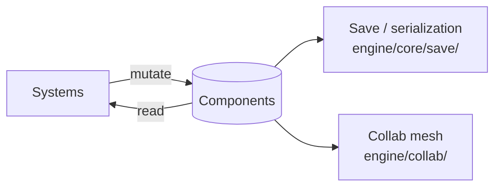
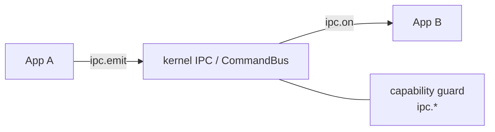

# Data Flow

How state moves through the stack: ECS state, persistence, the virtual filesystem, inter-app messaging, and optional multi-user sync. This page orients you before the per-subsystem references.

## State lives in ECS

The engine is **ECS-driven**: runtime state lives in components, owned by a world, and mutated by systems. Plauna defines its own UI components in a dedicated UI world (e.g. `UIRoot`, `UIWorkspace`, `UIZone`, `UIView`, `UILayout`, `UISurface`, `UIText`). See:

- Engine ECS: `engine/ecs/` (`EntityManager`, `EntitySchema`, components, systems, world).
- Plauna UI ECS: `plauna/ecs/` and `plauna/core/StateStore.js` + `DirtyGraph.js`.

## Persistence and the filesystem

The OS exposes a virtual filesystem and storage layer over browser primitives:

| Layer | Component | Backed by |
| --- | --- | --- |
| Virtual FS (syscall-facing) | `kernel/VirtualFS.js`, `storage/SystemFS.js` | OPFS / IndexedDB |
| Origin-private files | `storage/OPFSDriver.js` | OPFS |
| Key-value / structured | `storage/IndexedDBDriver.js` | IndexedDB |
| External mounts | `storage/MountDriver.js` | user-picked dirs |
| Caching | `storage/CacheDriver.js` | Cache API |
| Per-app isolation | `storage/AppSandbox.js` | scoped paths |
| Orchestration | `storage/StorageManager.js` | — |

Engine-side asset/resource loading and save go through `engine/core/ResourceManager.js`, `engine/core/compression/`, and `engine/core/save/`.

## Inter-app messaging (IPC)

Apps communicate through kernel-mediated IPC syscalls (`ipc.emit` / `ipc.on`), gated by capabilities. Lower-level event buses exist in the engine (`engine/core/events/`) and Plauna (`plauna/core/events.js`), and the kernel adds buses such as `CommandBus`, `FxBus`, and `PatchBus`.

## Optional multi-user sync

For collaborative or multi-user scenarios, the engine's collab mesh (`engine/collab/`) provides identity, integrity, presence, signaling, host migration, and scene/transform sync. State that needs to be shared is replicated over this mesh; identity and integrity are enforced by `CollabIdentity`, `CollabCrypto`, and `CollabIntegrityVerifier`.

## Authoritative UI state

[Particle State Channels](state-channels.md) connect Plauna views to ECS, CSE, or another authority. UI events become typed intents. Confirmed snapshots or merge patches return as projections. SSE is the standard downstream browser transport, paired with HTTP `POST` for upstream intents. Particle signaling and BroadcastChannel remain available for peer-oriented routes. (Source: `engine/network/stateChannels/`, `plauna/core/BindingEngine.js`)

## End-to-end example

A note created in the **Notepad** app:

1. The app calls `fs.write` (a guarded syscall) → `kernel/VirtualFS.js` → `storage/OPFSDriver.js`.
2. The capability guard checks `fs.write` against the app's grants.
3. On reload, `PackageManager` re-registers the app and its sandboxed storage path persists, so the note is still there.

## See also

- [GPU Device Sharing](gpu-device-sharing.md) — GPU resource flow.
- [Security & Trust Model](security-model.md) — how the syscalls above are gated.
- [Particle State Channels](state-channels.md) — authoritative intent and projection flow.
- Engine, Plauna, and WebGPU OS **API References**.
