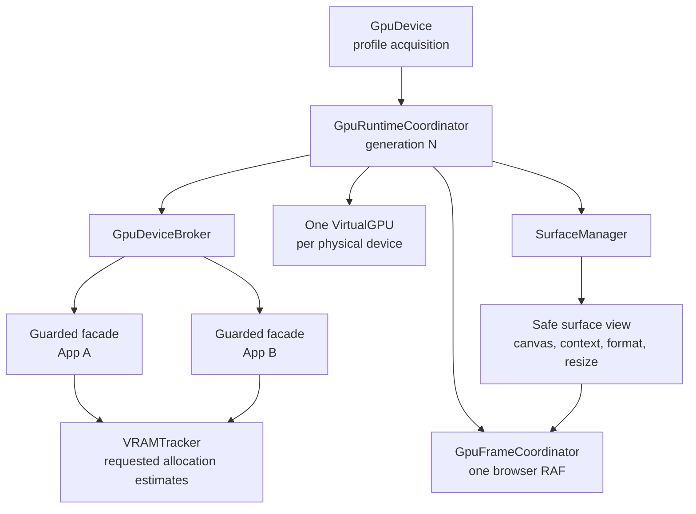

# GPU Device Sharing

WebGPU OS uses one shared GPU device in its Window realm. The kernel publishes
that device as a generation, gives applications guarded facades, owns canvas
surfaces, and admits continuous GPU work through one frame coordinator. This
page is for application and Engine authors who need to allocate GPU resources
without bypassing that authority.

Standalone Engine programs and render workers have separate, explicit ownership
policies. They do not borrow the OS device implicitly. (Source:
`engine/core/gpu/GpuDeviceOwnership.js`.)

## Why one Window device

WebGPU devices are expensive, and the browser already isolates GPU work in a
dedicated process. WebGPU OS therefore shares one Window-owned device instead
of letting each application acquire another one.

The shared model gives the kernel one place to enforce:

- application allocation estimates and quotas;
- device-generation validity;
- surface ownership and resize policy;
- continuous frame cadence and background suspension; and
- transactional loss recovery.

> **Design rule:** the GPU service is user-space, not "in the kernel." The
> kernel mediates authority, accounting, recovery, and scheduling. WebGPU still
> performs validation, shader compilation, resource transitions, and execution.
> See the [Architecture Overview](architecture-overview.md).

## Key components

| Concern | Component |
| --- | --- |
| Adapter/device acquisition and capability profiles | `engine/core/gpu/GpuDevice.js` |
| Published device generation and recovery transaction | `webgpu-os/kernel/GpuRuntimeCoordinator.js` |
| Guarded per-application device facade | `webgpu-os/kernel/GpuDeviceBroker.js` |
| Allocation estimates and quotas | `webgpu-os/kernel/VRAMTracker.js` |
| One shared VGPU graph per physical device | `engine/core/gpu/VirtualGPU.js` |
| Continuous GPU frame admission | `webgpu-os/kernel/GpuFrameCoordinator.js` |
| Canvas configuration, resizing, and recovery | `webgpu-os/kernel/SurfaceManager.js` |
| Explicit shared, dedicated, diagnostic, and worker policies | `engine/core/gpu/GpuDeviceOwnership.js` |
| Worker-owned OffscreenCanvas rendering | `engine/core/gpu/GpuRenderWorkerHost.js` and `GpuRenderWorker.js` |

## Authority model



Applications never receive `GPUDevice.destroy()` through a shared facade. A
facade validates its application owner, broker epoch, and device generation on
every forwarded call. It returns real WebGPU resources while recording their
requested allocation sizes. The raw device remains available only to
kernel-owned adapters through internal wiring. (Source:
`webgpu-os/kernel/GpuDeviceBroker.js`.)

`SurfaceManager` creates and configures each application canvas. An application
receives a frozen view with `canvas`, `context`, `format`, `generation`, `size`,
and `resize()`. The view does not expose the physical device. The manager clamps
dimensions to device limits, applies the runtime's safe canvas usage, accounts
for the surface, and preserves the last valid configuration when a resize fails.
(Source: `webgpu-os/kernel/SurfaceManager.js`.)

## Device generations and loss recovery

Every published resource graph belongs to one integer device generation. When
the browser reports device loss, `GpuRuntimeCoordinator` performs this sequence:

1. It rejects new GPU frames and removes the lost device from publication.
2. It invalidates application facades, surfaces, VGPU leases, profilers, and
   other registered generation participants.
3. It reacquires the exact retained capability profile with bounded retries.
4. Each participant stages a complete replacement resource graph offside.
5. The coordinator commits every staged participant and publishes generation
   `N + 1` atomically.
6. It resumes only consumers that restored successfully.

If staging fails, the coordinator rolls back the candidate and keeps GPU frame
admission closed. No buffer, texture, pipeline, bind group, query set, facade,
or canvas configuration from generation `N` is valid in generation `N + 1`.
(Source: `webgpu-os/kernel/GpuRuntimeCoordinator.js`.)

## Frame scheduling

`GpuFrameCoordinator` owns the browser animation frame used for continuous OS
GPU work. Producers register an owner, surface, target frame rate, priority,
generation, and synchronous encode callback. The coordinator orders admitted
work, suspends hidden or minimized surfaces, adapts cadence to measured cost,
and reports bounded CPU and GPU timing histories. Device loss pauses the lane
until the next generation binds. (Source:
`webgpu-os/kernel/GpuFrameCoordinator.js`.)

UI-only one-shot animation frames may remain local. A continuous loop that
encodes or submits GPU work must join the coordinator.

## Capability profiles

Device acquisition uses named workload profiles instead of requesting every
available feature and the largest limits globally. A profile declares required
features, optional features, minimum limits, fallbacks, affected modules, and a
verification contract. Examples include `baseline-render`, `voxel-512`,
`compressed-textures`, `timestamp-profiling`, `wide-gamut-presentation`, and
`compatibility`. (Source: `engine/core/gpu/GpuDevice.js`.)

A caller that asks an active profile for incompatible capabilities receives an
explicit mismatch. It never silently inherits the first caller's policy. The
profile cache uses single-flight acquisition and evicts lost or destroyed
generations before reacquisition.

## Explicit ownership outside WebGPU OS

Standalone and worker consumers must select one ownership policy:

| Policy | Use |
| --- | --- |
| `shared-kernel` | Borrow an injected OS device; the consumer must not destroy it. |
| `dedicated-owned` | Own a deliberately separate device and destroy it during teardown. |
| `standalone-fallback` | Prefer injection, but acquire and own a device when no host exists. |
| `diagnostic-temporary` | Acquire a short-lived probe device with explicit cleanup. |
| `worker-owned` | Let one render worker own its device and transferred OffscreenCanvas. |

Use an ownership lease so cleanup follows the policy:

```javascript
import { acquireGpuDeviceForConsumer } from '/engine/core/gpu/GpuDeviceOwnership.js';

export async function submitWithInjectedDevice(injectedDevice) {
  const lease = await acquireGpuDeviceForConsumer({
    ownerId: 'material-preview',
    ownership: 'shared-kernel',
    device: injectedDevice,
  });

  try {
    const encoder = lease.device.createCommandEncoder();
    lease.device.queue.submit([encoder.finish()]);
  } finally {
    lease.release(); // Never destroys an injected shared-kernel device.
  }
}
```

WebGPU objects are not general cross-worker transfer objects. The worker path
transfers an `OffscreenCanvas`, creates the device inside that worker, and sends
structured CPU commands and results across the boundary. (Source:
`engine/core/gpu/GpuRenderWorkerHost.js` and
`engine/core/gpu/GpuRenderWorker.js`.)

## Application contract

- Request a guarded device and a kernel-configured surface from the OS API.
- Treat every GPU object as generation-bound and reconstructable.
- Release every buffer, texture, surface, frame registration, and ownership
  lease during unmount.
- Report allocation sizes as estimates, not measured physical VRAM.
- Use one VGPU lease per owner; the registry reuses one manager graph for the
  physical device.
- Do not add explicit barriers, native queue claims, or serialized WebGPU
  pipelines. WebGPU owns transitions and exposes one queue; host objects are
  opaque.

## See also

- [Boot Sequence](boot-sequence.md) explains when the runtime publishes its
  first device generation.
- [Architecture Overview](architecture-overview.md) places the GPU service in
  the wider kernel and user-space model.
- Engine **API Reference** documents `core/gpu/*` modules.
- WebGPU OS **API Reference** documents the kernel broker, runtime coordinator,
  frame coordinator, surface manager, and VRAM tracker.
