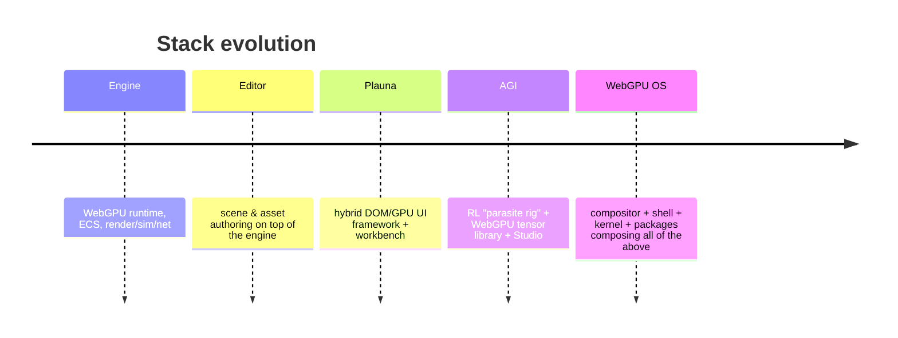

# History & Evolution

This is the canonical story of how the stack grew. Understanding the order in which the layers appeared explains why the boundaries sit where they do — and why `webgpu-os/` is glue rather than a rewrite.

## The order of creation

### 1. Engine

The foundation. A **pure-browser, GPU-first** runtime: a shared WebGPU device, frame graph, ECS, rendering pipeline, simulation systems, networking, and audio. Everything else consumes it. Its development principles — no Node.js, GPU-first, ECS-driven, modular — propagate to every later layer. (Source: `engine/README.md`.)

### 2. Editor

The first major application built on the engine: a scene and asset authoring IDE (`editor/`). It established the panel/workbench patterns and the project/filesystem abstraction (`editor/js/ProjectManager.js`) that Plauna and the OS later generalize.

### 3. Plauna

A UI runtime extracted to serve UI needs the editor exposed. Plauna adds **hybrid DOM/GPU rendering**, DOM-free text measurement, a GPU **surface graph**, and a **dockable workbench** (workspaces, panels, tabs). It integrates with the engine using the same bootstrap and VGPU patterns as the editor, and is explicitly **zero-dependency, no build step**. (Source: `plauna/README.md`.)

### 4. AGI

An intelligence layer: a "Doc Octavius"-style **parasite rig** that injects into a humanoid ragdoll and learns to control it via reinforcement learning (PPO). It ships its own **WebGPU tensor library** (`agi/tensor/`), neural networks (`agi/brain/`), a curriculum system, and **AGI Studio** — a full training workspace application. (Source: `agi/README.md`.)

### 5. WebGPU OS

The unifying layer. Rather than rebuild runtime services, it **composes** the engine, Plauna, AGI, and editor into a desktop-like, GPU-first **OS in a browser tab**: a kernel (syscalls, scheduling, GPU mediation, trust/permissions), a shell (desktop, taskbar, windows), a signed package system, and a runtime app catalog. (Source: `webgpu-os/AUDIT.md`.)

## Why documentation stopped — and why it's being redone

Documentation was written per-layer as each was built, then drifted as the OS absorbed everything. The result was scattered across `docs/`, `webgpu-os/docs/`, `engine/docs/`, and many per-component `.md` files, with overlapping and stale content.

This `MD/` set restructures all of it into one audience-segmented source of truth, leaving the original files in place as read-only references. See the [Contribution Workflow](../contributing/doc-contribution-workflow.md) for how to keep it from drifting again.

## Naming note

Older docs and source headers may refer to the project as **"Particle Engine" / "Particle Engine v2"** and to game content as **"Particle Realms Online."** These are the historical names of the engine and a game built on it; the current umbrella is the **WebGPU OS** stack described here.
