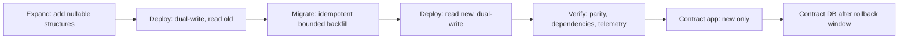

# Schema Evolution and Expand-Contract

Particle Realms treats every durable or independently deployed data boundary as a versioned contract. This includes SQLite tables, JSON files, browser storage, OPFS trees, binary saves, network messages, checkpoints, and signed packages.

The expand-contract pattern applies directly to the active SQLite service and to any storage layout shared by old and new application instances. The same safety goal applies elsewhere, but the mechanism changes with the medium: JSON uses explicit readers and pure upcasters, live protocols negotiate overlapping versions, signed artifacts use immutable generations, and disposable caches are namespaced and invalidated.

The machine-readable source of truth is `schema-contracts/catalog.json`. Its meta-schema is `schema-contracts/catalog.schema.json`, and `tools/validate_schema_contracts.py` checks the catalog, every first-party JSON document, every formal JSON Schema, and every direct production use of browser persistence APIs. A browser-storage call must be owned by a declared contract or carry one exact, reviewed classification such as primitive preference, ephemeral session state, disposable cache, storage infrastructure, or compatibility shim. Structured durable state cannot be hidden behind an exclusion.

Expand-contract is not a blanket rewrite rule. It is the correct mechanism for relational columns, shared browser keys, and rolling network deployments. Immutable hashed events, signed packages, procedural voxel snapshots, and disposable caches need different strategies because dual-writing them would weaken integrity or manufacture a lossy conversion.

## Non-negotiable invariants

1. Every authoritative value has a format discriminator and an explicit version.
2. Writers emit one declared current version. Readers may accept an ordered compatibility window.
3. Reading never silently relabels old data. A pure migration must produce the new shape and pass the new validator.
4. Unknown and future durable versions fail closed without overwriting the source.
5. Durable commits are transactional, copy-on-write, manifest-last, or generation-swapped. A partially written value is never promoted as current.
6. Rollback data remains readable until the catalog's retirement gates pass.
7. Cache records are never treated as authoritative. They may be invalidated and rebuilt.
8. Signed packages are immutable. A schema change creates a new signed generation; it never mutates an installed generation in place.

## One policy, five mechanisms

| Contract class | Evolution strategy | Commit boundary | Unknown version |
| --- | --- | --- | --- |
| SQLite authoritative data | Expand, backfill, switch reads, contract | One database transaction per migration or backfill batch | Reject startup/readiness |
| JSON, IndexedDB, OPFS, binary saves | Read old, pure upcast in memory, validate, copy-on-write | Verified backup, manifest-last, or generation swap | Reject or quarantine |
| WebSocket, SSE, HTTP envelopes | Advertise capabilities and negotiate current plus previous | Acknowledged message or request transaction | Protocol error; never reinterpret |
| Signed package/export | Side-by-side immutable generation | Verify hashes/signature, then publish manifest | Reject |
| UI and derived cache | Namespace by version and rebuild | Replace disposable entry | Invalidate |

## Repository coverage

The catalog currently records 125 independently evolving contract families. The implementation wave covers the following high-risk boundaries:

- The Python service uses ordered, checksummed SQLite migrations and transactional cursor-based backfills. Physical drift checks include columns, defaults, nullability, checks, unique keys, indexes, and foreign keys. (Source: `server/database/migrations.py`, `server/database/db.py`.)
- Engine and Life saves use exact format readers. World WAL recovery validates the entire sequence, CRCs, entry types, coordinates, lengths, and LSN order before replay. Flush and checkpoint share one operation queue, and a failed region save cannot truncate the log. ANI motion NPZ files use bounded arrays, `allow_pickle=False`, an explicit v2 manifest, and a legacy v1 reader. (Source: `engine/world/storage/WorldStorage.js`, `Life/tools/ani_motion_contract.py`.)
- State channels, chunk networking, LLLM, and master-server routes keep an explicit overlapping protocol window. Request and receipt identities remain bound to the originating client and authority epoch. MATS currently uses an additive, fire-and-forget WebSocket envelope with a bounded legacy reader; it does not claim capability negotiation or acknowledgements that the transport does not implement. (Source: `engine/network/stateChannels/StateChannelContract.js`, `engine/world/storage/ChunkNetworking.js`, `lllm/proto/lllm_protocol.py`, `editor/mats/js/workflow-contracts.js`.)
- Editor projects, scenes, assets, material graphs, audio graphs, and MATS workflows validate staged documents before replacing live state. MATS writes the canonical v1 record last and retains its legacy bare-array shadow during the expand phase. (Source: `editor/js/storage/GameEditorDatabase.js`, `editor/js/components/GraphPersistenceContracts.js`, `editor/mats/js/workflow-contracts.js`.)
- AGI checkpoints, conversations, tensor indexes, model registries, and model packages use validated envelopes and manifest-last or verified copy-on-write publication. One filesystem-safe model ID validator prevents path collisions. (Source: `agi/persistence/CheckpointContracts.js`, `agi/llm/formats/LLMPersistenceContracts.js`, `agi/llm/storage/AtomicJSON.js`.)
- Plauna themes, page transitions, design tokens, and widget imports have explicit readers. Theme ownership has one legacy writer, and widget collections reject prototype-polluting identifiers. (Source: `plauna/themes/ThemePreference.js`, `plauna/motion/PageTransitionContracts.js`, `plauna/style/DesignTokenContracts.js`, `plauna/widgets/WidgetConfig.js`.)
- WebGPU OS profiles, app settings, VFS metadata, app manifests, causal events, AI Echo state, sandbox records, backup manifests, credential vaults, shell preferences, built-in app state, shortcut overrides, and extension credentials fail closed on future versions. VFS writes and subtree deletes are hierarchically serialized. AI Echo commits versioned, hashed shard generations through one global manifest; credential envelopes authenticate provider and generation in their AAD. (Source: `webgpu-os/drivers/ProfileDriver.js`, `webgpu-os/kernel/VirtualFS.js`, `webgpu-os/apps/ai-echo/AgentStateStore.js`, `webgpu-os/kernel/schema/ShellPreferenceRecords.js`.)
- RealmForge `.proasset` documents, migration evidence, persistent history, drafts, recovery evidence, and content-addressed binary descriptors publish manifests last and retain exact legacy readers. Engine sound palettes, spells, materials, particle effects, collaboration identities, realm branches, and legacy chunk persistence now use bounded records instead of shape inference. (Source: `webgpu-os/apps/realmforge/document/`, `engine/core/schema/BrowserRecordContract.js`, `engine/world/storage/ChunkPersistence.js`.)
- AGI Studio directory handles remain native structured-cloned handles inside a versioned transactional envelope. Editor and MATS settings, hotkeys, recent projects, environment state, collaboration rooms, audio state, and camera state share one owner per key and retain rollback-readable legacy shadows. (Source: `agi/studio/core/StudioDirectoryHandleStore.js`, `editor/js/storage/EditorPreferenceContracts.js`, `editor/mats/js/settings-contract.js`.)
- Matrix, Cardbattles, Game2, the Python client, JHC, and bundler artifacts now have explicit durable or immutable boundaries instead of shape inference. (Source: `Matrix/src/settings-store.js`, `cardbattles/src/core/SessionContract.js`, `game2/client/src/core/SchemaContracts.js`, `client/src/particle_client/json_contracts.py`, `jhc/implementations/python/jhc/package.py`, `bundler/config.py`.)

`engine/core/schema/SchemaEvolutionRegistry.js` is the shared browser-side primitive for JSON-like values. It records exact readable and writable versions, rejects ambiguous or cyclic migration graphs, fingerprints inputs, requires synchronous side-effect-free adapters, and validates every intermediate value. Persistence remains outside the registry so a caller can choose the correct atomic commit strategy.

## Relational expand-contract

The active Python service owns an ordered, checksummed SQLite migration ledger. Startup uses `BEGIN IMMEDIATE`, verifies migration history and physical schema drift, and refuses databases created by a newer server. Backfills persist their cursor and data in the same transaction, so a batch can be retried without skipping rows.

For a column rename, do not rename or drop the old column in the first deployment. Add the new column nullable, deploy dual writes, backfill in bounded batches, switch reads while retaining dual writes, and only then stop old writes. `NOT NULL`, uniqueness, and removal belong in the final contract migration after all gates pass.

Each migration has a stable identifier and checksum. Editing a migration that has already shipped is schema drift; add a new migration instead. Readiness exposes the migration status so an incompatible instance is removed from service instead of returning corrupt or misleading results.

## Document and browser-storage evolution

For JSON, IndexedDB, local storage, and OPFS:

1. Decode with strict JSON rules and resource bounds.
2. Inspect the format and version before applying defaults.
3. Validate the source version.
4. Plan an explicit path to the write version.
5. Run pure, deterministic adapters without mutating the source.
6. Validate each intermediate version and the final value.
7. Write a pending copy or new generation.
8. Read it back and verify it before changing the current pointer or manifest.
9. Retain the previous generation for rollback.

Import paths are staged before they can replace editor projects, scenes, AGI checkpoints, models, profiles, or OS state. A malformed import or future version leaves the active value untouched. Large directory exports publish their manifest last, which makes an incomplete directory visibly incomplete instead of deceptively current.

An adapter may deliberately use `read-old-write-current` when a legacy value cannot be rewritten without external procedural context. For example, a full voxel snapshot cannot be converted into a current diff without its baseline world. In that case the version-specific reader validates and applies the legacy semantics, the writer still emits only the current format, and the source is not deceptively relabelled.

IndexedDB database versions and record schema versions solve different problems. The IndexedDB version upgrades object stores and indexes. Each durable record still needs its own format/version envelope and reader policy. Multiple features must not open the same database name with unrelated upgrade callbacks; the editor now has one owner for its shared database upgrade path.

`webgpu-os/storage/IndexedDBDriver.js` exposes an opt-in synchronous record migration hook, but it does not pretend that one schema covers a heterogeneous object store. Production stores mix packages, registry families, trust records, pointers, and encrypted profiles. Store owners must first add key-family matching and, where required, staged asynchronous verification before registering those records.

The world WAL keeps one additional deliberate compatibility boundary. WAL v1 can replay writes, but its historical wire format has no delete tombstone. Region deletion is generation-safe and atomically persisted today, but crash replay of an uncheckpointed delete requires a phased WAL v2 rollout: deploy the v2 reader first, then the v2 writer, retain v1 reads through the rollback window, and only retire v1 after dependency and telemetry gates pass. The implementation does not silently reinterpret a v1 record as a deletion.

## Protocol evolution

State channels, chunk networking, and LLLM transports advertise supported versions and select an overlap. During a rolling deployment the compatibility window is current plus previous. New senders continue to understand the previous reader until compatibility telemetry shows no old peers.

A message version is not inferred from its shape. Oversized messages, unsafe object keys, non-finite numbers, malformed fields, duplicate or stale response identifiers, and unsupported future versions are rejected at the boundary. A legacy unversioned reader exists only where the catalog explicitly records it; writers never emit the legacy shape.

## Retirement gates

An old field, key, reader, table, object store, protocol, or generation may be removed only after every applicable catalog gate is evidenced:

- `backfill-complete`: no rows or records remain unmigrated.
- `zero-discrepancy`: old and new representations agree.
- `dependency-audit`: application code, services, analytics, jobs, tests, and tools no longer depend on the old contract.
- `compatibility-telemetry-zero`: no old-version reads, writes, peers, or fallbacks were observed for the agreed window.
- `rollback-window-expired`: the rollback deployment and data-retention window has elapsed.
- `verified-backup`: a tested recovery copy exists before destructive contraction.

The catalog phase stays `expand`, `migrate`, or `read-new` until the evidence exists. A code merge alone is not evidence that contract is safe.

## Deployment and rollback runbook

Before deployment:

1. Add or update the catalog entry and compatibility fixtures.
2. Add the old-reader/new-writer and new-reader/old-writer tests appropriate to the contract.
3. Run `python tools/validate_schema_contracts.py`.
4. Run `python tools/run_schema_compatibility.py` for the release gate. Use `--static-only` for a fast non-browser pass and `--full` for extended validation.
5. Capture a verified backup for destructive or authoritative changes.

During deployment, expose migration/backfill state through readiness or diagnostics and watch rejection, fallback, quarantine, discrepancy, and backfill counters. Stop the rollout if instances disagree on the compatibility window, a checksum changes, drift appears, or any future version is encountered.

Rollback application code before contracting storage. Because the expand and migrate phases retain the previous representation, the previous application version can continue reading it. If a newly written generation is bad, restore the verified backup or previous manifest/generation; do not attempt to relabel it.

After the observation window, record gate evidence, switch the catalog phase, and perform contraction as a separate release. Re-run the same compatibility gate after removal.

## Adding a contract

Add a catalog entry with an owner, classification, medium, strategy, phase, owned paths, version field, one write version, all readable versions, unknown-version behavior, commit and rollback strategies, implementation components, and retirement gates. The validator rejects duplicate identities, missing paths, nonexistent declared symbols, missing enforcement components, incoherent policies, unversioned live protocols, destructive cache rules applied to durable data, and invalid JSON Schemas.

Prefer a small fixture matrix over only a same-version round trip:

| Writer | Reader | Required result |
| --- | --- | --- |
| Previous | Current | Accepted and upcast without source mutation |
| Current | Previous | Accepted only during an intentional dual-write/protocol window |
| Current | Current | Exact validated round trip |
| Future | Current | Explicit rejection; durable source preserved |
| Corrupt/partial | Current | Rejection, quarantine, rollback, or cache invalidation per policy |

## Audit baseline

The 2026-08-08 repository scan indexed 10,675 first-party files. The current release gate parses 385 JSON documents, validates 26 formal JSON Schemas, and inspects 111 production files that directly call browser-persistence APIs. Of those files, 71 are contract-owned, 46 have exact reviewed classifications, six are intentionally mixed, and zero are uncovered. The scan records 80 local-storage, 12 session-storage, 21 IndexedDB, and six OPFS API occurrences. That breadth is why schema evolution is enforced as a cross-stack contract rather than a database-only convention.

See also [Data Flow](data-flow.md), [Security & Trust Model](security-model.md), and [Particle State Channels](state-channels.md).
