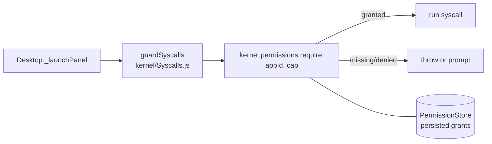
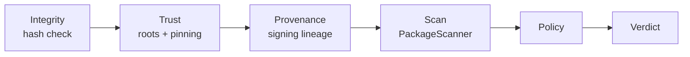

# Security & Trust Model

How the OS contains code it runs. Apps and mods are **capability-gated** and packages carry a **trust verdict**; the two combine so that untrusted code is contained even if it declares broad permissions. This page consolidates `webgpu-os/docs/PERMISSIONS_MODEL.md` and `PACKAGING.md`.

## Two enforcement layers

1. **Capabilities** — a package may only call a syscall if it *declared* the matching permission **and** the user/policy *granted* it.
2. **Trust verdict** — the result of verifying the package's integrity, signature, provenance, and scan risk. The verdict can override grants (e.g. block network egress regardless of declared permissions).

## Capability enforcement

- A package declares `permissions` in its manifest.
- At launch, `Desktop._launchPanel` wraps the panel's syscalls with `guardSyscalls(kernel, appId, syscalls)`.
- Each guarded method calls `kernel.permissions.require(appId, cap)` before running; missing/denied capabilities throw or prompt per policy.
- `kernel/Permissions.js` resolves decisions; `PermissionStore` persists grants.

### Permission vocabulary

Capabilities are dotted strings. Declare only what you use — the consent prompt lists requested permissions.

| Namespace | Examples | Gated action |
| --- | --- | --- |
| `fs.*` | `fs.read`, `fs.write`, `fs.delete`, `fs.list` | virtual filesystem |
| `storage.*` | `storage.read`, `storage.write`, `cache.get`, `mount-pick` | OPFS / cache / mounts |
| `ipc.*` | `ipc.emit`, `ipc.on` | inter-app messaging |
| `gpu.*` | `gpu.getDevice` | raw GPU device |
| `ai.*` | `ai.infer` | model inference |
| `net.*` | `net.send`, `net.on` | network egress |
| `ui.*` | `ui.notify`, `ui.modal` | shell UI |
| `package-install`, `package-remove`, `patch-apply` | — | package/patch management |

## Trust verdicts → capability defaults

Installed packages carry a verdict (`PackageManager.getTrustProfile(appId)`):

| Verdict | Network egress | Notes |
| --- | --- | --- |
| `trusted` (root-chained) | as granted | full capability set available to grant |
| `pinned` (TOFU) | as granted | accepted by the user on first install |
| `untrusted` (self-signed, unpinned) | **no auto-grant** | restricted; must be explicitly granted |
| `quarantined` (integrity fail / high scan risk / key change) | **hard-blocked** | `guardSyscalls` throws on any `net.*` regardless of grants |

This is **default-deny egress**: it blunts credential exfiltration and worm C2 even if a malicious package declares `net.send`.

## The verification choke point

All installs route through `PackageManager.verifyAndAuthorize()` (Source: `webgpu-os/docs/ARCHITECTURE.md`):

- **Ring-0 roots** live in `kernel/trust/roots.json`; `kernel/TrustStore.js` handles roots + publisher pinning.
- **Provenance** is checked by `kernel/ProvenanceChecker.js` and `kernel/SigningLineage.js`.
- **Scanning** is performed by `packages/PackageScanner.js`.

## Consent & trust-on-first-use (TOFU)

- First install of a self-signed package prompts with: **publisher fingerprint**, **trust verdict**, **scan risk**, and **requested permissions**.
- Accepting **pins** the publisher fingerprint (`TrustStore.pin`).
- **Anti-takeover:** if the same publisher later presents a *different* fingerprint, the install is flagged (`publisherChanged`) and requires explicit re-consent — defending against `event-stream`-style account takeover.
- The shell can register a rich modal via `packageManager.setConsentHandler(fn)`; otherwise a `confirm()` fallback is used.

## Install-time execution policy

Packages run **no install scripts**. Code executes only when the app is opened (its `mount()`), inside the per-app sandbox (`storage/AppSandbox.js`) with guarded syscalls. There is no `postinstall`/`.pth`-style hook — the top real-world infection vector is removed by design.

## Model-authored tool execution

Model-authored code does not create a second authority system. Each execution
lane keeps the canonical tool checks:

| Lane | What may run early or together | Authority rule |
| --- | --- | --- |
| Ordinary tool call | One planner-selected operation | Live descriptor, capability, approval, Faculty, `ToolRouter`, verifier, and receipt checks apply. |
| Programmatic Faculty | Committed serial calls and bounded parallel batches of exact independent `safe_read` tools | Every inner call re-enters the ordinary authority and receipt path. Mutating, external, approval-bearing, and step-up-authority tools are excluded. |
| Pure-local shadow | The audited, bounded `calculator.evaluate` implementation under a pure, deterministic, kernel-owned, local-only, no-egress, no-authority contract | The shadow grants no authority and creates no receipt. The ordinary path must authorize the exact finalized call before adopting its matching value. Generic synchronous transforms remain excluded without enforceable CPU and heap quotas. |

Large tool observations do not need to round-trip through model context. AI
Echo first creates a structurally bounded provider-visible projection, applies
protected-data withholding plus privacy scrubbing, and enforces exact per-value
and aggregate UTF-8 byte ceilings. It can then retain that exact outbound text
in a request-local store and disclose a whole-code-point bounded preview with an
opaque handle whose hash binds the accepted text. Capacity and oversize failures
produce a small withholding record instead of re-scrubbing the raw result.
The handle exposes only bounded slices from the same request and grants no
capability, evidence status, receipt, or storage authority. (Sources:
`webgpu-os/kernel/execution/NaviToolResultContext.js` and
`webgpu-os/kernel/execution/TwoPassPlannerFinalizer.js`.)

The store's direct plain-JSON entry point performs a getter-free structural and
exact escaped-UTF-8 preflight before serialization. Provider observations do
not rely on that broader local entry point; they use the bounded projection and
exact accepted-text `retainText()` path.

Request ownership closes through one idempotent outer-finally boundary. Result
contexts, pure-local candidates, abort listeners, task-graph compiler state,
context allocations, budgets, and run-map entries are retired independently so
a terminal, report, telemetry, or cleanup fault cannot strand a different
resource.

Programmatic Faculty source is untrusted. The runner parses it before opening a
Worker and emits only a closed, bounded orchestration form. General JavaScript,
loops, functions, operators, constructors, ambient globals, arbitrary calls,
and dynamic property access never reach evaluation. Evidence binds the explicit
`navi-programmatic-bounded-source-v1` profile plus separate hashes for submitted
and canonical compiled source. Worker and host JSON normalizers reject
over-budget or sparse arrays before proportional index materialization. The
Kernel reserves an exact one-Worker resource lease against the active task and
covenant, consumes it only at the post-validation, post-abort Worker-start
boundary. After asynchronous admission it rechecks the exact task branch and
full resource vector, captured Continuity and ResourceService identities, and
active Covenant ID, revision, full ceiling vector, and effective window before
sandbox creation. These task and Covenant bindings are part of the deterministic
lease hash. A private ResourceService marker prevents
copied error codes from forging post-commit recovery. Reservation, consume,
settle, and release failures reconcile against the exact durable lease; unknown
outcomes fail closed for recovery instead of becoming denial, success, or
unused authority.
Every started Worker is terminally settled and every proven-unused reservation
is released. Worker-supplied error details do not enter content-free telemetry.
(Sources: `webgpu-os/kernel/navi/NaviProgrammaticFacultyRunner.js`,
`webgpu-os/kernel/navi/NaviFacultyWorkerHost.js`, and
`webgpu-os/kernel/KernelBootstrap.js`.)

Programmatic Faculty and speculative lifecycle events remain content-free.
Every pipeline event declaring `contentIncluded: false` omits task state and
objective, and its bounded detail projection contains no tool arguments,
results, values, or secret bytes. (Source:
`webgpu-os/kernel/execution/TwoPassPlannerFinalizer.js`.)

`readOnly: true` is not enough for speculative execution. A read can still
contact a provider, network, registry, storage service, clock, credential
source, or other authority. `NaviPureLocalSpeculation` requires an exact closed
effect contract and rejects mutation, external origin, data egress, ambient
authority, entropy, or descriptor drift. Steering or any mismatch discards the
shadow. A changed call signature on the same streamed route and operation first
retires the prior candidate, leaving only the newest signature selectable and
preventing revisions from consuming the eight-shadow capacity. A module-private
token settles once as consumed, rejected, cancelled,
or expired; only consumption inside `ToolDriver` counts as adoption or saved
latency. The admitted implementation is currently limited to
`calculator.evaluate`; a wall-clock timer alone is not sufficient isolation for
arbitrary synchronous transform handlers. (Sources:
`webgpu-os/kernel/navi/NaviPureLocalSpeculation.js`,
`webgpu-os/kernel/ToolDriver.js`, and
`webgpu-os/kernel/tools/ToolRouter.js`.)

## Boot-time self-audit

Boot with `?securityAudit` (or `window.__DEV__ = true`) to run:

- `auditSyscallGuards(kernel)` — reports guarded / open / unguarded syscalls.
- `auditCapabilityMap()` — detects capability-map drift (unclassified or stale entries).
- `runSecurityDoctor(kernel)` — full posture report; also exposed as `window.securityDoctor()`.

## Installed system-release trust

System releases use a separate trust and storage boundary from app packages.
The stable browser document requires an out-of-band P-256 root, verifies
threshold-signed root/timestamp/snapshot/targets metadata, binds the exact
encrypted package and piece map, authenticates the inner signed JHC manifest,
and materializes only verified content-addressed objects. Replaceable runtimes
receive a guarded status/control projection, not roots, keys, OPFS handles, or
package bytes. (Sources:
`webgpu-os/system-release/ReleaseMetadataVerifier.js`,
`webgpu-os/system-release/SystemReleaseInstaller.js`, and
`webgpu-os/system-release/SystemReleaseController.js`.)

This does not provide native trust anchoring. An origin that can replace the
stable bootstrap can also replace its verifier. AES-GCM packaging is an
authenticated transport/obfuscation property, not secrecy from an authorized
client. Production private role keys, AES material, and key authorities remain
external deployment inputs. See [Installed System
Releases](../webgpu-os/installed-system-releases.md#trust-verification-and-its-limits).

## Audit logs

- Package lifecycle → `/os/logs/packages.log`; updates → `/os/logs/updates.log`.
- Per-package trust metadata (`trustVerdict`, `scanRisk`, `provenanceLevel`, `publisherFingerprint`) is stored in the package registry.

## See also

- WebGPU OS **API Reference** — `kernel/Permissions`, `kernel/TrustStore`, `kernel/Syscalls`, `packages/PackageManager`, `packages/PackageVerifier`.
- App manifest fields — [WebGPU OS Architecture](../webgpu-os/architecture.md).
- Installed OS trust and recovery — [Installed System Releases](../webgpu-os/installed-system-releases.md).
- Runtime and stable-network boundaries — [Runtime Handoff, Realm Host, and Update Swarm](../webgpu-os/runtime-handoff-and-update-swarm.md).
