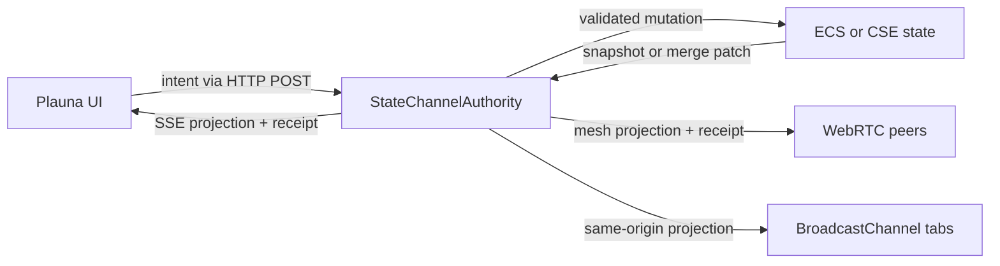

# Particle State Channels

Particle State Channels define where shared state lives and how views receive it. This guide is for app, game, and UI authors who need one authoritative state path across Plauna, ECS, WebGPU OS state, and Particle Network.

## Standard flow

A State Channel accepts typed **intents** and emits revisioned **projections** plus receipts. An intent asks an authority to perform an action. A projection contains confirmed state for a consumer to render. Plauna never treats an input event as shared truth. (Source: `engine/network/stateChannels/StateChannelContract.js`, `plauna/core/BindingEngine.js`)



The standard browser client transport uses Server-Sent Events (SSE) downstream and HTTP `POST` upstream. `EventSource` reconnects the projection stream. Event IDs and synthesized snapshots recover missed revisions. The local development server and V3 Masterserver enable this route by default. The production route requires a short-lived signed lease bound to a proven V3 key, route, channel, and role. Set `PARTICLE_STATE_SSE=false` on the Masterserver only when an operator intentionally disables this V3 capability. (Source: `engine/network/stateChannels/SseStateChannelTransport.js`, `Masterserver/app/state_channels.py`, `Masterserver/app/trust.py`)

`resolveStateChannelTransport()` keeps that default while removing per-app setup. A server authority resolves to SSE and can acquire its production lease from `NetworkDriver`. A same-origin authority resolves to `BroadcastChannel`. A peer authority opens the existing Particle WebRTC route and resolves to mesh. An in-process authority stays local. (Source: `engine/network/stateChannels/StateChannelTransportResolver.js`, `engine/network/stateChannels/MeshStateChannelTransport.js`, `webgpu-os/drivers/NetworkDriver.js`)

## Place state by owner

| State | Owner | Example | Delivery |
| --- | --- | --- | --- |
| Local presentation | Plauna `StateStore` | open menu, hover, draft input | in-process |
| Authoritative simulation | ECS world | transform, particle emitter, combat state | mesh or State Channel projection |
| App-owned durable state | WebGPU OS CSE | preferences, document state, workflow state | `AppStateChannelAdapter` |
| Shared mergeable state | CRDT or semantic replication | workstation layout, offline edits | Particle Network |
| Remote view | State Channel client | dashboard value, inspector state | SSE by default |

Do not mirror the same authoritative value into independent UI, ECS, and network stores. Keep one owner. Derive projections for every other consumer.

## Define a channel

```javascript
import {
  defineStateChannelContract,
  StateChannelAuthority,
  StateChannelClient,
  SseStateChannelTransport,
} from '../../engine/network/index.js';

const contract = defineStateChannelContract({
  id: 'realm.emitter',
  initialState: { emitter: { rate: 100 } },
  intents: {
    'emitter.adjust': {
      validate: payload => Number.isFinite(payload?.delta) || 'invalid-delta',
      reduce: (state, payload) => ({
        ...state,
        emitter: { ...state.emitter, rate: state.emitter.rate + payload.delta },
      }),
    },
  },
});

const client = new StateChannelClient(contract, { clientId: 'editor-ui' });
await client.connect(new SseStateChannelTransport({ channelId: contract.id }));
await client.submit('emitter.adjust', { delta: 25 });
```

The authority serializes submissions. It validates the channel, action, payload, expected revision, authority epoch, and optional fencing token. Duplicate intent IDs receive duplicate receipts without reapplying the mutation. (Source: `engine/network/stateChannels/StateChannelAuthority.js`)

## Connect Plauna

`StateStore` holds the latest projection for rendering. `BindingEngine.bindOneWay()` updates retained nodes. `bindTwoWay()` and `bindIntent()` dispatch actions; they do not write an authoritative projection before a receipt arrives. A `PlaunaApp` state-channel descriptor creates the client and resolves its transport, then owns cleanup. Callers may still provide an existing client. (Source: `plauna/core/StateStore.js`, `plauna/core/BindingEngine.js`, `plauna/core/app.js`)

```javascript
app.bindOneWay(rateLabel, 'textContent', 'emitter.rate', {
  transform: rate => `${rate} particles/s`,
});

app.bindIntent(increaseButton, 'click', {
  action: 'emitter.adjust',
  payload: { delta: 25 },
});
```

## Connect ECS replication

`NetReplicated` version 2 selects a named profile. Profiles set authority, cadence, projection strategy, component interest, and transport. Use `ui-state-channel` for state exposed to browser views over SSE. Use `interpolated-transform` or `gpu-semantic` for peer simulation traffic over mesh. (Source: `engine/ecs/components/NetReplicated.js`, `engine/ecs/replication/ReplicationProfiles.js`)

SSE is the State Channel standard, not a replacement for every network lane. WebRTC mesh carries peer gameplay and semantic replication. BroadcastChannel remains useful for same-origin peer tabs. In-process transport remains useful for tests and local authorities.

## Connect CSE app state

`AppStateChannelAdapter` commits each accepted intent through `AppStateEngine.put()` with `expectedVersion`. The compare-and-swap result becomes the new authority state. External CSE writes produce a replacement snapshot. (Source: `webgpu-os/kernel/state/AppStateChannelAdapter.js`, `webgpu-os/kernel/state/AppStateEngine.js`)

The OS persists bounded authority checkpoints and offline intent outboxes through `NetworkPersistence`. A standby restores only valid, non-regressing checkpoints. `StateChannelAuthorityCoordinator` uses signed, replay-rejected heartbeats, deterministic takeover, and strictly increasing fencing tokens before a promoted peer accepts writes. This is browser availability and stale-writer fencing, not Byzantine consensus across a physical network partition. (Source: `webgpu-os/drivers/NetworkPersistence.js`, `engine/network/stateChannels/StateChannelAuthority.js`, `engine/network/stateChannels/StateChannelAuthorityCoordinator.js`)

An authority is eligible only while its scoped mesh route is active. Suspending that route removes local authority immediately. On resume, the coordinator waits for a current authority heartbeat before deterministic failover, preventing a restored background tab from immediately reclaiming a stale host role. (Source: `engine/network/stateChannels/StateChannelAuthorityCoordinator.js`)

## Embedded network runtime

`NetworkDriver` starts one `EmbeddedParticleNode` per browser profile unless the user explicitly opts out. A browser lock, with a renewable local-storage lease fallback, makes one tab the external-backbone owner. Other tabs stay followers and can take over after lease expiry. The node is always a resident while enabled. Supernode, witness, and authority are temporary roles on that same node, announced with signed, expiring role envelopes. Supernode selection is deterministic, bounded to two through five candidates, and based on locally observed connection quality. (Source: `webgpu-os/drivers/NetworkDriver.js`, `webgpu-os/drivers/EmbeddedParticleNode.js`, `engine/network/routes/NodeRoleProtocol.js`, `engine/collab/CollabMeshTopology.js`)

The resident backbone does not join an app, room, game, document, or voice route. Opening a peer-backed State Channel acquires a reference-counted route lease. Multiple local consumers share one WebRTC session. Closing one consumer cannot disconnect the others. The final release closes the route after a three-second idle grace; reopening during that grace cancels teardown. Hidden, frozen, or page-hidden contexts release immediately and reacquire only after becoming active again. (Source: `engine/network/routes/RouteSessionManager.js`, `engine/network/stateChannels/StateChannelTransportResolver.js`, `engine/network/stateChannels/MeshStateChannelTransport.js`)

`ParticleEndpointRuntime` makes the resident node and temporary supernode roles
one endpoint rather than separate networks. The endpoint runtime is enabled by
default, but app route membership is still lazy. Only a fully open, active app
acquires its room route and becomes eligible to host compatible route traffic.
(Source: `engine/network/endpoint/ParticleEndpointRuntime.js`,
`webgpu-os/drivers/NetworkDriver.js`.)

The production Masterserver broker holds only bounded in-memory event history
and the latest projection. It enforces channel, connection, message, replay,
rate, role, and idle limits. It is a transport fallback, not durable app state;
an ECS, CSE adapter, or elected peer remains the authority. A static site alone
cannot provide this authenticated SSE route. (Source:
`Masterserver/app/state_channels.py`, `Masterserver/app/config.py`.)

This lifecycle follows the platform boundary: `RTCPeerConnection` is exposed to `Window`, not a permanently running service worker; Web Locks last only while their callback remains unsettled; and frozen pages should close WebRTC, BroadcastChannel, and held locks. See the [W3C WebRTC specification](https://www.w3.org/TR/webrtc/), [W3C Web Locks specification](https://www.w3.org/TR/web-locks/), and [Chrome Page Lifecycle guidance](https://developer.chrome.com/docs/web-platform/page-lifecycle-api). A closed or discarded browser therefore cannot promise continuous hosting. Another active browser node or an operator-owned server must take over.

AGI Studio publishes run state and training metrics through the same contract and transport resolver. It uses same-origin delivery when standalone and accepts the OS `NetworkDriver` for mesh delivery. (Source: `agi/network/TrainingStateChannel.js`, `agi/studio/core/StudioApp.js`)

## Run the proof

Start the development server, then open one authority tab and one client tab with the same channel name:

```bash
python start_server.py
```

```text
http://127.0.0.1:9001/tests/state-channel-lab.html?role=authority&channel=my-emitter
http://127.0.0.1:9001/tests/state-channel-lab.html?role=client&channel=my-emitter
```

The client sends an emitter intent. The authority applies it to an ECS `ParticleEmitter` with a `NetReplicated` profile. Both tabs render the confirmed Plauna projection. (Source: `tests/state-channel-lab.js`)

## See also

- [Data Flow](data-flow.md)
- [ECS v2](../engine/ecs.md)
- [Plauna Architecture](../plauna/architecture.md)
- [Security & Trust Model](security-model.md)
