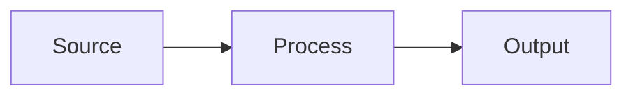
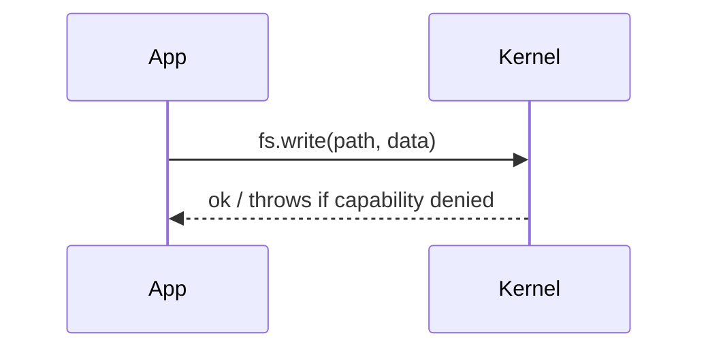

# Diagram Guide

Diagrams help readers grasp complex flows faster. This project uses **Mermaid** so diagrams live in Markdown, are versioned with text, and render in all three viewers.

## When to use a diagram

- Architecture/component relationships.
- Sequences (boot, request flows, IPC).
- State machines and pipelines.

Use a diagram to **complement** prose, not replace it. Always introduce a diagram with a sentence saying what it shows.

## How to author

Use a fenced ` ```mermaid ` block:

````markdown

````

The zero-build viewer converts these blocks into rendered diagrams via the vendored `mermaid.min.js`. If the vendor libs aren't present, the block falls back to showing the diagram source as code — still readable.

## Conventions

- **Flowcharts** (`flowchart LR/TD`) for architecture/pipelines.
- **Sequence diagrams** (`sequenceDiagram`) for ordered interactions.
- **Timelines** (`timeline`) for evolution/history.
- Keep node labels short; put detail in the surrounding text.
- Use `\n` inside labels for line breaks rather than very wide nodes.
- Prefer 5–12 nodes per diagram; split larger ones.

## Accessibility

- Mermaid is not a substitute for text. Ensure the key information in a diagram is **also** stated in nearby prose, since screen readers may not read the rendered SVG well.
- Reference diagrams by what they depict, not "the diagram above".

## Theming

The viewer initializes Mermaid with the `dark` theme and `securityLevel: "strict"`. Don't rely on custom colors for meaning — use labels.

## Example



## See also

- [Docs Style Guide](docs-style-guide.md)
- Examples in use: [Boot Sequence](../concepts/boot-sequence.md), [Architecture Overview](../concepts/architecture-overview.md).
