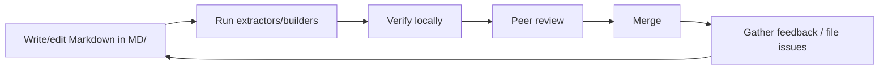

# Contribution Workflow

How to add or change documentation and keep it from drifting. Docs are treated as code: edited in Markdown, validated by tooling, and reviewed.

## The loop



## 1. Edit Markdown

- All docs live under `C:\Coding\game\MD`. This is the single source of truth.
- Existing docs elsewhere (`docs/`, `webgpu-os/docs/`, `engine/docs/`, per-component `.md`) are **read-only references** — don't edit them as part of docs work; fold needed content into `MD/`.
- Add new curated pages to `_config/nav.json`.
- Follow the [Docs Style Guide](docs-style-guide.md) and use `_templates/`.

## 2. Regenerate derived artifacts

```bash
# from C:\Coding\game\MD
python tools/extract_api.py     # refresh signatures and inject external note overlays
python tools/build_docs.py      # rebuild search index + validate nav paths
python tools/build_llms.py      # refresh MD/ and web-root discovery assets
python tools/validate_docs.py   # validate API, crawler, URL, and wrapper contracts
```

If the viewer's libs aren't vendored yet:

```bash
python tools/fetch_vendor.py
```

## 3. Verify locally

- **Zero-build viewer:** `python start_server.py` → `http://127.0.0.1:9001/MD/viewer/`. Click through changed pages; confirm no "Page not found", search works, diagrams render.
- **MkDocs (optional):** `mkdocs build --strict -f _config/mkdocs.yml` — fails on broken links.
- Run the [Writing Checklist](writing-checklist.md).

## 4. Keep docs in sync with code

- When you change an API or user-visible behavior, update the docs in the same change.
- Improve **source JSDoc** so the generated reference improves too (see [API Reference Standard](api-reference-standard.md)).
- Record notable doc changes in [CHANGELOG.md](../CHANGELOG.md) (Keep-a-Changelog format).

## 5. Review & publish

- Have a second contributor proofread.
- The three viewers all read the same `MD/` files, so a merged change is immediately reflected once artifacts are rebuilt and the site/app is served.

## Suggested CI (optional)

A CI job can run, on every change touching `MD/`:

1. `python tools/extract_api.py` (source hashes and detected exports are current).
2. `python tools/build_docs.py` (must exit 0 — all nav paths resolve).
3. `python tools/build_llms.py` (root discovery files are regenerated).
4. `python tools/build_bundle.py` (the compact deployed viewer payload is current).
5. `python tools/validate_docs.py` (API, crawler, URL, and wrapper contracts pass).
6. `mkdocs build --strict` (no broken links).
7. A Markdown link checker and a style linter (e.g. Vale).

## See also

- [Docs Style Guide](docs-style-guide.md)
- [Writing Checklist](writing-checklist.md)
- [Diagram Guide](diagram-guide.md)
