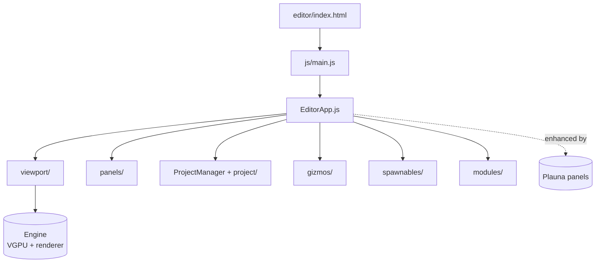

# Editor Architecture

How the editor is organized. The editor is a single-page application whose `EditorApp` orchestrates the viewport, panels, and project state on top of the engine.

## Structure

## Key pieces

- **`EditorApp.js`** — the central application object. It wires panels, the viewport, project lifecycle, and editor modules together. (It is the largest file in the editor; treat the generated API reference as the index of its surface.)
- **`main.js`** — boots the editor and constructs `EditorApp`.
- **`ProjectManager.js` + `project/`** — the project/filesystem abstraction the OS later generalizes into its storage layer.
- **`viewport/`** — renders the editable scene using the engine's renderer and VGPU.
- **`panels/`** — dockable UI panels (hierarchy, inspector, asset tools). These are the panels Plauna can enhance.
- **`gizmos/`** — transform and manipulation handles in the viewport.
- **`spawnables/`** — entity templates that can be placed into a scene.
- **`modules/`** — discrete feature modules.
- **`workers/`** — offloaded work via Web Workers.
- **`themes/`** — editor visual themes.

## Integration points

- **Bootstrap:** `engine/EngineEditorBootstrap.js` brings up the engine and exposes Plauna as `PE.Plauna`.
- **Plauna enhancement:** existing panels are passed to `plauna.enhanceExistingPanels(panels)` for hybrid DOM/GPU upgrades, sharing the editor's VGPU.
- **As an OS app:** the editor is one of the userland apps the OS re-wraps as a Plauna panel (Source: `webgpu-os/AUDIT.md`).

## Genesis Ecology integration (planned)

Editor supplies thin tools for parts, product/factory genomes, developmental and
regulatory graphs, repair rules, lineage, QD archives, role/cultural topology,
candidate diffs, and receipts. Project and asset changes use versioned migrations
and immutable artifact digests. Canonical validation stays in the Engine and
RealmForge compilers; AutoSave and scene wires do not become execution authority.
See the [Genesis Ecology WebGPU OS plan](../webgpu-os/genesis-ecology-os-plan.md).

## See also

- [Plauna Architecture](../plauna/architecture.md) — the panel/surface system the editor feeds into.
- [Genesis Ecology WebGPU OS Plan](../webgpu-os/genesis-ecology-os-plan.md).
- Editor **API Reference** — per-file symbols from `editor/js/`.
