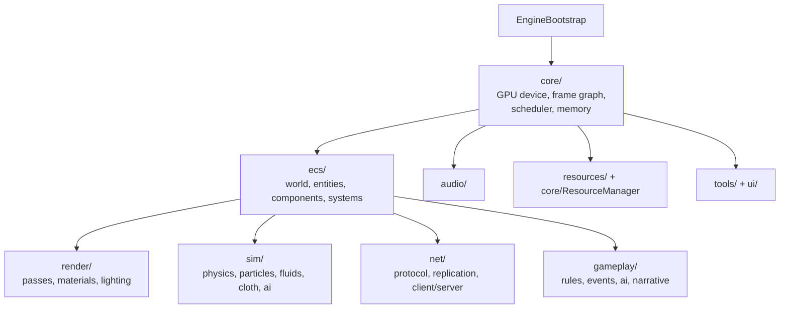

# Engine Architecture

How the engine's modules compose. The engine is organized as independent subsystems that communicate through the ECS and an event bus, all running on a single shared WebGPU device.

## High-level structure

## Core (`engine/core/`)

The lowest layer. Notable sub-areas:

- **`gpu/`** — the WebGPU device and the VGPU abstraction (`VirtualGPU.js`), multi-queue, bind groups, streaming, memory tracking, recovery, canvas bootstrap. This is what the OS's GPU device broker builds on.
- **`framegraph/` + `framepipeline/`** — declarative render/compute pass graph and the per-frame pipeline.
- **`scheduler/`** — task scheduling ("processes"), including async compute.
- **`memory/`** — GPU and host memory managers, object pools, mapped buffer rings, vertex pools.
- **`math/`, `timing/`, `events/`, `workers/`, `compression/`, `save/`, `profiler|profiling/`, `platform/`, `schema/`, `shaders/`** — supporting services.
- **`ResourceManager.js`** — asset/resource loading and lifetime.

## ECS (`engine/ecs/`)

State model for the whole engine.

- `EntityManager.js` — entity lifecycle.
- `EntitySchema.js` — component schema definitions (large; the canonical component catalog).
- `ComponentHealer.js` — schema migration / repair of component data.
- `components/`, `systems/`, `query/`, `storage/`, `prefabs/`, `world/` — the moving parts.

Systems read and mutate components; rendering and simulation are driven from ECS state.

## Render (`engine/render/`)

Turns ECS state into frames.

- Renderers: `DualModeRenderer.js`, `SceneRenderer.js`, world/preview/minimap renderers.
- `LightManager.js`, culling (`IndexedClusterCuller.js`), `Mesh.js`, `RenderBundleManager.js`.
- Sub-areas: `materials/`, `passes/`, `postprocess/`, `lighting/`, `geometry/`, `mesh/`, `particles/`, `sdf/`, `spectral/`, `atmosphere/`, `volumes/`, `streaming/`, `shaders/`, `state/`.

## Sim (`engine/sim/`)

GPU-first simulation, driven each tick by `SimulationUpdate.js`: `physics/`, `particles/`, `fluids/`, `cloth/`, `ai/`, `world/`.

## Net & Collab (`engine/net/`, `engine/collab/`)

- `net/` — `protocol/`, `replication/`, `client/`, `server/`.
- `collab/` — the multi-user mesh: identity, crypto, integrity, presence, signaling, host migration, fast channel, scene/transform sync. The OS uses this for cross-tab/peer IPC and multi-user scenarios.

## Gameplay (`engine/gameplay/`)

`rules/` (including `RuleGraph.js`, the Tier 1 capability-gate stand-in), `events/` (`EventGraph.js`), `ai/`, `narrative/`, `perception/`.

## How the OS reuses the engine

The OS does not reimplement these — see [Architecture Overview](../concepts/architecture-overview.md) for the mapping of OS concerns onto engine modules (GPU, scheduler, memory, events, resources).

## Genesis Ecology integration (planned)

Genesis Ecology adds a generic recipe kernel, production Causal State Engine
composition, stable identity independent of ECS handles, chunked query paths,
multirate systems, transactional structural barriers, complete persistence, and
proposal-only worker/GPU evaluation. It reuses the current Engine rather than
creating another runtime. The source-backed dependency order and correctness
blockers are defined in the [Genesis Ecology Engine and ECS plan](genesis-ecology-engine-plan.md).

## See also

- [GPU Device Sharing](../concepts/gpu-device-sharing.md).
- [Genesis Ecology Engine and ECS Plan](genesis-ecology-engine-plan.md).
- Engine **API Reference** — generated per-file from source.
