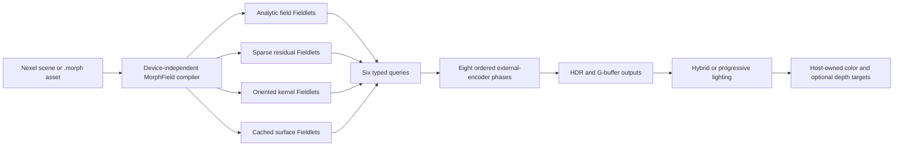

# MorphField R2 Renderer

MorphField is an additive, opt-in Engine renderer for semantic fields, sparse residuals, oriented kernels, and validated surface caches. A public **Nexel** describes scene intent. The compiler produces private **Fieldlets** and keeps the source scene authoritative.

This page is the persistent R2 delivery record. An individual checklist box changes to `[x]` only after its implementation, focused tests, and item-specific evidence pass. A phase gate remains open until every required item and the integrated phase-level evidence pass.

## Current release status

| Phase | Gate | Status on 2026-07-27 |
| --- | --- | --- |
| 0. Contracts, safety, research | Passed | Twelve public Draft 2020-12 schema resources (eleven source resources plus the generated offline compound bundle), the checked mode-specific capability profile, strict compiled-ABI/query ingress, ownership, diagnostics, fixtures, provenance, and the frozen core-profile baseline pass this gate. Release builders copy the schemas to their exact public routes. The current installed-Chrome revision passes all 62 browser gates, including the 12-gate real-device block. |
| 1. Certified analytic slice | Open | Analytic compilation, CPU/GPU queries, conservative f32 certificates, direct tracing, a packed CPU-built threaded GPU BVH, guarded stable-analytic incremental projection and changed-range GPU publication, close-CSG/inside/seam/lifecycle coverage, and Playground scenes exist. A real compiler-worker path, general incremental compilation, and the complete reference-image gate remain open. |
| 2. Assets and sparse residuals | Open | `.morph`, certified CPU residual hierarchy, and representation planning exist. GPU residency, radix/LBVH benchmarking, and fuzz evidence remain open. |
| 3. Unified surface cache | Open | Regular extraction, rank-aware QEF work, atomic publication, and clean-room 2:1 transitions exist. Full Marching Cubes, Transvoxel compatibility, and manifold dual-contouring gates remain open. |
| 4. Kernels, media, transparency | Open | Bounded CPU kernel bins, certified medium integration, and layered OIT reference logic exist. Integrated GPU composition and stress gates remain open. |
| 5. Lighting and quality | Open | Tail-sensitive adaptive quality, native-resolution automatic tiers, certified-bound pruning, tier shadow policy, resolved/pending GPU admission guards, lighting-selective lazy wavefront construction, hybrid shading, host-safe composition, explicit-scale depth-aware reconstruction, and the renderer-integrated bounded-queue wavefront path pass the current portable and 12-gate real-device suites. ReSTIR/SVGF/IBL and the complete reference-image/energy gate remain open. |
| 6. Simulation and queries | Open | Six external-encoder GPU queries, fixed-step scheduling, and compatible adapters exist. Full simulation parity and replay gates remain open. |
| 7. Playground and release | Open | One public-API demo exposes nine focused Nexel specimens, lighting and simulation scenarios, the independent Structural Scale Lab, validation controls, separated timing channels, and copyable receipts. Every specimen distinguishes semantic source, compiled family, active evaluator, query/collision availability, SDF/reference-field classification, simulation ownership, and any diagnostic presentation glyph. The current source suite contains 62 gates: 50 device-independent gates and 12 real-device gates; all 62 pass on the current installed-Chrome run with zero failures or skips. Adapter absence remains one explicit device-required block. Long-run benchmarks for every preset, release hardening, and the Full R2 gate remain open. |

The current code is a verified foundation and analytic vertical slice. It is not yet the Full R2 release.

## Architecture



Source ownership is split by subsystem:

| Path | Responsibility |
| --- | --- |
| `engine/render/morphfield/core/` | Nexel scene, validation, compiler, ABI, CPU BVH, and reference queries. |
| `engine/render/morphfield/assets/` | Versioned `.morph` encoding, decoding, compression, limits, CRC32, and provenance. |
| `engine/render/morphfield/runtime/` | Borrowed-device resources, external-encoder renderer, GPU queries, capabilities, shaders, outputs, and statistics. |
| `engine/render/morphfield/schemas/` | Draft 2020-12 canonical JSON schemas, stable IDs, the public catalog, and the checked Nexel capability profile. |
| `engine/render/morphfield/systems/` | Representation planning, residuals, surface extraction, transitions, kernels/media, simulation scheduling, and adapters. |
| `tests/morphfield/` | Browser-native CPU, schema, ownership, shader, and real-device WebGPU acceptance harness. |
| `tests/playground/src/demos/morphField.js` | Public-API interactive demo. |

`editor/`, `webgpu-os/`, and `agi/` were read as integration references and remain unchanged. Vendored code, `engine/kaolin/`, and `engine/sim/physics/` remain hard boundaries.

## Public API

`engine/render/morphfield/index.js` exports the namespace through `engine/render/index.js`, `engine/EngineBootstrap.js`, and bundled `window.PE` builds.

```javascript
const scene = Engine.MorphField.createScene({ id: 'example', units: 'meters' });
scene.upsert({
  id: 'ball',
  source: { kind: 'sphere', radius: 1 },
  material: { type: 'pbr', baseColorFactor: [0.8, 0.2, 0.1, 1] },
});

const compiler = Engine.MorphField.createCompiler({ worker: 'auto' });
const compiled = await compiler.compile(scene);

const capability = Engine.MorphField.Schemas.inspectNexelCapabilities(scene.get('ball'));
console.log(capability.renderer, capability.gpuQueries, capability.limitations);

const renderer = await Engine.MorphField.createRenderer({
  device,
  colorFormat,
  depthFormat: 'depth32float',
  outputTransfer: 'auto',
  quality: { mode: 'auto', targetFPS: 'display' },
  logger,
});

renderer.setScene(compiled);
renderer.resize(width, height);
renderer.encode({
  encoder,
  target: { colorView, depthView, composition: 'replace' },
  camera,
  lights,
  time,
  deltaTime,
  frameIndex,
  performanceSample: {
    frameMs: rafIntervalMs,
    cpuMs: lastHostCpuMs,
    gpuMs: freshGpuTimestampMs,
    gpuTimingAvailable,
    gpuSamplePending,
    queueDepth,
    queueCapacity,
    queueThrottled,
    queueCompletionWallMs,
  },
});
```

`performanceSample` is optional. `frameMs` is host cadence (the Playground supplies the rAF callback interval and reports admitted presentation separately), `cpuMs` is synchronous host work, and `gpuMs` is a fresh timestamp-query result. A host must omit `gpuMs` when no new timestamp has resolved instead of repeating a stale sample. `gpuSamplePending` is the number of outstanding timestamp samples. `queueDepth`, `queueCapacity`, and `queueThrottled` describe host submission pressure. Optional `displayIntervalMs` feeds the robust display-refresh estimator; missed callbacks are filtered and a new refresh target is accepted only after hysteresis. Optional `presentationMs` is the most recent admitted-frame interval; it qualifies queue-pressure fallback but is never folded into CPU/GPU work percentiles. `queueCompletionWallMs` is diagnostic completion latency, not shader execution time. Callers that do not provide measured channels retain the compatibility path derived from `deltaTime`; callers using the older explicit `totalMs` governor input retain that override.

`renderer.setLightingMode('progressive')` makes the bounded wavefront tracer the renderer's progressive image source for supported analytic-family scenes. Each sample records Generate, Intersect, Shade, Shadow, and Finalize compute stages before resolving its `rgba32float` radiance sum and sample count into the renderer's HDR history. Unsupported representation families fall back to hybrid with an explicit reason in `getStats().lighting.fallbackReason`; the mode never silently substitutes a second fragment-shader path tracer. Advanced callers can also create the buffer-only tracer directly through `Engine.MorphField.createPathTracer()`.

Wavefront initialization is lighting-selective. `hybrid` does not instantiate the `MorphFieldWavefrontPathTracer` or its tracer-specific compute pipelines and queues. `auto` task-defers that construction, returns from `createRenderer()` first, and continues encoding Hybrid with `wavefront-initializing` until readiness. Explicit `progressive` waits for initialization before creation resolves. `setLightingMode('auto')` and `setLightingMode('progressive')` return the preparation promise; callers may await it when readiness is required. `getStats().lighting.wavefront.initialization` exposes state, reason, generation, attempts, timestamps, and contained errors. Explicit Hybrid selection, device replacement, and destruction invalidate the generation, release stale resources, and prevent a late asynchronous result from publishing against the wrong lighting policy or borrowed device.

`target.composition` is either `replace` (the default) or `over`. Replace clears and owns the target pixel for the encoded viewport. Over preserves the host color/depth attachments by default, depth-tests the MorphField result, and uses field transmittance as straight-alpha coverage. Internal HDR remains linear. `outputTransfer: 'auto'` applies the display transfer for plain eight-bit unorm host targets, preserves linear float targets, and does not double-encode `*-srgb` targets. A 64-slot, 256-byte-aligned frame-uniform ring keeps multiple `encode()` calls recorded into one unsubmitted command encoder isolated from later uniform writes. The host contract does not yet expose encode-to-submit `commit()`/`cancel()` acknowledgements, so robust slot reclamation across abandoned or exceptionally delayed command encoders remains an explicit lifecycle gap.

The host owns the device, queue submission, command encoder, canvas, animation loop, presentation pacing, and target views. MorphField does not configure a canvas, finish or submit a command buffer, destroy the device, or destroy host-owned views. The host must keep submissions bounded. The Playground has no fixed render deadline: it attempts one submission for every host `requestAnimationFrame` callback and rejects work only while its two-submission completion-debt bound is full. The governor's frame target is a quality budget and never schedules or rejects a frame. `targetFPS: 'display'` follows a filtered measured refresh interval; a numeric target remains available for deterministic tests and fixed-budget hosts. `queue.onSubmittedWorkDone()` is used only as a coarse completion checkpoint; its wall duration is not reported as shader time. This allows 75/120/144 Hz displays to present at their native callback cadence when the device keeps up while retaining bounded latency under saturation. `replaceDevice()` reconstructs MorphField-owned resources from authoritative CPU state. `destroy()` is idempotent. (Sources: [MDN `requestAnimationFrame`](https://developer.mozilla.org/en-US/docs/Web/API/Window/requestAnimationFrame), [WebGPU `GPUQueue`](https://gpuweb.github.io/gpuweb/#gpuqueue).)

### Renderer and PhysX clocks

MorphField is clock-neutral. Its phase named `Simulate` is an ordering/telemetry marker and does not step PhysX. The Engine host owns the authoritative simulation clock: `PhysicsSystem` runs as an ECS tick system, PhysX advances at a stable fixed step, and the frame path renders independently on every admitted rAF. The render side consumes previous/current pose snapshots plus an interpolation alpha; it must not write interpolated poses back into authoritative ECS or PhysX state. Ordinary rigid-body motion should update a transient transform/motion stream and spatial refit, not compile a semantic Nexel patch. Topology, material, certificate, and source edits continue through `compilePatch()`.

This separation is deliberate: fixed PhysX timesteps preserve solver stability, while rendering remains native-refresh-driven. The current browser PhysX wrapper still performs a synchronous `simulate()`/`fetchResults(true)` pair, so the clocks are decoupled by ownership and time domain, not yet by a worker thread. Moving PhysX off-thread requires an explicit cross-origin-isolation/WASM threading gate and caller-owned buffering; it is not assumed by MorphField. (Sources: [PhysX simulation](https://nvidia-omniverse.github.io/PhysX/physx/5.4.1/docs/Simulation.html), [PhysX threading](https://nvidia-omniverse.github.io/PhysX/physx/5.1.3/docs/Threading.html), `engine/core/platform/MainLoop.js`, `engine/ecs/systems/PhysicsSystem.js`.)

### Sparse residency shared by fields, voxels, and virtual textures

The 2026-07-26 implementation turns the useful part of the dynamic-SDF research into a shared Engine primitive rather than three incompatible caches. `SparsePageRuntime` provides fixed page and byte budgets, LRU eviction, pinned fallback pages, revisioned staging, and atomic publication. `ResidualHierarchy` uses it to guarantee that a missing fine residual resolves to a certified coarser level. `VoxelSdfBrickBridge` converts a voxel occupancy callback into a neighbor-apron sampled-field page plus a conservatively expanded coarse fallback and publishes the pair atomically as Nexels. `VirtualTexturingSystem` uses the same residency semantics for mip-aware physical slots and now supports external-encoder feedback readback without a per-frame blocking submit. A rejected or missing page resolves to a pinned neutral fallback instead of magenta or absent geometry.

The live direct-field GPU evaluator now executes bounded sampled fields and analytic-plus-residual Fieldlets from their compiler-packed grids using trilinear sampling, compiler-derived error/Lipschitz certificates, generic normals, and certified surface/collision queries. This is deliberately not called a complete clipmap engine: current compiled grids are resident `f32` data, while byte quantization, nested camera-centered geometry clipmaps, fine-page GPU atlas bindings, and measured open-world residency remain open work. The screen-tile path is likewise a representation-work accelerator, not an “infinite-resolution codec”: it bins conservative projected BVH leaves per `16×16` primary tile. Interactive Scale Lab loads stay at the host extent. Source/depth-qualified reconstruction is used only when the host explicitly requests a smaller scale or the developer runs the clearly labelled bounded benchmark ladder. ([AMD Brixelizer](https://gpuopen.com/manuals/fidelityfx_sdk/techniques/brixelizer/), [Geometry Clipmaps](https://hhoppe.com/geomclipmap.pdf), [NVIDIA sparse SDF grids](https://jcgt.org/published/0011/03/06/), and [Mike Turitzin's dynamic-SDF engine presentation](https://www.youtube.com/watch?v=il-TXbn5iMA).)

Optional refinement is budgeted rather than clocked. `ProgressiveWorkBudget` admits path-tracing or refinement units only from measured CPU/GPU headroom, rejects them while timestamp evidence is pending or the queue is saturated, and reduces admission for dynamic scenes. This preserves an uncapped host render loop while preventing background refinement from consuming the foreground frame budget.

## Semantic and binary contracts

### Nexel and Fieldlet

A Nexel has a stable string ID, a semantic source, a normalized Engine material, optional motion/collision/simulation descriptors, and intent metadata. Backend selection is compiler-owned. Diagnostic backend forcing stays Playground-only and never enters `.morph` assets.

#### Canonical JSON schemas and capability envelope

MorphField's device-independent interchange surface is described by twelve public [JSON Schema Draft 2020-12](https://json-schema.org/specification) resources in `engine/render/morphfield/schemas/`: eleven independently addressable source schemas plus one generated offline compound bundle. They cover shared canonical definitions, all nine source kinds, a normalized Nexel, a scene, a patch, the production particle-chain adapter payload, the implementation capability profile, a per-Nexel capability report, benchmark receipts, validation reports, and provenance. Every resource declares the Draft 2020-12 dialect and an absolute `$id` rooted at `https://particlerealms.online/schemas/morphfield/v2/`. Platform and WebGPU OS release builders copy those exact source bytes to matching routes and reject a filename/`$id` mismatch. The compound bundle embeds each unchanged source resource under `$defs`, preserving its absolute `$id`, as required by Draft 2020-12's [bundling model](https://json-schema.org/draft/2020-12/json-schema-core#section-9.3.1).

`NexelScene.toJSON()` emits `$schema`; the same scene document is the authoritative `MANF` payload in `.morph`. Normalized patches likewise emit `$schema`, `schema: "morphfield-nexel-patch"`, version `2.0`, and monotonic revision data; shorthand input remains an authoring convenience, not persisted ambiguity. Canonical schemas are strict and reject unknown core keys, authoring aliases, authored certificates, future unimplemented minor versions, duplicate object names, and non-JSON numeric tokens. Every authored numeric value that enters an f32 CPU/GPU ABI is schema-bounded and runtime-checked to the finite f32 domain. Material base-color channels are in `[0, 1]`; emissive channels may be HDR but must be finite, non-negative f32 values. Runtime authoring can still use documented conveniences, such as `collision: true` or a scalar oriented-sample radius, because normalization happens before serialization. Runtime compilation remains authoritative for certificate derivation and checked CSG evaluation, while the offline validator mirrors semantic admission checks for quaternion magnitude, rigid/uniform-scale transforms, bounds ordering, exact grid products, indexed-mesh topology, collision-offset relationships, scene/patch ID uniqueness, and receipt consistency. This is an explicit layered contract rather than a claim that JSON Schema alone can express every semantic invariant.

`python tools/validate_morphfield_json.py <file>` validates a scene, patch, capability document, receipt, or validation report using only the local registry. It applies byte, aggregate-string-byte, depth, node, and string-work budgets; rejects BOMs, duplicate names, and NaN/Infinity before Draft validation; and refuses resource-only `common` or `bundle` schemas as instance targets. It then applies the semantic checks described above instead of allowing a schema-valid but runtime-invalid document through the offline gate. `python tests/morphfield/run_python_tests.py` checks bundle freshness, 29 JSON schema/semantic fixtures and mutation cases, offline reference resolution, the validator CLI, eight shader-contract tests, and all twelve public schema HTTP routes. These guards follow [RFC 8259's interoperable JSON rules](https://www.rfc-editor.org/rfc/rfc8259) and JSON Schema's resource-safety requirements.

The public API exposes `Engine.MorphField.Schemas.MORPHFIELD_SCHEMA_CATALOG`, `NEXEL_CAPABILITY_PROFILE`, and `inspectNexelCapabilities(descriptor)`. The report distinguishes semantic admission, CPU reference support, compilation, live renderer execution, and GPU-query coverage. `compilerMode` separates certified analytic execution, certified sampled-field execution, certificate-record output, packed markers, and unavailable input; `gpuQueryModes` contains one explicit mode for each of the six typed queries. `fullyCurrentRendererExecutable` states the current renderer truth, while `fullyGpuExecutable` remains an exact compatibility alias. Unknown simulation adapters are retained as semantic data but explicitly marked unqualified. A capability report is never inferred merely because a compiler emitted a Fieldlet.

| Semantic source | Fieldlet family | Compiler/CPU reference | Live R2 renderer | Current GPU-query envelope |
| --- | --- | --- | --- | --- |
| Sphere | Analytic | Yes | Direct field | Bound, surface, material, optional motion/collision. |
| Box | Analytic | Yes | Direct field | Bound, surface, material, optional motion/collision. |
| Capsule | Analytic | Yes | Direct field | Bound, surface, material, optional motion/collision. |
| Hard analytic CSG | Analytic | Yes | Direct field | Bound, surface, material, optional motion/collision. |
| Sampled field | Sparse residual | Yes | Certified direct field | Bound, surface, material, and optional motion/collision. Progressive wavefront remains analytic-family-only. |
| Analytic plus sparse residual | Sparse residual | Yes | Certified direct field | Bound, surface, material, and optional motion/collision. Fine streaming requires the pinned certified coarse fallback. |
| Oriented samples | Oriented kernel | Partial orientation semantics | Marker-only | Bound, material, and optional motion; surface/collision remain CPU-only. The current CPU reference applies anisotropic radii in source axes and retains, but does not rotate by, the sample normal. |
| Indexed surface | Cached surface | Yes | Marker-only | Bound, material, and optional motion; surface remains CPU-only and collision metadata is rejected. |
| Bounded medium | Analytic-medium subtype | Yes | Marker-only | Bound, medium majorant, and optional motion; surface/collision metadata is rejected. |

A moving Nexel defaults to dynamic intent; explicitly combining motion with `updateClass: "static"` is rejected. Simulation records require an adapter ID, and a declared `authoritative` or `visual` simulation authority must agree with `intent.authoritative`. `qualityImportance` is normalized to the closed interval `[0, 1]`. These gates prevent descriptors that serialize successfully but fail later in Fieldlet upload or GPU query setup.

JSON Schema is intentionally not applied to non-JSON contracts. The `.morph` header/directory/chunks, Fieldlet headers, certificate pools, spatial records, and query buffers are fixed little-endian/WGSL ABIs. Compiled scenes and patches contain typed arrays. Renderer creation, `encode()` targets, outputs, and device replacement contain borrowed WebGPU objects. Their layout constants, ownership checks, and ABI tests remain the source of truth; inventing JSON projections for them would hide the real contract. Renderer activation now validates every compiled array type and stride, ID/index bijection, reference, family/subtype/query combination, material/certificate record, postfix opcode/stack range, and finite value. Same-realm output must carry private compiler provenance. A structured-cloned worker result is accepted only after deterministic recompilation of its authoritative semantic snapshot produces byte-identical executable ABI arrays. Authored or modified Fieldlets cannot self-certify traversal.

#### Fieldlet ABI

Each Fieldlet begins with the fixed 16-byte header:

```text
FieldletHeader {
  boundsRef:       u32
  payloadRef:      u32
  meta:            u32
  certificateRef: u32
}
```

`meta` packs a 12-bit subtype, four-bit family, six-bit query mask, and ten flags. The stable family IDs are analytic field, sparse residual, oriented kernel, and cached surface. A certificate bundle stores `surfaceRef`, `mediumRef`, `motionRef`, and `collisionRef`; `0xFFFFFFFF` means absent. Material queries use the normalized material table.

The certified surface step is:

```text
safeStep = max(fieldEstimate - fieldValueErrorMax, 0) / lipschitzMax
```

For signed fields, traversal applies the formula to `abs(fieldEstimate)`. The runtime clamps the step to the active spatial exit. Compiler-derived error expands the published trace bounds, and every bound is rounded outward when stored as `f32`; neither certificate nor AABB quantization may shrink the certified domain. Invalid certificates fail compilation. The bounded postfix interpreter accepts at most 64 instructions and a checked 32-value stack.

### Typed queries

| Query | Purpose | Certificate or source |
| --- | --- | --- |
| Bound | Conservative world-space extent | Compiled bounds pool. |
| Surface | Signed field estimate and conservative stepping data | Surface certificate. |
| Medium | Density, extinction, and emission bounds | Medium majorant record. |
| Material | Normalized PBR properties | Material table. |
| Motion | Conservative displacement and speed | Motion certificate. |
| Collision | Surface distance and contact metadata | Collision certificate. |

The CPU reference evaluator uses JavaScript number arithmetic for deterministic double-precision fixtures. Collision participation is opt-in: omitting `collision` emits neither a collision query-mask bit nor a collision certificate, and untrusted packed input cannot enable collision metadata without a valid compiler-derived certificate. Collision distance is the signed surface separation after subtracting the caller's non-negative query radius. `contactOffset` is the predictive candidate shell; `restOffset` is the requested final signed separation, with `restOffset <= contactOffset`. `contactSlop` remains a compatibility alias for `contactOffset`. Contact means `distance <= contactOffset`, while penetration is `max(restOffset - distance, 0)`.

The GPU query interface writes fixed 64-byte results into caller-selected external-encoder batches with explicit capacity checks. A complete CPU query batch is validated before buffer allocation, queue writes, pass recording, bind-group changes, or statistics mutation. Descriptors reject unknown properties, numeric-string coercion, alias conflicts, non-finite or out-of-f32-range numbers, malformed vectors, wrapped integers, and Fieldlet indices outside the active scene. Collision input offsets are point.xyz at byte 0, query kind at 12, preferred Fieldlet at 32, flags at 36, and radius at 40. Collision output offsets are distance at 0, normal.xyz at 4, contact at 16, supported at 20, `restOffset` at 24, field-value error at 32, Lipschitz maximum at 36, `contactOffset` at 40, penetration at 44, material index at 48, Fieldlet index at 52, layer at 56, and mask at 60. Identifier and filter lanes are `u32` bit patterns. `getQueryInterface().getStats()` exposes the bounded batch/traversal counters without weakening renderer lifetime guards. (Sources: `engine/render/morphfield/core/ReferenceQueries.js`, `engine/render/morphfield/runtime/QueryEncoder.js`, and `engine/render/morphfield/runtime/RuntimeShaders.js`.)

Particle-chain producers use the public snapshot adapter rather than giving MorphField ownership of a solver:

```javascript
const descriptors = Engine.MorphField.Systems.createParticleChainNexelDescriptors({
  id: 'bridge-cable',
  positions: currentPositions,
  previousPositions,
  velocities,
  revision,
}, {
  nodeRadius: 0.14,
  linkRadius: 0.085,
  collision: { contactOffset: 0.002, restOffset: 0, layer: 3, mask: 0xffffffff },
});
```

The adapter accepts ordinary arrays, flat typed arrays, and normalized `PhysicsChain`-style `links` or `particles` collections, preserves stable node/link IDs, derives link orientation and angular motion, and builds incremental removal patches. It never steps a solver, reads back a GPU, submits a queue, or takes device ownership. Node spheres can mirror authoritative solver contact shapes. Link capsules are currently queryable connective skins; the Playground's PBD response remains node-driven and does not claim that capsule links generated contacts. (Source: `engine/render/morphfield/systems/ParticleChainNexelAdapter.js`.)

Static solver colliders opt in explicitly with `simulation.pbdCollider: "ground-plane" | "sphere"`. `compileNexelPbdColliderSet()` composes Nexel and source transforms, accepts an axis-aligned box ground and sphere sources, requires one shared positive `contactOffset` per `PBDSolver`, and rejects `restOffset` above `contactOffset`. It insets the solver plane or radius by `contactOffset - restOffset`, so `PBDSolver` retains its predictive contact shell while rendered surfaces settle at the requested `restOffset`. Applying the set rebuilds compatible solver colliders without transferring solver ownership or stepping it. (Source: `engine/render/morphfield/systems/NexelPbdCollisionAdapter.js`.)

### `.morph` assets

The browser format is a little-endian `MOR2` container with a fixed 32-byte header and fixed 32-byte directory entries. It rejects assets at or above 4 GiB. Chunks carry CRC32, declared raw/stored sizes, dependencies, and required/optional flags. Compression is `none`, `gzip`, or `deflate` through browser-native streams with an uncompressed fallback. Header, directory, alignment, and trailing padding bytes must be zero. Unknown optional chunks are decompressed within declared expansion limits and CRC-checked before they are skipped; optional does not mean untrusted bytes bypass integrity validation. Focused tests include targeted unknown-optional corruption and 32 deterministic whole-container bit mutations.

The semantic manifest remains authoritative. Compiled data, certificates, residual pages, kernels, and surface caches are disposable derivatives keyed by schema and revision.

## Frame contract

Every `encode()` call records these labeled logical phases in order:

1. Patch and stream.
2. Simulate.
3. Maintain spatial structures.
4. Cull and bin.
5. Render validated opaque surface caches.
6. Trace direct fields.
7. Integrate media and oriented kernels.
8. Shade, temporally reconstruct, and compose.

The portable path does not require hardware ray tracing, mesh shaders, work graphs, bindless resources, sparse textures, or multi-draw-count. Optional WebGPU features are capability-selected from the borrowed device and must retain a core fallback.

## Adaptive quality contract

MorphField uses one `AdaptiveQualityGovernor`. Its default target is 16.667 ms, with a 45-sample window, two-second cooldown, `1.18×` p95 downgrade threshold, `1.35×` p97 tail downgrade threshold, `0.78×` p95 upgrade threshold, and `0.90×` p97 upgrade guard. A p97 spike can therefore downgrade a tier even when p95 still looks healthy. When measured channels are supplied, the work budget is the greater of CPU and GPU time; rAF or presentation cadence is retained separately and is not treated as shader time. Sparse timestamp samples are accumulated in a per-tier GPU history so three timestamp results spread across many cadence frames still form valid GPU evidence. Pending GPU samples, GPU warm-up, or actionable queue pressure prevent tier upgrades. Sustained near-capacity pressure remains an immediate fallback signal when no delivery interval is supplied. Hosts that report `presentationMs` qualify that downgrade with consecutive over-budget delivered frames, so one scheduling spike or a 120/144 Hz producer filling a two-submission queue cannot force quality down while presentation is still inside the configured target. Raw queue pressure still blocks Auto-progressive lighting, but healthy delivered throughput does not prevent the quality tier itself from upgrading after measured headroom. Queue-completion wall time remains telemetry and never becomes a GPU-work sample.

The direct-field pass keeps primary visibility and render extent independent of the selected automatic quality tier. Every `MORPHFIELD_QUALITY_TIERS` preset has `renderScale: 1`; Auto changes trace, shadow, residual, medium, kernel, cache, and progressive-work budgets but never silently shrinks the host pixel grid. MorphField accepts a smaller active extent only when the host supplies both `qualityDecision.renderScale < 1` and `resolutionPolicy: "host-explicit"`, or when the developer starts the explicitly labelled bounded benchmark ladder. A generic Engine governor object containing a scaled tier is normalized back to native resolution. The explicit path keeps frame textures allocated at host capacity and uses source/depth-qualified 2×2 reconstruction without sampling inactive pixels. A future automatic dynamic-resolution policy must first prove a same-workload timestamp-query GPU improvement, apply hysteresis, and stay within a declared reconstruction range. CPU time, rAF cadence, presentation cadence, queue-completion wall time, and a static worst-case work estimate cannot authorize a resolution drop. This follows the measured-GPU-history and threshold model used by [Unreal Engine Dynamic Resolution](https://dev.epicgames.com/documentation/en-us/unreal-engine/dynamic-resolution-in-unreal-engine) and the GPU-bound/reconstruction constraints in [AMD FidelityFX Super Resolution 2](https://gpuopen.com/download/GDC_FidelityFX_Super_Resolution_2_0.pdf).

Primary tracing clips rays to compiler-derived analytic bounds and skips an exact Fieldlet program only when its certificate-adjusted AABB lower bound proves it cannot affect a non-negative current minimum. Inside samples never use the unsigned AABB distance to prune another overlapping Fieldlet. Equal lower bounds are still evaluated so BVH order cannot override the stable lower-source-index material/ID tie-break. The runtime starts primary rays beyond the camera near plane, refines signed crossings with a validity-checked bracket, treats the wider certificate band as a request for sign-bracket isolation rather than unconditional geometry, and advances only by `max(abs(field) - error, 0) / lipschitz`. Tier trace-step budgets apply to shadow and secondary-ray work, but MorphField normalizes the generic governor's `shadowLevel: 0` to a scoped level-1 hard-shadow baseline. Direct-field traversal records `CLEAR`, `HIT`, `EXHAUSTED`, and `INVALID`; a shadow is illuminated only after certified `CLEAR`, while every other outcome fails closed. The governor starts a new timing window after each tier transition and backs off a failed upgrade before trying it again. (Sources: `engine/render/morphfield/runtime/AdaptiveQualityGovernor.js`, `engine/render/morphfield/runtime/RuntimeShaders.js`, and `engine/render/morphfield/runtime/MorphFieldRenderer.js`.)

`auto` lighting admits progressive wavefront work only on high or ultra after at least 45 stable hybrid samples whose p95 is at or below `0.72×` target and whose p97 is at or below `0.90×` target. When timestamp queries are available, admission additionally requires enough resolved GPU evidence and `gpuSamplePending === 0`. Current host timing and queue signals remain authoritative even when the host supplies an external quality-tier decision. A pending timestamp is checked before admission even when another valid GPU sample exists; the renderer remains Hybrid with `auto-progressive-gpu-sample-pending`. In the timestamp-capable path, browser rAF cadence never satisfies the GPU-work requirement. Queue pressure blocks admission and aborts active Auto-progressive work. A progressive frame above `1.75×` target aborts immediately; two consecutive frames above `1.18×` also abort. Failed admissions use an exponential 10–60 second cooldown. Scene, patch, camera, light, or quality changes reset stability and history.

The focused regression supplied `45 ms` rAF cadence, `5 ms` timestamp GPU work, and one pending timestamp for 45 frames. Auto remained Hybrid and GPU p95 remained `5 ms`; clearing the pending count admitted Progressive, and subsequent queue saturation returned to Hybrid.

### Performance timing and spike triage

The Playground reports five different signals rather than calling every delay “GPU time”:

1. Browser rAF interval p50/p95/p97/p99/max and one-percent-low callback pacing.
2. Admitted presentation interval, submitted/rAF counts, queue-only throttles, and current/maximum bounded submission debt.
3. Synchronous host CPU stages, including camera, swap-chain acquisition, simulation/patch publication, `renderer.encode()`, submission, HUD, and unattributed work.
4. Optional `timestamp-query` measurements for phase 1 begin through final composite end and for the direct-field trace pass. The developer host requests only this optional feature when advertised and retains a core-profile fallback.
5. Sampled submit-to-`queue.onSubmittedWorkDone()` wall time, explicitly labeled queue-fence/backlog latency rather than shader execution time.

### Publication benchmark evidence contract

The representative benchmark exposes a target before it exposes evidence. Its publication target is 10,000 measured frames per tier across five independent runs. The live status reports completed runs plus GPU, CPU-encode, and queue-batch sample counts against their exact denominators. A publication-profile selection or a partially collected cohort is never labelled **Publication evidence**.

Each 25-frame measurement batch records two separate wall-clock channels. `batchWallSpan` starts before batch setup and command recording and ends when the submitted work completion notification arrives. `queueDrainNotification` starts immediately after the batch's final host `queue.submit()` returns and ends asynchronously when `queue.onSubmittedWorkDone()` notifies. The drain therefore includes all GPU work still queued at that boundary plus driver, browser, and notification scheduling. Neither channel is divided by 25 or presented as individual-frame latency. Timestamp queries remain the only GPU execution-time channel, and their resolve/readback uses a later submission so transfer work does not contaminate the render-batch drain boundary. (Sources: `tests/playground/src/demos/morphfield/performanceEvidence.js` and `tests/morphfield/morphfield.test.js`.)

For each tier, timestamp samples report exact 60 Hz work-budget misses: frames above `16.667 ms`, the percentage of the cohort, the longest consecutive miss streak, the greatest count in a contiguous one-second window, and the largest overshoot above budget. These are GPU-work budget statistics, not inferred presentation failures. Each non-Ultra tier also reports a paired per-run GPU-p50 delta versus the same run's Ultra result with a Student-t 95% confidence interval. An interval containing zero is labelled **No measurable difference** instead of claiming a speedup or regression.

The publication gate opens only after all five tiers complete all five runs with exactly 50,000 timestamp samples, 50,000 encode samples, and 2,000 post-submit drain and batch-wall samples per tier. It also requires supported p99 values, non-limited timestamp resolution, exact frame/submission metadata, successful validation quality, and measured zero renderer-owned resource creation, release, or byte growth across tier transitions. Missing resource counters or any incomplete cohort keeps the result diagnostic. The combined channel heading is **GPU timestamp + CPU encode + queue drain**; batch wall remains a separately displayed fourth channel.

Publication collection is visibility-isolated. When the document becomes hidden, the active-time clock pauses and no new warm-up or measurement batch starts. A batch that crosses a visibility epoch is discarded in full and repeated after the document is visible; none of its timestamps, CPU samples, queue-drain spans, frame counts, or submissions enter the accepted cohort. The exported run-quality record reports the pause count, paused duration, and discarded-batch count. Fast diagnostic validation intentionally remains fail-closed on any visibility change because it does not use the long-run isolation contract.

Timestamp resolution is judged against the claim being made, not against repetition alone. A single resolved bucket remains unusable. Otherwise the smallest positive timestamp step must be no greater than one percent of the observed p99 scale. Repeated fine-grained buckets therefore remain valid when their step is small relative to the measured tail, while a coarse quantization step still blocks publication. This avoids rejecting a 50,000-sample cohort merely because a stable GPU workload naturally repeats many values.

Timestamp readback uses a fixed three-slot asynchronous ring sampled every eight submitted frames. That cadence provides at least five opportunities inside the governor's 45-frame window while remaining asynchronous and allocation-free. It performs no blocking readback and publishes each resolved GPU result exactly once. The Playground keys a workload cohort by published scene generation, Fieldlet count, active traversal, render extent, lighting path, debug path, and the quality decision's work knobs. A cohort transition invalidates pending timestamp and queue-checkpoint epochs and starts fresh timing windows, so an equal-resolution work change cannot label an old tail as the current tier. rAF spike counts are still shown both for the current 240-frame window and since the developer's last reset. Timestamp tails inform adaptive semantic-work quality only; they never create a render deadline or authorize an extent change. The validation lab separately runs a 320×180, 8-Fieldlet/27-primitive tier matrix after warm-up. On the current AMD RDNA 3 run, every tier remained at 320×180; timestamp-query GPU p97 was `1.97 ms` ultra, `1.84 ms` high, `1.57 ms` balanced, `1.38 ms` performance, and `1.44 ms` emergency. CPU encode p97 stayed at or below `0.625 ms`, and tier changes created and released zero renderer resources. These are diagnostic measurements, not cross-device performance promises.

The Playground reports a sustained bottleneck separately from individual rAF spikes. An asynchronous timestamp can attribute a rolling interval to `TraceDirectFields`, but it cannot prove that one exact callback was delayed by the GPU, GC, the browser scheduler, or presentation. A controlled installed-Chrome probe held Performance, Hybrid, Direct, and the exact 1008×509 active extent for 24 seconds per condition. The moving 8-Fieldlet stress scene produced 214 trace samples at p50/p95/p97/max `12.96/16.28/16.64/16.91 ms`; the same scene paused produced 182 samples at `15.95/16.40/16.43/16.63 ms`. No trace sample exceeded 20 ms. Patch CPU p95 fell from `1.54 ms` to `0.01 ms` when paused, but trace p95 did not improve, so semantic patch publication is not the deterministic GPU bottleneck. The 3-Fieldlet analytic scene produced 240 samples at `2.82/3.55/3.59/3.76 ms`, localizing the persistent cost to stress-scene field evaluation. A presentation outlier still reached `34.74 ms` while the corresponding trace maximum was `16.91 ms`; that remaining tail belongs to queue, vsync, browser scheduling, or external contention rather than a measured 34 ms shader pass.

The compiler now leaves top-level sphere, box, and capsule Fieldlets at `programLength = 0`, activating the shader's direct primitive evaluator instead of interpreting a one-instruction postfix program. Layout-stable primitive patches retain that path, preserve buffer/bind-group generations, and still match a canonical full compile. The direct shader avoids rotational work for invariant spheres, resolves a primary normal from the selected contributing Fieldlet instead of four complete scene scans, and reuses an accepted unbracketed sample. The runtime packs Fieldlet bounds, compiler `bvhBounds`/`bvhMetadata`, one collision-metadata record per Fieldlet, and a validated scene trailer into one mixed 48-byte `SpatialRecord` storage buffer. Collision metadata stores enabled, layer, mask, and the `f32` `restOffset` bits; `contactOffset` remains in the collision certificate. The query compute stage therefore stays at WebGPU's portable eight-storage-buffer baseline: six read-only scene buffers, one caller result buffer, and `spatialRecords`, with no ninth binding. CPU validation rejects invalid roots, topology, leaves, bounds, incomplete trees, or broken containment and selects the certified linear fallback. Each valid node receives an escape link in the record's typed padding lane. The shader follows those links with a dynamic `nodeCount` visit ceiling, validates child-thread invariants, and falls back to a fresh certified linear evaluation on any malformed link or cycle. It has no private BVH stack and makes equal-distance source selection index-stable.

The renderer eagerly compiles a lean linear trace/query variant and uses it for every scene by default. The stackless-BVH trace variant is quarantined behind the non-serialized diagnostic option `experimental: { pointBvh: true }`; a validated scene then needs at least 64 Fieldlets before generation-safe background preparation begins. The complete linear pipeline remains correct and active while preparation is pending or failed. Cancellation releases the unpublished shader and pipeline, a permanent failure is not retried on later patches, and device replacement is the only lifecycle event that clears that failure. This source-level specialization matters because a WGSL runtime branch did not prevent Dawn from optimizing unreachable traversal code. The removed 64-entry per-ray candidate experiment took `146.4 s` to cold-start and drove the representative tier matrix to roughly `86–312 ms` GPU frames. Removing repeated linear-fallback call sites reduced the full stackless pipeline from more than `300 s` to `95.102 s` on the measured AMD/Dawn path, which still fails the cold-start gate and is why automatic activation is disabled. An explicit 64-sphere probe kept linear active, published BVH atomically after `90.870 s`, encoded without WebGPU errors, and then ended with output parity inconclusive because its synthetic comparison camera produced empty masks; the accelerated pixel-parity gate therefore remains open. A corrected lean control produced 220 covered pixels spanning all 64 source IDs. The current exact cold test 39 uses the lean path and completed in `20.475 s` (`20.432 s` pipeline preparation), then produced `2,077` primary hits, `1,948` certified floor pixels, zero tier differences, zero false sky misses, and zero resource churn. Its UI emits truthful five-second stage heartbeats instead of appearing frozen. The final integrated installed-Chrome run completed all `48/48` checks with zero failed or skipped gates; the validation UI receipt recorded `26,992.5 ms`. (Sources: `engine/render/morphfield/runtime/SceneBufferUploader.js`, `engine/render/morphfield/runtime/RuntimeShaders.js`, `engine/render/morphfield/runtime/MorphFieldRenderer.js`, `engine/render/morphfield/runtime/QueryEncoder.js`, and `tests/morphfield/morphfield.test.js`.)

### Nexel representation lab and truth chain

The Playground now uses focused specimens rather than the removed all-at-once Living Watershed animation. Its nine cards are:

| Specimen | Semantic Nexel | Compiled family | Live presentation | SDF/reference-field meaning |
| --- | --- | --- | --- | --- |
| Analytic | Hard CSG of box/capsules | 0 analytic | Native certified direct field | Certified signed distance. |
| Particle | One stable sphere Nexel per PBD particle | 0 analytic | Native direct field with real PBD ground, self, and sphere-obstacle contact | Per-particle sphere SDF. |
| Particle chain | Stable node spheres plus link capsules from one snapshot adapter | 0 analytic | Native direct field; nodes drive PBD contact and capsules remain queryable skins | Sphere/capsule SDFs. |
| Oriented sample cloud | One `oriented-samples` Nexel | 2 kernel | Explicit family-0 support glyph until the kernel pass is integrated | Anisotropic iso-field, not Euclidean distance. |
| Indexed mesh | One closed indexed-surface Nexel | 3 cached surface | Explicit edge-cage glyph until family-3 rasterization is integrated | Derived closed-mesh signed-distance reference. |
| Voxel | One bounded sampled scalar grid | 1 sparse residual | Explicit occupancy-shell glyph | Trilinear sampled scalar-distance field. |
| Residual | Analytic base plus sparse sampled correction | 1 sparse residual | Explicit analytic base glyph | Composed field estimate. |
| Medium | One bounded density/extinction/emission Nexel | 0 analytic records | Certified bounds cage until media integration is active | Bounds SDF only; not a material surface. |
| Mixed | Independent Nexels from all four families | 0, 1, 2, and 3 | Native analytic plus explicit constant-complexity overview markers; focused cards retain their detailed glyphs | Classification follows the selected Fieldlet. |

“Particle Nexel” is deliberately split three ways: individual physical particles are native sphere Nexels, a constrained chain is a stable collection of sphere/capsule Nexels, and a whole splat cloud is one `oriented-samples` Nexel. The public API terms remain **Nexel** and **Fieldlet**; “Noxel” is not a source kind. Mesh data uses `indexed-surface`, and voxel data uses `sampled-field` or `sparse-residual`. (Source: `tests/playground/src/demos/morphfield/nexelDemos.js`.)

The particle and chain cards reuse the same generic CPU `PBDSolver` used by the Editor's `EditorPhysicsSim` chain path. Physics advances at a fixed 60 Hz while native-refresh rendering interpolates snapshots, so the renderer is not capped at 60 FPS. The visual floor and obstacle come from the same semantic collider Nexels used to compile the solver set. The focused high-speed fixture uses a predictive `contactOffset` of `0.020 m` and a zero `restOffset`. The larger shell covers the measured per-substep motion that previously crossed a 2 mm shell before contact response. The adapter lowers the solver ground and reduces the solver obstacle radius by `0.020 m`, so the predictive range does not introduce a visible rest gap. Published transforms, radii, offsets, collider source IDs, and maximum-over-time obstacle clearance remain parity-checked. The chain approaches the obstacle from outside its surface so the solver's shallow-contact path is exercised rather than reporting a deeply embedded false contact. The simulation owns contact response. MorphField owns only the current semantic/query snapshot, and those dynamic snapshots remain labeled visual until a separate conservative swept-motion bound can prove arbitrary solver impulses and constraint projections. This design follows PBD distance/contact constraints, XPBD's time-step-independent compliance direction, and PhysX guidance to keep fixed simulation time independent from rendering. ([PBD survey](https://matthias-research.github.io/pages/publications/PBDTutorial2017-CourseNotes.pdf), [XPBD](https://matthias-research.github.io/pages/publications/XPBD.pdf), [PhysX best practices](https://nvidia-omniverse.github.io/PhysX/physx/5.4.1/docs/BestPractices.html).)

The anatomy panel can execute all six double-precision CPU reference queries for the selected stable Nexel and displays declared-mask participation, explicit unsupported results, material data, exact Fieldlet header words, flags, bounds, and the actual query-specific certificate records. A separate status line describes the real 64-byte external-encoder GPU query ABI but says `NO INSPECTOR READBACK`; merely exposing that interface is never reported as GPU execution. The one-click `SDF inspect` control switches the live renderer to trace-step visualization and draws a CPU semantic section for the selected Fieldlet. The label changes between exact/derived SDF, sampled or composed field, anisotropic iso-field, and medium-bounds field so every source can be inspected without falsely calling every scalar function a signed-distance function.

### Playground and Editor precedent audit

The repository's other Playground demos were scanned before shaping the focused lab. Their reusable design lessons and boundaries are:

| Existing demo/system | Reused lesson | MorphField boundary |
| --- | --- | --- |
| `assetImporter.js` | Present one real indexed asset with clear source metadata and inspection controls. | An imported mesh remains `indexed-surface`; its family-0 cage is explicitly diagnostic. |
| `stateRaster.js` and `urcState.js` | Put representation state, cache policy, and current execution mode in developer-visible telemetry. | CSE/state labels do not replace Nexel source, Fieldlet ABI, query certificates, or scene revisions. MorphField has no required CSE dependency. |
| `glassBoids.js` and `pbr.js` | Reuse Engine camera/light conventions and reset temporal state on material/camera changes. | Their hard-coded PBR geometry is not the MorphField intersection engine. |
| `sdf.js` | Make field stepping, normals, and shading visually inspectable. | Its standalone shader is not reused as a certified multi-family evaluator; the lab samples MorphField's own CPU reference and live trace view. |
| `particleStorm.js`, `sphFluid.js`, and the sandbox demos | Show particle density, motion, and stress clearly. | They are visual precedents, not proof of MorphField collision, stable IDs, or query parity. The focused particle card uses actual CPU PBD snapshots. |
| `mandelbrot.js` | Progressive refinement can make resolution demand-driven without changing semantic coordinates. | MorphField's current Scale Lab measures scene-representation scaling; it does not claim the Mandelbrot codec or infinite detail for uncertified sources. |
| Editor `PhysicsChain` + `EditorPhysicsSim` | Stable chain component data and the shared CPU PBD solver are suitable snapshot producers. | The Editor viewport has no stable borrowed-device renderer-extension stage yet, so this change adds no Editor dependency or viewport edit. |

The audit also found incompatible particle-shape numeric enums between the general particle schema, the current particle SDF renderer, and collision code. The focused particle/chain presets therefore certify only the sphere and capsule semantics implemented by MorphField. The field-inspection toggle works for every specimen, but arbitrary legacy particle-shape conversion is intentionally blocked until one shared shape ABI and parity suite exists.

Every card keeps the researched truth chain visible: **semantic source → compiled family → active evaluator → presentation**. Analytic sphere, box, capsule, hard CSG, bounded sampled fields, and analytic-plus-residual sources are native certified GPU surfaces in Hybrid mode. Oriented samples and indexed surfaces have real validation, deterministic Fieldlet compilation, certificates, bounds, CPU reference queries, and BVH participation, but their dedicated GPU integration/raster passes are not connected. A medium has real bounds and a compiler-derived majorant, but phase 7 integration remains marker-only. Those still-unintegrated specimens therefore use unmistakably labelled family-0 support, wireframe, anisotropic, or bounds glyphs; a glyph is a developer visualization and is never reported as the semantic backend. Progressive wavefront traversal remains analytic-family-only and falls back to Hybrid explicitly for residual families. This follows the separation used by [sphere tracing](https://doi.org/10.1007/s003710050084), [adaptively sampled distance fields](https://www.ronaldperry.org/sig2000_ADFs_Paper.pdf), the [glTF indexed-mesh contract](https://registry.khronos.org/glTF/specs/2.0/glTF-2.0.html), [oriented-particle surface modeling](https://www.microsoft.com/en-us/research/publication/surface-modeling-with-oriented-particle-systems/), and [direct volume rendering](https://graphics.stanford.edu/papers/volume-dissertation/). (Sources: `engine/render/morphfield/core/validation.js`, `engine/render/morphfield/core/MorphFieldCompiler.js`, `engine/render/morphfield/core/ReferenceQueries.js`, `engine/render/morphfield/runtime/RuntimeShaders.js`, `engine/render/morphfield/runtime/SceneBufferUploader.js`, and `tests/playground/src/demos/morphfield/telemetryView.js`.)

`compilePatch()` now has a guarded `stable-analytic` path for existing-ID analytic upserts whose material ownership, query mask, certificate presence, program length, parameter count, and buffer layout remain unchanged. It compiles touched descriptors, clones the authoritative ABI and BVH to preserve snapshot immutability, splices fixed records, refits each touched leaf ancestry, and emits an immutable revision/CRC/layout-keyed runtime delta. The uploader independently validates that delta and proves all differences remain inside the declared records before issuing changed-range `queue.writeBuffer()` calls. The three-Fieldlet moving-sphere fixture published eight subranges totaling `400 bytes`, retained every GPU scene buffer and bind group, created and released zero resources, matched a canonical full compile, and reset Progressive history. An invalid delta falls back to full in-place publication; an incompatible layout uses failure-atomic full replacement. This is not yet O(changes) CPU compilation: the current path clones complete ABI arrays and the complete BVH, supports only layout-stable analytic upserts, and `worker: "auto"` still runs on the main thread. (Sources: `engine/render/morphfield/core/MorphFieldCompiler.js`, `engine/render/morphfield/runtime/SceneBufferUploader.js`, and `tests/morphfield/morphfield.test.js`.)

### Structural Scale Lab and benchmark receipts

The Structural Scale Lab is a deterministic scaling workload, not a single authored showcase scene. It provides `3`, `30`, `300`, `3,000`, and `30,000` total-Fieldlet rungs. The count includes one dark analytic ground receiver, so the three-Fieldlet rung intentionally contains two test primitives plus the floor. **Lattice** separates primitives to expose framing and scene-count scaling; **clustered** creates bounded local overlap to stress candidate density; **coincident** puts every non-ground Fieldlet at one origin and should look like one merged union silhouette. The generator recenters the actual occupied bounds, and each load computes a compiler-bounds frame and applies its target and distance to the inspection camera. A visible **Fit scene** control repeats that operation after manual camera movement. The helper also returns conservative near/far recommendations; the Playground currently retains the shared `0.01 m` near plane and `500 m` far plane instead of applying those recommendations.

Interactive Scale Lab loads use a fixed native comparison profile: `renderScale: 1.0`, `192` primary trace steps, one bounded shadow ray, and Hybrid lighting. Its general Quality selector is disabled because the lab owns that fixed comparison profile. `3` and `30` Fieldlets render at the current host extent; `300` and larger remain compile/upload-only until same-resolution timestamp evidence proves a complete primary-and-secondary traversal benefit. A traversal pipeline becoming ready cannot silently activate a larger rung, and a host resize recomputes native admission against the new host extent. The separate **Bounded 3→30k** action is an explicit benchmark mode. It may select a smaller diagnostic extent from the conservative work estimate and reconstruct it to the host target, but its HUD and receipt include `bounded-benchmark` and label that output timing evidence rather than interactive quality or full-resolution geometry, shadow, and depth evidence. The host supplies `depth32float`; reconstructed explicit probes use one source-ID, normal, and linear-depth-qualified footprint for both display color and projected depth. The dashboard reports requested, active, and capacity extents independently from compiler BVH and active traversal.

Before recording work, the estimator checks semantic counts, analytic program work, storage-binding limits, combined CPU/GPU scene bytes, render extent, and the bounded work budget. The ladder reports descriptor construction, compilation, upload/publication, timestamped trace/full-frame work when available, queue-completion wall time, memory, and a log-log p95 exponent normalized to GPU trace nanoseconds per active pixel. It stops on configured tail limits instead of continuing an unsafe case. Portable validation proves deterministic occupied-bound centering, exact counts with the receiver, ground contact, directional-shadow footprint coverage for all three overlap modes, packed-bounds framing, probe-aspect preservation, fixed-profile/depth contracts, honest traversal labels, and normalized complexity analysis.

The Playground explicitly enables a bounded screen-tile experiment for eligible scenes with at least 64 Fieldlets and a validated compiler BVH. One phase-4 invocation owns each `16×16` tile, scans compiler-validated BVH leaf records, conservatively projects their bounds, and publishes at most 64 Fieldlet indices. The lean phase-6 fragment specialization evaluates those primary candidates without a fragment-local BVH stack or candidate array. The bin and trace stages share one revision/frame/extent tag; a missing, stale, malformed, or overflowed tile record selects complete certified-linear evaluation. Secondary shadows also remain certified linear. A July 27 audit briefly reintroduced point-BVH secondary traversal, then rejected it when real-device cold compilation exceeded 50 seconds, reproducing the already documented Dawn backend-cost failure. That variant is not shipped. Scale admission uses candidate estimates only after renderer statistics report the matching generation ready, and the estimates cannot change interactive resolution. The diagnostic estimator still shows `173×87` linear versus `232×117` tiled probes for the `300`-Fieldlet `1680×847` benchmark input; those numbers are explicit benchmark planning evidence, not a measured speedup or an automatic quality decision. A separate secondary accelerator needs a same-device cold-start, output-parity, and GPU-time win before activation. (Sources: `engine/render/morphfield/runtime/RuntimeShaders.js`, `engine/render/morphfield/runtime/MorphFieldRenderer.js`, `tests/playground/src/demos/morphfield/scaleLab.js`, `tests/playground/src/demos/morphField.js`, `tests/playground/src/demos/morphfield/telemetryView.js`, and `tests/morphfield/morphfield.test.js`.)

Structure Lab continuation checklist, updated 2026-07-27:

- [x] Generate the exact `3/30/300/3,000/30,000` total-Fieldlet ladder deterministically.
- [x] Keep lattice primitives separated, clustered envelopes bounded, and coincident overlap explicitly intentional.
- [x] Include one touching ground receiver without changing the requested total Fieldlet count.
- [x] Expand the receiver for the demo light's complete conservative projected-shadow footprint in lattice, clustered, and coincident modes.
- [x] Recenter actual occupied bounds and fit the camera from packed compiler bounds on load, resize, and developer request.
- [x] Provide a host-owned `depth32float` target and one fixed `renderScale: 1.0` / 192-step / one-shadow Hybrid comparison profile.
- [x] Reconstruct display color and host depth from the same edge-aware, source-qualified footprint.
- [x] Keep interactive Scale Lab loads at host resolution; unsafe large native rungs become compile/upload-only instead of silently downscaling.
- [x] Make reduced-resolution execution an explicit **Bounded 3→30k** benchmark action and label it as timing evidence rather than interactive quality.
- [x] Report compiler BVH availability separately from the active GPU traversal and normalize timing to active pixels.
- [x] Pass the device-independent generation, framing, admission, depth-ownership, telemetry, and complexity gates.
- [x] Implement the explicit-opt-in `16×16`/64-candidate screen-tile experiment with tagged records, exact primary fallback, complete linear shadows, failure-atomic publication, lifecycle coverage, and truthful telemetry.
- [x] Keep admission linear until the matching accelerator generation is ready, and retain exact full-scene planning for shadows plus clustered/coincident overflow cases.
- [x] Reject automatic resolution changes driven by static estimates, rAF cadence, presentation cadence, or queue-wall time; MorphField presets remain `renderScale: 1`.
- [ ] Prove that the screen-tile evaluator meets the cold-pipeline budget and improves same-device GPU trace time without output drift; the Engine default remains certified linear.
- [ ] Pass the complete same-device five-rung timestamp cohort with no cross-cohort timing contamination.
- [ ] Pass the installed-Chrome full-resolution silhouette, depth, ground-contact-shadow, and reconstruction-parity sweep.

The 2026-07-19 traversal continuation audit rejected another point-local fragment-BVH variant. Measured cold pipeline time fell from `146.4 s` for the removed candidate/local-stack graph to `95.102 s` for the current stackless point traversal, but remained far beyond the roughly `20.0-20.5 s` certified-linear baseline. Removing the postfix interpreter from the same fragment graph would not establish a compiler boundary or resolve the underlying backend cost. The implemented replacement moves candidate construction into the separate phase-4 compute cull/bin pass described in this section. It is active only behind `experimental.screenTileBvh: true`; MorphField's public safe default remains the complete certified-linear shader. Portable contracts now pass for tagged-record validation, conservative fallback selection, ordered phase work, asynchronous pipeline readiness, resize and scene-generation retirement, partial failure, device replacement, idempotent destruction, Scale Lab admission, and telemetry. Real-device tile-shader compilation, primary color/source/depth parity, overflow fallback readback, cold compilation, and measured speedup remain required before automatic activation or any claim of a cold-budget-safe spatial evaluator.

The dashboard can copy an immediate snapshot or run a three-second quick benchmark and then copy a portable `morphfield-benchmark-receipt/v2` receipt. The receipt includes environment, the published scene, compiler spatial state, active trace traversal, analytic instruction count, workload-cohort identity/duration, lifecycle, timing, pacing, resources, the latest 64 diagnostic events, and sample counts beside percentile tails. Runtime and offline validators require GPU frame/trace/timestamp counts to agree, cohort counts not to exceed their timing/run windows, `queueDepth <= maximumQueueDepth <= queueCapacity`, and long-frame counts to remain a subset of the wider spike count. Its human header says `warming/insufficient` below five GPU samples and distinguishes compiler BVH availability from the renderer's active linear or BVH path. Timing windows and delayed queue checkpoints cannot cross a workload-cohort transition. A quick receipt is a diagnostic snapshot, not the publication benchmark or ten-minute release benchmark.

The left live-HUD panel separately exposes a sticky **Copy all metrics** control. It copies the complete current human-readable HUD text byte-for-byte, including timing tails, pacing, simulation, representation, memory, error, and ownership lines, and reports the copied line and character counts in an ARIA live region. This convenience copy is intentionally not presented as a schema-validated benchmark receipt; the receipt controls on the right remain the portable evidence path. Both actions share the native Clipboard API with the existing hidden-textarea fallback. (Sources: `tests/playground/src/demos/morphfield/benchmarkReceipt.js`, `tests/playground/src/demos/morphfield/telemetryView.js`, and `tests/playground/src/demos/morphField.js`.)

The two supplied `2026-07-18T21:27:48.248Z` mixed-scene receipts were byte-for-byte duplicates, so they represent one run. Their three fresh timestamp samples consistently measured `178.26–178.91 ms` in `TraceDirectFields`, but three samples are a warming cohort rather than a sustained p95/p97 tail. The root cause was representation work hidden by the ten-Fieldlet count: four overview glyphs expanded the mixed scene to `134` interpreted analytic instructions and `70` primitive SDF evaluations per scene sample, while the active renderer was linear despite the compiler owning a 19-node BVH. The mixed overview now keeps every semantic family Fieldlet but uses four direct-primitive markers, reducing its compiled analytic-program total to `5`; focused voxel, kernel, mesh, and medium cards retain their richer developer glyphs. A fresh same-device timestamp receipt is required before recording the resulting GPU speedup.

The representative command-recording gate now runs four warm-up frames and 48 measured frames per quality tier. It removes test-wrapper and frame-descriptor allocation from the timed interval, enforces an absolute 12 ms median ceiling, and uses nearest-rank p95 so the third-worst observation detects three or more repeatable stalls. At most two more-extreme observations remain labeled isolated host-pause candidates; p97 and max stay visible diagnostics instead of being misrepresented as a sustained tail from a 12-sample cohort. The current hardware matrix passes across every quality tier with the CPU/GPU/queue channels reported separately. (Source: `tests/morphfield/morphfield.test.js`.)

### Ray-candidate regression resolution checkpoint

The ray-coherent candidate experiment is no longer an active renderer path. Besides its original reserved-identifier shader failure, real hardware isolation showed a deeper structural problem: a 64-entry ray candidate array and the private point-BVH stack were lowered inside the fragment trace graph. Cold pipeline creation reached `146.4 s`, and the eight-Fieldlet matrix regressed by about two orders of magnitude. Removing only candidates reduced cold creation to `116.875 s`; bounding the old stack by `nodeCount` still took `107.483 s`; a physically linear shader took `20.018 s`. The correction removes candidate pointer plumbing, threads the validated BVH without a shader-local stack, and compiles the lean linear source independently. The full threaded source remains experimental because its current `95.102 s` cold pipeline has zero WGSL diagnostics but not an acceptable runtime startup cost; its GPU output-parity gate remains open. `GPUShaderModule.getCompilationInfo()` reports named line/column diagnostics before an invalid pipeline cascade. Static contracts reject reintroduction of `RayCandidates`, `evalRayScene`, a private `array<u32>` traversal stack, or duplicated certified-linear fallback exits. The final installed-Chrome suite passes `48/48` through the safe default path. (Sources: `engine/render/morphfield/runtime/RuntimeShaders.js`, `engine/render/morphfield/runtime/SceneBufferUploader.js`, `engine/render/morphfield/runtime/MorphFieldRenderer.js`, and `tests/morphfield/morphfield.test.js`.)

### Open gap register

The audit leaves these explicit blockers. None is implied complete by a portable pass or historical hardware receipt:

1. Add an explicit encode-to-submit `commit()`/`cancel()` lifecycle so abandoned, delayed, or multiply recorded host command encoders cannot retain or prematurely recycle renderer-owned ring slots.
2. Make frame-resource and bind-group growth transactional: prepare and validate a complete replacement generation, publish it atomically, then retire the prior generation only after success.
3. Exercise real `device.lost`, asynchronous out-of-memory, error-scope ordering, and device replacement on supported adapters, including work already recorded but not submitted.
4. Replace fixed-capacity direct wavefront dispatch with measured indirect queue compaction while retaining bounded overflow, deterministic seeds, and a portable fallback.
5. Replace the remaining marker-only logical phases (1-3, 5, and 7) with substantive external-encoder work, or remove any phase that is not part of the final execution contract. Phase 4 is substantive only while the opt-in screen-tile accelerator is active.
6. Integrate and qualify the non-analytic GPU families: resident sparse residual evaluation, cached-surface publication/rasterization, oriented kernels, media, and bounded OIT composition.
7. Complete deterministic reference-image, G-buffer, depth/motion, shadow, camera-cut, energy, disocclusion, and hybrid/progressive agreement sweeps across supported adapters.
8. Move `worker: "auto"` compilation off the main thread, avoid whole-scene ABI/BVH cloning for stable patches, and run the guarded `3`/`30`/`300`/`3,000`/`30,000` same-device Scale Lab ladder, including linear/threaded-BVH parity where eligible.
9. Pin and run a documented compatibility subset of the official WebGPU CTS and the official JSON Schema Test Suite in the release matrix instead of treating local tests as substitutes for either conformance suite.
10. Complete the ten-minute stability run plus 120-frame warm-up and 600-frame benchmark for every preset, with resource, quality-settling, oscillation, cancellation, and leak gates.

Wavefront statistics now distinguish the latest frame from lifetime counters. A Hybrid frame reports wavefront work as inactive even when an earlier Progressive run contributed to lifetime `encodedPasses`. Resolution-dependent queues and accumulation above the 64 MiB retention threshold are released when the renderer enters explicit Hybrid or Auto falls from Progressive to Hybrid; pipelines, scene bindings, source state, and lifetime counters remain available, and a later Progressive frame rebuilds a fresh bounded extent. On the recorded 1680×847 hardware run, this transition reclaimed `213.713 MiB` and reduced combined renderer/wavefront ownership from `295.158 MiB` to `81.444 MiB`; Progressive rebuilt the queue without errors. This prevents an inactive 1,048,576-record queue from presenting as current work or retaining hundreds of MiB indefinitely. (Sources: `engine/render/morphfield/runtime/MorphFieldRenderer.js` and `engine/render/morphfield/runtime/wavefront/MorphFieldWavefrontPathTracer.js`.)

### Close-surface and mesh-repair boundary

The Analytic CSG Playground preset contains only family-0 Fieldlets. It does not contain triangles, boundary edges, or a mesh that a welding or hole-filling pass could repair. The box-minus-capsules source also contains two intentional bores. A close camera can see certified cavity walls through those openings. The Playground sweeps a conservative spherical camera envelope over the complete previous-eye-to-current-eye segment. The envelope covers the `0.18 m` inspection body and every near-plane corner, then adds `0.005 m` clearance. An analytic endpoint test proves the complete segment against the infinite ground plane; a swept-envelope BVH query prunes the remaining semantic collision Fieldlets before CPU reference sampling. Contact, non-finite data, or sweep exhaustion restores the complete last verified pose. The `0.01 m` near plane remains inside the collision envelope, so an accepted camera outside a surface cannot begin its primary ray behind that surface. (Sources: `tests/playground/src/demos/morphField.js`, `tests/playground/src/core/context.js`, `engine/render/morphfield/core/ReferenceQueries.js`, and `engine/render/morphfield/runtime/RuntimeShaders.js`.)

Mesh sanitation and repair belong at two explicit boundaries:

1. Sanitize an imported indexed surface before compilation. Any repair creates a new authoritative source revision and requires new bounds and certificates.
2. Validate a generated family-3 surface-cache domain before atomic publication. A failed cache remains quarantined while direct-field rendering stays active. Any optional repair must be deterministic and must pass winding, incidence, manifold-link, boundary-signature, provenance, and direct-field error checks again.

Indexed-surface normalization and surface-cache publication now share one generic indexed-triangle topology qualifier. It rejects malformed or non-finite arrays, invalid indices, geometric and topological degenerates, duplicate triangles, non-manifold edges, and inconsistent edge winding. When `closed: true` is authored, the qualifier proves that every edge has the required paired incidence and rejects boundary edges; the flag is no longer accepted as an unproved assertion. This gate does not weld nearby vertices, detect arbitrary triangle-triangle self-intersections, or prove manifold vertex links, so those stronger import/cache qualifications remain open.

MorphField does not use mesh repair to hide extraction cracks, close intentional CSG openings, or change an analytic source after certification. `MeshTopologyValidation.js` supplies the shared compiler/cache gate described above. `QefSolver.js` is suitable for rank-aware dual-contouring vertex placement, including an in-cell fallback for unstable solutions. `TransitionBoundary.js` and `TransitionValidation.js` contain reusable audit primitives, but neither repairs topology nor proves a complete cache domain. `SurfaceCacheManager` provides the useful quarantine, atomic-publication, and direct-field-fallback boundary. The AGI mesh sanitizer, legacy MC33 tables, and abbreviated voxel transition tables do not prove arbitrary watertight manifold output and remain unsuitable as the Phase 3 foundation. The Playground's extractor selector is therefore labeled as a planning preview; the current active renderer remains direct-field. (Sources: `engine/render/morphfield/core/MeshTopologyValidation.js`, `engine/render/morphfield/core/validation.js`, `engine/render/morphfield/core/ReferenceQueries.js`, `engine/render/morphfield/systems/QefSolver.js`, `engine/render/morphfield/systems/SurfaceCacheExtractor.js`, `engine/render/morphfield/systems/transitions/TransitionValidation.js`, `engine/render/morphfield/systems/transitions/TransitionBoundary.js`, `agi/loader/ModelLoader.js`, and `engine/voxel/MC33Tables.js`.)

Hybrid lighting follows the Engine directional-light convention: `direction` is the direction light travels, while the explicit `directionToLight` field points from the surface toward the light. Renderer inputs also accept the Engine `LightManager` sun, ambient, global-brightness, and particle-light compatibility fields. Its bounded sky contribution keeps unlit surfaces legible. Hybrid and progressive work use explicit WGSL control flow so the inactive lighting path and unnecessary shadow traces are not evaluated. Certificate uncertainty expands secondary-ray surface offsets to avoid immediate self-intersection. Materials retain RGB emission in the 12-float CPU/GPU ABI.

| Tier | Scale | Trace steps | Candidates | Residual bias | Medium | Kernels | Surface cache | Shadows | Stride | Bounces |
| --- | ---: | ---: | ---: | ---: | ---: | ---: | --- | ---: | ---: | ---: |
| ultra | 1.00 | 192 | 96 | 0 | 1.00 | 1.00 | full | 2 | 1 | 8 |
| high | 0.90 | 144 | 64 | 0 | 0.75 | 0.75 | full | 1 | 1 | 6 |
| balanced | 0.75 | 96 | 48 | 1 | 0.50 | 0.50 | medium | 1 | 2 | 4 |
| performance | 0.60 | 64 | 32 | 2 | 0.35 | 0.35 | coarse | 1 | 3 | 2 |
| emergency | 0.50 | 40 | 16 | 3 | 0.25 | 0.25 | proxy | 1 | 5 | 1 |

Quality may reduce optional work. It may not weaken bounds, certificate validation, authoritative collision, required coarse residuals, or safe overflow behavior.

## Gate-controlled implementation checklist

### Phase 0: contracts, safety, and research baseline

- [x] Add the persistent roadmap and freeze Nexel, Fieldlet, four-family, and six-query terminology.
- [x] Establish the additive Engine subsystem, exports, logger injection, labels, error scopes, and structured diagnostics.
- [x] Select variants from actual device features and limits.
- [x] Freeze host ownership, frame, patch, certificate, and `.morph` schemas.
- [x] Add the double-precision CPU reference evaluator and deterministic fixtures.
- [x] Record research and clean-room provenance dated 2026-07-17.
- [x] Establish performance-stat runtime contracts and resource ownership tracking.

Exit gate: **passed for the frozen Phase 0 baseline**. Schema/asset fixtures round-trip; raw-device and forwarding-facade tests pass; the core-profile WGSL probes and current installed-Chrome suite pass on a real WebGPU device; the renderer does not configure a canvas, submit/finish host commands, destroy a device, or destroy host views.

### Phase 1: certified analytic vertical slice

- [ ] Implement semantic validation and deterministic full/incremental compilation.
- [x] Implement Fieldlet buffers, bounds, certificate pools, material tables, and checked postfix interpretation.
- [x] Support sphere, box, capsule, rigid/uniform transforms, and hard union/intersection/difference.
- [ ] Build a deterministic CPU/worker binary AABB BVH with rigid-transform refit.
- [x] Implement certified tracing, inside starts, bounded fallback, normals, depth, IDs, and opaque material output.
- [ ] Produce the standard HDR/G-buffer outputs.
- [x] Add the analytic/CSG Playground scene through the public API.

Exit gate: **open**. Thin-feature, CSG-seam, inside/grazing-ray, close-camera, false-positive, outward-bound, GPU exit-depth/normal, resize, and repeated-entry checks pass on the current AMD WebGPU path. Layout-stable analytic patches pass canonical-parity, immutable-baseline, BVH-refit, bounded-subrange-publication, invalid-delta fallback, and failure-atomic replacement tests. Packed threaded-BVH and lean-linear contracts, opt-in preparation lifecycle, and all safe-default direct-renderer hardware gates pass. The threaded GPU runtime still fails its cold-pipeline budget and is not automatically activated. General incremental compilation, real worker execution, topology/material/layout-changing fast paths, and the complete reference-image evidence set remain open. (Sources: `engine/render/morphfield/core/validation.js`, `engine/render/morphfield/core/MorphFieldCompiler.js`, `engine/render/morphfield/core/ReferenceQueries.js`, `engine/render/morphfield/runtime/SceneBufferUploader.js`, `tests/playground/src/demos/morphfield/nexelDemos.js`, `tests/playground/src/demos/morphField.js`, and `tests/morphfield/morphfield.test.js`.)

### Phase 2: assets, spatial execution, and sparse residuals

- [x] Implement `.morph` encoding/decoding, patches, checksums, compression, provenance, and source recovery.
- [x] Add bounded sampled fields with compiler-generated certificates and live direct-field execution.
- [x] Implement analytic plus sparse residual certificate composition.
- [x] Keep a certified coarse residual level pinned for fine-page fallback.
- [x] Add the shared fixed-budget software page table, atomic revision publication, LRU residency, and corruption-safe staging contract.
- [ ] Bind streamed residual fine pages through a measured GPU atlas/clipmap path.
- [ ] Benchmark GPU Morton/radix/LBVH construction against the deterministic CPU fallback.
- [x] Record analytic/residual planning decisions in compiler and renderer telemetry.

Exit gate: **open**. The codec, sampled/residual compiler, direct GPU evaluator, real-device typed-query parity, shared sparse residency controller, pinned coarse fallback, voxel bridge, and virtual-texture external-encoder feedback gates pass. Residual fine-page GPU atlas/clipmap binding, GPU construction benchmarks, byte-quantized storage, and broad corrupt/bomb fuzz campaigns remain incomplete. (Sources: `engine/core/gpu/SparsePageRuntime.js`, `engine/render/morphfield/core/MorphFieldCompiler.js`, `engine/render/morphfield/systems/ResidualHierarchy.js`, `engine/render/streaming/VirtualTexturingSystem.js`, `engine/voxel/VoxelSdfBrickBridge.js`, and `tests/morphfield/morphfield.test.js`.)

### Phase 3: unified surface cache

- [x] Implement the unified `SurfaceCacheExtractor` request/entry contract and six boundary signatures.
- [ ] Build Marching Cubes plus exact 2:1 Transvoxel for dynamic, streamed, smooth, or noisy domains.
- [ ] Generate and validate extraction tables from documented topology rules.
- [ ] Add manifold adaptive dual contouring for certified, stable hard-surface domains.
- [ ] Use local coordinates and rank-aware QR/SVD-style pseudoinverse with mass-point fallback.
- [x] Implement deterministic domain-level extractor selection.
- [ ] Prevent mixed extractors across a seam domain and publish validated domains atomically.
- [ ] Promote eligible stable expensive domains using the R2 thresholds.

Exit gate: **open**. The unified request/entry ABI, six boundary signatures, atomic entry validation, and deterministic extractor policy pass their portable gates. The repository contains a clean-room conforming 2:1 piecewise-linear transition slab, not a Transvoxel-compatible implementation. It also lacks arbitrary octree face/corner closure and the full manifold topology gate. (Sources: `engine/render/morphfield/systems/SurfaceCacheExtractor.js`, `engine/render/morphfield/systems/RepresentationPlanner.js`, and `tests/morphfield/morphfield.test.js`.)

### Phase 4: oriented kernels, media, and bounded transparency

- [ ] Compile oriented samples into anisotropic kernel Fieldlets with culling, bins, IDs, and motion.
- [ ] Implement certified medium density/extinction/emission majorants.
- [ ] Add deterministic real-time integration and path-tracer majorant tracking.
- [ ] Add portable weighted blended OIT.
- [ ] Add the measured four-layer exact head plus weighted tail.
- [ ] Compose surfaces, fields, kernels, and media under consistent ownership rules.
- [ ] Add bin-overflow counters and deterministic fallbacks.

Exit gate: **open**. Bounded CPU reference systems pass; integrated GPU composition and stress evidence do not.

### Phase 5: advanced lighting, path tracing, and adaptive quality

- [x] Refactor generic GPU quality scaling into the compatibility-preserving `AdaptiveQualityGovernor`.
- [x] Map one immutable per-frame decision across MorphField work.
- [x] Add borrowed-encoder operation to all nine legacy FrameGraph passes while preserving their standalone submit wrappers.
- [ ] Implement the complete hybrid lighting path, including ReSTIR and compatible reconstruction passes.
- [x] Implement the bounded-queue MorphField wavefront path tracer.
- [x] Pass the corrected real-device 47-step grazing-primary readback gate on the current supported hardware adapter.
- [ ] Reuse suitable accumulation, reservoir, denoising, and reconstruction components.
- [x] Implement `hybrid`, `progressive`, and stability-driven `auto` modes.
- [x] Keep rendering host-clock-neutral and derive Auto quality budget from a filtered display refresh estimate.
- [x] Admit optional progressive work only from measured CPU/GPU/queue headroom.
- [x] Keep every automatic quality tier at native resolution; require an explicit host policy marker for reconstruction scaling.
- [ ] Invalidate temporal data only for affected source/version regions.

Exit gate: **open**. Portable contracts separate certified-clear, hit, exhausted, and invalid wavefront outcomes; primary visibility uses the full certified ceiling and uncertain shadows fail closed. Lifecycle coverage proves Hybrid avoids tracer construction, Auto yields before deferred wavefront pipelines, pre-readiness frames stay Hybrid, late readiness synchronizes the authoritative scene, asynchronous failures remain contained, and lighting changes, device replacement, or destruction cannot publish stale generations. Pending-timestamp and unmarked-generic-governor regressions pass. The current 12-gate real-device block passes, including grazing-primary status, the 48-byte shadow-record ABI, native tier extents, explicit host reconstruction, and allocation stability. Broader adapter coverage plus ReSTIR, denoising, IBL/probes, energy, reference images, and the persistent-firefly gate remain open.

### Phase 6: simulation and query integration

- [x] Expose all six GPU typed queries with layouts, capacity checks, and external-encoder operation.
- [x] Keep fixed 60 Hz simulation independent from uncapped host-rAF rendering, with bounded catch-up and render interpolation.
- [ ] Adapt compatible kinematic, particle/XPBD, fluid, and volume-grid systems.
- [ ] Add external-encoder variants to allowed generic simulation modules while preserving wrappers.
- [x] Keep all `engine/sim/physics/` bindings untouched.
- [ ] Add only genuinely missing generic algorithms.
- [x] Separate authoritative and visual quality behavior.
- [ ] Propagate simulation changes into bounds, spatial maintenance, history, and certificate revisions.

Exit gate: **open**. Query readback and scheduling tests pass. The focused CPU PBD particle/chain gate now proves deterministic replay, stable node/link IDs, typed-array and `PhysicsChain` snapshots, pinned endpoints, actual obstacle contact, matching rendered/contact radii, a `0.020 m` predictive `contactOffset`, zero-rest-offset visual floor and obstacle contact, semantic-to-solver collider parity, and visual-versus-authoritative labels. Full PhysX, GPU-particle, fluid, volume-grid, energy, swept-motion-certificate, and high-velocity parity gates remain open. (Sources: `engine/render/morphfield/systems/ParticleChainNexelAdapter.js`, `engine/render/morphfield/systems/NexelPbdCollisionAdapter.js`, `engine/render/morphfield/runtime/SceneBufferUploader.js`, `engine/render/morphfield/runtime/QueryEncoder.js`, `tests/playground/src/demos/morphField.js`, and `tests/morphfield/morphfield.test.js`.)

### Phase 7: final Playground, hardening, and release gate

- [x] Finish one public-API Playground with nine focused Nexel specimens plus lighting, simulation/stress, and the Structural Scale Lab.
- [x] Add editing, asset, quality, lighting, extraction, simulation, cache, and resource-rebuild controls.
- [ ] Add all requested debug views.
- [ ] Add the complete telemetry HUD.
- [ ] Test raw/facade hosts and the full lifecycle/cancellation matrix.
- [ ] Run ten-minute stability plus 120-frame warm-up and 600-frame benchmarks per preset.
- [ ] Verify quality settling, oscillation, and memory targets.
- [x] Complete SPDX, public API, research, architecture, and checklist documentation for the implemented R2 surface.
- [x] Rebuild docs, discovery files, and bundles with Python tooling.

Final gate: **open**. The integrated Full R2 acceptance matrix has not passed.

## Engine pass audit on 2026-07-18

The Engine pass library was read end to end before changing MorphField integration. Twenty-eight passes already record into a supplied encoder or caller-open render pass. Nine older FrameGraph passes created and submitted private command buffers; they now reuse `context.encoder` when supplied and retain the old create/finish/submit wrapper otherwise. The shared ownership test verifies their order and proves that the borrowed path performs zero encoder creation, finish, or queue submission. (Sources: `engine/render/passes/*.js`, `tests/render-pass-encoder-ownership.test.js`.)

The audit also found eleven classes that are not ready for MorphField integration. Ten expose pipeline/configuration state without an encode operation, while `TAAPass` has an invalid texture-copy source. `PathTracingPass` is a G-buffer/environment accumulator rather than a geometry intersection engine. MorphField therefore keeps its certified wavefront intersection path and will reuse `SVGFDenoise`, `TemporalSuperResolution`, `ReSTIRGIPass`, bloom, and tone mapping only after explicit format, history, and image-readback gates pass. (Sources: `engine/render/passes/PathTracingPass.js`, `engine/render/passes/SVGFDenoise.js`, `engine/render/passes/TemporalSuperResolution.js`, `engine/render/passes/ReSTIRGIPass.js`, `engine/render/passes/TAAPass.js`.)

The renderer's eight named phases are an ordering contract, not eight completed GPU systems. Phases 1-3, 5, and 7 currently encode telemetry markers only. Phase 4 records a substantive screen-tile BVH cull/bin compute pass only while that opt-in accelerator generation is active; otherwise it remains marker-only. Phase 6 performs direct Fieldlet tracing, and phase 8 performs composition plus optional progressive wavefront work. `getStats().phaseExecution` describes implementation state; `getStats().encodedWork` reports the exact ordered work recorded in the latest frame. The Playground does not display `8/8` for marker dispatches. (Source: `engine/render/morphfield/runtime/MorphFieldRenderer.js`.)

## Verification evidence

| Evidence | Result | Scope |
| --- | --- | --- |
| Publication interruption hardening | Implemented; fresh publication rerun required | The supplied five-run, 93-minute report remains invalid because it recorded seven visibility changes. Publication collection now pauses while hidden and discards/retries any in-flight batch that crosses a visibility epoch. Timer-resolution qualification now compares observed step size with one percent of the p99 claim scale instead of rejecting a cohort from repeated values alone. Completion clears the active-run label. The post-change diagnostic suite passed 63/63 in `23,469.0 ms` with zero browser-console errors; it validates the contracts but does not replace the required five-run publication cohort. |
| Current installed-Chrome baseline | 63/63 passed, zero failed, zero skipped in `78,040.6 ms` | Chrome 150 on the default WebGPU adapter passed all 51 portable and 12 real-device gates after the publication-timing correction. The run includes sampled/residual query parity, screen-tile color/source/depth parity plus overflow fallback, wavefront traversal, lifecycle, exact 60 Hz work-budget pacing, unmarked generic-governor rejection, explicit host reconstruction, and the five-tier native-extent matrix. The 64-frame timestamp probe reported GPU p50 `0.066 ms` and maximum `0.131 ms`; p90, p95, and p99 remained suppressed because their declared sample minima were not met. The diagnostic matrix separately reported post-submit drain and whole-batch wall spans without per-frame division, plus zero created/released/owned-byte resource deltas. |
| Immediately preceding current-source failure provenance | 51/55 then 55/56 passed before correction | Four failures were test-contract defects rather than renderer failures: a flat union did not reach the claimed 32-value stack, one WebGPU adapter was incorrectly reused after device creation, the wavefront expected count was stale at 9 instead of 10, and a semantic bound was compared to its outward-rounded packed f32 form at an invalid tolerance. The final remaining self-test expected an invalid `1e100` radius to become a capability report even though semantic validation correctly rejected it. Each fixture was corrected and the current 56/56 run supersedes these reports. |
| Prior installed-Chrome integrated suite | Historical 48/48 passed, zero failed, zero skipped | Chrome 150 on the AMD RDNA 3 WebGPU adapter passed all 38 then-current portable and ten real-device gates together. The validation UI run recorded `26,992.5 ms`; a separate exact cold test 39 recorded `20,474.985 ms`, including `20,431.850 ms` lean pipeline preparation, and zero tier differences, false sky misses, or resource churn. |
| Historical supplied report before the final fixes | 37/47 passed, 10 failed, zero skipped | This preserved regression fixture exposed the reserved WGSL identifier and downstream invalid-pipeline cascade in the removed ray-candidate experiment. It is retained as failure provenance; the current row above supersedes it. |
| Last pre-regression installed-Chrome baseline | Historical 47/47 passed, zero failed, zero skipped | Chrome 150 on the same adapter passed the ten then-current hardware gates before the candidate experiment. It remains regression history rather than current evidence. |
| Prior `tests/morphfield/` hardware-Chromium baseline | 45/45 passed, zero failed, zero skipped | AMD RDNA 3 WebGPU adapter before the 2026-07-18 grazing-primary regression was added. It remains historical evidence, not proof of the current shader revision. |
| GPU-disabled embedded-browser behavior | Portable gates execute; the required WebGPU block remains actionable | Adapter absence is reported as one actionable `Required real-device WebGPU suite` block rather than many misleading skips. Default and fallback adapter acquisition share one device broker when either is available. |
| Draft 2020-12 schema and semantic suite | 29/29 passed | Python `Draft202012Validator` metaschema checks, unique IDs, full `$ref` resolution, all nine canonical sources, canonical scene/patch fixtures, finite-f32 and material-domain parity, topology and revision semantics, receipt consistency, exact capability coverage, validator resource budgets, and negative contract cases pass. The browser suite independently rejects drift between the static JSON capability artifact and the public ES-module profile. |
| Shader contract suite | 8/8 passed | The Python shader checks cover required declarations, portable layouts, the shared `16×16`/64-candidate generation tag, exact-linear invalid/overflow fallback, complete-linear shadows, conservative BVH-leaf projection, non-negative-only AABB pruning, and the absence of a fragment-local BVH/candidate array. The browser suite separately checks real shader-module, pipeline, parity, and overflow validation. |
| Public schema HTTP routes | 4/4 tests passed across all twelve routes | The HTTP suite serves every one of the eleven source schema resources plus the generated bundle at its exact public `$id` route and verifies platform/release routing behavior. |
| `.morph` canonical-integrity hardening | Passed | Asset tests reject non-zero directory/alignment/trailing padding, validate size/decompression/CRC before skipping unknown optional chunks, target an unknown-optional CRC failure, and catch 32 deterministic whole-container bit mutations. This is focused mutation coverage, not the still-open broad corrupt/bomb fuzz campaign. |
| Per-test validation watchdog | Passed for asynchronous gates | The browser harness applies a 60-second portable and 180-second real-device default timeout, configurable only inside the bounded 1-600 second range. A timeout always closes the suite and destroys a harness-owned device. Like any main-thread Promise watchdog, it cannot preempt JavaScript that synchronously monopolizes the browser thread. |
| Current representative real-device tier matrix | Passed at native extent | 8 Fieldlets/27 primitives at 320×180 with four warm-ups plus 48 measured frames per tier. Every output remained 320×180. GPU p97 was `1.97/1.84/1.57/1.38/1.44 ms` from ultra through emergency; CPU encode p97 was at or below `0.625 ms`; zero renderer resource churn. The result does not justify automatic resolution scaling because no reduced-resolution cohort was requested or measured. |
| Focused Nexel representation lab | Implemented; current hardware suite passed | Nine specimens cover analytic CSG, real PBD particle spheres, an Editor-compatible PBD particle chain, oriented samples, sampled voxels, sparse residuals, indexed meshes, bounded media, and a mixed four-family scene. Validation compiles every declared semantic kind/family, runs all six CPU reference queries, executes sampled/residual surface queries on the real GPU, samples a finite SDF/reference section for every specimen, and verifies that diagnostics distinguish native execution from derived glyphs. The mixed overview retains ten Fieldlets/four families while its diagnostic program work is bounded to five analytic instructions. |
| Structural Scale Lab portable gate | Passed; accelerator hardware ladder open | The exact rung set is `3/30/300/3,000/30,000`. Portable coverage proves deterministic occupied-bound centering, exact total counts with one touching ground receiver, conservative directional-shadow receiver coverage, packed compiler-bounds camera fitting, native interactive admission, resize-aware admission, compile/upload-only safety, explicit aspect-preserving bounded probes, shared edge-aware color/depth reconstruction into host-owned `depth32float`, one fixed 192-step/one-shadow Hybrid profile, compiler-BVH versus active-traversal disclosure, and a per-active-pixel trace exponent. Live verification rendered the 30 rung at the full `1040×536` host extent; the 300 rung remained compile/upload-only. Only **Bounded 3→30k** may use smaller diagnostic estimates. No complete same-device five-rung timestamp cohort or native shadow/depth sweep has passed yet. |
| Benchmark receipt contract | Passed | `morphfield-benchmark-receipt/v2` serializes the published scene, compiler BVH and active traversal separately, Scale Lab execution mode, analytic instruction count, exact workload cohort, lifecycle, separate timing channels, pacing, resources, validation state, and a bounded 64-event tail. Its human form distinguishes `native-inspection` from `bounded-benchmark`, labels queue-completion wall time separately from timestamp-query GPU work, and marks GPU cohorts below five samples insufficient. Legacy v1 receipts remain readable. |
| Playground presentation, timestamp, and stress probe | Passed for the exercised presets | The max-two-in-flight pacer kept submission debt bounded. At fixed 1008×509 Performance/Hybrid/Direct, the moving 8-Fieldlet scene measured trace p50/p95/p97/max `12.96/16.28/16.64/16.91 ms` across 214 same-cohort samples; paused it measured `15.95/16.40/16.43/16.63 ms` across 182 samples. Neither condition produced a sample above 20 ms. The static 3-Fieldlet scene measured `2.82/3.55/3.59/3.76 ms` across 240 samples. A `34.74 ms` presentation maximum occurred while trace max remained `16.91 ms`, proving that callback/presentation outliers cannot be labeled as equal-duration shader work. At 1680×847, Hybrid reclaimed `213.713 MiB` of inactive wavefront frame resources and Progressive rebuilt cleanly. The required ten-minute and every-preset release benchmark remains open. |
| Adapter-unavailable validation behavior | Passed | A browser exposing `navigator.gpu` but no adapter reports one actionable `WEBGPU_DEVICE_UNAVAILABLE` blocked suite with all twelve GPU gates named and zero misleading skips. Default and fallback adapter acquisition share one device broker when either is available. |
| Adversarial analytic certificate/bounds fixtures | Passed | A semantic radius of `16,777,217` stores as `16,777,216`, derives a conservative `129.00001525878906` error, and publishes outward trace bounds of `±130.00001525878906`; negative, nonrepresentable, and subnormal bound probes also round outward, while a composed `1e-4 × 1e-4` scale is rejected. |
| Direct-shader and screen-tile traversal | Safe default plus current real-device accelerator parity passed | Candidate pointer plumbing and the shader-local BVH stack are absent; the eager source is lean-linear. Top-level analytic and certified sampled/residual Fieldlets execute through the direct evaluator. Renderer initialization reports `getCompilationInfo()` errors before awaiting pipeline creation. The screen-tile experiment builds a separate compute/fragment pipeline pair, publishes one tagged candidate generation atomically, and falls back to complete linear evaluation for invalid or overflowing primary records and every shadow ray. AABB pruning applies only to non-negative current unions and uses strict-greater bounds so equal-distance source/material ties remain deterministic. Static ABI, lifecycle, ordered-work, color/source/depth parity, and overflow gates pass. A complete Scale Lab speedup cohort remains open. |
| `runtime/wavefront/selfTest.html` | Portable 9/9 and real WebGPU 10/10 passed | The deterministic fixture proves a grazing sphere needs 47 steps and is exhausted by the emergency 40-step budget. Its real-device half uses a finite invertible camera matrix, reads `HitRecord` status before shading, validates emissive accumulation separately, and asserts the 48-byte shadow-record ABI. |
| `tests/render-pass-encoder-ownership.html` | 9/9 passes; 19 ownership/order checks | The shared host encoder records all nine legacy FrameGraph passes in order with zero private encoder creation, finish, or submission; every compatibility wrapper still creates, ends, finishes, and submits once. |
| `tools/generate_morphfield_transition_tables.py --check --self-test` | Passed | 14 samples, 22 boundary triangles, 22 tetrahedra, normalized volume `0.9999999999999999`, SHA-256 `97c1129c30bb1a202b04fac804a3a24c1016307d46df5750f3b13b16cd9fbe85`. |
| Historical Playground manual scene sweep | Superseded by focused specimen gallery | The earlier analytic, residual, surface, kernels/media, lighting, and simulation scenes rendered with zero reported errors. The replacement nine-specimen gallery has portable compilation/UI evidence; its fresh same-device visual sweep, the Scale Lab five-rung cohort, and every-preset long-run sweep remain open. |
| Engine, Platform, and WebGPU OS Python runtime bundles | Passed | Actual `--no-cache --no-site` builds scanned 1,089 Engine modules, 2,744 Platform modules, and 2,022 WebGPU OS modules with zero skipped. The generated runtimes include native-resolution MorphField quality normalization, display-aware quality budgeting, shared sparse pages, certified sampled/residual execution, the voxel bridge, virtual-texture feedback, and the public capability schema. Site copying was deliberately excluded from this runtime-only gate. |
| Documentation toolchain | Passed | Engine API extraction previously produced 1,706 reference pages; the current documentation build indexed 2,578 documents with valid navigation and rebuilt `llms.txt` and `llms-full.txt`. |
| Scoped SPDX audit | Passed | Every new MorphField, validation-console, and transition-generator source carries the project SPDX header; the repository-wide dry run still reports one unrelated pre-existing Editor source file. |

The validation page exports a machine-readable JSON report. Browser timing is diagnostic rather than a release benchmark.

## Research and provenance

Research was rechecked against primary sources on 2026-07-17 through 2026-07-18 and again for sparse residency and display-aware pacing on 2026-07-26:

- [WebGPU specification](https://gpuweb.github.io/gpuweb/) and the [`GPUAdapter` contract](https://gpuweb.github.io/types/interfaces/GPUAdapter.html) for immutable requested device capabilities, one device creation per adapter object, device loss, validation, and resource ownership. The core-only hardware probe requests a fresh adapter instead of attempting to create a second device from the validation suite's consumed adapter.
- The official [WebGPU Conformance Test Suite](https://gpuweb.github.io/cts/) for future pinned browser/device conformance coverage. MorphField's focused tests are implementation qualification, not a substitute for the CTS.
- [WGSL specification](https://gpuweb.github.io/gpuweb/wgsl/) for host-shareable layouts, reserved words, pointer parameters, shader validation, and portable core behavior. The 2026-07-18 audit removed the invalid candidate experiment, retained pre-pipeline module diagnostics, and changed the private mixed spatial record to an explicitly typed stackless layout.
- [JSON Schema Draft 2020-12](https://json-schema.org/draft/2020-12), its [bundling guidance](https://json-schema.org/draft/2020-12/release-notes), and the official [JSON Schema Test Suite](https://github.com/json-schema-org/JSON-Schema-Test-Suite) for canonical resource behavior and the future pinned validator-conformance matrix. The repository's 29 focused schema/semantic cases validate MorphField contracts but do not claim full JSON Schema implementation conformance.
- [Performance Timeline](https://www.w3.org/TR/performance-timeline/) and [Long Tasks](https://www.w3.org/TR/longtasks-1/) for browser-side timing provenance. MorphField receipts keep performance entries, long-task observation, rAF/presentation cadence, WebGPU timestamps, whole-batch wall span, and post-submit queue-drain notification as distinct evidence channels.
- [MDN `requestAnimationFrame`](https://developer.mozilla.org/en-US/docs/Web/API/Window/requestAnimationFrame), [Unity target frame rate](https://docs.unity3d.com/2023.2/Documentation/ScriptReference/Application-targetFrameRate.html), [Unreal display-rate guidance](https://dev.epicgames.com/documentation/en-us/unreal-engine/setting-your-display-rate), and [Godot's engine clock contract](https://docs.godotengine.org/en/stable/classes/class_engine.html) for the separation between display cadence, optional frame caps, and fixed physics ticks. MorphField stays host-clock-neutral and uses measured refresh only as an Auto-quality budget.
- Hart's [sphere tracing paper](https://experts.illinois.edu/en/publications/sphere-tracing-a-geometric-method-for-the-antialiased-ray-tracing/) and Keinert et al.'s [enhanced sphere tracing](https://diglib.eg.org/items/8ea5fa60-fe2f-4fef-8fd0-3783cb3200f0) for conservative implicit-surface traversal.
- Mitchell's [robust interval ray intersection](https://graphicsinterface.org/wp-content/uploads/gi1990-8.pdf), Kalra and Barr's [guaranteed ray intersections](https://authors.library.caltech.edu/records/1qdsf-e4t24), and Galin et al.'s [segment tracing](https://diglib.eg.org/handle/10.1111/cgf13951) for bounded root isolation, tangent/multiple-root cautions, and local Lipschitz reasoning. The current analytic slice uses conservative stepping and validity-checked signed brackets; complete interval isolation and analytic tangent fallback remain Phase 1 gate items rather than implied completed features.
- [Lipschitz-pruning research](https://diglib.eg.org/server/api/core/bitstreams/d7139fe4-fb28-4a06-8011-c813fa4d59b5/content) for conservative lower-bound pruning of implicit fields. MorphField's current implementation applies compiler-derived certificate error to its AABB lower bound and retains certified fallback when the spatial traversal cannot be trusted.
- Karras's [parallel BVH construction](https://research.nvidia.com/publication/2012-06_maximizing-parallelism-construction-bvhs-octrees-and-k-d-trees) for hierarchy layout direction and future measured GPU LBVH work. The current packed hierarchy is still constructed deterministically on the CPU; it does not claim a GPU radix/LBVH implementation.
- [Dual Contouring of Hermite Data](https://www.cs.rice.edu/~jwarren/papers/dualcontour.pdf) and [Manifold Dual Contouring](https://people.engr.tamu.edu/schaefer/research/dualsimp_tvcg.pdf) for Hermite placement, stable QEF treatment, and topology requirements.
- The [Transvoxel reference](https://transvoxel.org/) for the target transition-cell behavior. MorphField does not copy its published lookup tables and does not claim equivalence for the current clean-room tetrahedral transition slab.
- [CGAL Polygon Mesh Processing repair documentation](https://doc.cgal.org/4.13/Polygon_mesh_processing/group__PMP__repairing__grp.html) for the scope and preconditions of triangle-mesh sanitation operations. MorphField treats repair as a source-revision-producing import step followed by a new topology audit, never as proof that analytic fields or extracted caches are automatically watertight.
- [Weighted Blended OIT](https://jcgt.org/published/0002/02/09/) for bounded-memory approximate transparency.
- The original [ReSTIR research](https://research.nvidia.com/publication/2020-07_spatiotemporal-reservoir-resampling-real-time-ray-tracing-dynamic-direct) for future spatiotemporal reservoir validation.
- The [XPBD paper](https://matthias-research.github.io/pages/publications/XPBD.pdf) for compliance and time-step/iteration-independent stiffness semantics.
- The [Position-Based Dynamics survey](https://matthias-research.github.io/pages/publications/PBDTutorial2017-CourseNotes.pdf) and [Unified Particle Physics](https://matthias-research.github.io/pages/publications/flex.pdf) for particle state, distance/contact constraints, and representation-independent solver snapshots. The focused particle/chain demo reuses the repository CPU PBD implementation and does not claim that the currently unverified GPU rope constraint path is production-ready.
- The official [PhysX best-practices guide](https://nvidia-omniverse.github.io/PhysX/physx/5.4.1/docs/BestPractices.html) for fixed-frequency simulation independent of rendering, bounded catch-up, and sphere-based chain stability guidance.
- The [glTF 2.0 specification](https://registry.khronos.org/glTF/specs/2.0/glTF-2.0.html) for indexed mesh primitives and material/topology separation, and the [OpenVDB overview](https://www.openvdb.org/documentation/doxygen/overview.html) for the distinction between sparse narrow-band level sets and fog volumes.
- The original [3D Gaussian Splatting project](https://repo-sam.inria.fr/fungraph/3d-gaussian-splatting/) for anisotropic Gaussian representation direction. MorphField's oriented-kernel Nexel remains a compiled CPU-reference/diagnostic specimen and does not claim the complete rasterization method from that work.
- [NanoVDB research](https://research.nvidia.com/labs/prl/publication/nanovdb/) only for sparse GPU-friendly data-structure direction. It is not evidence for MorphField residual certification.
- [Geometry Clipmaps](https://hhoppe.com/geomclipmap.pdf), [AMD Brixelizer](https://gpuopen.com/manuals/fidelityfx_sdk/techniques/brixelizer/), and NVIDIA's [compact signed-distance grids](https://jcgt.org/published/0011/03/06/) for bounded sparse residency, nested refinement, and conservative distance-grid direction. MorphField currently implements the shared page lifecycle, coarse fallback, voxel bridge, and resident sampled/residual evaluator; it does not yet claim a complete camera-centered clipmap or byte-quantized GPU atlas.

The transition topology generator is an independent rules-based implementation. Its generated module records the generator version, topology hash, no external table dependency, and no unverified equivalence claim.

## Reproduce the current checks

Serve the repository over HTTP:

```bash
python start_server.py
```

Open `http://127.0.0.1:9001/tests/morphfield/` in a WebGPU-capable browser, then run:

```bash
python tests/morphfield/run_python_tests.py
python -m unittest discover -s tests/morphfield -p "test_*.py" -v
python tools/generate_morphfield_transition_tables.py --check --self-test
python MD/tools/extract_api.py
python MD/tools/build_docs.py
python MD/tools/build_llms.py
python bundle_engine.py --target engine --no-site
```

## See also

- [Rendering Pipeline](rendering.md)
- [Virtual GPU](vgpu.md)
- [GPU Device Sharing](../concepts/gpu-device-sharing.md)
- [Physics and Simulation](physics.md)
