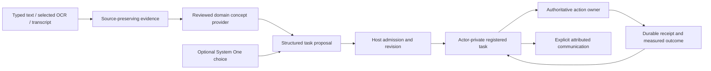

# Shared NPC intelligence

The shared implementation lives in `engine/gameplay/ai/intelligence/`. It executes bounded registered tasks using seven injected actor ports. The host owns identities, physical bodies, authoritative effects, permissions and simulation time. An actor's observations and progress belong to that actor.

**The first live Virtual Realm milestone is not complete.** The current Realm engine adapter does not admit independent actor bodies or collision/navigation. The new composition reports this as unavailable and is not connected to the existing factory. Its tests use explicit host fixtures. Neither those fixtures nor the recovered town simulation demonstrate deployed inhabitants.

Source: `webgpu-os/apps/the-virtual-realm/runtime/RealmEngineAdapter.js`, `RealmProgramActorRuntime.js`, and `tests/npc-intelligence/actor-host.test.js`.

## Delivery status

| Plan area | Implemented and verified | Remaining boundary |
| --- | --- | --- |
| Source baseline | Content-addressed recovery of later A24/A25 and the historical catalog; exact hashes, source inventory and repeatable reference runners | Historical laboratories are reference material until individual provider tests pass |
| Language and evidence | Typed/OCR/transcript evidence, reviewed RealmForge concepts, lazy compiled spelling, bounded attributed testimony, existing document-reader and voice adapters | A domain must supply meanings and authorize report delivery; reading does not publish definitions or train recognition |
| Task execution | Registered hierarchical methods, explicit need-scale projection, local finite candidate scoring, actor-private checkpoints, bounded explicit care interruption/return, effect reconciliation and 16 source-backed A25 recipes | Full occupation coverage, automatic care scheduling and live domain effects remain unbound |
| Persistence | Real AppSandbox encrypted, scoped checkpoint CAS, atomic private task archival, durable identity checks and strict readback | Each world owner must persist accepted effects and receipts atomically with its authoritative state |
| Navigation | Existing Pathfinder and locomotion body contracts, admitted ground routes, measured arrival and stale-route checks | Production Virtual Realm traversability, body admission and perception remain unavailable |
| Echo and models | Opt-in scoped tool registration and actor-bound System One Game Director adapter | Current Virtual Realm app does not install these tools without its admitted host |
| A25 town | Pure demand/planting planner compared against original A25 behavior; bounded care, reading, repair, courier and farming recipes; recovered eleven-resident oracle | Production farming, bakery, delivery, trading, repair, wildlife, incidents, custody and restitution bindings remain pending |
| Historical capabilities | Full recovered inventory with original research/reference labels | Controlled language, spatial/container reasoning, cooperation, postal chains and visual query providers require staged promotion |

The repository contains substantial concurrent RealmForge, System One and Virtual Realm work. This implementation is additive. It does not change their saved documents, installed app admission, singleton Echo body, camera or boot path.

## Ownership and data flow



The ports are injected interfaces, not seven services:

| Port | Required methods | Owner requirement |
| --- | --- | --- |
| `self` | `read` | Return this actor identity and current owner revision |
| `perception` | `observe` | Return available, attributable observations from an admitted source |
| `memory` | `read`, `write`; optional paired `archive`, `hasArchivedTask` | Store this actor's checkpoint within current operator/world scope; archival atomically preserves settled history and permanent task identity |
| `meaning` | `resolve` | Return an explicitly positive resolved result; no implicit success from an empty response |
| `navigation` | `resolveTarget` | Resolve an admitted target reference with current world/anchor revision |
| `actions` | `admitTask`, `executeOnce`, `readReceipt`, `suspendTask`; optional paired `prepareCareInterruption`, `validateCareReturn` | Own authorization, atomic commit, idempotency, immediate retirement of movement and current care/return eligibility |
| `communication` | `prepare` | Select the recipient and disclosed report; this prepares data, not delivery |

Source: `ActorTaskRuntime.js`. Provider failures, unavailable perception/navigation, unknown outcomes and exhausted planning budgets cannot become successful goals.

## Registered tasks and accepted effects

`createRegisteredMethods()` supplies `move-and-observe@1`, `inspect-and-report@1` and the single-move `return-to-anchor@1`. Domain methods may compose registered methods and data-only operations. Expansion rejects cycles and caps depth at 8 and leaf steps at 64. Definitions cannot install executable callbacks. Existing behavior-tree and working-memory primitives are reused.

`createActorTaskRuntime({ actorId, ports, clock, random, methods, logger })` exposes `initialize`, `snapshot`, `propose`, `admit`, `step`, `pause`, `resume`, `cancel`, `reconcile`, `archiveHistory` and `drain`. Its explicit care controls are `interruptForCare`, `returnFromCare`, `resumeInterruptedTask` and `cancelInterruptedTask`. The injected clock uses monotonic integer simulation ticks. No rendering timestamp or global random source enters logical state. The present built-in methods do not sample randomness.

The intent specifies a stable task ID, actor ID, structured goal, constraints, quantities, source references and exact registered method/version. Proposal is separate from admission. Each `step()` advances at most one leaf. Each actor has one action queue. History retains at most 64 tasks and working memory at most 32 observations.

A move step can name its own `payload.targetRef`, which becomes the navigation context's destination. This supports depot, pickup and delivery legs through the same navigation port. Without an explicit step target, the original task goal remains the default. An explicit invalid target is refused, never replaced with a different destination.

With archival ports, proposals retain at most four previous tasks in the active checkpoint by first moving older terminal tasks into private durable records. `archiveHistory({ keep: 0 })` explicitly archives all settled history; its default retains four. The current task is retained. Active, paused, blocked or unresolved tasks cannot be archived. A definite archived-identity lookup precedes every new proposal, so eviction and restart never permit task ID reuse. Providers without the optional pair retain the original 64-task stop. Individual records and transactions still have byte budgets; unavailable storage stops work without deleting evidence.

`ActorNeeds.js` projects explicitly declared domain ranges and polarity into the scheduler's 0..1 satisfaction scale. High A25 hunger deficits therefore become low satisfaction. Program actors receive only the needs their domain defines. Unknown or uncertain values fail instead of being silently corrected. `rankActorActivities()` reuses `AIScheduler.scoreActivity()` and `AIUtility.linearCurve()` for a bounded, host-supplied legal candidate set and deterministic tie order. Scores produce proposals, not permission. Existing mutable NPC schedulers and inventory helpers are not installed as a second state owner.

Before dispatch, the effect ledger checkpoints the stable actor/task/effect identity and expected owner revision. The actions provider must validate revision, perform the effect and persist its receipt in one authoritative transaction. The checkpoint store is **not** that transaction. A lost reply is unknown: the runtime queries its receipt and never blindly re-dispatches. Cancellation preserves committed results and unresolved journal entries. A restored actor starts paused and must reconcile before resuming.

Accepted task, accepted movement, observed arrival and completed goal are distinct. Movement completes only with an owner result that records arrival. Reaching an application's building grants no filesystem, application execution or definition-editing permission.

Source: `RegisteredMethods.js`, `ActorTaskRuntime.js`, `EffectLedger.js` and `webgpu-os/factory/sdk/ActorTaskTools.js`.

## Explicit care interruption and return

Care support requires both optional actions methods. `prepareCareInterruption` supplies an available return anchor for the exact actor, primary task, care task and current owner revision. `validateCareReturn` must later verify care eligibility, retained context and measured arrival at that same anchor. The runtime does not infer these host facts or install a care scheduler.

The caller drives five separate transitions:

1. `interruptForCare(careIntent)` immediately retires primary movement, waits for accepted work to settle, reconciles its receipts and preserves the primary task in one suspended slot. The registered care task is only proposed.
2. `admit()` requests separate care admission. The host advances the care task with ordinary `step()` calls.
3. Once care is terminal and settled, `returnFromCare({ taskId })` proposes a fresh `return-to-anchor@1` task. Separate admission and a measured movement receipt are required to complete that return.
4. `resumeInterruptedTask()` verifies the primary receipts and current owner return validation, then restores the primary task paused with its completed prefix intact.
5. `resume()` requests fresh primary admission and checks return eligibility again before the next unfinished step can execute.

Only one primary task may be suspended. Nested care, unrelated new proposals and archival are blocked while it remains suspended. Care and return records consume the existing bounded history budget. `cancelInterruptedTask()` cancels future primary work while retaining its accepted receipts and leaving the current care or return task intact. No operation refunds money, replaces cargo or rewinds world effects.

Each durable care transition requires an explicit successful checkpoint acknowledgment. A missing, malformed or failed acknowledgment fences further runtime work until the caller reopens authoritative storage and restores the actor. It cannot be resolved by retrying a potentially committed transition against stale local state.

The opt-in SDK exposes `interruptActorForCare`, `returnActorFromCare`, `restoreInterruptedActorTask` and `cancelInterruptedActorTask` under `os.the-virtual-realm`. Every call checks the existing app authority and current scope. Public status includes only suspended task identity, method and progress, plus the current task's return-required flag; it excludes private observations, cargo and anchor context. These tools are not installed in the live Virtual Realm app.

Source: `ActorTaskRuntime.js`, `RegisteredMethods.js`, `webgpu-os/factory/sdk/ActorTaskTools.js` and `ActorCheckpointStore.js`. Focused probes: `tests/npc-intelligence/actor-care.test.js`, `actor-checkpoint.test.js` and `actor-host.test.js`.

## Persistence and retirement

`createActorCheckpointStore({ sandbox, operatorId, worldId, actorId, assertCurrent, maxBytes })` adapts an existing AppSandbox. It reads an exact opaque token before writing, uses `setManyIfAllUnchanged` with a current-scope assertion inside the native transaction, and verifies exact bounded readback before advancing its token. Writes detach caller data and serialize locally. A stale writer or uncertain persistence failure invalidates the instance; it does not refresh its token and overwrite another writer.

`close()` revokes access synchronously and drains owned work. It does not delete data or close the caller's sandbox. Account, world and actor identities form separate checkpoint scope. The default maximum is 262,144 bytes, with allocation preflight before persistence.

The same store implements `archive({ before, after, tasks })`, `hasArchivedTask(taskId)` and private `readArchivedTask(taskId)`. One exact-token native transaction writes immutable per-task records and removes only the matching terminal prefix from the checkpoint. It checks the unchanged current task and working memory, rejects unresolved effects and verifies every committed record. Ordinary checkpoint writes cannot drop task identities or restore an archived ID. Archive keys hash the operator/world/actor scope and task identity; the encrypted record also validates the full identities. There is no deletion or automatic retention expiry.

Archives remain outside the loaded runtime history; each record is bounded by the checkpoint byte budget and one archive transaction by four times that budget. Durable storage grows with completed work and remains subject to the owning sandbox's quota. A lost or malformed archive acknowledgment fences the runtime and store until reopened from authoritative private storage. Archival is serialized with checkpoint writes, so late saves cannot reinsert the removed history. It preserves original cargo, evidence and effect receipts but grants no world-effect authority or public inspection access.

Existing runtime checkpoints retain schema version 1 until the first care interruption upgrades them to version 2. Version 2 contains `suspendedTask`, either one validated paused primary record or `null`; version 1 forbids that field. The store preserves task identity across current, suspended and historical slots, rejects unsettled or foreign suspended receipts and prevents downgrade to version 1. The encrypted storage envelope and scoped key remain version 1. This private schema upgrade is separate from A24/A25 world migration.

`createRealmProgramActorRuntime()` leases one runtime per actor from one admitted host. A second owner cannot attach concurrently. Disposal pauses actors before waiting, drains operations and checkpoint writes, then releases leases. A lease returned after cancellation is still released. A revoked old scope cannot write a final checkpoint; restoring its prior checkpoint still pauses the task. A failed physical lease release keeps ownership blocked.

The embedding host disables this integration by unregistering its actor tools and awaiting the existing runtime's `dispose()` before releasing providers. Constructing a separate disabled runtime does not retire a previously enabled instance. Saves and unresolved receipts are retained. Actual window hiding, account/document replacement and enable/disable UI must use this teardown path when the live host is integrated.

Source: `webgpu-os/factory/sdk/ActorCheckpointStore.js` and `webgpu-os/apps/the-virtual-realm/runtime/RealmProgramActorRuntime.js`.

## Language, evidence and shared definitions

`LanguageEvidence.js` preserves original content, OCR/transcript records, review provenance, observer/source identity and uncertainty. `ActorLanguageAdapters.js` wraps the existing Factory document reader and a caller-supplied existing speech callback. The adapter neither changes Particle Voice pronunciation precedence nor creates a competing playback owner.

`createRealmForgeConceptResolver()` reads the existing RealmForge build library's reviewed definitions. `ConceptRegistry.js` references `{ providerId, definitionId, version, contentHash }` and checks review status again on use. It does not duplicate RealmForge definition persistence. Revoked or changed definitions cannot remain trusted through a warm alias lookup.

Spelling membership is optional. It does not establish a meaning, repair an uncertain OCR quantity, publish a definition, grant a skill or choose a pronunciation. OCR text requiring quantity review remains non-executable evidence. Full OCR records remain with their document owner; task checkpoints carry bounded projections and source references. The evidence limit and checkpoint limit differ deliberately.

`createCompiledSpellingResource()` lazily reads the actual PRLX graph from `engine/gameplay/ai/intelligence/resources/spelling/`. Construction performs no fetch. First lookup checks the pinned manifest, compressed and decoded hashes, graph structure and accepted-language count. Its 228,133 normalized keys use NFC plus ASCII A–Z folding, preserving the source policy rather than substituting Unicode-wide lowercase. The decoded graph has 82,500 states and 205,470 edges; lookup retains compact binary data and offsets rather than expanding every word. Inject it as `spellingResource` into `createConceptRegistry()`. The owning caller closes the resource. Original Hunspell/CMUdict notices accompany it; pronunciation arrays and neural weights are not production spelling resources.

Reading, testimony, delivery, belief and task acceptance are separate. A report must retain its source and uncertainty; repetition of one source is not independent corroboration. A host must explicitly select the disclosed content and recipient. It must not expose an actor's entire private observation store through public inspection tools.

`ActorCommunicationEvidence.js` prepares and validates selected testimony, relays only through the previous recipient, and creates an actor-private received observation. Selection is explicit and bounded to 4,000 UTF-16 units; reports permit at most eight hops. The immediate speaker, original source, evidence revision hash, uncertainty and correlation identity remain separate. Received testimony always retains `witnessed: false`, `independentCorroboration: false` and `executable: false`. Hashes identify content; they do not authenticate authorship. Delivery still belongs to the authoritative communication effect owner.

## Ground movement contract

`createActorGroundNavigation()` accepts an existing host-owned body and the engine's admitted navigation grid. It does not allocate a body or use the inspection camera. The world contract uses metres in world coordinates; target references identify versioned anchors. The host remains responsible for clearance, access rules and generating traversable geometry.

The adapter uses the existing engine pathfinder with cardinal ground paths. It rejects unsupported vertical/movement modes, blocked starts/destinations, stale world revisions, stale anchors and modified route data. A route binds its measured starting pose; a displaced actor must request a new route. Active poses must stay within the current admitted segment and ground layer. Waypoint tolerance shrinks for small cells. Collision-resolved measured poses establish arrival. An accepted movement request alone does not. The host calls `step(dt)` with a positive step of at most 0.1 seconds; there is no private animation timer. Route storage is bounded to 128 entries and world grids to 65,536 cells. The owner can stop, release routes and dispose the adapter. It stops physical motion before revoking or reassigning the body lease; retained old navigation handles cannot read or write the next owner's body.

Tests exercise the existing Pathfinder and Navi locomotion controller against an explicit CPU collision fixture. They are mechanics tests, not production physics admission.

## A25 registered methods

`createA25TaskMethods()` registers 16 versioned recipes alongside the three built-in methods, for 19 entries by default. The pack covers drinking, resting, eating, page/manual reading, equipping a maintenance tool, three repair-stage entry points, learning then repairing, three delivery phases, planting, watering and harvesting. Importing it installs no providers or effects. Source identities and SHA-256 hashes pin the recovered frontier code, scene policy and activity owner.

`A25_TASK_CONTRACTS` records structured prerequisites and expected completion evidence. Repairs retain the physical bow identity and require the acquired current procedure, skill, tool and material. Delivery alternatives distinguish open, claimed and carried jobs; they preserve the same cargo and existing employer funds. Farming keeps crop phase and accepted planting quantity with the domain owner. Reading records personal page acquisition from owner-provided text; these recipes do not certify OCR acquisition or publish shared definitions.

`selectA25TaskAlternative()` asks an explicit owner validator to check a finite ordered set at the same actor and owner revision. Only an exact positive response yields a proposal. Task admission and each accepted effect still require current host checks. This function does not evaluate prerequisite prose, infer unavailable world facts or select a legally executable action from spelling membership.

`A25_CARE_INTERRUPTION` preserves the source's inclusive urgent/resume deficit thresholds of 75/55, care priority and retained task/cargo/anchor requirements as policy data. `selectA25CareInterruption()` projects explicit owner observations through `ActorNeeds.js` and proposes the first actionable need in thirst, hunger-with-home-food, fatigue order. Every proposed method requires an exact actor/method/revision response from the supplied owner validator. A denied first-priority choice stays blocked rather than falling through to a different care activity.

The selector requires explicit availability, detention, sleep, pending-effect, facility, care, suspension and home-food flags. Unknown or omitted flags cannot become false. Pending effects and unavailable actors block selection; active facilities, existing care/suspension and the source's excluded methods prevent a new interruption. On resume review, hunger blocks only when known home food makes a meal actionable. `resume-ready` means no source-defined actionable care remains; it does not authorize return or primary execution. **Automatic care scheduling and the concrete town host remain unbound.** The pack rejects nesting drink/rest recipes because their activity-result references are defined for top-level execution, and reserves the source-derived `a25.` namespace.

Native pack checks execute every exposed recipe directly or within its registered composition through the preserved A25 reducer. They verify real page acquisition, timed care, owned home-meal consumption, repair continuation after a committed prefix or lost reply, already-paid cargo delivery, and planting/watering/ripe harvest with the captured yield and original basket. Source comparisons also check care priority, inclusive thresholds, exclusions, conditional hunger resumption and denied-candidate behavior. These tests caught the distinction between a `CLAIMED` delivery job and its separately carried item; there is no source `CARRIED` job phase. The test owner remains isolated from the live Virtual Realm.

Source: `A25TaskMethods.js`; acceptance probes: `tests/npc-intelligence/a25-task-methods.test.js`.

## A25 demand fidelity

`FoodDemandPlanning.js` reads an owner snapshot and returns a proposed planting quantity. It never edits inventories, money, reservations or crops. It distinguishes public saleable meals from private grower meals, carried/container stock and reservations. Timely public commitments cover demand; growing commitments also reserve capacity. Captured planting quantity does not change when later demand changes.

Default A25 policy is two coverage days, four buffer units, a public-stock ceiling of 24, twelve planning slots of headroom, a seven-unit yield ceiling and a 1,440-minute commitment delay limit. Hosts may configure these scenario policies. Eleven residents and the reference object's 256 cap are scenario settings, not engine limits.

The owner must atomically compare the returned expected revision and accept the proposed planting effect. The planner cannot manufacture money, delete surplus or create replacement resources to make a recovery metric pass.

## Source baseline and reproduction

`tools/recover_particle_research.py` recovers the M12 catalog into `tests/npc-intelligence/reference/`. The manifest retains 514 named entries, deduplicated into 467 gzip objects. Original decompressed source bytes and hashes are preserved. All 171 documents and 328 source catalog entries are accounted for. Earlier loose A24 and later embedded A24 are distinct lineages, even where they share schema names.

The large HTML archive and test payloads are outside the production dependency graph. The original source notices remain intact; the project's headers on recovery tooling do not relicense the source data. The optional lexical resource has its own provenance and original Hunspell/CMUdict notices.

The baseline README and `reference/capabilities.json` inventory 60 laboratories and 42 supplied suites. Their original reference/research statuses do not claim production promotion. `reference/evidence/` contains fresh execution receipts as well as retained failed harness attempts. A `RUNNING` or `FAILED` receipt is not a completed pass.

The separate `reference/production-capabilities.json` maps 24 mechanisms and 12 families across all 60 laboratory routes to current repository interfaces, required providers, tests and remaining work. Its `PROMOTION_MAP.md` explains how to interpret the map. A nearby existing API is a reuse candidate, not proof of equivalent behavior. The raw recovered capability map remains unchanged.

```powershell
python tests/npc-intelligence/test_research_baseline.py
python tests/npc-intelligence/run_research_reference.py
python tests/npc-intelligence/run_research_reference.py --skip-cases --days 90 --legacy-days 90 --output tests/npc-intelligence/reference/evidence/horizon-90.json
python tests/network/run_realm_browser_tests.py tests/npc-intelligence/language-evidence.html tests/npc-intelligence/actor-runtime.html tests/npc-intelligence/actor-checkpoint.html tests/npc-intelligence/actor-navigation.html tests/npc-intelligence/actor-host.html tests/npc-intelligence/food-demand.html tests/npc-intelligence/food-demand-reference.html --timeout-ms 60000
python tests/npc-intelligence/run_actor_integration_tests.py --regressions
```

The A25 corpus compares 81 cases and 415 behavior assertions against original expected hashes, fresh Python execution, browser main-thread execution and a real dedicated Worker. Production demand tests compare 33 forecasts, 16 before/after operation cases and six captured planting results. These counts overlap; they are not independent intelligence scores.

The current `reference/evidence/actor-care-and-a25-integration.json` receipt records 22 passing browser pages in 103.609 seconds, with all 51 selected source/resource/harness fingerprints unchanged during execution. Twelve actor pages cover 287 checks, including care interruption/return, encrypted schema migration, scoped tools, 31 A25 recipe/policy probes and the 55 demand reference comparisons. Ten pages exercise existing locomotion, OCR, pronunciation, RealmForge, System One and Virtual Realm boundaries. The reference baseline separately passes all 17 Python integrity/semantic tests. These are local, isolated test executions, with external browser traffic denied by the actor runner; fingerprints cover the selected files, not the whole concurrently edited repository. They do not establish live Realm admission.

The earlier `actor-archive-and-a25-final.json` receipt records 21 passing pages, 246 actor checks and 49 stable selected fingerprints before the explicit care workflow. It includes a 70-task encrypted-storage campaign preserving all 65 archived originals, which the current campaign also reruns. Complete compiled spelling enumeration separately checks every one of the 228,133 original normalized keys against the production decoder.

The earlier `actor-integration.json` remains the historical 19-page/202-check foundation receipt. `actor-archive-and-a25-integration.json` retains two failed RealmForge AI Explore fixtures whose former unknown word, “warm,” had become supported by the concurrent local resolver. The test-only correction uses an unresolved descriptor and asserts an actual AI call. Its focused `realmforge-fixture-correction.json` run passed all behaviors but is still marked failed because concurrent RealmForge source edits occurred during execution. Both later combined receipts passed behaviors and selected-source stability. No production construction behavior was changed to satisfy those fixtures.

`reference/evidence/reference-verification.json` links six completed verification scopes by content hash. A25 complete-state parity holds for all 90 days, or 64,800 simulation ticks per context. Final reference metrics reproduce 89 live objects, 23 food units, 944 meals, 174 harvests and 236 copper. A separate eligible later-A24 day-90 migration passes 15 checks and one complete subsequent day in all three contexts. That is not a reproduction of the supplied 21-day post-migration campaign.

The initial corpus and long-horizon processes retained an old browser-context setup error in their later migration phase. Their raw receipts correctly remain `FAILED`. `corpus-results.json` and `horizon-results.json` certify only their completed, checked phases and retain links to those raw failures; `migration-90.json` records the independent successful migration execution. `summarize_research_verification.py` rejects incomplete phases or unexpected failures when constructing the summary. Historical suites and supplied mutation/UI campaigns are not claimed as fresh passes.

The original initial later-A24 checkpoint can contain a harvest crate without `harvest_count`. Its frozen A25 migration raises an error for that input. The baseline regression preserves this source limitation. Eligible migration tests use an actually advanced later-A24 checkpoint; production migration must check lineage and validate captured manifests rather than accepting only a schema name.

## Admission checklist for the next live milestone

1. The existing Virtual Realm task supplies the admitted host with independently identified bodies, fixed simulation ticks, current operator/document generation and real collision/navigation.
2. The host provides public information surfaces with source revisions, acquisition conditions and spatial frames. Missing perception stays unavailable.
3. Each actor receives private checkpoint storage and a world-owned atomic effect/receipt provider. Inject existing scheduler and domain needs through adapter boundaries; do not create a competing world owner.
4. Enable the opt-in composition, then register supported tools through the existing app tool admission. Bind cancellation, hidden-host pause, account/document replacement and disposal to the same owner lifecycle.
5. Prove actor A moves to a public surface, observes its content and sends a selected attributed report to B. Prove B records testimony without acquiring A's private knowledge or claiming firsthand observation.
6. Run without model access, vary rendering rates with the same fixed simulation/event sequence, inject lost replies/restarts, and measure scheduling cost, memory growth, navigation and perception latency on the actual host.
7. Bind the remaining A25 town operations to real entities and accepted effects, including needs/care, resources, recipes, money, wildlife and justice rules. Preserve quantities and committed cargo on interruption.
8. Promote historical language, spatial/container, cooperative, logistics/book and visual-query capabilities individually. Route construction through the existing validated RealmForge pipeline. Unsupported prose and geometry remain explicit limitations.

Only the completed two-actor live scenario satisfies the first live milestone. Reference parity, test-host composition and offline local task execution establish reusable foundations; they do not replace that acceptance.
