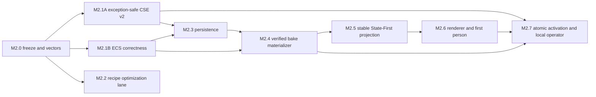

# Virtual Realm M2 Engine and ECS Foundation

The Virtual Realm cannot begin with a renderer. M2 first needs a canonical
state boundary that survives exceptions, an ECS that can be snapshotted and
restored completely, and a verified bake materializer whose stable identities
do not depend on runtime handles. Only then can State-First, first-person
traversal, local Operations, and atomic bake activation be trusted.

This is the Engine-specific execution plan for
[M2 Runtime Foundation](../webgpu-os/virtual-realm/m2-runtime-foundation.md).
It also establishes the reusable correctness and recipe substrate required by
Genesis Ecology. It does not implement M3 live scanning, remote shells, or
multiplayer.

The accepted M2C-dependent subset now provides positive safe-integer entity
handles, synchronous entity-destruction hooks with archetype cleanup, canonical
falsy component reads, dense presentation slots with reuse generations, one
candidate ECS adapter, exact static components, world-space AABBs, and a
disabled/off-active State-First source. It does not complete the structural
command buffer, strict scheduler, authoritative tick rollback, complete world
codec, full production renderer, first-person controller, or atomic activation portions
of this plan. The accepted M2D-A addition deterministically converts that real
M2C state into an immutable, digest-admitted CPU render plan while retaining
zero surface, frame, GPU, visibility, or interaction authority. Accepted M2D-B0
adds the pinned renderer profile: exact camera convention, pass and attachment
topology, material/light/LOD policy, geometry/f32 bounds, device requirements,
and resource ceilings, still with zero allocation or visibility. Accepted
M2D-B1 compiles that admitted pair into exact CPU primitive, instance,
material, light, LOD-membership, pass, identity, disclosure, and conservative
bounds records without allocating a GPU object. The isolated M2D-B2 foundation
adds strict GPU admission and owner binding, bounded transfer/job/frame
execution, a persistent-canvas surface, static geometry/identity/ACES passes,
first-frame visibility, loss concealment, ordered teardown, and clean
replacement-generation admission. The accepted M2D-B3 substrate adds a
kernel-owned, Virtual-Realm-only composition registry, guarded Desktop lease
transport, an exact dependency-version-2 assembler, and process-owner-coupled
GPU epochs. M2D-B4A freezes the operator-context application wire. M2D-B4B
freezes the complete runtime-activation/eligibility/active-teardown application
wire and exact prepared-CSE receipt binding without executing CSE step 8 or
transferring candidate ownership. M2D-B4C freezes the complete five-method
runtime-checkpoint application wire, exact sanitized checkpoint projection and
binding, closed operation results, and profile-bound read cap without reading or
mutating a durable checkpoint. M2D-B4D freezes exact handoff read/write/clear,
checkpoint cross-binding, CAS results, and tombstone lineage while retaining a
read-only adapter. M2D-B4E freezes the exact owner-local action submit/observe
wire, safe proposal/receipt/result snapshots, seven-field correlation, and
closed denial/recovery vocabularies. M2D-B4F freezes the exact owner-local
policy read/subscribe wire, nested policy-head binding, safe policy snapshots,
and data-only invalidation. B4G closes the legacy surface/frame slot with an
argument-oblivious terminal singleton, leaving GPU authority on the accepted
owner-coupled presentation path. The Engine consumes or owns none of that policy;
the wire remains an injected application boundary. The genuine operator-context,
activation, checkpoint, handoff, action, and local-policy services and full authority provider are not
registered and no
physical WebGPU frame is accepted. Full M2.1B, M2E, and integrated M2 remain
unaccepted. (Sources:
`engine/ecs/world/World.js`; `engine/ecs/storage/ArchetypeStorage.js`;
`engine/render/state/StateFirstPresentationSlots.js`;
`webgpu-os/apps/the-virtual-realm/runtime/RealmEngineAdapter.js`;
`webgpu-os/apps/the-virtual-realm/runtime/RealmCandidateEligibilityContract.js`;
`webgpu-os/apps/the-virtual-realm/runtime/RealmRuntimeActivationPortContract.js`;
`webgpu-os/apps/the-virtual-realm/runtime/RealmRuntimeCheckpointPortContract.js`;
`webgpu-os/apps/the-virtual-realm/runtime/RealmRuntimeCheckpointAdapter.js`;
`webgpu-os/apps/the-virtual-realm/runtime/RealmRuntimeHandoffPortContract.js`;
`webgpu-os/apps/the-virtual-realm/runtime/RealmRuntimeHandoffAdapter.js`;
`webgpu-os/apps/the-virtual-realm/runtime/RealmActionAuthorityPortContract.js`;
`webgpu-os/apps/the-virtual-realm/runtime/RealmLocalOperatorPolicyPortContract.js`;
`webgpu-os/apps/the-virtual-realm/runtime/RealmRuntimeDependencyContract.js`;
`webgpu-os/apps/the-virtual-realm/rendering/RealmSceneAssembler.js`;
`webgpu-os/apps/the-virtual-realm/rendering/RealmStaticRenderPlanContract.js`;
`webgpu-os/apps/the-virtual-realm/rendering/RealmStaticRendererProfileContract.js`;
`webgpu-os/apps/the-virtual-realm/runtime/RealmGpuPresentationSyscallAdapter.js`;
`webgpu-os/apps/the-virtual-realm/rendering/RealmStaticGpuPresenter.js`;
`webgpu-os/kernel/GpuPresentationCapabilityAdmission.js`;
`webgpu-os/kernel/AppRuntimeCompositionRegistry.js`;
`webgpu-os/kernel/realm/RealmM2RuntimeComposition.js`;
`webgpu-os/kernel/realm/RealmOwnerCoupledGpuPresentationPort.js`;
`webgpu-os/shell/Desktop.js`.)

## Locked dependency order



M2.1A and M2.1B run in parallel. M2.2 is a parallel performance lane and does
not block static-bake boot. Persistence waits for complete CSE and ECS codecs.
Activation waits for all earlier correctness gates.

## Existing boundary and concrete risks

| Area | Existing foundation | M2 risk that must close |
| --- | --- | --- |
| CSE transaction | `engine/state/transaction/Transaction.js` and `engine/state/transaction/CommitCoordinator.js` | Loose effects are not completely bound to the accepted transaction; an exception after canonical mutation can leave partial state |
| CSE stores | Facts, entities, USOs, capabilities, fencing, causality, idempotency, outbox, and event log already exist | There is no complete validated clone/snapshot/root covering every authority-affecting plane |
| Deterministic simulation | `engine/state/sim/WorldDynamics.js` | Reseeding per call can make segmented execution differ from one monolithic run |
| ECS handles | `engine/ecs/world/World.js` | Signed bit packing can create invalid/negative or colliding handles as generations grow |
| ECS destruction | `World.js` and `engine/ecs/storage/ArchetypeStorage.js` | Direct destruction can release an entity slot before all component storage is cleaned |
| ECS query | `engine/ecs/query/Query.js` | Iteration snapshots arrays and allocates helpers; structural mutation during iteration has no explicit barrier |
| System order | `engine/ecs/systems/SystemRegistry.js` | Missing dependencies can be ignored and cycles can fall back to a plausible order |
| Tick failure | `World.js` | Swallowed system errors can leave a partially advanced authoritative tick |
| Persistence | `engine/ecs/world/WorldPersistence.js` | Current snapshots are diagnostic and incomplete; full component/system state cannot be restored |
| Recipe graphs | Particle and RealmForge already own domain schemas and plan bytes | A new generic schema would duplicate authority and risk changing canonical output |
| State-First IDs | `engine/render/state/StateFirstRetainedStorage.js` indexes directly by numeric ID | Stable string IDs and safe-integer ECS handles cannot be used as dense GPU offsets |
| Renderer lifecycle | `engine/render/mesh/EntityMeshRenderer.js` | Candidate meshes and device-recovery resources lack one complete unregister/destroy ownership path |

The M2 implementation changes only the affected Engine owners. Vendored Kaolin
and PhysX bindings remain untouched.

## M2.0 baseline and freeze

Before editing Engine state or ECS code:

1. Run and preserve every accepted Virtual Realm M0 and RealmForge M1A-M1C
   browser gate.
2. Reuse the existing M1 fixture providers where a bake is required; do not
   create a second representation of the same station artifact.
3. Freeze browser and independent Python vectors for current CSE transaction,
   state root, Entity IDs, particle recipe plans, RealmForge plans, bake package
   records, and State-First decisions.
4. Capture exact legacy error order, serialized bytes, plan hashes, last-good
   behavior, and resource ownership.
5. Establish reference hardware, viewport/DPR, entity/cell counts, CPU/GPU
   timings, memory, and allocation counters before setting performance budgets.

This baseline permits internal optimization only when external canonical output
and error behavior are intentionally preserved.

## M2.1A exception-safe CSE v2

### Canonical effect record

Add `engine/state/CausalStateTransition.js` as a bounded exact-key record:

```text
CausalStateTransitionV2
  transactionId
  expectedPreRoot
  proposalDigest
  factDelta
  outputs
  entityWrites
  externalEffectIntents
  effectsDigest
```

`effectsDigest` covers the canonical bytes of every fact delta, created or
consumed output, entity write, and external-effect intent. It also binds the
accepted proposal/intent digest. No loose unauthenticated input may be supplied
beside the transition after validation.

`Transaction.js` retains its V1 constructor and serialized form for
compatibility. A separate V2 constructor requires the effect digest and permits
only the cryptographic `sealTransaction()` path. Fast 32-bit sealing is not
accepted for production Realm activation or Genesis promotion.

### Stage, verify, then swap

Add `engine/state/CausalStateRuntime.js` as the single owner of the canonical
store bundle. It keeps every mutable registry private and serializes commits
through one real commit chain. `SerializableQueue` may provide conflict
evidence, but it cannot replace execution serialization because concurrent
async clones can otherwise race.

The commit transaction is:

1. Capture the active immutable bundle pointer and full runtime root.
2. Validate transaction, transition, effect digest, proposal, capability,
   fencing, causality, idempotency, and expected pre-root without mutation.
3. Clone the complete bundle into a staging owner.
4. Prevalidate all entity writes, fact deltas, output spends/creates, log
   entries, and external-effect intents against the stage.
5. Apply stage mutations in canonical order.
6. Compute and verify the post-root, event head, idempotency receipt, outbox
   intents, and complete commit receipt.
7. Obtain every required signature over final canonical receipt bytes before
   the active pointer changes.
8. Swap one bundle pointer in an allocation-free, non-throwing step.
9. Publish admitted external effects from the committed outbox under their own
   idempotency and retry policy.

Any validation, clone, mutation, digest, signer, event-log, idempotency, outbox,
or receipt exception discards the stage. The active stores, root, entity heads,
and event head remain byte-identical.

Steps 1 through 7 return one opaque non-serializable branded
`CausalStatePreparedCommitV2` handle and one frozen safe
`CausalStatePreparedCommitReceiptV2`, plus the separate safe
`preparedSwapReceiptDigest`; they do not perform step 8. The receipt has
exactly `format`, `version`, `transactionId`, `activeBundlePointerGeneration`,
`activeBakeCsePredecessorDigest`, `expectedPreRoot`, `transitionDigest`,
`effectsDigest`, `stagedPostRoot`, `stagedEventHead`,
`idempotencyReceiptDigest`, `outboxDigest`, `commitReceiptDigest`,
`signatureSetDigest`, `activeBakeOutputRecordDigest`, and
`preparedCommitDigest`. Its format/domain is
`particle-realms.causal-state-prepared-commit`, version `2`, and only
`preparedCommitDigest` is excluded from the canonical self-digest. The live
handle owns the exact staged bundle and exposes only synchronous nonthrowing
identity fields; it has no callable own property and cannot be cloned,
serialized, restored, or used with another runtime. Only the separately injected
`activeBakeCsePort@1` may consume it through exactly `commitPreparedSwap()` and
`discardPrepared()`.

For the Virtual Realm, “owning runtime” is the OS-owned operator/Realm active-
bake CSE runtime, not an application-session Engine instance. WebGPU OS creates
exactly one such live runtime while that operator/Realm activation service
exists, then gives each Engine adapter a session-bound view of the same runtime.
Prepared handles remain non-transferable: a handle can be consumed only through
the exact view whose binding receipt names that shared runtime and the preparing
owner/lifecycle. A different CSE runtime, operator, Realm, or unbound session
view rejects it.

`activeBakeCsePort.commitPreparedSwap(preparedCommitHandle)` is exactly step 8.
It accepts the opaque handle directly, so no argument record is allocated, and
succeeds only while the owning runtime
still exposes the captured pointer generation and CSE predecessor. A caller must
serialize and reassert those values before
invocation. All allocations, validation, mutation of staged stores, hashes,
signatures, receipt construction, and outbox construction are complete before
the method becomes callable. Failure before the call discards the stage; after a
successful call the same handle cannot swap again.

The port returns the already preallocated frozen
`CausalStatePreparedSwapReceiptV2` reference with exactly `format`, `version`,
`preparedCommitDigest`, `activeBakeCsePredecessorDigest`,
`previousPointerGeneration`, `visiblePointerGeneration`, `stagedPostRoot`,
`commitReceiptDigest`, `activeBakeOutputRecordDigest`, `swapped = true`, and
`receiptDigest`. Its format/domain
is `particle-realms.causal-state-prepared-swap`, version `2`, and only
`receiptDigest` is excluded. Preparation first freezes
`preparedCommitDigest`, then constructs this receipt over that digest and
returns its safe `receiptDigest` separately as `preparedSwapReceiptDigest`
alongside the prepared handle/receipt. The prepared-commit receipt does not
contain the swap digest; this one-way ordering forbids a digest cycle. All
identity, predecessor, pointer-generation, post-root, and commit-receipt fields
are fixed before durable activation authorization. The receipt itself remains
private until step 8 succeeds. `discardPrepared(preparedCommitHandle, reason)` is
idempotent outside the no-await block and accepts reason exactly
`candidate-aborted`, `authorization-denied`, `predecessor-changed`,
`lifecycle-retired`, or `recovery`; it returns one frozen disposal
receipt and never touches the active pointer. That
`CausalStatePreparedDiscardReceiptV2` has exactly `format`, `version`,
`preparedCommitDigest`, `reason`, `discarded = true`, and `receiptDigest`; its
format/domain is `particle-realms.causal-state-prepared-discard`, version `2`,
and only `receiptDigest` is excluded.

For the Virtual Realm active-bake transition, `externalEffectIntents` is exactly
the canonical empty array and `outboxDigest` is the domain-separated digest of
the canonical empty outbox. A nonempty intent/outbox fails preparation before
offer. Consequently generic CSE step 9 is a proven no-op for activation:
visibility cannot dispatch an action, message, network operation, storage write,
or other external effect.

Before the first candidate in a newly created operator/Realm activation service,
its shared CSE runtime contains one canonical
`CausalStateActiveBakeGenesisV2` predecessor with exactly `format`, `version`,
`operatorPartitionId`, `realmId`, `activeBakeEntityId`, `entityVersion = 0`,
`pointerGeneration = 0`, `state = inactive`, `activeRuntimeBundleId = null`,
`activeAdmissionIndexDigest = null`, and `recordDigest`. The format/domain is
`particle-realms.causal-state-active-bake-genesis`, version `2`, and only
`recordDigest` is excluded. `activeBakeEntityId` is
`active-bake:v2:<hex>` where `<hex>` is lowercase SHA-256 of canonical UTF-8 JSON
for `["particle-realms.cse-active-bake",operatorPartitionId,realmId]`. The
record is part of the canonical initial CSE root, not lazily created by
activation. A later application session attaches to this same runtime and must
observe its current active record; it cannot create another genesis while a
live active pointer exists. After service-process loss no live pointer or
prepared handle survives, so a newly created shared runtime legitimately starts
from genesis and reactivation from a verified checkpoint/handoff is a new live
chain rather than a fabricated continuation. First activation consumes this inactive output and creates entity
version/pointer generation `1`; replacement consumes the exact active output and
increments both by one. Thus every activation has one exact predecessor and the
single-spend rules have no missing first-activation exception.

Every active output is one exact `CausalStateActiveBakeRecordV2` with exactly
`format`, `version`, `operatorPartitionId`, `realmId`, `activeBakeEntityId`,
`entityVersion`, `pointerGeneration`, `state = active`,
`activeRuntimeBundleId`, `activeAdmissionIndexDigest`,
`previousActiveBakeRecordDigest`, and `recordDigest`. Its format/domain is
`particle-realms.causal-state-active-bake-record`, version `2`, and only
`recordDigest` is excluded. `activeBakeEntityId` is unchanged from genesis;
`entityVersion` and `pointerGeneration` are positive uint64 decimal text and
each equals its exact predecessor plus one. For the first active output,
`previousActiveBakeRecordDigest` is the genesis digest; for replacement it is
the prior active record digest. Bundle and admission IDs equal the candidate
being prepared. The active record contains no prepared-commit or swap-receipt
digest, so its digest is frozen before `stagedPostRoot` and cannot form a digest
cycle. `activeBakeOutputRecordDigest` in both prepared and swap receipts equals
this record digest; the staged post-root must reach the exact record.

### Complete snapshot and root

Add `engine/state/CausalStateSnapshot.js` and a minimal
`engine/state/runtime.js` export. The Virtual Realm app must not import the
large `engine/state/index.js` barrel or optional replication/sharding surface.

Every CSE owner gains strict `snapshot`, `restore`, and `clone` behavior:

- `engine/state/facts/FactStore.js`;
- `engine/state/entity/EntityRegistry.js`;
- `engine/state/uso/USORegistry.js`;
- `engine/state/authority/CapabilityRegistry.js`;
- `engine/state/time/Fencing.js`;
- `engine/state/causal/CausalParents.js`;
- `engine/state/transaction/Idempotency.js`;
- `engine/state/workflow/Outbox.js`;
- `engine/state/integrity/EventLog.js`.

Nested entity content is deeply normalized and frozen before hashing. A shallow
record freeze is insufficient because later nested mutation can otherwise
change meaning without changing the recorded version/root.

`engine/state/integrity/StateRoot.js` V1 remains compatible. Runtime-root V2
adds facts and tombstones, full USO/spend history, entity versions and heads,
capabilities/revocations/consumption, fencing, causality, idempotency receipts,
outbox, and event head. Restore recomputes the root before any store becomes
active.

### Segmented deterministic time

`engine/state/sim/WorldDynamics.js` receives a counter/tick-derived deterministic
random stream. A call advancing four ticks must produce the same canonical
result as two calls advancing two ticks each from the same prior state. The
random stream identity, clock domain, starting counter, tick interval, and
algorithm version enter the snapshot and evidence.

### M2.1A gate

- Tampering any effect changes `effectsDigest` and fails before mutation.
- Signer, event-log, idempotency, outbox, and receipt exceptions leave every
  active store and root unchanged.
- Concurrent valid commits serialize with no lost update.
- An entity write is present in the post-root and absent after a failed stage.
- Idempotent replay returns the prior receipt after snapshot/restore.
- No mutable store, nested entity value, or staging owner escapes.
- Monolithic and segmented deterministic simulation are byte-identical.

## M2.1B ECS correctness

The safe-handle, destruction-hook, archetype-cleanup, falsy-value, and dense-slot
subset required by non-visible M2C is implemented. The exact Engine foundation
gate passes 11/11 cases, and the pre-existing M0 Engine foundation gate remains
6/6. This is not acceptance of full M2.1B: structural command buffering, the
allocation-free iterator, strict schedule compilation, authoritative tick
rollback, and the complete world codec remain planned below.

### Safe runtime handles

Replace signed bit packing with positive safe-integer handles:

```text
runtimeHandle = generation * 2^20 + index
```

The exact index width is frozen as an ECS policy constant. Encoding and decoding
reject non-integers, non-positive handles, invalid generations, indexes beyond
the configured maximum, and values beyond `Number.MAX_SAFE_INTEGER`. Exhaustion
fails explicitly. Persistent Realm, object, bake, Code Matter, Soul Seed, and
Eidos identity always remains a stable string/content ID in an app side table;
it never becomes this handle or a GPU lane.

The accepted compatibility wave exports one central positive-safe handle
validator plus low/high-word codec from `World.js`. Picking, grabbing, camera
tools, inspector editing, and AI blackboards preserve the complete JavaScript
safe integer. Collaboration divergence hashing is version 2 with an explicitly
named version-1 decoder, and chunk serialization version 2 stores AI target
handles as low/high words while retaining bounded version-1 reads. GPU AI
raycasts transmit dense per-dispatch indices and restore full handles through an
immutable map; entity and interaction RNG seed version 2 mixes both handle words
while explicit version-1 CPU/WGSL replay paths remain named. The focused
compatibility gate passes 28/28 cases. This compatibility work does not authorize
or instantiate a Virtual Realm GPU renderer.

### Destruction and storage integrity

`World.js` adds lifecycle-hook registration. `destroyEntity()` invokes all
registered storage cleanup under a structural barrier before it increments the
generation or returns an index to the free list. Cleanup is idempotent and a
failure aborts the authoritative structural transaction.

`ArchetypeStorage.js`:

- rejects component reads/writes/moves for unknown or dead handles;
- owns complete destroy cleanup instead of relying on a particular caller;
- bumps structural version consistently on every membership change;
- returns valid `0`, `false`, and empty-string component values rather than
  replacing them with `null`;
- validates swap-removal metadata and handle generation.

### Structural barrier and queries

Queries cannot mutate archetype membership while iterating raw storage. Add a
world structural command buffer with deterministic command order, expected
generation/version, conflict handling, and one commit barrier after the
authoritative system group.

Retain the compatibility query API and add an allocation-free iterator over
archetype chunks/columns. It must not copy every entity array or allocate one
metadata object/closure per entity. Queries validate handle liveness at the
entry boundary and use a frozen structural version for their traversal.

### Strict schedules and system failure

`SystemRegistry.js` gains a strict schedule compiler:

- duplicate names fail;
- missing `before`/`after` dependencies fail with the missing witness;
- cycles fail with one deterministic cycle witness;
- tie-breaking is stable and declared;
- authoritative access conflicts are verified before execution.

`World.js` gains system failure policy. Authoritative tick systems run against a
restorable snapshot/command stage and fail fast; a thrown system cannot leave a
partial tick. Render-only/reporting systems may use an explicit
report-and-continue policy because they do not own canonical state.

### Complete world codec

Add `engine/ecs/world/WorldStateCodec.js`. World persistence V2 includes:

- world/config/time and handle policy versions;
- complete entity table, generations, free-list, and stable-ID side-table
  binding;
- every registered component as `{ name, version, data }` through its declared
  codec and migration;
- archetype membership and structural version;
- opted-in system state, clock domains, pending structural journal, and active
  plan identities;
- content references and a complete snapshot digest.

`getWorldDebugSnapshot()` remains diagnostic and is never used for durable
restore. Existing component schema serialization may be reused only after its
runtime-field stripping and migration policy are verified for the component.
A missing component codec, unknown future version, corrupt membership, invalid
handle, or failed migration performs zero active-world writes.

### M2.1B gate

- More than 4,096 destroy/reuse cycles produce no collision or negative handle.
- Destroy removes every component row before reuse; dead writes fail.
- `0`, `false`, and empty-string component values round-trip.
- More than 256 entities, every registered component, and opted-in system state
  survive exact snapshot/restore.
- Missing dependencies and cycles fail with deterministic witnesses.
- Structural mutations commit in canonical barrier order.
- An authoritative system exception restores the pre-tick world.
- Compatibility queries and the no-allocation iterator return the same stable
  entity set.

Only the handle, destruction/storage, falsy-value, and dense presentation-slot
claims have implementation evidence in M2C. The remaining bullets continue to
gate full M2.1B and cannot be inferred from the 11-case focused suite.

## M2.2 recipe correctness and performance lane

The recipe upgrade accelerates the entire Engine and RealmForge without
creating a competing authored graph.

Existing domain authorities remain:

- `engine/sim/particles/recipe/ParticleRecipeGraph.js` for Particle recipes;
- RealmForge SystemGraph contracts/compiler and runtime plan for world recipes;
- trusted operation registries for executable callbacks.

Prompt/tool guidance registries never become executable recipe authority.

### Shared deterministic mechanics

Add three flat Engine modules:

```text
engine/core/graph/DeterministicDag.js
engine/recipes/RecipePlanKernel.js
engine/recipes/RecipePlanCache.js
```

`DeterministicDag` builds node, outgoing-edge, and incoming-edge indexes once,
uses deterministic Kahn ordering, accepts a caller comparator and explicit
deferred-edge policy, returns a deterministic cycle witness, and records O(V+E)
operation counters.

`RecipePlanKernel` is adapter-driven. Domain modules keep schema validation,
compatibility, operation definitions, serialized graph shape, error order, and
plan bytes. The kernel supplies generic indexing, ready sets, dependency
closure, phase/batch planning, impact sets, and evidence. Serialized plans are
plain data; executable callbacks remain inside injected trusted registries.

`RecipePlanCache` is content-addressed and noncanonical. A hit, miss, eviction,
or corruption cannot change output bytes. Cache identity binds graph digest,
domain/compiler versions, policy, capability profile, dependency identities,
and numeric/random versions. A 32-bit pipeline-cache hash is never canonical
recipe identity.

`engine/core/math/ExactCalculationReceipt.js` may additionally carry immutable
V1 SHA-256 replay evidence for exact integer or rational recipe calculations.
The receipt binds raw source, canonical AST and result, all nine evaluator
limits, and measured evaluator usage, and states the exact
`not-a-formal-proof` boundary. Verification deterministically replays and
compares the full body and receipt ID. This is numeric evidence only: it grants
no story meaning, identity or provenance, Realm/world-state truth, simulation
authority, policy authority, or mutation permission. It must never be inserted
into the B4F policy head or treated as a local-operator authority receipt.

### Compatibility work

Particle internals replace repeated `edges.some`, `edges.filter`, and repeated
ready-list sorting with the shared indexes while preserving exact serialized
plans and error order. RealmForge replaces repeated edge filters, node finds,
and its private topological work through the adapter while preserving its
existing validation, compiler calls, double-compile determinism check,
`planHash`, and `cacheKey` semantics.

Authoritative execution does not use `engine/core/scheduler/TaskScheduler.js`
until blocked jobs are retained correctly and Promise-returning callbacks remain
running until settlement. Before that gate, the scheduler is presentation or
background work only.

### M2.2 gate

- Particle and RealmForge golden plans, hashes, errors, and last-good behavior
  remain byte-identical.
- Explicit counters demonstrate O(V+E) graph indexing/order on the benchmark
  corpus.
- Cache hits and misses produce identical canonical output.
- Reordered source input with the same canonical graph produces identical plan.
- Cycle witnesses are deterministic.
- Serialized graphs/plans contain no functions or runtime handles.

Incremental subgraph reuse, worker execution batches, and authoritative
scheduler integration remain M3+ work after parity.

## M2.3 durable repository

Add flat application modules `VirtualRealmRepository.js` and
`VirtualRealmSnapshotCodec.js`. The repository consumes the read face of the
injected `bakeAdmissionPort` plus `runtimeCheckpointPort@1`; it does not
instantiate IndexedDB, `RealmContentStore`, an admission codec, or a durable
head. WebGPU OS owns the immutable admission store, exact-byte codecs, evidence
resolution, signature verification, and compare-and-swap authority. The
Engine-facing repository supplies deterministic runtime dependency resolution
and checkpoint logic over those narrow read results.

### Accepted M2D-B4C checkpoint boundary

The accepted provider-free `RealmRuntimeCheckpointPortContract` freezes exactly
`readLatest`, `prepareCheckpoint`, `commitCheckpoint`, `abortCheckpoint`, and
`retireCheckpoint`. It is a wire grammar, not an Engine persistence subsystem.
It creates no checkpoint ID, root, journal, source lease, storage operation,
head CAS, successor retirement, or handoff authority.

The exact read request is
`{ localRealmId, maximumBytes, signal }`. `maximumBytes` must equal the frozen
runtime profile's `maximumAdmissionControlRecordBytes`, currently `1048576`.
`RealmRuntimeCheckpointAdapter` derives that value from the validated profile,
keeps app/operator/process-owner/lifecycle bindings private, fences the call
with pre/post lifecycle checks, and validates the returned frozen observation.
`readLatest()` returns exactly `missing`, `record`, `cleared`, `invalid`, or
`unavailable`. Missing alone carries generation `0` plus null SHA. Record
carries the safe checkpoint projection. Cleared carries positive generation,
storage SHA, and tombstone digest. Invalid and unavailable expose only bounded
closed reason codes.

Preparation accepts a local Realm, one exact draft, an exact expected head, and
a live signal. It returns `prepared`, `busy`, or `unavailable`. Commit accepts a
single-use preparation correlation plus a live signal and returns `committed`,
`not-committed`, `unavailable`, or `invalid`. Committed alone carries the
checkpoint plus a distinct process-local handoff-authorization correlation.
Exact predecessor retention or source change is explicitly `not-committed`
with an abandonment-receipt digest. Source or manager/root uncertainty remains
unavailable and retryable. It cannot be collapsed into an old record, a missing
head, or a successful commit.

Abort accepts the preparation correlation, a closed teardown reason, and a live
teardown signal. It returns `aborted`, `already-terminal`, `not-found`, or
`recovery-pending`. A committing operation cannot masquerade as aborted.
Retirement accepts the local Realm, exact expected head, and live signal. It
returns `cleared`, `busy`, `invalid`, or `unavailable`; an active handoff edge is
the sole busy condition. The future owner must perform tombstone readback and
successor-active root retirement before it returns cleared.

The expected-head binding is exact generation plus nullable storage SHA. Only a
never-initialized generation `0` may use null; every positive generation needs
a canonical SHA. The draft carries accepted M1C admission/index and publication
head bindings, profile identity/digest, runtime bundle, safe anchor, optional
logical cursor, and local-policy identity/digest. Its admission-index digest
must equal the nested admission-head value. This consumes accepted state as
bounded data and does not alter any M1C publication or admission contract.

The checkpoint projection and nested `RealmRuntimeCheckpointBindingV1` must
agree exactly on observed generation/SHA, checkpoint ID, admitted index, both
heads, profile, bundle, anchor, optional cursor presence/value, policy, and
record digest. The binding additionally preserves process-owner/lifecycle,
visible-pointer/live-visibility, checkpoint-source projection/authorization,
and binding digests. B4C checks canonical identifier, decimal uint64,
storage-SHA/content-ID, timestamp, exact shape, and cross-record equality. It
does not recompute cryptographic digests or validate a private source lease.

`RealmM2RuntimeComposition` validates the full checkpoint port before GPU,
profile, or source process-owner acquisition and preserves that exact identity
in the dependency-version-2 lease. `VirtualRealmEntry` constructs the adapter
with the validated profile but executes no checkpoint operation during normal
startup. The accepted Engine path therefore gains an exact future repository
boundary without gaining persistence or mutation authority. The protected
checkpoint head, source service, root manager, exact CAS/readback, restart
reconciliation, fixed authorization cells, successor-active retirement, and
retryable cleanup remain M2D-B4H provider work. B4G's terminal compatibility
gate is accepted. The First Shard remains excluded. (Sources:
`webgpu-os/apps/the-virtual-realm/runtime/RealmRuntimeCheckpointPortContract.js`;
`webgpu-os/apps/the-virtual-realm/runtime/RealmRuntimeCheckpointAdapter.js`;
`webgpu-os/apps/the-virtual-realm/VirtualRealmEntry.js`;
`webgpu-os/kernel/realm/RealmM2RuntimeComposition.js`;
`webgpu-os/apps/the-virtual-realm/runtime-contracts/RealmRuntimeCapabilityProfileContract.js`.)

Focused B4C evidence is 45/45 hostile browser contract cases and 7/7
independent Python proofs. At that gate, the contract was one import-inert
module with zero imports, cycles, or parse errors, and the checkpoint-adapter,
Entry, and runtime-composition closures contained 15, 96, and 36 acyclic
error-free modules. B4D and B4E preserve the checkpoint and M1C ABIs; the
current Entry and runtime-composition closures contain 106 and 48 modules.

### Accepted M2D-B4D handoff boundary

M2D-B4D freezes `realmRuntimeHandoff@1` as a provider-free three-method wire:
`read`, `write`, and `clear`. This is an Engine input grammar, not an Engine
save system, world serializer, ECS transfer service, or live runtime mover.
The contract imports no Engine module and can allocate no World, entity,
component, dense slot, renderer resource, surface, frame producer, controller,
audio graph, or physics object.

Read receives exactly operator identity, local-Realm identity, the frozen
runtime-profile handoff cap of `65536` bytes, and a live signal. Its result is
one exact frozen `missing`, `record`, `cleared`, `invalid`, or `unavailable`
observation. Missing is exclusively generation `0` plus null storage SHA.
Record and cleared states require positive generation plus exact storage SHA;
cleared also requires a tombstone digest. No read result exposes a root handle,
graph edge, runtime pin, storage path, journal, authorization cell, manager, or
live Engine object.

Write receives only operator/Realm identity, a one-Boolean
`operationsViewRequested` draft, an opaque canonical checkpoint-handoff
authorization ID, an exact expected handoff head, and a live signal. It cannot
accept ECS data, component rows, World handles, presentation resources,
controllers, runtime handles, checkpoint records, roots, edges, pins, or
manager operations from the caller. Its closed outcomes distinguish a proven
`written` successor, correlated no-effect `predecessor`, sanitized `invalid`,
and retryable `unavailable`. Successful evidence advances the expected
generation exactly once. All private authorization failures collapse to
`handoff-authorization-invalid`, preventing the application from probing
operator, replay, checkpoint, edge, or retention state.

Clear receives only operator/Realm identity, the expected handoff head, and a
live signal. Generation `0` with null SHA cannot produce `cleared`; its settled
idempotent form is tombstone-free `already-clear`, while `predecessor`,
`invalid`, and `unavailable` remain legal. Positive already-clear state
requires its tombstone digest. A new clear advances the expected positive
generation exactly once. The future trusted owner may report `cleared` only
after tombstone readback, handoff-root retirement/release, and checkpoint-
retention-edge release readback. Partial settlement stays
`unavailable/root-recovery-pending`, never a false success.

The safe handoff record is complete data, but it is not a live snapshot of ECS
memory. Its four exact variants encode generation one versus replacement and
cursor absent versus present. Replacement alone carries the previous handoff
storage SHA. Every record cross-binds operator/Realm, process owner, prior
lifecycle, admission and publication heads, runtime profile, runtime bundle,
checkpoint binding, safe anchor, local policy, optional cursor, and digests.
The nested checkpoint binding must agree field by field. These identities allow
later code to re-admit and independently rebuild a durable static package; they
do not authorize deserializing entity handles, restoring dense slots, trusting
foreign component memory, or bypassing the accepted M1C package verifier and
M2C materialization path.

`RealmRuntimeHandoffAdapter` validates the complete port and profile cap before
use. It constructs one exact bounded read request under pre/post lifecycle
fences, validates the returned variant, and descriptor-snapshots a record
before the existing canonical binding/record digest checks and semantic
reduction. Only an older lifecycle for the same operator and local Realm, exact
profile, accepted admission/publication heads, checkpoint binding, safe anchor,
and policy can become a private accepted observation. The application-visible
status still reveals none of those protected fields. The adapter intentionally
has no write or clear method, and current startup performs neither operation.

`RealmM2RuntimeComposition` now rejects a malformed handoff port before GPU,
profile, or process-owner acquisition and preserves the identical validated
port in its frozen 16-key dependency lease. It does not implement the
protected handoff head, exact CAS/readback, authorization issuance or
single-spend settlement, retained graph edge, runtime pin, roots, journals,
checkpoint release, cross-session activation, or live reconstruction. Those
remain trusted B4H provider work; B4G's flat terminal contract is accepted.
The First Shard remains excluded.

Focused B4D evidence is 60/60 hostile browser contract cases and 10/10
independent Python proofs. At B4D acceptance, acyclic error-free closures were
1 module for the B4D contract, 16 for the handoff adapter, 97 for Entry, and 37
for runtime composition. The then-current scoped B4A-B4D/Entry/composition
Python group passed 37/37. Browser regressions passed B4A 17/17, B4B 30/30,
B4C 45/45, M2A runtime composition 30/30, and B3 production composition 11/11.
No tested closure imported or referenced the First Shard. (Sources:
`webgpu-os/apps/the-virtual-realm/runtime/RealmRuntimeHandoffPortContract.js`;
`webgpu-os/apps/the-virtual-realm/runtime/RealmRuntimeHandoffAdapter.js`;
`webgpu-os/apps/the-virtual-realm/runtime-contracts/RealmRuntimeHandoffRecordContract.js`;
`webgpu-os/kernel/realm/RealmM2RuntimeComposition.js`.)

### Accepted M2D-B4E action-authority boundary

M2D-B4E freezes `realmActionAuthority@1` as a provider-free two-method wire:
`submitProposal` and `observeResult`. It is an Engine input/output grammar, not
an Engine command buffer, ECS mutation queue, navigation controller, physics
command source, renderer mutation API, file operation, network dispatch, or
action executor. The contract imports no Engine module and can allocate no
World, entity, component, archetype row, dense slot, GPU resource, surface,
frame producer, controller, collider, or audio graph.

Both methods carry the same exact seven-field owner-local context:
`operatorIdentity`, `operatorGeneration`, `localRealmId`,
`lifecycleGeneration`, `authorityEpoch`, `policyEpoch`, and a nested
`activeBundleBinding`. The bundle binding is exactly `runtimeBundleId`,
`admissionIndexDigest`, `visiblePointerGeneration`, and
`visibleCommitReceiptDigest`. This binds a proposal to one admitted visible
bundle and current local authority context without giving the Engine access to
the protected operator head, active-bundle manager, policy manager, capability
store, or visible-pointer mutator.

`submitProposal` adds only the frozen M0 proposal and a live abort signal. B4E
requires the proposal Realm to equal the local Realm, owner-private audience,
local-private disclosure, and complete absence of presence, rendezvous, and
bridge scope. Actor identity remains separate from operator identity. Each
proposal action must match its exact parameter discriminator. Digests use exact
`sha256:256:<64 lowercase hexadecimal>` syntax; `operationNonce` is exactly 64
lowercase hexadecimal characters. Proposal and receipt lifetimes are finite,
strictly ordered, and capped at 300,000 milliseconds, with allowed receipt
lifetime contained by the proposal.

The local-zone management proposal is deliberately powerless here. It requires
both `capabilityEpoch` and `expectedStateRevision`, but M0 does not support an
allowed receipt for `manage-local-zone`. Selection and focus remain
presentation-only. B4E therefore cannot authorize an Engine state edit by
relabeling an Operations View request.

Submit returns only `receipt`, `invalid`, or `unavailable`. A receipt result
echoes the context and carries a cross-bound outer receipt ID/digest, a
mandatory `action-result-correlation:v1:<64 lowercase hexadecimal>` ID, and the
safe frozen authority receipt. Only allowed may retain a complete capability
tuple and `pending-result`; every non-allow decision omits that tuple and is
`not-dispatched`. Denial and replay conflict collapse to the same
`action-authorization-invalid` public reason.

`observeResult` repeats the complete context plus proposal ID/digest, authority-
receipt ID/digest, dispatch ID, idempotency key, result-correlation ID, and a
live signal. It returns only `pending`, `terminal`, `invalid`, or `unavailable`,
never `missing` or `not-found`. Pending is legal only for an allowed receipt.
Terminal results cross-bind every identity and carry
`resultingStateRevision` if and only if the outcome is succeeded. A non-allow
terminal result must reproduce its receipt outcome and reason exactly.

All data envelopes are exact own-data records capped at 65,536 canonical bytes.
Public validators prove complete deeply frozen inputs through cached own-data
descriptors and preserve their identity; dedicated creators and snapshot helpers
produce detached deeply frozen values. Mutable, inherited, accessor, symbol-
bearing, exotic, cyclic, functional, throwing, or shape-shifting input fails
closed. Port validation preserves the two method identities. B4E reuses the
existing M0 action definitions through a measured 16-module acyclic closure; it
introduces no parallel action schema and no runtime-provider dependency.

`RealmRuntimeDependencyContract` validates the complete B4E port before Entry
can accept a dependency record. `RealmM2RuntimeComposition` validates activation,
checkpoint, handoff, then action before GPU syscalls, runtime-profile await, or
source process-owner acquisition, and forwards the identical action port in the
exact 16-key dependency-version-2 lease. Normal startup invokes neither action
method. No Engine adapter consumes it yet, and no receipt or protected context
is published through application status.

The import-inert `RealmRuntimeValidationPrimitives` leaf owns the shared runtime
dependency error, exact-record, identifier, uint64, signal, and head-binding
implementations. The aggregate dependency contract re-exports those same
bindings, preserving its API and `instanceof` identity. Candidate eligibility
imports the leaf rather than the aggregate, so B4B's Engine-facing activation
grammar cannot transitively acquire B4E or any future peer validator.

This boundary does not recompute a digest, mint a nonce/correlation, retain
replay state, single-spend a proposal, reassert live policy, dispatch an action,
observe a state change, or settle/recover an effect. Those are B4H trusted-owner
responsibilities following the accepted B4G terminal boundary. The future
owner must revalidate current operator/Realm/lifecycle/authority/policy/bundle
state immediately before atomic dispatch and must not report completion before
durable result settlement.

Focused B4E evidence is 75/75 hostile browser cases and 11/11 independent
Python proofs. At B4E acceptance, acyclic error-free closures were 16 modules for B4E, 21
for the shared runtime dependency contract, 103 for Entry, and 45 for runtime
composition; the B4B activation root is exactly three. The scoped B4A-B4E/Entry/
composition Python group passes 48/48, while B4A-B4E plus M2A and B3 browser
regressions pass 268/268 with zero skips. (Sources:
`webgpu-os/apps/the-virtual-realm/runtime/RealmActionAuthorityPortContract.js`;
`webgpu-os/apps/the-virtual-realm/runtime/RealmRuntimeDependencyContract.js`;
`webgpu-os/apps/the-virtual-realm/runtime/RealmRuntimeValidationPrimitives.js`;
`webgpu-os/apps/the-virtual-realm/VirtualRealmEntry.js`;
`webgpu-os/kernel/realm/RealmM2RuntimeComposition.js`;
`tests/virtual-realm/m2-action-authority-port-contract.test.html`;
`tests/virtual-realm/m2-action-authority-port-contract.test.js`;
`tests/virtual-realm/m2-action-authority-port-contract.main.js`;
`tests/virtual-realm/test_m2db4e_action_authority_port_contract.py`.)

### Accepted M2D-B4F local-operator-policy boundary

M2D-B4F freezes `localOperatorPolicy@1` as a provider-free two-method wire:
`readPolicy` and `subscribe`. It is an Engine input grammar, not an Engine
policy system, ECS query, renderer filter, camera controller, minimap source,
World mutator, filesystem reader, or network projection. Its production module
imports the accepted M0 `LocalOperatorViewPolicyV1` definition and canonical
value preflight only. It imports no Engine, GPU, provider, store, renderer,
network, or other B4 authority family.

The exact read request is the six-field owner-local context—
`operatorIdentity`, `operatorGeneration`, `localRealmId`,
`lifecycleGeneration`, `authorityEpoch`, and `policyEpoch`—plus one live
`AbortSignal`. Read alone permits zero authority or policy epochs so it can
represent the accepted B4A unavailable-context boundary. A successful
`policy` result requires both epochs positive, echoes all six context fields,
and carries exactly one nested `head` and the frozen policy. The head contains
only `policyId`, `policyRevision`, and `policyDigest`. The policy owner and
local Realm must equal the context; all three policy head fields must match the
nested head. Digests use exact
`sha256:256:<64 lowercase hexadecimal>` syntax.

Read statuses are closed to `policy`, `invalid`, and `unavailable`. Invalid
reasons are exactly `oversized`, `future-version`, `malformed`, `live-value`,
`digest-invalid`, and `policy-binding-invalid`. Unavailable reasons are exactly
`policy-unavailable` and `policy-recovery-pending`; there is no policy-missing
identity oracle. Policy and read-result data are capped at 65,536 canonical
bytes.

Subscribe repeats the same context with positive authority and policy epochs,
the exact nested head, an opaque `onInvalidated` callback, and a live signal.
When an accepted policy result is supplied for correlation, every context and
head field must match. The only event is exactly
`{ eventKind: 'local-operator-policy-invalidated', reasonCode }`, with reason
`context-invalidated`, `policy-invalidated`, or `service-stopped`. That event
is data-only: it cannot carry a replacement policy, a foreign Realm identity,
connected-city data, a projection, an Engine handle, or authority. Subscription
and disposal are exactly `{ subscriptionId, dispose }` and
`{ subscriptionId, disposed: true }`.

Port, request, callback, signal, subscription, and disposal-function identities
remain opaque and are never invoked by validation. Pure policy, result, event,
and disposal validation returns detached deeply frozen data snapshots. Cached
own descriptors make mutable, inherited, accessor, symbol-bearing, exotic,
cyclic, functional, throwing, and shape-shifting records fail closed without
executing getters. B4F reuses the M0 schema rather than defining a parallel
policy record.

`RealmRuntimeDependencyContract` applies this full validator to the existing
`localOperatorPolicyPort` member; the dependency-v2 closure remains exactly 16
keys. `RealmM2RuntimeComposition` validates policy immediately after action
authority and before GPU syscalls, runtime-profile inspection, or source
process-owner acquisition, then forwards the identical accepted port. Normal
Entry startup calls neither method. The Engine therefore receives no new
authority or state edge.

B4F proves digest syntax and cross-record equality only. It does not recompute
the policy digest, own a protected monotonic head, resolve current policy,
produce invalidation, recover a journal, consult a clock, activate a view, build
a minimap, change a camera, modify an ECS component, allocate a GPU object, or
render a foreign Cityform. These are later, separately reviewed responsibilities;
B4H now owns the separate protected policy-head source, but not the complete
live policy adapter. B4G has closed the final peer boundary.

The gate also closes two policy-consumer identity gaps. Zone-management
proposal acceptance and minimap acceptance now require the supplied policy's
`policyId`, `policyRevision`, `localRealmId`, and `ownerIdentity` to equal the
accepted target record before consuming its permissions or limits. Hostile
tests prove valid base records still pass and schema-valid foreign policies
fail.

Focused B4F evidence is 60/60 hostile browser cases and 11/11 independent
Python proofs. At B4F acceptance, acyclic error-free closures were 11 modules for B4F, 23
for the shared runtime dependency contract, 105 for Entry, 47 for production
composition, and 29 for the renderer root. The scoped B4A-B4F/Entry/production-
composition Python group passes 59/59, or 64/64 with renderer confinement.
B4A-B4F plus M2A and B3 browser regressions pass 328/328 with zero skips.
(Sources:
`webgpu-os/apps/the-virtual-realm/runtime/RealmLocalOperatorPolicyPortContract.js`;
`webgpu-os/apps/the-virtual-realm/runtime/RealmRuntimeDependencyContract.js`;
`webgpu-os/apps/the-virtual-realm/contracts/LocalZoneManagementProposalContract.js`;
`webgpu-os/apps/the-virtual-realm/contracts/LocalCityMinimapSnapshotContract.js`;
`webgpu-os/apps/the-virtual-realm/VirtualRealmEntry.js`;
`webgpu-os/kernel/realm/RealmM2RuntimeComposition.js`;
`tests/virtual-realm/m2-local-operator-policy-port-contract.test.html`;
`tests/virtual-realm/m2-local-operator-policy-port-contract.test.js`;
`tests/virtual-realm/test_m2db4f_local_operator_policy_port_contract.py`.)

### Accepted M2D-B4G terminal compatibility boundary

`RealmLegacySurfaceFramePort.js` preserves the existing `surfaceFrame@1`
dependency slot as a complete terminal compatibility implementation. Its
`acquireSurface` and `registerFrameProducer` methods both synchronously return
the same frozen null-prototype record:
`{ status: 'unavailable', reasonCode: 'realm-gpu-presentation-required', recoverable: false }`.
They inspect and retain no arguments, receivers, callbacks, signals, containers,
or handles. No request reaches Engine, ECS, GPU, or an authority source.

The config-free factory returns a frozen null-prototype singleton with frozen
methods. Validation requires that exact same-module identity. Copied or proxied
ports cannot introduce a raw GPU wrapper. Dependency version 2 remains 16 keys;
trusted composition validates B4G before GPU/profile/owner inspection and
forwards its identity unchanged. All real GPU work still requires the accepted
owner-coupled `realmGpuPresentation@1` route.

B4G has one import-inert module and passes 24/24 hostile browser cases plus
8/8 independent Python confinement proofs. B4A-B4G plus M2A/B3 pass 352/352
browser cases; the scoped Python matrix including renderer confinement passes
72/72. Current dependency/Entry/composition/renderer closures contain exactly
24/106/48/30 acyclic error-free modules. M1C, the frozen catalogs, and the six
earlier authority-wire contracts remain unchanged.

B4H is underway but unaccepted: complete the genuine authority owners, reuse
this stateless terminal port, and compose a real dependency lease through B3. B4G adds no
provider, resource lifetime, renderer, camera, minimap, mutation, or physical
frame acceptance. The [runtime specification](../webgpu-os/virtual-realm/m2-runtime-foundation.md#m2d-b4g-terminal-legacy-surfaceframe-compatibility)
records exact API, diagnostics, compatibility, and rollback semantics.
(Sources: `webgpu-os/apps/the-virtual-realm/runtime/RealmLegacySurfaceFramePort.js`;
`webgpu-os/kernel/realm/RealmM2RuntimeComposition.js`;
`tests/virtual-realm/m2-legacy-surface-frame-port.test.js`;
`tests/virtual-realm/test_m2db4g_legacy_surface_frame_port.py`.)

The first genuine B4H source, `RealmLocalOperatorPolicyHeadStorage`, owns one
captured-account, explicit-Realm protected policy head. It verifies the M0
policy digest, advances an exact predecessor-bound epoch, skips unchanged
writes, and requires protected recovery after an uncertain write. This
kernel-only source adds no Engine, ECS, rendering, or camera authority and
does not enter the accepted Entry or B3 composition closures. Protected
current-Realm selection and authority epochs now come from the separate
`RealmLocalSelectionHeadStorage` source. Both sources reuse the kernel-only
`RealmProtectedHeadStorage` transaction implementation. Their monotonic heads
do not grant Engine capabilities or activate a world. Live lifecycle ownership,
coherent B4A/B4F adaptation, remaining owners, and full provider registration
are still required. See the
[flat B4H readiness ledger](../webgpu-os/virtual-realm/m2-runtime-foundation.md#m2d-b4h-genuine-authority-provider-composition).
(Sources: `webgpu-os/kernel/realm/RealmLocalOperatorPolicyHeadStorage.js`;
`webgpu-os/kernel/realm/RealmLocalSelectionHeadStorage.js`;
`webgpu-os/kernel/realm/RealmProtectedHeadStorage.js`;
`tests/virtual-realm/test_m2db4h_local_operator_policy_head_storage.py`.)

`RealmLocalOperatorSnapshotSource` now performs the private read-only join over
the captured Kernel operator, selection head, and selected policy head. Exact
selection reassertion after policy read rejects changed/ABA selections; it does
not hold a lease or allocate lifecycle state. Its result grants no Engine/ECS
or GPU authority and does not enter Entry/B3 composition. Genuine lifecycle
binding, live invalidation, and isolated adapter transport remain required.
(Source: `webgpu-os/kernel/realm/RealmLocalOperatorSnapshotSource.js`.)

The separate `RealmLifecycleGenerationHeadStorage` now reserves positive
uint64 generations in retained protected storage per account and app, using
the existing transaction helper and a non-deletable app-hashed head. It neither
constructs nor controls Engine/ECS/GPU resources and remains outside Entry/B3.
Only a confirmed `allocateNext` result reserves a value; observing a high-water mark
never issues it or proves that it is current or retired. The separate
`RealmLifecycleSessionAuthority` now owns one freshly reserved generation's
process-local currentness and teardown-only retirement. Real operator/abort
invalidation denies work; exact-handle retirement is synchronous and storage
free even after an operator switch. It proves authority termination, not GPU,
ECS, process-child, or durable pin cleanup. Handles and terminal observations
are not reconstructed on restart. The separate approved versioned host-attempt
binding now captures Entry's native construction/work/teardown roots before
inspection, with lazy allocation left at its existing step. Only its narrow
binding enters the v2 mount context; private capture and closure remain with
the host. Sixteen dependency keys and the legacy lease remain unchanged.
Consuming those roots in a genuine full lifecycle port, authenticated
participants, and durable recovery remain piece 9 work. Binding closure proves
neither resource retirement nor Engine/ECS/GPU release. No Engine runtime is
attached or activated by these prerequisites. (Sources:
`webgpu-os/kernel/realm/RealmLifecycleGenerationHeadStorage.js`;
`webgpu-os/kernel/realm/RealmLifecycleSessionAuthority.js`;
`webgpu-os/kernel/realm/RealmRuntimeAttemptBinding.js`.)

The kernel `RealmLifecycleAllocationAuthority` now owns the explicit attempt
binding and composes genuine lazy generation issuance, currentness, and
storage-free retirement. It retains terminal evidence on both retirement paths
before teardown closes, and refuses close during pending or unretired authority.
No Engine/ECS/GPU allocation, process owner, participant registration, input
controller, or runtime provider is added. The public Entry and B3 import graphs
remain unchanged; the source remains host-private within flat piece 9. Its
closure receipt does not certify Engine/ECS/GPU or durable pin cleanup.
(Source: `webgpu-os/kernel/realm/RealmLifecycleAllocationAuthority.js`.)

The sources currently assume trusted module construction. Their typed
views and import-closure proofs are not hostile same-origin isolation. Before
provider activation, the B4H gate must enforce authenticated kernel-controlled
acquisition and isolate protected storage from direct native access. A binding
token alone cannot prevent same-origin OPFS bypass; see the
[current enforcement gap](../webgpu-os/virtual-realm/security-privacy.md#current-shared-origin-enforcement-gap).
(Sources: `webgpu-os/storage/StorageManager.js` `bindOperatorServiceRoot`;
`webgpu-os/storage/OPFSDriver.js`.)

Admission state lives in a kernel-only operator/service root outside generic
app-writable `/user`; it is excluded from app mutation, trash, version restore,
and ordinary backup restore. The shared content store gains bounded cancellable
raw payload-byte reads. The Engine and app cannot fall back to the legacy
unbounded base64 blob API.

Full M2 requires the exact 17-key owner-private M1C version-2 package returned
by `verifyPrivateBake()`. The current M1 private publisher selects a manifest
after storing only resource record text, the closure, and the manifest. It does
not persist enough data to reconstruct that package after restart. M2 therefore
adds a local-only `RealmPrivateBakeAdmissionIndexV1` and a content-addressed
canonical package artifact without changing the frozen M1C format. (Sources:
`webgpu-os/apps/realmforge/virtual-realm/publication/RealmBakePublisher.js`;
`webgpu-os/apps/realmforge/virtual-realm/publication/RealmBakePackageVerifier.js`.)

Keys live inside an opaque operator partition and use strong content identity:

```text
virtual-realm:v1:package:<packageBlobContentId>
virtual-realm:v1:inventory:<inventoryKind>:<inventoryDigest>
virtual-realm:v1:inventory-chunk:<inventoryKind>:<chunkBlobContentId>
virtual-realm:v1:artifact:<blobContentId>
virtual-realm:v1:admission:<admissionIndexDigest>
virtual-realm:v1:evidence:<blobContentId>
virtual-realm:v1:signature:<blobContentId>
```

The raw Realm ID never enters a physical path. Realm semantic content IDs,
exact-byte blob IDs, RealmForge hashes, stable semantic IDs, and logical keys
retain distinct validators. Fixed proposals, heads, intents, journals,
checkpoints, and runtime pins are protected storage controls with exact
allowlisted paths, never content-addressed artifact keys.

The versioned, ABA-resistant M1 publication head remains separate. The M2
admission head is a strict structured storage record containing Realm,
generation, operation ID, selected index semantic digest and blob ID, package
blob ID, previous selected index, and local timestamp. Selection chronology
lives in this head, not in the history-independent immutable index. The
in-memory active-bundle pointer is a third, non-durable activation state.
Admission order is:

1. Validate and independently hash the complete private-v2 package, every
   resource envelope, and every required external evidence record in memory
   under the bound base runtime profile.
2. Generate the admission operation ID inside the trusted service, validate the
   complete immutable runtime/evidence profiles plus exact admission/trust
   generations/digests/SHAs, then acquire maintenance and inspect all 64 fixed
   seven-record slots—pending, terminal-audit, intent, proposal, dispatch,
   retry, and result—completing safe reclaiming work before slot choice.
3. Write immutable payloads, resource
   records/envelopes, deterministic chunked resource/evidence/signature
   inventories, canonical package, evidence, and signatures with absent-only
   semantics under exact-byte addresses.
4. Read back and verify every written or existing immutable payload, including
   the exact `RealmPrivateBakeAdmissionIndexV1` bytes.
5. Reconstruct the exact package from storage and invoke the trusted M1C package
   and signature-evidence verifier.
6. Freeze, write, and verify the fixed proposed-head control and durable intent,
   then CAS/read back a fixed pending slot carrying prior terminal generation/
   SHA, reconciling uncertain slot outcome by exact observation.
   That slot makes its addressed intent/proposal graph the GC root. Release
   maintenance before acquiring selection.
7. Acquire `RealmAdmissionSelectionCoordinator`; re-read the versioned M1
   root/generation/storage SHA and prior M2 head; recheck exact pending plus
   absent result/dispatch; and assert exact current admission/evidence policy,
   complete immutable profile, authenticated evidence, and five-role
   Realm-scoped signature trust generation/digest/storage SHA.
8. Write/read the dispatch marker, immediately compare-and-swap the structured
   durable admission head, and verify its exact readback under selection. A
   separate durable marker permits at most one recovery-retry opportunity.
9. Classify the storage outcome before recursively classifying eligibility. A
   committed but corrupt, stale, revoked, or incompatible graph remains recorded
   as committed-ineligible and cannot activate.
10. Write/read the precedence-selected terminal result under selection, release
    it, reacquire maintenance, rotate the exact prior/current fixed audit,
    register a committed first head, CAS pending to vacant, and reclaim the five
    exact unchanged operation controls before that slot is reused.
11. The later activation port journals and prepares/activates its Realm-scoped
    durable runtime pin, then retains selection while the M2B guard reasserts
    both heads plus current admission/evidence/trust/signature/profile closure,
    verifies trusted-clock envelope lifetime, and commits the in-memory bundle.

Failure before dispatch-marker readback leaves the prior head. Unreachable
immutable objects without a pending root are safe orphans. After CAS dispatch,
only the exact predecessor or proposal may be claimed and must be reconciled
from the fixed pending slot, intent, proposal, dispatch/retry markers, and
observed head. A stale-operator error after an await also enters this protocol.
The storage receipt proves same-origin serialization and explicitly not
external-process CAS. CSE/ECS checkpoints are a later independent runtime
transaction and use the maintenance-fenced durable-root lease port; they are
never admitted inside the package-head CAS.

On load, the repository asks `bakeAdmissionPort` for the admission index and
exact frozen package. Inside the trusted service, the admission adapter invokes
the accepted M1C package verifier with the Storylet policy, reviewed station
provider, and external signature-evidence resolver. It first re-observes the
versioned M1 scope/root/generation/storage SHA and exact current admission policy
against the selected index. The separate runtime verifier then checks Engine
compatibility, local-only closure, the complete runtime root/checkpoint/event
chain, and allocation ceilings before it offers a candidate for runtime
activation. A manifest-only publication root returns an explicit
migration-required result and performs no allocation.

## M2.4 verified bake loader and materializer

The implemented non-visible M2C peers use the canonical names
`RealmStaticBakeLoader`, `RealmRuntimePackageVerifier`, `RealmStaticStore`,
`RealmEcsSynchronizer`, `RealmStaticEcsComponents`, `RealmEngineAdapterContract`,
and `RealmEngineAdapter`. The broader names below remain the original planned
responsibility split; they do not imply duplicate implementations.

Add flat application peers:

```text
VirtualRealmBakeLoader.js
VirtualRealmArtifactResolver.js
VirtualRealmEcsMaterializer.js
```

RealmForge's verified package is the source of runtime artifacts. Its in-memory
resource envelopes carry content ID, canonical bytes, byte length, normalized
record, definition name, disclosure, and dependencies. The current publisher
stores only each canonical record text plus the closure and manifest, so M2's
admission service must preserve the complete envelopes and package before it
can claim durable rehydration. M2 adds an admission capsule and index, not a new
world-artifact format or compiler.

The loader constructs one immutable candidate bundle:

```text
{
  verifiedPackage,
  admissionIndex,
  resourceById,
  recordsByKind,
  payloadByDescriptorId,
  safeTextStore,
  inertStoryletCatalog,
  ecsWorld,
  stableIdToRuntimeHandle,
  runtimeHandleToStableId,
  collisionHandles,
  navigationHandles,
  rendererHandles,
  stateFirstProjection,
  sourceProjection,
  resourceLedger
}
```

Audience/disclosure, closure, signature evidence, CPU/GPU, component, entity, cell, geometry,
collision, navigation, text, audio, and work ceilings are checked before their
corresponding allocation. A payload not referenced by an accepted typed-resource
descriptor is never materialized. Candidate ownership is separate from the
active world and supports exact once-only disposal.

The verifier accepts only 12 closed recursive canonical payload schemas. Nested
unknown fields, secret-wrapper aliases, cyclic values, one-way topology rows,
and derived-reference work beyond the canonical-node ceiling fail before
materialization. A single bounded anchor index replaces per-object resource
rescans. Collision and navigation bind an edge only when both endpoint anchors
are covered; the reference bake therefore has three navigation-bound objects,
including one fully covered edge.

M2 verifies and retains Storylet definitions, proposal templates, cues,
candidate index, dependency subclosure, and catalog as an inert immutable
store. No M2 module evaluates triggers, creates an instance, reserves a
channel, emits a proposal, persists an episode, or imports a Storylet runtime.

The reference M2C input reconstructs 48 verified resource rows and 522,488
unique graph bytes. `RealmStaticStore` retains every row and all six Storylet
rows; the exact `RealmStaticStoreSnapshotV1` resource index contains the 36
canonical Realm-content-ID rows. The static object universe is exactly the 19
topology-node and topology-edge rows, each keyed by its stable authored ID.
Candidate eligibility is prepared before store, adapter, world, entity, or slot
allocation. The adapter then consumes that preparation exactly once before
World allocation, with exact bundle/Realm/lifecycle/admission/package bindings.
Factory inspection and creation must also carry the same active-bake CSE binding
receipt digest. Replay, field substitution, or CSE substitution fails with zero
candidate World. (Sources:
`webgpu-os/apps/the-virtual-realm/security/RealmRuntimePackageVerifier.js`;
`webgpu-os/apps/the-virtual-realm/runtime/RealmStaticBakeLoader.js`;
`webgpu-os/apps/the-virtual-realm/runtime/RealmStaticStore.js`.)

The materializer installs exactly seven components: `Transform`, `Renderable`,
`RealmBounds`, `RealmCollisionBinding`, `RealmNavigationBinding`,
`RealmInteractionIdentity`, and `RealmStaticMetadata`. It computes a finite
world-space AABB from each local bound and full transform before producing the
presentation record. Destruction removes component storage before handle reuse,
and reverse cleanup releases the source and slot before candidate-world
destruction. A failed rollback retains exact entity/slot ownership under a
truthful `cleanup-pending` ledger and can be retried; disposal is never cached
until every owned resource is released. (Sources:
`webgpu-os/apps/the-virtual-realm/runtime/RealmStaticEcsComponents.js`;
`webgpu-os/apps/the-virtual-realm/runtime/RealmEngineAdapter.js`;
`webgpu-os/apps/the-virtual-realm/runtime/RealmEcsSynchronizer.js`.)

## M2.5 stable State-First projection

Realm objects keep stable semantic string IDs while ECS handles remain local
and replaceable. `engine/render/state/StateFirstEcsSourceAdapter.js` gains an
optional `getPresentationId(entityHandle)` callback whose compatibility default
remains the prior numeric ID.

Add `engine/render/state/StateFirstPresentationSlots.js`:

- maps stable semantic IDs to dense unsigned 32-bit presentation slots;
- carries a slot generation so stale decisions cannot target reused storage;
- returns slots deterministically for a candidate materialization;
- releases every slot on object destroy, source detach, candidate rejection,
  bake replacement, and runtime shutdown;
- never exposes slots as persistent or semantic identity.

Add `VirtualRealmStateFirstProjection.js` in the app. It maps stable-ID
decisions to dense slots and the retained presentation store. It never passes a
safe-integer ECS handle or string directly to retained storage, whose existing
numeric entity ID is a direct buffer offset.

FULL_MESH, proxy, culled, LOD, lighting, and glyph decisions update only
presentation channels. They cannot write CSE, simulation components, topology,
collision, navigation, identity, disclosure, or authority.

For the implemented non-visible M2C slice, the app peer is
`projection/RealmStateFirstSource.js`, attached through
`projection/RealmStateFirstPresentationAdapter.js`. It is immutable, bounded,
deterministic across input order, and registered only against an isolated
disabled/off-active candidate. Its private representation map is
presentation-only. Cleanup closes decisions and detaches this source before ECS
and slot destruction. Stable string identity, positive-safe ECS handles, and
dense zero-based presentation slots with positive reuse generations remain
three separate domains.

## M2.6 renderer and first-person controller

The isolated M2D-B2 static GPU presentation foundation and the bounded M2D-B3
trusted production-composition substrate are accepted; genuine full authority-
provider registration, a physical WebGPU visible-city frame, the fuller
renderer, M2E, and first-person execution remain unimplemented or unaccepted.
The CPU-only M2D-A
render plan, M2D-B0 renderer profile, and M2D-B1 draw-packet compiler remain
accepted. M2D-B0
pins the Engine-correct fixed observer, geometry-to-primitive dimensions,
authored-first material closure, light kernels, metadata-only LOD, attachment
and pass topology, f32 separation rules, and resource/device ceilings before a
draw packet or WebGPU object exists. M2D-B1 then creates exact CPU records using
the shared Engine unit cube, authored-first material closure, true
inverse-transpose normals, positive `uint32` object IDs, and outward float32
bounds over all eight transformed corners. The accepted bounded M2D-B2
component gate owns the first GPU allocation. Its exact nine-operation broker and syscall
adapter hide the raw device, queue, canvas context, and kernel services. The
upload compiler and generation owner materialize and release the exact B1
buffers. `RealmStaticGpuPresenter` executes four-sample geometry,
single-sample depth-correct identity, and fullscreen ACES passes against the
admitted `bgra8unorm-srgb` view. It renders all admitted packets with no culling,
LOD-selection, controller, movement, picking, or interaction authority. Device
loss revokes presentation state before notification and permits one newer
generation after idempotent terminal retirement. (Sources:
`webgpu-os/apps/the-virtual-realm/runtime/RealmGpuPresentationPortContract.js`;
`webgpu-os/apps/the-virtual-realm/runtime/RealmGpuPresentationSyscallAdapter.js`;
`webgpu-os/apps/the-virtual-realm/rendering/RealmStaticGpuPresenter.js`.)

M2D-B3 closes the trusted transport boundary around that GPU substrate without
granting new Engine authority. `AppRuntimeCompositionRegistry` accepts one exact
Virtual Realm app/part opener and rejects replacement or invocation by another
application. Registry requests, returned leases, and injected dependencies are
snapshotted from own data descriptors only. Accessors, inherited or symbol
fields, and later prototype mutation therefore cannot redirect the validated
operation. `Desktop` opens its lease with only the mount fence and app-scoped
GPU syscalls, injects only validated dependencies, retires late or aborted
opens, quarantines failed invalid-lease cleanup for retry, and completes
Entry/factory cleanup before closing the lease. Kernel shutdown drains retained
leases; failed concurrent destroy remains retryable.

`RealmM2RuntimeComposition` receives the verified runtime profile, active-bake
CSE binding digest, scoped GPU syscalls, and genuine supplied authority ports.
It creates the real `RealmEngineAdapter` factory against the same
`runtimeActivationPort`, constructs and validates the exact frozen 16-key
dependency-version-2 record, and retains raw GPU and source process-owner
authority privately. GPU syscall methods are captured once into a private
frozen facade; source-owner methods are also captured so prototype mutation
cannot redirect later acquisition, child, or release operations.
`RealmOwnerCoupledGpuPresentationPort` binds a GPU epoch to the exact acquired
process owner and generation, requires a distinct owner for each newer epoch,
denies overlap or active-epoch identity drift, and requires zero active receipts
plus pending GPU and child operations before release. The release fence is
synchronous, the GPU epoch retires before the source owner, and partial failure
remains retryable. Rejected owner acquisition preserves that GPU-first cleanup
phase for a later close retry. Lease close rejects an active owner so it cannot
bypass Entry teardown. Failed composition rolls back its GPU session;
successful close is idempotent and retryable after failure.

The assembler deliberately requires supplied genuine ports instead of guessing
unfrozen protocols. B4A freezes the operator-context wire independently, B4B
freezes the activation wire independently, and B4C freezes the checkpoint wire
independently. B4D freezes handoff read/write/clear independently and B4E
freezes action submit/observe independently. B4F freezes local-policy
read/subscribe independently. B4G implements the terminal legacy surface/frame
boundary without admitting any request. B4H remains the genuine authority-
owner gate. No full opener provider is registered, and neither
a real adapter/device submission nor a non-black compositor-presented frame has
been accepted.

Later M2 work adds a flat full renderer, `VirtualRealmFirstPersonController`,
and diagnostic peers. It reuses Engine
frame-pipeline, FrameGraph, `EntityMeshRenderer`, the fixed `MainLoop`,
collision/navigation adapters, picking, and spatial audio through injected
narrow interfaces. These later peers are not part of accepted M2D-B2, M2D-B3,
M2D-B4A, M2D-B4B, M2D-B4C, M2D-B4D, M2D-B4E, M2D-B4F, or M2D-B4G.

`EntityMeshRenderer` needs content-addressed custom-mesh unregister and
idempotent complete destroy behavior. Candidate rejection, bake replacement,
stream-out, device loss, and shutdown must release deferred GPU objects exactly
once after their last safe frame/fence. Duplicate registration is explicit,
not a silent no-op.

The Realm-specific action map reuses
`engine/tools/input/StandardInputController.js` without any third-person camera
binding. `engine/tools/camera/StandardCameraController.js` runs only its
first-person behavior. Input is sampled per frame and consumed at fixed tick
into ECS input state; the authoritative/player transform drives the camera.
Camera movement never becomes authority.

PhysX bindings remain untouched. The materializer uses existing public
Collider, PhysicsBody, and physics-system adapters.

## M2.7 atomic bake activation and local operator

Add `VirtualRealmBakeActivator.js`. Activation is a two-phase transaction:

The inspected base runtime profile must advertise
`cse-active-bake-prepared-commit-v2`, adapter method
`prepareActiveBakeCommit`, service-port methods `commitPreparedSwap` and
`discardPrepared`, and `activeBakeCsePort@1`. Engine creation binds the exact
profile digest and injects one owner/lifecycle-scoped view of the OS-owned shared
operator/Realm CSE runtime into the flat activation service through the OS
composition root; the app receives no service facet and cannot create, reset,
or substitute the shared runtime.

`prepareActiveBakeCommit()` returns exactly
`{ preparedCseCommitHandle, preparedCseCommitReceipt,
preparedCseCommitDigest, preparedCseSwapReceiptDigest,
activeBakeOutputRecordDigest }`. The first four values are the app-facing names
for the opaque prepared handle, exact safe
`CausalStatePreparedCommitReceiptV2`, its internal `preparedCommitDigest`, and
the separate acyclic internal `preparedSwapReceiptDigest`; the projection is
byte-preserving and introduces no second receipt. Caller-owned rejection cleanup uses the existing
aggregate `disposeCandidate()` adapter method; only the service facet may invoke
step 8 or discard a service-owned prepared handle.

1. Call the narrow activation port's preparation method with only the expected
   M1 publication head, durable M2 admission head, package/index identity, and
   exact bound work signal. The port is already bound to the inspected runtime
   profile and lifecycle/operator authority; the trusted service supplies those
   values to its internal guard, completes the bounded closure, and returns only
   an opaque request ID. No guard proof crosses into the Engine or app.
2. Only after preparation succeeds, build the entire candidate bundle off-active.
   Its State-First source is isolated from the prior active projection and its
   first-person controller/input face remains disabled with no pointer lock or
   externally visible registration.
3. Precompute compatible local first-person, selection, and Operations
   restoration anchors plus a collision-safe Root Spine fallback. Run CSE V2
   commit steps 1 through 7 off-active and bind the returned exact prepared
   commit handle/safe receipt/commit digest/separate swap-receipt digest/output-
   record digest to the candidate; require the exact empty
   activation outbox and no CSE pointer changes.
4. Offer the exact off-active candidate plus all five unchanged app-facing
   prepared-CSE values. The activation service recomputes the safe receipt and
   independently cross-binds its staged root, signatures, empty outbox, output
   record, handle identity, and separate swap expectation, then preallocates and
   registers its single-bundle teardown handle as a staged process-owner child.
5. Still inside `offerCandidate()`, the service journals, prepares, and activates
   the exact Realm-scoped durable runtime pin, then one-time binds its manager
   operation/root to the already staged teardown child. Only that readback allows
   the closed `offered` result; no manager/root authority reaches the caller.
6. Pause visible frame advancement at a declared barrier.
7. Call `commitCandidate()` with the opaque preparation ID. While retaining the
   M2B selection fence, the service reasserts both heads, current policy/trust/
   reviewer/signature/profile closure, trusted-clock envelope lifetime, the
   exact current CSE V2 active-bake predecessor, and the prepared-commit receipt
   bound to that predecessor. Every active-bake writer must join this same fence;
   a stale predecessor or prepared digest aborts before durable authorization.
8. With the old pointer current and every candidate gate closed, either select
   the same-owner supersession branch or claim the exact service-only cross-
   session handoff lease for a foreign-owner predecessor. Then precompute the
   applicable visible-commit authorization/ownership receipt and CAS/readback
   the runtime-pin manager from `candidate-published` to `visible-committed`.
   Predecessor or uncertain readback cancels/retains the applicable claim through
   its exact settlement path, performs no CSE/pointer mutation, and exposes no
   candidate.
9. After exact proposal readback, perform one synchronous, allocation-free,
   nonthrowing block whose first phase checks the bound work root, `committing`
   state, operator generation, lifecycle retirement, and process owner, then
   makes the M2B immediate-time safety check bound to that proposal's physical
   SHA. Liveness, expiry, rollback, unavailability, or binding denial performs
   zero CSE/pointer/gate/ownership mutation and schedules candidate-pin
   retirement. On success, close/read back the old bundle gates, invoke only
   `activeBakeCsePort.commitPreparedSwap(preparedCommitHandle)` for the
   conflict-impossible CSE V2 step-8 bundle swap, require the returned
   preallocated receipt and digest to equal the already authorized prepared
   swap projection, then select the candidate State-First source and swap the
   immutable active-bundle pointer. Both branches transfer the already registered
   new child/resources to active ownership and open only its prevalidated gates.
   Same-owner replacement moves the superseded old child/resources/pin to that
   owner's disposal ledger. Claimed cross-session displacement instead records
   `handoff-displaced-retained`, closes/readbacks the old gates, and leaves the
   old child/resources/pin exclusively in the predecessor owner's ledger.
10. Release selection and resume rendering from the new bundle. The same-owner
   branch drains its old bundle/supersession receipt/child/pin after the post-
   frame fence. The cross-session branch settles its claim only against the exact
   visible/displacement receipts; the predecessor owner later performs its own
   retirement, pointer-preserving close, fence, disposal, and pin release.

Successful commit also returns the already registered and transferred exact
non-serializable `realmActiveBundleTeardown@1` process-owner child. After
lifecycle retirement, shutdown uses that handle through the
still-live teardown root to close/read back only the matching pointer and
input/interaction/State-First/controller/frame gates. The resulting close receipt is
idempotent and does not release the runtime pin; pin retirement still waits for
the GPU fence and complete child disposal.

Same-generation verified replacement never invokes that public retirement-only
`close()`. The service-only supersession edge closes/readbacks the prior gates in
the no-await block and terminalizes the old child; disposal ownership keeps it
bounded until the old GPU fence and resources are complete.

Verified cross-session displacement never uses that supersession edge. Its
service-only claim binds the old owner/lifecycle/bundle, and the no-await block
closes/readbacks those gates while installing the successor. The old child,
resources, and pin remain `handoff-displaced-retained` under the predecessor
owner until that owner's retirement-only, pointer-preserving close and disposal
path completes.

Shutdown first resolves every prepared/offered candidate and
`activation-staged` child by its preparation/candidate identity, discards its
CSE staging owner, and cleans its candidate pin; any unresolved item blocks
shutdown. It then snapshots only `activation-current`,
`activation-handoff-displaced`, and `activation-superseded` children from the
process-owner activation ledger, joins them bijectively to the bounded
current-active, handoff-displaced-retained, or superseded-disposal slots, and
closes current visibility through pointer removal or displaced visibility
through the pointer-preserving branch. It then proves each GPU
fence/device-loss completion, unregisters each terminal child, and
retires/releases every exact pin still owned by that process owner before owner
release. It never transfers a displaced predecessor into the replacement owner,
assumes one singular pin, or lists protected storage to discover work.

The active-bake CSE transition consumes the old active output, creates the new
output, advances the versioned active-bake entity, and includes the new bake in
the post-root. All active-bake writers are serialized by the retained admission
selection fence and must reassert the exact predecessor before pin authorization;
therefore the no-await transition cannot conflict. Competing writers wait and
then revalidate or fail before authorization, so two active worlds remain
impossible. Ordinary pre-step-8 denial leaves the old bundle selected with its
gates unchanged. The certified hostile case in which step 8 returns a receipt
that violates its prevalidated contract is different: both gate sets remain
closed, the process-local pointer becomes non-presentable, and the Realm enters
the exact CSE-integrity quarantine/restart-reconciliation protocol rather than
reopening the old world or reporting success.

`VirtualRealmOperatorController.js` and
`VirtualRealmMinimapProjection.js` activate only after the accepted local
operator policy, authority, exact private lookup, and local-only closure verify.
Their isometric/eagle-eye camera is independent; the Engine's ordinary
perspective third-person mode is not reused. On exit or invalidation control
returns to the accepted first-person anchor or Root Spine fallback.

M2 selection is presentation-only. M2 may adapt the already accepted local-zone
proposal contract through the CSE V2 action path, but the proposal remains
powerless and the presentation stays `pending` or `unknown` until a separately
verified authoritative result exists. M3 adds live result observation and
reconciliation. The overview camera never gains mutation authority.

## Flat planned modules

The implemented M2C through M2D-B1 Engine/app subset is flat and currently
consists of:

```text
engine/ecs/world/World.js
engine/ecs/storage/ArchetypeStorage.js
engine/render/state/StateFirstPresentationSlots.js

webgpu-os/apps/the-virtual-realm/
  runtime/RealmCandidateEligibilityContract.js
  runtime/RealmM2StaticRuntimePrimitives.js
  runtime/RealmEngineAdapterContract.js
  runtime/RealmEngineAdapter.js
  runtime/RealmStaticEcsComponents.js
  runtime/RealmStaticBakeLoader.js
  runtime/RealmStaticStore.js
  runtime/RealmEcsSynchronizer.js
  projection/RealmStateFirstSource.js
  projection/RealmStateFirstPresentationAdapter.js
  rendering/RealmStaticRenderPlanContract.js
  rendering/RealmSceneAssembler.js
  rendering/RealmStaticRendererProfileContract.js
  rendering/RealmStaticPrimitiveTemplate.js
  rendering/RealmStaticDrawPacketProjection.js
  rendering/RealmStaticDrawPacketContract.js
  rendering/RealmStaticDrawPacketCompiler.js
  security/RealmRuntimePackageVerifier.js
```

These are peer modules. `VirtualRealmEntry.stageStaticCandidate()` composes M2C
additively, `planStaticScene()` composes M2D-A explicitly, and
`compileStaticDrawPackets()` composes M2D-B1 only after both the source plan and
the independently admitted immutable M2D-B0 profile exist. Ordinary `start()`
remains admission-only. Teardown disposes B1 before B0/M2D-A-derived state and
never exposes either retained plan publicly.

The accepted M2D-B3 trusted OS seam remains flat by owner:

```text
webgpu-os/kernel/AppRuntimeCompositionRegistry.js
webgpu-os/kernel/KernelBootstrap.js
webgpu-os/kernel/realm/RealmM2RuntimeComposition.js
webgpu-os/kernel/realm/RealmOwnerCoupledGpuPresentationPort.js
webgpu-os/shell/Desktop.js
```

The registry owns opener selection, `KernelBootstrap` owns its lifetime,
`RealmM2RuntimeComposition` owns exact dependency assembly, the owner-coupled
port owns the process/GPU epoch invariant, and `Desktop` owns launch-time lease
transport and cleanup order. None discovers or constructs the missing authority
providers, and none grants runtime activation or first-person authority.

M2D-B4A adds one app-owned flat peer,
`runtime/RealmOperatorContextPortContract.js`. It freezes the exact
`operatorContext@1` request, six-field snapshot, invalidation, subscription, and
disposal wires used by Entry and the lifecycle-generation guard. It grants no
provider authority and imports no Engine, kernel, storage, network, GPU,
RealmForge, Playground, or First Shard module. The future provider must source
local Realm selection, authority epoch, and policy epoch from their protected
heads; the application cannot infer them from presentation or public identity.

M2D-B4B adds two app-owned flat peers,
`runtime/RealmRuntimeActivationPortContract.js` and the previously accepted
`runtime/RealmCandidateEligibilityContract.js`. The activation contract
re-exports the eligibility/consume/legacy-abort family and completes the exact
six-method `realmRuntimeActivation@1` grammar with active reads, candidate
offer, candidate commit, full activation abort, and one narrow
`realmActiveBundleTeardown@1` close capability. Runtime composition, the static
bake loader, and the Engine adapter validate the exact activation port before
allocation and preserve its identity; none invokes offer or commit.

The Engine-facing offer boundary carries three distinct, opaque identities:
the off-active candidate, its closed gate set, and the prepared CSE commit
handle. Validation never reflects or invokes those handles. It admits the exact
16-field safe `CausalStatePreparedCommitReceiptV2` and requires outer
`preparedCseCommitDigest` and `activeBakeOutputRecordDigest` equality with that
receipt. This is wire validation only. The future trusted
`RealmRuntimeActivationService` must recompute the safe receipt's cryptographic
self-digest, validate all private brands and owner/generation/bundle bindings,
retain the candidate and pin, call the exact active-bake CSE step-8 method,
verify its swap receipt, mutate the visible pointer, transfer process-owner
state, and open gates. None of those execution edges is accepted by B4B.

The public preparation correlation is consistently
`eligibilityPreparationId`. Historical `activationPreparationId` prose denotes
the same internal lineage rather than a second token. Candidate eligibility
consumption stays one-shot for materialization and rejects replay, while a real
provider may retain only bounded correlation required for offer/commit/abort.
Forward read, prepare, consume, offer, and commit work rejects pre-aborted
signals. Cleanup abort and active close remain structurally usable after work
cancellation so future trusted teardown cannot be stranded. The current
loader/Entry legacy-abort callers and fixture must migrate atomically to the
rich B4B abort result before a genuine B4H provider is installed.

M2D-B4C adds one app-owned flat peer,
`runtime/RealmRuntimeCheckpointPortContract.js`, and hardens the existing
`runtime/RealmRuntimeCheckpointAdapter.js`. The contract freezes the complete
five-method checkpoint grammar, while the adapter currently exposes only the
future read path. Runtime composition validates the checkpoint port before any
GPU/profile/owner acquisition and preserves the same port object through the
dependency lease. Entry supplies the accepted frozen profile so the adapter can
derive the exact `1048576`-byte cap. Startup invokes none of the five methods.
The provider-owned source lease, checkpoint head, CAS, root lifecycle,
preparation state, retirement, and handoff authorization remain absent.

The accepted and remaining planned peers are:

```text
engine/state/CausalStateTransition.js
engine/state/CausalStateRuntime.js
engine/state/CausalStateSnapshot.js
engine/state/runtime.js
engine/core/graph/DeterministicDag.js
engine/recipes/RecipePlanKernel.js
engine/recipes/RecipePlanCache.js
engine/recipes/index.js
engine/ecs/world/WorldStateCodec.js
engine/render/state/StateFirstPresentationSlots.js

webgpu-os/apps/the-virtual-realm/
  manifest.json
  index.js
  factory.js
  VirtualRealmEntry.js
  VirtualRealmRuntime.js
  VirtualRealmRepository.js
  VirtualRealmBakeAdmissionCodec.js
  VirtualRealmSnapshotCodec.js
  VirtualRealmBakeLoader.js
  VirtualRealmArtifactResolver.js
  VirtualRealmEcsMaterializer.js
  VirtualRealmStateFirstProjection.js
  VirtualRealmRenderer.js
  VirtualRealmFirstPersonController.js
  VirtualRealmBakeActivator.js
  VirtualRealmOperatorController.js
  VirtualRealmMinimapProjection.js
  VirtualRealmDiagnostics.js
  runtime/RealmCandidateEligibilityContract.js
  runtime/RealmRuntimeActivationPortContract.js
  runtime/RealmRuntimeCheckpointPortContract.js
  runtime/RealmRuntimeCheckpointAdapter.js
  runtime/RealmRuntimeHandoffPortContract.js
  runtime/RealmRuntimeHandoffAdapter.js
  runtime/RealmActionAuthorityPortContract.js
  runtime/RealmRuntimeDependencyContract.js
```

The file list is flat by responsibility. Feature peers do not discover or nest
one another. `VirtualRealmEntry` explicitly imports and wires app-owned peers;
the Engine implementation remains behind the injected, validated adapter port.

## Acceptance suite

Current focused evidence is 24/24 loader cases, 24/24 ECS materialization cases,
28/28 ECS-handle compatibility cases, 11/11 Engine-foundation cases, 6/6
unchanged M0 Engine-foundation cases, 30/30 M2D-A render-plan cases, 5/5 M2D-A
confinement proofs, 39/39 M2D-B0 renderer-profile cases, 5/5 M2D-B0 confinement
proofs, 36/36 M2D-B1 draw-packet cases, 9/9 M2D-B1 Python proofs, 60/60
GPU-port cases, 5/5 GPU-port Python proofs, 18/18 syscall-adapter cases, 4/4
adapter Python proofs, 27/27 static-presenter cases, 24/24 capability-admission
cases, 19/19 runtime-recovery cases, 13/13 frame-coordinator cases, 13/13
application-surface lifecycle cases, 2/2 manifest proofs, and 2/2 Desktop
terminal/no-injection cases. M2D-B3 adds 11/11 browser production-composition
cases, 5/5 independent Python composition proofs, 15/15 owner-coupled GPU epoch
cases, and an expanded 8/8 real Desktop terminal/lease-transport gate. M2D-B4A
adds 17/17 hostile operator-context browser cases and 6/6 independent Python
closure/confinement proofs. M2D-B4B adds 30/30 hostile runtime-activation
browser cases and 7/7 independent Python closure/confinement proofs. M2D-B4C
adds 45/45 hostile runtime-checkpoint browser cases and 7/7 independent Python
closure/confinement proofs. M2D-B4D adds 60/60 hostile runtime-handoff browser
cases and 10/10 independent Python closure/confinement proofs. M2D-B4E adds
75/75 hostile action-authority browser cases and 11/11 independent Python
closure/confinement proofs. M2D-B4F adds 60/60 hostile local-operator-policy
browser cases and 11/11 independent Python closure/confinement proofs. M2D-B4G
adds 24/24 hostile terminal-compatibility browser cases and 8/8 Python proofs.
The complete B4A-B4G plus M2A/B3 browser matrix is 352/352 with zero skips. The
scoped B4A-B4G/Entry/production-composition Python matrix is 67/67, or 72/72
with renderer confinement. Isolated
51-module verifier, 27-module adapter,
18-module assembler, 12-module profile, 18-module draw-packet, 106-module entry,
13-module GPU-port, 14-module syscall-adapter, 48-module current composition, and
15-module owner-coupled GPU closures, the one-module import-inert B4A contract
closure, the three-module current B4B activation/eligibility/validation-leaf closure,
the one-module import-inert B4C contract closure, and the 15-module B4C adapter
closure, the one-module import-inert B4D contract closure, the 16-module B4D
adapter closure, the 16-module B4E contract closure, the 11-module B4F contract
closure, the one-module import-inert B4G boundary, the 24-module shared runtime-
dependency closure, and the 30-module renderer
closure report zero skipped modules. The non-visible
M2C app/Engine subset, CPU-only M2D-A plan, zero-allocation M2D-B0 profile,
CPU-only M2D-B1 packets, isolated M2D-B2 foundation, and bounded M2D-B3 trusted
composition substrate, M2D-B4A exact operator-context wire, M2D-B4B exact
runtime-activation wire, M2D-B4C exact runtime-checkpoint wire, M2D-B4D exact
runtime-handoff wire, M2D-B4E exact action-authority wire, M2D-B4F exact
local-operator-policy wire, and M2D-B4G terminal legacy compatibility are accepted.
Full M2.1B, every genuine B4 authority owner, full authority-provider
registration, production physical WebGPU presentation, M2E, and integrated M2
remain unaccepted. Exact M2D-A, M2D-B0, M2D-B1, M2D-B2, M2D-B3, M2D-B4A,
M2D-B4B, M2D-B4C, M2D-B4D, M2D-B4E, M2D-B4F, M2D-B4G, and
application-boundary evidence lives in
`tests/virtual-realm/m2-static-render-plan.test.html`,
`tests/virtual-realm/m2-static-render-plan.test.js`,
`tests/virtual-realm/test_m2d_renderer_import_confinement.py`,
`tests/virtual-realm/m2-static-renderer-profile.test.html`,
`tests/virtual-realm/m2-static-renderer-profile.test.js`,
`tests/virtual-realm/test_m2db_renderer_profile_import_confinement.py`,
`tests/virtual-realm/m2-static-draw-packet.test.html`,
`tests/virtual-realm/m2-static-draw-packet.test.js`,
`tests/virtual-realm/test_m2db_draw_packet_compiler.py`,
`tests/virtual-realm/m2-gpu-presentation-port.test.html`,
`tests/virtual-realm/m2-gpu-presentation-syscall-adapter.test.html`,
`tests/virtual-realm/m2-static-gpu-presenter.test.html`,
`tests/virtual-realm/test_m2b_app_import_confinement.py`, and
`tests/virtual-realm/test_virtual_realm_manifest.py`. The real isolated registry
and lazy factory-launch proofs add 20/20 and 11/11 browser cases in
`tests/virtual-realm/virtual-realm-manifest-registry.test.html` and
`tests/virtual-realm/m2-factory-integration.test.html`. The exact
`Desktop._launchPanel()` terminal/lease-transport gate contains 8/8 cases in
`tests/virtual-realm/m2-desktop-terminal-factory.test.html`. Exact B3 assembly,
owner/GPU epoch coupling, and structural confinement evidence lives in
`tests/virtual-realm/m2-runtime-production-composition.test.html`,
`tests/virtual-realm/test_m2db3_runtime_production_composition.py`, and
`tests/virtual-realm/m2-owner-coupled-gpu-presentation.test.html`. Exact B4A
operator-context wire evidence lives in
`tests/virtual-realm/m2-operator-context-port-contract.test.html` and
`tests/virtual-realm/test_m2db4a_operator_context_port_contract.py`. Exact B4B
runtime-activation wire evidence lives in
`tests/virtual-realm/m2-runtime-activation-port-contract.test.html` and
`tests/virtual-realm/test_m2db4b_runtime_activation_port_contract.py`. Exact
B4C checkpoint wire evidence lives in
`tests/virtual-realm/m2-runtime-checkpoint-port-contract.test.html`,
`tests/virtual-realm/m2-runtime-checkpoint-port-contract.test.js`,
`tests/virtual-realm/m2-runtime-checkpoint-port-contract.main.js`, and
`tests/virtual-realm/test_m2db4c_runtime_checkpoint_port_contract.py`. Exact
B4D handoff wire evidence lives in
`tests/virtual-realm/m2-runtime-handoff-port-contract.test.html`,
`tests/virtual-realm/m2-runtime-handoff-port-contract.test.js`,
`tests/virtual-realm/m2-runtime-handoff-port-contract.main.js`, and
`tests/virtual-realm/test_m2db4d_runtime_handoff_port_contract.py`. Exact B4E
action-authority wire evidence lives in
`tests/virtual-realm/m2-action-authority-port-contract.test.html`,
`tests/virtual-realm/m2-action-authority-port-contract.test.js`,
`tests/virtual-realm/m2-action-authority-port-contract.main.js`, and
`tests/virtual-realm/test_m2db4e_action_authority_port_contract.py`. Exact B4F
local-operator-policy wire evidence lives in
`tests/virtual-realm/m2-local-operator-policy-port-contract.test.html`,
`tests/virtual-realm/m2-local-operator-policy-port-contract.test.js`,
`tests/virtual-realm/m2-local-operator-policy-port-contract.main.js`, and
`tests/virtual-realm/test_m2db4f_local_operator_policy_port_contract.py`.

| Suite | Required cases |
| --- | --- |
| `virtual-realm-m2-cse-runtime` | Effect-digest tamper, every exception boundary, concurrent commit, post-root entity write, restored idempotency, no mutable escape, segmented RNG parity |
| `ecs-world-correctness` | Handle exhaustion/reuse, destroy cleanup, dead writes, falsy components, full snapshot, strict dependency/cycle failure, authoritative tick rollback, structural order |
| `engine-recipe-kernel` | O(V+E) counters, deterministic witness/order, Particle and RealmForge byte parity, cache invariance, no functions in serialized data |
| `virtual-realm-m2-persistence` | Full private-v2 admission capsule, operator partition, content-addressed bytes, external evidence, restart rehydration, manifest-only migration rejection, future/corrupt zero-write rejection, crash windows, separate publication/admission CAS races, reachable-content-safe GC |
| `virtual-realm-m2-bake-runtime` | Exact M1C package re-verification, payload digest/length/descriptor closure, audience isolation, inert Storylet quarantine, pre-allocation budget rejection, candidate prepare/reject, barrier swap, once-only old disposal, anchor fallback |
| `virtual-realm-m2-state-first` | Stable semantic identity across handle reuse, dense-slot generation safety, presentation-only representation, detach/destroy release |
| `virtual-realm-m2-first-person` | First-person-only map, no third-person action, fixed-tick input, pointer-lock cleanup, no camera authority |
| `virtual-realm-m2-local-operator` | Policy-gated orthographic local-only projection, lookup closure, zero foreign state, deterministic return to first person |
| GPU integration | Verified bake boot, resize/DPR, device loss/rebuild, checkpoint reload, same CSE root/admission head/runtime bundle/semantic draw set and meaningful local first-person pose |

Tests run as browser JavaScript/HTML served over HTTP, with Python static and
canonical-vector runners where appropriate. No Node.js or npm step is added.
Pixel identity is not a determinism requirement across GPUs; semantic draw set,
plan digests, object IDs, and accepted visual tolerance profiles are.

## M3 follow-on boundary

Only after every M2 gate may M3 add:

- live observation adapters and bounded RealmDelta inbox;
- live local management result observation and authoritative reconciliation;
- incremental topology rebakes and observation buffering;
- incremental recipe subgraph execution and workers after scheduler fixes;
- hot State-First allocation removal and GPU parity;
- full ECS rollback ring;
- live audio, navigation, lighting, Code Matter, Storylet, and Genesis adapters.

Remote shells, Travelers, rendezvous, and bridges remain M4-M6. Inaccessible
payload transfer and fake source glyphs are never milestones.

## Prohibited couplings

- No duplicate RealmForge compiler or high-level recipe schema.
- No CSE dependency on DOM, WebGPU, renderer, or camera.
- No renderer or State-First writeback into canonical state.
- No persistent ECS handle or GPU slot identity.
- No direct IndexedDB, `RealmContentStore`, private service storage, or
  application-package-store ownership from Engine or the app; one protected
  kernel Realm admission service owns immutable content, fixed pending/control/
  terminal bundles, durable recovery, evidence/trust closure, root leases and
  directory, and admission-head compare-and-swap, while the app receives only
  its read port.
- No authoritative TaskScheduler work before its async/blocking correctness
  gate.
- No direct import of the broad Engine state barrel from the app.
- No edits to vendored Kaolin or PhysX.
- No internal checkpoint/cache record in the public wire catalog.
- No private data used to generate a public silhouette.
- No production Playground imports or copied presentation expression.

First Shard content remains excluded. No source, test, architecture, mechanic,
art direction, runtime, or dependency from that application participates in
this Engine plan.

## See also

- [Genesis Ecology Engine and ECS Plan](genesis-ecology-engine-plan.md)
- [Virtual Realm M2 Runtime Foundation](../webgpu-os/virtual-realm/m2-runtime-foundation.md)
- [Virtual Realm M2A Runtime Composition](../webgpu-os/virtual-realm/m2a-runtime-composition.md)
- [Virtual Realm M2B Private-Bake Admission](../webgpu-os/virtual-realm/m2b-private-bake-admission.md)
- [Virtual Realm M3 Living City Runtime](../webgpu-os/virtual-realm/m3-living-city-runtime.md)
- [Playground clean-room foundations](../webgpu-os/virtual-realm/playground-clean-room-foundations.md)
- [RealmForge bake pipeline](../webgpu-os/virtual-realm/realmforge-pipeline.md)
- [Virtual Realm certification plan](../webgpu-os/virtual-realm/certification-plan.md)
