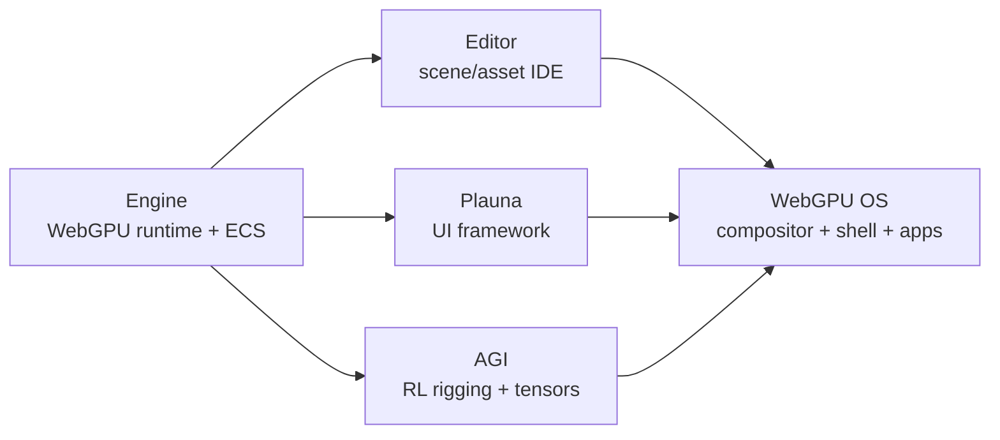

# WebGPU OS Documentation

**A unified, versioned home for the entire stack** — the engine, the editor, the Plauna UI framework, the AGI rigging system, and the WebGPU OS that composes them all. This site is the single source of truth: plain Markdown that AI tools can read directly, rendered for humans through three viewers that all read the *same* files.

> **New here?** Start with [Overview](getting-started/overview.md), then the [Architecture Overview](concepts/architecture-overview.md) to see how the pieces fit.

## What is this stack?

The project grew in layers. Each layer is independent and reusable, and the next one builds on it:

See [History & Evolution](concepts/history-evolution.md) for the full story (engine → editor → plauna → agi → webgpu-os).

## Find your path

- **I want to use the OS** — [WebGPU OS Overview](webgpu-os/overview.md) and the [App Catalog](webgpu-os/app-catalog.md).
- **I'm building an app/package** — [WebGPU OS Architecture](webgpu-os/architecture.md) and the kernel/package API reference.
- **I'm working on the renderer or simulation** — [Engine Overview](engine/overview.md).
- **I'm building UI** — [Plauna Overview](plauna/overview.md).
- **I'm training the rig** — [AGI Overview](agi/overview.md) and the [Training Guide](agi/training-guide.md).
- **I'm editing scenes/assets** — [Editor Overview](editor/overview.md).
- **I'm writing docs** — [Docs Style Guide](contributing/docs-style-guide.md).

## How this documentation is built

This `MD/` folder is the source. Three viewers consume it:

1. **Zero-build HTML viewer** (`viewer/`) — opens over `start_server.py`, no build step.
2. **MkDocs Material site** (`_config/mkdocs.yml`) — `mkdocs serve` for a polished static site.
3. **`docs` app inside WebGPU OS** — reachable from the OS shell itself.

Navigation, search, and reference indexes are generated by Python tools in `tools/` (no Node). See [Contribution Workflow](contributing/doc-contribution-workflow.md).

## For AI agents

If you are an AI assistant working with these docs, read [`AGENTS.md`](AGENTS.md) first — it tells you where things live and the hard boundaries. A curated machine index is at [`llms.txt`](llms.txt) (with full text in `llms-full.txt`), following the [llmstxt.org](https://llmstxt.org/) standard. Incremental consumers can stream [bounded documentation chunks](docs-chunks.jsonl) or [source-backed API modules and symbols](api-symbols.jsonl), one JSON object per line. Conventions for keeping the docs AI- and human-safe are in [AI & Accessibility](contributing/ai-and-accessibility.md).

## Accuracy & safety

- The per-symbol **API reference is machine-extracted** from source and can lag — verify against the cited source file before relying on it. Fix inaccuracies by improving JSDoc upstream, then regenerating.
- Documentation contains **no secrets**; never paste keys or tokens into examples.
- Every page links to **View source** so you can check the original.

## Status

This is the restructured documentation set (v0.1.0). Conceptual and structural docs are authored by hand; the per-symbol API reference is generated by `tools/extract_api.py` and enriched with hand-written notes. See the [Changelog](CHANGELOG.md).
