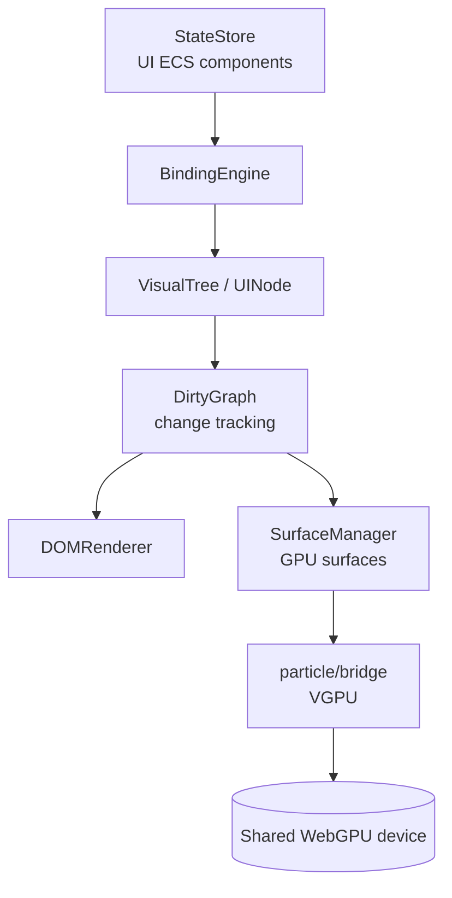

# Plauna Architecture

How Plauna renders and manages UI. State lives in a UI ECS world; a visual tree is reconciled to DOM and/or GPU surfaces through a dirty-tracking pipeline.

## Rendering pipeline

## Core (`plauna/core/`)

- **`app.js`** — `PlaunaApp`, the top-level application object (`createPlaunaApp(options)`).
- **`UINode.js` / `VisualTree.js`** — the retained UI tree.
- **`StateStore.js`** — UI state container.
- **`BindingEngine.js`** — binds state to the visual tree.
- **`DirtyGraph.js`** — tracks what changed so only dirty regions re-render.
- **`DOMRenderer.js`** — renders the tree to DOM.
- **`registry.js` / `events.js`** — view/surface registry and event system.
- **`ModuleTester.js`** — module self-tests.

## Surfaces and the GPU bridge

- `surface/` manages renderable surfaces (rect/warped, interactive, hit-testable).
- `particle/bridge.js` bridges surfaces to the engine's VGPU, so GPU UI shares the single device. See [GPU Device Sharing](../concepts/gpu-device-sharing.md).

## Workspace (the window manager)

`workspace/` provides `WorkspaceManager`, `Workspace`, `Panel`, `PanelLayout`, `WorkspaceCompositor`, and `WorkspaceSwitcher`. **Every OS window is a Plauna panel** — the OS shell (`webgpu-os/shell/`) builds its desktop/taskbar on top of this. (Source: `webgpu-os/AUDIT.md`.)

## Text engine

`text/` measures and lays out text **without the DOM** (Pretext-style), enabling GPU-rendered text and accurate layout in non-DOM surfaces. Public API: `prepare(text, style)`, `layout(handle, width, lineHeight)`, `measureElement(el)`, `invalidateFont(key)`.

## Integration with the engine and editor

- Bootstraps via `engine/EngineEditorBootstrap.js` (`initializePlauna(...)`, exposed as `PE.Plauna`).
- Uses the existing VGPU instance and ECS patterns — no separate device.
- Can enhance existing editor panels incrementally (`enhanceExistingPanels`).

## Genesis Ecology integration (planned)

Plauna renders redacted read models for recipe review, local ecology status,
lineage, quality diversity, roles, culture, lifecycle, and the owner-private
Cityform Operations View. Updates are batched and indexed; render cadence and
dirty propagation never advance canonical development. See the
[Genesis Ecology WebGPU OS plan](../webgpu-os/genesis-ecology-os-plan.md).

## See also

- [Plauna Overview](overview.md) — rendering modes and module map.
- [WebGPU OS Architecture](../webgpu-os/architecture.md) — how the shell consumes Plauna.
- [Genesis Ecology WebGPU OS Plan](../webgpu-os/genesis-ecology-os-plan.md).
- Plauna **API Reference**.
