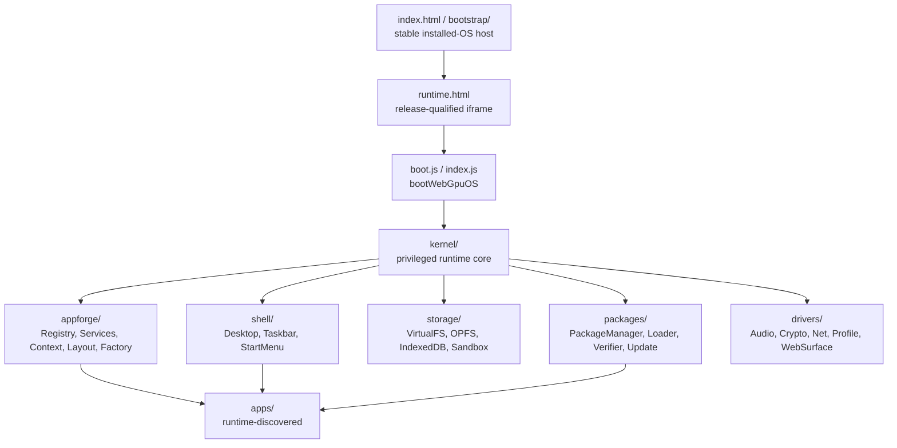
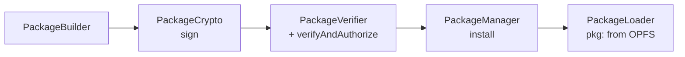

# WebGPU OS Architecture

The kernel, shell, package system, storage, and drivers — and how an app moves from a folder or `.prpkg` to a running, capability-gated panel.

## Layout

The stable host owns installed-release selection, recovery, immutable resource
routing, runtime handoff, and physical Realm networking. The replaceable
runtime iframe owns the normal kernel and shell. An empty install registry uses
the bounded legacy path for initial enrollment. See [Installed System
Releases](installed-system-releases.md) and [Runtime Handoff, Realm Host, and
Update Swarm](runtime-handoff-and-update-swarm.md). (Sources:
`webgpu-os/bootstrap/StableBootstrap.js` and
`webgpu-os/platform/runtime-host/StableRuntimeHost.js`.)

## Kernel (`webgpu-os/kernel/`)

The privileged core. Notable components:

- **`KernelBootstrap.js`** — brings up kernel services in order: `TrustStore.init()` → `PackageManager.init()` → `PatchManager` → `UpdateManager`.
- **`Syscalls.js`** — the syscall surface exposed to apps; `guardSyscalls()` wraps them with capability checks; `auditSyscallGuards()` reports coverage. This is a **stable Tier 2 contract**.
- **`AppRegistry.js` / `ModRegistry.js`** — discover apps/mods at runtime.
- **`Permissions.js` / `PermissionPortal.js` / `PermissionStore.js`** — capability resolution, consent UI, persisted grants.
- **`TrustStore.js` / `ProvenanceChecker.js` / `SigningLineage.js`** — trust roots, pinning, provenance.
- **`RuleGraph.js`** — Tier 1 capability-gate stand-in.
- **`SecurityDoctor.js`** — full posture report.
- **GPU mediation:** `GpuDeviceBroker.js`, `GpuInfo.js`, `VRAMTracker.js` (see [GPU Device Sharing](../concepts/gpu-device-sharing.md)).
- **Buses:** `CommandBus.js`, `FxBus.js`, `PatchBus.js`.
- **Surfaces/theme/sound:** `SurfaceManager.js`, `SubsurfaceManager.js`, `ThemeEngine.js`, `UiSounds.js`, `AmbientEngine.js`.
- **Misc:** `VirtualFS.js`, `OsLogger.js`, `ProcessTable.js`, `SessionStore.js`, `SearchManager.js`, `RuntimeModeManager.js`, `net-safety.js`.

### Navi tool execution path

AI Echo's planner sends exact provider-native tool schemas while retaining the
same local descriptor snapshot for admission and fallback. Ordinary calls then
cross the Authority Membrane and signed Faculty path before `ToolRouter` and
`ToolDriver` execute and verify them. Large results stay canonical in the local
request workspace; the provider receives either the privacy-scrubbed projection
or a bounded preview and opaque request-local handle to that same scrubbed
projection. (Sources:
`webgpu-os/kernel/execution/TwoPassPlannerFinalizer.js` and
`webgpu-os/kernel/execution/NaviToolResultContext.js`.)

`NaviProgrammaticFacultyRunner` can compose exact `safe_read` calls inside an
isolated request worker. Committed serial and parallel calls still traverse the
normal live authorization, Faculty, verification, accounting, and receipt
pipeline. A separate `NaviPureLocalShadowExecutor` may compute only a certified
pure, deterministic, local-only, no-egress, no-authority operation while a
complete call is being finalized. The canonical path must authorize an exact
match before adopting the value. Mutation, external access, and
approval-bearing tools use only the ordinary path. (Sources:
`webgpu-os/kernel/navi/NaviProgrammaticFacultyRunner.js`,
`webgpu-os/kernel/navi/NaviPureLocalSpeculation.js`, and
`webgpu-os/kernel/ToolDriver.js`; see [Navi Architecture and
Delivery](navi-architecture-and-delivery.md#phase-840-bounded-programmatic-and-speculative-tool-execution).)

## AppForge (`webgpu-os/appforge/`)

AppForge is a modular composition layer over the existing OS. It keeps
`AppRegistry`, `CommandBus`, `Permissions`, `PackageManager`, `PackageHostRealm`,
Desktop, and Plauna panels as the backing runtime, then adds folders for
definitions, registry, tags, scoring, services, context graph, command objects,
layout zones, blueprints, package exports, timeline, lenses, starter packs, and
the visual workspace builder. See [AppForge Contracts](appforge-contracts.md)
for the public API and security invariants.

## Shell (`webgpu-os/shell/`)

The desktop UI, built on Plauna workspaces (every window is a Plauna panel):

- **`Desktop.js`** — the compositor/window manager; `_launchPanel` wraps an app's syscalls with `guardSyscalls`, `_resolveEntryModule` routes `pkg:<id>` entries to the package loader.
- **`Taskbar.js`, `StartMenu.js`, `StatusTray.js`** — shell chrome.
- **`DialogManager.js`, `NotificationCenter.js`** — dialogs + notifications.
- **`PackageHostRealm.js`** — host realm for packaged apps.
- **`WindowSizer.js`, `WindowStateStore.js`, `app-icon.js`** — window sizing/state/icons.

## Packages (`webgpu-os/packages/`)

The `.prpkg` v2 system (encrypted ZIP container + cross-verified public envelope):

- **`PackageManager.js`** — install/remove/verify/rollback; the `verifyAndAuthorize()` choke point chains integrity → trust → provenance → scan → policy → verdict.
- **`PackageLoader.js`** — loads installed apps from OPFS as a blob-URL module graph (patch-overlay aware).
- **`PackageBuilder/Crypto/Verifier/Scanner/Registry.js`** — build, sign, verify, scan, register.
- **`UpdateManager.js`** — differential updates with anti-rollback + version cooldown.
- **`AppCompiler.js`, `FolderIngestor.js`, `CapabilityMap.js`, `PublisherKeyManager.js`, `Zip.js`, `Gzip.js`** — supporting tools.

See [Security & Trust Model](../concepts/security-model.md) for the trust pipeline.

System releases are separate from app `.prpkg` packages. They use the stable
host's `particle-install-registry`, segmented encrypted JHC payload, and
release-qualified service-worker router. `PackageManager`, `UpdateManager`,
`PatchManager`, and `LivePatchService` do not become the OS updater. (Sources:
`webgpu-os/system-release/InstallRegistry.js` and
`webgpu-os/system-release/SystemReleaseInstaller.js`.)

## Storage (`webgpu-os/storage/`)

Virtual filesystem over browser primitives: `VirtualFS`/`SystemFS` (syscall-facing), `OPFSDriver`, `IndexedDBDriver`, `MountDriver`, `CacheDriver`, `AppSandbox` (per-app isolation), `StorageManager` (orchestration). See [Data Flow](../concepts/data-flow.md).

## Drivers (`webgpu-os/drivers/`)

`AudioDriver`, `CryptoDriver`, `NetDriver`, `ProfileDriver`, `WebSurfaceDriver`. The browser bridge (`browser-bridge/`) and extension (`browser-extension/`) provide native browser integration and an adblock relay.

## The app entry contract

Manifests declare `id`, `name`, `version`, `entry`, `surface`, `permissions`, and `capabilities`. The entry module **default-exports a class with `async mount(root, syscalls)`** (and optional `unmount()`). Dev-tree apps live at `apps/<folder>/manifest.json`; packaged apps embed a `prpkg-v2` manifest and load via `pkg:<id>`. (Source: `webgpu-os/docs/APP_MANIFEST_SPEC.md`.)

## Genesis Ecology service (planned)

Genesis Ecology is composed as a trusted flat OS service after crypto, storage,
packages, and permissions. The kernel owns admission, capabilities, private
state, immutable artifacts, semantic promotion, exact resource ceilings,
process lifecycle, handoff, revocation, and public phenotype publication.
RealmForge, Editor, AGI, Plauna, and The Virtual Realm remain authoring,
proposal, or projection consumers. The complete boundary is in the
[Genesis Ecology WebGPU OS plan](genesis-ecology-os-plan.md).

## See also

- [Boot Sequence](../concepts/boot-sequence.md)
- [Navi Speech Milestone](navi-speech-milestone.md)
- [Navi Growth and AI Gym](navi-development.md)
- [Installed System Releases](installed-system-releases.md)
- [Runtime Handoff, Realm Host, and Update Swarm](runtime-handoff-and-update-swarm.md)
- [Setup Center State and Migration](setup-center-state.md)
- [Security & Trust Model](../concepts/security-model.md)
- [Genesis Ecology WebGPU OS Plan](genesis-ecology-os-plan.md)
- [App Catalog](app-catalog.md)
- WebGPU OS **API Reference**
