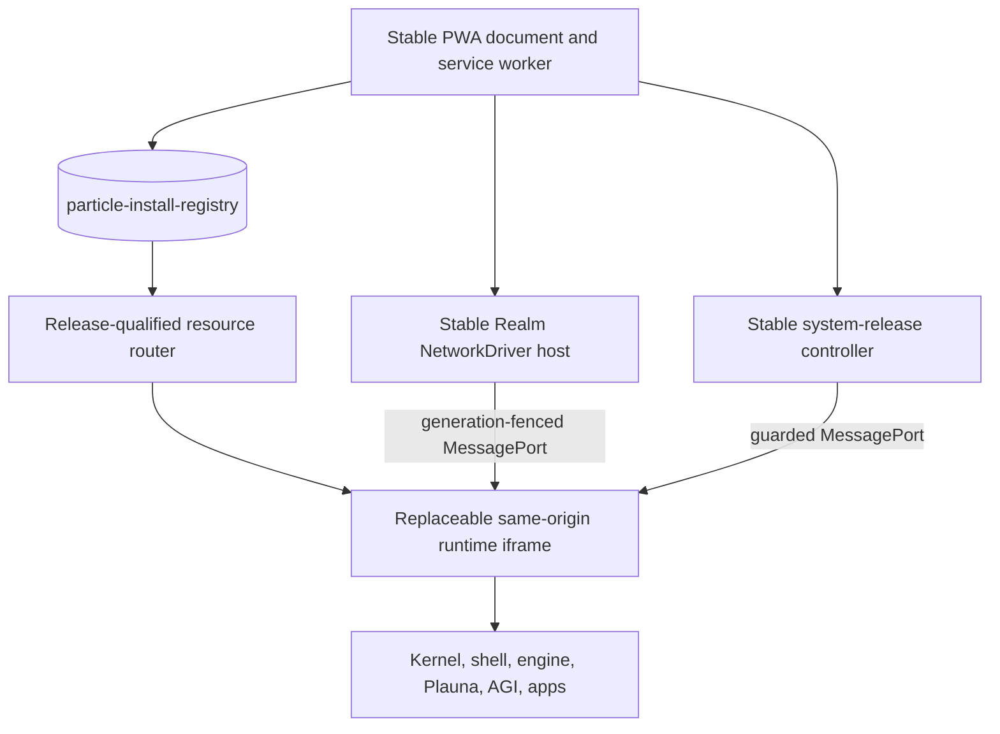

# Installed System Releases

This page documents the implemented installed-OS release boundary for platform
maintainers. The subsystem keeps the existing JavaScript/WebGPU runtime, Realm
network, Masterserver, PWA, app packages, and Companion extension. Python is
build tooling only. No Node or npm runtime is introduced.

## Ownership boundary

The top-level `/webgpu-os/` document is a small stable host. It selects an
installed release and loads that release in a same-origin iframe. A release URL
always includes an immutable `releaseId`; an already-running iframe never
resolves executable modules through a mutable `current` alias. (Sources:
`webgpu-os/index.html`, `webgpu-os/bootstrap/StableBootstrap.js`,
`webgpu-os/platform/runtime-host/StableRuntimeHost.js`, and
`webgpu-os/platform/runtime-host/ReleaseResourceRouter.js`.)



| Stable host owns | Replaceable release owns |
| --- | --- |
| `index.html`, `manifest.webmanifest`, `sw.js`, recovery surface, stable bootstrap modules | `runtime.html`, mapped to logical `webgpu-os/index.html` |
| Release trust and control, install registry, immutable resource routing | Kernel, shell, drivers used inside the runtime, apps, themes, schemas, workers, and runtime assets |
| Runtime iframe lifecycle and release leases | Recreated DOM, WebGPU, audio, and application state |
| Stable Realm `NetworkDriver` and its operator binding | Generation-fenced logical network clients |

The system-release builder excludes stable bootstrap paths from install
operations. It also rejects symlinks, private/build components, non-canonical
paths, and portable case or Unicode collisions. The replaceable
`webgpu-os/runtime.html` source becomes logical `webgpu-os/index.html` inside
the release. (Source: `bundler/system_release.py`.)

App `.prpkg` ownership does not change. `PackageManager`, `UpdateManager`,
`PatchManager`, and `LivePatchService` retain their app-specific and
declarative-patch roles. The system-release registry is a separate database and
does not route through the app package manager. (Sources:
`webgpu-os/system-release/contracts.js`, `webgpu-os/system-release/InstallRegistry.js`,
and `webgpu-os/packages/PackageManager.js`.)

## Release contracts and artifact format

`ReleaseDescriptorV1` binds the channel, human version, monotonic sequence,
content-derived `releaseId`, runtime and bootstrap ABIs, signed activation
floor and calculated activation class,
target path, manifest hash, browser requirements, package length, complete
ciphertext hash, and ciphertext-piece map. `SystemReleaseManifestV1` binds the
logical path, SHA-256 object hash, byte length, MIME type, owner, boot tier,
hotset status, entry path, and one allowlisted `put-object` operation per file.
(Source: `webgpu-os/system-release/contracts.js`.)

The package has two nested integrity layers:

1. A canonical JHC1 container holds the complete logical release and an inner
   P-256 signature.
2. A `PRSYS1` wrapper encrypts independently authenticated AES-GCM segments.
   Its authenticated data binds the release, segment index, plaintext length,
   and format context.
3. Distribution pieces cover the exact encrypted package and carry individual
   SHA-256 hashes for range acquisition and the Particle swarm.

The browser reads JHC metadata through a bounded random-access plaintext view.
It does not decrypt the complete package into one giant allocation. It accepts
only the canonical raw JHC1 profile, bounded section types and expansion,
exact resource maps, one signature section, and portable canonical paths.
(Sources: `webgpu-os/system-release/SegmentedPackage.js`,
`webgpu-os/system-release/SystemReleaseJhcReader.js`, and
`jhc/implementations/javascript/JhcPackage.js`.)

The build emits these immutable artifacts:

- `release-descriptor.json` and `system-release-manifest.json`;
- the encrypted `.prpkg` target and `ciphertext-piece-manifest.json`;
- the deterministic plaintext `system-release.jhc` build artifact;
- `metadata/root.json`, `timestamp.json`, `snapshot.json`, and `targets.json`;
- `hotset.json`, `release-diff.json`, `staged-site-inventory.json`, and
  `build-receipt.json`.

The plaintext JHC is a build artifact, not the distribution target. Production
publishing should expose the signed metadata and encrypted target required by
the update origin, not private keys or the plaintext build workspace. (Source:
`bundler/system_release.py`.)

## Trust verification and its limits

The metadata verifier implements four separate P-256 roles: root, timestamp,
snapshot, and targets. It checks canonical JSON, role thresholds, expiry,
parent length/hash/version links, sequential root rotation signed by both old
and new root thresholds, monotonic role versions, target binding, release
sequence rollback, and same-sequence equivocation. It requires an out-of-band
trusted root. (Source: `webgpu-os/system-release/ReleaseMetadataVerifier.js`.)

The accepted package follows this order:

1. Verify root, timestamp, snapshot, targets, and the selected descriptor.
2. Bind the exact package length/hash and every distribution piece.
3. Complete and hash-read the ciphertext package from OPFS.
4. Inspect the `PRSYS1` index and compare it with the descriptor.
5. Obtain AES material from the configured decryption-key authority.
6. Authenticate JHC metadata and the inner P-256 signature against a separately
   configured inner-key authority. The embedded JHC public key is only a value
   to compare; it is not its own trust anchor.
7. Verify the signed logical manifest and each decoded object before promotion.

(Sources: `webgpu-os/platform/network-host/UpdateSwarmAcquirer.js`,
`webgpu-os/system-release/SystemPackageAcquisitionJournal.js`, and
`webgpu-os/system-release/SystemReleaseInstaller.js`.)

The trust boundary has deliberate limits:

- AES-GCM protects transport form and licensing/obfuscation policy. It cannot
  keep code secret from a browser that receives decryption authority.
- The replaceable iframe is same-origin because the signed kernel needs the
  existing browser storage and WebGPU OS platform surfaces. It is a lifecycle
  and ownership boundary, not an origin sandbox against malicious ring-0 OS
  code. A system release is therefore accepted as trusted privileged code only
  after the outer metadata, inner P-256 signature, and complete logical map
  verify. App packages remain constrained by their separate app sandbox.
- TUF-style verification protects against untrusted origins, mirrors, and
  peers only while the stable verifier and pinned root remain trustworthy.
- A compromised origin that replaces the stable bootstrap can replace the
  verifier. Native or extension-pinned trust is not implemented here.
- Expired update metadata blocks accepting a new update. It does not prevent
  the stable bootstrap from booting the last completely installed release.
- The repository intentionally contains no production private release key or
  production AES key.

(Sources: `webgpu-os/system-release/SegmentedPackage.js`,
`webgpu-os/system-release/ReleaseMetadataVerifier.js`, and
`webgpu-os/bootstrap/StableBootstrap.js`.)

## Local storage and acquisition

`InstallRegistry` uses the separate `particle-install-registry` IndexedDB. Its
stores cover pointer state, releases, release-file maps, immutable objects,
acquisition journals, health/activation receipts, release leases, and trusted
metadata state. Short Web Locks serialize pointer changes, object
materialization, package-piece writes, and leases. A long network download does
not hold the activation lock. (Sources:
`webgpu-os/system-release/contracts.js`, `webgpu-os/system-release/InstallRegistry.js`,
and `webgpu-os/system-release/SystemPackageAcquisitionJournal.js`.)

OPFS stores partial/completed ciphertext packages and content-addressed objects
under `particle-install/`. A ciphertext piece is accepted only after its exact
length and SHA-256 match, its OPFS write closes, and readback matches. A complete
package must cover every trusted piece and match the trusted total hash. (Source:
`webgpu-os/system-release/SystemPackageAcquisitionJournal.js`.)

Origin acquisition sends exact byte ranges and binds the journal to a strong
ETag. It validates `206 Content-Range`, accepts an ignored Range only as an exact
complete `200` response, handles a consistent `416`, rejects redirects outside
the origin allowlist, and resumes pieces already verified in OPFS. (Source:
`webgpu-os/system-release/OriginPackageAcquirer.js`.)

The installer reuses an object only when the registry record, canonical OPFS
path, size, and full SHA-256 readback still agree. Otherwise it writes a
temporary object, verifies it, promotes it to the content-addressed path,
verifies it again, checks the complete release map, and only then marks the
release `verified`. Packages cannot execute install JavaScript or target stable
bootstrap paths. (Source: `webgpu-os/system-release/SystemReleaseInstaller.js`.)

After a release becomes pending and its hidden runtime passes preflight, the
stable host rehashes every unique release object again from its canonical OPFS
path before changing the active pointer. Initial signed enrollment uses the
same gate. Same-size corruption is invalidated and fails activation; a changed
pending epoch or logical file map fails as an activation conflict. (Sources:
`webgpu-os/system-release/InstallRegistry.js`,
`webgpu-os/platform/runtime-host/StableRuntimeHost.js`, and
`webgpu-os/bootstrap/StableBootstrap.js`.)

The service worker caches the stable recovery shell and its generated stable
module closure. Installed runtime files come from OPFS through
`/__particle__/release/<releaseId>/<logicalPath>`. The router validates the
release, file, object record, canonical OPFS path, and byte length for every
request and emits immutable release/object headers. It never looks up a mutable
active pointer while serving a runtime. (Sources: `webgpu-os/sw.js`,
`webgpu-os/bootstrap/StableResourceInventory.generated.js`, and
`webgpu-os/platform/runtime-host/ReleaseResourceRouter.js`.)

Each stable-worker revision uses its own named shell cache. The active worker
reads only that cache for stable modules and shell navigations; a missing entry
fails into repair instead of fetching a mutable replacement. An installing
worker can therefore stage its next-launch cache without changing bytes served
by the still-active worker. (Source: `webgpu-os/sw.js`.)

## Guarded control surface

`SystemReleaseController` stays in the stable document. A replaceable runtime
receives only a bounded `system-release` MessagePort. The kernel projects it as:

- `system.release.status()` and `system.release.onChange()`;
- `system.release.check()`;
- `system.release.acquire()` and `system.release.pause()`;
- `system.release.activate()` and `system.release.rollback()`.

Only the active runtime epoch may mutate release state. The guarded syscall
surface reserves update management for Setup Center, Settings, and Quick
Settings. It never exposes trusted roots, metadata envelopes, journals, OPFS
handles, package bytes, or network handles to those apps. (Sources:
`webgpu-os/system-release/SystemReleaseController.js`,
`webgpu-os/system-release/SystemReleaseClient.js`, and
`webgpu-os/kernel/Syscalls.js`.)

The default source checkout starts the controller without a production update
configuration. `check()` and `acquire()` fail honestly until deployment injects
a pinned-root verifier, metadata provider, origin or update acquirer, and either
the installer or an explicit staging seam. The built-in installer additionally
requires an AES authority and trusted inner-key resolver. The stable boot entry
consumes and deletes `globalThis.__particleStableBootstrapOptions`; production
assembly owns how those values arrive. (Sources:
`webgpu-os/bootstrap/boot.js`, `webgpu-os/bootstrap/StableBootstrap.js`, and
`webgpu-os/system-release/SystemReleaseController.js`.)

## Boot, confirmation, and recovery

When deployment supplies the complete pinned metadata verifier, signed metadata
provider, immutable origin acquirer, and installer authorities, an empty install
registry first attempts an origin-only enrollment of the selected signed
release. The bootstrap verifies and materializes the complete logical release,
then activates it with a compare-and-swap that requires the active pointer to
remain empty. A concurrent bootstrap that wins that race is accepted only after
the durable active pointer is reread. If production release configuration is
absent, or enrollment fails before any active pointer exists, the empty registry
takes the bounded one-cycle legacy boot path. (Source:
`webgpu-os/bootstrap/StableBootstrap.js`.)

Once any active installed release exists, the bootstrap requires a controlling
service worker and a complete verified release; it does not silently fall back
to mutable origin runtime code. Normal release installation also rejects the
`bootstrap-next-launch` activation class, which remains a separately reviewed
stable-host deployment. (Sources: `webgpu-os/bootstrap/StableBootstrap.js` and
`webgpu-os/system-release/SystemReleaseInstaller.js`.)

The registry keeps `activeReleaseId`, `previousReleaseId`, `pendingReleaseId`,
an activation epoch, boot state, and receipts. Activation uses compare-and-swap
against the expected active release. A committed release stays
`awaiting-confirmation` until runtime health succeeds. Startup restores a
verified previous release if the selected active release is incomplete or
unhealthy. A pre-commit failure clears the pending pointer; a post-commit
failure rolls the pointer back and resumes the retained old runtime. (Sources:
`webgpu-os/system-release/InstallRegistry.js`,
`webgpu-os/platform/runtime-host/StableRuntimeHost.js`, and
`webgpu-os/bootstrap/StableBootstrap.js`.)

Browser storage remains user-clearable. Losing IndexedDB or OPFS is a lost local
installation, not a cryptographic recovery event. The empty-registry bootstrap
path can start the current legacy runtime so an approved enrollment flow can
reinstall a release. A non-empty but damaged registry enters the recovery
surface instead of executing unverified code. (Source:
`webgpu-os/bootstrap/StableBootstrap.js`.)

Before selecting an installed release, the stable bootstrap runs a bounded
reconciliation pass over the exact immutable-object namespace. Active,
previous, pending, leased, and every release-referenced object is retained.
Referenced objects are read and hashed; missing or corrupt objects are marked
invalid so routing and activation fail closed. Only canonical, hash-verified,
unreferenced object records and bytes may be removed. Package files and
acquisition journals are traversed only by the bounded retention phase. That
phase preserves active, previous, pending, leased, staged, forward-sequence,
in-progress, and empty-bootstrap recovery data; it commits metadata removal
before deleting resulting orphan object and package bytes. If the active
release cannot be proven safe within the reconciliation bounds, bootstrap
enters recovery rather than guessing. (Sources:
`webgpu-os/system-release/SystemReleaseReconciler.js` and
`webgpu-os/system-release/InstallRegistry.js`.)

## Build and deployment

Run the tooling from the repository root. This is a Python build workflow; it
does not add a Python runtime service.

```powershell
python bundle_engine.py --target webgpu-os --production --release
python tools/generate_stable_bootstrap_inventory.py
python tools/build_system_release.py init-keys `
  --keys-dir D:\particle-release-authority\development-keys
python tools/build_system_release.py build `
  --keys-dir D:\particle-release-authority\development-keys `
  --aes-key-file D:\particle-release-authority\development-aes.key `
  --version 1.0.0 `
  --sequence 1 `
  --published-at 2026-08-24T00:00:00.000Z
```

The example paths are outside the repository and are suitable only as a local
development layout. Create the raw 16, 24, or 32-byte AES key through the
organization's approved secret-generation process. Production should separate
role keys according to its threshold policy, keep private material in an
external vault/HSM or offline signing environment, and publish only public
metadata plus immutable ciphertext targets. `init-keys` refuses to overwrite an
existing keyset. Root rotation requires `--previous-keys-dir` and the next
sequential root version. (Sources: `tools/build_system_release.py` and
`bundler/system_release.py`.)

Publish the generated `metadata/*.json` and the exact descriptor target path
without rewriting bytes. Pin the public root in stable deployment
configuration. Configure the metadata/origin providers and the two installer
authorities in the stable host. Do not copy production secrets into the staged
site, release package, service-worker cache, or operator storage. A stable
bootstrap update is a separate reviewed next-launch deployment; a normal system
release cannot install it. (Sources: `bundler/system_release.py`,
`webgpu-os/bootstrap/StableBootstrap.js`, and
`webgpu-os/system-release/SystemReleaseInstaller.js`.)

### Shared runtime files on static hosting

The static bundler keeps one complete compiled runtime for the desktop and
[single-app pages](getting-started.md#open-just-one-app). When a compressed
representation exceeds the existing 25 MiB file limit (26,214,400 bytes), it
emits ordered byte parts of at most 16 MiB (16,777,216 bytes), with a shorter
last part as needed. This applies to the browser gzip and any oversized best
compression artifact. Representations within the limit keep their ordinary
whole-file delivery. (Sources: `bundler/cli.py`, `bundler/runtime_transport.py`,
and `bundler/site.py`.)

The optional `compressed_artifact_parts` manifest field maps each logical
compressed filename to ordered records containing `src`, `bytes`, and
`sha256`. Public release assembly copies the declared parts in place of the
oversized file. The browser loader receives its gzip records in the optional
`data-runtime-parts` attribute, with paths relative to the launcher document.
The logical `data-runtime-src`, total compressed size, decoded size and decoded
SHA-384 identity remain unchanged. Publish the matching manifest, launcher,
loader and part files from the same build. (Sources: `bundler/runtime_transport.py`
and `bundler/site.py`.)

Each part is a slice of the original compressed bytes. The loader verifies its
exact length and SHA-256 before joining the slices into one gzip stream. It
then checks the complete decoded byte count and SHA-384 before a single runtime
execution. Part delivery does not create individual app bundles or change app
selection. Installed releases inventory and materialize the part files through
the existing signed file map and release-qualified resource router. (Sources:
`bundler/site.py`, `bundler/system_release.py`,
`webgpu-os/system-release/SystemReleaseInstaller.js`, and
`webgpu-os/platform/runtime-host/ReleaseResourceRouter.js`.)

The complete gzip remains available in the local build artifacts and the
Template local runtime kit. The Template kit retains its existing full-gzip
loader and export contract. The static-site file-size check still applies to
every published file. (Sources: `bundler/cli.py`, `bundler/site.py`, and
`webgpu-os/apps/ai-echo/EngineDemoRuntimeKit.js`.)

## Verification commands

```powershell
python -m unittest bundler.tests.test_system_release
python -m unittest bundler.tests.test_stable_resource_inventory
python tests/network/run_realm_browser_tests.py `
  tests/system-release-foundation.html `
  tests/system-release-installer.html `
  tests/system-release-control-plane.html `
  tests/webgpu-os-runtime-host.html `
  tests/stable-system-release-network.html `
  --timeout-ms 60000
```

These focused suites cover deterministic artifacts, role separation and root
rotation, package corruption, path collisions, installer reuse/repair, control
authority, immutable routing, activation rollback, and stable Realm delegation.
They do not replace an actual offline restart, quota/eviction, multi-tab, or
multi-device deployment gate. (Sources: `bundler/tests/test_system_release.py`,
`bundler/tests/test_stable_resource_inventory.py`, and the listed browser tests.)

## See also

- [Runtime Handoff, Realm Host, and Update Swarm](runtime-handoff-and-update-swarm.md)
- [Setup Center State and Migration](setup-center-state.md)
- [Security and Trust Model](../concepts/security-model.md)
- [Operator, SecureMesh, and Agent Boundaries](operator-securemesh.md)
