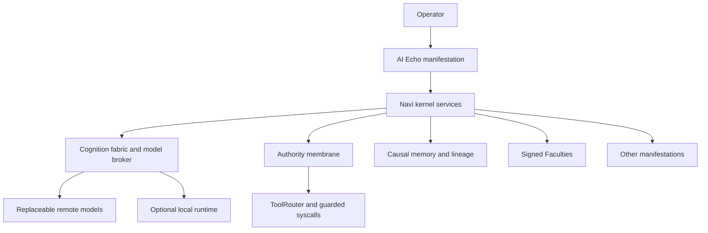

# Navi Architecture and Delivery Plan

This page defines the target Navi architecture and the gated delivery plan for
engineers working on WebGPU OS and AI Echo. It is a design contract. A checked
design item means its decision is frozen. A checked implementation or exit-gate
item means its named verification evidence passes.

## Status and progress rules

- `[x]` means the named design decision or verified implementation is complete.
- `[ ]` means the work has not passed its stated gate.
- A phase cannot start until the previous phase's exit gate passes.
- A failed gate returns to its originating phase. Do not defer it as later work.
- Every phase must leave the OS bootable and retain a tested rollback path.
- Navi is a built-in WebGPU OS runtime and starts automatically. No user or app
  can enable or disable it, and no `navi.feature.manage` authority exists.
  Automatic startup never grants identity or action authority by itself.
  Operator-bound services require a live, current, non-revoked Passport and
  fail closed with exact health and error codes when that authority or another
  prerequisite is unavailable. Services that await the first primary Navi
  remain non-authoritative in a typed dependency state, then rebind at the
  exact Continuity generation after genesis or primary selection.

### Planning status

- [x] Audit current AI Echo, AI Hub, VFS, tool firewall, autonomy, skills,
  memory, profiles, and recovery systems.
- [x] Audit PROJECT L.U.N.A. for reusable architectural concepts.
- [x] Choose a browser-native implementation with no LUNA runtime dependency.
- [x] Choose remote-first model routing.
- [x] Choose AI Echo as the Navi chat, setup, approval, and management console.
- [x] Lock product, authority, privacy, recovery, branching, Faculty, and
  autonomy defaults.
- [x] Confirm the resource-hardening baseline: 6 tests passing.
- [x] Begin implementation.
- [x] Complete the Phase 0 automated exit gate.
- [x] Complete the Phase 1 continuity exit gate.
- [x] Complete the Phase 2 cognition exit gate.
- [x] Complete the Phase 3 Faculty exit gate.
- [x] Complete the Phase 4 memory and relationship exit gate.
- [x] Complete the Phase 5 autonomy and resource exit gate.
- [x] Complete the Phase 6 Manifestation exit gate.
- [x] Complete the Phase 7 implementation and automated Navi Alpha exit gate.
- [x] Make Navi built-in and automatic, retire the Settings release control,
  and remove user/app feature-toggle authority.
- [x] Make AI Echo the automatic first primary Navi and add progressive,
  device-protected recovery onboarding without blocking first use.
- [x] Complete the post-alpha RealmForge workflow, evidence, transaction, and
  resumable-task extension for AI Echo.
- [ ] Complete live deployment validation on the intended operator devices.

The current AI Echo app provides conversations, editable Mind state, an
inspectable operational journal, autonomous-reflection scheduling, dynamic
skills, managed files, and model routing. Editable identity, self-model, Soul,
personality, and history now bind to the selected `naviId` in kernel-owned,
encrypted cognition records. The remaining app-owned facilities are integration
sources, not Navi identity authority. (Sources:
`webgpu-os/apps/ai-echo/AgentStateStore.js`,
`webgpu-os/apps/ai-echo/AgentSoul.js`,
`webgpu-os/apps/ai-echo/NaviSelfModelSettings.js`,
`webgpu-os/apps/ai-echo/AgentCognition.js`, and
`webgpu-os/apps/ai-echo/AgentBackgroundScheduler.js`.)

## Locked architecture

AI Echo is the primary chat, setup, approval, and management **Manifestation**
for a Navi. AI Echo does not own the Navi's identity or cryptographic authority.



The following boundaries are fixed:

- Kernel Navi services own identity, Covenant, memory, authority, lineage,
  Faculties, relationships, resource leases, and recovery.
- Remote models are the default cognition engines. A provider account, model,
  prompt, response, or conversation never becomes canonical Navi state.
- Local inference remains an optional privacy and availability route.
- Keys, credentials, tool enforcement, verification, storage, and deterministic
  operations remain local to the OS or its trusted extension.
- The OS sends only Covenant-permitted, task-relevant context to a provider.
- Private Navi memory remains local unless the active Covenant grants a
  specific disclosure.
- WebGPU OS supports several Navis for one operator profile and selects one as
  the primary resident Navi.
- Navi starts with the OS. Runtime inclusion is not configurable by a user,
  app, provider, model, or Manifestation. Service health remains distinct from
  runtime inclusion, so unavailable operator-bound authority is reported
  precisely instead of being described as a disabled Navi.
- The same Navi can use several Manifestations without changing identity.
- AI Echo's Inner Monologue is a Navi-authored operational record. It is never
  provider-hidden chain-of-thought. The current implementation already states
  and enforces this distinction for AI Echo. (Source:
  `webgpu-os/apps/ai-echo/AgentCognition.js`.)

The action lifecycle is also fixed:

`perceive -> structured rationale -> propose -> simulate -> approve -> execute -> verify -> record -> publish`

The existing tool path already applies permission, descriptor-change,
capability, and schema checks. Navi capabilities must narrow this path rather
than bypass it. (Source: `webgpu-os/kernel/tools/ToolRouter.js`.)

## Canonical N1-N12 vocabulary

Use these names in schemas, UI, logs, tests, and documentation.

| ID | Canonical system | Responsibility |
| --- | --- | --- |
| N1 | **Continuity Kernel** | Holds the Navi's persistent cryptographic identity independently of models, devices, sessions, and bodies. |
| N2 | **Covenant** | Defines the operator-Navi relationship, observation, memory, autonomy, disclosure, approval, transfer, and separation rules. |
| N3 | **Cognition Fabric** | Selects replaceable remote or local cognition engines and preserves model-neutral task continuity. |
| N4 | **Faculty Runtime** | Loads inspectable, versioned, signed ability modules with declared tools, permissions, costs, tests, and failure behavior. |
| N5 | **Causal Memory Weave** | Stores evidence-bearing, revision-aware memory events and derives human-readable views. |
| N6 | **Authority Membrane** | Intersects every applicable policy, issues attenuated capabilities, and controls the action lifecycle. |
| N7 | **Manifestation and Presence** | Represents one Navi through AI Echo, voice, Construct bodies, characters, vehicles, environments, or projections. |
| N8 | **Delegation Tree** | Creates bounded temporary workers and records scope, resources, parentage, expiry, and reports. |
| N9 | **Lineage, Recovery, and Reconciliation** | Proves genesis and changes, restores into branches, and reconciles without inventing continuity. |
| N10 | **Intent and Self-Model** | Stores the Navi's goals, commitments, responsibilities, strengths, limits, and uncertainty outside prompts. |
| N11 | **Relationship Graph** | Records signed, scoped, revocable relationships without converting social trust into authority. |
| N12 | **Resource Governance** | Reserves, meters, settles, limits, and reports model, tool, compute, storage, network, time, and worker use. |

Related execution terms have distinct meanings:

| Term | Meaning |
| --- | --- |
| **Tool Process** | A deterministic tool invocation. It has no identity or continuing agency. |
| **Hand** | A temporary specialist worker with a narrow task, context, capability, budget, expiry, parent, and required report. |
| **Echo** | A synchronized, non-independent projection of one Navi. |
| **Branch** | A persistent divergent Navi timeline with its own operational key and explicit creation approval. |
| **Independent Navi** | A separate identity. It may retain a signed ancestry attestation but cannot sign as its ancestor. |

Realm branches and Navi Branches are different structures. Never use one as a
substitute for the other.

## Versioned contract inventory

Every signed contract uses deterministic canonical bytes from
`engine/state/util/canonical.js`. Security-sensitive identifiers use
domain-separated SHA-256 through `hashIdSecure()`. Fast FNV identifiers remain
runtime-only and never establish identity or authority. (Source:
`engine/state/util/canonical.js`.)

Schemas reject unknown fields unless a schema explicitly defines an extension
map. Each contract carries its exact format string and schema version.

| Contract | Required purpose |
| --- | --- |
| `navi-principal-v1` | Genesis identity, public names, continuity key, operational key certificates, and status. |
| `navi-covenant-v1` | Operator binding and effective relationship policy. |
| `navi-task-v1` | Model-neutral objective, constraints, facts, artifacts, authority, uncertainty, and causal parents. |
| `navi-faculty-v1` | Signed Faculty manifest, typed I/O, dependencies, permissions, tests, cost, rollback, and provenance. |
| `navi-capability-v1` | Single-use attenuated authority bound to exact actor, task, tool, arguments, resources, budget, and expiry. |
| `navi-memory-event-v1` | Evidence-bearing memory addition, revision, contradiction, disclosure, or tombstone. |
| `navi-lineage-event-v1` | Append-only signed sequence, causal parents, prior hash, payload hash, and state root. |
| `navi-action-receipt-v1` | Proposal, simulation, approval, execution, verification, settlement, and publication result. |
| `navi-relationship-v1` | Signed relationship offer, acceptance, scope, revision, revocation, or block. |
| `navi-resource-lease-v1` | Reserved and settled tokens, money, tools, time, GPU, network, storage, and workers. |
| `navi-manifestation-v1` | Presence adapter, sensors, actuators, channels, permissions, limits, and current state. |
| `navi-handoff-v1` | Signed task transfer between Manifestations. |
| `navi-delegation-v1` | Hand assignment, minimal context, capabilities, budget, expiry, parentage, and report obligation. |
| `navi-backup-v1` | Encrypted, signed backup manifest, selected classes, lineage head, state roots, and checksums. |

The encrypted cognition store also uses `navi-identity-profile-v1` and
`navi-self-model-v1` as internal per-Navi state formats. They are not generic
signing contracts. The signed backup manifest names and verifies these formats
when their records are selected for recovery. (Sources:
`webgpu-os/kernel/navi/NaviCognitionService.js` and
`webgpu-os/kernel/navi/NaviBackupRecoveryService.js`.)

## Information classification

Classification is independent from filesystem path. A record keeps its label
through prompts, exports, backups, delegation, handoff, and replication.

| Classification | Examples | Remote-provider default | Delegation and replication default |
| --- | --- | --- | --- |
| `public` | Public name, published Faculty metadata | Allowed when task-relevant | Allowed with provenance |
| `operator` | Operator preferences and private workspace facts | Allowed only for the bound operator's task | Denied unless task scope names it |
| `shared` | Explicitly shared project or realm context | Allowed to approved routes | Limited to named recipients and purpose |
| `private-navi` | Private journal and private Navi memory | Denied | Denied |
| `restricted` | Sensitive project, relationship, or realm data | Denied unless Covenant and task grant it | Denied unless an exact capability grants it |
| `credential` | API key, OAuth token, recovery material | Always denied | Always denied |
| `system-secret` | Private keys, encryption roots, platform secrets | Always denied | Always denied |

Changing a label creates a reviewable event. It never mutates historical
evidence in place.

## Authority domains

Every proposed action declares one or more domains. A broad domain grant does
not imply an unrelated grant.

| Domain | Covered actions |
| --- | --- |
| `creative` | Generate or edit non-authoritative creative content. |
| `social` | Communicate, invite, moderate, or represent a presence. |
| `files` | Read, create, edit, move, restore, trash, or permanently remove files. |
| `applications` | Launch, configure, install, update, or remove apps and Faculties. |
| `devices` | Use sensors, media, GPU, peripherals, vehicles, or actuators. |
| `network` | Fetch, browse, connect, replicate, or send data. |
| `administration` | Change OS-wide policy, permissions, users, or security state. |
| `economic` | Spend money, incur paid model use, transfer assets, or accept obligations. |
| `identity` | Create, rotate, recover, branch, transfer, separate, or represent an identity. |
| `publication` | Publish realms, packages, Faculties, media, or public statements. |
| `delegation` | Create Hands, Echoes, Branches, or independent identities. |

Effective authority is the intersection of the Covenant, operator role, realm
policy, app manifest, Faculty manifest, task scope, information policy, and
current resource lease. Denial, revocation, expiry, and narrower scope win.

## Security tiers and browser limitations

| Tier | Available protection | Limitations and required UI disclosure |
| --- | --- | --- |
| **Unsupported context** | No continuity claim | Without a secure context and working Web Crypto, AI Echo can act only as an unsigned assistant. It cannot claim signed Navi identity, recovery, transfer, or lineage. |
| **Browser standard** | Non-extractable Web Crypto keys, encrypted app storage, guarded syscalls | Same-origin code running in the compromised OS page can request or observe data after the app decrypts it. Encryption at rest does not solve active same-origin compromise. |
| **Extension assisted** | Credential and browser-automation isolation in the trusted extension | The extension reduces page exposure but does not make untrusted OS code safe. Bridge authority and origin checks remain mandatory. |
| **Authenticator bound** | WebAuthn PRF or passkey-backed recovery factor where supported | Browser and authenticator support varies. A passkey factor supplements encrypted recovery; it does not become a platform master key. |

The system must never describe browser-only encrypted storage as a secret vault.
The current managed AI Echo projection already displays this warning and blocks
secret-like content. (Source: `webgpu-os/apps/ai-echo/AgentDataFiles.js`.)

The current profile driver demonstrates P-256 identity, non-extractable working
keys, and recovery-code wrapping. Navi identity may reuse its reviewed crypto
primitives and storage patterns, but it requires a distinct principal and root
from the human operator. (Source: `webgpu-os/drivers/ProfileDriver.js`.)

### Progressive recovery onboarding

The first healthy operator profile with no Navi receives one primary
`AI Echo` Navi automatically under the bounded-partner Covenant. Genesis still
creates the complete cryptographic recovery quorum, but it does not force the
operator through three custody ceremonies before chat is usable. A
purpose-specific kernel escrow seals factors A, B, and C with a non-extractable
AES-256-GCM key. Factor C remains kernel-only. Factors A and B remain deferred
until the operator explicitly asks to save them. (Sources:
`webgpu-os/kernel/navi/NaviContinuityService.js` and
`webgpu-os/kernel/navi/NaviRecoveryEscrow.js`.)

Status reads expose no factor value and never mark a factor as shown. They may
show only a four-character masked tail. Explicit reveal is one-time, records
the first reveal timestamp, and requires exact saved-copy re-entry before the
factor counts as independent custody. AI Echo clears displayed and entered
factor values on Settings close, Navi or operator changes, remount, and
unmount. Until one external factor is verified, the UI labels recovery as
device-only and warns that clearing site data or losing the browser profile can
destroy access. Two verified external factors are required before the UI calls
the Navi portable.

This staged design follows the recovery principle that saved recovery codes
need strong random entropy and protected offline custody while additional
authenticators should remain enrollable later. It does not silently create a
passkey because WebAuthn registration is a user-mediated ceremony that requires
user presence or verification. See [NIST SP 800-63B](https://pages.nist.gov/800-63-4/sp800-63b.html),
[WebAuthn Level 3](https://www.w3.org/TR/webauthn-3/), and
[Google's passkey guidance](https://developers.google.com/identity/passkeys).

## Migration and rollback policy

The first Navi rollout targets unreleased AI Echo state. It performs a fresh
Navi initialization instead of silently converting old Soul, Mind, memory,
skills, relationships, receipts, or authority.

### Historical Phase 0 pre-migration procedure

The following completed procedure records the original gated rollout. It is
retained as evidence and is not a current instruction to disable Navi.

1. Keep the historical `navi-v1` rollout gate disabled.
2. Create a complete `/user` portable or native-folder backup.
3. Verify every backup size and SHA-256 entry before proceeding. The existing
   storage manager already creates versioned `/user` manifests and verifies
   checksums during restore. (Source: `webgpu-os/storage/StorageManager.js`.)
4. Export current AI Echo sessions and agent profile data where available.
5. Retain the verified complete `/user` backup outside the origin before the
   historical release gate is enabled.
6. When the historical release gate is enabled, stage the exact AI Echo-owned
   projection under
   `/user/navi-archives/legacy-ai-echo/<migrationId>/managed/` and its encrypted
   AppSandbox readback beside it. `NaviLegacyMigrationService` must recheck the
   Phase 0 receipt and live source checksums before its first reset.
7. Write a migration receipt containing the source archive ID, rollback receipt
   ID, exact targets, source checksums, feature-gate generation, explicit
   operator approval, and local rollback path.
8. Verify that both the portable backup and local migration archive read back
   before initializing a Navi.

### Fresh-state boundary

- Reset only AI Echo-owned state and `/user/ai-echo` managed projections.
- Do not modify unrelated files, app data, settings, profiles, mounted folders,
  packages, realm data, Recycle Bin entries, or credentials.
- Do not import legacy identity, permissions, relationships, or memory into a
  Navi automatically.
- Offer legacy content only as a reviewed, unsigned import proposal after Navi
  creation.
- Preserve the dated archive until the operator explicitly removes it through
  the Recycle Bin.
- Initialization failure enters a read-only quarantine. It must not create an
  empty replacement identity. The current `AgentStateStore.init()` catch path
  falls back to `freshState()`; Phase 1 must replace that behavior for Navi
  continuity. (Source: `webgpu-os/apps/ai-echo/AgentStateStore.js`.)

### Rollback procedure

1. Stop Navi background work and reject new capability issuance.
2. Flush active action receipts and mark uncertain mutations
   `outcome-unknown`.
3. Synchronously invalidate and drain affected operator-bound Navi authority
   before changing stored data. The built-in runtime remains present.
4. Restore the verified `/user` backup with conflict-safe preview.
5. Restore the archived AI Echo state only to its original AI Echo-owned paths.
6. Restart the OS and run the baseline AI Echo, storage, tool, profile, and OS
   smoke checks.
7. Compare the restored checksums with the pre-migration manifest.
8. Retain the failed Navi store in quarantine for diagnosis. Do not merge it
   into restored state automatically.

Rollback succeeds only when the OS boots, existing AI Echo data reads back, all
restored checksums match, unrelated `/user` files remain unchanged, and every
unhealthy or quarantined Navi service remains non-authoritative with an exact
health state. Rollback never requires a user-facing runtime toggle.

## Phased delivery checklist

### Phase 0: contracts, boundaries, and rollback

- [x] Freeze N1-N12 terminology.
- [x] Freeze remote-first and kernel-ownership boundaries.
- [x] Define information classifications and authority domains.
- [x] Define security tiers and same-origin limitation.
- [x] Define the versioned contract inventory.
- [x] Define fresh-state migration and rollback policy.
- [x] Define the phase checklist and exit gates.
- [x] Implement and browser-verify a complete `/user` backup preflight before
  runtime migration. Migration still requires a live-origin archive receipt.
- [x] Export AI Echo's encrypted development state into that dated archive.
- [x] Add the historical disabled-by-default `navi-v1` rollout gate. It
  protected phased implementation and was retired after automated Alpha in
  favor of the built-in automatic runtime policy.
- [x] Implement strict validators and valid/malformed fixtures for every
  contract.
- [x] Prove every signed structure has deterministic canonical bytes.

**Exit gate:** all schema fixtures pass; malformed and unknown fields fail;
canonical byte tests pass; backup and rollback drills pass; existing AI Echo
and OS smoke tests remain green.

Phase 0 automated evidence: 9 contract groups, 11 backup/preflight checks,
276 AI Echo smoke checks, 6 resource-hardening tests, documentation validation,
import validation, and the full OS bundle pass. At this historical phase,
`navi-v1` remained disabled and the operator had to retain the live archive and
receipt before any migration mutated released data. The later automatic-runtime
decision does not change this recorded Phase 0 evidence.

### Phase 1: Continuity Kernel, Covenant, and genesis lineage

- [x] Create isolated Navi principals, selectable Covenant templates, signed
  genesis lineage, key rotation, revocation, and scoped operator roles.
- [x] Add non-extractable operational keys, a separate encryption root,
  per-record encryption, and approved recovery factors. Browser-only factor
  custody is explicitly user-attested; passkey factor C is cryptographically
  authenticator-bound.
- [x] Support several Navis and one primary resident Navi.
- [x] Replace blank-state recovery with read-only quarantine.

#### Phase 1 implementation ledger

- [x] Add narrow `navi.read`, `navi.manage`, and `navi.recover` syscall and
  RuleGraph boundaries with no generic Navi signing, decryption, key export, or
  raw-record API.
- [x] Reclassify the compatibility profile-signing syscall as high-risk
  `identity.sign` authority.
- [x] Implement P-256 continuity identity derivation, non-extractable
  operational signing keys, a separate non-extractable AES-256 root, and
  per-record AES-GCM data keys.
- [x] Implement the three cryptographic 2-of-3 recovery pair primitives and
  one-time factor delivery.
- [x] Require staged genesis with one recovery factor visible at a time, exact
  challenge-bound read-back, distinct custody receipts, an A+B rehearsal, and
  an explicit activation before canonical identity state is committed. Factor B
  is never eligible for clipboard delivery.
- [x] Make activation retry-safe across a lost response: the same activation ID
  resolves through `creationStatus` without duplicating genesis, while expiry,
  cancellation, operator rebinding, and shutdown zero all staged factors.
- [x] Implement bounded-partner, operator-owned assistant, and gated
  co-sovereign Covenant templates plus signed Covenant lifecycle events.
- [x] Implement a staged prepare, lineage-record, commit, or abort operational
  key-rotation boundary; an uncommitted candidate never replaces the active
  signer.
- [x] Replace legacy AI Echo state corruption fallback with typed, read-only
  quarantine instead of silently creating a blank agent.
- [x] Finish adversarial KeyVault and lineage hardening: signed-purpose binding,
  persistent and recovery anti-rollback heads, verified certificate chains,
  introduced-key replay, monotonic time, and exact restore head/length.
- [x] Finish the transactional continuity store review: immutable snapshots,
  authenticated quarantine markers, atomic key/state commits, strict
  operator-Navi indexes, and real IndexedDB restart/concurrency tests.
- [x] Fail foreign operator-index membership before foreign key access, clear
  partial initialization authority, and never quarantine the referenced Navi.
- [x] Make recovery attempts persistently idempotent: an exact attempt ID and
  request hash reauthenticate the factor quorum, commit one signed-lineage-bound
  receipt atomically, survive restart, and reject conflicting replay.
- [x] Assemble the kernel-owned continuity service and integrate it into boot.
- [x] Create one bounded-partner `AI Echo` primary automatically when a healthy
  operator has no Navi. Serialize cross-tab genesis with Web Locks, remain
  idempotent, suppress automatic genesis behind a manual staged ceremony, and
  refuse creation while any continuity state is quarantined.
- [x] Add a separate IndexedDB recovery escrow with a non-extractable
  AES-256-GCM key, authenticated factor metadata, explicit stage/commit/remove
  lifecycle, restart persistence, and no VFS, credential-vault, or app-owned
  secret surface.
- [x] Add secret-free recovery posture, four-character masked previews,
  one-time A/B reveal, exact custody verification, kernel-only factor C, and
  one-saved-factor plus device-assisted recovery. Status inspection alone never
  changes the `never-shown` state.
- [x] Forward the complete staged lifecycle through the stable production
  kernel gateway and prove that a real operator rebind synchronously removes
  old authority before draining the old Store, vaults, and staged factors.
- [x] Expose multiple-Navi and primary-resident management through AI Echo.
- [x] Attach each editable identity, avatar, role, persona, self-model, Soul,
  personality, and history to one exact `naviId` in an encrypted
  `navi-identity-profile-v1` record. Migrate the legacy AI Echo profile only to
  the original primary Navi; seed later Navis from their own continuity names.
- [x] Unify companion selection and character editing in Navi Studio. Its
  stable master-detail shell owns the roster exactly once, distinguishes
  `Editing` from `Active in chat`, keeps provider/model routing separate from
  identity, and exposes one live character card. Identity, personality,
  cognition, and continuity now use accessible roving tabs on wide layouts and
  one compact section picker on narrow layouts; Presence and Recovery remain
  dedicated deep consoles available through direct Navi Studio shortcuts.
- [x] Scope identity tools, imports, exports, and Files projections to the exact
  Navi. Store editable projections below `/user/Navis/<naviId>/identity`, scan
  them for credentials, reject mismatched ownership, and include both profile
  and self-model records in encrypted backup and reconciliation.
- [x] Implement an explicit, checksum-bound legacy AI Echo migration that
  archives and resets only AI Echo-owned state, refuses to overwrite newer
  state, compensates partial failures, and preserves unrelated `/user` files.
  The browser suite passes 10 focused migration and rollback checks.
- [x] Complete a real browser WebAuthn PRF credential enrollment and recovery
  ceremony, including RP/origin and user-presence/user-verification validation,
  authenticator-bound factor C, and all `AB`, `AC`, and `BC` recovery paths.
- [x] Pass restart, isolation, rotation, recovery, corruption, rollback,
  syscall-guard, AI Echo, resource, import, and bundle regressions.

Phase 1 evidence: KeyVault 18/18, Covenant/lineage 15/15, continuity-store
31/31, continuity service 38/38, progressive recovery escrow 14/14, passkey adapter 15/15, real-browser WebAuthn
PRF 4/4, virtual-authenticator enrollment and recovery PASS, and production
kernel/syscall integration 22/22. The legacy migration and rollback suite is
 10/10, Realm Passport is 10/10, realm syscall contracts are 6/6, AI Echo is
 456/456, and resource hardening is 6/6. Imports and braces are clean across 290
 checked AI/OS files. The OS bundle passes with 2,050 modules, classic-script
 validation, 1,389 copied site files, and a CRC-verified 1,389-file release
 archive. The in-memory generated-entry regression also passes, preventing
 concurrent bundlers from deleting one another's deterministic OS barrel.
 Live UI validation also confirms the Navi Studio roster/detail layout uses two
 columns when space permits, stacks to one column, switches to a labelled picker
 at phone width, preserves unsaved identity edits and the active section across
 resizing, keeps touch controls at least 44 CSS pixels tall, and introduces no
 page, dialog, or Navi-panel horizontal overflow.

At the Phase 1 close, the historical `navi-v1` rollout gate remained disabled.
Phase 1 completion proves local continuity and its browser security boundary;
it does not claim cross-device recovery or external lineage witnessing, which
remain Phase 7 gates. The later built-in runtime policy supersedes only the
rollout state, not this verification evidence.

**Exit gate:** model, provider, session, avatar, voice, and AI Echo setting
changes preserve `naviId`; two Navis cannot act for each other; recovery and
rotation pass; invalid state fails closed. Cross-device restore remains a Phase
7 acceptance gate and is not claimed here.

### Phase 2: remote-first Cognition Fabric and self-model

- [x] Add a kernel-owned Navi model broker over the existing AI Hub. Bind every
  dispatch to one immutable, single-use execution plan and one exact route
  configuration revision. (Source: `webgpu-os/kernel/navi/NaviModelBroker.js`.)
- [x] Rank routes by capability, privacy, provider trust, estimated cost,
  estimated latency, context size, locality, availability, modality, and realm
  policy. Record deterministic reason codes for every eligible route.
- [x] Make approved remote routes the default for capable chat, coding,
  planning, vision, speech, journal, and reflection work. Keep the local runtime
  available to the wider OS as an explicit privacy, fallback, and test route,
  but never discover, probe, select, or inject it for AI Echo cognition.
- [x] Persist model-neutral task envelopes, dispatch journals, checkpoints, and
  content-free evidence outside provider conversations. Bind them to stable
  operation and intent hashes. (Sources:
  `webgpu-os/kernel/navi/NaviCognitionService.js` and
  `webgpu-os/kernel/execution/TwoPassPlannerFinalizer.js`.)
- [x] Support independently configurable chat, coding, planning, vision,
  speech, inner-journal, and autonomous-reflection routes. Preserve the simple
  follow-chat defaults when no specialist route is selected. (Source:
  `webgpu-os/apps/ai-echo/NaviRouteSettings.js`.)
- [x] Add a Basic-first Smart Model Picker under Connection settings. Let the
  operator enable task-aware routing, choose free-only, prefer-free, or paid
  access, select a balanced, value, quality, or speed profile, set request and
  best-effort daily ceilings, and optionally define an exact cross-provider
  allowlist. Keep context, latency, trust, attempt, pricing, and local-sensitive
  controls behind progressive disclosure. (Sources:
  `webgpu-os/apps/ai-echo/SmartModelPickerPanel.js` and
  `webgpu-os/kernel/ai-hub/SmartModelPolicy.js`.)
- [x] Compile the discovered catalog into bounded, purpose-specific candidate
  pools. Treat unknown pricing as unknown, account for flat request fees once,
  enforce hard task cost ceilings, and never classify unknown-priced routes as
  free. Keep provider billing authoritative over the local daily guard.
  (Sources: `webgpu-os/apps/ai-echo/NaviRouteSettings.js` and
  `webgpu-os/kernel/navi/NaviModelBroker.js`.)
- [x] Expose a read-only kernel route-decision syscall. AI Echo asks the Navi
  broker to make the final selection, labels the composer `Smart routing`, and
  records the exact provider, model, purpose, authority, route ID, reason codes,
  and decision hash in Run details and the durable turn report. (Sources:
  `webgpu-os/kernel/navi/NaviCognitionService.js`,
  `webgpu-os/kernel/Syscalls.js`, and
  `webgpu-os/apps/ai-echo/factory.js`.)
- [x] Compile hot, warm, and cold context deterministically. Enforce exact data
  classifications, Covenant rules, destination scope, modality support, token
  budgets, and content-free disclosure receipts before provider transmission.
  (Source: `webgpu-os/kernel/navi/NaviContextCompiler.js`.)
- [x] Require exact, expiring, single-use kernel approval proofs for controlled
  remote disclosure. Bind each proof to the Navi, task, operation, purpose,
  route revision, provider, model, HTTPS destination, data classes, and Covenant
  rule identifiers. (Sources: `webgpu-os/kernel/protocol/ElicitationManager.js`
  and `webgpu-os/kernel/navi/NaviCognitionService.js`.)
- [x] Record provider, model, disclosed data-class counts, estimated cost,
  estimated latency, route scores, deterministic routing reasons, attempt
  outcomes, and configuration hashes without persisting raw provider output.
- [x] Implement bounded fallback for outage, throttling, malformed output,
  unsupported modality, and context overflow. Pause honestly when no approved
  route remains.
- [x] Treat an explicit provider policy refusal as a typed, non-mutating route
  outcome instead of forcing refusal prose through JSON schema repair. Preserve
  the provider decision as inspectable evidence and never confuse ordinary
  profanity directed at the assistant with an OS execution failure.
- [x] Request the built-in `{answer: string}` final response as plain text,
  wrap and validate it locally, and preserve usable partial prose with an
  inspectable `answer.incomplete` event plus a visible incomplete-response
  notice. Keep structured-looking partial JSON on the bounded schema-repair
  path, prove repair never replays planning or an already completed mutation,
  keep custom schemas strict, and fail empty partial output honestly.
- [x] Route chat and persona turns from positive current-message action intent,
  never from mere tool availability or historical tool words. Activate Dynamic
  Skills from the exact current message while retaining bounded history for
  referential follow-ups. Normalize exact empty `none`, `no-tool`, `noop`, and
  `not-needed` planner sentinels before TaskList, authorization, Faculty, or
  ToolRouter boundaries; reject mixed sentinel/action plans and keep unknown
  tools as typed failures.
- [x] Accept bounded `ai-active-turn-steering-v1` messages while a request is
  running. Bind each message to the exact app, request, session, and client
  message ID; reject hidden or unknown fields; deduplicate replay; classify
  augment, correction, redirect, status, and cancellation; and close intake at
  the final commit boundary. (Sources:
  `webgpu-os/kernel/execution/ActiveTurnCoordinator.js` and
  `webgpu-os/kernel/execution/TwoPassPlannerFinalizer.js`.)
- [x] Merge contextual steering in arrival order at named planner, tool,
  finalizer, and repair boundaries. Preserve the original objective and
  completed evidence, but supersede stale plans, model output, approvals, and
  unstarted tool calls before they can cross an execution boundary. Pending,
  failed, status, and cancellation records remain visible evidence but never
  enter provider context; only accepted augment, correction, and redirect
  messages may affect the active task.
- [x] Persist contextual steering idempotently as revision-checked,
  hash-provenanced Navi task facts, then retain normalized steering receipts in
  the AI Echo conversation record. Restored transcripts, managed history,
  follow-up context, search, and session statistics keep steering between the
  user turn and assistant result instead of flattening or losing it. (Sources:
  `webgpu-os/apps/ai-echo/AgentStateStore.js`,
  `webgpu-os/apps/ai-echo/ContextIntelligence.js`, and
  `webgpu-os/apps/ai-echo/factory.js`.)
- [x] Persist the Navi identity profile and self-model independently from
  prompts and providers, including identity, persona, Soul documents, goals,
  commitments, uncertainty, responsibilities, strengths, and limitations.
- [x] Serialize a Navi's dispatch lifecycle with Web Locks, reject conflicting
  operation replay, reconcile settled journals after restart without provider
  replay, and quarantine corrupted or mismatched cognition records.
- [x] Preserve typed cognition, resource, recording, and outcome-unknown error
  codes across repair and UI boundaries so infrastructure recovery failures are
  never mislabeled as malformed model output.
- [x] Keep Smart Routing on the Navi authority path while cognition is binding:
  wait for bounded readiness events, dispose every wait on completion or
  unmount, deny direct-provider fallback, and expose the exact kernel state and
  error code. Isolate an irreconcilable historic resource settlement to its
  owning blocked task so it cannot disable cognition for every new task.

Phase 2 evidence was revalidated on 2026-07-27: executor routing, plain-answer
normalization, partial-answer preservation, custom-schema strictness,
current-intent persona routing, no-tool sentinel handling, repeated unknown-tool
termination, malformed-planner isolation, exact active-turn steering and
safe-boundary ordering, deterministic task-graph execution, safe-read
auto-allow, dynamic-target binding, and stale approval rejection pass 35/35.
The complete Navi Alpha gate passes 1,498/1,498 assertions and 2/2 structural
gates; AI Echo passes 441/441 and resource hardening passes 6/6. The import
audit resolves 298 files and 187 engine/state exports. The complete no-cache
production bundle passes with 2,017 modules, zero skipped modules, 25 validated
deployment files, and a CRC-verified 1,400-file release archive.

Smart-routing evidence was added on 2026-07-27: policy and task classification
pass 26/26, Basic/Advanced picker behavior passes 8/8, model-broker access and
pricing enforcement pass 31/31, AI Echo route compilation passes 28/28, kernel
cognition routing passes 13/13, and cognition service routing passes 31/31.

Artifact refusal and resource-settlement hardening was revalidated on
2026-07-27: executor routing passes 39/39, cognition service routing and
metering pass 37/37, model-broker deadlines pass 31/31, Artifact Workspace
passes 8/8, and AI Echo passes 450/450. The regressions cover ordinary profanity
inside an explicit Artifact request, one honest non-mutating provider refusal,
an 85-second response against a 250 ms latency estimate, two sequential turns
with three fallback routes, a provider that exceeds its hard deadline, fixed
response-envelope headroom, flat request fees, and post-settlement compare-and-
swap recovery. The no-cache production bundle contains 2,020 modules with zero
skips, 25 validated deployment files, and a CRC-verified 1,361-file site archive.
The complete hardening acceptance surface now covers 1,530/1,530 assertions,
all 30 Alpha gates, 299 audited AI OS modules, 187 verified engine/state
exports, and the same 2,020-module no-cache production bundle. The release
manifest and its 1,361-entry ZIP were independently read back after generation.

Navi authority recovery was revalidated on 2026-07-28: AI Echo route binding
passes 33/33, executor fail-closed routing passes 39/39, kernel cognition and
dependency recovery pass 15/15, model-broker routing passes 31/31, cognition
storage passes 13/13, and cognition dispatch/resource recovery passes 38/38.
The over-reservation regression preserves the exact pending usage evidence,
blocks only its owning task, performs no provider replay, and restores the
operator-bound cognition service for subsequent work.

**Exit gate:** [x] A live task transfers between remote models and the optional
local runtime without losing task state. [x] Disallowed memory never reaches a
provider. [x] Provider outage uses an approved fallback or pauses honestly.
[x] Routing decisions are visible and reproducible. [x] No provider session is
required to reconstruct the active Navi task.

### Phase 3: Faculty Runtime and Authority Membrane

- [x] Define strict signed `navi-faculty-v1` manifests with typed inputs and
  outputs, declared permissions, tools, models, destinations, costs, tests,
  failure behavior, publisher, provenance, and compatibility.
- [x] Bind signed Faculty envelopes into authenticated v2 and v3 packages
  without changing their signatures, and reject stale, accessor-bearing,
  malformed, unknown-field, or resource-root-mismatched bindings before the
  package is signed or installed.
- [x] Accept Particle Realms ring-0 Faculties by default and restrict local
  self-signed Faculties to explicit developer mode and exact approval.
- [x] Run executable Faculties in an opaque iframe plus dedicated Worker with
  no ambient DOM, storage, network, credential, or OS authority.
- [x] Mediate Worker tool requests through the kernel-only ToolRouter Faculty
  lane; app syscalls cannot obtain or forge that lane.
- [x] Mint exact, expiring, single-use capabilities bound to the Navi, branch,
  task, Faculty package, live descriptor hash, canonical argument hash, paths,
  realms, devices, destinations, data classes, authority domains, and lease.
- [x] Enforce signed per-tool call limits before authorization, including
  concurrent Worker requests.
- [x] Enforce perceive, structured rationale, propose, simulate, approve,
  execute, verify, record, settle, and publish stages with signed receipts.
- [x] Require exact one-use step-up approval for mutations and sensitive
  authority domains; preserve timed-out mutations as `outcome-unknown` until
  authoritative reconciliation.
- [x] Run a deterministic pre-authorization review for every production
  planner tool call before elicitation or execution. Validate plain JSON,
  hidden parameters, and the declared schema; derive bounded paths,
  destinations, realms, devices, data classes, authority domains, risk flags,
  and immutable review evidence. (Sources:
  `webgpu-os/kernel/execution/ToolActionReview.js` and
  `webgpu-os/kernel/execution/TwoPassPlannerFinalizer.js`.)
- [x] Auto-allow only a valid local, read-only, low-risk action with no
  sensitive, network, code, destructive, or descriptor-conflict flag. Invalid
  calls deny before elicitation; mutations and flagged or elevated actions ask
  for exact operator approval.
- [x] Bind each review to the live descriptor hash, canonical argument hash,
  policy rule set, app, request, exact dynamic inner tool, and derived targets.
  Snapshot arguments before review, then reload the live descriptor and repeat
  the review after approval. Any argument, descriptor, proposal, schema,
  policy, or steering-epoch change makes the approval stale and prevents
  execution.
- [x] Retire pre-dispatch failures atomically so grants, operations, and denied
  receipts cannot be orphaned or replayed after a crash.
- [x] Convert learned Dynamic Skills into disabled, non-authoritative guidance
  Faculties that cannot self-sign or self-enable.
- [x] Expose installed signed Faculty identity, publisher, exact tools, data
  classes, authority domains, enabled state, and irreversible revocation in AI
  Echo without exposing source, credentials, keys, or kernel authority.
- [x] Keep raw OS and browser JavaScript developer-only, exact-hash approved,
  one-use, and outside the semantic browser Faculty.
- [x] Route every production Navi planner tool step, including dynamic tool
  discovery, through one installed signed Faculty instead of `callForAI`.
- [x] Complete authoritative scope metadata and readback verifiers for the
  production AI Echo mutation descriptors.
- [x] Install and exercise the canonical extension-backed semantic browser
  Faculty while proving credentials and password values remain inaccessible.
- [x] Keep the semantic-browser trust boundary split correctly: the kernel is
  the only component that verifies, installs, enables, disables, or revokes the
  signed Browser Semantic Faculty, while Companion owns the exact one-use page
  grant and consumes it before click, type, CSS, WebMCP, or Live Patch effects.
  A status display in the extension grants no Faculty or page authority.
- [x] Mirror Browser Semantic package readiness into both Companion editions as
  a content-free, read-only projection. Accept it only through the authenticated
  OS bridge, bind it to that bridge session, retain it only in extension memory,
  expire it after two minutes, and clear it on bridge revocation or worker
  restart. Re-verify and republish from the kernel after a relay reconnect;
  absence or failure of the extension remains non-blocking.
- [x] Ship Artifact Studio as a dedicated Particle Realms ring-0 signed
  deterministic-tool-adapter Faculty. Bind its package, Worker source, static
  VFS scopes, implementation identities, and all seven live tool descriptor
  hashes; never ship private signing material.
- [x] Provision the exact built-in Artifact Studio Faculty idempotently for the
  active primary Navi, coalesce concurrent startup requests, and preserve an
  operator's disabled or revoked state. Reject stale packages, sources,
  publishers, manifests, Navi identity, or descriptor hashes before use.
- [x] Auto-attest only the exact signed Artifact tool identities. Continue to
  require the ordinary action review and one-use approval for each mutation;
  built-in package trust never becomes blanket mutation approval.
- [x] Separate the portable signed descriptor identity from the live runtime
  descriptor identity. Package verification binds the stable signed
  implementation identity, while every capability, operation, approval, and
  ToolRouter call binds the actual current handler and verifier source. A code
  change that retains an old `implementationHash` therefore fails closed.
- [x] Keep live descriptor rotation fail-closed. A later package timestamp is
  chronology, not authority, and cannot replace an exact approved runtime
  descriptor hash. Until a signed successor binding explicitly names the old
  and new exact hashes, the changed descriptor remains unavailable and prior
  approvals cannot execute.
- [x] Accept built-in readiness only from the kernel's exact active-primary-Navi
  authority receipt. Revalidate ring-0 publisher, package policy, source,
  manifest, payload, envelope, package, and live descriptor evidence; reject
  a missing release-registry entry, noncanonical timestamp, or expired package.
- [x] Pass the real signed-package to Worker to ToolRouter to ToolDriver
  mutation test with authoritative readback and a verified signed receipt.

Verification recorded 2026-08-01: the Browser Companion Faculty projection
passed 7/7, the complete Phase 3 matrix passed 149/149, AI Echo smoke passed
481/481, Store Companion packaging passed 17/17, Browser Semantic package
verification passed 5/5, and extension install policy passed 14/14. The signed
production platform bundle compiled 2,809 modules, verified 53 official package
records, and included AI Echo 5.22.19 plus Companion 1.18.7 without adding a
Chrome permission.

The deterministic review is an explanatory safety layer, not an authority
source. `auto-allow` suppresses an unnecessary pop-up for a proven safe read;
it does not bypass BudgetLimiter policy, Faculty capability checks, ToolRouter,
or result verification. The integrated Phase 2 executor gate exercises review
  before execution and approval revalidation as part of its 35/35 result.

Phase 3 now passes 112/112 focused assertions across nine suites: AI Echo
Faculty and operator controls 12/12, production descriptor/readback coverage 6/6,
authority membrane and exact tool-action review 10/10, package policy and creation
19/19, Faculty service 18/18, ToolRouter 12/12, Worker isolation 13/13, kernel
integration 14/14, and the real signed production path 8/8. The current close
regression also passes AI Echo 472/472 twice consecutively, Phase 2 executor
routing 44/44, Artifact Workspace 8/8, the Artifact package chain 8/8 across Python and browser-native
checks, and the complete 2,057-module WebGPU OS bundle with zero skipped modules.
The release site contains 1,390 CRC-verified files. The `navi-v1` runtime is
default-on; the historical disabled rollout state was retired after the Phase 7
release gate passed.

### Phase 8.5 modular Artifact project projection

- [x] Publish every Artifact inside one `/user/artifacts/<artifactId>` project
  folder with its active entry and support files directly manageable at that
  root.
- [x] Preserve hash-verified immutable revisions and manifest-last publication;
  root-level files are a verified working projection, not a second authority.
- [x] Reserve `artifact.json`, `revisions`, and `.artifact` from generated file
  paths and reject ambiguous multi-file plus single-file request shapes.
- [x] Keep logical modules such as `src`, `assets`, and `data` intact while
  removing the opaque revision directory from the current-file workflow.
- [x] Open current Artifact files at their direct project paths and keep
  historical selections pinned to exact immutable revision paths.
- [x] Preserve a bounded typed Artifact failure category from the handler
  through tool completion, Run Details, and the content-free diagnostic report.
- [x] Verify create, update, restore, failed projection, Files navigation,
  signed descriptor, executor, smoke, import-audit, and production bundle gates.

Implementation evidence recorded 2026-08-01: AI Echo 5.22.16 now stores the
active entry and support files directly in each Artifact project root while
retaining immutable revision directories as canonical history. A verified
`.artifact/projection.json` record binds the working files to their exact
revision. Create, update, and restore publish `artifact.json` only after
revision and working-projection readback pass. Changed current files fail the
SHA-256 compare-and-swap boundary, removed files move to bounded superseded
history, and reserved metadata paths or mixed single/multi-file payloads fail
before publication. Current **Open in Files** actions target the project root;
historical actions retain their immutable revision path.

Verification recorded 2026-08-01: Artifact Workspace passed 11/11; Artifact
descriptor/readback passed 10/10; signed Artifact Studio package passed 8/8 in
the browser and 4/4 in Python; executor routing passed 124/124; diagnostics
passed 29/29; stream and UI continuity passed 16/16; AI Echo Faculty
integration passed 16/16; and the complete AI Echo smoke suite passed 481/481.
Resource hardening exited cleanly. The import audit resolved all imports and
balanced braces across 340 modules and 187 engine/state exports. The final
production platform build compiled 2,806 modules with zero skipped, signed 52
official packages, verified 33/33 AI Echo modules, validated 25 OS deployment
files and 186 Playground module edges, and produced a CRC-verified 371-file
site archive.

**Exit gate:**

- [x] A signed Faculty completes one approved production mutation and produces
  a verified signed receipt.
- [x] Revoking a Faculty prevents every later call.
- [x] Descriptor, argument, path, destination, or implementation changes all
  invalidate prior approval in the production path.
- [x] A compromised production Faculty cannot read private memory, obtain
  credentials, widen authority, or publish.
- [x] Unknown tools and undeclared capabilities deny by default.
- [x] Repeated tool/status loops, malformed JSON, duplicate mutations, and
  pre-dispatch failures terminate without replay or orphaned authority.

#### Post-alpha Live Patch extension

- [x] Complete a clean-room behavioral study of the public partial-interface
  update pattern without copying its source, prompts, wire format, or runtime.
- [x] Add the strict `webgpu-os-live-patch-v1` kernel contract with an
  operation allow-list and unknown-field rejection.
- [x] Add registered app and shell surfaces, stable `data-live-region` targets,
  protected subtree boundaries, bounded inspection, and relative selectors.
- [x] Sanitize generated markup and CSS; reject scripts, handlers, external
  URLs, executable CSS, global selectors, and dynamic JavaScript execution.
- [x] Require stage, reversible preview, readback verification, commit, and
  rollback while writing patch and receipt records under
  `/user/live-patches`.
- [x] Bind every durable transition to a CAS-protected per-surface causal head,
  so independently staged cross-tab edits cannot both commit from one stale
  base and orphan an unprojectable authorized record.
- [x] Isolate nested registered surfaces and redact or deny private,
  restricted, enabled-contenteditable, and host form-control data.
- [x] Expose generated controls on OS-owned surfaces only as bounded typed local
  events that cannot call tools or the network directly. Reject generated DOM
  on arbitrary browser pages because pre-existing capture listeners cannot be
  isolated honestly.
- [x] Pass the focused browser-native Live Patch service gate with 64/64
  assertions, including exact browser target proofs, stale-extension rejection,
  safe-mode recovery, causal cross-tab commits, receipt lineage, remount
  lifecycle isolation, protected user data, and rollback ordering.
- [x] Pass production AI Echo descriptor, syscall capability, and independent
  mutation-readback coverage for all eight Live Patch tools.
- [x] Validate packaged Live Patch injection and rollback in both extension
  editions without exposing credentials or raw generated JavaScript.
- [x] Make browser navigation invalidation drift-aware: restore only an exact
  patch-owned after-state, never reinsert removed host nodes automatically, and
  record `outcome-unknown` while removing only provably owned artifacts.
- [x] Move ordinary browser snapshot/click/type automation to a packaged typed
  semantic runtime and keep raw page JavaScript behind developer-mode policy.
- [x] Keep browser inspection read-only by default and require an extension-owned
  one-use approval for semantic click/type, raw script or CSS, and every Live
  Patch mutation. Bind the grant to the canonical arguments, bridge session,
  exact target origin, and Chrome document IDs so navigation invalidates it.
- [x] Bound pending injection approvals and replay nonces without evicting live
  authority, redact executable payloads from the popup, and consume a grant
  before dispatch so a failed action cannot be replayed.
- [x] Bound segmented AI bridge transport to 64 MiB, 256 chunks, four pending
  requests per session, 12 globally, and reserved-byte quotas with cleanup on
  cancel, expiry, session replacement, tab teardown, success, and failure.
- [x] Compile every normalized Live Patch candidate twice and reject a
  non-deterministic result. Bind its semantic diff and operation hash to the
  exact surface generation, precondition, expected after-state, causal head,
  next `headRevision`, and browser epochs.
- [x] Create a verified preview activation proof and require the exact immutable
  commit payload. Re-read the visible after-state and reject changed operations,
  targets, generations, verification evidence, or causal bases before
  publication.
- [x] Bound transient candidates globally and per surface by record and byte
  quotas, and bound durable records and causal heads before startup replay.
- [x] Replay only records authorized by their exact causal `headRevision`, and
  transactionally remount the sequence while retaining the previous complete
  surface projection on failure.
- [x] Quarantine a failed or corrupt surface independently so unrelated Live
  Patch surfaces remain available. Reserve global safe mode for unscoped
  corruption, aggregate quota failure, or outcome-unknown compensation.
- [x] Add a clean-room WebMCP adapter that feature-detects
  `document.modelContext`, exposes only fixed discover and invoke bridge calls,
  keeps page tools outside the trusted OS registry, and limits discovery to the
  active same-origin document.
- [x] Bind every WebMCP invocation to the exact tool name, descriptor hash,
  canonical argument hash, tab, origin, frame, and Chrome document ID. Re-read
  the live descriptor before dispatch and reject metadata or schema changes.
- [x] Treat tool metadata and results as untrusted, bound and redact projected
  JSON, and preserve a timeout after dispatch as `outcome-unknown` instead of
  retrying a possible mutation.
- [x] Extend the semantic browser Faculty with bounded focus, hover, scroll, and
  navigation/control key actions. Keep password and classified surfaces blocked,
  require viewport hit tests for pointer actions, and label synthetic input as
  untrusted hardware evidence.
- [x] Show the exact WebMCP tool, descriptor hash, and argument hash in the
  extension-owned one-use approval surface. Do not request Chrome's broad,
  non-optional `debugger` permission or import stealth/evasion behavior.
- [x] Show Browser Semantic Automation health beside that one-use queue in the
  Companion popup and options page. Accept only a bounded authenticated report
  from the current bridge session, retain it in extension memory only, expire
  or remove it when the session ends, and display only signed, verified,
  enabled, and readiness evidence. Never copy package keys, credentials,
  manifests, tool arguments, or durable authority into the extension UI.
- [x] Document the React/state-store contract: fresh snapshot reads, stable
  registration, abort cleanup, expected revisions, operation IDs, committed
  receipts, and complete rediscovery after `toolchange`.
- [ ] Record one operator-reviewed edit of AI Echo, one other OS app, and one
  real browser tab using the shipped extension.

The automated checks are backed by
`python tests/live-patch/run_live_patch_tests.py`, the 441/441 AI Echo smoke
gate, byte-identical security-critical store and unpacked extension services,
segmented-transport quota tests, storage-boundary recovery tests, and the
production WebGPU OS bundle. The final installed-browser operator exercise stays
open until its evidence is recorded; it does not reopen the historical Phase 3
exit gate.

#### Post-alpha Companion distribution

- [x] Make the verified
  [WebGPU OS Companion Chrome Web Store listing](https://chromewebstore.google.com/detail/webgpu-os-companion/pbibggeclfjpmmbfmjagmngefonepbjj)
  the canonical public installation path. Keep Load unpacked as a documented
  contributor-only workflow rather than an end-user recovery path.
- [x] Show the Store installation callout only on supported desktop browsers
  when the Companion capability handshake is absent. Do not show an extension
  install prompt on phones or tablets that normally cannot install it.
- [x] Reprobe Companion availability while the affected UI is open and remove
  the callout without an OS restart as soon as the extension bridge is healthy.
- [x] Route Browser, Browser Bridge Manager, AI Echo credential recovery, and
  stale-bridge errors to the same verified Store listing and product name.
- [x] Preserve browser-direct and approved proxy fallbacks independently from
  Store onboarding so a missing extension never becomes a false mobile
  requirement.
- [x] Defer the Browser callout until its first bridge probe resolves, seed
  installed state from the kernel, and keep portable-device guidance distinct
  from unsupported desktop-browser guidance.
- [x] Produce a deterministic Store-only upload archive with manifest, resource,
  icon, permission, remote-code, raw-JavaScript, console-collection, checksum,
  and archive-root validation. Keep developer-only User Scripts outside that
  supported package path.
- [x] Ship the reviewed Companion privacy policy at
  `/webgpu-os/companion-privacy.html` in both standalone OS and full-platform
  deployment archives while excluding extension source, ZIP, and CRX artifacts.

Sources: `webgpu-os/platform/BrowserExtensionInstallPolicy.js`,
`webgpu-os/factory/apps/browser/index.js`,
`webgpu-os/factory/apps/browser-bridge-manager/BrowserBridgeManagerApp.js`,
`webgpu-os/apps/ai-echo/factory.js`, and
`webgpu-os/kernel/ai-hub/AdaptiveProviderBridge.js`.

#### Post-alpha RealmForge workflow and evidence extension

- [x] Validate every image attachment as evidence before model routing: bind
  canonical MIME, actual file signature, byte length, decoded dimensions,
  bounded pixel count, decode success, SHA-256, and a fresh route-time read.
  Never infer vision support from a filename or browser MIME claim alone.
- [x] Add strict `navi-workflow-recipe-v1` Recipe resources as reviewed,
  authority-free Guidance Faculties. Bind each recipe to real RealmForge tool
  IDs, version, provenance, deterministic stages, expected evidence,
  verification, compensation, and duplicate rejection.
- [x] Compile every proposed plan twice into a canonical Navi Task Graph with
  stable node IDs, exact descriptor hashes, explicit dependencies, bounded
  parallel read levels, serialized mutation levels, cycle rejection, and an
  exact last-good fallback that never authorizes changed work.
- [x] Bind planner claims to a strict `navi-evidence-proposal-v1` envelope that
  separates observed facts, inferences, and unresolved questions and includes
  the exact target revision, evidence hashes, predicted effects, verification,
  compensation, and proposal hash.
- [x] Require raw OS and browser JavaScript to consume a short-lived, one-use
  grant bound to the exact source hash, normalized API set, Navi, task,
  proposal, target, and runtime epoch. Any changed source or target invalidates
  approval before execution.
- [x] Classify every accepted active-turn message as no-change,
  context-refresh, downstream-replan, reauthorization-required, or
  restart-required. Preserve completed evidence while invalidating only the
  affected unstarted graph and approval scope.
- [x] Add semantic transactions with preview, expected revision, compare-and-
  swap commit, independent readback, explicit conflict choices, compensation,
  and undo evidence. Partial success and stale state fail closed.
- [x] Add deterministic, resumable Navi Task Episodes with versioned
  definitions, proposal-only states, exact transition guards, optimistic
  revisions, interruption snapshots, expiry, restore validation, and no random
  operational transitions.
- [x] Remove `forceFire()` from the model-facing Storylet runtime. Trusted OS
  callers may use the explicitly named `forceFireTrusted()` path; model-authored
  Storylets remain evidence and proposal generators only.
- [x] Expose `os.ai-echo.resources.search`, a unified, deterministic,
  non-authoritative catalog spanning live tools, signed and guidance Faculties,
  reviewed recipe resources, and task episodes. Search results never execute a
  resource or grant authority.
- [x] Pass 14/14 workflow-contract checks, 18/18 RealmForge Recipe checks,
  10/10 authority-contract checks, 11/11 AI Echo Faculty checks, 35/35 executor
  checks, 64/64 Live Patch checks, 441/441 AI Echo smoke assertions, and the
  complete 1,498/1,498 Navi Alpha gate with a 2,017-module, zero-skipped-module
  production bundle.
- [ ] Record one live operator exercise covering image evidence, Recipe
  selection, mid-turn steering, exact-source approval, semantic conflict
  resolution, interruption, restart, and resume.

Recipes, Storylets, task graphs, search rankings, and model output are planning
evidence only. Faculty capability grants, ToolRouter, live descriptors,
operator approval, verification, and receipts remain the only action-authority
path.

#### Post-alpha Artifact Studio extension

- [x] Store canonical Artifact projects under `/user/artifacts` in the OS VFS
  instead of treating chat Markdown or provider output as durable state.
- [x] Scope every Artifact to its owning Navi and AI Echo session, and deny
  reads or mutations across Navi boundaries.
- [x] Preserve immutable revisions behind compare-and-swap manifest updates,
  then verify saved content with SHA-256 readback hashes.
- [x] Expose seven strict Artifact tools for list, read, create, update,
  revision history, restore, and recoverable trash operations.
- [x] Withhold those seven model-facing schemas until the exact active-Navi
  Artifact Studio Faculty record is installed, enabled, signed, and executable.
  A model can no longer plan against an advertised tool that the OS will reject.
- [x] Await the kernel-owned Artifact Faculty provisioning job at AI Echo
  startup, primary-Navi refresh, and explicit saved-Artifact preflight instead
  of imposing an app-owned four-second cryptographic deadline. Coalesce only
  the exact Navi, lifecycle generation, and gateway epoch; discard a completion
  after remount, operator rebind, gateway replacement, or Navi switch. Retry
  only transient unavailability with capped backoff, and never retry a
  deterministic trust, package, provenance, policy, or descriptor failure or
  silently re-enable a disabled or revoked Faculty.
- [x] Apply saved-Artifact preflight in every chat mode. Preserve the exact
  operator draft and attachment object handles across a temporary local block,
  so retry neither loses images nor silently changes the request.
- [x] Stop unavailable Artifact requests locally before provider dispatch,
  persist a typed blocker and helpful recovery path, and emit no model-repair
  loop. Distinguish unavailable, disabled, revoked, stale, and still-installing
  states in operator-facing text.
- [x] Carry only validated, revision-qualified Artifact references through the
  executor, run events, Navi task settlement, and AI Echo state; bind each card
  to its exact revision and content hash while keeping payload blobs in the VFS.
- [x] Classify explicit saved-Artifact and deliverable requests as action tasks,
  prioritize their exact Artifact tools ahead of optional learned guidance, and
  perform one bounded corrective planning round when a model returns no
  mutation. If no verified Artifact reference exists, fail honestly instead of
  presenting formatted Markdown as a saved work product.
- [x] Preserve immutable `@rN@sha256` Artifact references in the final chat
  result and durable conversation record so a hash-verified inline card appears
  even when the live tool event was missed or the conversation is restored.
- [x] Add the Artifact Studio library, editor, revision browser, preview, and
  inline assistant-message cards.
- [x] Render documents, code, data, tables, charts, and declarative UI through
  bounded native renderers.
- [x] Run static web Artifact previews in an opaque, network-blocked iframe
  sandbox without scripts, navigation, or same-origin authority; route
  interactive work through the declarative component renderer.
- [x] Convert declarative UI actions into typed Artifact intents that re-enter
  AI Echo through the normal planner, Faculty, approval, and tool-firewall path.
- [x] Integrate Artifact projects with Files and move ordinary deletion through
  the OS Recycle Bin.
- [x] Keep the complete feature browser-native with ES modules and Python
  tooling; add no Node.js or npm runtime dependency.
- [x] Add 8/8 focused browser-native automated checks for Artifact storage,
  revisions, isolation, declarative intents, sandboxing, and recoverable trash.
- [x] Add executor and AI Echo regressions for explicit Artifact intent,
  one bounded empty-plan correction, revision-qualified card delivery, and
  rejection of malformed references.
- [x] Stop an explicit saved-Artifact provider refusal before schema repair,
  perform no mutation, and show the operator that the selected model declined
  the request rather than claiming that Artifact creation or the OS failed.
- [x] After a successful verified Artifact mutation, prefer its immutable local
  receipt over a contradictory provider refusal and record the reconciliation
  in the scratchpad and visible run trace. Never apply this correction when no
  trusted revision-qualified Artifact reference exists.
- [x] Bound schema repair with cancellation and a hard deadline, settle stopped
  or superseded repair rows immediately, and use a one-shot terminal latch so a
  late provider or executor result cannot overwrite the committed outcome.
- [x] Withhold private-Navi and restricted Artifact metadata, content, paths,
  and tool arguments from remote model context while retaining local OS access.
- [x] Limit model-visible Artifact data classes to `public`, `operator`, and
  `shared`; keep `private-Navi`, `restricted`, credentials, and system secrets
  outside this Faculty even when an Artifact Studio UI can access them locally.
- [x] Bound catalog discovery to direct project directories, enforce the
  512-project admission ceiling, scan metadata for secrets, and verify the full
  revision parent-hash chain.
- [x] Detach Artifact references during fork/import session remapping and retain
  per-task Studio state so one task cannot mutate another task's open artifact.
- [x] Pass 44/44 executor-routing checks, 112/112 Faculty/authority checks,
  8/8 Artifact Workspace checks, 8/8 signed Artifact package checks, and the
  472/472 AI Echo smoke gate twice consecutively. Browser verification confirms unavailable
  authority stops locally with no provider dispatch and no repair activity.

### Phase 4: Causal Memory Weave and Relationship Graph

- [x] Add a kernel-owned causal-memory service over the existing encrypted Navi
  Store; do not create a second database, identity, or key hierarchy.
- [x] Append strict signed `navi-memory-event-v1` records with per-branch
  sequence, HLC, hash head, origin, author, confidence, evidence, dependencies,
  derivations, contradictions, revisions, visibility, classification, and
  retention.
- [x] Support identity, operator, relationship, episodic, project, realm,
  procedural, semantic, working, private, shared, group, and restricted memory
  classes while refusing credential and system-secret memory.
- [x] Store payloads separately under individual AES-256-GCM record keys and
  enforce exact Covenant/classification access before returning content to an
  operator, model, Faculty, Hand, or Manifestation.
- [x] Detect contradictory active beliefs, preserve both causal histories, and
  require an explicit signed review event before resolving the projection.
- [x] Implement crash-resumable crypto-erasure: journal the request, destroy the
  payload envelope and its wrapped record key, append a minimal signed tombstone
  and provenance hash, and exclude erased payloads from active storage/backups.
- [x] Maintain deterministic human-readable Wiki, Soul/identity, project, and
  relationship projections with source hashes, confidence, revisions,
  contradiction state, classification redaction, and search/topic indexes.
- [x] Keep authority and lineage projections read-only; convert every attempted
  projection edit into a reviewable unsigned proposal rather than canonical
  state.
- [x] Add a Navi-specific signed relationship graph independent from Chatroom
  contacts and package trust.
- [x] Support primary operators, scoped delegates, collaborators, trusted
  Navis, guests, organizations, realm authorities, and blocked identities with
  signed offer, acceptance, revision, suspension, rejection, revocation, and
  block evidence.
- [x] Default to the Navi speaking as itself. Speaking for an operator requires
  an explicit signed, expiring, destination-limited representation rule and
  never widens file, identity, economic, administrative, or publication scope.
- [x] Integrate memory, relationship, explanation, contradiction review,
  forgetting, proposal review, and derived views through guarded kernel
  syscalls and AI Echo without exposing keys, raw ciphertext, or Store access.
- [x] Scope every normal AI Echo knowledge read and mutation to the active
  operator, exact primary Navi, and `branch:canonical`. Topic, tag, source, and
  provenance fields refine that catalog; they never replace its authority
  boundary or create an implicit cross-Navi view. (Source:
  `webgpu-os/apps/ai-echo/NaviKnowledgeWorkspace.js` and
  `webgpu-os/kernel/KernelBootstrap.js`.)
- [x] Route the Wiki UI, model context, memory and Wiki tools, and explicit
  memory capture through one canonical knowledge facade. A primary/operator
  change clears the old projection before any new read or action, and a late
  result cannot reinstall the prior scope. (Source:
  `webgpu-os/apps/ai-echo/CanonicalKnowledgeStateFacade.js` and
  `webgpu-os/apps/ai-echo/factory.js`.)
- [x] Retain current AI Echo memories, Wiki pages, and Soul facts as legacy
  staging. Never import them during ordinary load. The operator must refresh
  Wiki staging, review its exact counts, snapshot hash, target Navi, and branch,
  then confirm one idempotent provenance-preserving assignment. Partial or
  quarantined imports remain review-required instead of being reported as
  complete. (Source: `webgpu-os/apps/ai-echo/NaviKnowledgeWorkspace.js` and
  `webgpu-os/kernel/navi/NaviLegacyKnowledgeImportService.js`.)
- [x] Treat displayed Wiki pages as derived views, not source-record counts.
  Prefer the newest bounded views, disclose truncation and the signed event
  cursor, collapse only exact generated memory mirrors, and keep unreadable
  legacy projections in the review count. (Source:
  `webgpu-os/apps/ai-echo/WikiCatalog.js` and
  `webgpu-os/kernel/navi/NaviDerivedProjectionService.js`.)
- [x] Bind canonical memory create, revision, forget, and Wiki slug creation to
  exact current-event preconditions under the branch lock. Enforce retention
  expiry and tombstones at service, projection, and application cache read
  boundaries. Fetch only projection-current payloads and keep verified caches
  volatile; encrypted Store metadata remains the authoritative inventory.
  (Source: `webgpu-os/kernel/navi/NaviMemoryService.js` and
  `webgpu-os/apps/ai-echo/NaviKnowledgeWorkspace.js`.)
- [x] Add a Phase 4 umbrella covering unit, production-path, concurrency,
  restart, corruption, access-control, erasure, contradiction, projection,
  migration, and adversarial relationship cases.

**Exit gate:**

- [x] The Navi explains where a belief came from, how it changed, its current
  confidence, supporting evidence, and unresolved contradictions.
- [x] An unauthorized operator, model, Faculty, Hand, or Manifestation cannot
  read private or restricted memory.
- [x] Crypto-erased content cannot be recovered from active storage, derived
  views, or a newly produced backup.
- [x] Relationship trust never automatically grants file, identity, economic,
  administrative, publication, or delegation authority.
- [x] Equal-priority operator conflicts pause deterministically for approval.
- [x] Representation fails closed unless the exact operator, destination,
  action, data classes, signature, status, and expiry all match.

### Phase 5: autonomy, resources, and delegation

- [x] Preserve Inner Monologue as structured Navi-authored operational
  cognition, never provider-hidden reasoning.
- [x] Support operator-readable and encrypted private journal entries.
- [x] Store objectives, evidence, assumptions, uncertainty, alternatives,
  proposed actions, authority checks, and budget state.
- [x] Run background work while any WebGPU OS tab or installed PWA process is
  alive.
- [x] Use Web Locks and BroadcastChannel to elect exactly one cross-tab leader.
- [x] Persist due work and catch up safely after reopening.
- [x] Allow automatic inspection, organization, planning, and proposals while
  requiring existing authority or fresh approval for mutations.
- [x] Distinguish Tool Processes, Hands, Echoes, Branches, and independent
  Navis.
- [x] Give every Hand a signed narrow assignment, minimal context, expiry,
  temporary capabilities, resource limits, parentage, and mandatory report.
- [x] Use VFS overlays or snapshots rather than Git worktrees.
- [x] Require explicit approval and a new continuity key for persistent Branch
  creation.
- [x] Meter tokens, cost, model and tool calls, wall time, GPU and VRAM,
  network, storage, worker count, and available power information.
- [x] Reserve resources before dispatch and settle actual usage afterward.
- [x] Derive model-attempt wall-time reservations from the signed task's
  remaining charge instead of catalog latency estimates. Enforce the same
  bounded deadline through an abort signal, retain per-attempt cleanup headroom,
  and shrink later planner or finalizer reservations without starving the task.
- [x] Reserve fixed provider-envelope transport headroom, count flat request
  fees once for successful and failed attempts, and reconcile a successful
  resource settlement marker through bounded compare-and-swap conflict recovery.
- [x] Keep flat request fees independent in ordinary Smart Routing and reject a
  flat-fee autonomous route before durable scheduling while the autonomous
  daily-budget contract remains token-price-only.
- [x] At 90 percent utilization, reduce parallelism and switch to approved
  cheaper or local routes.
- [x] Ask before the hard limit or stop safely.
- [x] Reserve 5 percent, two tool calls, and 30 seconds for verification and
  compensation.
- [x] Keep Inner Monologue journal authority component-local, while retaining
  aggregate diagnostics for background coordination, delegation, and Branch
  keys. Retry transient authority-chain binds in dependency order without
  duplicating a scheduled retry or retaining a timer after recovery.

Phase 5 closes with two consecutive complete passes of 13 isolated suites and
175/175 assertions per pass: resource accounting 16/16, cognition metering
13/13, local-runtime telemetry 9/9, autonomy 12/12, AI Echo autonomy 15/15,
delegation 21/21, Branch keys 10/10, VFS overlays 13/13, kernel agency 9/9,
guarded syscalls 7/7, Faculty resource recovery 14/14, bounded Hand execution
19/19, and trusted storage/browser boundary receipts 17/17. The close
regression also passes Phase 0 through Phase 4, the real signed Faculty
production path, AI Echo smoke 354/354, and resource hardening 6/6. The WebGPU
OS release bundle passes with 2,002 modules, zero skipped modules,
classic-script validation, 1,387 copied site files, and a CRC-verified
1,386-file archive. At this historical Phase 5 close, the `navi-v1` rollout
gate remained disabled until Phase 7.

The 2026-07-28 regression pass adds kernel agency 10/10 and confirms that a
degraded delegation or Branch-key component cannot falsely make the canonical
Inner Monologue journal unavailable.

**Exit gate:**

- [x] Background work runs once across multiple open tabs.
- [x] Missed work resumes safely after reopening.
- [x] A Hand cannot access unrelated files, private memory, credentials, or
  authority.
- [x] Expired Hands and capabilities cannot continue working.
- [x] Concurrent reservations cannot overspend.
- [x] A mutation can still be verified or compensated after its ordinary
  budget expires.

### Phase 6: Manifestations and Construct handoff

- [x] Register AI Echo as the primary OS Manifestation.
- [x] Define active, observing, available, delegated, private, offline, and
  embodied-elsewhere presence states.
- [x] Add Manifestation adapters for:
  - [x] AI Echo portrait and request-scoped approval pop-up.
  - [x] Voice presence.
  - [x] Construct body.
  - [x] Generated character.
  - [x] Vehicle or drone.
  - [x] Environmental intelligence.
  - [x] Remote projection.
- [x] Declare each Manifestation's sensors, actuators, channels, permissions,
  and limitations.
- [x] Implement signed handoff envelopes containing objectives, context,
  authority, pending actions, commitments, Manifestation limits, and causal
  head.
- [x] Ensure avatars, voices, bodies, and presence state never become identity
  authority.
- [x] Reuse engine model, rigging, animation, collaboration-presence, and
  spatial-context systems.

**Verification evidence:** The Phase 6 fail-fast umbrella passed twice with
seven isolated browser suites and 71/71 assertions on both runs: continuity
signing 6/6, Manifestation service 13/13, kernel lifecycle 7/7, real production
handoff and return 6/6, adversarial boundaries 7/7, Construct adapter 13/13,
and AI Echo Presence 19/19. The later final Alpha replay supersedes the earlier
regression counts and retains Phase 6 at 71/71.

**Exit gate:**

- [x] One active project moves from AI Echo into a Construct body.
- [x] The Construct resumes the same task and authority scope.
- [x] Returning to AI Echo preserves pending work, memory, receipts, and
  identity.
- [x] A Manifestation cannot perform actions outside its declared sensors,
  actuators, or permissions.

### Phase 7: recovery, reconciliation, network hooks, and alpha

- [x] Produce encrypted, signed Navi backup bundles.
- [x] Include identity, Covenant, key certificates, lineage, selected memory,
  Faculties, relationships, Manifestations, and state roots.
- [x] Validate signatures, encryption, lineage links, schema versions, state
  roots, and file checksums before restore.
- [x] Restore into a recovery branch rather than overwriting the active Navi.
- [x] Show typed reconciliation differences.
- [x] Require approval before merging recovered changes.
- [x] Prevent non-canonical branches from publishing, widening authority,
  transferring identity, or rotating the continuity root.
- [x] Create a new independent identity with ancestry attestation during
  permanent separation.
- [x] Define Particle Network adapters for signed identity, lineage-head
  witnessing, revocation, relationship handshakes, Faculty packages,
  delegation requests, and receipts.
- [x] Replicate approved commands, events, artifacts, and receipts only.
- [x] Never replicate raw model output, credentials, private memory, or hidden
  reasoning.
- [x] Complete the automated adversarial, crash-recovery, browser, and mobile
  viewport test matrix.
- [x] Retire the Settings-only rollout activation control after automated Alpha
  and make Navi start automatically on new and existing origins.
- [x] Remove the user/app on/off mutation surface and the
  `navi.feature.manage` authority. Retain a read-only kernel health projection.
- [x] Normalize missing, malformed, and legacy disabled rollout records to the
  built-in enabled policy. A policy-storage failure cannot grant service
  authority or prevent the built-in runtime from starting.
- [x] Allow a valid current Passport operator with no primary Navi to start the
  runtime. Keep identity-dependent services non-authoritative with typed
  dependency states, then rebind Manifestations, Agency, and Particle Network
  at the exact Continuity generation after creation, recovery, quarantine, or
  primary selection. Missing, stale, or revoked operators remain fatal to their
  bound services and expose exact health without publishing authority.
- [x] Route AI Echo Wiki organization and nested protocol sampling through
  persisted Navi tasks. Remove their raw-provider fallback
  paths and fail closed when the Navi-authoritative executor is unavailable.
- [x] Replace the ambient shell AI widget with a hidden-by-default approval and
  elicitation pop-up. It contains no general chat, provider, executor, task,
  protocol, or timeline surface and appears only for a pending decision.
- [x] Attach bounded operator guidance to the exact request and elicitation
  scratchpad, preserve exact approval parameters, default focus to Deny or
  Dismiss, and clear expired or settled blockers authoritatively.
- [x] Keep approval pop-up appearance customization cancel-safe while its
  Settings preview reacts live to label, dock, accent, scale, width, and
  opacity changes.
- [x] Route reviewable user-adaptation suggestions through the same
  hidden-by-default request pop-up with an immutable preference snapshot,
  provenance, confidence, exact revision binding, and non-blocking lifecycle.
- [x] Auto-apply only fresh, explicit, exact low-impact preferences for response
  length, emoji style, and measurement units. Restored, imported, free-form,
  autonomous, tool-use, sensitive, and authority-changing suggestions require
  review or are denied and redacted.
- [x] Harden adaptation review with app-scoped request, dedupe, timeout, and
  cancellation metadata; bounded immutable elicitation payloads; duplicate-ID
  tombstones; shared secret detection; exact suggestion fingerprints; locked
  full-state persistence; bounded retry; and teardown cleanup.
- [x] Prevent app-owned command callbacks from receiving the raw kernel or a
  reusable kernel session token while preserving kernel-owned command context.

A live localhost UI probe submitted the review-only tool-use preference through
AI Echo. The request appeared in the shell widget with the exact preference and
provenance, `Reject` held default focus, no task blocker was created, and
settlement removed the card while leaving behavior unchanged.

**Current Phase 7 automated evidence:** `python tests/navi/run_phase7_tests.py`
passes 12 isolated suites and 178/178 assertions: contracts 9/9, signed backup and
recovery 17/17, recovery-branch authority 22/22, settlement checkpoints 5/5,
crash/replay runtime 20/20, kernel recovery 8/8, OS authority 12/12, Particle
Network adapter 22/22, kernel network boundary 10/10, always-on runtime policy
11/11, and AI Echo Recovery 21/21 at both desktop and a 390 by 844 mobile
viewport. The backup suite exports and verifies selected principal identity,
editable per-Navi identity profile, self-model, Covenant, certificates,
lineage, memory, Faculty, relationship, Manifestation, handoff, and state-root
families while excluding provider-route evidence. Post-mutation,
post-signature, and post-lineage crash windows reuse the exact signed receipt
and never duplicate a canonical mutation or lineage event.

A real-browser bootstrap probe and the kernel-network regression prove that a
valid Passport operator with zero Navis can start the built-in Navi runtime.
Particle Network reports
`dependency-unavailable / NAVI_NETWORK_PRIMARY_UNAVAILABLE` until genesis. The
Continuity `created` event then rebinds Manifestations, Agency, and Particle
Network to ready without changing Navi identity. Missing or stale operators
remain fatal to operator-bound services, publish zero authority, and expose
their exact unavailable state. (Source:
`webgpu-os/kernel/KernelBootstrap.js` and
`tests/navi/phase7-kernel-network.test.js`.)

**Final alpha acceptance:**

- [x] Create two isolated Navis and select a primary.
- [x] Start an OS task through the production remote-model route using a
  controlled provider adapter.
- [x] Change remote provider routes without losing task continuity.
- [x] Continue the same task through the optional local-runtime route.
- [x] Invoke, verify, receipt, revoke, and retest a signed Faculty.
- [x] Delegate verification to a bounded Hand.
- [x] Prove the Hand cannot access private memory or unrelated files.
- [x] Move the Navi and task from AI Echo into the Construct.
- [x] Close and reopen persistent kernel services and safely run scheduled
  cognition catch-up exactly once.
- [x] Export and restore the Navi into an independent clean browser store that
  represents a second device.
- [x] Rotate the operational key without changing `naviId`.
- [x] Reconcile a recovery branch while preserving both histories.
- [x] Reproduce the complete signed receipt and lineage chain.
- [x] Pass existing AI Echo, VFS, storage, tool-loop, resource, bundler, and OS
  smoke tests.
- [x] Pass new Navi unit, integration, adversarial, concurrency, corruption,
  recovery, and end-to-end tests.

**Automated Alpha evidence:** the current
`python tests/navi/run_navi_alpha_tests.py` acceptance surface contains 30
serial fail-fast gates with 1,530/1,530 assertions and 2/2 structural gates.
The result includes Phase 0 backup and rollback preflight, legacy migration,
real WebAuthn PRF, continuity, remote-to-remote-to-local cognition fallback,
Faculty, memory, relationships, autonomy, resource governance, Manifestations,
recovery, network authority, Artifact Workspace 8/8, AI Echo 450/450, storage
atomicity 10/10, and resource hardening 6/6. The latest storage receipt is
`785bc3e131d198ad442ab40b2ae98564c2bd0f13612187f776a327355693cd45`.
The import audit resolves 299 files and 187 engine/state exports. The no-cache
release bundle passes with 2,020 modules, zero skipped modules, 25 validated
runtime-reachable deployment files, classic-script validation, and a
CRC-verified 1,361-file site archive. Its copied-site and ZIP-member counts are
both 1,361 by contract.

### Live deployment validation

These checks require the operator's extension-owned credentials, installed
local model, installed PWA lifecycle, or another physical device. They are not
simulated or silently marked complete by the repository tests.

- [ ] Run one real remote-provider task, switch to a second real provider, and
  continue it through the operator's loaded GGUF runtime.
- [ ] Close and reopen the installed OS or PWA and inspect one scheduled
  cognition catch-up receipt.
- [ ] Restore the encrypted export on a physical second device, inspect the
  reconciliation diff, and approve or reject it.
- [ ] Start the OS on a clean origin, verify that Navi starts automatically with
  no on/off control, and confirm that the kernel creates exactly one bounded-
  partner `AI Echo` primary with device-only recovery and no factor marked as
  shown. Reopen the OS and confirm the same `naviId` remains primary.

The code workstream is complete when the checked automated gates remain green.
Live deployment validation is complete only after the four operator-owned
checks above are recorded. Navi is already a built-in automatic runtime; these
unchecked receipts validate real providers, installed lifecycle behavior,
physical recovery, and live service health rather than activating the product.

## AI Echo Intelligence Upgrade — Post-Alpha Phase 8

Phase 8 strengthens AI Echo's task continuity, investigation discipline,
context selection, output discovery, and operator-facing explanations. It is
additive. It does not replace the Navi authority, Faculty, memory, routing,
Artifact, Live Patch, or Recycle Bin contracts completed in Phases 0 through 7.

### Phase 8.0: Contracts and Regression Baseline

- [x] Append this post-Alpha workstream to the canonical Navi delivery plan.
- [x] Complete clean-room behavioral audits of Augment, FAIL, and Blackboard.
  Record transferable scenarios and gaps without copying their source, prompts,
  wire formats, or runtime dependencies.
- [x] Add strict validators, canonical serialization, valid fixtures, malformed
  fixtures, and unknown-field rejection for all eight Phase 8 contracts.
- [x] Import the audited behavioral scenarios as WebGPU OS tests rather than
  importing implementation source.
- [x] Record 104 focused checks green at the Phase 8 planning baseline: 27 Phase
  2 context-compiler checks, 12 Phase 3 AI Echo Faculty checks, 14 RealmForge
  workflow-contract checks, 6 Phase 3 AI Echo descriptor checks, 44 Phase 2
  executor-routing checks, and 1 focused LLM-runtime context check.

The Phase 8 public contracts are:

| Contract | Required purpose | Status |
| --- | --- | --- |
| `navi-investigation-case-v1` | Bounded Investigation Episode, hypotheses, phase transitions, budgets, and deterministic stop reason. | [x] |
| `navi-investigation-evidence-v1` | Source-bound observation, hash, time, confidence, contradiction, and verification evidence. | [x] |
| `navi-task-state-v1` | Unified current-task objective, steering, progress, blockers, approvals, outputs, receipts, and remaining budget. | [x] |
| `navi-context-manifest-v1` | Content-free context composition, classification, truncation, disclosure, and difference evidence. | [x] |
| `navi-resource-selection-v1` | Candidate resource readiness and the selected or rejected reason codes for one round. | [x] |
| `navi-strategy-scorecard-v1` | Per-Navi advisory strategy outcomes derived from verified evidence. | [x] |
| `guidance-faculty-candidate-v2` | Reviewable learned guidance with independent success evidence and exact descriptor bindings. | [x] |
| `workspace-output-index-v1` | Rebuildable references to canonical workspace outputs without moving or duplicating them. | [x] |

**Exit gate:**

- [x] Valid Phase 8 fixtures canonicalize deterministically.
- [x] Malformed fixtures and unknown fields fail closed.
- [x] The 104-check planning baseline and every existing Navi, AI Echo, VFS,
  storage, tool, resource, browser, and bundle gate remain green.

Phase 8.0 evidence recorded 2026-07-28: Phase 8 contracts 11/11, legacy Navi
contracts 9/9, the focused planning baseline 104/104, Phase 3 112/112, Phase 5
183/183, Phase 7 179/179, atomic storage 10/10, resource hardening 6/6,
Artifact Workspace 8/8, AI Echo smoke 472/472, import audit 324 files and 187
exports, and a successful no-cache 2,059-module WebGPU OS bundle. The umbrella
expectations were updated to the live suite totals; no product behavior was
weakened to satisfy a check.

### Phase 8.1: Unified Task State, Steering, and Progress

- [x] Add one `navi-task-state-v1` projection containing the objective, accepted
  steering, completed work, current action, blockers, approvals, evidence,
  Artifacts, receipts, and remaining budget.
- [x] Extend active-task steering with `checkpoint-answer` while retaining
  correction, additive instruction, redirect, cancel, and status request.
- [x] Invalidate stale plans and approvals when accepted steering changes scope.
  Preserve completed verified evidence and unaffected work.
- [x] Advance visible progress only from verified evidence or an authoritative
  state change.
- [x] Stop repeated fingerprints, repeated observations, repeated status calls,
  and alternating no-progress loops deterministically.
- [x] Grant at most one bounded budget extension after measurable progress while
  preserving the verification and compensation reserve.
- [x] Reconnect the AI Echo UI to the kernel stream registry with an exact
  sequence cursor. Replay unseen events only.
- [x] Render checkpoint questions in the request-scoped approval pop-up with two
  to four bounded choices and bind the selected answer to the exact task.
- [x] Keep explicit cancel, status, urgency, correction, and deferral commands
  deterministic and local so operator control never waits for another model.
- [x] Route only ambiguous steering through an isolated, free-only Smart
  Routing lane while the selected main model continues its current dispatch.
- [x] Keep steering-model output advisory: it cannot cancel work, approve an
  action, call a tool, grant authority, or select its own delivery boundary.
- [x] Fall back to deterministic local additive steering when no approved free
  remote route is healthy or its classifier envelope is invalid.

**Exit gate:**

- [x] Mid-run steering merges into the active task without replacing its
  objective or erasing completed evidence.
- [x] A stale approval cannot execute after a scope-changing steering event.
- [x] Remount or reconnect replays only unseen events and preserves the current
  task projection.

Phase 8.1 evidence recorded 2026-07-28: task-state, steering, progress, budget,
and checkpoint runtime 18/18; stream replay, remount, retention-gap recovery,
session switching, and checkpoint UI 12/12; executor routing and descriptor
invalidation 44/44; AI Echo smoke 472/472; Phase 8 contracts 11/11; resource
hardening 6/6; and the AI/OS import audit passed across 327 JavaScript modules
and 187 registered engine/state exports. Adversarial cases prove that volatile
freshness metadata and unverified mutations cannot manufacture progress,
failed callbacks do not advance cursors, expired replay prefixes are visible,
and stale task revisions, steering epochs, approvals, and descriptors fail
closed.

#### Bounded observation-fingerprint settlement checkpoint

- [x] Keep complete read-only tool evidence in the authoritative result and
  receipt paths; never copy an evidence body into a progress fingerprint.
- [x] Reuse the semantic tool-round fingerprint for read-only stagnation
  detection so volatile timestamps are ignored and large search results remain
  bounded.
- [x] Preserve the fail-closed 16,384-character progress-guard contract rather
  than weakening validation around an oversized producer.

Checkpoint evidence recorded 2026-07-31 for incident
`AEI-ai-task-1785517831023-1`: two successful tool-search observations no
longer fail settlement when their evidence bodies exceed the fingerprint
limit. The oversized-result regression passed inside executor routing 111/111,
the task progress runtime remained green at 21/21, AI Echo smoke passed
481/481, and the production 2,080-module bundle completed with zero skipped
modules and 52 signed packages.

### Phase 8.2: Deterministic Sherlock Investigation Episode

- [x] Upgrade the existing `code_investigator` Guidance Faculty into an
  OS-owned Investigation Episode instead of adding a second agent loop.
- [x] Enforce the phases frame, generate three to five hypotheses including one
  non-obvious hypothesis, gather three to six read observations, name the
  largest evidence gap, run a discriminating test, classify each hypothesis,
  and stop deterministically.
- [x] Enforce hard bounds of four cycles and 24 evidence records. Neither a
  model, Guidance Faculty, nor approval may expand the Investigation Episode.
- [x] Store each observation's source, content hash, time, confidence,
  contradictions, and verification state under
  `navi-investigation-evidence-v1`.
- [x] Route every investigation tool through the ordinary Faculty, capability,
  ToolRouter, and receipt path. Keep every mutation in a separate proposal and
  approval lifecycle.
- [x] Show operational evidence, uncertainty, and hypothesis status. Never
  expose or claim provider-hidden chain-of-thought.
- [x] Auto-select Sherlock only for audit, diagnose, investigate, root-cause, or
  materially uncertain tasks.

**Exit gate:**

- [x] The episode pivots when evidence contradicts its leading hypothesis.
- [x] Replaying the same inputs produces the same phases and stop reason.
- [x] The conclusion cites its evidence and unresolved uncertainty.
- [x] Investigation cannot mutate data or widen authority.

Phase 8.2 evidence recorded 2026-07-28: deterministic Investigation Episode
22/22; receipt, recovery, production Finalizer, cancellation, steering, and
atomic-commit integration 27/27; kernel-owned human proof review 16/16;
cross-tab task-head assertion and atomic episode/case commit 6/6; unified task
runtime and commit-boundary steering 20/20; and Phase 8 contracts 11/11. These
102 focused checks prove the four-cycle/24-evidence hard bounds, contradictory
evidence pivot, deterministic replay and stop reasons, exact source-projection
attestation, local-only review, fail-closed cancellation and stale task heads,
and observation-only authority. Cognition service 39/39, cognition Store 13/13,
resource hardening 6/6, the 2,065-module WebGPU OS bundle dry run, and the
AI/OS import audit across 330 JavaScript modules and 187 registered engine/state
exports also passed after the atomic persistence changes.

### Phase 8.3: Context, Resource Discovery, and Dynamic Skills

- [x] Let the app collect bounded context candidates. Make
  `NaviContextCompiler` the sole Navi component that admits, classifies,
  truncates, and discloses them. Keep generic non-Navi chat independent.
- [x] Emit a content-free `navi-context-manifest-v1` receipt and a context
  difference that explains additions, removals, truncation, and denied classes.
- [x] Record resource readiness, attestation, health, prerequisites, modality,
  cost, latency, verifier, and compatibility before selection.
- [x] Emit one `navi-resource-selection-v1` receipt per planning round with
  selected and rejected resources plus deterministic reason codes.
- [x] Bind every selected tool and resource to its current descriptor and
  verifier. Expose only selected schemas, then use bounded resource search when
  the planner needs another capability.
- [x] Allow a valid declared tool to run without a Dynamic Skill. Skills provide
  guidance; they never become tool authority.
- [x] Auto-enrol only pinned, trusted, built-in Faculties. Stop locally with an
  actionable not-ready state before provider dispatch when a required Faculty
  is unavailable.
- [x] Require two independent verified successes, matching live descriptor and
  verifier identities, no uncompensated failure, and operator review before a
  learned `guidance-faculty-candidate-v2` can become enabled guidance.
- [x] Add per-Navi advisory strategy scorecards. Strategy scores may rank
  guidance but cannot sign, self-enable, select authority, or alter Covenants.

**Exit gate:**

- [x] Disallowed private or restricted context never reaches a provider.
- [x] A declared skillless tool can execute through its normal authority path.
- [x] Descriptor, verifier, schema, path, argument, or approval changes fail
  closed before execution.
- [x] Learned guidance cannot self-enable, self-sign, or widen authority.

Phase 8.3 evidence recorded 2026-07-29: Phase 8 contracts 11/11, context
manifest and context-difference controls 23/23, resource catalog and selection
27/27, guidance strategy and review gates 10/10, real Faculty production path
8/8, Faculty service settlement 19/19, provider error transport 25/25, model
broker routing and bounded fallback 35/35, and executor routing 51/51. The
tests prove that context admission stays local and content-free in its manifest,
skillless tools remain independently usable, descriptor/verifier drift fails
closed, novel positive retry hints cannot escape the approved route set or
configured attempt bound, and learned guidance cannot authorize itself.

#### Built-in tool Faculty signing and discovery checkpoint

- [x] Make the Python release signer discover every static AI Echo and kernel
  tool registration before it creates an official package.
- [x] Require every discovered descriptor to be covered by exactly one signed
  built-in Faculty or one reviewed dedicated-boundary exclusion.
- [x] Fail the release when a tool registration has no checked descriptor hash,
  when a stale hash has no registration, or when signed groups overlap.
- [x] Bind 101 reviewed tools into seven ring-0 deterministic Faculty packages.
  Keep 22 Artifact, extension/browser, developer-JavaScript, and dynamic-
  indirection tools in their existing dedicated security boundaries.
- [x] Provision the exact built-in Faculty just in time for the active Navi and
  requested tool. Preserve operator-disabled and revoked state.
- [x] Reject model text that contains an unexecuted known-tool JSON envelope.
  Permit fenced examples and answers backed by a matching successful receipt.

Checkpoint evidence recorded 2026-07-31: the source scanner found all 123 live
registration literals; a synthetic unreviewed registration made signing fail;
four Python signer/package checks passed; official package and certificate
checks passed 4/4; browser package, provenance, descriptor, authority-envelope,
and output checks passed 8/8; the Phase 3 Faculty umbrella passed 120/120; and
executor routing passed 110/110. The production bundle then discovered the
complete registration set, signed 52 official packages, compiled 2,080 modules
with zero skipped, and validated the deploy archive. The WebGPU OS release now
stops during signing instead of leaving a newly added tool to fail during a
user's first request.

### Phase 8.4: Outputs, Dossiers, and Explainability

- [x] Build `workspace-output-index-v1` as a rebuildable index of references.
  Never move, rename, or duplicate a canonical output to index it.
- [x] Record path, originating app, Navi, session, task, MIME type, byte size,
  hash, revision, modification time, classification, verification, and preview
  capability.
- [x] Cover Notepad, Paint, Wiki, RealmForge, Live Patch, Artifacts, and every
  app that registers an output contract.
- [x] Reserve the term Artifact for canonical Artifact Studio projects. Label
  other indexed files and app results as workspace outputs.
- [x] Add a rebuildable project dossier linking tasks, accepted steering,
  outputs, evidence, receipts, blockers, decisions, and suggested next action.
- [x] Add a local Why projection for task state, evidence, resource selection,
  routing, approvals, and verification. It must not expose hidden reasoning.
- [x] Extend Artifact Studio with Open, Edit, Tweak, Compare, and lazy preview
  flows over exact revision-qualified references.
- [x] Explain Smart Routing with selected, rejected, and bounded counterfactual
  routes without exposing credentials or private prompt content.
- [x] Rank semantic browser actions through the existing Browser Faculty. Bind
  them to page fingerprints and surface challenges, and retry only while the
  exact page state remains unchanged.
- [x] Add no Playwright, Node.js, raw page JavaScript, credential access, or
  wildcard browser messaging to the production path.

**Exit gate:**

- [x] Files and app outputs remain findable with provenance, verification, and
  a safe preview when supported.
- [x] The index points to canonical data and never creates a shadow copy.
- [x] AI Echo never claims an output is missing before checking the index and
  its authoritative source.

Phase 8.4 evidence recorded 2026-07-29: Workspace Output Index 10/10, project
dossier 11/11, explainability and semantic-browser hardening 20/20, Artifact
Studio 8/8, AI Echo tool descriptors 7/7, AI Echo Faculty integration 16/16,
and executor routing 51/51. The 2,075-module WebGPU OS bundle dry run also
passed with zero skipped modules. Ordinary files and app results are presented
as Workspace outputs; only exact Artifact Studio revision contracts use
Artifact terminology. Missing-output claims now require canonical VFS plus
rebuilt Output Index evidence, receive at most one corrective search round, and
then stop with a typed result instead of inventing a missing or existing file.

### Phase 8.5: Consolidation and Release

#### Route, cognition, and Companion release hardening checkpoint

- [x] Compile task-stage model requirements before ranking, including purpose,
  modality, context, privacy, structured-output protocol, exact provider
  parameters, toolset hash, schema hash, and protected verification reserve.
- [x] Preserve full model capability evidence, endpoint protocol,
  `supported_parameters`, quality, reliability, and provider-ranked order from
  the catalog through Smart Routing, AI Echo, and the Navi Model Broker.
- [x] Require exact endpoint evidence for strict structured output. Bind
  OpenRouter requests to strict `response_format` plus
  `provider.require_parameters`; reject unknown or unsupported parameter
  contracts before provider dispatch.
- [x] Classify OpenRouter `openrouter/free` and `openrouter/auto` as volatile
  router aliases. Keep them available for compatible ordinary chat, prefer
  concrete models, and expand an explicitly selected alias only into the
  unchanged approved catalog pool. Never authorize an alias itself for strict,
  effectful, delegated, or autonomous work.
- [x] Canonicalize runtime camelCase model capabilities exactly once at the
  signed resource-contract boundary (`strictJsonSchema` becomes
  `strict-json-schema`). Preserve the exact broker requirement hash and route
  descriptor evidence, reject canonical alias collisions, and keep the global
  Navi identifier grammar strict instead of weakening every signed contract.
- [x] Keep tools model-independent and independently usable without Skills,
  while binding every planner round to the exact selected tool descriptors and
  the content-free toolset hash used to construct its plan.
- [x] Keep Artifact creation deterministic after one failed mixed-discovery
  plan: an exact corrective round exposes only the already-authorized
  `os.ai-echo.artifacts.create` and `os.ai-echo.artifacts.update` schemas, and
  redundant tool search, app/command listing, status polling, or Terminal
  probing cannot consume another execution round while the Artifact obligation
  remains unsatisfied.
- [x] Treat an explicit “try/use the Artifact tool” follow-up as a bounded
  correction to only the immediately preceding Artifact request. Restore that
  obligation without allowing ordinary acknowledgements or unrelated older
  turns to reactivate stale mutations.
- [x] Reject final-answer tool-call JSON and validator control envelopes before
  commit. A control envelope cannot satisfy the default answer schema locally;
  one bounded model correction receives explicit natural-language-only rules,
  and still-invalid output stops without becoming visible answer content.
- [x] Define `terminal.command` as a read-only WebGPU OS command surface, never
  a host shell. Translate bounded Unix, cmd, and PowerShell navigation/read
  aliases into canonical VFS syscalls; reject host paths, shell launchers,
  chaining, redirection, substitution, and mutations with typed evidence.
- [x] Bind reliability evidence to the exact provider, model, endpoint,
  protocol, purpose, and requirement hash. Decay observations and quarantine
  only the affected route after repeated typed incompatibility evidence.
- [x] Treat append-only reliability samples as operational telemetry during
  reviewed-plan handoff. Preserve fail-closed dispatch checks for eligibility,
  route order, selection, attempt bounds, endpoint capabilities, privacy and
  access evidence, circuit state, and route configuration without letting a
  concurrent model completion invalidate an otherwise identical route.
- [x] Refresh changed Smart Routing configuration for an existing Navi so
  stale endpoint-capability evidence cannot survive a catalog refresh.
- [x] Classify HTTP, mid-stream, timeout, failed-finish, empty, malformed, and
  strict-schema failures, preserve bounded `Retry-After`, and attempt only a
  typed, policy-approved fallback without replaying a mutation.
- [x] Validate repaired plans through the same strict task-graph compiler used
  before authorization. Scope repeated-output fingerprints to the logical
  planner state, consume repaired plans once, and stop only true same-state
  repetition without replaying a tool action.
- [x] Exclude music, image, audio, video, embedding, moderation, reranking, and
  other specialist generators from conversational Smart Routing unless the
  provider explicitly declares chat capability. Preserve ordinary and local
  text-model fallback.
- [x] Bind every displayed Smart Routing provider, model, reason, count, and
  explanation to the final kernel decision. Keep preliminary catalog screening
  totals separate and non-authoritative.
- [x] Validate Inner Monologue and autonomous structured output before task
  completion or journal persistence. Reject malformed, truncated, partial,
  unknown-field, and schema-invalid output without committing a success record.
- [x] Preserve signed malformed legacy cognition without rewriting it, but
  project it read-only as failed and quarantined so it cannot appear as
  successful canonical cognition.
- [x] Bind background context classification to a kernel-owned provenance
  envelope, reserve the classified prompt plus fallback and verification lanes,
  retire undersized pre-update active tasks before reuse, and settle every
  terminal path.
- [x] Preserve bounded typed provider failures through Companion 1.18.4. Type
  recognized Chrome runtime, message-port, and missing-response failures at the
  relay boundary; permit exactly one already-approved alternate only when a
  modern Companion violates its typed-status contract. Explicit auth, policy,
  cancellation, HTTP status, meaningful provider code, and non-retryable
  evidence remains terminal.
- [x] Preserve the bounded provider-returned concrete model identifier through
  direct, development Companion, and Store Companion completion streams so a
  requested router alias cannot masquerade as the actual model in results.
- [x] Preserve canonical endpoint `supported_parameters` evidence through the
  browser page, direct bridge, development Companion, Store Companion, cache,
  candidate normalization, Smart Routing, and the Navi broker. Reject stale or
  malformed cache records instead of using them as compatibility evidence.
- [x] Require current, versioned, endpoint-matched catalog evidence before
  admitting a route to an explicitly requested strict-output lane. Bind the exact
  capability, schema, and tool parameter projections to SHA-256 evidence; a
  bare `response_format` declaration or legacy compatibility label is not
  sufficient authority. Refresh this evidence once when it may be stale.
- [x] Compile locally validated planning and Artifact lanes independently from
  ordinary chat, including while the operator keeps a manual chat model selected.
  Provider-enforced strict JSON remains an optional explicit output contract. An
  explicit non-empty approved pool may supply the planning lane while every
  other lane remains pinned to the manual route; an empty pool never widens to
  discovered models. Show live eligible counts in Connections and warn before
  provider dispatch when the approved pool has no endpoint-verified planner.
- [x] On `selection:no-eligible-model`, perform at most one bounded metadata
  refresh when evidence may be stale, rerank the unchanged approved pool, then
  emit a typed terminal result with grouped policy causes and bounded exact
  provider/model exclusions. Never guess, relax privacy, or widen authority.
- [x] Serialize structured console diagnostics with bounded depth, size, cycle
  handling, accessor isolation, Error identity, and secret-key redaction so
  routing and Faculty state no longer degrades to `[object Object]`.
- [x] Classify privacy on the exact route tuple: model, provider, product,
  endpoint, account setting, and request controls. Never infer privacy from a
  model family, creator, coding label, or `free` suffix.
- [x] Keep billing access (`zero-cost`, free tier, research credit, promotional
  credit, paid, or local compute) independent from data-policy eligibility. A
  zero-cost route can remain public-only, while a paid route can remain
  conditional until its exact controls are attested.
- [x] Route sensitive and private-Navi context only through `local-private` or
  `private-verified` evidence. Route proprietary code privately by default; if
  the operator explicitly relaxes that requirement, still require documented
  no-training behavior plus known bounded retention and collection.
- [x] Bind training, retention, zero-data-retention, collection, evidence
  authority, expiry, and account/request-control hashes through resource
  selection and broker dispatch. Missing, stale, contradictory, or
  provider-self-asserted evidence fails closed.
- [x] Preserve requested-model and provider-reported-model evidence separately.
  A dynamic router alias or request fallback remains non-concrete and cannot
  inherit the privacy or capability proof of an unobserved model.
- [x] Treat Inner Monologue and autonomous reflection as sensitive operational
  cognition. Manual destination approval authorizes disclosure but does not
  substitute for current route-bound no-training, zero-retention, and
  data-collection evidence; unknown or public-only routes fail before dispatch.
- [x] Assign every failed provider route a stable public `AE-RTE-*` error
  number and a request-bound `AEI-*` incident ID. Preserve a lower-layer
  classification when present and use `AE-RTE-1401` when typed status evidence
  is missing instead of inferring a cause from provider prose.
- [x] Persist the terminal failed-run report before rendering the error. Restore
  route, duration, outcome, request ID, error number, incident ID, and bounded
  attempt evidence from the newest durable run when Diagnostics refreshes or
  AI Echo remounts.
- [x] Dispatch local, remote, streaming, and synchronous model work through one
  kernel-owned fair scheduler. Keep FIFO order per Navi, rotate among Navis,
  enforce global/provider/exact-route/free-route and queue limits, and release
  capacity exactly once across success, error, timeout, and cancellation.
- [x] Keep the complete reviewed, ordered Smart fallback plan under generic
  token or model-call pressure; do not convert its winner into a one-route pin.
  Change routes only when one measured binding dimension has a
  provably better compatible alternative: lower known cost, local network
  avoidance, remote GPU/VRAM avoidance, or lower known latency. Preserve the
  reviewed and selected route IDs plus the binding dimensions in content-free
  pipeline and copied diagnostic evidence.
- [x] Treat an installed local GGUF record, a saved file handle, and an
  automatic-routing-ready model as separate states. Admit LLM Runtime to Smart
  Routing only when the driver is initialized, WebGPU has an attached device,
  the exact selected source is attached in the current browser session, and
  its tokenizer is complete. Require the exact model graph to pass the local
  executor capability probe too: architecture, tensors, tokenizer, device, and
  registered WebGPU primitives must form an executable graph. Keep unavailable
  local models visible for manual reconnection in LLM Runtime without
  advertising them as an online fallback.
- [x] Preserve only allowlisted typed provider evidence across the direct and
  Companion transports: error number, incident/request/attempt/provider request
  IDs, bounded code and status, retryability, retry delay, provider, and safe
  status headers. Exclude prompts, response bodies, credentials, endpoints,
  arbitrary headers, causes, and stacks.
- [x] Prepare development and Store Companion 1.18.6 with the same protocol-v4
  typed-failure and bounded-concurrency behavior, unchanged permission and
  remote-code boundaries, duplicate-request rejection, cancellation, and
  request deadlines.
- [x] Admit partial model evidence only when the provider explicitly marks a
  successful partial result and supplies visible answer or reasoning text. Do
  not reinterpret an ordinary nested error response as usable partial output
  or let it hide the route's typed HTTP failure.
- [x] When a provider supplies a safe HTTP status but no safe structured reason,
  tell the operator the exact bounded status, explain that AI Echo stopped
  rather than guessing, and direct support to the preserved Error and Incident
  IDs in Diagnostics.
- [x] Keep generic response formatting separate from strict JSON Schema
  execution authority. Ordinary plans and Artifacts use provider-native output
  plus exact local validation; only an explicitly requested provider-enforced
  schema requires endpoint-attested `structured_outputs`. A generic
  `response_format` declaration remains discovery evidence and cannot satisfy
  that optional strict contract.
- [x] Transport planner actions through one closed provider-portable wire
  envelope with JSON-string arguments, validate the raw envelope before local
  compatibility normalization using exact `JSON.parse`, reject fenced or
  prose-prefixed JSON, and keep the complete correction schema separate from
  its bounded repair context.
- [x] Keep the initial broker boundary limited to the exact planner transport
  envelope. Apply local argument, dependency, tool, and task-graph semantics
  after the response returns so a schema-valid but semantically invalid plan
  enters the bounded repair loop instead of consuming every route attempt.
- [x] Keep repaired planner output under the complete semantic and task-graph
  validator, and prohibit every tool call until the repaired plan passes. Emit
  the stable validation reason before repair so the transition remains visible
  in Run Details and copied Diagnostics.
- [x] Run the Navi broker's exact route-compatibility preflight before asking
  for remote-disclosure approval. A manually selected route incompatible with
  an explicit strict-output request stops locally with
  `NAVI_MODEL_STRICT_OUTPUT_UNSUPPORTED` or
  `NAVI_MODEL_STRICT_OUTPUT_UNVERIFIED`, performs no approval prompt, and sends
  no provider request. Ordinary locally validated planning does not require
  this provider capability. Bind the reviewed configuration revision and decision
  hash through approval and dispatch; cross-tab revision or decision drift
  stops before approval or provider execution.
- [x] Carry the exact immutable, single-use broker execution plan produced by
  route preflight across the approval boundary instead of recomputing a second
  timestamped decision. Keep reviewed plans content-free, bounded to 128
  entries, expiring after ten minutes, cleared on route reconfiguration and
  shutdown, and consumed at most once. Re-evaluate the semantic decision while
  excluding evaluation time, time-decayed scores and sample weights, score
  components, and derived healthy/degraded labels. Configuration, destination,
  policy, ranking, eligibility, verified reliability evidence, circuit,
  requirements, or capability drift still stops before provider dispatch.
- [x] Give genuine reviewed-route drift the stable public error number
  `AE-RTE-1414`. Preserve reviewed and actual decision hashes, route revisions,
  and configuration hashes through the kernel stream, FinalReport, encrypted
  AI Echo state, and copied diagnostic report without exporting prompts,
  provider bodies, credentials, endpoints, or raw arguments.
- [x] Preserve a failed preflight as a bounded
  `navi-model-route-blocker-v1` through the FinalReport, encrypted AI Echo
  state, restored conversation, and copied diagnostic report. Record required
  capabilities and provider parameters, bounded rejection reasons, route
  revision and decision hash, and explicit
  `dispatched=false`/`disclosureRequested=false` evidence. Map unsupported
  strict output to `AE-RTE-1410` instead of the generic route family.
- [x] Render an in-chat structured-route recovery card for zero-dispatch strict-output
  blockers. Keep the manual chat model unchanged, state that no provider was
  called, open Connections with the endpoint-verified Planner filter active,
  and offer Smart Routing only when the already-saved explicit approved pool
  contains an eligible planner. Restored failed turns retain the same card.
- [x] Project one content-free `ai-echo-pipeline-trace-v1` from the canonical
  resumable kernel run stream when FinalReport closes. Preserve retained
  ordered boundaries, timings, route attempts, settlement, terminal code,
  error number, and incident ID while excluding prompts, provider bodies,
  credentials, endpoints, raw arguments, and reasoning deltas. TaskLedger
  evidence remains separately canonical in FinalReport. Persist a differing
  served model only when local provider evidence binds its canonical ID to the
  exact requested route.
- [x] Project one deterministic, allowlisted
  `ai-echo-diagnostic-report-v1` for the selected latest incident, latest run,
  or bounded session scope. Cap the canonical report at 256 KiB and include
  only typed incident, route, pipeline, model-attempt, filtered-log,
  environment, and sanitized JavaScript-location evidence.
- [x] Add one-click Markdown copy and local canonical-JSON download to
  Diagnostics. Copy a precomputed immutable snapshot, preserve focus and text
  selection, and expose a selected manual-copy fallback when the Clipboard API
  is unavailable or denied.
- [x] Convert OS-worker, browser-page, receipt, and durable-report JavaScript
  failures into bounded location-only frames. Preserve sanitized file, line,
  column, function, phase, and correlation evidence while excluding raw
  stacks, URL credentials/query/fragment data, extension IDs, Windows roots,
  prompts, provider bodies, and raw tool arguments.
- [x] Verify diagnostic projection, redaction, canonical size, clipboard
  fallback, JSON download, OS-worker and browser-page failures, JavaScript
  receipts, and encrypted compact-report frame persistence in the existing
  real-browser harnesses.

#### Local planning and bounded self-healing checkpoint

- [x] Route ordinary conversation directly to the answer pass without a
  planner. Use the bounded Sherlock episode only for investigation-shaped work,
  and use the locally validated tool loop only when selected tools make the
  request an action task.
- [x] Send ordinary planner, Sherlock frame, observation, and assessment calls
  through provider-native text/JSON transport. Normalize and validate their
  exact closed contracts locally; do not require provider strict JSON Schema.
- [x] Reserve provider-enforced strict JSON only for callers that explicitly
  request a custom output schema. Local schema, descriptor, dependency,
  task-graph, Tool Firewall, approval, and verification checks remain the
  execution authority in every mode.
- [x] Preserve OS-generated operational reasoning as inspectable decision,
  recovery, investigation, progress, authority, and verification summaries.
  Never request, reconstruct, persist, or display provider-hidden chain of
  thought.
- [x] Apply bounded recovery at existing authoritative boundaries instead of
  adding a duplicate recovery manager: safe alternate route, local semantic
  validation, one bounded repair path, circuit/quarantine evidence, progress
  and repeated-fingerprint stops, outcome-unknown inspection, verification,
  compensation, and safe terminal escalation.
- [x] Classify opaque HTTP 400/404/405/415/422 rejection before any output on a
  provider-native cognition call as an alternate-route condition. Advance only
  within the already reviewed attempt plan and disclosure receipts. Auth,
  policy, cancellation, partial output, and explicit strict-output failures
  keep their existing terminal semantics.
- [x] Hold a newly accepted side-effect-free task for up to ten seconds across
  one transient Navi operator rebind. Resume only after the kernel authority is
  ready; otherwise fail closed with no direct provider bypass.
- [x] Record route recovery and rebind waiting in the canonical kernel stream,
  Run Details, FinalReport, and copied content-free Diagnostics.

#### Whole-pipeline diagnostic expansion checkpoint

- [x] Preserve kernel-stream completeness evidence in FinalReport: the real
  source-event count, retained and omitted counts, first and last sequence,
  truncation and completeness state, synthetic-terminal provenance, source
  registry/executor/projector, and stage coverage. The durable trace now shares
  the stream registry's 1,000-event retention bound.
- [x] Retain the canonical evidence lanes at their existing owners and compose
  their content-free structural projections in the copied report: TaskLedger
  task/graph/receipt evidence, model attempts, route checkpoints, encrypted
  compact-report state, and UI stream cursors. Context and resource records are
  represented by stable task bindings and trace boundaries; their deeper
  content-free manifest and settlement projections remain explicitly open
  below.
- [x] Keep the existing deterministic, allowlisted 256 KiB export, redaction,
  sanitized JavaScript-location, immutable copy, and local-download boundary
  as the minimum safety contract for every future whole-pipeline report.
- [x] Expand the diagnostic report through the versioned
  `ai-echo-execution-pipeline-v1` projection that composes
  the existing canonical lanes without creating a second durable ledger or
  treating UI activity and console logs as authoritative history.
- [x] Include a bounded TaskLedger projection with task, graph, planner, tool,
  approval, receipt, witness, blocker, and verification status/count/hash
  evidence. Never export prompts, scratchpad content, raw arguments, results,
  acknowledgement payloads, or unrestricted URIs.
- [ ] Include content-free context-admission, disclosure, resource-selection,
  dispatch-journal, broker-attempt, route-checkpoint, resource-settlement, and
  post-kernel persistence evidence with stable correlation identifiers.
- [ ] Trace the app-owned boundaries before kernel dispatch and after kernel
  settlement, including configuration sync, Faculty readiness, Smart Routing,
  attachment admission, context-candidate collection, durable conversation and
  report persistence, usage accounting, mailbox/scratchpad updates, and the
  final Diagnostics refresh.
- [x] Add UI delivery evidence for subscription, replay cursor, observed
  sequence, gap detection, remount recovery, and terminal rendering without
  promoting presentation state to execution authority.
- [x] Bind every incident export to one exact request, session, and turn.
  Reject mismatched execution reports, traces, persistence observations, and
  stream cursors with explicit correlation-gap codes instead of joining
  evidence from separate runs that reused an identifier.
- [x] Derive delivery completeness from a real `run.completed` boundary, an
  unbroken cursor, and the retained source sequence. Preserve synthesized
  terminals for diagnosis, but never use them as proof of kernel completeness
  or UI delivery.
- [x] Verify encrypted state writes by exact readback before reporting a shard
  as storage-backed. A missing or no-op sandbox remains usable in memory but is
  reported as non-durable.
- [ ] Preserve each bounded session run as an independent `runs[]` entry with
  its original request, incident, and sequence identities. Do not flatten or
  renumber events from separate executions into one synthetic pipeline.
- [x] Remove the outer 192-event re-truncation of the retained 1,000-event
  FinalReport trace, or explicitly chunk it. Carry forward source, retained,
  omitted, and exported counts plus `truncated`, `complete`, stage coverage,
  and every additional report-size omission so the export cannot claim full
  coverage when evidence was unavailable or removed.
- [ ] Add focused browser tests for every canonical lane, ordering and
  correlation, complete versus partial status, source-count preservation,
  over-limit chunking, redaction, restored and cross-tab runs, UI remount and
  gap recovery, bounded-session `runs[]`, and post-settlement persistence.
- [x] Reuse one canonical resource-selection rejection vocabulary across the
  catalog producer and semantic contract validator so privacy and readiness
  exclusions cannot be misclassified by stale duplicate lists.
- [x] Keep release signing non-mutating across bundle targets. Each release
  receives a fresh signed Artifact Studio package in its authoritative
  preamble, while sequential OS and platform builds retain the same checked-in
  raw-browser fallback bytes so neither target makes the other stale.
- [x] Publish a staged release site through a bounded Windows rename retry and
  a verified file-atomic synchronization fallback when a running server or
  browser holds the live directory handle. Keep a complete previous-tree copy,
  verify the replacement manifest, and restore on failure without deleting the
  live site root.

The current policy baseline was reviewed on 2026-07-29 and expires after 90
days unless refreshed. These tiers describe data handling for a route, not
model quality, safety alignment, or company reputation. The catalog and policy
implementations are in
`webgpu-os/browser-extension/services/AIProviderCatalog.js` and
`webgpu-os/kernel/ai-hub/SmartModelPolicy.js`.

| Route trust tier | Current policy examples | Routing rule and caveat |
|---|---|---|
| `local-private` | User-controlled local GGUF runtime, Ollama, LM Studio, or llama.cpp | Eligible for sensitive data when inference and tools stay on the device. A local model that invokes a remote tool inherits that tool's separate disclosure policy. |
| `private-verified` | Cerebras API; Fireworks open-model Chat Completions under its default zero-data-retention policy; an exact account/request-attested zero-data-retention route | Eligible for sensitive data only while exact, unexpired evidence shows no provider training, no prompt-content collection, and zero retention. Fireworks Responses requests require `store=false`; a stored Responses route is not equivalent. |
| `standard-commercial` | OpenAI API, Anthropic commercial/API, and Groq without an attested zero-data-retention control | These services document no training by default, but bounded abuse, reliability, or safety retention can still apply. They are not private routes. They can handle ordinary code only when the code policy permits known temporary retention and collection. |
| `conditional` | Together pending a verified zero-data-retention configuration; Mistral Scale or a verified Mistral opt-out route; an exact OpenRouter endpoint with account and request controls | Eligibility depends on account, product, endpoint, or request evidence that the OS cannot infer from the model ID. Until that evidence is attested, do not send sensitive data or proprietary code. |
| `public-only` | OpenRouter free/dynamic routing without exact provider controls; Mistral Studio or Vibe Free without verified opt-out; unknown/custom/stale routes | Use only for public, non-sensitive prompts. `:free` proves price, not privacy. Unknown endpoint retention or training behavior fails closed. |

Provider caveats come from the providers' current official documentation:
[OpenAI API data controls](https://developers.openai.com/api/docs/guides/your-data),
[Anthropic commercial training policy](https://privacy.claude.com/en/articles/7996885-how-do-you-use-personal-data-in-model-training),
[Anthropic retention](https://privacy.claude.com/en/articles/7996866-how-long-do-you-store-my-organization-s-data),
[Groq data controls](https://console.groq.com/docs/your-data),
[Fireworks data handling](https://docs.fireworks.ai/guides/security_compliance/data_handling),
[Cerebras retention](https://support.cerebras.net/articles/1811589793-does-cerebras-retain-my-data),
[Together privacy](https://www.together.ai/privacy),
[Mistral training use](https://help.mistral.ai/en/articles/347617-do-you-use-my-user-data-to-train-your-artificial-intelligence-models),
[OpenRouter data collection](https://openrouter.ai/docs/guides/privacy/data-collection),
[OpenRouter zero data retention](https://openrouter.ai/docs/guides/features/zdr),
[OpenRouter provider routing controls](https://openrouter.ai/docs/guides/routing/provider-selection),
[OpenRouter structured outputs](https://openrouter.ai/docs/guides/features/structured-outputs),
[OpenRouter model metadata API](https://openrouter.ai/docs/api/api-reference/models/get-models),
and [OpenRouter free variants](https://openrouter.ai/docs/guides/routing/model-variants/free).

- [ ] Retire a legacy scheduler only after every production caller uses the
  canonical Navi task and stream path.
- [ ] Keep one canonical context compiler, stream registry, read-provenance
  gate, tool-description source, message ledger, and Artifact store. Remove or
  migrate duplicate paths only after their callers and rollback data are known.
- [ ] Preserve provenance, compare-and-swap revisions, receipts, rollback, and
  Recycle Bin recovery throughout consolidation.
- [ ] Pass responsive desktop and mobile, cross-tab, reload, offline, extension,
  provider-failure, and provider-recovery tests.
- [ ] Complete operator exercises for mid-run steering, Investigation Episodes,
  context differences, resource selection, output discovery, Artifact editing,
  browser semantic actions, reconnect, and recovery.
- [ ] Record exact automated and operator evidence before checking a Phase 8
  implementation or release item.

Phase 8.5 interim release evidence recorded 2026-07-29: AI Echo browser smoke
475/475; Smart Model Policy 35/35; AI Echo route integration 45/45; Smart Model
Picker and task-lane readiness 10/10; raw catalog-to-policy compatibility 5/5;
Companion catalog/cache validation 7/7; direct-provider cache validation 3/3;
bounded structured console formatting 4/4; typed provider-error transport
27/27; bounded Navi model routing 36/36; executor
routing 58/58; resource selection 30/30; cognition
service 46/46; Phase 8 intelligence contracts 11/11; kernel cognition 15/15;
cognition Store 13/13; cognition resource
metering 20/20; resource service 16/16; operational autonomy 13/13; AI Echo
autonomy 16/16; kernel agency 10/10; built-in Artifact Studio provenance 5/5;
AI Echo Faculty integration 16/16; Chrome Store package and relay security
validation 15/15; development and Store provider catalog/service copies byte-identical;
and the AI/OS import audit across 336 modules
and 187 registered engine/state exports. Production WebGPU OS bundling passed
across 2,075 modules with zero skipped modules, classic-script syntax clean, 25
runtime-reachable deployment files validated, and a CRC-verified 1,395-file
site archive. The rebuilt Companion 1.18.2 archive contains 38 reviewed files,
is 141,058 bytes, and has SHA-256
`21ffdfd353fb01c72c64ac17917bf9dd4bceb29f6059a0f10da12ca3eb5be8a0`.
It preserves bounded provider code, HTTP status, retryability, and provider
identity plus the concrete response model across direct, segmented, and
reattachment relay paths; carries canonical endpoint compatibility evidence;
invalidates incompatible pre-v5 catalog caches; and excludes prompt bodies,
endpoints, headers, credentials, causes, and stacks. Strict planner repair now
shares the authorization task-graph boundary, while volatile router aliases
remain outside strict and effectful lanes. The
remaining Phase 8.5 boxes stay open until the named operator,
responsive-device, recovery, and duplicate-path exercises are completed rather
than inferred from automated evidence.

Phase 8.5 privacy-route hardening evidence recorded 2026-07-29: Smart Model
catalog integration 11/11; Smart Model Picker 11/11; AI Echo route integration
47/47; Smart Model Policy 37/37; Navi Model Broker 44/44; Phase 8 resource
selection 31/31; Phase 8 intelligence contracts 11/11; and provider-error
transport 32/32. These eight focused suites passed 224/224 checks. Companion
1.18.3 package validation also passed 13/13 checks with unchanged permissions,
no remote hosted code, and byte-identical development/Store privacy transports.
This evidence
does not close the remaining operator, responsive-device, recovery, or
duplicate-path release gates.

Phase 8.5 typed-transport and route-attestation evidence recorded 2026-07-30:
Navi Model Broker 49/49; provider-error transport 36/36; AI Echo route
integration 49/49; Smart Model Policy 37/37; Smart Model catalog integration
12/12; Phase 8 resource selection 31/31; executor routing 58/58; cognition
service 46/46; and Smart Model Picker 11/11. These nine focused browser suites
passed 329/329 assertions. Companion 1.18.4 Store validation passed 14/14 and
the static relay projection passed 3/3. The production dry bundle resolved
2,075 modules with zero skipped modules, and the AI/OS import audit resolved
336 files against 187 registered exports. Development and Store relays retain
the same typed projection; Store permissions, remote-code policy, and data
collection are unchanged. The reproducible 38-file Store archive is 144,626
bytes with SHA-256
`24512e47e8a898845d7827c3c64a3bd24cf75fef6288c7375a4cdaa6317c38a0`.
This automated evidence does not close the remaining
operator, responsive-device, recovery, or duplicate-path release gates.

Phase 8.5 route-diagnostics and dispatch-hardening evidence recorded
2026-07-30: provider-error transport 46/46; Navi Model Broker 50/50; Companion
Store validation 15/15; static relay projection 3/3; executor routing 62/62;
project dossier 11/11; and explainability plus semantic-browser hardening
20/20. The focused evidence confirms durable failed-route diagnostics, stable
`AE-RTE-*` error numbers and `AEI-*` incident IDs, safe typed provider
projections, fair per-Navi model dispatch with bounded provider and exact-route
concurrency, explicit-only partial-result evidence, and status-specific public
failure wording. Development and Store Companion 1.18.5 sources retain the
same relay/service protocol. This automated evidence does not close the
remaining operator, responsive-device, recovery, duplicate-path, boot, bundle,
or complete-suite gates.

Phase 8.5 strict-planner, manual-route, and trace evidence recorded 2026-07-30:
AI Echo browser smoke 475/475; executor routing 85/85; deterministic Sherlock
integration 27/27; resource selection 33/33; durable pipeline trace 7/7;
stream continuity 12/12; provider-error transport 47/47; Navi Model Broker
51/51; Smart Model Policy 37/37; AI Echo route integration 49/49; catalog/cache
compatibility 8/8; intelligence contracts 11/11; cognition service 47/47; and
Store/static/strict-bundle compatibility 20/20. The focused source tree also
passes whitespace validation. This evidence proves that incompatible manual
models and cross-tab route drift stop before approval or dispatch, that strict
transport rejects wrapped JSON, that provider-controlled model labels cannot
enter durable diagnostics without route-bound attribution, and that a terminal
failure remains traceable under one incident without recording prompt or
response content. It does not close the remaining operator,
responsive-device, recovery, duplicate-path, boot, or complete-suite gates.

Phase 8.5 atomic release evidence recorded 2026-07-30: the final focused matrix
passed 897/897 checks. The production OS build and its post-platform dry-run
both resolved 2,076 modules and 27,423,166 source bytes; the platform build and
its final dry-run both resolved 2,797 modules and 42,389,631 source bytes.
Bundle freshness passed 2/2, both development bundles contain four current
hardening markers, and neither contains an obsolete marker. The release
signing regression passed 4/4 and proves sequential targets do not mutate the
shared raw-browser fallback. The reproducible Store Companion 1.18.5 archive
contains 38 files, is 148,505 bytes, and has SHA-256
`e1a5529ef3e0375bf1e254527507a16d03a6dccc943741702178d3bccfa63983`;
Store validation passed 15/15 and static relay validation passed 3/3 with no
remote hosted code, raw runtime JavaScript, or embedded console collection.
This automated evidence still does not close the operator, responsive-device,
recovery, duplicate-path, boot, or complete-suite gates.

Phase 8.5 one-click diagnostic evidence recorded 2026-07-30: the existing
AI Echo diagnostic-report real-browser suite passed 13/13 checks, the
durable pipeline-trace and encrypted compact-report suite passed 8/8 checks,
and the worker/console runtime-boundary suite passed 3/3 checks. These 24/24
focused checks cover strict unknown-field rejection, secret and URL
redaction, V8/Firefox/Safari frame parsing, Windows-path minimization,
location-only OS-worker and browser-page faults, sanitized JavaScript receipts,
deterministic 256 KiB output bounds, clipboard and selected-text fallback,
canonical local JSON download, and sanitized frame survival across encrypted
state reload. The production WebGPU OS bundle also completed over 2,077
modules, passed classic-script syntax and the 25-file deployment contract, and
produced a CRC-verified site archive. This automated evidence does not close
the remaining operator, responsive-device, recovery, duplicate-path, boot, or
complete-suite release gates.

Phase 8.5 manual-chat/planner separation and preflight-recovery evidence
recorded 2026-07-30: executor routing passed 85/85; AI Echo route integration
52/52; Smart Model Picker 12/12; diagnostic reports 15/15; durable pipeline
trace 9/9; and the complete AI Echo browser smoke suite 481/481. These 654/654
checks prove that an incompatible chat model cannot cross the disclosure or
provider boundary, an explicit approved planner pool remains independent from
manual chat, an empty pool cannot admit discovered models, restored failures
retain their recovery actions, and copied incidents preserve `AE-RTE-1410`
plus their content-free route blockers. OpenRouter's live metadata for
`cohere/north-mini-code:free` did not advertise `structured_outputs` during
this audit, so it remains eligible for compatible chat work but cannot acquire
strict planner authority. Capability decisions remain live-catalog and
endpoint-evidence driven; no model IDs are hardcoded in routing policy. This
automated evidence does not close the remaining operator, responsive-device,
recovery, duplicate-path, boot, or complete-suite release gates. The final
post-documentation production bundle passed 2,077 modules with zero skipped,
classic-script syntax, the 25-file deployment contract, and CRC verification
for its 1,396-file site archive. The Chrome Web Store extension package suite
passed 15/15; this zero-dispatch planner incident required no extension
transport change because it never reached the Companion bridge.

Phase 8.5 whole-pipeline diagnostic implementation evidence recorded
2026-07-30: `ai-echo-execution-pipeline-v1` now composes the durable execution
report, TaskLedger tasks and graph, planner rounds, tools, blockers, receipts,
witnesses, routing, broker attempts, bounded resource-read structure, retention,
encrypted state-shard evidence, and UI stream delivery around the canonical
1,000-event trace. Coverage declares each lane complete, observed, incomplete,
missing, not required, or not dispatched. It cannot infer app intake from a
downstream trace, kernel termination from UI consumption, or in-memory state
from durable storage. Invalid identifier-shaped prose, email addresses, and
path-like private values are omitted rather than rewritten. Exact
request/session/turn binding and correlation-gap codes prevent evidence from
separate runs from being joined. Diagnostic projection passed 23/23 checks;
durable pipeline trace passed 13/13; stream continuity passed 12/12; executor
routing passed 85/85;
the complete AI Echo browser smoke suite passed 481/481; and the WebGPU OS
release bundle completed with 2,077 modules, zero skipped modules, and a
CRC-verified 1,396-file site archive. Deeper context/disclosure/resource
manifests, app-owned outer events, independent bounded-session `runs[]`, and
their exhaustive cross-tab/mobile matrix remain open above and are reported as
gaps rather than fabricated evidence.

Phase 8.5 reviewed-plan handoff and route-drift evidence recorded 2026-07-30:
the attached incident proved route revision 36 and `planning:smart-2` remained
unchanged while independently recomputed `evaluatedAt` values produced two
different full decision hashes before any provider attempt. AI Echo now
consumes the exact preflight plan after approval, then compares a
timestamp-free semantic hash before dispatch. An advancing-clock regression
dispatches exactly once, while forged decision hashes, configuration revision
changes, and an opened circuit remain fail-closed with zero provider calls.
Cognition service passed 50/50; executor routing 86/86; Navi Model Broker
51/51; AI Echo route integration 52/52; kernel cognition 15/15; durable
pipeline trace 14/14; copied diagnostic reports 23/23; and the complete AI Echo
browser smoke suite 481/481. The first manual Cohere strict-output blocker
remains correct and separate: endpoint evidence does not attest
`structured_outputs`, so it receives `AE-RTE-1410` and performs no provider
call. This OS-only pre-dispatch repair does not change the Companion extension
protocol or permissions. The production WebGPU OS bundle completed across
2,077 modules and 27,599,639 source bytes with zero skipped modules,
classic-script syntax clean, all 25 runtime deployment files validated, and a
CRC-verified 1,396-file site archive.

Phase 8.5 planner-validation boundary and bounded-route diagnostic evidence
recorded 2026-07-30 for incident `AEI-ai-task-1785460349818-1`: the first two
approved routes returned typed strict-dispatch HTTP 400 failures; the third
route returned the exact strict JSON envelope but failed local planner
semantics. Initial broker validation now proves only the closed wire contract,
then the OS performs argument, dependency, tool, and graph validation and sends
semantic-invalid output through the existing bounded repair path. Repair output
still receives the complete validator, and zero tools may execute beforehand.
Copied diagnostics now state the configured, eligible, excluded, attempted,
unattempted, and bounded-attempt counts plus a stable stop reason; public
wording no longer claims that every approved route ran. Navi Model Broker
passed 53/53, executor/planner routing passed 91/91, copied Diagnostics passed
25/25, and the complete AI Echo browser smoke suite passed 481/481. The
production WebGPU OS bundle completed across 2,077 modules and 27,618,856
source bytes with zero skipped modules, classic-script syntax clean, all 25
runtime deployment files validated, and a CRC-verified 1,396-file site
archive. Companion 1.18.6 and provider-error contract v4 assertions are
synchronized; this incident required no new Companion permission or transport
surface. Store validation passed 15/15; the reproducible 38-file archive is
150,162 bytes with SHA-256
`ac5dd046b85bc856e3118ce92c7d37373143f27988aa06ccf8f6deb8cc9152e0`.

Phase 8.5 stable reviewed-route and repair-operation evidence recorded
2026-07-31 for incident `AEI-ai-task-1785468196552-1`: the reviewed repair
route, configuration revision, configuration hash, selected route, and
eligibility remained unchanged, but continuously decaying reliability scores
changed the former whole-decision comparison during the approval delay. The
dispatch-equivalence projection now binds route identity and order, exclusions,
requirements, policy, capability and privacy evidence, reliability evidence,
circuit state, and the exact selected route while excluding evaluation time,
raw scores, sample weights, score components, and derived healthy/degraded
labels. New reliability evidence, route reordering, circuit changes,
configuration changes, or eligibility changes still fail closed before
provider dispatch. Planner-repair route drift is now reported as its own
pre-dispatch guard instead of being concatenated with the earlier semantic
task-graph failure. Copied diagnostics reconstruct bounded primary and repair
model operations from the canonical trace, preserving the three earlier
provider attempts even when the terminal repair operation made zero provider
calls. Cognition service passed 53/53, Navi Model Broker 53/53,
executor/planner routing 92/92, copied Diagnostics 26/26, durable pipeline
trace 15/15, resource selection 33/33, and the complete AI Echo browser smoke
suite 481/481. The resource-selection runner was aligned with the repository's
Chrome-first isolated-browser harness after Edge left its temporary profile
locked. This OS-only correction changes no Companion extension permission,
message, credential, or provider-transport contract.

Phase 8.5 planner-repair correction evidence recorded 2026-07-31 for incident
`AEI-ai-task-1785478018291-1`: the primary planner reached a schema-compatible
route, but its closed transport contained locally invalid encoded arguments or
dependencies. The repair request previously disclosed the complete strict
transport schema, available tool names, and a generic validation error while
omitting the referenced tools' parameter schemas. The repair model therefore
had to guess the executable argument contract. Planner repair now receives a
bounded, content-free correction envelope containing the exact referenced tool
schema projection, the failing semantic path, the JSON-string argument rule,
and the earlier-step dependency rule. The OS still performs complete descriptor
and task-graph validation before authorization; repair guidance grants no tool
authority and exposes no provider text or decoded arguments. Nested selected
tool schemas retain bounded structural constraints so Artifact files and other
composite inputs can be repaired without inventing fields. Executor/planner
routing passed 95/95, Navi Model Broker 54/54, cognition service 53/53, kernel
cognition 15/15, AI Echo route integration 52/52, resource selection 35/35,
durable pipeline trace 15/15, copied Diagnostics 27/27, Artifact Workspace 8/8,
and complete AI Echo browser smoke 481/481. The WebGPU
OS dry bundle resolved 2,077 modules and 27,642,992 source bytes with zero
skipped modules. This is an OS planner-correction change and does not alter the
Companion extension protocol, permissions, or credential boundary.

Phase 8.5 provider-native planning and bounded self-healing evidence recorded
2026-07-31 for incidents `AEI-ai-task-1785479372489-1` and
`AEI-ai-task-1785481036097-1`: ordinary conversation now stays on the direct
answer path; tool planning and Sherlock contracts use provider-native output
with exact local normalization, descriptor checks, schema validation, graph
compilation, authority, and verification. Provider strict JSON Schema is no
longer a prerequisite for ordinary planning or Artifact creation and remains
available only for an explicitly requested custom output contract. A
pre-output opaque provider-native HTTP 400/404/405/415/422 now advances within
the already reviewed, already disclosed bounded route plan; auth, policy,
cancellation, partial output, and explicit strict-output failures remain
terminal. The kernel executor also holds a new task across one bounded
operator rebind and resumes only when the Navi authority is ready. Recovery is
recorded in the canonical stream and copied diagnostics without provider
content or hidden reasoning. Executor/planner routing passed 97/97; AI Echo
route integration 52/52; Navi Model Broker 54/54; cognition service 53/53;
kernel cognition 15/15; Smart Model Policy 38/38; Smart Model Picker 12/12;
Sherlock episode, integration, proof-review, and atomic-commit suites 71/71;
diagnostic report, pipeline trace, and stream continuity 54/54; Artifact and
Faculty checks 29/29; complete AI Echo smoke 481/481; and Store Companion
validation 15/15 plus four subtests. The WebGPU OS dry bundle resolved 2,077
modules and 27,653,682 source bytes with zero skipped modules. No Companion
permission, message, credential, or transport contract changed.

Phase 8.5 Artifact planner-visibility and discovery-loop evidence recorded
2026-07-31 for incident `AEI-ai-task-1785518678180-1`: Artifact Studio was
installed, signed, executable, and its create/update descriptors were already
selected, but the planner spent eight rounds invoking only tool discovery and
one unrelated terminal action. Its fourth model operation then exhausted the
bounded route plan on a rate-limited fallback, which masked the original
omission. AI Echo 5.22.3 now presents operator-required Artifact mutation
schemas first in the bounded provider-visible tool projection without changing
local authority. One discovery-only plan is bypassed and receives an exact
corrective round; a repeated discovery plan stops locally with
`AI_ARTIFACT_DISCOVERY_LOOP` before another tool or fallback route is consumed.
A terminal plan also cannot settle while no verified Artifact reference exists.
Executor/planner routing passed 114/114, Phase 8 task runtime 21/21, official
Artifact package 8/8, Artifact Workspace 8/8, AI Echo Faculty 16/16, complete
AI Echo smoke 481/481, and the AI/OS import audit scanned 340 modules with all
imports and braces valid. The production bundle discovered and signed 52
official packages, compiled 2,080 modules with zero skipped, verified 33/33 AI
Echo modules, validated the 25-file deployment contract, and produced a
CRC-verified 1,396-file site archive.

Phase 8.5 concurrent route-telemetry evidence recorded 2026-07-31 for incident
`AEI-ai-task-1785523584792-2`: the 5.22.2 diagnostic proved that route
`planning:smart-10`, configuration revision 69, and the canonical
configuration hash were identical at review and dispatch, while an append-only
reliability observation changed the former semantic hash. AI Echo 5.22.4 now
keeps reliability samples and their provider/model/endpoint bindings in the
durable broker evidence but excludes the changing evidence-head hash from
dispatch authority. The dispatch-equivalence guard still binds candidate
eligibility and order, selected route, maximum attempts, requirements, policy,
capability and privacy evidence, and circuit state. Configuration, eligibility,
ordering, endpoint capability, policy, selection, attempt-bound, and circuit
drift continue to fail closed before provider dispatch. Cognition service passed
56/56 including concurrent reliability telemetry, clock decay, derived health
label, configuration drift, and circuit drift regressions; Navi Model Broker
passed 56/56, executor/planner routing 114/114, resource selection 35/35,
pipeline trace 15/15, copied Diagnostics 27/27, kernel cognition 15/15, and
complete AI Echo smoke 481/481. The AI/OS import audit scanned 340 modules with
all imports resolved and braces balanced. The production bundle compiled 2,080
modules with zero skipped, signed 52 official packages, verified all 33 AI Echo
modules, validated 25 runtime deployment files, and produced a CRC-verified
1,396-file site archive.

Phase 8.5 Artifact initiation and Terminal-dialect evidence recorded 2026-07-31
for incident `AEI-ai-task-1785539040249-1`: AI Echo 5.22.4 negotiated the
signed Artifact Studio Faculty and selected its create/update descriptors, but
the planner spent six tool calls on tool discovery and host-style Terminal
probes, produced no Artifact reference or receipt, and eventually surfaced
generic `AE-RTE-1499`. AI Echo 5.22.5 preserves the initial model's opportunity
to inspect the selected tool set, then projects only the exact Artifact
create/update schemas for one correction when any mixed discovery plan leaves
the Artifact obligation pending. Mixed tool search, Terminal, app-list,
command-list, and status plans are classified as redundant discovery and are
never executed in that correction lane. The Terminal tool now declares and
enforces one read-only WebGPU OS grammar over VFS, process, network, package,
patch, storage, and command-registry observations. Familiar `dir`,
`Get-ChildItem`, `type`, `Get-Content`, `Get-Item`, and `Get-Location` aliases
translate deterministically into canonical OS reads; host shells, host paths,
control operators, redirection, substitution, and mutating commands fail with
typed local evidence before a syscall. The Terminal implementation received a
separate reviewed descriptor hash so unrelated built-in Faculty authorities do
not rotate. Executor/planner routing passed 114/114, Terminal descriptor and
alias checks 10/10, built-in signing 4/4, official Artifact package 8/8,
Artifact Workspace 8/8, AI Echo Faculty 16/16, and complete AI Echo smoke
481/481. The AI/OS import audit scanned 340 modules and 187 exports with every
import resolved and brace balanced. No Companion permission, message,
credential, or transport contract changed.

Phase 8.5 Artifact follow-up and final-answer boundary evidence recorded
2026-07-31 for request `ai-task-1785545302141-2`: AI Echo 5.22.5 received the
explicit correction “try the artifact tool,” but current-turn routing discarded
the immediately preceding Artifact objective. The planner therefore executed
two mixed discovery/Terminal plans, all four read calls failed, and the final
chat route printed unexecuted tool-call JSON. The answer validator rejected the
tool JSON correctly, but its own `{ errorCode, tool, invalidAnswer }` control
envelope was locally wrapped as `{ answer: string }`, passed the default schema,
and was committed as a successful visible reply in three milliseconds. AI Echo
5.22.6 now merges only an exact Artifact capability correction with the
immediately prior user request, which activates the existing Artifact
obligation and exact-tool correction lane. Finalizer control envelopes are
non-answer values, their nested tool evidence is rejected explicitly, and a
bounded repair pass receives a content-free natural-language-only correction
contract. The original tool envelope, validator wrapper, or a fabricated
success can no longer be committed as the answer. Executor/planner routing
passed 116/116, official Artifact package 8/8, Terminal/tool descriptors 10/10,
built-in signing 4/4, complete AI Echo smoke 481/481, and the AI/OS import audit
resolved all imports and balanced braces across 340 modules. No Companion
permission, credential, message, or transport contract changed.

Phase 8.5 capability-aware planner-repair evidence recorded 2026-08-01 for
historical incident `AEI-ai-task-1785510285994-1`: the incident ran roughly ten
hours before the current 5.22.6 source and signed bundle. Its primary manual
OpenRouter planning call and one bounded repair call both returned content that
failed the exact local planner JSON transport, so no graph was admitted and no
tool ran. The current diagnostic exporter reported its own 5.22.6 environment,
not the historical runtime version, which made the restored incident appear
newer than its timestamps. The remaining live defect was in the repair prompt:
an explicit Artifact request whose malformed answer contained no parseable tool
reference received no Artifact parameter schema. AI Echo 5.22.7 now binds the
active saved-Artifact obligation into repair and discloses only the exact
negotiated `artifacts.create` and `artifacts.update` schema projections when the
rejected answer is prose or otherwise cannot name a tool. Full local descriptor,
task-graph, authority, and verification checks remain mandatory before any
action. Planner events now include a content-free response-shape projection
that distinguishes exact objects, fenced or prose-wrapped candidates, multiple
objects, incomplete containers, and no-JSON output without retaining provider
text. Executor/planner routing passed 118/118 and copied Diagnostics passed
28/28. This change is OS-local and changes no Companion extension permission,
credential, message, or provider-transport contract. Complete AI Echo smoke
passed 481/481, the official Artifact package passed 8/8, tool descriptors
passed 10/10, and the AI/OS audit resolved every import and balanced braces
across 340 modules and 187 engine/state exports. The signed production bundle
compiled 2,080 modules from 27,811,750 source bytes with zero skipped modules,
verified all 33 AI Echo modules, validated the 25-file deployment contract,
signed 52 official packages, and produced a CRC-verified 1,396-file site
archive.

Phase 8.5 resource-pressure and local-runtime readiness evidence recorded
2026-07-31 for incident `AEI-ai-task-1785548365139-2`: the UI reviewed
`planning:smart-10` on OpenRouter, but the kernel's generic 90-percent resource
pressure rule silently replaced it with `planning:local-fallback`, pinned the
attempt bound to one, and dispatched an attached Gemma runtime that stopped at
`budget-prefill-headroom`. The provider and planner-repair lanes were never
reached. AI Echo 5.22.8 now retains the reviewed route for token/model-call or
ambiguous pressure and changes route only for an exact binding dimension with
a strictly better compatible alternative. A content-free
`navi.resource.selection` boundary records the pressure ratio, binding
dimensions, action, reason, and reviewed/selected route IDs. Local Runtime
discovery now fails closed for automatic routing unless the driver, WebGPU
device, exact model source, tokenizer, and model-specific executor graph are
all ready; a saved handle, attached file, or unsupported graph alone cannot
create a local fallback. Cognition service passed 56/56, executor and
planner routing 119/119, model broker 56/56, AI Echo routes 53/53, local-runtime
readiness and telemetry 13/13, cognition resource metering 20/20, resource
service 16/16, copied Diagnostics 28/28, and pipeline trace 16/16. No Companion
permission, credential, message, or transport contract changed.

Phase 8.5 reviewed-failover and Windows publication evidence recorded
2026-07-31 for incident `AEI-ai-task-1785551498004-1`: AI Echo 5.22.8 correctly
kept the reviewed OpenRouter route and excluded the unusable local runtime, but
route-neutral token pressure converted the reviewed Smart plan into a
manual-style `routePin`. That reduced 18 configured routes to one eligible
attempt, so the broker could not advance after the selected NVIDIA endpoint
returned typed HTTP 502 `PROVIDER_UNAVAILABLE`. AI Echo 5.22.9 now retains the
complete reviewed fallback order and its attempt bound under token/model-call
pressure. Manual selection remains one exact route, while an exact measurable
cost, network, GPU/VRAM, or latency improvement may still create a bounded
pressure-selected route. A regression proves a typed HTTP 502 advances from the
reviewed primary to the next approved compatible remote model with both attempt
receipts preserved. Separately, the production platform bundler now retries a
Windows directory sharing violation and falls back to a verified file-atomic
tree synchronization with a complete rollback copy when `release/site` cannot
be renamed. The full bundler suite passed 77/77, including seven publication
transaction and archive checks; cognition service
56/56, resource metering 20/20, model broker 56/56, executor/planner routing
119/119, AI Echo routes 53/53, copied Diagnostics 28/28, pipeline trace 16/16,
and complete AI Echo smoke 481/481 passed. The exact
`python bundle_engine.py --target platform --production --release --no-cache`
command completed across 2,801 modules with zero skipped, verified all 33 AI
Echo modules, validated 25 OS deployment files and 139 Playground module edges,
signed 52 official packages, and produced a CRC-verified 349-file site archive.
No Companion permission, credential, message, or transport contract changed.

### Phase 8.5 operator-controlled repair duration

- [x] Trace incident `AEI-ai-task-1785558485992-1` across primary planning,
  repair routing, provider attempts, cancellation, and terminal settlement.
- [x] Remove the fixed 45-second app-owned JSON-repair deadline.
- [x] Keep provider routing attempt bounds, repeated-output detection, task
  resource authority, schema validation, and verification reserves intact.
- [x] Keep explicit Stop authoritative even when provider transport ignores its
  `AbortSignal`.
- [x] Keep steering accepted during repair and discard the stale repair result
  at the next safe boundary before any action can be authorized.
- [x] Label Run Details as operator-controlled recovery rather than displaying
  an artificial countdown.
- [x] Advance AI Echo to 5.22.10 and add focused completion and cancellation
  regressions.
- [x] Rebuild and verify the signed production platform bundle.

Incident evidence recorded 2026-08-01: the primary planning operation consumed
41,012 ms across three approved routes. The repair operation then retried the
same leading route for 38,367 ms and began a second approved route, but the
RepairLoop-wide 45-second timer cancelled that second attempt after 1,933 ms.
The provider did not exhaust the reviewed fallback policy; the app-owned timer
ended it. AI Echo 5.22.10 therefore gives RepairLoop no independent wall-clock
deadline. One repair pass still uses the kernel broker's bounded approved-route
policy, and only exact locally validated output can resume execution. The
operator's Stop signal is raced against the provider operation, so it remains
immediate even for a transport that fails to honor abort. Executor/planner
routing passed 120/120, including the no-deadline completion and forced Stop
regressions; model broker and cognition passed 56/56 each, resource metering
20/20, resource selection 35/35, copied Diagnostics 28/28, pipeline trace
16/16, resource hardening 6/6, complete AI Echo smoke 481/481, and the AI/OS
import audit resolved every import and balanced braces across 340 modules and
187 engine/state exports. The signed production release then completed across
2,801 modules with zero skipped, signed 52 official packages, verified all
33 AI Echo modules, validated 25 OS deployment files and 139 Playground module
edges, and produced a CRC-verified 349-file site archive. This is OS-local and
changes no Companion extension permission, credential, message, or transport
contract.

### Phase 8.5 provider-token accounting boundary

- [x] Trace incident `AEI-ai-task-1785560028163-1` through both model
  operations and the resource authority.
- [x] Stop treating cumulative provider input/output tokens as an AI Echo run
  fuse.
- [x] Keep scratchpad and context admission independently bounded per model
  dispatch from the selected route's catalog context window.
- [x] Run the AI Echo model lane without a cumulative OS resource lease; the
  selected provider/model contract, per-dispatch context admission, routing
  policy, and operator Stop remain authoritative.
- [x] Retain tool authority, approval, duplicate-mutation, stagnation,
  verification, and receipt protections without presenting them as model
  context or lifetime token quotas.
- [x] Keep provider token usage observable in provider usage, route receipts,
  and Diagnostics rather than enforcing it as a task lease ceiling.
- [x] Advance AI Echo to 5.22.11 and pass focused, smoke, audit, and signed
  production build gates.

Incident evidence recorded 2026-08-01: the first planning operation used three
approved routes and completed after 75,216 ms. Its cumulative provider token
charge reached 92.34% of the fixed 160,000-token task ceiling. A valid second
planning operation then prepared 5,652 tokens of context but was denied before
provider dispatch because it could not reserve its reviewed fallbacks plus the
verification reserve. The task token and model-call vectors are now zero for
AI Echo execution, and the cognition service treats that binding as
telemetry-only instead of creating a cumulative model resource lease. Provider
tokens remain measured in execution evidence, while the context compiler
derives each dispatch's admission limit from the selected model's catalog
window (for example, 262,144 advertised tokens minus safety and output
reserves) and the scratchpad retains its own bounded section.

Verification recorded 2026-08-01: app/context binding 6/6, cognition service
57/57, cognition resource accounting 21/21, model broker 56/56,
executor/planner routing 120/120, AI Echo smoke 481/481, resource-hardening
6/6, and the import audit across 340 modules and 187 engine/state exports all
passed. The signed production platform build compiled 2,801 modules with zero
skipped, signed 52 official packages, verified 33/33 AI Echo modules, validated
25 OS deployment files and 139 Playground module edges, and produced a
CRC-verified 349-file site archive.

### Phase 8.5 receipt-bound Artifact delivery

- [x] Hold saved-Artifact finalizer deltas out of the canonical chat body until
  local Artifact receipt reconciliation completes.
- [x] Show provisional Artifact generation as a bounded Run Details status
  without rendering escaped document JSON as assistant prose.
- [x] Make the terminal kernel answer authoritative over any longer provisional
  provider draft after stream replay, remount, or repair.
- [x] Replace every saved-Artifact final answer with one deterministic
  receipt-bound outcome: verified creation with an Artifact card, or an honest
  no-receipt failure with a Run Details recovery path.
- [x] Prevent promises such as "I'll create it now" and duplicated raw work
  products from satisfying a saved-Artifact obligation.
- [x] Keep the new provisional stream event content-free in copied Diagnostics.
- [x] Advance AI Echo to 5.22.12 and pass focused Artifact, stream, diagnostics,
  smoke, import, runtime-boundary, and resource-hardening gates.

Verification recorded 2026-08-01: executor/planner routing passed 120/120,
stream continuity 14/14, Artifact Workspace 8/8, the signed Artifact Studio
package 8/8, copied Diagnostics 28/28, runtime boundary 3/3, complete AI Echo
smoke 481/481, resource hardening 6/6, and the import audit resolved all imports
and balanced braces across 340 modules and 187 engine/state exports. Saved
Artifact provider deltas now use `answer.draft.delta`; AI Echo records only a
bounded provisional-character count in Run Details. `run.completed.answer` is
the authoritative rendered text, and the finalizer deterministically binds that
text to the presence or absence of trusted `artifactRefs` before canonical
context synchronization. The signed production platform build then compiled
2,806 modules with zero skipped, signed 52 official packages, verified all
33 AI Echo modules, validated 25 OS deployment files and 144 Playground module
edges, and produced a CRC-verified 352-file site archive.

### Phase 8.5 OS-owned saved-Artifact authoring lane

- [x] Detect when an explicit saved-Artifact request reaches the end of general
  planning without a verified `artifacts.create` or `artifacts.update` receipt.
- [x] Stop redundant tool discovery after one corrective round instead of
  spending the remaining planner and provider budget on repeated searches.
- [x] Ask the selected model only for the complete work product as ordinary
  Markdown or plain text, without strict JSON, planner output, or tool-call
  authority.
- [x] Reject empty, incomplete, oversized, promise-only, planner-envelope, and
  tool-envelope authoring responses before any mutation is proposed.
- [x] Construct one exact `os.ai-echo.artifacts.create` task graph locally and
  route it through the existing signed Faculty, approval, ToolRouter,
  verification, readback, receipt, and Artifact-card boundaries.
- [x] Preserve failed real mutation attempts without silently retrying them;
  the dedicated lane is only for planner omission or redundant discovery.
- [x] Default copied Diagnostics to the latest visible run while retaining
  **Latest incident** as an explicit scope, preventing a successful current
  run from exporting an older failure by default.
- [x] Advance AI Echo to 5.22.13 and pass focused routing, Artifact, stream,
  Diagnostics, smoke, import, resource-hardening, and signed production build
  gates.

Verification recorded 2026-08-01: executor/planner routing passed 122/122,
stream continuity 14/14, Artifact Workspace 8/8, the signed Artifact Studio
package 8/8, copied Diagnostics 28/28, complete AI Echo smoke 481/481,
resource hardening 6/6, and the import audit resolved all imports and balanced
braces across 340 modules and 187 engine/state exports. The production platform
build compiled 2,806 modules with zero skipped, signed 52 official packages,
verified all 33 AI Echo modules, validated 25 OS deployment files and 144
Playground module edges, and produced a CRC-verified 352-file site archive.

### Phase 8.5 approved Smart-pool exhaustion

- [x] Trace incident `AEI-ai-task-1785568234005-1` through its complete reviewed
  route decision and all three attempted provider results.
- [x] Distinguish the final HTTP 429 symptom from the OS-owned three-attempt
  ceiling that left 15 eligible approved routes unattempted.
- [x] Make automatic Smart Routing traverse every compatible route in the
  already-reviewed pool, up to the existing 64-route contract bound.
- [x] Keep manual routing pinned to exactly one operator-selected route.
- [x] Stop immediately for policy, authorization, cancellation, or other typed
  non-retryable failures; never widen the reviewed route set.
- [x] Treat canonical planner JSON, schema, and semantic transport failures as
  retryable malformed output while preserving their exact typed error evidence.
- [x] Keep interactive Navi provider work in telemetry-only resource mode so
  fallback breadth cannot become a cumulative token, model-call, network, or
  wall-time fuse; provider limits, context admission, privacy, pricing policy,
  receipts, and operator Stop remain authoritative.
- [x] Remove the obsolete Maximum attempts control. The fallback toggle now
  states that it continues through the compatible approved pool.
- [x] Advance AI Echo to 5.22.14 and add a four-route regression proving
  malformed output, invalid planner JSON, and HTTP 429 advance to a later
  approved success.

Implementation evidence recorded 2026-08-01: the incident exposed 18 eligible
routes, but the persisted `maxAttempts: 3` allowed only the first three. The
third endpoint's 429 became the terminal message even though 15 reviewed routes
remained. Smart Model Policy now migrates enabled automatic fallback to the
complete reviewed pool, while Navi Model Broker and its public contracts retain
a finite 64-route structural bound. AI Echo's interactive cognition task uses
the kernel's existing zero-token telemetry mode, preventing whole-pool
worst-case reservation from blocking dispatch. Smart Model Policy passed 38/38,
Smart Model Picker 12/12, Navi Model Broker 57/57, AI Echo routes 53/53,
cognition service 57/57, executor/planner routing 122/122, resource selection
35/35, cognition resource accounting 21/21, kernel cognition 15/15, copied
Diagnostics 28/28, pipeline trace 16/16, stream continuity 14/14, Artifact
Workspace 8/8, signed Faculty integration 16/16, complete AI Echo smoke 481/481,
resource hardening 6/6, and the import audit across 340 modules and 187
engine/state exports passed. No Companion permission, credential, message, or
transport contract changed; Store Companion 1.18.6 remains compatible.

Production release verification compiled 2,806 modules with zero skipped,
signed 52 official packages, and verified AI Echo 33/33. Static publication
then remained in staging because the unrelated Playground source
`tests/playground/src/demos/sandbox3d.js` imports the currently absent
`tests/playground/src/demos/sandbox3d/runtime.js`. This routing repair did not
invent or modify the unfinished Playground runtime, so the Phase 8 release gate
remains open until that separate dependency is completed.

### Phase 8.5 verified Artifact file activity

- [x] Trace the no-receipt Artifact failure through the complete signed Faculty
  execution path and identify the exact lost session context boundary.
- [x] Propagate only bounded request, session, and Navi identifiers through the
  existing Faculty handler context without widening capability authority.
- [x] Keep saved-Artifact draft content out of chat while showing the intended
  file name as soon as the verified mutation starts.
- [x] Replace provisional character counters with receipt-bound Artifact file
  activity in Run Details.
- [x] After verification, show the exact VFS revision path, manifest path,
  revision number, byte size, and SHA-256 status supplied by the trusted local
  Artifact result.
- [x] On failure, show the intended file names as not written without claiming
  a file, revision, or receipt exists.
- [x] Reuse Artifact Workspace paths, hashes, receipts, and cards instead of
  creating another output ledger or exposing provider draft content.
- [x] Advance AI Echo to 5.22.15 and pass the focused Faculty, executor,
  Artifact, stream, smoke, resource-hardening, and import-audit gates.

Implementation evidence recorded 2026-08-01: the planner supplied the active
AI Echo session to ordinary ToolRouter calls, but the signed Navi Faculty path
dropped that identifier between `TwoPassPlannerFinalizer`,
`NaviFacultyService`, and `ToolRouter.callForFaculty`. Artifact Workspace then
correctly rejected both create attempts because no active session reached its
handler. The Faculty path now carries a strict, non-authoritative handler
context containing only the reviewed request, session, and Navi identities.
Run Details projects planned file names before mutation and accepts exact file
paths, revision data, sizes, and hashes only from a successful
`webgpu-os-artifact-tool-result-v1` result. It no longer substitutes a
provisional character count for file activity.

Verification recorded 2026-08-01: Faculty service passed 19/19, kernel Faculty
integration 16/16, executor/planner routing 123/123, stream continuity 15/15,
Artifact Workspace 8/8, official Artifact Studio package 8/8, AI Echo Faculty
integration 16/16, complete AI Echo smoke 481/481, resource hardening 6/6,
and the import audit resolved all imports and balanced braces across 340
modules and 187 engine/state exports.

Production release verification compiled 2,806 modules with zero skipped,
signed 52 official packages, verified AI Echo 33/33, validated 25 WebGPU OS
deployment files and 154 Playground module edges, enforced all 116 Playground
source files, and published a CRC-verified 356-file site archive.

### Phase 8.5 adaptive built-in signing and revision activation

- [x] Replace fixed built-in Faculty versions with deterministic
  content-addressed revisions derived from reviewed source, descriptor hashes,
  schemas, authority, resources, tests, and failure behavior.
- [x] Cross-bind the exact Faculty version through its canonical manifest,
  package binding, signed blockmap, encryption AAD, provenance, and SBOM.
- [x] Give each Faculty family one encrypted active-revision pointer and an
  explicit enabled, disabled, or revoked operator policy.
- [x] Stage a newly verified immutable revision inert before atomically
  switching the family pointer with Web Locks and compare-and-swap.
- [x] Preserve operator disable and revocation across upgrades, restarts, and
  exact reinstalls; keep Browser Semantic automation disabled until explicitly
  enabled.
- [x] Split Browser Semantic automation into its own signed package with exact
  descriptor ownership and a static isolated-Worker allowlist.
- [x] Require every built-in tool descriptor to resolve to one generic signed
  Faculty, one reviewed dedicated Faculty, or one typed policy exclusion.
- [x] Verify every emitted package independently through PRPKG2 framing,
  AES-GCM AAD, gzip payload, file hashes, Merkle root, manifest commitment,
  ring-0 certificate, publisher signature, Faculty signature, provenance,
  SBOM, and revision input hash before publishing any registry or fallback.
- [x] Verify, reuse, or atomically refresh development fallback evidence before
  module-graph discovery; fail closed when stale evidence has no matching local
  signing material. Production and release builds never mutate the shared
  development fallback.
- [x] Emit a content-free official-package inventory containing exact package,
  record, envelope, container, certificate, and revision fingerprints, then
  revalidate it in the source, minified, and deployed outputs.
- [x] Make release signing fail closed for missing or mismatched ring-0 keys,
  malformed manifests, missing entries, unreadable source, duplicate app IDs,
  or source exceeding the explicit build-integrity guard. Hidden development
  evidence is never mistaken for app payload.
- [x] Make `bundle_engine.py` propagate bundler failures to its process exit
  status so automation cannot report a failed signing build as successful.

Implementation evidence recorded 2026-08-01: the Artifact Studio trust fault
was an immutable identity collision. The reviewed signed payload changed while
the hard-coded `1.0.0` key remained constant, so a browser that correctly kept
the older `faculty:particle-realms:artifact-studio@1.0.0` rejected the new
payload. The bundler now derives `+rev.<hash>` versions from the entire reviewed
authority contract. Identical inputs reproduce the same revision despite
rotated certificates, timestamps, signatures, and IVs; any authority-relevant
change produces a distinct immutable revision. Runtime installation separates
cryptographic verification, inert staging, and atomic authority activation.

The first real release run also exposed an old 400 KB source-scan cap that had
silently omitted AI Echo's 886 KB entry file. Signed packages no longer skip
oversized or unreadable runtime source. The integrity guard is 16 MiB per
first-party source file, is separate from user/VFS file limits, and aborts the
release with the exact path and size instead of signing an incomplete package.

Verification recorded 2026-08-01: signing lifecycle and inventory passed
14/14; Artifact Studio official package passed 9/9; Browser Semantic official
package passed 5/5; built-in tool Faculty signing passed 7/7; Faculty service
passed 24/24; Kernel Faculty integration passed 21/21; AI Echo Faculty
integration passed 16/16; package policy passed 19/19; ToolRouter passed 12/12;
Worker isolation passed 13/13; Kernel Faculty resources passed 14/14; agency
syscalls passed 7/7; Browser explainability and retry hardening passed 20/20;
the complete bundler suite passed 94/94; resource hardening and the AI/OS
import audit passed. The production WebGPU OS
release compiled 2,082 modules with zero skipped, cryptographically
self-verified and inventoried 53 exact official packages, verified AI Echo
33/33, validated 25 deployment files, and produced a CRC-verified 1,396-file
site archive. The production platform release then compiled 2,808 modules with
zero skipped, repeated exact verification of all 53 packages in source,
minified, and deployed form, validated 187 Playground module edges, enforced
131 Playground source files, and produced a CRC-verified 371-file site archive.

### Phase 8.5 trusted-default Faculty reconciliation and visible recovery

- [x] Move automatic built-in Faculty recovery behind the kernel boundary.
  Apps can request built-in provisioning, but they cannot impersonate an
  operator by calling the public enable syscall during startup.
- [x] Reconcile only the exact installed revision whose package-policy record,
  signed Faculty identity, canonical manifest hash, and authorized-package
  metadata all agree with the pinned ring-0 release.
- [x] Automatically recover only install-default and legacy-migration disabled
  state. Preserve every explicit operator pause and family revocation across
  reloads and newer signed revisions.
- [x] Keep Browser Semantic automation opt-in even though its signed package is
  available, so browser authority is never silently widened.
- [x] Accept signed SemVer build-metadata revisions and select chronology by
  verified installation time with a deterministic version tie-break instead
  of treating a content hash as release precedence.
- [x] Collapse immutable revisions into one Faculty-family card, retain older
  revisions under advanced details, and surface Ready, Preparing, Paused, and
  Attention directly in AI Echo's Artifacts control.
- [x] Let an explicit click on `Artifacts · Paused` resume the trusted Faculty
  as a real operator action, then re-verify readiness before opening Studio.

Implementation evidence recorded 2026-08-01: Artifact Studio had a valid
current signed revision, but its family policy could remain disabled after
legacy migration or an earlier failed activation. AI Echo previously exposed
that state only in deep diagnostics and its attempted automatic fix used the
same public syscall reserved for operator intent. `NaviFacultyService` now owns
an exact-policy reconciliation operation, `KernelBootstrap` invokes it only
for default-on ring-0 packages, and AI Echo merely requests provisioning and
renders the resulting state. Explicit pause and revoke remain fail-closed.

Verification recorded 2026-08-01: Faculty service passed 29/29, Kernel Faculty
integration 22/22, AI Echo Faculty integration 18/18, the complete Phase 3
Faculty matrix 141/141, AI Echo smoke 481/481, Artifact Workspace 11/11,
guidance strategy 10/10, Artifact Studio package 9/9, Browser Semantic package
5/5, built-in package signing 7/7, and strict bundle compatibility 2/2. The
production platform release compiled 2,809 modules with zero skipped,
inventoried 53 official packages, emitted the content-addressed Artifact Studio
revision `1.0.0+rev.4dd4dafed2004032`, and produced a 66,538,454-byte site
archive. The compressed release contains the reconciliation policy and all
four visible Artifacts readiness states.

### Phase 8.5 signed descriptor emission continuity

- [x] Separate exact handler and verifier source from durable signed authority.
  Exact source remains a per-kernel runtime canary; the package-signed portable
  descriptor remains the cross-release contract.
- [x] Reject any callback replacement observed inside one running kernel before
  capability preparation or tool execution.
- [x] Rebind a raw, minified, or otherwise rebuilt runtime emission only after a
  clean boot verifies the same signed Faculty family, package revision, and
  portable descriptor.
- [x] Require changed signed revisions to be newer and reject rollback, family
  substitution, malformed approval state, and reused-version drift.
- [x] Adopt only strictly shaped legacy and explicit operator descriptor
  approvals into the current signed built-in family after the live portable
  descriptor, package, publisher, source, and ring-0 policy all verify.
- [x] Migrate existing `ai-descriptor-approval-v2` records to bounded v3 audit
  records without asking the operator to find or manually enable a Faculty.
- [x] Migrate legacy two-field approvals across raw and minified emissions for
  every Artifact Studio tool while preserving both exact hashes in audit
  history and retaining the per-kernel live callback tamper canary.
- [x] Reject malformed legacy, operator, v2, and v3 predecessor records rather
  than converting unknown storage state into signed authority.
- [x] Preserve content-free rejection evidence in the kernel and AI Echo,
  including the tool, attestation reason, signed package identity, and previous
  and current exact-runtime hashes.
- [x] Make the official Python release signer launch the browser-native ES
  module runtime and atomically synchronize all generic, Artifact Studio, and
  Browser Semantic descriptor fixtures before package signing.
- [x] Retain the signer's static ownership, namespace, non-overlap, schema,
  coverage, package, provenance, and cryptographic verification after the
  automatic synchronization step.
- [x] Advance AI Echo to 5.22.21 and produce a verified production release.

Implementation evidence recorded 2026-08-01: the persistent descriptor store
treated exact `Function.prototype.toString()` output as cross-release identity.
Raw ES modules and production-minified modules legitimately emit different
function text, so an older valid approval permanently blocked the current
signed Artifact Studio package. `DescriptorHashStore` v3 now keeps exact text
as a live-runtime tamper canary and persists the signed portable contract plus
a four-entry runtime-emission history. A callback change in the current kernel
still fails with `live-runtime-changed`; only a new store instance created by a
clean boot can accept a package-verified emission or a newer signed revision.
Strict pre-versioned and operator approval records are now adopted into that
signed family only through the kernel-owned built-in provisioning path after
the current package and portable descriptor verify. Malformed predecessor
state still fails closed. This repairs long-lived browser profiles without
clearing operator state or weakening the live-runtime canary.

The release builder now derives 104 generic, 7 Artifact Studio, and 12 Browser
Semantic portable descriptor hashes from the actual browser runtime before it
signs packages. The helper atomically refreshes the three reviewed fixture
files. Existing Python validation still rejects missing, malformed,
overlapping, or unclassified tools before any official registry is published.

Verification recorded 2026-08-01: the authority membrane passed 16/16,
including v1 and v2 migration, operator adoption, malformed-record rejection,
clean-runtime rebinding, live replacement rejection, and rollback rejection.
Kernel Faculty integration passed 23/23, including all seven Artifact Studio
tools migrating from alternate-emission legacy approvals. The complete Phase 3
matrix passed 155/155. Artifact
Studio package verification passed 9/9, Artifact Workspace passed 11/11,
production authority passed 8/8, and Python package/signing suites passed
21/21. AI Echo smoke passed 481/481. The production platform release compiled
2,811 modules with zero
skipped, synchronized 123 live descriptor hashes with zero remaining drift,
cryptographically self-verified 53 package records, verified AI Echo 33/33,
validated 25 OS deployment files, and published a CRC-verified 392-file site
archive.

### Phase 8.5 Artifact mutation settlement continuity

- [x] Preserve the exact request, session, Navi, operation, and tool binding from
  signed Faculty dispatch through the authoritative ToolDriver verifier.
- [x] Classify every thrown mutating handler as `outcome-unknown` until local
  readback proves whether the state change committed.
- [x] Reconcile post-commit Artifact failures through the existing signed
  Faculty receipt instead of dispatching a duplicate create or update.
- [x] Keep the original run and one-use Faculty operation open while an
  uncertain Artifact mutation is undergoing authoritative VFS readback; do not
  finalize, replan, or ask the provider to guess during that interval.
- [x] Make the readback wait interruptible by the originating operator signal,
  with no app-owned deadline; steering and Stop remain available.
- [x] Bind Artifact source metadata to the exact kernel-created Faculty
  operation and promote a recovered Artifact result into the signed settlement
  receipt so the planner receives the real file reference.
- [x] Keep verified Artifact files canonical when a provider or intermediate
  transport reports a stale failure.
- [x] Present an uncertain file as `write outcome being reconciled`; never label
  it `not written` and never tell the user to retry the same mutation blindly.
- [x] Bind the final chat answer to verified, known-failed, or outcome-unknown
  Artifact evidence rather than provisional provider prose.
- [x] Advance AI Echo to 5.22.23 and cover the complete settlement path with
  focused and aggregate regressions.

Implementation evidence recorded 2026-08-01: Artifact creation committed its
revision and direct working-file projection correctly, but
`NaviFacultyService` discarded the exact handler context before post-dispatch
verification. Artifact readback therefore lacked the active AI Echo session,
the signed Faculty receipt became a false failure, and Run Details showed
`guide.md · not written` even though Artifact Studio could open the canonical
file. Faculty settlement now forwards the original bound context and live
operator signal to the kernel verifier. ToolRouter attaches the kernel-created
operation identity to the deterministic handler, and Artifact Workspace stores
that identity in the revision source. For an uncertain result, ToolDriver keeps
the original run open without a generic timeout while the Artifact verifier
polls the canonical VFS. A matching revision is promoted into the same signed
Faculty settlement as a recovered success; Stop interrupts the wait. No second
mutation or provider repair is dispatched.

Verification recorded 2026-08-02: executor routing passed 124/124, Faculty
service 32/32, authority membrane 17/17, kernel Faculty integration 23/23,
AI Echo stream continuity 17/17, Artifact Workspace 11/11, and the complete
Phase 3 matrix 161/161. Artifact Studio package verification passed 9/9 and
Faculty package policy passed 19/19. AI Echo smoke passed 481/481.
The signed production platform release compiled 2,812 modules with zero
skipped, synchronized all 123 live descriptor hashes with zero drift,
cryptographically self-verified 53 package records, verified all 33 AI Echo
modules, validated 25 deployed OS files, and published a CRC-verified 394-file
site archive.

### Phase 8.5 Codex-style incoming Artifact change visibility

- [x] Publish the OS-owned incoming Artifact file projection during
  `tool.reviewed`, before the approval decision and before mutation dispatch.
- [x] Distinguish `waiting for approval`, `writing`, `verified`, `reconciling`,
  and `failed`, and replace the stale safety row when approval resolves.
- [x] Record the approval wait duration so a long operator pause cannot look
  like a hung VFS write or provider request.
- [x] Render each proposed create or replacement as an expandable file-change
  surface with path, change kind, line and character counts, line numbers, and
  visible added or replacement rows.
- [x] Preserve the same file-change surface while the operation is preparing,
  verified, failed, or outcome-unknown instead of replacing it with a
  filename-only status row.
- [x] Preserve bounded incoming file previews in encrypted AI Echo run history
  so a remounted view can reconstruct the activity without replaying a tool.
- [x] Keep previews local-only and exclude them from provider context, signed
  receipts, diagnostic exports, and the Companion bridge.
- [x] Bound the presentation projection to 32 KiB per file, 64 KiB per
  activity, and 800 lines, while keeping the complete canonical file in the
  Artifact Workspace and VFS.
- [x] Use text-only DOM rendering for every filename and line so proposed file
  content cannot inject markup into Run Details.
- [x] Advance AI Echo to 5.22.24 and cover pending approval, preparing,
  settlement, truncation, restoration, and browser rendering with regressions.

Implementation evidence recorded 2026-08-02: the existing canonical
`fileActivity` event is now version 2 and carries a bounded, explicitly
local-only preview of the exact incoming file content. The executor attaches
that projection to `tool.reviewed`, so the operator can inspect what will be
written before approving the capability. AI Echo presents the projection as
Codex-style expandable file changes, follows an active write, preserves open
rows across status updates, and restores the same view from encrypted run
history. Final Artifact identity, revision, hash, and file references still
come only from the verified tool receipt; the preview never becomes execution
evidence.

Focused verification recorded 2026-08-02: executor routing passed 124/124,
AI Echo stream continuity passed 17/17, AI Echo browser smoke passed 483/483,
the complete Phase 3 matrix passed 161/161, official Artifact Studio package
verification passed 9/9, and Faculty package policy passed 19/19.

### Phase 8.5 durable approval popup recovery

- [x] Keep the shell popup synchronized with the authoritative kernel
  elicitation queue even while the popup is hidden.
- [x] Recreate and reveal a missing approval card when mount timing, a missed
  event, or a transient render failure leaves a kernel request without UI.
- [x] Keep approval prompts pending until the operator approves, denies, or
  stops the owning task; no response can authorize or silently reject work.
- [x] Retain opt-in expiry for non-approval questions and explicitly expiring
  approval workflows through `timeoutPolicy: expire`.
- [x] Start the exact one-use approval proof lifetime after the operator clicks
  Approve, rather than while the request waits for attention.
- [x] Cancel every pending elicitation owned by an AI task when that task's
  AbortSignal settles.

Implementation evidence recorded 2026-08-02: `AIOverlay` now runs its bounded
500 ms pending-state watcher for the entire mounted lifetime. The watcher
repairs missing cards, removes settled cards, and reopens the popup only while
authoritative pending requests exist. `ElicitationManager` keeps ordinary
approval prompts inert and durable, supports explicit expiry when required,
and issues a fresh two-minute one-use proof only after approval. The executor
cancels task-owned prompts on every operator Stop path.

Focused verification recorded 2026-08-02: kernel cognition passed 16/16,
executor routing passed 124/124, AI Echo browser smoke passed 487/487, the
complete Phase 3 matrix passed 161/161, official Artifact Studio package
verification passed 9/9, and Faculty package policy passed 19/19.
The signed production platform release compiled 2,812 modules with zero
skipped, synchronized 123 live descriptor fixtures with zero drift,
cryptographically self-verified 53 package records, verified all 33 AI Echo
modules, validated 25 deployed OS files, and published a CRC-verified 394-file
site archive. Post-build AI Echo smoke passed 487/487 and Artifact Studio
package verification passed 9/9.

### Phase 8.5 semantic active steering and follow-up turns

- [x] Classify only the new instruction's relationship to the active task;
  never create a hurry, temperament, or compliance score for the operator.
- [x] Record deterministic urgency, adjustment, and deferral basis-point
  signals with a content-free reason code and Storylet transition.
- [x] Actively interrupt only an in-flight model draft for corrections,
  redirects, checkpoint answers, and explicit urgency while preserving the OS
  task, verified evidence, in-scope approvals, and tool receipts.
- [x] Merge ordinary additive instructions at the next verified task boundary.
- [x] Queue explicitly deferred instructions such as `after you finish` and
  `next turn` as one automatic follow-up after the active task settles.
- [x] Keep status requests local and preserve explicit Stop as whole-task
  cancellation.
- [x] Prevent provider dispatch when steering arrives during route preflight or
  disclosure review.
- [x] Apply steering epoch checks to every Sherlock model boundary so a stale
  frame, observation plan, or assessment cannot survive an interruption.
- [x] Expose Active, Boundary, Next turn, Status, and Cancel decisions in Run
  Details with their deterministic reason code.
- [x] Advance AI Echo to 5.22.25 and cover semantic delivery, next-turn epoch
  isolation, dispatch-scoped interruption, stream continuity, diagnostics,
  routing, and browser rendering with regressions.

Implementation evidence recorded 2026-08-02: `ActiveTurnCoordinator` now emits
an immutable `ai-steering-semantic-decision-v1` projection whose scoring target
is explicitly `instruction-task-relationship`. The deterministic policy maps
the projection to existing task Storylet transitions instead of using the
narrative graph's random equal-priority selection. `TwoPassPlannerFinalizer`
owns a child AbortController for each model dispatch; active steering aborts
that child only, returns a superseded result, applies the new context, and
replans the same Navi task. ToolRouter mutations and the task's operator Stop
signal remain separate. AI Echo queues explicit future work outside the active
steering epoch, starts it after settlement, and renders why each delivery mode
was selected.

Focused verification recorded 2026-08-02: Phase 8 task runtime passed 24/24,
executor routing passed 124/124, stream continuity passed 17/17, whole-pipeline
diagnostics passed 16/16, and AI Echo browser smoke passed 487/487.
The signed production platform release compiled 2,812 modules with zero
skipped, synchronized 123 live tool descriptors with zero drift,
cryptographically self-verified 53 package records, verified all 33 AI Echo
modules, validated 25 deployed OS files, and published a CRC-verified 394-file
site archive. Post-build AI Echo smoke passed 487/487 and the AI Echo Faculty
suite passed 18/18.

### Phase 8.5 operation-bound Artifact continuation

- [x] Preserve a committed Artifact tool result when only its resource-lease
  settlement requires recovery; never downgrade the canonical file write to
  `not written`.
- [x] Carry the kernel-created Faculty operation and Navi task identity through
  the deterministic handler, verifier, signed receipt, and Artifact revision
  source metadata.
- [x] Bind every verified Artifact reference back to the active Navi task and
  expose its exact stable `artifactId` and current `expectedRevision` to the
  next planner boundary.
- [x] Require same-task continuation to use `artifacts.update`; permit another
  `artifacts.create` only when the operator explicitly requests a separate
  Artifact project.
- [x] Preserve resource-settlement recovery as typed diagnostic metadata while
  returning the verified tool result and Artifact reference to the planner.
- [x] Advance AI Echo to 5.22.26 and cover the commit/settlement split and
  duplicate-suppression contract with focused regressions.

Implementation evidence recorded 2026-08-02: a successful Artifact handler
could commit its immutable revision and working-file projection, then be
reported as a failed tool when later Navi resource settlement threw. That
false failure withheld the trusted Artifact reference from task state, so a
subsequent planning round issued another create and produced a sibling project.
Kernel Faculty execution now treats the signed successful tool settlement as
canonical and records resource recovery separately. `NaviFacultyService`
reconstructs verifier context with the exact operation and task binding, and
Artifact source metadata retains the same identity. The executor persists the
verified revision reference on the task and gives subsequent planning an exact
update contract, preventing a technical retry from becoming a new project.

Focused verification recorded 2026-08-02: executor routing passed 125/125,
Faculty service passed 32/32, and kernel Faculty integration passed 23/23. The
complete Phase 3 matrix passed 161/161, Artifact Workspace passed 11/11,
Artifact Studio package verification passed 9/9, and Faculty package policy
passed 19/19. AI Echo browser smoke passed 487/487 before and after release.
The signed production platform release compiled 2,812 modules with zero
skipped, synchronized all 123 live descriptor fixtures with zero drift,
cryptographically self-verified 53 package records, verified all 33 AI Echo
modules, validated 25 deployed OS files, and published a CRC-verified 395-file
site archive.

### Phase 8.6 semantic Artifact formats and generated-code routing

- [x] Treat `containsCode` as operator-supplied code evidence when AI Echo
  supplies it explicitly; requesting generated HTML no longer becomes a
  sensitive source-code disclosure by keyword accident.
- [x] Keep conservative keyword inference for callers that provide no explicit
  code-presence evidence.
- [x] Pre-score saved Artifact requests locally with an inspectable,
  content-free format scorecard before planner or provider dispatch.
- [x] Preserve explicit supported Artifact formats without using the scorecard
  as an acceptance or authority gate.
- [x] Default creative, visual, mixed-format, unfamiliar, and ambiguous
  Artifact ideas to a flexible modular web project.
- [x] Generate default web Artifacts as independently editable `index.html`,
  `styles.css`, and `app.js` files with correct MIME types and semantic HTML.
- [x] Generate requested plans, roadmaps, and checklists as Markdown document
  Artifacts even when their subject is a website or application.
- [x] Detect planner format drift before mutation and author the accepted idea
  through the OS-owned Artifact lane instead of rejecting it.
- [x] Bound every AI Echo tool description to the 512-character capability
  manifest contract and cover the invariant with a descriptor regression.
- [x] Synchronize live browser-normalized descriptor fixtures before the
  development signer decides whether a Faculty fallback is current.
- [x] Advance AI Echo to 5.22.29 and synchronize the changed signed Artifact
  descriptor through the development and production bundlers.
- [x] Keep the AI Echo runtime and application manifest on one release version
  and regression-test that contract.
- [x] Fetch built-in application indexes and manifests without browser-cache
  reuse so release discovery observes the deployed metadata.
- [x] Refresh stale built-in package records when their authoritative manifest,
  entry point, or release version changes instead of preserving them forever.
- [x] Detect a loaded-runtime/deployed-manifest mismatch, perform one guarded
  automatic reload, and prevent reload loops when deployment is inconsistent.

Implementation evidence recorded 2026-08-02: Smart Model Policy previously
reclassified the phrase `HTML` as evidence that operator source code was in
the prompt, despite AI Echo supplying `containsCode: false`. That false
privacy classification excluded almost the complete approved model pool.
Explicit boolean evidence is now authoritative while omitted evidence remains
conservative. `savedArtifactIntentProfile()` applies hard product contracts
first, then deterministic weighted format signals. Unknown or mixed ideas are
never rejected by the classifier; the modular web project is their broad host.
The scorecard records selected kind, confidence basis points, bounded scores,
and reason codes without retaining the operator text or granting a tool.

Focused verification recorded 2026-08-02: executor routing passed 129/129,
Smart Model Policy passed 39/39, AI Echo route integration passed 54/54,
Artifact Workspace passed 11/11, Faculty package policy passed 19/19, Faculty
service passed 32/32, kernel Faculty integration passed 23/23, and the complete
Phase 3 matrix passed 161/161. AI Echo browser smoke passed 487/487. The
bundler atomically refreshed nine development Faculty fallback records, then
the signed production platform release compiled 2,813 modules with zero
skipped, synchronized 123 descriptor fixtures with zero drift,
cryptographically self-verified 53 package records, verified 33/33 AI Echo
modules, validated 25 deployed OS files, and published a CRC-verified 395-file
site archive. Post-refresh Artifact Studio package verification passed 9/9.

Follow-up verification recorded 2026-08-02: the expanded `artifacts.create`
description initially exceeded `os.AppAICapabilityManifest`'s 512-character
bound. The description is now 480 characters and retains the permissive
format policy. Descriptor tests passed 13/13. A signer ordering defect was
also corrected: live fixtures are synchronized before fallback freshness is
compared, preventing a source descriptor edit from reusing stale signed
authority and then creating drift later in the same build.

Release-coherence follow-up recorded 2026-08-02: AI Echo's runtime had advanced
while its app manifest still identified an older release, and PackageManager's
built-in synchronization skipped every previously installed built-in record.
That allowed an old signed Faculty descriptor set to survive a correct new
bundle. AI Echo 5.22.29 now uses one manifest/runtime version contract,
AppRegistry performs no-store discovery, PackageManager authoritatively
refreshes changed built-in records while preserving install time, and AI Echo
performs one session-guarded reload when the loaded runtime and deployed
manifest disagree.

Release-coherence verification recorded 2026-08-02: AI Echo smoke passed
487/487, Phase 1 kernel integration passed 24/24, PackageManager lifecycle
passed 15/15, Artifact Studio official-package verification passed 9/9,
official signer lifecycle passed 10/10, and the Phase 3 production authority
path passed 8/8. The signed production platform release compiled 2,827 modules
with zero skipped, synchronized 123 descriptor fixtures with zero drift,
cryptographically self-verified 53 official package records, verified all 33
AI Echo modules, validated 25 deployed OS files, and published a CRC-verified
396-file site archive.

### Phase 8.7 isolated free-model steering lane

- [x] Add `steering` as an independent Navi model purpose instead of borrowing
  the active chat, planning, or local-runtime route.
- [x] Enable free-model steering by default under Smart Routing and expose a
  saved Connections control plus the count of eligible approved models.
- [x] Require a remote route with authoritative known pricing of exactly zero;
  model-name suffixes and unknown prices never qualify as free evidence.
- [x] Rank eligible steering routes by latency, then receipt-derived
  reliability and provider trust, without changing the main model selection.
- [x] Send only a minimal active objective, phase, progress window, and new
  instruction to the steering classifier. Do not expose tools or full history.
- [x] Accept only one exact bounded advisory JSON envelope containing kind,
  confidence basis points, and reason code. `cancel` is not in its vocabulary.
- [x] Let `ActiveTurnCoordinator` choose interrupt, safe boundary, status, or
  next-turn delivery and invalidate only affected stale model work.
- [x] Deduplicate client retries before model dispatch and fail closed when one
  steering identifier is reused for different content.
- [x] Record model-started, model-classified, and local-fallback events in Run
  Details without letting steering-lane failure fail the main task.
- [x] Migrate legacy seven-purpose Navi route configurations by deriving a
  dormant steering pool from chat routes, then apply current free-only runtime
  eligibility before any steering request can execute.

The free steering lane is deliberately a separate provider request. A route is
zero provider charge only when the catalog and broker both hold current
zero-cost evidence; it may still consume the provider's free quota and remains
subject to rate limits. OpenRouter documents that its free router and `:free`
variants have lower rate limits and variable availability, while provider
routing can prioritize latency and constrain data collection or zero-data
retention. The OS therefore treats this lane as an optional accelerator and
always retains a local deterministic fallback.

Implementation evidence recorded 2026-08-02: Active Turn runtime passed 30/30,
Smart Model Policy 40/40, Smart Model Picker 13/13, AI Echo route integration
54/54, Navi Model Broker 58/58, and executor routing 129/129. The 324 focused
checks prove free/paid/local separation, saved settings, isolated dispatch,
advisory-only classification, replay safety, scoped stale-output interruption,
and non-blocking local fallback. AI Echo browser smoke passed 488/488. The
signed production platform release compiled 2,834 modules with zero skipped,
synchronized 123 live descriptor fixtures with zero drift, cryptographically
self-verified 53 package records, verified 33/33 AI Echo modules, validated 25
deployed OS files, and published a CRC-verified 409-file site archive.

### Phase 8.8 hard Artifact direct authoring and post-dispatch reconciliation

- [x] Route explicit saved-Artifact requests into the OS-owned Artifact
  authoring lane before the generic planner, regardless of prompt difficulty.
- [x] Preserve unfamiliar or ambitious visual ideas as one modular web project
  with `index.html`, `styles.css`, and `app.js`; explicit plans remain Markdown.
- [x] Execute one exact signed Artifact mutation and require authoritative
  Artifact references before a run can report completion.
- [x] Convert every post-dispatch infrastructure failure into an
  operation-bound `outcome-unknown` settlement instead of claiming the write
  failed or retrying it as a duplicate.
- [x] Keep the resource lease until authoritative readback settles a possibly
  committed mutation, including failures outside delegated Hand execution.
- [x] Add typed provisioning, Faculty-catalog, preparation, dispatch, and
  settlement failures so generic routing errors cannot hide the failed stage.
- [x] Coalesce provider stream progress into bounded, content-free cumulative
  checkpoints rather than recording one pipeline event per text fragment.
- [x] Advance AI Echo to 5.22.31 and produce a signed production platform
  release containing the direct lane and reconciliation boundary.

The regression fixture uses the exact hard request, "make a pokedex artifact
but for magic cards." The earlier run spent its generic six-minute planner
budget, emitted more than 16,000 trace events, then lost a successful Artifact
write behind a routing failure. The direct lane now performs one authoring
subcall and one signed create operation. A known successful receipt completes
the task; an uncertain transport outcome pauses for readback and cannot create
a second Artifact.

Implementation evidence recorded 2026-08-02: executor routing passed 130/130,
kernel Faculty boundaries 23/23, Faculty service 32/32, Artifact Workspace
11/11, Artifact Studio package verification 9/9, AI Echo tool descriptors
13/13, and Faculty resource settlement 14/14. The production release compiled
2,834 modules with zero skipped, synchronized all live descriptor fixtures with
zero drift, self-verified 53 signed package records, verified 33/33 AI Echo
modules, validated 25 deployed OS files, and published a CRC-verified archive.
The live local release booted to the desktop with no browser console errors.

### Phase 8.9 release-coherence crash containment

- [x] Align AI Echo's runtime `APP_VERSION` and signed app-manifest version at
  `5.22.31`.
- [x] Compare dotted release versions before scheduling an application reload.
- [x] Allow a bounded refresh only when the no-store manifest proves that the
  loaded app module is older than the deployed manifest.
- [x] Block desktop reload when the loaded module is newer or release ordering
  cannot be proven; surface the mismatch for app-level recovery instead.
- [x] Make the official package signer inspect runtime version declarations and
  reject every runtime/manifest mismatch before signing or publication.
- [x] Add lifecycle and browser smoke regressions for version drift and stale
  manifest crash containment.
- [x] Rebuild the signed production platform and verify a live AI Echo mount
  remains stable beyond the prior reload window.

The crash attachment showed a complete kernel boot followed by AI Echo release
evidence with `loadedVersion: 5.22.31` and `manifestVersion: 5.22.30`. AI Echo
then scheduled `location.reload()`, which restarted the entire browser desktop.
The concurrent discovery, CORS, and WebSocket fallback messages were noisy but
non-causal: the OS had already reached Ready. A built-in app may now request a
refresh only for a proven forward deployment; a stale manifest can no longer
restart the OS.

Verification recorded 2026-08-02: official-package signing lifecycle passed
12/12, AI Echo smoke passed 489/489, and Phase 1 kernel integration passed
24/24. The release build compiled 2,838 modules with zero skipped,
cryptographically self-verified 53 official package records, verified 33/33 AI
Echo modules, validated 25 deployed OS files, and produced a CRC-verified
411-file site archive. A live browser boot reached the desktop, mounted AI Echo
as 5.22.31, and remained mounted without desktop navigation or reload.

### Phase 8.10 canonical Artifact revision references

- [x] Preserve the generic Navi identifier grammar without admitting revision
  separators into unrelated signed IDs.
- [x] Define one canonical Artifact reference grammar for stable project IDs
  and immutable `@r<revision>@<SHA-256>` revision references.
- [x] Apply the Artifact grammar to signed cognition tasks, investigation
  evidence, and live task-state Artifact projections.
- [x] Validate Artifact references at the task-state producer boundary with a
  typed error before contract signing or settlement.
- [x] Reuse the canonical contract grammar in the planner finalizer instead of
  maintaining a separate kernel regex.
- [x] Regress incident `AEI-ai-task-1785701920949-1` with its exact immutable
  Artifact reference and reject revision zero and non-Artifact references.

The Artifact Workspace correctly returned
`artifact_598cc598f1e043e8a64167e916db99c3@r1@38a300c09ccad724bd6e4bdb32f44873a101bcf6521dd55d40f045d8e9f2deb3`.
The task-state projection accepted the bounded string, but its strict schema
still treated every Artifact as a generic Navi ID and rejected the two `@`
revision separators. The fix keeps the generic ID vocabulary closed and gives
Artifact identity its own exact contract.

Verification recorded 2026-08-02: Navi contracts passed 9/9, Phase 8
intelligence contracts 11/11, task runtime 30/30, and cognition service 57/57.
The signed platform release compiled 2,840 modules with zero skipped,
cryptographically self-verified 53 official package records, verified 33/33 AI
Echo modules, validated 25 deployed OS files, and produced a CRC-verified
411-file site archive.

### Phase 8.11 receipt-warmed Artifact Studio loading

- [x] Reuse the exact immutable Artifact revision already read and SHA-256
  verified by AI Echo instead of immediately reading the same revision again.
- [x] Bind each warm entry to the exact Navi, session, Artifact revision, and
  content hash; never warm mutable project-head references.
- [x] Keep the warm set bounded and invalidate matching entries on Artifact
  Workspace or storage change events.
- [x] Derive revision choices from the already validated manifest history
  instead of issuing a duplicate revision-manifest read.
- [x] Reuse current verified built-in Faculty readiness while it remains valid.
- [x] Hydrate the requested Artifact immediately while the complete library
  refresh continues in the background.
- [x] Preserve the explicit, operator-loaded opaque preview sandbox; no HTML,
  CSS, JavaScript, network, or script execution is prefetched.
- [x] Record content-free cold/warm open timing and cache-hit diagnostics.

The first Open or Edit action previously repeated signed Faculty reconciliation,
scanned every Artifact manifest sequentially, reread the exact revision files and
hashes, and then reread its manifest for history. AI Echo had already completed
the authoritative readback and hash validation before rendering the Artifact
card. Version 5.22.32 carries that verified immutable record into Artifact Studio,
starts the library refresh concurrently, and leaves safe preview construction
lazy.

Verification recorded 2026-08-02: Artifact Workspace passed 12/12 including a
zero-additional-read warm-open regression, Artifact Studio official package
verification passed 9/9, built-in Faculty packages passed 7/7, official-package
signing lifecycle passed 12/12, and AI Echo smoke passed 489/489. The signed
production release compiled 2,840 modules with zero skipped, self-verified 53
official package records, verified 33/33 AI Echo modules, validated 25 deployed
OS files, copied 419 release files, and produced a CRC-verified 416-file site
archive.

### Phase 8.12 provider-native tool planning and endpoint restore containment

- [x] Keep provider-side JSON Schema enforcement out of every initial tool
  planning dispatch, including endpoints that advertise structured output.
- [x] Admit only one exact provider-native JSON value and canonicalize common
  `tool_calls`, `function`, `calls`, `steps`, and direct `{tool,args}` forms.
- [x] Validate the canonical result with the closed OS planner schema before
  graph compilation, descriptor binding, authority review, or execution.
- [x] Reject fenced or prose-prefixed tool JSON, malformed arguments, mixed
  valid/invalid action sets, unknown tools, stale descriptors, and unauthorized
  effects without executing a subset.
- [x] Prefer live OS provider endpoints over stale persisted endpoints for
  built-in and discovered providers.
- [x] Treat an invalid custom remote endpoint as an unavailable route instead
  of allowing route synchronization to abort AI Echo mount.
- [x] Preserve exact local HTTP/OS routes and the existing remote HTTPS,
  credential, hash, and origin validation boundaries.
- [x] Regress the endpoint and planner compatibility boundaries without a Node
  or provider-runtime dependency.

Incident `AEI-ai-task-1786134275620-3` used provider-native planning already;
its selected manual OpenRouter endpoint returned an empty completion before any
planner round or tool call. That provider failure remains honest and retryable.
The accompanying application-load failure was separate: a stale persisted
`baseUrl` overrode the current built-in provider endpoint during Navi route
synchronization, and the correct route validator then aborted mount. Version
5.22.34 contains that lifecycle fault while retaining the validator at the
dispatch boundary.

### Phase 8.13 provider-native tool envelopes and mounted-workspace authority

- [x] Separate provider-visible tool definitions from local allowed-tool and
  authority state; a provider tool definition never grants OS authority.
- [x] Send endpoint-attested native tool definitions for OpenAI-compatible and
  Anthropic transports without requiring provider-side strict JSON Schema.
- [x] Canonicalize OpenAI Chat `tool_calls`, legacy `function_call`, Responses
  API `function_call`, and Anthropic `tool_use` envelopes into one bounded
  local transport.
- [x] Assemble OpenAI and Anthropic streaming argument fragments by stable
  ordinal, reject conflicts and overflow, and execute only after the complete
  envelope validates.
- [x] Preserve canonical tool calls through the bridge, result broker, and
  planner finalizer so tool-only completions cannot collapse into empty text.
- [x] Validate exact tool names, arguments, descriptor hashes, graph
  dependencies, current authority, verifier, and receipts locally before any
  effect.
- [x] Keep prompt-mediated exact JSON as a bounded fallback for compatible
  models and local runtimes that do not implement a native tool protocol.
- [x] Never interpret JSON printed in ordinary assistant prose or code fences
  as an executable tool call.
- [x] Keep filesystem operations confined to the selected task workspace root;
  selecting a Chrome-granted `/mnt/...` root exposes that complete mounted tree
  without exposing sibling mounts or unrelated OS namespaces.
- [x] Preserve browser permission, read provenance, coding-contract,
  ToolRouter, approval, Web Lock, readback, receipt, and Recycle Bin boundaries
  for mounted workspaces.
- [x] Mirror the native transport in the development and Chrome Web Store
  Companion sources and advance both to version `1.18.8`.
- [x] Advance AI Echo to `5.22.36` and regress native, fallback, mount-scope,
  extension-parity, signed-Faculty, strict-bundle, and application smoke paths.

Provider-side strict schema support remains an optional quality optimization,
not a prerequisite for valid tool use. The portable contract is the provider's
typed native call envelope followed by exact local validation. Models without a
verified native envelope may still plan using one exact locally validated JSON
value; neither path may bypass the Tool Firewall.

The workspace selector remains the operator-visible scope boundary. A task
rooted at `/user/project` cannot jump to `/mnt/work`. A task rooted at the
user-granted `/mnt/work` mount may read and write its complete directory tree,
subject to the mount handle's live browser permission and the ordinary OS
mutation controls. Web applications cannot obtain arbitrary host filesystem
access without a user-granted File System Access handle.

Focused verification recorded 2026-08-08: provider relay passed 58/58,
executor routing 132/132, cognition service 57/57, AI Echo filesystem/tool
descriptors 14/14, AI Echo smoke 490/490, signed Faculty policy 19/19,
Artifact Studio package 9/9, Browser Semantic package 5/5, strict-bundle
compatibility 2/2, and Chrome Web Store package validation 17/17.
The signed production platform compiled 3,071 modules with zero skipped,
synchronized 123 live descriptor fixtures with one intentional workspace-scope
revision, cryptographically self-verified 53 official packages, verified 33/33
AI Echo modules, validated 37 deployed WebGPU OS files, copied 695 release
files, and produced a deterministic CRC-verified 690-file site archive.

### Phase 8.14 workload-aware routing and per-Navi execution modes

- [x] Separate the provider transport purpose from the task workload family so
  an HTML Artifact may use the planning protocol while preferring coding models.
- [x] Classify conversation, coding, planning, reasoning, tool-use, vision,
  speech, and fast-utility workloads with bounded, inspectable evidence.
- [x] Treat workload affinity as a ranking preference only. General models stay
  eligible when their verified transport, modality, privacy, readiness, context,
  output, lifecycle, budget, and operator-policy evidence satisfies the task.
- [x] Preserve exact hard compatibility gates for provider-native tools,
  required modalities, context and output capacity, privacy, route readiness,
  configured budgets, and the operator-approved pool.
- [x] Treat an explicit approved model pool as an exact provider/model
  allowlist. A dynamic router alias authorizes only that alias; it never
  approves changing concrete catalog routes, and an empty purpose lane remains
  non-dispatchable instead of widening to a manual or local fallback.
- [x] Bind the optional task family into the model-neutral task fact, broker
  requirements and decision, execution evidence, resource-selection hashes,
  and the content-free explainability projection.
- [x] Add workload filters and badges to both model pickers without turning a
  family/name heuristic into authority or a deterministic capability claim.
- [x] Preserve provider-backed workload affinity metadata through both the
  development and Chrome Web Store Companion catalogs.
- [x] Add per-Navi `Approval`, `Auto`, and `Bypass` execution modes beside the
  composer and in Settings, with `Approval` as the default.
- [x] Keep the normal ToolActionReview, ToolRouter, Faculty, Covenant, workspace,
  mount, descriptor, verifier, readback, receipt, and Recycle Bin boundaries in
  every mode.
- [x] Let `Auto` suppress a repeated prompt only after a verified low-risk
  receipt matches the exact Navi, tool descriptor, authority/data classes, and
  target scope. Argument values may vary inside that unchanged reviewed scope.
- [x] Let `Bypass` suppress elicitation only after the action has passed the
  ordinary review and current authority checks; it cannot grant authority,
  widen a mount/workspace, override a denial, or skip sensitive-action review.
- [x] Require deliberate confirmation when entering `Bypass`, synchronize the
  controls live, persist the selection per Navi, and record the mode and reason
  in run events and receipts.
- [x] Apply a live switch to `Bypass` to the active kernel task and settle only
  that task's already-open approval elicitation. Clarifications, adaptations,
  unrelated task prompts, denials, and every authority boundary remain active.
- [x] Replace the terminal tool's ad-hoc dialect handling with one shared,
  bounded WebGPU OS grammar used by AI Echo and the interactive Terminal.
  Normalize common read-only GNU and PowerShell spellings to VFS operations,
  while rejecting host paths, pipelines, redirection, substitution, chaining,
  and JavaScript in the AI bridge.
- [x] Advance AI Echo to `5.22.37` and both Companion sources to `1.18.9`.

The route catalog now separates **hard eligibility** from **soft suitability**.
Verified incompatibility excludes a route; terms such as coder, conversational,
reasoning, fast, free, paid, popular, or high-benchmark influence scoring unless
the operator explicitly promotes one into policy. Unknown soft evidence lowers
confidence instead of silently erasing an otherwise compatible general model.

Focused verification recorded 2026-08-09: execution approval modes passed
12/12, bounded terminal grammar passed 8/8, task runtime 30/30, authority
membrane 17/17, Smart Model policy 43/43,
Smart Model picker 15/15, model broker 60/60, cognition service 57/57, resource
selection 36/36, explainability/browser hardening 21/21, AI Echo routes 63/63,
Smart catalog integration 14/14, AI Echo autonomy 18/18,
executor routing 132/132, AI Echo smoke 490/490, provider catalog cache 9/9,
extension install policy 14/14, built-in Faculty packages 7/7, Artifact Studio
package 9/9, and Chrome Web Store validation 17/17. The reproducible Store ZIP
contains 39 files and has SHA-256
`429ee6f9fd3763e14a098c10c3e81e2df6816e42155943eaecdd13a2f0e36849`.
The signed production build compiled 3,072 modules with zero skipped,
cryptographically verified 53 official packages, verified 33/33 AI Echo
modules, validated 37 deployed OS files, copied 695 release files, and produced
a deterministic CRC-verified 690-file site archive.

### Phase 8.15 Dodad compatibility naming and shared work-product workspace

- [x] Present durable generated work as **Dodads** and the editor as **Dodad
  Studio** throughout AI Echo, while retaining the canonical
  `os.ai-echo.artifacts.*` tool names, signed package identity, receipt fields,
  schema formats, and `/user/artifacts` storage path as stable compatibility
  contracts.
- [x] Accept artifact, gem, dodad, doodad, canvas, preview, site, document,
  plan, table, chart, data, UI, and code language as weighted routing evidence
  instead of treating any one alias as an unconditional mutation command.
- [x] Rank chat, web, document, code, table, chart, data, and UI candidates from
  bounded positive, negative, and contextual evidence; preserve score margins,
  ambiguity, negation, and the top alternatives in content-free run evidence.
- [x] Keep uncertain or merely descriptive prompts in conversation, including
  archaeology, medical imaging, gemstones, Ruby packages, physical canvases,
  greetings, and questions about HTML canvas that do not request creation.
- [x] Default explicit plans to Markdown and visual or interactive work to a
  modular HTML, CSS, and JavaScript Dodad without rejecting unusual but safe
  work-product ideas.
- [x] Replace the persistent side editor with one central, task-scoped
  **Chat / Code / Preview** workspace. Chat remains the default; Code and
  Preview reuse the same Dodad controller, revision, and session state.
- [x] Keep Compare inside Dodad Studio, return to Chat when the workspace is
  closed, preserve narrow-window behavior, and load web previews only inside
  the existing opaque network-blocked sandbox.
- [x] Keep aliases one-way at the presentation and intent layers. No duplicate
  tools, stores, ledgers, package identities, migrations, or authority paths
  were introduced.
- [x] Open Code or Preview immediately on a fresh profile and show Faculty
  readiness inside the shared workspace without granting tool authority.
- [x] Advance AI Echo to `5.22.39`; the Companion extension remains unchanged
  because this release changes no browser relay, credential, or extension UI
  contract.

Focused verification recorded 2026-08-08: weighted executor routing passed
132/132, AI Echo routes 56/56, Dodad Workspace 12/12, execution approval modes
10/10, Smart Model policy 43/43, Smart Model picker 15/15, and signed Faculty
policy 19/19. The public rename does not claim trademark clearance; stable
internal compatibility identifiers deliberately remain unchanged while the
operator-facing product language uses Dodad.

### Phase 8.16 human-first Navi and Presence studios

- [x] Redesign Navi Studio around one compact companion roster and one focused
  editor instead of repeating identity and continuity data across the page.
- [x] Keep identity basics, purpose, voice, personality, cognition, and
  continuity as stable accessible sections; preserve unsaved edits while moving
  between sections and replace the tab strip with a readable picker on narrow
  screens.
- [x] Keep the selected Navi's canonical identity, Covenant, security tier,
  lineage, and creation evidence in one collapsed technical disclosure beside
  the roster rather than removing or duplicating it.
- [x] Make the live character preview sticky at wide widths and inline at
  compact widths without creating a second profile or presentation authority.
- [x] Use contextual footer actions: identity editing offers **Save Navi
  changes**, Presence and Recovery expose a clear close path, and unrelated
  connection testing is hidden outside provider settings.
- [x] Redesign Presence as **Presence Studio** with a friendly body rail and a
  three-step **Task / Destination / Review and sign** workflow.
- [x] Select only active or paused tasks for transfer while retaining completed
  and blocked tasks as disabled audit records.
- [x] Show a plain-language task summary first and retain exact task evidence,
  body capabilities, unsigned handoff envelope, and signed history in collapsed
  disclosures.
- [x] Preserve every existing Manifestation gateway, task-authority, Covenant,
  signing, review-invalidation, and kernel syscall boundary. Presentation state
  never becomes execution authority.
- [x] Stack the roster, editor, body rail, handoff steps, and actions at compact
  and phone widths with 44-pixel touch targets and no horizontal overflow.
- [x] Explain `NAVI_OPERATOR_UNAVAILABLE` as a missing active OS operator
  profile, offer **Open User Management** and **Refresh**, and keep every Navi
  authority service fail-closed until a verified profile-change event rebinds
  the kernel.
- [x] Retain the exact provider and operation in browser-direct chat, model
  catalog, and stream network failures instead of reporting the generic
  `model service` label. HTTPS, endpoint allowlisting, CORS, credential, and
  extension/local-runtime boundaries remain unchanged.
- [x] Advance AI Echo to `5.22.40`; the Companion extension remains unchanged
  because no browser relay, credential, or extension UI contract changed.

Focused verification recorded 2026-08-08: AI Echo browser smoke passed 501/501,
Phase 1 kernel integration passed 24/24, the complete Phase 6 Manifestation
matrix passed 71/71, the real production handoff path passed 6/6, AI Echo route
regression passed 56/56, and provider transport diagnostics passed 59/59. The
redesign and recovery guidance change only presentation hierarchy and task
eligibility display; kernel-owned identity, authority, signing, exact
envelopes, and immutable handoff receipts remain unchanged. The signed
production build compiled and verified 3,079/3,079
modules with zero skipped, cryptographically verified 53 official packages,
verified 33/33 AI Echo modules, validated 37 deployed OS files, copied 695
release files, and produced a deterministic CRC-verified 690-file site archive.

### Phase 8.17 project-aware coding, verified Dodads, and reusable app surfaces

- [x] Audit Blackboard's project, progress, preview, and verification patterns
  as clean-room behavioral references without introducing its Python runtime,
  regex execution recovery, permissive malformed-argument recovery, or a
  second AI Echo task loop.
- [x] Make **Code** a task-scoped project workbench instead of a synonym for
  Dodad Studio. Distinguish the selected task root, OS Files, system source,
  and every browser-granted mount so the Navi can select the real project
  automatically while the operator can still choose a root explicitly.
- [x] Add a bounded content-free project map covering language distribution,
  project markers, likely entrypoints, scan bounds, and truncation state. Keep
  discovery read-only and skip dependency, vendor, cache, build, and VCS trees.
- [x] Reuse the canonical Notepad factory editor and document renderer in both
  Code and Dodad Studio instead of maintaining AI Echo-specific text-editor or
  Markdown-renderer copies.
- [x] Verify exact save readback and apply a browser-native verification
  profile for JSON, manifests, JavaScript, HTML, CSS, and Markdown. Classic
  JavaScript is compiled without execution; module, JSX, and TypeScript inputs
  report an honest lexical-only warning until a compatible parser is present.
  Report the verification receipt beside the project rather than claiming
  success from a model response.
- [x] Preflight the complete modular Dodad project before committing a new
  immutable revision. Require unique bounded paths, a real entrypoint, valid
  local HTML/CSS/JavaScript references, and locally valid source structure.
- [x] Run interactive web Dodads in an opaque `sandbox="allow-scripts"` iframe
  with a generated CSP that blocks network, object, frame, and navigation
  access. Execute only committed local project files, never provider prose or
  Markdown fences, and surface bounded runtime errors through a token-bound
  `postMessage` channel.
- [x] Keep Preview focused on the work product: hide duplicated metadata,
  library navigation, inner mode tabs, and redundant single-file controls;
  retain those controls in Code or in an accessible compact Dodad drawer.
- [x] Make the global app-factory port contract fail closed before registry or
  profile mutation when a part lacks a callable mount. Verify all 40 built-in
  app parts retain unique IDs, callable mounts, registration, and profiles.
- [x] Redesign the Companion popup as an evidence-backed trust dashboard with
  independent Protection, AI access, and Secure provider status, live metrics,
  the existing encrypted vault, Activity and Settings views, reduced-motion
  support, and byte-identical development and Store assets.
- [x] Preserve all existing ToolRouter, Faculty, VFS, revision, credential,
  provider, mount, and Navi authority boundaries. Project intelligence,
  verification, previews, and dashboard summaries remain projections rather
  than new sources of authority.

Official design evidence recorded 2026-08-09: LSP 3.17 workspace-folder
semantics informed multi-root project identity; DOMParser and
CSSStyleSheet.replace informed local document and stylesheet checks; sandboxed
iframe and postMessage contracts informed the opaque preview boundary. These
are browser-native implementation references, not runtime dependencies.

Focused verification recorded 2026-08-09: full AI Echo browser smoke passed
508/508, Dodad Workspace passed 15/15, official signed Dodad Studio package
verification passed 9/9, Phase 2 executor routing passed 132/132, and the
global app-parts contract passed 9/9 across all 40 built-in ports. Companion
Store validation passed 19/19, install policy 14/14, encrypted KeyVault schema
9/9, and provider relay static validation 4/4. Development and Store popup
HTML, CSS, and JavaScript remain byte-identical.

### Phase 8.18 AI Echo remote cognition boundary

- [x] Exclude the built-in `llm-runtime` provider at every AI Echo ingress:
  restored configuration, provider merging, catalog discovery, capability
  probes, manual targets, Smart candidate pools, and Navi route compilation.
- [x] Migrate historic AI Echo Runtime selections to the approved remote Smart
  route without changing the standalone LLM Runtime app or generic AI Hub
  provider support.
- [x] Prevent a never-settling local Runtime discovery or readiness probe from
  blocking healthy remote-provider preflight.
- [x] Keep Inner Journal and autonomous reflection on independently selected,
  approved remote Smart Routing pools. An empty compatible pool skips only the
  optional auxiliary lane and never falls through to local inference.
- [x] Reject explicit AI Echo `localOnly` cognition before task creation,
  context disclosure, or provider dispatch.
- [x] Stop scheduled background cognition before model dispatch when its
  context cannot cross the remote disclosure boundary; do not silently rewrite
  the request as local-only.
- [x] Preserve task-scoped Covenant approval, privacy classification, exact
  route authorization, DLP checks, receipts, and settlement on every approved
  remote journal or background request.
- [x] Retain standalone Runtime readiness, telemetry, GGUF attachment, and
  generic broker behavior for other OS applications.

Focused verification recorded 2026-08-09: AI Echo routes passed 62/62, AI Echo
autonomy passed 18/18, kernel agency passed 10/10, agency syscalls passed 7/7,
standalone local-runtime telemetry passed 13/13, AI Echo runtime boundaries
passed 3/3, diagnostic reports passed 29/29, pipeline traces passed 16/16, and
the full AI Echo browser smoke passed 509/509.

### Phase 8.19 non-blocking AI Echo request preflight

- [x] Trace the apparent Approval, Auto, and Bypass stall to its shared
  pre-dispatch path rather than treating an execution-approval mode as the
  cause.
- [x] Keep inbound mailbox durability asynchronous so encrypted task intake
  cannot hold a healthy remote provider route at `Preparing request`.
- [x] Move optional preference detection, reviewed adaptation prompts, and
  synthetic-mood updates behind the completed-turn boundary. These cognition
  projections no longer delay configuration, Smart Routing, context
  compilation, or provider dispatch.
- [x] Persist the completed inbound/outbound mailbox evidence and task outcome
  before adaptation reloads cross-tab state. Preserve the stronger invariant
  that a stale AI Echo instance cannot overwrite newer session shards.
- [x] Add explicit preflight stage activities and duration logs so
  configuration synchronization is distinguishable from queued task intake.
- [x] Add a behavioral regression that leaves mailbox intake unresolved while
  proving the provider request still dispatches and completes within the
  bounded smoke-test window.
- [x] Preserve the exact approved-model authority boundary, remote-only AI
  Echo cognition policy, ToolRouter checks, receipts, and every Approval,
  Auto, and Bypass authority rule.

Focused verification recorded 2026-08-09: the full AI Echo browser smoke
passed 510/510 including the deferred-mailbox preflight regression; AI Echo
remote routing passed 63/63; Phase 8 task runtime passed 30/30; runtime
boundaries passed 3/3; and OS resource hardening passed 6/6.

### Phase 8.20 exact Bypass prompt suppression

- [x] Forward the selected per-Navi execution approval mode into auxiliary
  Inner Journal and Wiki cognition requests instead of silently reverting
  those remote-disclosure boundaries to `Approval`.
- [x] Let Bypass issue the same exact, short-lived, one-use remote route grant
  that an approved popup would return. Validate the Navi, task, operation,
  purpose, route revision, data classes, Covenant rules, and every destination
  before accepting the proof.
- [x] Suppress the changed-descriptor review popup in Bypass only after the
  ordinary tool review allows the action. Re-read, rehash, and re-attest the
  current live descriptor before planning or execution continues.
- [x] Preserve fail-closed behavior for malformed or widened disclosure grants,
  stale descriptor hashes, revoked Faculties, ToolRouter denials, workspace or
  mount violations, and Covenant denials.
- [x] Keep Approval and Auto behavior unchanged and record whether a prompt was
  suppressed in the task's approval evidence.
- [x] Align the AI Echo runtime, signed manifest, and smoke contract at release
  `5.22.59`.

Focused verification recorded 2026-08-09: execution approval modes passed
12/12, Phase 2 executor routing passed 132/132, AI Echo remote routing passed
64/64, AI Echo autonomy passed 18/18, and the full AI Echo browser smoke passed
510/510.

### Phase 8.21 provider-native tool-only completion admission

- [x] Admit a completed provider-native tool-call batch when the assistant
  prose field is empty instead of classifying the valid completion as empty or
  malformed.
- [x] Require every normalized call to contain a bounded non-empty tool name
  and a plain-object argument envelope before the route result is usable.
- [x] Pass the normalized native tool batch through the request-bound planner
  validator, descriptor hashes, graph checks, authority review, ToolRouter,
  verification, and receipts; provider output never executes directly.
- [x] Use the same tool-first transport candidate for initial planning and
  bounded planner repair.
- [x] Reject mixed or structurally malformed native tool batches atomically
  before semantic validation.
- [x] Align the AI Echo runtime, signed manifest, and smoke contract at release
  `5.22.60`.

Focused verification recorded 2026-08-09: Navi model-broker routing passed
62/62, Phase 2 executor routing passed 132/132, provider transport passed
59/59, Navi cognition passed 59/59, AI Echo remote routing passed 64/64,
the full AI Echo browser smoke passed 510/510, and OS resource hardening
passed 6/6. The signed production platform release validated 3,096/3,096
files, AI Echo 36/36 modules, and 53/53 embedded official packages.

### Phase 8.22 unified Bypass at the signed Faculty boundary

- [x] Propagate the active AI Echo execution approval mode into every
  planner-selected deterministic Faculty invocation.
- [x] Suppress the Faculty's second operator prompt in Bypass only after the
  tool action, signed package, live descriptor, exact scope, dry run, and
  resource request have passed their existing fail-closed reviews.
- [x] Keep Approval behavior unchanged, including consumption of the exact
  one-use elicitation proof for protected Faculty actions.
- [x] Bind suppressed prompts to `os.ai-echo`; kernel Hands and unrelated app
  callers retain the fail-closed Approval default.
- [x] Preserve resource reservation, one-use capability consumption,
  ToolRouter enforcement, verification, and signed receipts in every mode.
- [x] Record Bypass Faculty authorization with the distinct
  `kernel:navi-faculty-policy:bypass` actor instead of claiming the operator
  clicked Approve.
- [x] Align the AI Echo runtime, signed manifest, and smoke contract at release
  `5.22.61`.

Focused verification recorded 2026-08-09: Phase 3 kernel Faculty passed
24/24, Phase 5 Faculty resource authority passed 14/14, execution approval
modes passed 12/12, Phase 2 executor routing passed 132/132, AI Echo remote
routing passed 64/64, and the full AI Echo browser smoke passed 510/510. The
signed production platform release validated 3,096/3,096 files, AI Echo 36/36
modules, and 53/53 embedded official packages.

### Phase 8.23 live mounted-workspace resolution

- [x] Replace the `/user`-only workspace text field with a live Workspace
  source selector containing Automatic, `/user`, `/mnt`, read-only `/system`,
  and every currently connected Chrome-granted `/mnt/<name>` folder.
- [x] Share one canonical mounted-workspace projection between AI Echo
  Settings, the Code workspace, context collection, and OS tool discovery so
  their paths, labels, access modes, and connection state cannot drift.
- [x] Resolve explicit `/mnt` and `/mnt/<name>` language against the live mount
  graph. A single matching mount resolves deterministically; multiple matches
  require a choice; an unavailable mount never falls back silently to `/user`.
- [x] Include the exact resolved mounted root and target path in the
  request-bound workspace context before provider dispatch.
- [x] Make `workspace.status` expose connected mounted workspaces and require
  an explicit canonical path for `storage.list`, removing its implicit
  `/user` fallback.
- [x] Preserve the browser's independently granted mount authority, coding
  contract, ToolRouter review, execution approval modes, and read/write
  receipts; selecting a source does not grant new host access.
- [x] Align the AI Echo runtime, signed manifest, and smoke contract at release
  `5.22.62`.

Focused verification recorded 2026-08-09: AI Echo tool descriptors passed
19/19, AI Echo remote routing passed 64/64, the full AI Echo browser smoke
passed 510/510, and OS resource hardening passed 6/6. A live browser check
confirmed the Workspace source selector renders Automatic, `/user`, `/mnt`,
and read-only `/system`; connected mounts populate from the same projection.

### Phase 8.24 final-answer tool-envelope containment

- [x] Trace the reported `/mnt` incident through planning, verified tool
  execution, finalization, and the provider's final chat response.
- [x] Reject every unfenced executable tool envelope at the final-answer
  boundary, including a repeated envelope whose exact tool and arguments
  already have a successful verified receipt.
- [x] Preserve fenced JSON examples and ordinary natural-language answers;
  only executable declared-tool envelopes enter bounded answer repair.
- [x] Tell bounded repair to summarize the matching verified tool result when
  execution already succeeded, instead of requesting or repeating the tool.
- [x] Keep unmatched tool envelopes fail-closed and route any requested action
  back through the planner, descriptor validation, authority, ToolRouter,
  verification, and receipt boundaries.
- [x] Add the exact leaked
  `{"tool":"os.ai-echo.storage.list","args":{"path":"/mnt"}}`
  regression with a matching successful receipt.
- [x] Refresh the signed built-in Faculty descriptor fixtures through the
  repository signing pipeline after live descriptor reconciliation.
- [x] Align the AI Echo runtime, signed manifest, and smoke contract at release
  `5.22.63`.

Focused verification recorded 2026-08-09: Phase 2 executor routing passed
133/133, AI Echo remote routing passed 64/64, the official signed Faculty
package passed 9/9, and the full AI Echo browser smoke passed 510/510. The
signing pipeline synchronized 104 generic, 7 Artifact Studio, and 12 browser
descriptor records without embedding private signing material.

### Phase 8.25 non-blocking auxiliary cognition

- [x] Trace the reported slow first response across provider discovery, Smart
  Routing, auxiliary cognition, and foreground model dispatch using measured
  timestamps rather than catalog latency estimates.
- [x] Remove Inner Monologue from the foreground request's serial critical
  path. Dispatch the main approved model request first and run the optional
  inspectable journal beside it.
- [x] Keep one bounded Inner Monologue lane per AI Echo session. When a slow
  journal call is active, retain only the newest pending turn instead of
  accumulating an unbounded remote queue.
- [x] Contain auxiliary route, provider, validation, and persistence failures
  without delaying or relabeling a successful foreground answer.
- [x] Preserve remote Smart Routing, Navi disclosure approval, journal
  validation, encrypted persistence, and provider concurrency limits. Do not
  race duplicate foreground model calls or duplicate effectful tool plans.
- [x] Update restore coverage so durable Run Details remain authoritative even
  when a late optional journal event appears only in the live view.
- [x] Align the AI Echo runtime, signed manifest, and smoke contract at release
  `5.22.64`.

Measured evidence recorded 2026-08-09: the reported turn selected its Smart
route in under one second, then waited 273,880 ms for remote Inner Monologue
before subscribing the foreground stream. After the change, foreground
dispatch precedes journal queuing and the journal is not awaited. Focused
verification passed: AI Echo autonomy 19/19, remote routing 64/64, runtime
boundary 3/3, and full AI Echo browser smoke 510/510.

### Phase 8.26 terminal next-turn ownership handoff

- [x] Trace a queued `next turn` that remained idle after the preceding answer
  was visibly complete.
- [x] Separate terminal interactive ownership from encrypted receipt and
  conversation persistence so storage latency cannot retain the session lock.
- [x] Start the queued operator message immediately after the terminal kernel
  event while the prior run finishes its durable writes in the background.
- [x] Preserve stale-owner protection so the prior run's `finally` block cannot
  clear, cancel, or overwrite the replacement run.
- [x] Add a regression that deliberately freezes the first turn's durable
  conversation commit and proves the next provider dispatch begins before that
  commit is released.
- [x] Align the AI Echo runtime, manifest, and smoke contract at release
  `5.22.65`.

Evidence recorded 2026-08-09: full AI Echo browser smoke passed 511/511,
including the stalled-persistence next-turn regression. AI Echo routing passed
64/64, Phase 8 task runtime passed 30/30, and OS resource hardening passed 6/6.

### Phase 8.27 bounded mounted-workspace follow-up routing

- [x] Preserve the literal current user message as canonical conversation,
  memory, approval, and receipt evidence.
- [x] Resolve terse referential follow-ups against only the newest completed
  exchange before workload classification, Smart Routing, and tool selection.
- [x] Carry an immediately preceding `/mnt/...` path and listing request into
  the next affirmative turn without substituting the configured `/user` root.
- [x] Select the typed storage list, read, and search capabilities for the
  resolved mounted-workspace objective.
- [x] Require terminal intent in the literal current turn so quoted assistant
  offers cannot grant terminal capability during contextual resolution.
- [x] Record content-free follow-up-resolution diagnostics and expose the
  decision in managed-context statistics.
- [x] Align the AI Echo runtime, manifest, and smoke contract at release
  `5.22.66`.

Evidence recorded 2026-08-09: full AI Echo browser smoke passed 513/513,
including bounded `/mnt/work` follow-up and terminal non-inheritance checks.
AI Echo routing passed 64/64, tool-descriptor and mounted-storage checks passed
19/19, Phase 8 task runtime passed 30/30, and OS resource hardening passed 6/6.

### Phase 8.28 fail-closed final-answer tool transport

- [x] Trace the reported Dodad-update run through failed planner tool rounds,
  fallback finalization, and the raw tool envelope shown as a completed answer.
- [x] Hold every provider final-answer delta as provisional until the complete
  response passes local schema and executable-envelope validation.
- [x] Detect direct JSON tool calls, the `os.ai-echo.tools.invoke` wrapper,
  provider-native function and tool calls, and XML tool-call transports.
- [x] Resolve dynamic wrappers to the exact target tool before comparing them
  with verified execution results and saved-Dodad obligations.
- [x] Fail closed on malformed, oversized, or truncated tool-shaped output
  without copying the provider body, tool arguments, HTML, CSS, or JavaScript
  into durable diagnostics or visible chat.
- [x] Preserve the saved-Dodad obligation after an attempted create or update,
  including terse follow-ups whose latest literal message omits the word Dodad.
- [x] Reject an unexecuted final tool envelope and route it into bounded repair;
  never label the run complete or treat executable JSON/XML as natural prose.
- [x] Align the AI Echo runtime, signed manifest, and smoke contract at release
  `5.22.67`.

Evidence recorded 2026-08-10: Phase 2 executor routing passed 134/134,
AI Echo Dodad workspace passed 15/15, the official signed Artifact Studio
package passed 9/9, the full AI Echo browser smoke passed 513/513, and OS
resource hardening passed 6/6. The signed production platform release verified
3,097/3,097 modules, 37/37 AI Echo modules, and 53/53 embedded packages.

### Phase 8.29 bounded background cognition and current-turn journals

- [x] Trace the autonomous-reflection resource rejection to its scheduler
  envelope and prove that the 63-route approved catalog was incorrectly
  reserved as one simultaneous run.
- [x] Cap one background cognition execution at three reviewed sequential
  route attempts without shrinking the operator's approved Smart Model pool.
- [x] Bind the same attempt ceiling into the broker decision, execution plan,
  resource reservation, and signed decision evidence.
- [x] Calculate scheduled token ceilings from the exact kernel-owned prompt,
  configured output allowance, bounded route attempts, and protected
  verification reserve.
- [x] Keep Inner Monologue on remote Smart Routing while limiting its prompt to
  the current operator objective and durable identity/preferences.
- [x] Exclude stale task state, completed plans, and unrelated scratchboard
  evidence from a new turn's Inner Monologue; keep that historical evidence
  available to explicitly scheduled autonomous reflection.
- [x] Preserve historical broker hashes when the new per-request attempt bound
  is absent, while binding an explicit non-default bound into new evidence.
- [x] Align the AI Echo runtime, signed manifest, and smoke contract at release
  `5.22.68`.

Evidence recorded 2026-08-10: Navi Model Broker passed 63/63, Phase 8 resource
selection passed 36/36, kernel background agency passed 10/10, AI Echo
autonomy passed 20/20, and the full AI Echo browser smoke passed 513/513.

### Phase 8.30 Dodad Forge recipes and mounted coding execution

- [x] Require every generated Web Dodad to use one modular four-file project:
  `index.html`, `styles.css`, `app.js`, and `dodad.behavior.json`.
- [x] Rank Forge recipes from the whole request rather than hard-switching on
  one keyword. Cover webpage, dashboard, data explorer, canvas game,
  storybook, form, documentation, showcase, visualization, and custom work.
- [x] Validate complete project structure, local references, selectors,
  interactions, scenarios, JavaScript syntax, and prohibited browser effects
  before any Dodad revision can be committed.
- [x] Run declared behavior scenarios inside the existing opaque,
  network-blocked preview sandbox and permit one bounded full-project repair
  when static or runtime verification fails.
- [x] Detect mounted coding work separately from Dodad authoring and preserve
  the exact resolved `/mnt/...` root through classification, Smart Routing,
  context compilation, planning, tool execution, and receipt settlement.
- [x] Guide mounted coding work to inspect applicable rules, README files,
  configuration, dependencies, and tests before editing; require read-before-
  edit, narrow changed-file verification, authoritative readback, and receipts.
- [x] Never substitute `/user` for an available requested mount, divert a
  coding-project request into Dodad creation, or claim an unverified file or
  test outcome.
- [x] Add `dodad_forge`, `mounted_project_coder`, and
  `live_patch_recipe_operator` as progressive-disclosure Guidance Faculties.
  They select reviewed procedures but grant no tools or authority.
- [x] Reuse the canonical Notepad document renderer for AI Echo responses and
  add safe Markdown-table rendering instead of creating another message
  renderer.
- [x] Keep Live Patch recipe guidance behind the existing proposal, authority,
  preview, verification, receipt, rollback, and quarantine boundaries.

Evidence recorded 2026-08-10: Dodad Forge and mounted-coding checks passed
13/13, Phase 2 executor routing passed 134/134, AI Echo routing passed 64/64,
AI Echo Dodad workspace passed 15/15, the official signed Artifact Studio
package and OS resource checks passed 15/15, and the full AI Echo browser smoke
passed 513/513 on the final clean rerun.

### Phase 8.31 Dodad Forge and mounted-project hardening

- [x] Treat mounted project rules, README files, and configuration as untrusted
  tool context rather than system instructions while preserving exact source
  hashes and `/mnt/...` scope.
- [x] Reject generated Dodads that introduce remote resources, embedded
  browsing surfaces, navigation, popup, storage, worker, dynamic-code, or
  obviously unbounded-loop behavior outside the reviewed sandbox contract.
- [x] Require every declared Dodad interaction and control to have a matching
  deterministic behavior scenario before a revision can commit.
- [x] Preflight authored JavaScript in a disposable Worker with a strict
  execution timeout before exercising behavior scenarios in the opaque preview
  sandbox.
- [x] Require a strong current-content hash for mounted-file edits, revalidate
  connected and writable mount authority at the mutation boundary, and require
  atomic compare-and-swap writes with authoritative readback.
- [x] Bound reusable Notepad/AI Echo document rendering by source size, line,
  table-column, and table-row limits without truncating the canonical file.
- [x] Make the full AI Echo smoke wait for durable active-turn steering order
  instead of sampling asynchronous persistence immediately.

Evidence recorded 2026-08-10: hardened Dodad Forge and mounted-coding checks
passed 18/18, Faculty boundary and receipt checks passed 18/18, Phase 2 executor
routing passed 135/135, AI Echo routing passed 64/64, AI Echo Dodad workspace
passed 15/15, the official signed Artifact Studio package passed 9/9, and the
production platform release rebuilt 3,098 modules with a fresh manifest, SRI,
reproducible SLSA provenance, compressed bundles, and site archive.

### Phase 8.32 Surface Intelligence and visual coding context

- [x] Add strict `navi-surface-selection-v1`,
  `navi-surface-snapshot-v1`, `navi-surface-source-binding-v1`,
  `navi-surface-action-catalog-v1`, and `navi-visual-evidence-v1` contracts.
- [x] Capture bounded semantic structure, accessibility, design tokens,
  nearby context, and source provenance without sending a raw DOM dump.
- [x] Adapt DOM, Plauna, compositor/app, Engine, Editor, Dodad, and approved
  browser surfaces through one read-only Surface Intelligence service.
- [x] Keep optional visual crops classified, bounded, opaque, and unavailable
  for credential or system-secret surfaces.
- [x] Add durable Smart Context actions for Ask, Inspect source, Edit with Live
  Patch, and Make a Dodad; revalidate the exact surface fingerprint before use.
- [x] Replay unobserved Smart Context requests when AI Echo mounts, acknowledge
  them exactly once, and compile only bounded untrusted evidence into the turn.
- [x] Add a progressive-disclosure `surface_intelligence_builder` Guidance
  Faculty that selects existing app-factory, Plauna, Engine, Editor, mounted
  coding, Live Patch, and Dodad Forge procedures without granting authority.
- [x] Keep all mutations behind existing ToolRouter, workspace/mount,
  approval, verification, receipt, rollback, and quarantine boundaries.
- [x] Register `os.surface://` resources and app syscalls without creating a
  second message ledger, patch store, code editor, or visual renderer.

Evidence recorded 2026-08-10: Navi contracts passed, Phase 8 intelligence
contracts passed 11/11, Surface Intelligence passed 7/7, AI Echo routing passed
64/64, Surface/Dodad/mounted-coding guidance passed 19/19, signed Faculty
package plus OS resource hardening passed 13/13, and the final isolated AI Echo
smoke passed 515/515 with diagnostic state attached to its durable-steering wait.
The signed production release completed successfully across 3,099/3,099 modules,
cryptographically self-verified 53 official packages, verified 37/37 AI Echo
modules and the complete platform public contract, and published a
deterministic CRC-verified 693-file site archive with fresh SRI and SLSA
provenance.

### Phase 8.33 Progressive Skills and specialist Dodad quality

- [x] Strengthen built-in Faculty descriptions with explicit what-and-when
  trigger language while keeping Guidance Faculties authority-free.
- [x] Publish reviewed recipe, pattern, quality-gate, and mounted-project
  resources through a live progressive-disclosure reader instead of loading
  the complete bodies into every model turn.
- [x] Deduplicate canonical guidance resources when several Faculties reuse the
  same reviewed document; reuse is no longer misclassified as catalog tampering.
- [x] Build a deterministic Dodad blueprint that assigns advisory architect,
  implementer, logic-specialist, visual-specialist, and verifier passes without
  spawning agents or granting additional tools.
- [x] Select task-relevant implementation patterns for design tokens, state
  machines, fixed-step canvas loops, derived views, procedural generation,
  sliding spatial windows, texture-field buffers, and occlusion/cutaway state.
- [x] Require substantive task-specific JavaScript, explicit state/update/render
  responsibilities, accessible controls, responsive tokens, and declared
  behavior scenarios from authored Dodads.
- [x] Score the complete modular project locally and fail closed when a canvas
  game or visualization is missing its defining interaction/rendering behavior.
- [x] Classify mounted coding work into advisory responsibility passes while
  preserving exact `/mnt/...` scope, read-before-edit, CAS writes, verification,
  and receipts.
- [x] Keep every script, resource, and model-authored project behind the
  existing ToolRouter, Faculty, workspace/mount, sandbox, and receipt boundaries.

The implementation follows the Agent Skills progressive-disclosure structure
and line-count guidance, while deterministic gates remain OS code rather than
prompt instructions. The architecture also follows Godot's scene-organization
principle of keeping independently meaningful systems independently testable and
Blender's guidance to prefer deterministic data APIs over context-sensitive UI
operators for procedural work.

Evidence recorded 2026-08-10: Dodad Forge and mounted-coding checks passed
24/24, Phase 2 executor routing passed 135/135, AI Echo routing passed 64/64,
Dodad workspace passed 15/15, resource selection passed 36/36, signed Faculty
package policy passed 19/19, Faculty resource hardening passed 14/14, AI Echo
Faculty integration passed 18/18, and the full AI Echo browser smoke passed
515/515.

### Phase 8.34 AI Echo startup and background crash containment

This repair keeps AI Echo responsive when a Navi owns hundreds of autonomy
records. It also makes background retries explicit and bounded. The kernel
continues to enforce every existing capability, integrity, policy, resource,
and mount boundary.

- [x] Derive each background cognition task ID from the Navi, branch, job,
  operation, run sequence, and attempt. Load that task through the exact
  `NaviCognitionService.task()` key instead of decrypting every persisted task.
  Reject an existing ID whose immutable task contract differs. (Source:
  `webgpu-os/kernel/KernelBootstrap.js`)
- [x] Pass the deterministic ID to `beginTask()` so restart and replay reuse
  the same task token without scanning the task Store. (Source:
  `webgpu-os/kernel/KernelBootstrap.js` and
  `webgpu-os/kernel/navi/NaviCognitionService.js`)
- [x] Keep completed cognition dispatch history out of the cold plaintext
  recovery path. Persist an encrypted recovery marker atomically with every
  pending dispatch before provider execution, hydrate at most 16 unresolved
  markers before readiness, and migrate legacy dispatches in resumable
  16-record idle pages with a CAS cursor and one Navi-wide lock. Exact task
  access filters authenticated record metadata to `taskId:<positive-sequence>`
  before decryption, then verifies the derived evidence/checkpoint pair
  fail-closed. (Source: `webgpu-os/kernel/navi/NaviCognitionService.js` and
  `webgpu-os/kernel/navi/NaviCognitionStore.js`)
- [x] Use IndexedDB primary-key ranges for filtered cognition pages. Prefix,
  cursor, and limit bounds are validated before storage access; a parent task
  cannot decrypt a hierarchical child task's history. (Source:
  `webgpu-os/kernel/navi/NaviCognitionStore.js`)
- [x] Treat ordinary and permanent failures as terminal on their first
  attempt. Permit bounded backoff only for the privately branded
  `NaviBackgroundTransientExecutionError` outage and throttle kinds. Provider
  error text never becomes retry authority. (Source:
  `webgpu-os/kernel/navi/NaviBackgroundCoordinator.js`)
- [x] Reconcile an authenticated legacy background job whose historical
  attempt count exceeds its immutable maximum as terminal without execution.
  Preserve both counters, validate every other schema and persistence binding,
  CAS-write one fixed local failure state, propagate the committed revision,
  and make concurrent repair idempotent. (Source:
  `webgpu-os/kernel/navi/NaviBackgroundCoordinator.js`)
- [x] Retry aggregate Navi authority binding only while every current failure
  is an explicit dependency, initialization, drain, or operator-rebind state.
  Operator, degraded, untyped, policy, integrity, configuration, schema, and
  budget failures schedule no recovery timer; transient recovery remains
  coalesced and capped at three attempts. (Source:
  `webgpu-os/kernel/KernelBootstrap.js`)
- [x] Reuse only already verified operator-visible autonomy projections. Bind
  each cache entry to the authority generation, Navi, record identity,
  classification, revision, envelope hash, and integrity hash. Bypass private
  Navi records, evict rejected decryptions, and cap the cache at 256 entries.
  (Source: `webgpu-os/kernel/navi/NaviAutonomyService.js`)
- [x] Attach the `.ae-app` shell, wait for two guarded animation frames, and
  only then hydrate configuration, continuity, journals, and background jobs.
  Abort late mount work when the root, app, gateway generation, or unmount
  state changes. (Source: `webgpu-os/apps/ai-echo/factory.js`)
- [x] Subscribe to autonomy changes before the single mount snapshot. Coalesce
  paired refreshes and merge journal or job events through exact
  `readJournal()` and `jobStatus()` reads without replacing unrelated
  collections. (Source: `webgpu-os/apps/ai-echo/factory.js`)
- [x] Keep `surfaces.onAction` behind the guarded
  `navi.projections.read` syscall mapping. The default-deny boundary remains
  active for callers without that capability. (Source:
  `webgpu-os/kernel/Syscalls.js`)
- [x] Reject conflicting Particle route-protocol registry attachments and log
  route, provider, kind, descriptor, and protocol identifiers separately.
  Visibility suspension still releases leadership and resume rebuilds the
  resident route as designed. (Source:
  `engine/network/endpoint/ParticleEndpointRuntime.js`,
  `webgpu-os/drivers/NetworkDriver.js`, and
  `webgpu-os/drivers/EmbeddedParticleNode.js`)
- [x] Align the AI Echo runtime, signed manifest, and smoke contract at release
  `5.22.69`.

Evidence recorded 2026-08-11: autonomy foundation passed 17/17, kernel agency
passed 12/12, AI Echo autonomy passed 24/24, and the combined Phase 5 agency
umbrella passed 205/205. Phases 3, 4, 6, and 7 passed 169/169, 146/146, 71/71,
and 179/179. Surface and network checks passed 26/26, 5/5, 10/10, and 29/29.
Cognition Store and service recovery passed 13/13 and 59/59; Continuity,
kernel cognition, resource metering, production-path, adversarial-boundary,
and atomic-transition checks passed 38/38, 16/16, 21/21, 6/6, 7/7, and 6/6.
The autonomy and kernel-cognition regressions include one-write legacy attempt
overflow reconciliation, exact repaired-revision projection, concurrent repair,
permanent-before-timer rejection, transient-to-permanent termination, and the
three-attempt transient cap.
The AI Echo smoke passed 515/515 twice consecutively after its deliberately
overlapped mailbox fixture waited for complete durable settlement. The
no-cache production build bundled 2,123 modules with zero skipped and verified
all 37 AI Echo modules.

### Phase 8.35 bounded recovery indexes and permanent settlement isolation

This follow-up closes the remaining cold-start work shown by profiles with
hundreds of historical resource, Faculty, and background records. The repair
keeps the existing capability, signature, integrity, quarantine, resource, and
operator-review boundaries intact.

- [x] Persist a permanent task-local resource settlement failure as an
  authenticated `operator-review-required` dispatch disposition. Retire the
  active dispatch-recovery marker after the durable disposition commits, keep
  the exact accounting evidence, and never replay the provider or settlement.
  Treat only `NAVI_RESOURCE_INDEX_MIGRATION_PENDING` as deferred migration work.
  (Source: `webgpu-os/kernel/navi/NaviCognitionService.js`)
- [x] Replace branch-wide resource-account plaintext scans with exact task
  account reads plus encrypted branch membership and migration records. Commit
  account and branch totals in one batch CAS. Migrate legacy accounts in
  16-record scan and verification pages; a changed count or digest rewinds the
  migration before it can complete. (Source:
  `webgpu-os/kernel/navi/NaviResourceService.js`)
- [x] Give persisted resource branch indexes, resource migration state,
  Faculty recovery state, and Faculty recovery markers immutable v2 formats
  and disjoint deterministic v2 record identities. Never open, rewrite,
  delete, or quarantine retired v1 control ciphertext. Rebuild v2 authority
  only from authenticated account and operation records in bounded pages.
  This preserves the observed incompatible 511-byte resource state, 242-byte
  Faculty state, and one-hash Faculty markers for forensic inspection without
  allowing them to block startup. (Source:
  `webgpu-os/kernel/navi/NaviResourceService.js` and
  `webgpu-os/kernel/navi/NaviFacultyService.js`)
- [x] Advance the cognition IndexedDB epoch to version 3. The established
  `versionchange` invalidation closes version-2 owners, so a pre-v2-index tab
  cannot write behind a verified recovery cursor. A stale owner loses Store
  authority rather than bypassing the new index. (Source:
  `webgpu-os/kernel/navi/NaviCognitionStore.js`)
- [x] Open at most one 64-row background inventory page before coordinator
  readiness. Reuse that verified page for initial due selection and timer
  arming, hydrate later pages after readiness, and require an explicit operator
  listing to finish any still-deferred inventory. Job status remains an exact
  record read. (Source: `webgpu-os/kernel/navi/NaviBackgroundCoordinator.js`)
- [x] Persist Faculty operation recovery markers atomically with operations.
  Hydrate at most 16 active markers before readiness and migrate legacy
  operation history through 16-row scan plus metadata-verification pages.
  Completed history no longer enters the cold plaintext path. (Source:
  `webgpu-os/kernel/navi/NaviFacultyService.js`)
- [x] Hold one shared per-operation Web Lock across live Faculty dispatch and
  use an exclusive recovery lock in other tabs. A live operation is skipped,
  then re-read exactly once after lock release without polling. Prepared grants
  get an expiry reaper, receipt retry reuses immutable signed identity across a
  clock change, and conflicting reconciliation has one lock-ordered winner.
  (Source: `webgpu-os/kernel/navi/NaviFacultyService.js`)
- [x] Page unresolved and pending Faculty recovery projections with an exact
  authenticated cursor. AI Echo follows unresolved pages only after its visible
  shell. Kernel resource recovery follows pending-settlement cursors, performs
  a fresh from-null sweep after every migration or live-lock notification, and
  retries only the typed resource-index migration state with six bounded
  backoff attempts. (Source: `webgpu-os/apps/ai-echo/factory.js`,
  `webgpu-os/kernel/Syscalls.js`, and `webgpu-os/kernel/KernelBootstrap.js`)
- [x] Emit one frozen, content-free resource-index completion event per Navi
  and durable completion timestamp, including when another tab committed the
  completed state. Only the current Resource service may clear the matching
  Navi's exhausted Faculty retry keys and request one exact from-null sweep;
  ordinary observer noise cannot reset the bounded retry budget. (Source:
  `webgpu-os/kernel/navi/NaviResourceService.js` and
  `webgpu-os/kernel/KernelBootstrap.js`)
- [x] Keep signed official package registries byte-exact through release
  minification. The bundler no longer applies global internal-name text
  replacements to application code or signed Base64URL values; safe module-ID
  compaction remains enabled and the post-minification inventory still verifies
  every embedded record. (Source: `bundler/builder.py`, `bundler/cli.py`, and
  `bundler/official_inventory.py`)

Evidence recorded 2026-08-11: cognition Store and service passed 13/13 and
60/60. Phase 3 passed all 10 suites with 173/173 assertions, including 36/36
Faculty lifecycle checks. Phase 5 passed all 13 suites with 214/214 assertions,
including resource accounting 19/19, cognition resource metering 22/22,
background autonomy 18/18, and Kernel Faculty resource recovery 18/18. The
adversarial checks include 65 background jobs, 17 active Faculty markers,
cross-tab live dispatch, delayed prepared expiry, clock-advanced receipt retry,
conflicting reconciliation, transient resource-index recovery, and a marker
inserted behind an in-flight continuation cursor. Persisted-schema regressions
reproduce the exact incompatible 242-byte Faculty and 511-byte resource v1
records, prove their ciphertext remains unopened and unchanged, and recover
through bounded v2 indexes.

### Phase 8.36 clean-room semantic execution and mounted verification

This phase transfers behavior, not implementation, from external research. It
keeps the existing planner, cognition Store, investigation path, skill catalog,
and signed Faculty authority as the only production owners.

- [x] Treat Retrodict as unlicensed for this work. Do not copy its code,
  prompts, tests, assets, or prose, and do not add an import, package, runtime,
  or build dependency on it. Luna remained untouched and served only as a
  donor for independently described behaviors; no Luna implementation or
  dependency entered this repository. All resulting repository work remains
  within the project and third-party boundaries in `LICENSE` and `NOTICE.md`.
- [x] Compile trusted descriptor effects into exact, value-free semantic
  postconditions bound to descriptor, argument, graph, source, dependency,
  receipt, and authoritative readback hashes. A mismatch fails the node and
  stops dependent execution instead of accepting provider success text.
  (Source: `webgpu-os/kernel/execution/SemanticEffectContract.js`,
  `webgpu-os/kernel/execution/NaviTaskGraphCompiler.js`, and
  `webgpu-os/kernel/execution/TwoPassPlannerFinalizer.js`)
- [x] Limit the execution horizon by descriptor risk, reversibility, verified
  sample count, reliability, and mismatch rate. Confidence may only reduce the
  caller's fixed action, parallel-read, and mutation-before-observation
  ceilings; it never grants a capability, approval, tool, or wider horizon.
  Enforce those limits on actual dispatches, defer unstarted nodes without
  authorizing them, and return to planning after each bounded mutation window.
  (Source: `webgpu-os/kernel/execution/ExecutionHorizonPolicy.js` and
  `webgpu-os/kernel/execution/TwoPassPlannerFinalizer.js`)
- [x] Save graph checkpoints as restricted encrypted cognition records through
  one exact read and one compare-and-swap write, never list or scan. Bind every
  checkpoint and resume decision to graph, source, and descriptor hashes plus
  bounded node status and authoritative receipt, state, and evidence hashes.
  Never replay a mutation or an outcome-unknown node; only a verified completed
  read-only node can be classified as reusable when every binding matches.
  Before any durable-Navi mutation dispatch, commit an outcome-unknown CAS
  fence; a missing or conflicting fence dispatches nothing, while a crash after
  the fence remains blocked until authoritative reconciliation. Carry a
  bounded, content-free mutation tombstone ledger across graph revisions,
  including revisions that omit the mutation, and fail closed rather than
  evicting task-lifetime replay evidence. Use the disjoint v2 exact-record
  identity; an observed legacy v1 head remains unopened and blocks execution
  until a trusted migration or terminal cleanup is available.
  (Source: `webgpu-os/kernel/execution/NaviTaskGraphCheckpoint.js`,
  `webgpu-os/kernel/navi/NaviCognitionService.js`, and
  `webgpu-os/kernel/execution/TwoPassPlannerFinalizer.js`)
- [x] Keep canonical CommitCoordinator idempotency receipts in their existing
  non-evicting registry, but isolate tool/provider replay in a 256-entry,
  two-minute, 8 MiB LRU with a 64-call single-flight bound. Reserve admission
  before the durable mutation fence, detach and freeze strict-JSON receipts
  before sizing, and hash descriptor and argument bindings into cache keys
  instead of retaining raw arguments. Failed and outcome-unknown executions
  never become settled cache authority. Durable mutation safety comes from the
  cognition checkpoint fence and tombstone ledger, not the evictable
  process-local replay cache. (Source:
  `engine/state/transaction/Idempotency.js`,
  `webgpu-os/kernel/time/IdempotencyManager.js`, and
  `webgpu-os/kernel/execution/TwoPassPlannerFinalizer.js`)
- [x] Roll bounded context forward as a derived, content-free projection of
  checked, assumed, contradicted, and unresolved claim hashes; receipt, source,
  and checkpoint references; data classifications; and truncation counts.
  Reject raw tool arguments, provider text, hidden reasoning, and content, and
  create no new persistence service. (Source:
  `webgpu-os/kernel/execution/NaviContextRollover.js` and
  `webgpu-os/kernel/execution/TwoPassPlannerFinalizer.js`)
- [x] Build deterministic mounted-project intelligence only through the exact
  mounted storage list/read tools, with bounded content-free facts and advisory
  suggestions. Run browser-native JavaScript, TypeScript, and JSX verification
  against the mounted source and scoped-rules hashes; missing local imports and
  undeclared dependencies fail closed, while unsupported lexical cases remain
  explicitly inconclusive. (Source:
  `webgpu-os/kernel/agent/MountedProjectIntelligenceIndex.js`,
  `webgpu-os/kernel/execution/BrowserNativeJavaScriptVerifier.js`,
  `webgpu-os/apps/ai-echo/VerificationProfiles.js`, and
  `webgpu-os/apps/ai-echo/AgentToolset.js`)
- [x] Stage mounted file changes in a bounded, source-preserving overlay that
  owns no storage authority. Promotion requires the exact canonical path
  manifest, preview hash, and explicit confirmation, then reuses the existing
  path capability, CAS, provenance, receipt, and readback paths. Promote only
  create/update operations backed by exact atomic writes. At this phase gate,
  staged rename/delete operations remained inspectable or discardable but
  failed before source mutation until revision-bound move/delete syscalls
  existed. Enforce transaction, change, per-file, and retained-content quotas.
  Teardown invalidates not-yet-dispatched
  work, defers active source scrubbing until settlement, and restores capacity.
  Recheck the exact scoped-rules hash after target observation immediately
  before create/update CAS. Deterministically invalid JSON and app manifests
  fail local verification before storage dispatch, while post-write readback
  remains authoritative. Do not retry or compensate an outcome-unknown mutation
  automatically. (Source:
  `webgpu-os/apps/ai-echo/MountedCodingTransaction.js` and
  `webgpu-os/apps/ai-echo/AgentToolset.js`)
- [x] Compare two immutable captures of the same app, adapter, and surface with
  bounded deterministic semantic, layout, source, and design-token diffs. An
  allowed-difference contract must reject every unexpected change. Optional
  visual evidence is accepted only as a bounded payload produced atomically in
  the same adapter observation; deferred callbacks and caller context are never
  retained. Credential and system-secret surfaces remain blocked, secret
  source hashes and coordinates are removed, and every lookup enforces TTL plus
  per-item and aggregate byte ceilings. OCR, pixel inspection, and visual text
  extraction are excluded. (Source:
  `webgpu-os/kernel/navi/SurfaceTemporalVerifier.js` and
  `webgpu-os/kernel/navi/NaviSurfaceIntelligence.js`)
- [x] Keep operational evidence content-free and bounded. Mounted internal
  read proofs retain revision, rules, and range coverage without source bodies;
  terminal request/session paths purge proofs. Tool history stores only bounded
  status, origin, size/count metadata, and domain-separated argument hashes,
  and app gateways force exact owner-scoped history and health. Public failure
  text is bounded before replay retention, and handler-supplied resource usage
  cannot replace Kernel dispatch accounting. (Source:
  `webgpu-os/apps/ai-echo/ReadProvenanceLedger.js`,
  `webgpu-os/kernel/ToolDriver.js`, `webgpu-os/kernel/tools/ToolRouter.js`, and
  `webgpu-os/kernel/AppRegistrationScope.js`)
- [x] Reuse the established dynamic-skill guidance and investigation service;
  do not introduce a parallel skill runtime, investigation engine, planner, or
  memory Store. Skills remain instruction policy without execution authority.
  Signed Faculty manifests, capabilities, operations, and receipts retain
  ownership of delegated execution. (Source:
  `webgpu-os/apps/ai-echo/DynamicSkillEngine.js`,
  `webgpu-os/kernel/navi/NaviInvestigationService.js`,
  `webgpu-os/kernel/execution/TwoPassPlannerFinalizer.js`,
  `webgpu-os/kernel/navi/NaviCognitionService.js`, and
  `webgpu-os/kernel/navi/NaviFacultyService.js`)

### Phase 8.37 AI Echo fast-open and correlated diagnostics

This phase removes startup decrypt and write amplification without creating a
plaintext cache or weakening authenticated persistence. Exact encrypted heads,
immutable shards, source-bound secondary indexes, and bounded browser-idle work
remain the only acceleration authorities.

- [x] Paint an inert, accessible AI Echo mount surface before state hydration,
  measure the sandbox, active-state, hydration, capability, and interactive
  phases, and collect a bounded Long Tasks summary when the browser exposes it.
  Keep the surface read-only until the exact committed state and deferred
  sandbox readback verification are ready, and reject late mount results after
  teardown. (Source: `webgpu-os/shell/Desktop.js` and
  `webgpu-os/apps/ai-echo/factory.js`)
- [x] Open only the encrypted global state head and deterministic active-session
  shard on the fast path. Reuse unchanged immutable session shards, publish all
  dirty shards plus the manifest head in one atomic batch, verify with exact
  reads, and hydrate inactive sessions in bounded pages. Cleanup may delete only
  shards from a previously verified committed generation and must condition its
  delete on the exact manifest token. The same logical compare-and-swap protects
  manifest publication even when Web Locks are unavailable; locks remain a
  scheduling optimization, not authority. A normal concurrent writer produces
  a read-only conflict, not corruption quarantine. (Source:
  `webgpu-os/apps/ai-echo/AgentStateStore.js`)
- [x] Fence per-app persistence at IndexedDB v5 with a disjoint encrypted v5
  generation head, v3 exact-membership inventory pages, and a segmented v8
  Files-visible readback. Warm reads open only the head, routed page, and exact
  requested ciphertext; a deferred bounded full audit still gates mutation and
  tool authority. Writes hash only touched pages, atomically compare the physical
  head and optional logical record token, publish immutable encrypted segments
  before one manifest CAS, and retain authenticated staged/retired cleanup leases.
  The one escaped v4-head/v2-page/v7-readback layout is migrated only after exact
  AEAD, schema, byte, ordering, and bijective-coverage verification. Unknown or
  tampered retired layouts remain byte-preserved and block mutation. IndexedDB
  version-change fencing closes older connections, while panel teardown cancels
  deferred work and closes its sandbox. (Source: `webgpu-os/storage/AppSandbox.js`
  and `webgpu-os/shell/Desktop.js`)
- [x] Run Navi migrations and recovery through one lifecycle-aware maintenance
  scheduler. Each idle or delayed fallback grant advances at most one bounded
  page, a zero-budget idle callback decrypts nothing, duplicate work identities
  coalesce, and owner drain cancels queued or active generations. Existing Web
  Locks, encrypted cursor evidence, Store integrity checks, and compare-and-swap
  writes remain authoritative. (Source:
  `webgpu-os/kernel/navi/NaviMaintenanceScheduler.js` and
  `webgpu-os/kernel/KernelBootstrap.js`)
- [x] Maintain operational-journal and background-job secondary indexes as
  restricted encrypted records atomically with their exact source rows. A
  schema-versioned scan, verification pass, marker-inventory pass, and warm
  audit must complete before list or due-execution APIs become readable. Index
  markers bind source record identity, revision, envelope hash, and integrity
  evidence; every returned or executable item is exact-reread and authenticated.
  Migration-pending is an observable recovering state, never an empty result or
  authority failure. (Source: `webgpu-os/kernel/navi/NaviAutonomyService.js`,
  `webgpu-os/kernel/navi/NaviBackgroundCoordinator.js`, and
  `webgpu-os/kernel/navi/NaviCognitionStore.js`)
- [x] Give every in-memory log entry a monotonic sequence and explicit retained
  coverage, and carry closed, bounded operation, span, incident, cache,
  migration, mount, and lifecycle metadata without arbitrary object or secret
  serialization. Routine cognition opens emit one terminal correlated span;
  nested KeyVault decrypt tracing is opt-in. Structured, text, JSON, and JSONL
  exports use one safe projector and per-export opaque identifier ordinals.
  (Source: `webgpu-os/kernel/OsLogger.js`, `webgpu-os/kernel/Syscalls.js`,
  `webgpu-os/kernel/navi/NaviKeyVault.js`, and
  `webgpu-os/kernel/navi/NaviContinuityService.js`)
- [x] Extend Log Viewer with full-buffer export, coverage disclosure, operation,
  incident, migration, cache, and lifecycle correlation, while retaining a
  bounded live stream. Extend AI Echo diagnostics with the same coverage and
  mount-phase evidence so decrypt volume, decrypt latency, recovery work, and UI
  stalls are distinguishable. (Source:
  `webgpu-os/factory/apps/log-viewer/LogViewerApp.js`,
  `webgpu-os/factory/apps/log-viewer/analysis.js`, and
  `webgpu-os/apps/ai-echo/DiagnosticReport.js`)

### Phase 8.38 revision-bound mounted mutation and Cognition isolation

This phase replaces the former rename/delete promotion block with guarded
native file moves. It also prevents one retired task's terminal resource
disposition from taking Cognition and Presence offline.

- [x] Isolate an authenticated terminal resource-recovery disposition when its
  task row has already retired. Retain the exact dispatch and accounting
  evidence, recreate no task, provider call, or settlement attempt, and retire
  only the exact recovery marker with bounded conflict retries. A live task
  still must become durably blocked, and a marker-retirement failure still
  fails closed. (Source:
  `webgpu-os/kernel/navi/NaviCognitionService.js`; test:
  `tests/navi/phase2-cognition-service.test.js`)
- [x] Load signed Manifestation status, adapters, contracts, primary body, and
  handoffs independently from the Cognition task projection. A typed Cognition
  operator failure or operator rebind preserves valid body destinations,
  substitutes an empty task list, and disables task handoff. A malformed task
  projection or unexpected failure while Cognition reports ready still clears
  partial Presence state. Refresh only the selected Navi while AI Echo remains
  mounted. (Source: `webgpu-os/apps/ai-echo/factory.js`; test:
  `tests/navi/phase6-ai-echo-presence.test.js`)
- [x] Bind `writeAtomic()` and `writeBytesAtomic()` to the exact backend and
  `mountIdentity` under storage coordination. Recheck that authority before
  dispatch, after dispatch, and through byte-exact readback. Return immutable
  authority-bearing receipts, and expose `verifyAtomicAuthority()` as a
  read-only exact-receipt check that never repeats the write. Mounted execution
  requires Web Locks and never falls back to an ordinary write. (Source:
  `webgpu-os/storage/StorageManager.js` and
  `webgpu-os/kernel/Syscalls.js`; test: `tests/storage-atomic.html`)
- [x] Serialize mount, restore, unmount, permission, refresh, attach, and detach
  topology changes under the same `webgpu-os.storage.mutation.v1` Web Lock as
  guarded storage mutations. Bind mounted authority to the persistent mount
  authority identifier plus exact graph layer, and invalidate prepared native
  moves whenever topology changes. (Source:
  `webgpu-os/storage/StorageCoordination.js` and
  `webgpu-os/storage/MountDriver.js`; test: `tests/storage-atomic.html`)
- [x] Expose `moveIfUnchanged()`, `trashIfUnchanged()`,
  `restoreTrashIfUnchanged()`, and `observeTrash()` through confined Kernel
  storage syscalls. The three mutations admit files only, require one backend
  and writable root or layer, bind the exact source hash and optional revision,
  require an absent destination, and dispatch only one native
  `FileSystemHandle.move()`. An unavailable primitive, directory, ambiguous
  layer, occupied destination, or cross-root request fails before mutation;
  the strict path never substitutes copy-then-delete. (Source:
  `webgpu-os/storage/StorageManager.js`,
  `webgpu-os/storage/MountDriver.js`,
  `webgpu-os/storage/OPFSDriver.js`, and
  `webgpu-os/kernel/Syscalls.js`; test: `tests/storage-atomic.html`)
- [x] Persist an operation-ID-bound pre-dispatch journal and exact before/after
  observations. Only a durable `witnessed-commit` phase can become a committed
  receipt during recovery, and recovery validates it without redispatch.
  `dispatching`, `verifying`, a mismatching witness, or an uncertain terminal
  write remains outcome-unknown with no automatic cleanup, retry, or inferred
  no-effect result. Committed replay rechecks the current mount authority.
  (Source: `webgpu-os/storage/StorageManager.js`; test:
  `tests/storage-atomic.html`)
- [x] Move a mounted deleted file into the hidden mount-local
  `.webgpu-os-trash/<operationId>/data` path and bind central metadata to its
  original path, payload path, backend, mount identity, hash, and optional
  revision. Mounted strict `observeTrash()` and `listTrash()` use the same
  cross-context lock as topology changes, read the exact payload inside that
  lock, and recheck mount authority after the payload read. Observation reports
  outcome-unknown when the payload is missing, replaced, or remounted, while a
  list omits a strict item whose exact authority cannot be validated. Restore
  requires that unchanged payload and an absent destination; permanent purge
  removes the mounted payload before central metadata. (Source:
  `webgpu-os/storage/StorageManager.js` and
  `webgpu-os/storage/MountDriver.js`; test: `tests/storage-atomic.html`)
- [x] State the browser boundary in every native-move receipt:
  `method: native-handle-move`, `consistency: optimistic-cooperative`,
  `sameOriginSerialized: true`, `externalProcessCAS: false`, and
  `standardized: false`. Web Locks serialize cooperating same-origin tabs,
  workers, and mount topology. They cannot exclude a desktop process that edits
  the shared directory, so identical path or byte readback alone never upgrades
  external activity into compare-and-swap proof. (Source:
  `webgpu-os/storage/StorageManager.js`,
  `webgpu-os/storage/StorageCoordination.js`,
  `webgpu-os/storage/MountDriver.js`, and
  `webgpu-os/storage/OPFSDriver.js`; test: `tests/storage-atomic.html`)
- [x] Promote AI Echo create/update/rename/delete changes only through the
  guarded storage methods. Create/update receipts retain the exact conditional
  write receipt; mounted final verification calls read-only
  `verifyAtomicAuthority()`. Rename replays the same operation ID and arguments
  only to revalidate the committed journal without a second move. Delete
  retains an exact Trash payload observation. The staged create/update
  expectation passes unchanged into conditional storage, so a deleted target
  cannot be recreated by rebasing onto absence. Crossing a returned storage
  commit makes later nested no-effect claims ineligible for retry or rollback.
  Mounted update and rename never dispatch automatic compensation: a later
  failure or remount preserves the current root and settles outcome-unknown.
  OPFS compensation remains exact-witness guarded, and delete restoration stays
  bound to the exact Trash authority and absent destination. Ordinary mounted
  write/edit tools also return an authority receipt and use read-only final
  verification. Per-change receipts preserve backend, mount identity,
  coordination, consistency, post-commit state, and the truthful
  external-process limitation. No ordinary-write fallback exists.
  (Source: `webgpu-os/apps/ai-echo/MountedCodingTransaction.js` and
  `webgpu-os/apps/ai-echo/AgentToolset.js`; tests:
  `tests/navi/mounted-coding-transaction.test.js` and
  `tests/navi/phase3-ai-echo-tool-descriptors.test.js`)

Evidence recorded 2026-08-11: storage atomic passed 39/39, storage backup
boundary passed 11/11, cognition service passed 66/66, cognition resources
passed 22/22, Kernel cognition passed 16/16, AI Echo routing passed 64/64, AI
Echo Presence passed 22/22, mounted coding transactions passed 15/15, and AI
Echo tool descriptors and runtime passed 41/41. The AI Echo implementation
epoch hash is
`sha256:256:62c022e951d5139936b180ca8084af0874af19703bb87ce491ebe5f4a219cbe8`.

### Phase 8.39 clean-room request-aware Smart Routing

This phase applies public routing concepts from NVIDIA NeMo Switchyard without
copying or importing Switchyard source. The review used the public
[architecture](https://nvidia-nemo.github.io/Switchyard/architecture/),
[routing overview](https://nvidia-nemo.github.io/Switchyard/routing_algorithms/overview/),
[stage-router guidance](https://nvidia-nemo.github.io/Switchyard/routing_algorithms/stage_router_routing/),
[context-window behavior](https://nvidia-nemo.github.io/Switchyard/operations/context_window/),
[benchmark guide](https://github.com/NVIDIA-NeMo/Switchyard/blob/main/benchmark/README.md),
and [Apache-2.0 license](https://github.com/NVIDIA-NeMo/Switchyard/blob/main/LICENSE).
Switchyard is a Rust proxy and library and labels itself pre-alpha and
experimental. WebGPU OS therefore adopts the provider-neutral
normalize-route-execute separation, signal-aware ranking, explicit fallback,
and measured-explanation ideas inside its existing browser-native Navi broker;
it does not vendor or execute the Switchyard runtime.

- [x] Resolve an explicit model preference only from the literal current
  operator turn. Accept canonical provider/model identifiers or an exact
  family plus numeric version such as `use Spark 1.2`. Ignore ordinary
  mentions, comparisons, negation, quotations, blockquotes, inline or fenced
  code, indented Markdown code, prior conversation, follow-up expansion, and
  unsafe Unicode controls. Provider labels, descriptions, and aliases cannot
  manufacture affinity. Ambiguous, unknown, invalid, and outside-pool requests
  remain visible statuses but receive no score. (Source:
  `webgpu-os/kernel/ai-hub/SmartModelPolicy.js` and
  `webgpu-os/apps/ai-echo/factory.js`; tests:
  `tests/navi/smart-model-policy.test.js` and
  `tests/navi/phase2-ai-echo-routes.test.js`)
- [x] Bind the result as a frozen, content-free
  `ai-hub-smart-model-preference-v1` record. A resolved request contributes a
  bounded 20 percent affinity term after the existing 80 percent suitability
  score. Approved-pool membership, route availability, endpoint capability,
  privacy and data policy, locality, context, trust, health, price, budget,
  and realm policy remain hard gates. Manual selection remains an exact
  `routePin`; natural-language wording remains advisory and retains approved
  fallback. With no preference, decision shape, score, order, and hashes stay
  byte-compatible. (Source: `webgpu-os/kernel/ai-hub/SmartModelPolicy.js` and
  `webgpu-os/kernel/navi/NaviModelBroker.js`; tests:
  `tests/navi/smart-model-policy.test.js` and
  `tests/navi/phase2-model-broker.test.js`)
- [x] Reserve every resolved and eligible current-turn target inside the
  bounded 63-route foreground pool, even when generic ranking placed it below
  the cutoff. Do not apply that preference to steering, Inner Monologue, or
  autonomous reflection. Synchronize the same per-turn pool into Navi and
  propagate the normalized preference through initial selection, task
  creation, every planner/finalizer preflight, provider fallback, and the
  durable routing report. (Source: `webgpu-os/apps/ai-echo/factory.js` and
  `webgpu-os/kernel/execution/TwoPassPlannerFinalizer.js`; tests:
  `tests/navi/phase2-ai-echo-routes.test.js` and
  `tests/navi/phase2-executor-routing.test.js`)
- [x] Bind each Smart preview to the exact content-free Navi identity,
  purpose, route identity, and persisted configuration revision that produced
  it. Every later model phase rejects a changed revision before route review,
  approval, or provider disclosure. The preview-purpose route must still be
  present with the same provider and model, but the binding never becomes a
  hard `routePin`: the broker re-applies live hard gates and preserves the
  approved fallback set. Concurrent sessions therefore cannot silently
  replace a previously displayed requested-model decision. (Source:
  `webgpu-os/apps/ai-echo/factory.js` and
  `webgpu-os/kernel/execution/TwoPassPlannerFinalizer.js`; tests:
  `tests/navi/phase2-ai-echo-routes.test.js` and
  `tests/navi/phase2-executor-routing.test.js`)
- [x] Bind preference status, affinity, match kind, reason code, requirement
  hash, and decision hash through the model broker, resource-selection
  receipt, strict contract registry, and explainability projection. Preserve
  rejected preferred routes as rejected evidence rather than silently
  widening authority. Reject altered affinity, reason, target, receipt, or
  explanation evidence. UI activity reports whether the request matched the
  selected route, remained advisory, was ambiguous, was outside the approved
  pool, or was unresolved after one catalog refresh. (Source:
  `webgpu-os/kernel/navi/NaviModelBroker.js`,
  `webgpu-os/kernel/navi/NaviResourceCatalog.js`,
  `webgpu-os/kernel/navi/contracts/ContractSchemas.js`,
  `webgpu-os/kernel/navi/contracts/ContractRegistry.js`,
  `webgpu-os/kernel/execution/NaviExplainabilityProjection.js`, and
  `webgpu-os/apps/ai-echo/factory.js`; tests:
  `tests/navi/phase8-resource-selection.test.js` and
  `tests/navi/phase8-explainability-browser-hardening.test.js`)

Evidence recorded 2026-08-12: Smart Model policy passed 55/55, AI Echo routing
passed 68/68, Navi model broker passed 68/68, resource selection passed 37/37,
explainability/browser hardening passed 22/22, executor routing passed 161/161,
Smart Model picker passed 15/15, Kernel cognition passed 16/16, execution
approval passed 12/12, Phase 8 intelligence contracts passed 11/11, and the
core Navi contracts passed. The cognition-service launcher and complete AI
Echo smoke each reached their final browser assertions but their headless
Chrome processes did not exit before the runner timeout; no assertion failure
was reported, so those launcher timeouts are not recorded as passing gates.

### Phase 8.40 bounded programmatic and speculative tool execution

This phase removes duplicate prompt-schema copies, keeps large tool results out
of later model context, can collapse multi-read orchestration into one planner
turn, and can overlap independent safe reads without creating a second
authority path. It does not remove the provider-native schema bytes or promise
a latency win for cheap or sequential work. Schema transport, result handles,
model-authored orchestration, and pure-local shadow work remain optimizations
around the canonical planner, Authority Membrane, Faculty, `ToolRouter`,
`ToolDriver`, verifier, and receipt pipeline.

- [x] Send exact tool schemas through provider-native tool definitions once per
  planner request. Keep the same descriptor snapshot local for admission,
  recovery, and providers that cannot carry native definitions. Do not copy the
  prompt-fallback snapshot into the provider request payload. Emit only
  content-free transport counts and hashes. (Source:
  `webgpu-os/kernel/execution/TwoPassPlannerFinalizer.js`; test:
  `tests/navi/phase2-executor-routing.test.js`.)
- [x] Keep each canonical tool result in the request workspace. Derive the
  provider projection through fixed depth, node, container, per-value, and
  aggregate ceilings, apply protected-artifact withholding and
  `PrivacyGuard.scrub()`, and enforce exact UTF-8 byte limits before retaining
  that exact outbound text in `NaviToolResultContextStore`. Before scrubbing,
  admit at most 512 KiB of source text, 2,048 nodes, depth 12, 256 entries per
  container, and 256 UTF-8 bytes per key. After scrubbing, admit at most 1 MiB
  per provider result and 2 MiB across the request. When the bounded
  store has capacity, values over both the inline character and byte ceilings
  become a whole-code-point preview plus an opaque `result:<sha256>` handle.
  Its content hash binds the exact accepted scrubbed text. An oversized value or
  capacity miss becomes a small valid-JSON withholding record; it never falls
  back to another unbounded scrub of the canonical result. The store's direct
  plain-JSON entry point separately rejects accessors, cycles, excess depth,
  nodes, or container width and proves the exact escaped UTF-8 size before
  serialization; the provider path uses the narrower bounded projection plus
  `retainText()`.
  The request-local resolver
  returns bounded slices with the same content hash. A handle is not storage
  authority, evidence, a capability, or a receipt. Idempotent outer-finally
  cleanup independently retires every result handle, speculation candidate,
  abort listener, task graph, context allocation, and run-map entry even when
  terminal settlement, report projection, telemetry, or one cleanup stage
  faults. Telemetry contains counts and sizes, never handles,
  hashes, previews, or result text. (Sources:
  `webgpu-os/kernel/execution/NaviToolResultContext.js` and
  `webgpu-os/kernel/execution/TwoPassPlannerFinalizer.js`; tests:
  `tests/navi/tool-result-context-store.test.js` and
  `tests/navi/phase2-executor-routing.test.js`.)
- [x] Offer `os.navi.program.execute` only when the current planner admission
  contains eligible exact `safe_read` tools. Before opening a Worker, parse the
  submitted source into a closed, allocation-bounded orchestration subset:
  `const` tool results, awaited `tools.call()`, `tools.parallel()`, and
  `tools.readResult()` actions, followed by one JSON return over bounded
  literals, input, `tools.allowed`, or prior-result literal property paths.
  Reject loops, functions, operators, constructors, arbitrary calls, globals,
  dynamic keys, and excess syntax depth, nodes, tokens, statements, or entries.
  Run only the canonical compiled body in the isolated Faculty Worker with
  frozen `input` and `tools`. Bind the explicit
  `navi-programmatic-bounded-source-v1` profile plus separate hashes for the
  submitted source and canonical compiled source into execution evidence.
  Bind the run to the exact Navi, request, task, session, round, and sorted
  `{name, descriptorHash, schemaHash}` tool set. Bind source, input, serial and
  parallel allowlists, and call budgets separately. Reject module imports,
  undeclared names, changed descriptors or schemas, cross-request result
  handles, and every budget overflow before opening more authority. Reserve an
  exact request, task, session, round, and execution-binding resource lease for
  one Worker against the active task and covenant. Consume `workerCount: 1`
  inside the host's `beforeWorkerStart` boundary, after validation and abort
  checks and immediately before sandbox creation. Recheck the exact task branch
  and full resource vector, captured Continuity and ResourceService identities,
  and active Covenant ID, revision, full ceiling vector, and effective window
  after every asynchronous consume or reconciliation before opening the
  sandbox. Bind the task and Covenant resource authority into the deterministic
  lease hash. Privately distinguish and reconcile reservation,
  consume, settle, and release post-commit failures against the exact durable
  lease so a committed mutation is never treated as unused or replayed as new
  work. Copied error codes cannot enter this lane, and unknown outcomes fail
  closed for recovery. A
  started Worker settles the full terminal usage vector on success or failure;
  a proven-unstarted run releases the unused lease. (Sources:
  `webgpu-os/kernel/navi/NaviProgrammaticFacultyRunner.js`,
  `webgpu-os/kernel/navi/NaviFacultyWorkerHost.js`, and
  `webgpu-os/kernel/execution/TwoPassPlannerFinalizer.js`; tests:
  `tests/navi/phase3-faculty-worker.test.js` and
  `tests/navi/phase3-kernel-faculty.test.js`.)
- [x] Treat `tools.call()` and `tools.parallel()` as committed dispatch, not
  speculation. Sequential calls preserve program order. A parallel batch is
  admitted only as one complete bounded set of independent safe reads; the
  host validates and reserves the full batch before dispatch and drains every
  started member before settlement. Every inner call re-enters normal live
  authorization, Faculty execution, `ToolRouter`, verification, resource
  accounting, and receipt creation. Mutating, external, approval-bearing, and
  step-up-authority tools never enter the Programmatic Faculty lane. (Sources:
  `webgpu-os/kernel/navi/NaviProgrammaticFacultyRunner.js`,
  `webgpu-os/kernel/KernelBootstrap.js`, and
  `webgpu-os/kernel/execution/TwoPassPlannerFinalizer.js`; tests:
  `tests/navi/phase3-faculty-worker.test.js`,
  `tests/navi/phase3-kernel-faculty.test.js`, and
  `tests/navi/phase2-executor-routing.test.js`.)
- [x] Start shadow work only for an exact certified contract that is pure,
  deterministic, kernel-owned, local-only, authority-free, and data-egress-free.
  `readOnly: true` alone is insufficient because network, provider, registry,
  storage, clock, random, credential, and Faculty reads still have effects.
  The only certified tool is the audited, input-bounded
  `calculator.evaluate`. Generic `pure.transform.*` handlers remain ineligible:
  a main-realm wall-clock timer cannot preempt synchronous CPU or allocation
  abuse, so another category requires a quota-capable Worker or interpreter
  before admission. (Sources:
  `webgpu-os/kernel/navi/NaviPureLocalSpeculation.js` and
  `webgpu-os/kernel/ToolDriver.js`; test:
  `tests/navi/pure-local-speculation.test.js`.)
- [x] Keep shadow output private until the finalized branch, route, descriptor,
  implementation hash, schema, and canonical arguments match. Canonical
  authorization must complete before one matching shadow value can be adopted
  in the ordinary execution path. Adoption changes only where the pure value is
  computed: normal history, verification, accounting, and Faculty receipt
  settlement still run. Steering, fallback, timeout, drift, or a rejected call
  discards the shadow. Mutating, external, approval-bearing, network, provider,
  registry, storage, credential-bearing, and otherwise effectful tools never
  speculate. (Sources:
  `webgpu-os/kernel/navi/NaviPureLocalSpeculation.js`,
  `webgpu-os/kernel/tools/ToolRouter.js`, and
  `webgpu-os/kernel/ToolDriver.js`; tests:
  `tests/navi/pure-local-speculation.test.js` and
  `tests/navi/phase2-executor-routing.test.js`.)
- [x] Treat a changed streamed call signature on the same route and model
  operation as a revision, not another live candidate. Retire the prior shadow
  before starting its replacement so any number of bounded calculator
  revisions retains only the newest selectable signature and cannot exhaust the
  eight-shadow cap. Route, operation, branch, descriptor, arguments, steering,
  and canonical authorization checks remain unchanged. (Source:
  `webgpu-os/kernel/execution/TwoPassPlannerFinalizer.js`; test:
  `tests/navi/phase2-executor-routing.test.js`.)
- [x] Distinguish a shadow acceptance from actual canonical adoption. The
  module-private one-use token settles exactly once as `consumed`, `rejected`,
  `cancelled`, or `expired`; only `ToolDriver` consumption increments adopted
  work or estimated latency saved. A Kernel dispatch that never reaches the
  driver revokes the token without exposing its identity, value, arguments, or
  reason in telemetry. (Sources:
  `webgpu-os/kernel/navi/NaviPureLocalSpeculation.js` and
  `webgpu-os/kernel/execution/TwoPassPlannerFinalizer.js`; tests:
  `tests/navi/pure-local-speculation.test.js` and
  `tests/navi/phase2-executor-routing.test.js`.)

The exit gate requires the focused schema-transport, result-context,
Programmatic Faculty, Kernel Faculty, pure-local speculation, and executor
routing suites to pass together. Logs and metrics must remain content-free.
Every event declaring `contentIncluded: false`, including Programmatic Faculty
and speculative lifecycle events, excludes the task state, objective,
arguments, results, values, and secret bytes. The final answer must be backed by
canonical inner Faculty receipts rather than by a program or shadow-execution
claim.

The checked-in Phase 8.40 benchmark separates deterministic provider-wire and
result-context evidence from opt-in wall-clock samples. It deliberately does
not pass through `TwoPassPlannerFinalizer`, compare an old prompt with a new
prompt, or claim total schema savings. The executor-routing gate separately
proves that a native-schema request omits the prompt-fallback schema snapshot.
In the 2026-08-30 local Chromium wire receipt, one representative Unicode
provider request was 499 UTF-8 bytes. Its one native tool definition added 366
bytes and occurred exactly once. This is one provider-wire copy of schema rent,
not zero schema rent. A real request-local result handle reduced a
representative provider envelope from 18,239 to 540 UTF-8 bytes, 17,699 fewer
bytes (97.0%), while bounded reads reconstructed the exact canonical JSON.
Programmatic serial and parallel Workers produced identical outputs and
maximum concurrency of one and two respectively.

Wall-clock evidence is observational and is not a release threshold. The
harness uses 41 alternating samples, so nearest-rank p95 is rank 39 rather than
the maximum. Calculator samples average 16 production operations; the adopted
boundary includes live post-Faculty binding plus canonical `ToolDriver`
execution and excludes already completed shadow work. Repeated cohorts remain
variable, and corrected calculator adoption costs more than ordinary execution
for this sub-millisecond workload. These results do not establish a repeatable
speculative or parallel latency saving for the measured cheap workloads. Run
`python tests/run_ai_echo_phase840_benchmark.py` for the deterministic gate and
add `--benchmark` only when collecting environment-specific timing evidence.
(Sources: `tests/navi/ai-echo-phase840-benchmark.test.js`,
`tests/navi/ai-echo-phase840-benchmark.html`, and
`tests/run_ai_echo_phase840_benchmark.py`.)

### Runtime Smart Context and file commands

- [x] Present a compact runtime-first command menu and disclose secondary
  commands through **Show more options**.
- [x] Keep Plauna inspection, surface scanning, logs, and other developer
  commands out of runtime mode while retaining them in developer mode.
- [x] Support direct text Copy, Cut, Paste, Undo, Redo, and Select all actions;
  Cut mutates content only after the Clipboard write succeeds.
- [x] Give Files items Open, Cut, Copy, Rename, and **Move to Recycle Bin** as
  primary commands, with Download, Share, Version history, Duplicate, Copy
  path, and Properties progressively disclosed.
- [x] Give blank Files surfaces New folder, New file, Paste, and Refresh.
- [x] Preserve the distinction between an application shortcut on the desktop
  (**Remove from Desktop**) and a canonical file in Files (**Move to Recycle
  Bin**); neither command implies permanent deletion.
- [x] Provide menu keyboard focus, Arrow/Home/End navigation, typeahead, Escape
  dismissal with focus restoration, disabled state, danger state, and bounded
  viewport scrolling.
- [x] Keep app-owned menus authoritative and prevent the legacy desktop
  fallback from opening after Smart Context handles the same event.

Evidence recorded 2026-08-10: Smart Context contract checks passed 12/12,
shell preference checks passed 9/9, and the complete AI Echo browser smoke
passed 515/515. Live shell inspection confirmed a single captured context-menu
path and no duplicate legacy desktop menu.

**Exit gate:**

- [ ] No production caller depends on a retired duplicate path.
- [ ] Interrupted tasks and streams recover without replaying a settled action.
- [ ] The OS remains bootable and rollback restores the pre-Phase 8 state.
- [ ] The complete Phase 8 acceptance checklist passes on desktop and mobile.

### Phase 8 acceptance checklist

- [x] A valid declared tool works without a Dynamic Skill.
- [x] Stale descriptor, verifier, schema, path, argument, and approval evidence
  blocks execution.
- [x] Sherlock discriminates among competing hypotheses and stops at its bound.
- [x] Malformed model JSON produces a bounded, helpful outcome without trapping
  the task in a repair loop.
- [x] A referential follow-up resolves against the active task or the newest
  completed exchange without inheriting undeclared authority.
- [x] Steering invalidates only affected unstarted work and stale approvals.
- [x] Context selection drops the least relevant allowed context first and
  records the reason.
- [x] Private and restricted data remain blocked from disallowed routes.
- [x] A disconnected AI Echo stream resumes from its exact sequence cursor.
- [x] Learned guidance remains pending until its evidence and review gates pass.
- [x] The Workspace Output Index resolves canonical files and app outputs
  without copying them.
- [x] Cross-Navi task state, context, outputs, strategies, and evidence remain
  isolated.
- [ ] Every existing Navi, AI Echo, VFS, storage, tool, resource, browser,
  extension, provider, bundler, and OS suite remains green.

## Resident companion activity and proactive work

Navi exposes one desktop Echo with **Talk** and **Activity** views. Talk keeps
the current conversation and its unsent draft. Activity projects goals across
conversations, including resident background jobs and discovery proposals.
The compact view shows three prioritized goals. The full AI Echo Activity
workspace reuses the same projection and the existing conversation agenda for
priority, dependency, snooze, steering, and exact task controls. Opening a
different conversation does not hide the runtime's other active work.

(Sources: `webgpu-os/shell/echo-guide/EchoGuidePresence.js`,
`webgpu-os/shell/echo-guide/AIEchoActivityPanel.js`,
`webgpu-os/shared/NaviCompanionActivityChannel.js`, and
`webgpu-os/apps/ai-echo/AIEchoConversationRuntime.js`.)

### Auto and Manual companion modes

New companion settings default to **Auto**. Auto admits eligible goals only
when the configured model, connection, route, and bounded runtime policy are
ready. Activity displays **Auto · waiting** with the configuration or admission
reason when they are unavailable. This readiness check does not make a model
request or probe credentials. **Manual** keeps discovered goals as proposals;
direct conversation requests remain available in both modes.

Choose **Companion mode** in AI Echo Settings, Navis, Shared cognition and save
that section. **Use Balanced autonomy preset** stages Auto while preserving
the saved run, token, cost, and pause settings. Changing modes grants no new
tool, file, browser, or network permission. The existing approval mode,
Covenant, route availability, and kernel admission checks still govern every
execution. Background reflection has its own independent enable control.

The saved mode uses `modeVersion: 1`. Missing settings use Auto. Legacy
`enabled: true` becomes Auto, while an explicit legacy `enabled: false` becomes
Manual. An older disabled reflection setting with no companion mode also stays
Manual, preserving that prior off choice. Invalid or future mode records fall
back to Manual. The compatibility
`enabled` field mirrors whether the mode is Auto. Pause remains independent
and survives a mode change; selecting Auto does not clear an existing pause.

(Sources: `webgpu-os/apps/ai-echo/AgentCognition.js`,
`webgpu-os/apps/ai-echo/AIEchoResidentCompanion.js`,
`webgpu-os/shared/NaviCompanionActivityChannel.js`, and
`webgpu-os/apps/ai-echo/factory.js` shared cognition settings.)

Balanced admits at most one proactive task at a time and observes a minimum
30-minute scheduling interval. Each task intersects the saved policy and the
Covenant ceilings with an upper bound of 8,000 total model tokens, four model
calls, sixteen tool calls, seven minutes, and 900 output tokens per response.
Decision assistance consumes the same model allowance. The runtime reserves
capacity for verification before further dispatch. Proactive tasks share the
remaining daily run, token, and cost allowance with background reflection;
the preset does not reset accounting or increase an existing saved limit.
Missing, zero, or exhausted effective allowances block admission visibly.
The kernel admits only reviewed, deterministically priced tools for proactive
work. Unpriced billable tools remain blocked proposals rather than dispatching.

(Sources: `webgpu-os/kernel/navi/NaviProactivePolicy.js`,
`webgpu-os/kernel/navi/NaviBackgroundCoordinator.js`,
`webgpu-os/apps/ai-echo/AIEchoResidentCompanion.js`, and
`webgpu-os/apps/ai-echo/factory.js` cognition settings.)

Discovery records a concrete source and revision before scheduling. Eligible
agenda goals must still match their objective, dependencies, source binding,
and Navi at admission and before dispatch. Registered workflows and diagnostic
findings remain proposals until the operator binds a concrete objective to the
existing agenda. A discovery label, action search result, model confidence, or
cosmetic preference never becomes execution authority. Activity displays
blocked proposals with their reason.

(Sources: `webgpu-os/apps/ai-echo/AIEchoResidentCompanion.js` and
`webgpu-os/kernel/navi/NaviProactivePolicy.js`.)

**Pause proactive work** prevents new actions and checkpoints active resident
work at the next checked action boundary without aborting an in-flight action. Direct chat
requests remain available. **Stop** targets the exact displayed request or
resident job and its revision. Neither control approves, reverses, or undoes
an effect that already occurred. Resuming proactive work permits fresh eligible
admission; it does not resume or replay the interrupted dispatch.

Resident scheduling runs while the WebGPU OS runtime is alive. Closing the
browser or stopping the OS provides no external wake-up service. After a
suspension or restart, an interrupted resident task settles as failed with an
unknown completion outcome. Its reservation remains accounted for, and the
runtime does not automatically retry or repeat it. The operator can inspect
the retained job and receipts before admitting new work.

(Sources: `webgpu-os/kernel/navi/NaviBackgroundCoordinator.js`,
`webgpu-os/kernel/navi/NaviAutonomyService.js`, and
`webgpu-os/apps/ai-echo/AIEchoResidentCompanion.js`.)

### Truthful action and appearance presentation

Model preparation treats kernel-owned learned workflow notes as optional
advisory context. If those notes block route admission because of privacy or
context capacity, the executor rebuilds the request once without them before
disclosure or provider dispatch. It recomputes context bindings and budgets and
checks the same selected route, capabilities, grants, cancellation, and steering
fences. Caller-supplied private context remains required. Permitted routes keep
the notes; omitting them does not relabel private memory or grant remote access.

(Source: `webgpu-os/kernel/execution/TwoPassPlannerFinalizer.js` model preparation
and route preflight.)

Informational terminal questions such as "What are some terminal commands?"
use the answer workflow with the canonical WebGPU OS terminal grammar as bounded
reference context. Mentioning terminal commands does not require a tool plan.
Explicit execution, Act mode, mixed explanation and execution, selected tool intents, and
live command-catalog inspection retain normal tool admission. The reference is
not a receipt that a command ran or that a live registry was inspected.

(Sources: `webgpu-os/kernel/terminal/TerminalCommandContract.js`,
`webgpu-os/apps/ai-echo/factory.js`, and
`webgpu-os/kernel/execution/TwoPassPlannerFinalizer.js` classification.)

Read-only cognition record admission accounts for the native graph, validation
snapshots, verified clone, and bounded streaming-hash scratch. It does not reserve
the generic native reader's full serialization allowance for valid ciphertext.
Malformed records must reacquire the original forensic allowance before quarantine.
Generic inventory reads, mutation reservations, and memory ceilings remain intact.

Route configuration reads use a bounded queue separate from configuration
mutation locks. Each review receives a fresh encrypted read, including the final
revision check; no shared snapshot cache substitutes for that check. Cancellation
and operator retirement fence queued reads and release their tracked operations.

`WORKING_SET_EXHAUSTED` reports preserve a content-free failure snapshot from the
failed request: category, phase, operation, requested/reserved bytes, and used/allowed
category and total bytes. The exact incident and execution pipeline retain it
through saved-report hydration even when current cognition is ready again. Live
subsystem state stays separate. Missing or invalid snapshots remain unavailable;
task prose, record contents, and owner values are not diagnostic capacity fields.

(Sources: `webgpu-os/kernel/navi/NaviCognitionStore.js`,
`webgpu-os/kernel/navi/NaviCognitionService.js`,
`webgpu-os/storage/WorkingSetBudget.js`,
`webgpu-os/kernel/ledger/FinalReport.js`, and
`webgpu-os/apps/ai-echo/DiagnosticReport.js`.)

Completed, failed, and cancelled historical turns display recorded detail with
no live progress animation. The terminal report owns the exact conversation's
task snapshot. Navi retains a settled failed checklist and offers a new message;
the previous failure cannot replace a newer running request or another
conversation's activity. A route rejection before dispatch represents a blocked
request, not a browser crash or a provider attempt.

(Sources: `webgpu-os/apps/ai-echo/factory.js` run projection and activity restore,
and `webgpu-os/shell/echo-guide/EchoGuidePresence.js` selected task presentation.)

Activity keeps these lifecycle labels separate:

| Label | Required evidence |
| --- | --- |
| Selected intention | A decision chose an eligible action; dispatch has not been proved. |
| Executing | The authoritative executor emitted a real action-start event. |
| Verified outcome | The executor confirmed a successful result; selection alone is insufficient. |
| Outcome unknown | Dispatch may have occurred, but a conclusive result is unavailable. |

System One decisions appear with bounded model, confidence, reason, and cost
details when the runtime supplies them. Selection alone never triggers the
Echo's acting state or a success animation. The single stable avatar receives
bounded operation kind, phase, progress, voice, and actual attention evidence.
The companion clears attention when its target becomes stale or disappears.

(Sources: `webgpu-os/apps/ai-echo/factory.js` run event projection,
`webgpu-os/shared/NaviCompanionActivityChannel.js`,
`webgpu-os/shared/EchoOperationPresenceChannel.js`, and
`webgpu-os/shell/echo-guide/EchoGuidePresence.js`.)

**Quiet**, **Balanced**, and **Expressive** are presentation preferences.
Quiet suppresses ambient expression and teasing while retaining manual,
purposeful, and task feedback. Balanced preserves the calm default.
Expressive uses the existing bounded personality and storylet vocabulary.
All three respect reduced motion and protected work surfaces. Desktop
placement, audio cues, microphone access, and action grants remain separate
controls. Changing expression style never authorizes autonomous work.

(Sources: `webgpu-os/shared/EchoExperiencePreferences.js`,
`webgpu-os/shell/Desktop.js`, and
`webgpu-os/shell/echo-guide/EchoGuidePresence.js`.)

## Verification procedures

### Documentation validation

Run from `MD/` after editing this plan:

```bash
python tools/build_docs.py
python tools/build_llms.py
```

Serve the repository over HTTP and open the Navi page in the zero-build viewer.
Verify the navigation entry, tables, checklist boxes, links, and Mermaid source.

### Phase 0 implementation validation

The runtime Phase 0 implementation must add focused schema tests and retain the
existing project checks. At minimum, run:

```bash
python scripts/check_ai_os_imports.py
python -m pytest tests/test_os_resource_hardening.py
python bundle_engine.py --target webgpu-os
```

Also run the browser-based `tests/storage-atomic.html` and the AI Echo smoke
harness over `http://127.0.0.1:9001`. Record exact pass counts and backup
checksums in the Phase 0 receipt. A build alone does not prove rollback.

### Mandatory rollback drill

1. Create one unrelated `/user` file and record its checksum.
2. Create representative AI Echo sessions, Soul/Mind settings, Wiki entries,
   and managed files.
3. Produce and inspect a complete backup and dated AI Echo archive.
4. Trigger a controlled migration failure before Navi continuity initialization.
5. Run the rollback procedure.
6. Verify the unrelated file checksum and every archived AI Echo checksum.
7. Verify that the OS boots, AI Echo opens, and Navi starts automatically with
   no user/app on/off control.
8. Verify that the failed Navi store is quarantined, reports exact health, and
   cannot sign or execute.

## See also

- [WebGPU OS Architecture](architecture.md)
- [Security and Trust Model](../concepts/security-model.md)
- [Data Flow](../concepts/data-flow.md)
- [Glossary](../getting-started/glossary.md)
- [Writing Checklist](../contributing/writing-checklist.md)
