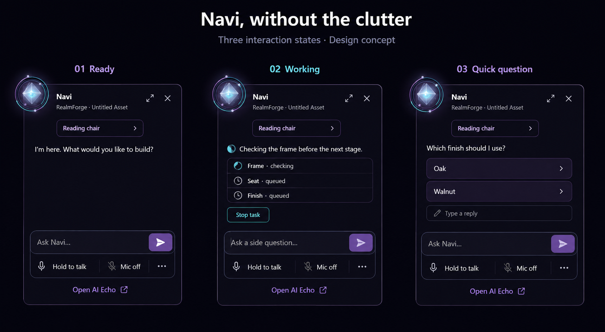
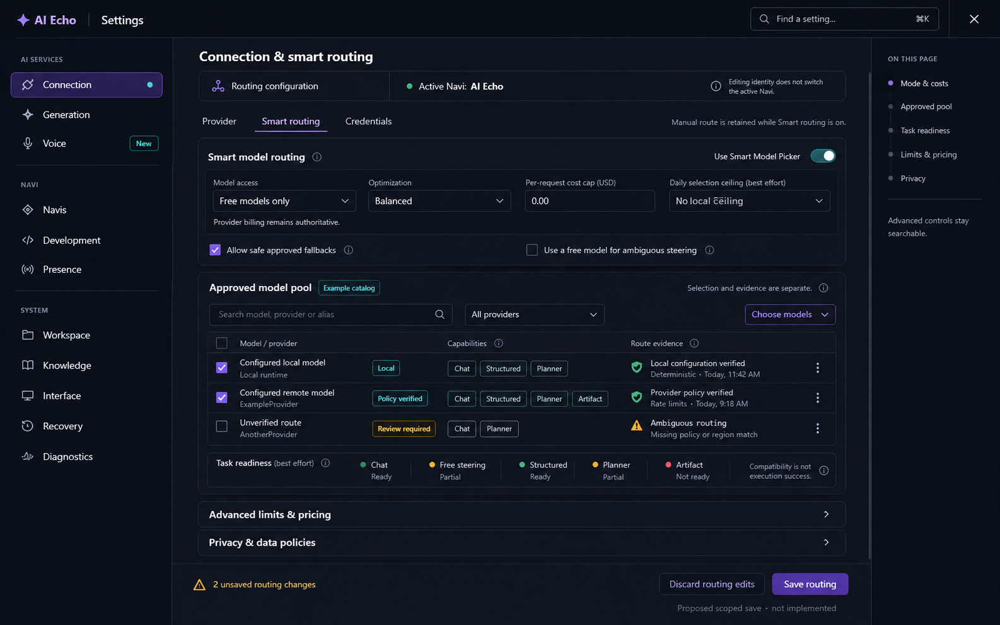
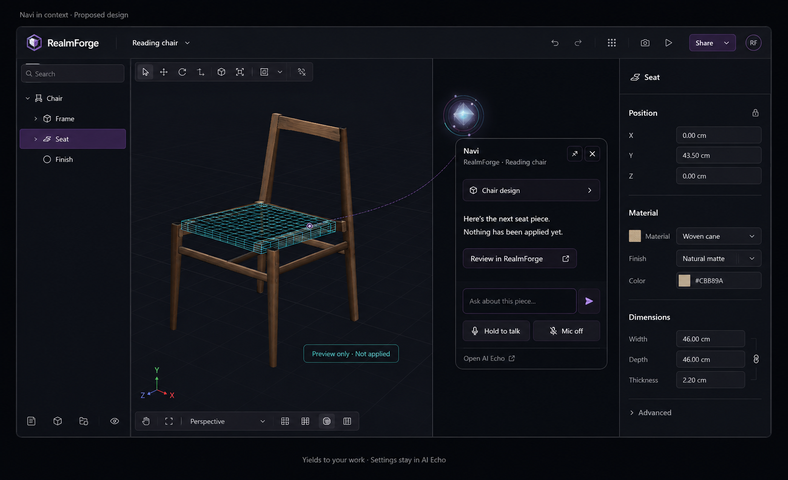

# Navi and AI Echo Settings Renovation

This renovation separates quick assistance from configuration while preserving AI Echo's existing depth. The user approved implementation after reviewing the companion concept. The concept images remain design references, not screenshots of live state.

## Implemented workflow

- **Navi:** use the compact popup for the current conversation, latest response, up to three current stages, and exact-task Stop. During work, select Continue conversation, Ask a side question, or Steer this task. More contains occasional companion actions and settings links. The full agenda and configuration forms no longer fill the popup.
- **AI Echo conversations:** open Conversations and agenda from the sidebar or Navi's handoff. One full agenda presenter exposes priorities, dependencies, snoozing, and supported run controls. Explicit handoff selects the active mailbox. Task-action drafts are shared between compact and full surfaces but remain distinct from ordinary chat drafts.
- **AI Echo Settings:** existing form panels remain in eleven grouped destinations, including Voice. Search reveals actual controls and their advanced groups; a section outline helps navigate long pages. The five Navi tabs and the appearance preview lease remain intact.
- **Saving:** Connection, Generation, Interface, Identity, Personality, Cognition, and Workspace have separate draft/save domains. Save affects the current domain and leaves Settings open. Closing with edits offers Save edited sections, Discard edits, or Keep editing. Selected-Navi identity is distinct from active-Navi operations and shared Personality/Cognition scope.
- **Voice:** Navi and full chat display transport; Settings displays source, privacy, and pronunciation configuration through the same shared gateway. Opening configuration does not start or stop capture. Immediate source and credential operations are not undone by discarding unrelated form edits.
- **RealmForge:** its editor, revision guards, disposable preview lifecycle, and guarded proposal review are retained. This renovation changes the companion presentation and handoff, not the authority to apply an asset change.

For example, edit a routing limit, visit Voice, and return to Connection: the routing draft remains. Saving Identity does not save that routing draft. Closing with both domains edited lets you explicitly save each domain or keep editing. A stale target or source revision rejects the save; a later failure reports any already committed outcomes without claiming a global rollback.

Sources: `webgpu-os/apps/ai-echo/factory.js`, `SettingsEditSession.js`, `SettingsWorkspaceShell.js`, and `manifest.json`; `webgpu-os/shared/NaviVoiceControls.js`; `webgpu-os/shell/echo-guide/EchoGuidePresence.js`, `NaviAgendaDrafts.js`, and `NaviAgendaPanel.js`.

### Resident AI Echo lifecycle

AI Echo 5.27 keeps one mounted runtime for the current unlocked OS account. Closing its window hides it in the tray. Opening it again reveals the same conversation store and view, preserving decoded messages, composer selection, scroll, settings drafts, and existing task subscriptions. The shell starts the enabled built-in app in the background after operator readiness, without opening its window or submitting a new question.

Use the tray's **Stop AI Echo** action for an actual exit. Stop suppresses automatic warmup for that operator scope; explicitly opening AI Echo starts it again. Account lock/change, shutdown, and package disable or quarantine still use terminal teardown. Cold boot and explicit Stop require authenticated state initialization on the next start. No decoded store is reused across accounts or page reloads.

Hiding suspends presentation, not task authority. Hidden controls cannot take focus; a pending native settings confirmation dismisses as **Keep editing**, preserving drafts. Hiding cancels a held push-to-talk gesture and the view-owned legacy microphone, but does not disable explicitly armed shared open mic. The shell's independent microphone status and Stop remain available. Explicit resident Stop cancels shared voice synchronously for the current process; stale asynchronous unmount cannot stop a replacement voice session.

This is an OS-managed, browser-page-resident assistant, not an installed native executable or a fully headless kernel service. Version 5.28 separates conversation ownership and window attachment as described in the runtime section. Closing the browser stops in-page execution; browser background throttling still applies. No new model, microphone permission, executable authority, or native companion is introduced.

Diagnostics export `startup.residency`: execution host, unlocked-page lifetime, presentation state, mount generation, view-resume count, and the latest measured synchronous resume-hook duration/time. This duration excludes browser paint and is not a cold-start or decryption benchmark. The existing cache field remains unavailable rather than inventing hit/miss counts. Browser regression fixtures verify zero additional storage reads when the live instance is hidden and reopened; fixture operation counts are not real-account encryption timings.

Sources: `webgpu-os/shell/Desktop.js`, `_warmResidentAssistant()`, `_requestUserPanelClose()`, `_prepareResidentAssistantStop()`; `webgpu-os/apps/ai-echo/factory.js`, `setSuspended()`, `prepareResidentStop()`, `unmount()`; `AIEchoTrayPresence.js`; `DiagnosticReport.js`; `tests/navi/ai-echo-resident-runtime.test.js` and `ai-echo-resident-lifecycle.test.js`.

Resident source verification passes 21 shell lifecycle checks, 11 production app/store lifecycle checks, 53 diagnostic checks, 25 operator-runtime checks, and the existing 594 AI Echo smoke assertions. The tray suite passes 10 browser checks and its five Python contracts; runtime-host/shared-runtime contracts pass 17 checks. The production settings fixture still preserves search drafts, all five Navi tabs, modal choice behavior, and narrow layout without microphone calls. Isolated source cold boot reaches readiness in 5.05 seconds with no page, HTTP, or failed-request errors. Its empty profile remains behind the real account gate, so unlocked lifecycle tests use isolated fixtures rather than altering the user's account.

### Conversation runtime, decoded-history budget, and health

AI Echo 5.28 introduces `AIEchoConversationRuntime`, a DOM-independent conversation owner. It owns the state-store lease, shared run and cursor maps, prompt/focus/agenda handler registrations, operation pins, and content-free health subscriptions. Runtime generations fence dispatch and retirement; window attachments have separate leases. Hiding, detaching, and reattaching presentation do not initialize the store or submit another provider request.

The existing execution and rich-settings adapter still uses retained DOM records. This is a real ownership boundary, not a claim that every legacy adapter is headless or runs in a worker. `detachWindow()` removes only AI Echo-owned presentation nodes when scroll state can be measured. `attachWindow()` restores those nodes, composer selection, and scroll. If a host has already hidden its layout before notifying the app, AI Echo conservatively retains the renderer instead of replacing its scroll with zero. Hidden controls remain inert. Exact owned detached run records continue consuming stream events and advancing cursors; unrelated or retired DOM cannot consume them. Reattachment does not duplicate a response or replace an unfinished draft.

In AI Echo 5.29, the runtime requests a smaller warm working set after verified startup: **8 MiB and two decoded conversations**, plus **2 MiB of extra serialized payload copies**. Heavy inactive payloads are decoded lazily from retained, authenticated serialized history. Array membership, metadata, and durable shards remain intact. These budgets do not delete old messages. The active conversation, nonempty drafts, active or recovered runs, queued starts, explicit pins, dirty changes, and unverified writes are protected. Protected data can exceed the budget; that produces memory-pressure evidence rather than discarded work.

The estimate counts UTF-16 JSON payload bytes, not total JavaScript heap. The serialized-copy budget applies only to duplicate cache payload strings. Authenticated shard signatures used for reconstruction and durable comparison remain resident and are reported separately; they are not capped at 2 MiB. Metadata, retained renderer records, and temporary export/write snapshots are also outside these caps. Reading an evicted conversation can decode that conversation again; hiding and reopening the same active conversation does not reopen encrypted storage. The store exposes `configureDecodedHistoryBudget()`, `pinDecodedHistory()`, `trimDecodedHistory()`, `waitForDecodedHistoryMaintenance()`, and content-free `getMemoryDiagnostics()` through its existing trusted runtime owner.

Runtime readiness requests deferred cache maintenance instead of synchronously indexing every conversation. Cooperative maintenance yields between work units and stops for disposal or superseding configuration. Diagnostics distinguish pending or partial maintenance from measured complete coverage. Direct callers may still request synchronous trimming. One unusually large record can take longer than a scheduling slice; this is not a hard real-time guarantee.

Startup also captures only the six managed-file fields (`version`, `updatedAt`, `soul`, `mind`, `cognition`, and `wiki`) for import and export. Unchanged managed files no longer require copying the complete conversation history. A changed import merges those managed fields over the retained canonical state before normalization. Stored skill-contract validation skips its tool-catalog probe only when no eligible stored skill has required tools; actual tool bindings still require the existing live validation.

These changes remove cache and projection work from the critical path; they do not bypass encrypted readback, shard authentication, generation checks, or migration. Writable chat still waits for those safeguards. Benchmarks use isolated synthetic histories and separate cache startup time from full authenticated startup; they do not promise instant boot on a user's account.

The resident tray entry displays **Starting**, **Ready**, **Working**, **Attention**, or **Unavailable** from runtime evidence. Its menu includes noninteractive status and decoded-history information beside the existing Open, Hide, Navi, and Stop actions. Opening or updating the menu does not restart the assistant. Counts combine queued operations and active sessions without double-counting one task. Terminal teardown releases the app-owned tray entry; no stopped process claims a live heartbeat. Diagnostics include the same sanitized `startup.runtimeHealth` projection without conversation text, identity, arbitrary errors, or diagnostic getters.

Sources: `webgpu-os/apps/ai-echo/AIEchoConversationRuntime.js`, `AgentStateStore.js`, `AIEchoRuntimeHealth.js`, `AIEchoTrayPresence.js`, `DiagnosticReport.js`, and `factory.js`; `webgpu-os/kernel/TrayManager.js` and `webgpu-os/shell/tray/system-tray.js`. Regression fixtures cover runtime leases, detached stream consumption, state persistence, tray interaction, and diagnostic projection. Human speech and protected-world acceptance gates remain independent.

### Fresh attention and connected conversations

Navi distinguishes the conversation happening now from the last mailbox viewed
and the exact task being controlled. A page boot starts with **Talk with Navi**.
Restoring an earlier mailbox does not select it as today's conversation. The
first admitted message creates the new general conversation through the existing
guarded session transaction. Boot alone does not create another empty mailbox.
Closing and reopening the popup or resident AI Echo keeps the live conversation
and draft; a fresh page does not resume yesterday's work.

Earlier unsubmitted encounter drafts remain available for explicit viewing and
copying through **Pick up earlier**, followed by **Return to current conversation**.
They are never automatically inserted or sent. A differing full AI Echo composer
draft uses a distinct encrypted source key instead of overwriting the popup's
shared voice draft. Assistant state version 2 accepts 32,000 characters for that
full-composer source and 2,000 for quick drafts, retaining the existing aggregate
96,000-character and 48-draft ceilings. Version 1 records are validated against
their original limits before upgrade. Capacity or save failure keeps the user's
unsaved text and reports the failure; it does not truncate text or discard an
older draft.
After durable transfer into a mailbox, a source draft is removed only if its
saved text still matches, checked inside the existing encrypted storage lock.
Saving or retiring that separate editor draft does not interrupt microphone
capture or revoke an already pending voice admission.

**Pick up earlier** initially shows bounded saved summaries. **Recall here**
provides reference information without selecting or resuming that task.
Explicitly continuing a conversation selects its mailbox across the popup and
AI Echo. Task Stop, steering, and supported Resume remain separate exact-run
actions. Viewing restored history no longer releases queued follow-up turns.

The shared attention projection carries its own revision, encounter, Navi,
conversation destination, last-viewed session, and topic reference. Restored
catalog activity and background task progress do not determine that destination.
Text and voice submit against the same attention revision. Foreground application
observations omit mailbox, task, and execution-mode routing fields. They are
context, not instructions to operate that program.

Topic corrections create versioned metadata boundaries in the existing mailbox,
not new permissions or deleted messages. State version 15 retains at most 32
boundaries and up to eight explicit episode links. Related summaries default to
four entries and 2,400 characters, using session-head metadata without opening
older transcripts. Imported and forked records do not retain local conversation
links as though they belonged to the destination account. These are bounded,
correctable references, not retraining or an automatic semantic topic classifier.

For example, greet Navi after boot, recall a chair discussion, then ask a general
question. The chair summary is optional reference; neither the greeting nor the
recall starts building. A bare **continue** with no unambiguous current exchange
asks what to continue. Existing task controls remain the route for an exact
interrupted job.

Voice can capture into the fresh encounter's private draft before its first
mailbox admission. A successful receipt binds that same live utterance to its
new mailbox without acquiring a second microphone. Unfinished recognized text
remains a draft. Identity or deliberate destination changes still revoke capture;
no saved preference automatically enables open microphone after boot.

Sources: `webgpu-os/kernel/navi/NaviAssistantSurfaceChannel.js`,
`NaviVoiceKernelBinding.js`, `NaviAssistantStateStore.js`;
`webgpu-os/apps/ai-echo/AgentStateStore.js` and
`factory.js`; `webgpu-os/shell/echo-guide/EchoGuidePresence.js`. Browser fixtures
exercise fresh routing, explicit selection, cold readiness, topic persistence,
draft races, and shared voice admission in isolated profiles.

### Renovation baseline verification

The full AI Echo browser smoke suite passes 594/594 assertions. The focused browser suites pass: compact popup and draft handoff 89/89, agenda 12/12, settings editing 20/20, settings workspace 14/14, voice controls 51/51, shared voice session 67/67, RealmForge modeler 6/6, guarded proposal review 36/36, and RealmForge handoff 52/52. A separate fixture using the production settings factory checks real routing, all five Navi tabs, Recovery, Diagnostics, advanced search, dirty-close confirmation, and narrow layout without horizontal overflow or voice capture. Native confirmation keyboard tests verify Tab/Shift+Tab, Escape-as-Keep, focus restoration, and isolation from background settings shortcuts. Replaced or aborted confirmations cannot clear a newer confirmation's state.

An isolated source OS cold boot reaches readiness with a real rendered avatar and no page errors, HTTP errors, or failed requests. Clicking the actor in Start opens the new compact popup. The empty test profile has no Realm Passport, so full authenticated settings remain subject to the existing account gate; production-form fixtures provide the settings coverage without creating a user account. Python source/package contracts pass 42/42 checks across runtime host, official Artifact Studio package, shared-runtime parity, and Echo Form integration. Conversation-mailbox checks pass 12/12 and synthetic fast-restore acceptance passes 15/15; those timings are fixture evidence, not a live-account performance guarantee.

Package visual review caught a pre-existing compiled-loader omission: `style.css` shipped but was not requested on the empty-install-registry path. The generated `release-boot.js` now awaits a source-relative, deduplicated stylesheet load before starting the compiled runtime, with a bounded failure routed through stable recovery. Installed-release selection remains lazy. Source: `bundler/site.py`, `_WEBGPU_OS_RELEASE_BOOT_SOURCE`; browser/deployment tests in `bundler/tests/test_webgpu_os_runtime_assets.py`.

The final compiled UI regression run passes 135/135 cases: popup 89, agenda 12, edit sessions 20, and settings workspace 14. It uses only `PE.requireModule` production imports and blocks raw implementation-module requests. The tested runtime SHA-256 is `2c8f5b3935b39143c091128b0ae95a3e0ce430bce079c0d6c5e6de6f742ef5ee`; the archive's decoded runtime matches those exact bytes.

The rebuilt `release/particle-os-site.zip` contains 2,688 entries (118,003,976 bytes). CRC checks, runtime SRI/length checks, ten renovated-source/stylesheet byte-parity checks, 59 embedded package checks, and build-time documentation validation pass. Release-loader/CSP checks pass 15/15, including six real-browser boot scenarios. Final isolated packaged boot reaches readiness in 5.36 seconds with no page errors, failed requests, or HTTP errors; the stylesheet is applied once and the taskbar, Start menu, real Navi actor, and compact popup are visually verified. The empty-profile account gate still applies to full AI Echo settings.

The implementation does not establish speech intelligibility or protected-world readiness. Simulated providers in browser regressions do not prove live provider availability. The refreshed source documentation records these post-build results; the ZIP retains the documentation snapshot produced during its build.

## Design decisions and approval status

- **Navi:** the user likes the three-state companion concept. Keep its avatar, restrained violet/cyan accents, context chip, compact task state, composer, and voice transport. Adapt height to content instead of retaining the concept's empty space.
- **AI Echo Settings:** the earlier identity-form concept did not demonstrate enough complexity. The implemented shell wraps the existing routing, cognition, recovery, and appearance forms; it does not replace them with a simplified profile card.
- **RealmForge:** retain the editor. The concept is an overlay-placement study, not a replacement toolbar, hierarchy, property schema, or workspace. The user's tentative positive response is not approval to rebuild the editor.
- **Scope:** configuration stays in AI Echo. Full conversations and agendas belong in AI Echo's conversation workspace, not in its configuration forms.

### Navi companion direction

The chair name, stages, and choices are illustrative. Runtime content must come from the exact active conversation, task, and app context.

### Revised dense settings study

This study informed the dense workspace. Its example model rows, timestamps, capability badges, and readiness labels are illustrative, not verified live routes. The implementation retains the existing model panels and their actual candidate counts and blocker reasons. The scoped footer uses the domain-specific save refactor, not an omnibus save behind a new label.

### RealmForge companion placement

Only the placement, preview explanation, and review handoff inform this plan. The generated editor chrome, example dimensions, and example material are not new requirements.

## Three surfaces with distinct jobs

| Surface | Keep available | Move elsewhere |
| --- | --- | --- |
| Navi popup | Exact context, conversation switcher, latest response, current task summary, questions, composer, microphone status, Stop voice, Stop task, Open AI Echo | Provider settings, pronunciation editing, persistent placement policies, full agenda, growth history |
| AI Echo conversation workspace | Mailboxes, summaries, full agenda, dependencies, snoozed work, run history, side questions, steering, detailed responses | Persistent configuration belongs in Settings |
| AI Echo Settings | Sources, permissions, identity, personality, cognition, growth review, presence policies, appearance, recovery, diagnostics | Routine conversation does not require opening Settings |

Moving a control does not create a second owner of its data, microphone, task, or draft.

## Settings architecture that accommodates complexity

Keep the ten existing navigation destinations and their stable route IDs. Group them visually rather than replacing them with broad cards that hide functionality. Add a real Voice destination for the configuration currently embedded in shared voice controls.

| Navigation group | Destinations | Content and scope considerations |
| --- | --- | --- |
| AI services | Connection, Generation, Voice | Provider credentials and routing; sampling and modalities; recognition/output sources, privacy, pronunciation, voice-lab link |
| Navi | Navis, Development, Presence | Authored character; evidence and Gym review; bodies, placement, interfaces, and handoffs |
| System | Workspace, Knowledge, Interface, Recovery, Diagnostics | Existing file scope, knowledge, approvals, display, recovery, and inspection controls |

Within **Navis**, retain Echo Builder, Identity, Personality, Cognition, and Continuity. Use a compact companion selector and a clear distinction between **Editing Navi** and **Active in chat**. Selecting a character to edit must not silently switch the responding identity.

Use one main page scroll region, a searchable settings index, and an optional section outline for long pages. Search must reveal the actual destination and advanced group without losing drafts. Model catalogs and review records need dense lists or tables, not large decorative tiles. On narrower windows, collapse the outline into a section picker and stack forms without shrinking labels to illegibility.

A live avatar preview belongs in Echo Builder and identity-oriented views. It should not consume half the screen on routing, recovery, or diagnostics pages. Preserve the existing appearance preview lease and save/undo behavior.

Source: `webgpu-os/apps/ai-echo/factory.js`, `_buildSettingsDialog()`, `pageDefinitions`, `naviStudioDefinitions`; `webgpu-os/apps/ai-echo/manifest.json`, registered settings surfaces.

### Stress-test the layout with actual controls

The dense study uses **Connection / Smart routing**, where the code already places `SmartModelPickerPanel`. Generation remains a separate destination; the visual grouping does not silently move its data ownership.

Routing must retain approved model selection, provider filters, workload filters, task-readiness evidence, optimization, separate per-request and best-effort daily ceilings, fallback controls, context/latency/trust limits, and pricing/privacy policies. Generation must retain sampling and output limits, provider-supported reasoning visibility, image input, and reviewed raster-output routes.

Important semantics must survive the redesign:

- An empty explicit Smart text-model pool means all eligible discovered models, not disabled routing.
- An empty image pool has different meanings depending on Smart mode. Do not reuse text-pool labels without checking the image contract.
- Compatibility counts are not promises that a live request will succeed.
- Workload suitability is different from hard Planner compatibility.
- Prefer-local is not local-only; no-training is not zero-retention.
- Image understanding, raster generation, and SVG artifact authoring are separate capabilities.
- Daily selection accounting remains best effort; it is not an authoritative provider billing limit.

Sources: `webgpu-os/apps/ai-echo/SmartModelPickerPanel.js`, `_build()` and `readPolicy()`; `ImageModelPickerPanel.js`; `factory.js`, generation and image settings construction.

## Save behavior is part of the renovation

Before renovation, `_saveSettingsOnce()` wrote routing, identity, Mind, Cognition, and task configuration in one flow. Its recovery attempt was not an atomic rollback of every domain. The current method dispatches a captured domain through existing persistence owners.

The implemented behavior is:

1. Each editable domain owns its draft, target identity where applicable, base revision, validation, and save result.
2. **Save identity** saves only identity. Provider discovery must not be a prerequisite for it. Routing and task configuration use their own save actions.
3. Show actual scope: selected-Navi identity, active-Navi operations, or shared AI Echo settings. Current Mind and Cognition forms use shared storage; do not relabel them per-Navi without a separate data migration.
4. Keep drafts while navigating sections. On target change or close with edits, offer Save, Discard edits, or Keep editing. Do not silently overwrite another identity or a newer revision.
5. Keep Settings open after saving. Show inline confirmation or validation failure and retain failed drafts.
6. Clearly label immediate operations such as source configuration, credential actions, recovery, and activation. **Discard edits** cannot promise to undo an already completed operation.
7. Preserve independently committed outcomes after a later failure and report them truthfully. Never display a global success or rollback that did not occur.

Sources: `factory.js`, `_saveSettingsOnce()`, `_renderMindSettings()`, `_renderCognitionSettings()`; `webgpu-os/shared/NaviVoiceControls.js`, gateway configuration and pronunciation handlers.

## How Navi should respond

### Ready, working, and asking

The popup is a nonmodal conversation surface, initially about 360–420 CSS pixels wide where space allows. Clamp it to the usable viewport; keep the composer and relevant Stop actions reachable. Expand for real content, not permanent settings sections. Long responses may scroll within a bounded message region.

- **Ready:** context chip, most recent useful response, and composer. Use readiness language appropriate to the available service, not a blanket claim that every capability works.
- **Working:** current measured step and a short stage list, with the exact task's Stop control. No invented completion percentage. Keep full history in AI Echo.
- **Question or approval:** show the exact pending question and applicable choices. Do not turn a conversational answer into approval of an unrelated action. Required parameters and risks remain available in the guarded review surface.
- **Listening or speaking:** persistent state from the shared voice session and actual playback. Stop voice remains distinct from Stop task.
- **Unavailable or failed:** explain the relevant limitation with a recovery action; keep text usable. Avoid a permanent wall of unavailable growth and source cards.

While a task runs, distinguish **Ask a side question** from **Steer this task**. Preserve exact-mailbox side-question drafts when moving between compact and full surfaces.

### Placement, motion, and accessibility

Keep existing click, drag, and pet interpretation. Put occasional Pet, Move, and Dock commands in More; keep persistent placement teaching and history in AI Echo Presence. A contextual Stay here action may remain near Navi when its live app-owned safe region is valid.

Freeze the reading/typing anchor while the popup is in use. Reposition for measured obstruction or viewport changes without moving text under the pointer. The avatar can lean attentively, pulse while listening, or react to actual speech. Reduced-motion mode uses stable indicators. Personality must not override interaction yielding or explicit placement.

The popup should not trap OS focus or claim to be modal. Genuine modal confirmations need initial focus, containment, Escape handling where appropriate, and focus restoration. See the [WAI dialog pattern](https://www.w3.org/WAI/ARIA/apg/patterns/dialog-modal/).

Target at least 44 CSS pixels for primary touch actions as a design choice. Verify the WCAG AA minimum target/spacing rules and usable reflow at 320 CSS pixels; the intrinsically two-dimensional 3D viewport is separate from the forms. See [target size minimum](https://www.w3.org/WAI/WCAG22/Understanding/target-size-minimum.html) and [reflow guidance](https://www.w3.org/WAI/WCAG22/Understanding/reflow.html).

### Preserve conversation and microphone ownership

Closing Navi hides the surface; it does not discard the draft or stop the task. Opening the full conversation or agenda must carry the exact mailbox and avoid duplicate submission. Opening Voice, Presence, or Development settings is different: it must not switch the active conversation or acquire a microphone. If explicitly enabled open-mic capture continues with the popup closed, retain a visible indicator and immediate Stop control outside the hidden popup.

Reuse the existing shared voice gateway. Introduce presentation variants for compact transport and full configuration, not independent voice sessions. The Settings Voice view is configuration-only: it must not own capture gestures, receive transcript draft callbacks, or stop the transport when it unmounts. Preserve permission, privacy, identity, mailbox, hidden-document, lock, and shutdown boundaries.

The existing conversation workspace owns one lazily mounted full agenda editor. The popup does not mount a second editor. `NaviAgendaDrafts` shares task-action drafts by exact Navi, session, and mailbox, with a separate encrypted draft key from normal chat. Submission checks the current catalog and target; accepted admission clears only the unchanged draft revision. Closing a presenter does not delete its shared draft.

Sources: `webgpu-os/shell/echo-guide/EchoGuidePresence.js`, `_syncAssistantDraftMailbox()`, `_selectedAssistantMailbox()`, `_selectAssistantMailbox()`, `_submitAssistantPrompt()`, `_openFullAssistant()`; `webgpu-os/shared/NaviVoiceControls.js`; `webgpu-os/shell/echo-guide/NaviAgendaPanel.js`.

## Ordered implementation milestones

The user authorized these milestones with the subsequent build request. The list records the implementation order and acceptance requirements; it does not authorize unrelated runtime or permission changes.

1. **Inventory and destination contracts.** Map every existing field and action to its owner, scope, write timing, and destination. Preserve current route IDs. Register and validate Voice and conversation-workspace deep links instead of sending unsupported route names. Separate settings navigation from mailbox-focus handoff. Gate: no orphaned control, broken old link, or conversation switch caused by settings navigation.
2. **Scoped editing and saves.** Refactor the current multi-domain save through existing persistence owners. Add exact target/revision checks, dirty draft retention, and truthful partial-failure reporting. Gate: saving identity cannot alter routing or require model discovery; immediate actions are never represented as discardable drafts.
3. **Dense Settings shell.** Add grouped navigation, search, section outline, responsive layout, and scoped footer. Reuse existing form panels and validators. Validate routing, cognition, recovery, and Echo Builder, not only an easy identity page. Gate: feature parity and readable dense states.
4. **Voice presentation split.** Retain one shared session. Show transport in Navi/full chat and configuration in AI Echo Voice. Give the configuration-only view no capture gesture or transcript draft ownership. Gate: popup transitions do not duplicate capture; opening/closing settings neither acquires capture, cancels transport, nor changes the conversation.
5. **Compact Navi state surface.** Apply the approved visual direction, content-sized layout, exact context, current task/question states, More actions, and keyboard focus behavior. Retain mounted draft ownership and admission safeguards. Gate: closing/reopening and switching mailboxes cannot lose or migrate drafts.
6. **Full conversation and agenda handoff.** Move the full agenda and run-control views to the existing conversation workspace shell. Lift exact-mailbox, catalog-revision-fenced side-question drafts before moving or destroying panels. Clear only on accepted admission with unchanged draft text. Gate: one full agenda presenter, one admitted submission, and one exact run target across compact/full transitions.
7. **RealmForge companion integration.** Reuse the editor's context, revision, preview, and review lifecycle. Place Navi outside active controls and point only to valid current parts. Gate: cancellation or stale revision removes disposable previews; Apply remains guarded and editor input works underneath yielded presence.
8. **Release verification and rollout.** Test source and packaged cold boot, recovery, slow discovery, source failure, stale saves, unavailable growth, keyboard/touch, 200% text, zoom/reflow, reduced motion, and resize. Keep each milestone reversible without overwriting user configuration. Gate: functional regressions and representative visual review pass before replacing the existing surface.

Implementation logs should identify domain, operation, target receipt/revision, entry, outcome, stale rejection, and elapsed time. Do not log credentials, raw microphone audio, or private prompt contents. Retain the current UI path until the new path meets each milestone's gate; rollback is a presentation/code change, not deletion of user data.

## Deliverables and boundaries

The image concepts were produced with the built-in image-generation tool using the user's screenshots as references. The [prompt set](../assets/design/navi-settings-2026-09-05/prompts.json) records the briefs. Raster mockups contain illustrative state; they do not establish that a service, permission, capability, or save transaction exists.

This renovation does not finish ParticleVoice intelligibility, move all AI execution out of mounted AI Echo, or unlock protected Virtual Realm embodiment. Those remain separate runtime and acceptance work. The implementation does not migrate user settings or automatically enable a microphone.

## Original design-deliverable verification

- The documentation search/navigation build, discovery build, and viewer bundle build pass.
- An isolated browser check loads this page with HTTP 200, all three concept images with descriptive alt text, and no page errors. The user's OS and voice tabs are not reloaded.
- Independent source review checked popup, voice, agenda, and navigation ownership. Its handoff and draft-lifecycle corrections are incorporated in this proposal.
- The repository-wide documentation validator remains blocked by three stale API metadata checks in the separately changing ParticleVoice `ArticulationHead` and `ParticleVoiceModel` modules. This design task does not regenerate those source/API contracts or claim the full validator passes.
- Application builds and runtime acceptance tests were not run for the original design-only deliverable. The implementation verification section records subsequent checks.

## See also

- [Navi architecture and delivery](navi-architecture-and-delivery.md)
- [Navi speech milestone](navi-speech-milestone.md)
- [Navi growth and AI Gym](navi-development.md)
- [RealmForge modular workbench](realmforge.md)
