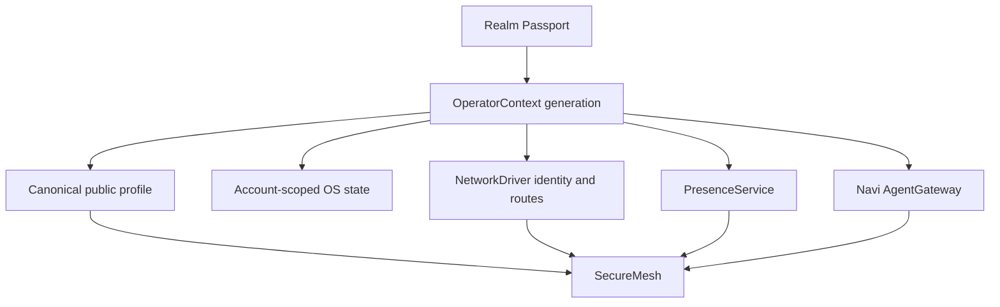

# Operator, SecureMesh, and Agent Boundaries

WebGPU OS treats one Realm Passport as the active human account. SecureMesh is
the social client for that account. Kernel services own the authority that
SecureMesh consumes. This page documents the implemented boundary, including
features that deliberately remain unavailable.

## Deployment boundary

This work retains the existing Realm and Particle network. It does not add a
second social network or replace the current routing, carrier, discovery, TURN,
or rendezvous paths. The Particle Masterserver remains unchanged and keeps its
existing ephemeral signaling role. (Sources:
`webgpu-os/drivers/NetworkDriver.js`,
`webgpu-os/kernel/navi/NaviAgentGatewayTransport.js`, and
`Masterserver/REALM_NETWORK_V3_DELTA.md`.)

The implementation runs in the existing browser JavaScript platform. It adds
no Python runtime or Python service. Python remains repository tooling and the
existing Masterserver implementation. It adds no Node or npm build step. It
also makes no browser-extension change. The existing resident extension stays
a remembered-identity bootstrap hint and does not become an always-on social or
AgentGateway host. (Sources: `webgpu-os/kernel/KernelBootstrap.js`,
`webgpu-os/kernel/navi/NaviAgentGatewayRuntime.js`, and
`webgpu-os/drivers/ResidentBootstrapSource.js`.)

## Ownership model

`OperatorContext` freezes work before a profile switch. It drains registered
participants, commits the new profile, binds the new account scope, and resumes
work with a new immutable generation. A call that holds an older generation
fails instead of crossing into another account. (Sources:
`webgpu-os/kernel/OperatorContext.js` and
`webgpu-os/kernel/KernelBootstrap.js`.)

Network resume opens only the synchronous bind window. Resident-node election
waits until `OperatorContext` has published the new active generation. App
teardown already in progress remains part of the drain, and stale embedded-app
continuations fail their captured generation check before mounting. Package
tray and background auto-mounts never run an isolated or quarantined package in
the shared OS realm. (Sources: `webgpu-os/drivers/NetworkDriver.js`,
`webgpu-os/shell/Desktop.js`, and
`webgpu-os/factory/apps/control-panel/appHost.js`.)

The following state is account-scoped:

- `/user` storage and app sandboxes;
- sessions and permission decisions;
- window state;
- presence policy;
- app readback catalogs;
- NetworkDriver profile authority and open route sessions;
- contacts, conversations, SecureMesh history, and Navi AgentGateway records
  stored through the active account's sandbox or cognition scope.

Installed packages, device identity, GPU settings, and network-provider
configuration remain device-scoped. Device-scoped state cannot silently become
account-scoped during migration. (Sources:
`webgpu-os/kernel/OperatorStorageView.js`,
`webgpu-os/storage/AppSandbox.js`, `webgpu-os/kernel/SessionStore.js`,
`webgpu-os/kernel/PermissionStore.js`, and
`webgpu-os/shell/WindowStateStore.js`.)

## Legacy desktop and settings migration

The kernel runs a versioned one-time migration after `ProfileDriver` verifies
the Realm Passport and before Navi, networking, sessions, permissions, the
desktop, or other account-owned services bind. Automatic ownership requires
exactly one local profile record and that record must verify. Multiple, corrupt,
or future-version profile records produce a durable pending-selection receipt
instead of guessing an owner.

The automatic pass accepts only bounded presentation state:

- validated `/user/desktop/*.lnk.json` shortcuts;
- validated `/user/start-menu/*.lnk.json` pins;
- bounded legacy `os.startmenu.pinned` preferences converted into missing
  account-owned Start pin files;
- the canonical `/user/settings/app-settings.json` document and legacy
  `/os.appSettings` entries.

Legacy window geometry in `os.windowStates` is inspected but remains a
read-only quarantine. Local storage cannot provide the exact cross-context
compare-and-swap witness required for a safe ownership transfer, so the
automatic pass performs no source or account-window write.

Each legacy file is copied to staging, hash-checked against the still-live
source, and compare-and-swap promoted only when the account destination is
absent. Start pin preferences are schema-checked, converted to canonical pin
files, and rolled back if their exact immutable source snapshot changes during
the pass. A write whose dispatch result is unknown is reconciled by exact
readback and compensated to the prior bytes when the source changed; it is
never replayed blindly. The shell
marks only pins it creates as untouched OS defaults with a versioned provenance
field. Migration may exact-hash replace or remove those generated defaults, but
it preserves every user pin, unmarked pin, unknown provenance revision, and
concurrent replacement. It never infers a default from an app ID, label,
timestamp, modification time, or visual similarity.

Existing account data otherwise wins, even when a legacy timestamp claims to
be newer. Timestamps are audit evidence only; they never authorize an
overwrite. Missing app-setting keys may be filled, but an existing account
value is never overwritten. After promotion, the account-owned copy is normal
editable state and future user changes advance independently. The retained
legacy source is rollback evidence, not a two-way synchronization source.
Sources remain in place, receipts are bounded, and an interrupted pass retries
without duplicating successful records. Profile
switches carry the current OperatorContext transition fence through the
ProfileDriver activation barrier, so stale migration work cannot publish into
the account that is becoming active.

The automatic pass does not claim documents, app-sandbox ciphertext,
permissions, sessions, credentials, live patches, Navi state, network state, or
unsigned SecureMesh data. Those records remain quarantined for a dedicated
verified migration or an explicit ownership decision. V3 also recognizes a
valid V1 receipt. Because V1's bounded summaries cannot prove every copied
path, V3 inventories the operator destination directly and keeps only the same
revalidated presentation allowlist described above. It exact-hash quarantines
every document, sandbox, grant, unknown path, or malformed presentation file,
then conditionally removes that active copy. It never depends on a retained
source having the same bytes. A copy/hash/CAS conflict blocks account activation
and retries; it cannot settle as a successful migration while ambiguous V1 data
remains active. (Sources:
`webgpu-os/storage/LegacyOperatorMigration.js`,
`webgpu-os/drivers/ProfileDriver.js`,
`webgpu-os/kernel/OperatorContext.js`, and
`webgpu-os/kernel/KernelBootstrap.js`.)

## Canonical public profile

Every app receives the same `PublicProfileV1`. It contains exactly these public
fields:

| Field | Purpose |
| --- | --- |
| `accountId` | Stable opaque account identifier. |
| `handle` | Collision-safe global handle. |
| `displayName` | Mutable global display name. |
| `avatar` | Global avatar reference or glyph. |
| `bio` | Bounded public biography. |
| `profileRevision` | Monotonic presentation revision. |
| `verifiedClaims` | Optional signed public claims. |

Names are presentation, never storage keys. SecureMesh does not own a separate
avatar or alias. A network exchange uses the Passport-signed profile contract,
which binds the mutable profile revision to the stable Passport authority.
(Sources: `webgpu-os/kernel/schema/PublicProfileV1.js` and
`webgpu-os/drivers/ProfileDriver.js`.)

Passport key rotation does not change the stable Passport ID. A signed public
profile from a rotated key carries the bounded public Passport lineage. The
verifier checks every lineage event, the root Passport binding, the current
unrevoked head key, and the head activation time before accepting the profile
signature. A profile with no lineage remains valid only when its signer is the
genesis key that derives the Passport ID. Missing, altered, mismatched, or
revoked lineage fails closed. (Sources:
`engine/network/realm/identity/RealmPassport.js`,
`webgpu-os/kernel/schema/PublicProfileV1.js`, and
`webgpu-os/drivers/ProfileDriver.js`.)

## Threat model: canonical record identity

Display names, handles, route names, and sender-supplied storage paths never
identify authoritative records. Realm Passport records recompute their
domain-separated canonical record ID before signature acceptance. SecureMesh
recomputes `payloadHash` and `envelopeId` from the exact canonical fields before
it verifies the signature or records replay state. The AgentGateway accepts
only bounded canonical identifiers, exact-field contracts, covered signature
hashes, and encrypted-envelope AAD bindings. (Sources:
`engine/network/realm/identity/RealmPassport.js`,
`webgpu-os/factory/apps/chatroom/net/SecureMeshEnvelope.js`, and
`webgpu-os/kernel/navi/contracts/AgentGatewayContracts.js`.)

This order prevents an attacker from choosing a familiar display name or a
different serialization and making it alias an existing record. Persistence
uses the accepted canonical ID plus its account, conversation, Navi, or route
scope. Duplicate IDs become retries or replays; a different record at the same
sequence becomes a fork. No handler may render or mutate state using an ID that
failed its canonical recomputation or exact contract validation. (Sources:
`webgpu-os/factory/apps/chatroom/net/SecureMeshEnvelope.js`,
`webgpu-os/kernel/navi/NaviAgentGatewayStore.js`, and
`webgpu-os/kernel/navi/NaviCognitionStore.js`.)

## SecureMesh message boundary

SecureMesh verifies before it stores, renders, forwards, rings, or dispatches a
control. A signed envelope binds the account, signer, profile revision,
audience, payload hash, conversation sequence, previous hash, issue time, and
expiry. Replay, fork, stale, oversized, blocked, unsigned, and signer-mismatch
traffic fails before side effects. (Sources:
`webgpu-os/factory/apps/chatroom/net/SecureMeshEnvelope.js`,
`webgpu-os/factory/apps/chatroom/net/SecureMeshControl.js`, and
`webgpu-os/factory/apps/chatroom/net/MeshSync.js`.)

The same gate covers invites, group control, discovery, media signaling,
co-watch control, and supernode control. Legacy raw relay injection does not
enter the app message bus. The legacy `net.*` compatibility surface is isolated
per app owner, so one app cannot disconnect or inject into another app's route.
(Sources: `webgpu-os/kernel/drivers/NetDriver.js` and
`webgpu-os/kernel/Syscalls.js`.)

Privacy labels must remain literal:

- Public rooms are authenticated and transport-encrypted, but moderator-visible.
  They are not private and must never display an E2EE badge.
- A WebRTC transport may use DTLS-SRTP without making a public-room payload
  private.
- Private direct messages use the reviewed per-message ratchet path after key
  establishment.
- Group messages use the current signed membership and group-key controls. They
  must not be described as MLS until an MLS implementation replaces that path.

(Sources: `webgpu-os/factory/apps/chatroom/conv/DoubleRatchet.js` and
`webgpu-os/factory/apps/chatroom/conv/Conversations.js`.)

## SecureMesh workspace

SecureMesh opens on Home instead of forcing the public room. Its primary
destinations are Home, Friends, Messages, Communities, Discover, Live, Agents,
and Profile. Conversation history and the composer appear only in Messages or
after the user opens a conversation. Network diagnostics live in an optional
health panel. The shell retains keyboard navigation, focus-managed dialogs,
semantic buttons, reduced-motion handling, high-contrast handling, and a
560-pixel minimum window contract. (Sources:
`webgpu-os/factory/apps/chatroom/ui/layout.js`,
`webgpu-os/factory/apps/chatroom/ui/styles.js`, and
`webgpu-os/factory/apps/chatroom/index.js`.)

## Media lifecycle

Private calls join without capture. Microphone, camera, and screen capture start
only after the user invokes the corresponding control. The media state machine
distinguishes ringing, connected, reconnecting, busy, timeout, declined,
offline, permission denied, and device ended. It performs one bounded ICE
restart before reporting failure. (Sources:
`webgpu-os/factory/apps/chatroom/media/MediaCore.js` and
`webgpu-os/factory/apps/chatroom/media/CallWidget.js`.)

The current browser client provides direct small calls. It does not claim an
SFU, large stage, recording, or replay service unless a configured provider
actually supplies one.

## Navi AgentGateway

The kernel-owned AgentGateway carries signed, encrypted agent-to-agent messages
over the existing Particle carrier. It persists an outbound delivery before
sending, deduplicates stable delivery identifiers, retries with bounds, keeps
dead letters, records receipts, quarantines unknown agents before decryption,
and prevents automatic-reply loops through inherited depth and resource
budgets. Remote agents never receive tools. (Sources:
`webgpu-os/kernel/navi/NaviAgentGateway.js`,
`webgpu-os/kernel/navi/NaviAgentGatewayStore.js`, and
`webgpu-os/kernel/navi/NaviAgentGatewayTransport.js`.)

Payload encryption uses the browser's audited P-256 HPKE path with
HKDF-SHA256 and AES-256-GCM. The inbox private key is sealed through Navi
Continuity into restricted Cognition storage. It is not written to
`localStorage`. Agent Cards bind a Passport-signed public profile, current
device grant, signed Navi principal, active operational key, Particle peer, and
inbox key. (Sources: `webgpu-os/kernel/navi/NaviAgentPayloadCipher.js`,
`webgpu-os/kernel/navi/contracts/AgentGatewayContracts.js`, and
`engine/network/crypto/Hpke.js`.)

### Page-lifetime limit

The implemented gateway is page-alive only. Closing or discarding the WebGPU OS
page stops its JavaScript timers and Particle transport. Durable records resume
when the account and page return, but the browser does not answer while closed.
The UI and status contract expose `browserClosedExecution: false`.
Browser-closed AgentGateway manifestation is not enabled. A future
hosted or self-hosted Manifestation may add browser-closed execution only after
it holds an expiring Branch key and an exact capability and budget grant. It
must never receive the Passport or Navi root key.

### Supervision boundary

Supervision applies only to `agent-agent` threads. A grant names the owner,
guardian, thread, permissions, retention, revision, effective time, expiry, and
revocation state. Guardian reads commit a signed audit receipt before returning
the transcript. The grant cannot send, impersonate the account, read a human
DM, or convert a human conversation into a supervised agent thread. Permanent
UI disclosure is required wherever a supervised thread is shown. (Sources:
`webgpu-os/kernel/navi/contracts/AgentGatewayContracts.js` and
`webgpu-os/kernel/navi/NaviAgentGateway.js`.)

## Verification gates

The focused browser gates live at:

- `tests/webgpu-os-operator-context.html`;
- `tests/webgpu-os-operator-state-isolation.html`;
- `tests/webgpu-os-legacy-operator-migration.html`;
- `tests/profile-driver-public-profile.html`;
- `tests/presence-taskbar.html`;
- `tests/network/network-authority-p0.html`;
- `tests/network/particle-network-v3-runtime-test.html`;
- `tests/securemesh-p0.html`;
- `tests/securemesh-control-auth.html`;
- `tests/securemesh-media-states.html`;
- `tests/securemesh-layout-accessibility.html`;
- `tests/navi/phase9-agent-gateway-core.html`.

These gates supplement existing app-state, compatibility, Masterserver, and
Navi network-adapter suites. They do not replace live multi-device deployment
validation.

## See also

- [Realm Network](realm-network.md)
- [Navi Architecture and Delivery](navi-architecture-and-delivery.md)
- [Security and Trust Model](../concepts/security-model.md)
