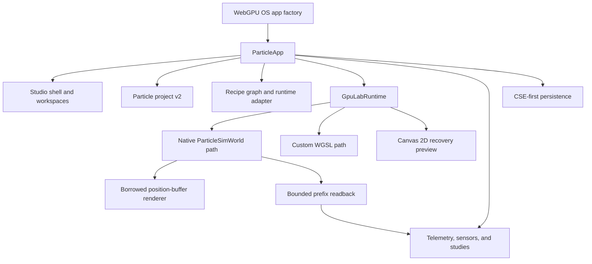

# Particle Studio Architecture

Particle Realms Studio is a WebGPU OS application, not a separate native
desktop editor. `ParticleApp` owns its lifecycle and composes the Studio shell,
versioned project, GPU runtime, evidence stores, and OS persistence services.
The current product exposes Discover, Create, Recipe, Simulate, Analyze, and
Compare. Simulate is the default/fallback workspace and keeps its tuning drawer
closed until explicitly requested. (Sources:
`webgpu-os/factory/apps/particles/ParticleApp.js`,
`webgpu-os/factory/apps/particles/ParticleStudioShell.js`)

Authoring ownership is deliberately outside the runtime app. Paint Studio owns
brush-driven simulation construction, and RealmForge is the developing home of
the reusable node/part recipe builder. Particle Realms retains portable recipe
inspection and safe parameter tuning so one document can be run, measured,
compared, and promoted into a built-in demo without a private second format.

This page is for app and engine developers who need the current ownership,
data-flow, and integration boundaries.

## Dynamic population controller

`ParticleCountGovernor` targets 60 FPS using a settled mean of measured RAF
cadence. Sustained pressure reduces particle count multiplicatively; sustained
headroom grows it conservatively. A deadband prevents oscillation, a cooldown
accounts for GPU reallocation cost, and workgroup-aligned quantization keeps
dispatch sizes stable. Decisions stop at the active device/runtime safety
maximum. That maximum is not exposed as a preference or user cap.

`ParticleApp` applies decisions only while Simulate is visible, running, and
GPU-backed. Each accepted change updates the canonical count binding, reports
the automatic population, and performs one resource reallocation. Paused,
hidden, authoring, fallback, and warm-up samples cannot change population.
(Sources: `webgpu-os/factory/apps/particles/ParticleQualityGovernor.js`,
`webgpu-os/factory/apps/particles/ParticleApp.js`)

## Runtime layers

Text equivalent: the factory registers the app. `ParticleApp` creates the
shell, selects a
runtime, applies validated projects, advances the native or custom simulation,
records measured runtime metrics, and coordinates save and recovery. The
advanced controller edits project sidecars and renders evidence; it does not
step a solver or open a live transport. (Sources:
`webgpu-os/apps/particles/factory.js`,
`webgpu-os/factory/apps/particles/ParticleApp.js`,
`webgpu-os/factory/apps/particles/ParticleStudioAdvanced.js`)

## Canonical project state

The persisted aggregate is `particle-realms.particle-project` version 2. It
contains project identity and settings plus these versioned sidecars:

| Sidecar | Responsibility |
| --- | --- |
| `studioDocument` | Scene objects, view layout, comparison state, and compatibility-only legacy artist data. |
| `recipeGraph` | Typed authored graph with stable IDs, ports, edges, and parameters. |
| `sensorDefinitions` | Provenance-aware definitions for accepted measurements. |
| `twinConfiguration` | Compatibility-only disconnected-safe data retained for lossless legacy project round trips. |
| `externalStudies` | Bounded normalized CSV or JSON reference studies. |
| `quality` | Authored automatic/profile/target-frame-time intent. |

Project validation is strict, serialization is deterministic, and the complete
document is capped at 32 MiB. Runtime samples, credentials, live connector
state, and transient memory pressure are not canonical project truth. (Source:
`webgpu-os/factory/apps/particles/ParticleLabProject.js`)

The project dependency graph is deliberately acyclic:
`ParticleLabCatalog.js` -> `ParticleProjectCore.js` ->
`ParticleRecipeGraph.js` -> `ParticleLabProject.js`. The core layer owns
settings, seeds, hashing, and immutable built-in presets; the aggregate layer
owns project/graph sidecar composition. This ordering preserves the same
public project behavior in raw ES modules and the eager classic release
bundle. (Sources:
`webgpu-os/factory/apps/particles/ParticleProjectCore.js`,
`webgpu-os/factory/apps/particles/ParticleLabProject.js`)

## Recipe-to-runtime seam

`ParticleRecipeGraph` validates and compiles a deterministic execution-plan
description. `ParticleRecipeRuntimeAdapter` is the current execution seam. It
applies the graph seed and the mapped count, force, temperature, point size,
exposure, camera distance, solver mode, fixed step, and substep values to
`ParticleApp`. Direct Quick and Standard control changes synchronize those
named default graph nodes while preserving custom topology, IDs, provenance,
and unsupported authored nodes. (Sources:
`webgpu-os/factory/apps/particles/ParticleRecipeGraph.js`,
`webgpu-os/factory/apps/particles/ParticleRecipeRuntimeAdapter.js`,
`webgpu-os/factory/apps/particles/ParticleApp.js`)

An invalid graph does not replace the live project or settings. The graph
compiler and Recipe workspace can report authored diagnostics, while
`ParticleApp` retains the last validated runtime configuration. Unsupported
solver types and node families remain authored intent; there is no generic
dispatcher that instantiates arbitrary engine, audio, telemetry,
external-study, or output nodes. (Sources:
`webgpu-os/factory/apps/particles/ParticleRecipeRuntimeAdapter.js`,
`webgpu-os/factory/apps/particles/ParticleApp.js`)

### Visual Recipe Builder state boundary

`ParticleStudioAdvanced` owns a recoverable authored-draft layer above the
canonical project. Valid graph edits compile, update the last-valid execution
plan, and commit through project-v2 normalization. Invalid edits keep the
authored nodes and edges in the builder, display compiler diagnostics, and do
not invoke the project-change callback. A subsequent repair compiles and
commits normally. This separation lets users assemble required sockets in
multiple steps without allowing an incomplete graph to replace live runtime
state.

The embedded Recipe preview uses `ParticleMultiViewRuntime` with the latest
bounded, explicitly labeled native readback. It is an X/Z projection at a
bounded refresh rate, not another `ParticleSimWorld`, a full-state copy, or a
validation claim. The Simulate workspace remains the only authoritative live
canvas. (Sources:
`webgpu-os/factory/apps/particles/ParticleStudioAdvanced.js`,
`webgpu-os/factory/apps/particles/ParticleMultiViewRuntime.js`)

## GPU and recovery paths

`GpuLabRuntime` may use an OS-shared device or request a dedicated device. It
derives capabilities from granted limits and never destroys a shared device.
The native particle path requires at least ten storage buffers per shader
stage. Eligible mapped modes create an engine `ParticleSimWorld`, upload
deterministic seed state, and render its borrowed position buffer directly.
Only a bounded prefix is copied for CPU-side views and exports. (Sources:
`webgpu-os/factory/apps/shared/GpuLabRuntime.js`,
`webgpu-os/factory/apps/particles/ParticleNativeRuntime.js`,
`webgpu-os/factory/apps/particles/ParticleNativeRenderer.js`)

Modes or devices that are not native-eligible use the app's custom WGSL
simulation. Initialization or recovery failure can fall back to a generic
Canvas 2D preview. That recovery preview preserves access to the authored
project but is not equivalent to the selected scientific or artistic model.
Device-loss recovery preserves authored state and recreates GPU-owned
resources. (Source: `webgpu-os/factory/apps/particles/ParticleApp.js`)

## Evidence architecture

Studio data uses explicit truth classes:

| Class | Current source | Boundary |
| --- | --- | --- |
| Direct GPU state | Native world buffers | Rendered without an app-owned simulation copy. |
| Bounded readback | Prefix of native positions | Supports compact projections and PNG capture, not a full-state export. |
| Measured runtime | Supplied frame, submit, GPU, count, and memory samples | Missing metrics remain missing. |
| Measured sensors | Provenance-bearing accepted samples | The runtime never reads the solver or fabricates values. |
| External reference | Imported bounded studies | Does not automatically validate the preview. |

(Sources: `webgpu-os/factory/apps/particles/ParticleLabTelemetry.js`,
`webgpu-os/factory/apps/particles/ParticleSensorRuntime.js`,
`webgpu-os/factory/apps/particles/ParticleExternalStudy.js`)

## Persistence and concurrency

`ParticleStudioPersistence` saves complete snapshots through app-scoped causal
state first, mirrors them to the encrypted sandbox, and retains legacy local
storage as a compatibility fallback. Writes carry an expected version and may
perform one reconcile retry. This is storage concurrency, not scientific
consensus or network collaboration. (Source:
`webgpu-os/factory/apps/particles/ParticleStudioPersistence.js`)

## Capability boundary

| Status | Capability |
| --- | --- |
| Implemented | Six workspaces, recipe-backed demos, project v2, deterministic graph validation/compilation, mapped recipe application, native/custom/recovery runtime selection, bounded telemetry and imports, and CSE-first persistence. |
| Partial | Recipe execution covers documented mappings only; Create multi-view uses projections of one sample; sensors accept supplied reductions but are not wired to a complete GPU probe pipeline. |
| Unsupported | Standalone native editor, arbitrary recipe-node execution, graphical node-canvas editing, collaboration, remote job systems, full-field scientific overlays, and certified engineering validation. |

These boundaries describe the current repository. The design pack is a product
direction document and does not override implemented source behavior.

## See also

- [Particle Realms Studio](particle-realms-studio.md)
- [Particle Studio Integration Map](particle-studio-integration-map.md)
- [Particle Recipe Schema](particle-recipe-schema.md)
- [Particle Studio Fidelity and Validation](particle-studio-fidelity-and-validation.md)
- [Particle Studio Performance](particle-studio-performance.md)
