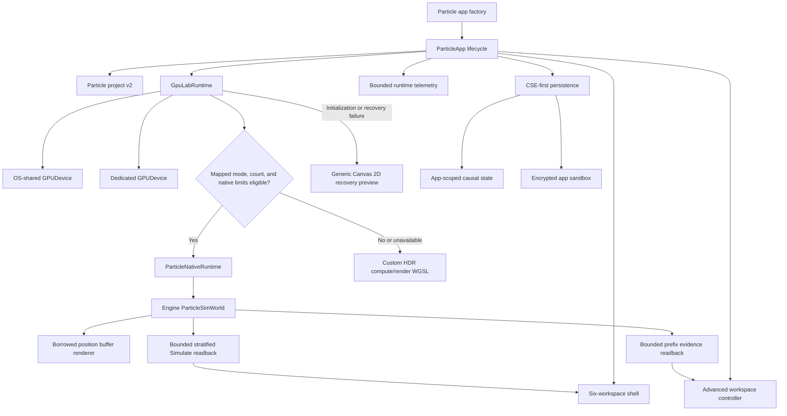
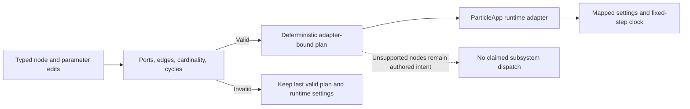
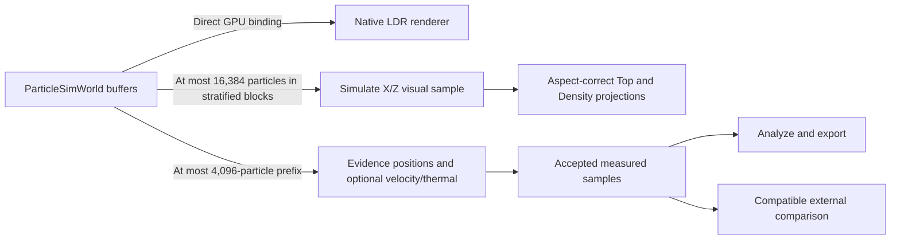

# Particle Studio Integration Map

This map shows the active Particle Realms Studio paths and the boundaries that
remain host or engine integration work. It distinguishes direct GPU state,
bounded readback, measured evidence, authored configuration, external data,
and predictions.

## Active Studio path

Text equivalent: the app factory mounts `ParticleApp`. The app owns the shell,
project, persistence, telemetry, advanced controller, and runtime selection.
Eligible modes create and step an engine `ParticleSimWorld`; the native
renderer binds its borrowed position buffer directly. Other WebGPU cases use
the custom WGSL model, while Canvas 2D is a generic recovery preview.

## Active modules

| Module | Main symbols | Current responsibility |
| --- | --- | --- |
| `webgpu-os/apps/particles/factory.js` | Factory registration | Registers the Particle Sandbox app for WebGPU OS. |
| `webgpu-os/factory/apps/particles/ParticleApp.js` | `ParticleApp`, custom WGSL exports | Owns lifecycle, runtime selection, native stepping, custom simulation, interaction, reporting, persistence snapshots, and recovery. |
| `webgpu-os/factory/apps/particles/ParticleStudioShell.js` | `ParticleStudioShell`, `PARTICLE_STUDIO_WORKSPACES` | Builds accessible Discover, Create, Recipe, Simulate, Analyze, and Compare workspaces and owns automatic tuning visibility. |
| `webgpu-os/factory/apps/particles/ParticleStudioAdvanced.js` | `ParticleStudioAdvanced` | Coordinates the four visible authoring/evidence workspaces without stepping a solver. |
| `webgpu-os/factory/apps/particles/ParticleLabCatalog.js` | `PARTICLE_MODES`, `technologySummary()` | Defines the 40 classified presets, catalog identities, custom-solver family IDs, animated preview compositions, limitations, macros, and migration metadata. |
| `webgpu-os/factory/apps/particles/ParticleProjectCore.js` | Settings, seed, hash, and immutable preset functions | Provides the cycle-free project primitives shared by graph and aggregate layers. |
| `webgpu-os/factory/apps/particles/ParticleLabProject.js` | Project create, migrate, validate, remix, serialize, deserialize, and graph-sidecar functions | Defines the strict project-v2 aggregate, composes recipe graphs, and re-exports the core preset API. |
| `webgpu-os/factory/apps/particles/ParticleStudioDocument.js` | Scene, view, artist, and comparison normalizers and edit helpers | Defines versioned Studio authoring sidecars embedded in project v2. |
| `webgpu-os/factory/apps/particles/ParticleRecipeGraph.js` | Typed graph edit, validation, migration, serialization, impact, and compilation functions | Defines recipe graph v1 and deterministic plan descriptions. It does not execute a plan. |
| `webgpu-os/factory/apps/particles/ParticleRecipeRuntimeAdapter.js` | `adaptParticleRecipeExecutionPlan()`, `synchronizeParticleRecipeGraphSettings()` | Applies the validated ParticleApp subset of a plan and keeps direct controls synchronized with mapped graph nodes. |
| `webgpu-os/factory/apps/particles/ParticleNativeState.js` | `createNativeParticleState()`, `nativeSystemsForMode()` | Maps seven project modes to audited systems and creates deterministic typed CPU seed state. |
| `webgpu-os/factory/apps/particles/ParticleNativeRuntime.js` | `ParticleNativeRuntime` | Discovers native engine exports, validates granted limits, owns a `ParticleSimWorld`, uploads state, steps systems, exposes borrowed buffers, and performs bounded readback. |
| `webgpu-os/factory/apps/particles/ParticleNativeRenderer.js` | `ParticleNativeRenderer` | Renders the borrowed native position buffer as additive LDR points without copying it into an app-owned simulation buffer. |
| `webgpu-os/factory/apps/particles/ParticleMultiViewRuntime.js` | `ParticleMultiViewRuntime`, `fitParticleProjection()` | Produces bounded Canvas 2D projections and measured history from one runtime sample while preserving world-space aspect ratio. |
| `webgpu-os/factory/apps/particles/ParticleLabTelemetry.js` | `ParticleLabTelemetry` | Retains bounded measured runtime metrics without synthetic values. |
| `webgpu-os/factory/apps/particles/ParticleSensorRuntime.js` | Sensor definition, sample, reduction, and runtime APIs | Validates definitions and provenance-bearing measured samples. |
| `webgpu-os/factory/apps/particles/ParticleExternalStudy.js` | Import, validation, comparison, and serialization APIs | Parses bounded CSV/JSON studies and compares only compatible quantity/unit series. |
| `webgpu-os/factory/apps/particles/ParticleQualityGovernor.js` | `ParticleQualityGovernor`, `ParticleProfilerAttribution` | Applies authored quality policy from observed frame windows and keeps unsupported attribution absent. |
| `webgpu-os/factory/apps/particles/ParticleTwinRuntime.js` | `ParticleTwinConnector`, `ParticleTwinRuntime` | Retained internal compatibility module; it is not exposed as a current Studio workspace. |
| `webgpu-os/factory/apps/particles/ParticleStudioPersistence.js` | `ParticleStudioPersistence` | Debounces complete workspace snapshots and writes through CSE and the sandbox, with legacy local storage as fallback. |
| `webgpu-os/factory/apps/shared/GpuLabRuntime.js` | `requestLabDevice()`, `deriveGpuCapabilities()`, `destroyGpuResources()` | Wraps shared or dedicated devices, validates exact required limits, observes loss, and respects device ownership. |

## Project and authoring contracts

The canonical project schema is `particle-realms.particle-project` version 2.
It embeds `studioDocument`, `recipeGraph`, `sensorDefinitions`,
`twinConfiguration`, `externalStudies`, and authored `quality` beside the
project's identity, provenance, seed, classification, tags, and normalized
settings. Version-1 projects migrate deterministically, and legacy workspace
v4 settings remain importable. (Source:
`webgpu-os/factory/apps/particles/ParticleLabProject.js`)

Strict v2 validation rejects unknown project and settings fields. Sensor
definitions and external studies receive stable ordering. Persisted Twin
configuration rejects credential-like keys and excludes runtime truth,
checkpoints, replay state, branches, predictions, alerts, and connector state.
Serialization has a 32 MiB project limit; each external study has a 4 MiB
limit, and a project may contain at most eight studies.

### Recipe graph boundary

Graph compilation classifies change impact and orders enabled nodes. The
advanced controller remains solver-free, while `ParticleApp` consumes a valid
plan through `ParticleRecipeRuntimeAdapter`. The adapter binds seed, count,
force, point size, exposure, camera distance, supported solver types, and the
fixed-step/substep clock. Direct controls update the same mapped graph nodes.
Unsupported graph subsystems are preserved and reported without being claimed
as executed. (Sources:
`webgpu-os/factory/apps/particles/ParticleRecipeGraph.js`,
`webgpu-os/factory/apps/particles/ParticleRecipeRuntimeAdapter.js`,
`webgpu-os/factory/apps/particles/ParticleStudioAdvanced.js`,
`webgpu-os/factory/apps/particles/ParticleApp.js`)

## GPU device and limit contract

`requestLabDevice()` accepts strict `requiredLimits`. For a dedicated device,
it checks adapter limits before calling `requestDevice()` and passes the exact
requirements. For an OS-shared device, it validates the already granted,
immutable limits. Its errors distinguish adapter insufficiency from a shared
device that was created without enough capacity. (Source:
`webgpu-os/factory/apps/shared/GpuLabRuntime.js`)

The native Studio path currently requires
`maxStorageBuffersPerShaderStage >= 10`. The WebGPU OS device bootstrap asks
for up to 10 when the adapter exposes it. A shared device that was created with
a lower limit remains usable by the custom Studio path, but cannot be upgraded
in place for the native path. (Sources:
`engine/core/gpu/GpuDevice.js`,
`webgpu-os/factory/apps/particles/ParticleApp.js`)

`GpuLabRuntime` derives capacity only from the granted `GPUDevice`. It never
destroys an OS-owned device. A dedicated browser device remains available when
the OS device syscall is absent. `createSyscalls()` and `guardSyscalls()` gate
device access with the app's GPU permission. (Sources:
`webgpu-os/factory/apps/shared/GpuLabRuntime.js`,
`webgpu-os/kernel/Syscalls.js`)

`SurfaceManager.allocate()` remains an available kernel-owned surface seam.
The current Studio uses a canvas in its app shell and the shared-device seam;
it does not claim kernel surface ownership. (Source:
`webgpu-os/kernel/SurfaceManager.js`)

## Native lifecycle

For an eligible mapped mode, `ParticleApp` performs this lifecycle:

1. Resolve the system mapping, required attributes, and interactive count
   ceiling with `nativeSystemsForMode()`.
2. Acquire a shared or dedicated device and verify the native storage-binding
   limit.
3. Initialize `ParticleNativeRuntime`, which loads the engine particle exports,
   validates the requested systems and memory against the granted device, and
   creates `ParticleSimWorld`.
4. Create deterministic typed CPU state and upload positions, velocities,
   metadata, thermal state, owners, UVs, and any required elements or charges.
5. Initialize `ParticleNativeRenderer` and bind the world's borrowed position
   buffer with a 16-byte `vec4<f32>` stride.
6. Step the world and render the same buffer each frame.
7. Drain pending readback before destroying the world. Destroy only resources
   owned by the app runtime and renderer.

(Sources: `webgpu-os/factory/apps/particles/ParticleApp.js`,
`webgpu-os/factory/apps/particles/ParticleNativeState.js`,
`webgpu-os/factory/apps/particles/ParticleNativeRuntime.js`,
`webgpu-os/factory/apps/particles/ParticleNativeRenderer.js`,
`engine/sim/particles/ParticleSimWorld.js`)

### Active native mappings

| Studio preset/mode | Engine system | Required extra state | App ceiling |
| --- | --- | --- | --- |
| Spiral Galaxy / `galaxy` | n-body | mass | 10,000 interactive particles |
| Orbital Clusters / `nbody` | n-body | mass | 10,000 interactive particles |
| Flocking Ribbons / `flock` | flocking | none beyond base state | 1,000,000 native-state particles |
| Cohesive Fluid / `fluid` | SPH | none beyond base state | 1,000,000 native-state particles |
| Reaction Chamber / `chemistry` | chemistry | unsigned elements and valence | 1,000,000 native-state particles |
| Magnetosphere / `electromagnetic` | electromagnetic | floating-point charges | 1,000,000 native-state particles |
| Molecular Lattice / `molecular` | Lennard-Jones | unsigned elements | 1,000,000 native-state particles |

Every ceiling is further constrained by the granted device. Unmapped modes,
over-limit n-body projects, insufficient native limits, and native
initialization failures use the custom WGSL backend. A complete WebGPU failure
uses the generic Canvas 2D recovery preview. (Sources:
`webgpu-os/factory/apps/particles/ParticleNativeState.js`,
`webgpu-os/factory/apps/particles/ParticleApp.js`)

The direct native renderer is intentionally smaller than the custom renderer.
It reports `directNativePositionBuffer: true`, `hdr: false`, and
`trails: false`. It does not connect the custom brush to the world. These are
reported capabilities, not hidden degradations.

## Readback and evidence flow

The native frame loop samples Create, Analyze, and Compare no more frequently
than once every 500 ms; Create also exposes an explicit sample request.
`samplePositions()` copies exactly the requested prefix of each 16-byte `vec4`
stream and maps only that copied range. Simulate Top and Density instead copy
small deterministic blocks distributed across the active position buffer, up
to 16,384 particles, so ordered particle layouts do not collapse to a prefix
strip. The same stratified policy applies to the custom WGSL position buffer.
Projection fitting uses one uniform world-to-canvas scale for both axes.
App-level samples are marked as truncated when active particle count is larger.
Optional velocity and thermal readbacks are included only when the loaded
engine module exports them. No interpolation, full-state reconstruction, or
independent camera solver occurs.
(Sources: `webgpu-os/factory/apps/particles/ParticleApp.js`,
`webgpu-os/factory/apps/particles/ParticleNativeRuntime.js`)

The advanced workspaces enforce these boundaries:

| Area | Accepted source | Explicit exclusion |
| --- | --- | --- |
| Multi-view | One bounded native sample and measured frame history | Independent solver views or validated engineering fields |
| Analyze | Accepted runtime metrics and sensor samples with provenance | Fabricated missing values or invented profiler stage attribution |
| Compare | Explicit settings snapshots and same-quantity, same-unit measured/external series | A hidden second simulation or automatic validation |

## Causal state and sandbox storage

`ParticleStudioPersistence` stores a complete
`particle-realms.studio-workspace` version-2 snapshot. Loading checks CSE,
then the encrypted sandbox, then the legacy local-storage key. Writes use an
expected CSE version, retry one detected conflict as `project.reconciled`, and
mirror to the sandbox. This preserves causal history without claiming domain
or network consensus. (Source:
`webgpu-os/factory/apps/particles/ParticleStudioPersistence.js`)

`guardSyscalls()` injects the authenticated app ID into state operations.
`AppStateEngine` stores immutable entity versions and hash-chained
hybrid-logical-clock events. Its per-value limit is 64 KiB. A project can be
valid under the 32 MiB export limit yet too large for CSE; in that case the
sandbox mirror can still be the successful durable target. (Sources:
`webgpu-os/kernel/Syscalls.js`,
`webgpu-os/kernel/state/AppStateEngine.js`,
`webgpu-os/storage/AppSandbox.js`)

## Remaining integration boundaries

The following capabilities require additional source paths before the Studio
can claim them:

- Dispatching a compiled recipe plan into native subsystem configuration.
- Native adapters for the 33 currently unmapped preset modes.
- Full-field scientific renderers, calibrated probes, and validation against
  a declared reference method.
- A host prediction model that supplies model ID and version provenance.
- Native HDR, trails, and solver-connected brush interactions.
- Per-stage GPU profiler attribution supplied by measured instrumentation.

These boundaries do not remove the current authoring and inspection tools;
they define how far the evidence supports each claim.

## See also

- [Particle Realms Studio](particle-realms-studio.md)
- [Engine Particle System](../engine/particles.md)
- [GPU Device Sharing](../concepts/gpu-device-sharing.md)
- [WebGPU OS Architecture](architecture.md)
