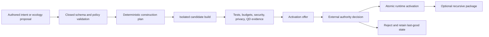

# RealmForge Genesis Ecology

RealmForge becomes the authoring and compilation environment for Genesis
Ecology. It describes what may be built, how it may be built, how it can be
tested and repaired, and how verified results become reusable parts. It does
not become the authority for live identity, permissions, ECS state, runtime
facts, or network access.

Read the [whole-stack Genesis Ecology architecture](../concepts/genesis-ecology.md)
and the [Engine and ECS plan](../engine/genesis-ecology-engine-plan.md) first.
The [Virtual Realm integration](virtual-realm/genesis-ecology-integration.md)
defines how admitted results become a truthful world.
The separate [RF-GE6 projection and reviewed-world-kit blueprint](rf-ge6-projection-world-kits.md)
freezes the next implementation gate without relabelling it as delivered.

## Compatibility boundary

M0 through M1C remain behaviorally stable. The existing contract inventory,
package shapes, compiler identities, entry points, and exact tests are not
expanded in place:

- the M0 suite fixes the ordered 109-contract inventory;
- the M1C suite fixes exactly 35 integrated cases;
- accepted private, public, and refinement package versions retain their exact
  audience boundaries;
- M1C compilers create data-only Storylet and station artifacts, not live
  runtime behavior.

(Sources: `tests/network/realm/virtual-realm-m0.test.js` lines 194-245 and
1019 onward; `MD/webgpu-os/virtual-realm/m1c-storylet-station-bake.md`.)

The version-1 non-authority-bearing integration ledger at
`tests/realmforge/fixtures/realmforge-m1c-rf-ge5-freeze-ledger-v1.json`
pins the existing RF-GE5 owner without replacing it or moving it into the
accepted M0-M1C catalog. The RF-GE5 fixture remains version 1 at canonical JSON
SHA-256
`184bc35cf8bd19d2a97ee403cfad6ae67e9d376c4523a098d0abfa5a357419f9`;
the normalized-LF historical 29-case suite is pinned at SHA-256
`e722450686fae9a009cac6dc861693f4b2b910edb853793d0bf13af46024c2ce`;
and the domain pack remains
`realmforge.genesis-ecology.evidence@5.0.0`. The combined ledger milestone
SHA-256 is
`328bd8322861ff3fa452726fb42e169d2630b5f814d3ee24e66a070ded04da7f`.
Its companion M1C fixture version 1 and normalized-LF historical suite are
pinned respectively at SHA-256
`d8b54fdac97a5f471142d5d0c4c72b138cbaca1ef2f47a00c20cf7ef4a4f6816`
and
`d6b63bc967474bcb55336950745e920e78c8afe65b8d5402c23247907a265132`.
The ledger fixes `authorityBearing: false` and `runtimeActivation: false`:
it freezes accepted evidence only, keeps Storylets inert, leaves M2 unstarted,
and advances no Genesis or base Virtual Realm runtime gate.

Genesis Ecology therefore receives a separate opt-in contract catalog, domain
pack, entry points, package generation, compiler identities, cache namespace,
and tests. It can be disabled or rolled back without rewriting an accepted M1
artifact.

### Current implementation audit

The current RealmForge source implements the accepted M0-M1C bake boundary:
private, public, and refinement products; reviewed SecureMesh station kits; and
data-only Storylet compilation. `createRealmForgeBakeEntry()` exposes those
paths, while `VIRTUAL_REALM_CONTRACT_DEFINITIONS` remains the frozen 109-record
catalog.

The additive RF-GE0 identity-family gate is now executable. The separate
`GenesisContractCatalogV1` freezes five strict, inert records:
`SoulSeedIdentityRootV1`, `EidosIdentityV1`,
`EidosContinuityReferenceV1`, `SoulSeedMintProposalV1`, and
`SoulSeedMintAuthorityReceiptV1`. The catalog marks this five-record schema
family complete while remaining `complete: false` for the wider future Genesis
catalog. Its dedicated registry cannot be initialized over the accepted
M0-M1C registry.

Scoped IDs reject URL, path, and capability-shaped values. Self digests use
exact SHA-256 content IDs. Independent browser and Python vectors bind every
canonical payload to one domain-separated preimage. Batch digest validation
rejects hostile or sparse envelopes before property access, limits aggregate
work, and hashes through at most eight concurrent lanes.

`validateGenesisIdentityGraphV1()` verifies the links representable by these
five records. It resolves mint proposals and receipts, binds receipt and root
digests, resolves one continuity reference per Eidos, rejects dangling or
cross-root predecessors, rejects cycles and excessive lineage depth, preserves
canonical error paths, and returns deterministic root partitions. Its exact
2,048-identity and 4,096-support maxima are both reachable in one valid graph;
plus-one cases fail closed. A four-workload benchmark corpus includes a
512-identity scale workload with 20 measured samples.

This verifier does not authenticate signature envelopes or prove mint
authority. `originLineageEventId` and `branchAuthorityReceiptId` remain typed
external references because their corresponding record families are not in
this five-record gate. The report returns them explicitly as
`unresolved-external` and rejects a Soul Seed mint receipt reused as Eidos
branch evidence. It never admits, persists, selects an active head, grants a
capability, or activates runtime state. (Sources:
`webgpu-os/apps/realmforge/virtual-realm/RealmForgeBakeEntry.js`;
`webgpu-os/apps/the-virtual-realm/contracts/VirtualRealmContractCatalog.js`;
`webgpu-os/apps/the-virtual-realm/genesis/contracts/GenesisContractCatalogV1.js`;
`webgpu-os/apps/the-virtual-realm/genesis/contracts/GenesisContractRegistryV1.js`;
`webgpu-os/apps/the-virtual-realm/genesis/contracts/GenesisIdentityGraphValidatorV1.js`;
`tests/realmforge/genesis-ecology-rf-ge0.test.js`;
`tests/realmforge/test_genesis_ecology_rf_ge0_vectors.py`;
`MD/webgpu-os/virtual-realm/realmforge-pipeline.md`.)

This page makes RealmForge's complete future responsibility explicit; it does
not relabel the remaining planned RF-GE work as implemented. The RF-GE0
identity-family schema gate is complete. The broader RF-GE0 schema inventory
remains open until every other frozen record family, term, limit, vector, and
benchmark required by that migration row exists and passes its own gate.

### RF-GE1 identity-authoring foundation

The bounded RF-GE1 foundation is now executable without advancing the open
semantic catalog. `realmforge.genesis-ecology@1.0.0` registers exactly the five
already-frozen RF-GE0 identity schemas and the existing identity-linkage
validation suite. The provider binds every registration to an exact trusted
implementation version and descriptor digest. It exposes the inert manifest,
locks, and dependency pins, but no implementation resolver, adapter, compiler,
installer, active head, or activation method.

Those descriptor hashes identify inert contract evidence, not executable
validator bytes. Any future activation layer must separately pin and admit the
trusted host implementation or source digest before it can resolve behavior;
that activation boundary is not part of this foundation.

One `GenesisAuthoredRegistryCoordinatorV1` prepares complete candidates
offside and publishes by a single expected-revision snapshot swap. Flat
domain-pack, registration, and dependency-index views all read that same
immutable snapshot. Coordinator state and view links are private, construction
is gated by a module-private token, and instances, constructors, and prototypes
are frozen against same-realm replacement. Exact re-publication is idempotent.
Within every populated coordinator, the same pack-or-registration coordinate
with different content fails permanently. JSON transport rejects duplicate
decoded keys; same-realm values reject accessors, sparse arrays, symbols,
inherited properties, functions, non-plain objects, cycles, malformed Unicode,
and over-limit content before hashing.

The sealed built-in provider also pins golden SHA-256 digests for its manifest,
complete authored publication, and all six implementation descriptors. A
source change under `1.0.0` therefore fails provider creation even against a
fresh coordinator; accepting changed evidence requires an explicit exact
version bump and newly reviewed golden evidence. The browser gate also pins all
six derived registration digests, the authored pack digest, and both the empty
and published registry roots. Independent Python vectors reproduce the empty
root and validation-registration digest without using the browser canonicalizer.

The authored dependency index pins exact registration coordinates and content
digests. Provider verification rejects any changed or extended pin record, and
each registration digest binds its sorted dependency coordinates before the
pack and root digests are derived. Its V1 whole-snapshot limits are:

| Boundary | Maximum |
| --- | ---: |
| Stored domain-pack versions | 64 |
| Pack versions in one publication | 8 |
| Registrations per pack version | 256 |
| Registrations in one publication | 512 |
| Stored registrations | 2,048 |
| Direct dependencies per registration | 32 |
| Dependency edges | 16,384 |
| Capability declarations per registration | 32 |
| Capability declarations | 16,384 |
| Dependency depth | 256 |
| Identifier UTF-8 bytes | 128 |
| Canonical publication bytes | 16,777,216 |
| Concurrent digest lanes | 8 |

The pack and publication counts are defensive structural ceilings for future
providers, not evidence that the wider RF-GE1 catalog exists. The sealed V1
provider currently admits one exact pack version, six registrations, and ten
dependency edges. The standalone graph gate reaches the larger node, edge, and
depth ceilings with synthetic hostile-boundary inputs.

The browser gate reaches the exact node, edge, and depth maxima independently,
rejects each plus-one case, exercises stale and foreign prepared candidates,
and measures a 512-node graph over 20 samples. Every commit receipt says
`publicationStatus: authored`, `activationStatus: not-requested`,
`authorityEvidenceStatus: not-evaluated`, `grantsAuthority: false`, and
`runtimeMutation: false`.

This is an RF-GE1 infrastructure slice, not complete RF-GE1. Its sealed
`realmforge.genesis-ecology@1.0.0` provider remains identity-only. The separate
RF-GE1A and RF-GE2 gates described in their dedicated sections do not mutate
that provider or create an authored
`GenesisPartRegistry`. The V1 provider itself still contains no Product Genome,
Factory Genome, constructive-plan, execution-receipt, or runtime behavior.
(Sources:
`webgpu-os/apps/realmforge/modeler/genesis/GenesisEcologyDomainPackV1.js`;
`webgpu-os/apps/realmforge/modeler/genesis/GenesisAuthoredRegistryV1.js`;
`tests/realmforge/genesis-ecology-rf-ge1.test.js`;
`tests/realmforge/test_genesis_ecology_rf_ge1_vectors.py`.)

### RF-GE1A Parts-family wire-contract freeze

RF-GE1A now freezes the first complete Parts-family wire boundary as four
strict, inert records in one separately owned `GenesisPartsContractCatalogV1`.
The order is exact: `GenesisInterfaceV1`, `GenesisConstraintV1`,
`GenesisPartV1`, then `GenesisAssemblyV1`. The catalog says
`scopeComplete: true` for this four-record family while retaining
`complete: false`, `authorityBearing: false`, and `runtimeActivation: false`
for Genesis Ecology as a whole. It never mutates the five-record identity
catalog or the sealed RF-GE1 provider.

| Record | Coordinate and self digest | Frozen responsibility |
| --- | --- | --- |
| `GenesisInterfaceV1` | `interfaceId`, `interfaceDigest` | Kind, direction, value type, unit, cardinality, connection bounds, reciprocal capabilities, compatibility classes, and provenance |
| `GenesisConstraintV1` | `constraintId`, `constraintDigest` | Typed subject Interfaces, minimum/maximum value, tolerance, severity, and provenance |
| `GenesisPartV1` | `partId`, `partDigest` | Named input, output, and socket ports; constraints; exact Part dependencies; budgets; lifecycle evidence; ten constructive verbs; variation, test, audience, projection, and provenance links |
| `GenesisAssemblyV1` | `assemblyId`, `assemblyDigest` | Member instances, member-local bindings, Assembly constraints, external ports, and provenance |

Every record logical ID uses a scoped, bounded token. Local member, port,
capability, compatibility, value-type, and unit IDs use the separate bounded
reference grammar. Every cross-record link uses an exact `sha256:256:` content
ID. A Part port is a closed
`{ portId, interfaceContentId }` value so one immutable Interface definition
can be instantiated under different local socket names without weakening
content identity. An Assembly member similarly separates `memberId` from the
immutable `partContentId`, allowing the same Part content to appear more than
once in a composition. Logical coordinates and self digests are outside their
record's canonical content payload; the digest binds the exact `format`,
`version`, and ordered canonical fields rather than a mutable registry address.

The exact RF-GE1A limit profile is:

| Boundary | Maximum |
| --- | ---: |
| ID token characters | 128 |
| Ports in each Part category | 128 |
| Constraints on one Part | 128 |
| Part dependencies on one Part | 256 |
| Capabilities in one declaration | 256 |
| Compatibility classes in one declaration | 128 |
| Variation points on one Part | 128 |
| Test-evidence content IDs on one Part | 256 |
| Provenance content IDs on one record | 256 |
| Projection bindings on one Part | 64 |
| Assembly members | 4,096 |
| Assembly bindings | 8,192 |
| Constraints on one Assembly | 1,024 |
| External ports on one Assembly | 1,024 |
| Interface records in one graph | 4,096 |
| Constraint records in one graph | 4,096 |
| Part records in one graph | 2,048 |
| Assembly records in one graph | 1,024 |
| Internal graph references | 65,536 |
| Part dependency depth | 256 |
| Canonical input bytes | 16,777,216 |
| Concurrent digest lanes | 8 |

`validateGenesisPartsGraphV1()` accepts exactly the four arrays
`interfaces`, `constraints`, `parts`, and `assemblies`. It preflights hostile
values and canonical byte limits, enforces strict logical-ID order, validates
through a dedicated registry, and verifies every record digest before it
resolves any graph link. Duplicate content records, dangling or wrong-kind
references, self-dependencies, dependency cycles, excessive depth, and
non-canonical sets fail closed.

Data, signal, and resource Interfaces occupy input or output ports and bind
output-to-input. Mechanical and spatial Interfaces occupy sockets and bind
socket-to-socket. Every binding must match kind, value type, and unit, satisfy
both endpoints' required capabilities, share a compatibility class, and obey
cardinality and connection bounds. A Constraint must match every subject
Interface's value type and unit and may be attached only where its subjects are
present. An external port must belong to its declared member, remain unbound
inside that Assembly, and retain future connection capacity. The validator
returns deterministic Part topological order plus an immutable report marked
`closed-parts-family`, `authorityEvidenceStatus: not-evaluated`, and
`runtimeActivation: false`.

The browser gate covers exact schemas and digests, hostile values, ordering,
type/category/direction rules, dependency closure, cycles, Assembly bindings,
capabilities, compatibility, external ports, exact graph count, reference,
depth, and byte ceilings with representative plus-one failures, a fixed
canonical vector, the static production closure, and a 512-Part workload. The
independent Python oracle reproduces the content
preimages and SHA-256 IDs without importing the browser implementation.

RF-GE1A intentionally publishes no domain-pack revision, registry mutation,
compiler, persistence path, active head, authority decision, Product Genome,
Factory Genome, or runtime behavior. That boundary remains unchanged. The
separate RF-GE2 gate owns Product and Factory Genomes plus
deterministic constructive plans without pulling factory execution or authority
into the Parts family. (Sources:
`webgpu-os/apps/the-virtual-realm/genesis/contracts/GenesisPartsContractCatalogV1.js`;
`webgpu-os/apps/the-virtual-realm/genesis/contracts/GenesisPartsGraphValidatorV1.js`;
`webgpu-os/apps/realmforge/modeler/genesis/index.js`;
`tests/realmforge/genesis-ecology-rf-ge1a.test.js`;
`tests/realmforge/test_genesis_ecology_rf_ge1a_vectors.py`.)

### RF-GE2 genomes and deterministic constructive plans

RF-GE2 is now implemented as a separate, inert authoring gate. The exact
`GenesisConstructiveContractCatalogV1` inventory is four records, in this
order: `ProductGenomeV1`, `FactoryGenomeV1`,
`GenomeRevisionReferenceV1`, and `GenesisExecutionPlanV1`. The catalog marks
only `rf-ge2-genomes-and-constructive-plan` as complete. It remains
`complete: false`, `authorityBearing: false`, `runtimeActivation: false`,
`containsExecutableCode: false`, and `registryPublication: false` for the
wider Genesis program.

| Record | Frozen responsibility |
| --- | --- |
| `ProductGenomeV1` | Root Assembly, bill of materials, interfaces, constraints, capabilities, invariants, viable topologies, resource ceiling, permitted operations, specialization and variation points, tests, repair/decomposition/recycling strategies, audience, projection bindings, and provenance |
| `FactoryGenomeV1` | Exact constructor and interpreter identities, stage DAG, one profile per admitted operation, stage and plan budgets, failure/compensation/rollback policy, admitted variation operators and mutation limits, recursive packaging, cache policy, and provenance |
| `GenomeRevisionReferenceV1` | Product or Factory logical identity, exact genome content, same-lineage predecessors, cross-lineage derivation sources, derivation kind, change evidence, and provenance |
| `GenesisExecutionPlanV1` | Selected revisions, closed intent, immutable dependency closure, deterministic Part order, forward/compensation/rollback steps and ready groups, evidence and output expectations, aggregate budget, determinism class, provenance, and self digest |

The operation matrix is one shared, immutable definition consumed by the
intent validator, compiler, contract schemas, and RF-GE2 trust pack. Assembly
and revision cells show source count to target count. Ranges are inclusive.

| Operation | Assemblies | Genome revisions | Required policies | Expected output |
| --- | --- | --- | --- | --- |
| `BUILD` | 0 to 1 | 0 to 1 | none | `assembly-candidate` |
| `BREAK` | 1 to 0 | 1 to 0 | ownership, reversibility | `recovered-part-manifest` |
| `REPAIR` | 1 to 1 | 1 to 1 | fault, regression-suite, repair-proof | `repaired-assembly-candidate` |
| `FUSE` | 2-64 to 1 | 2-64 to 1 | conflict-resolution | `assembly-candidate` |
| `SPLIT` | 1 to 2-64 | 1 to 2-64 | cut-set, ownership | `assembly-partition-candidates` |
| `SPECIALIZE` | 0 to 0 | 1 to 1 | niche-descriptor, regression-suite | `product-genome-candidate` |
| `GENERALIZE` | 0 to 0 | 1 to 1 | compatibility-matrix, regression-suite, resource-delta | `product-genome-candidate` |
| `RECOMBINE` | 0 to 0 | 2-64 to 1 | conflict-resolution, recombination-trace | `product-genome-candidate` |
| `RECYCLE` | 0-64 to 0 | 1-64 to 0 | reference-release, retention, teardown, zeroization | `recovered-part-manifest`, `recovered-resource-manifest` |
| `MUTATE` | 0 to 0 | 1 to 1 | compensation | `genome-revision-candidate` |

Every row also freezes required stage kinds and evidence kinds. Most rows
require construct, inspect, and test stages. `BREAK` additionally requires
salvage. `RECYCLE` requires inspect, salvage, test, and zeroize. The compiler
also makes `RECYCLE` choose source Assemblies or subject Parts, never both.

`validateGenesisGenomeGraphV1()` validates Product and Factory records and
revision lineage before compilation. `compileGenesisFactoryPlanV1()` then
validates both the Parts graph and genome graph, resolves the selected Product
and Factory revisions, enforces the matrix, operation permissions, capabilities,
budgets, mutation limits, lineage and trace rules, and derives one canonical
closure, Part order, stage plan, ready-group order, and SHA-256 plan digest.
`verifyGenesisFactoryPlanV1()` first validates the received plan digest, then
recompiles from the same inputs and requires canonical byte equality.

Compilation is evidence, not execution. Every emitted plan says
`containsExecutableCode: false`, `authorityBearing: false`,
`grantsAuthority: false`, `runtimeActivation: false`, and
`executionStatus: not-executed`. Compile and verification reports also retain
`authorityEvidenceStatus: not-evaluated`, `registryPublication: false`, and
`runtimeActivation: false`. Neither path runs a stage, changes an active head,
persists a result, publishes a registry, or grants authority.

The isolated `realmforge.genesis-ecology.constructive@2.0.0` domain pack and
`modeler/genesis/rf-ge2/index.js` entry bind this gate without expanding the
frozen RF-GE1/RF-GE1A barrel. The pack pins the four Parts schemas, the four
RF-GE2 schemas, validators, compiler, and exact reference constructor,
interpreter, stage, and variation-operator identities. Its provider exposes
only frozen manifests, authored publication evidence, descriptor locks,
dependency pins, and verification. Its binding verifiers require self-digest-
bound Factory Genomes and Plans, then require the exact trusted constructor,
interpreter, compiler, variation-operator, and ten stage coordinates. It
cannot resolve, install, or invoke those host implementations; execute a
Factory; persist or publish a plan; publish or mutate an authored or persistent
registry; or activate runtime
state. (Sources:
`webgpu-os/apps/the-virtual-realm/genesis/contracts/GenesisConstructiveContractCatalogV1.js`;
`webgpu-os/apps/the-virtual-realm/genesis/contracts/GenesisGenomeContractPrimitivesV1.js`;
`webgpu-os/apps/the-virtual-realm/genesis/contracts/GenesisGenomeGraphValidatorV1.js`;
`webgpu-os/apps/realmforge/modeler/genesis/GenesisFactoryPlanCompilerV1.js`;
`webgpu-os/apps/realmforge/modeler/genesis/GenesisEcologyConstructiveDomainPackV2.js`;
`webgpu-os/apps/realmforge/modeler/genesis/rf-ge2/index.js`;
`tests/realmforge/genesis-ecology-rf-ge2.test.js`;
`tests/realmforge/genesis-ecology-rf-ge2-domain-pack.test.js`;
`tests/realmforge/test_genesis_ecology_rf_ge2_vectors.py`.)

### RF-GE3 incremental caching and recursive package candidates

RF-GE3 is implemented as another isolated, inert RealmForge authoring gate.
`GenesisIncrementalPlanCacheV1` retains process-local, frozen RF-GE2 plan
results together with the exact canonical source, normalized context identity,
binding receipts, and private dependency snapshot needed to prove a safe hit.
It owns no storage or runtime port. Each namespace binds the exact
`audienceClass`, `disclosureClass`, and `audienceScopeContentId`; no entry or
dependency fragment crosses that namespace boundary. The namespace audience
must exactly match the selected Product Genome audience.

The complete cache key binds the canonical compilation input and source-root
digest; schema, migration, policy, limit-profile, adapter, compiler, cache, and
constructive-domain-pack versions; trusted pack manifest and publication
digests; target-capability and numeric profiles; audience, disclosure, and
audience scope; and sorted deterministic feature flags. An exact hit additionally
requires byte-identical canonical source and the same complete context
fingerprint. Only that hit class returns the original frozen plan, deterministic
verification, and Factory and Plan binding receipts with zero compiler and
verification passes.

Every cold or changed-source miss still runs the complete RF-GE2 compiler and
the deterministic verifier, including its compiler rerun. The incremental path
may reuse only immutable dependency-index fragment objects whose complete keys
remain valid. It does not reuse semantic plan fragments, skip validation, or
claim partial-compilation acceleration. Cache timings remain non-digest-bearing
evidence. The cache stores a result only when the selected Factory and every
Plan step declare `content-addressed-local`; a cache-forbidden result still
receives the full compile and verification path but allocates no namespace.
Rejected requests likewise cannot consume the 64-namespace capacity; a new
namespace is committed only after successful verification of a cacheable
result.

The source snapshot records forward dependencies, reverse dependents, content
IDs, and direct dependency-fragment digests over each content ID and its
immediate dependencies. A changed slot invalidates the reverse closure in both
the prior and current snapshots. Explicit content-ID invalidation aggregates
reverse adjacency from cached fragment edges, retained exact entries, and
latest lineage snapshots, so bounded eviction of both an exact entry and its
lineage snapshot cannot strand remaining transitive fragments. When FIFO
fragment pressure removes an intermediate edge, the cache also prunes every
retained fragment that depends on it directly or transitively; the bounded map
therefore remains dependency-closed. Explicit invalidation removes
affected plan entries, fragment objects, and lineage snapshots from only the
matching audience namespace. Namespace receipts digest exactly the same
audience, disclosure, and audience-scope identity used by the mutable cache
boundary. The exact V1 bounds are:

| Boundary | Maximum |
| --- | ---: |
| Canonical input bytes | 16,777,216 |
| Deterministic feature flags | 64 |
| Content IDs in one invalidation request | 4,096 |
| Process-local audience namespaces | 64 |
| Verified plans in one namespace | 128 |
| Dependency-index fragments in one namespace | 65,536 |

`prepareGenesisRecursivePackageCandidateV1()` consumes that cache boundary. It
accepts only an exact `GenesisIncrementalPlanCacheV1` instance, invokes the
captured base compile method rather than an overrideable instance method, and
independently verifies the returned Plan against the exact compilation input.
It then revalidates the Parts and genome graphs, trusted Factory and Plan
bindings, the inert Plan, the selected Product-root Assembly, the Factory's
`eligible-after-external-verification` policy, and exactly one package stage
that requires external-verification evidence. It derives the transitive Part
closure and external Interface surface, then emits an ordinary digest-valid
`GenesisPartV1` composite candidate plus a deterministic internal package
descriptor. Because the Part content digest intentionally excludes its logical
`partId`, the package descriptor binds both `candidatePartId` and
`candidatePartContentId`; changing either changes the package candidate digest.
Only Plans expecting `assembly-candidate` or
`repaired-assembly-candidate` are packageable in this gate. The requested Part
logical identity must not already exist in the source graph, and the prepared
Part content digest must not duplicate content already present under another
logical identity.
`verifyGenesisRecursivePackageCandidateV1()` reprepares from the exact inputs
and requires canonical equality.

The candidate explicitly says its required evidence is not collected, it is
awaiting external execution and verification, and it is not eligible for
publication. RF-GE3 does not execute a stage, collect runtime evidence, persist
content, publish or mutate a registry, install a Part, select an active head,
grant authority, or activate runtime state. The internal package descriptor is
not a new published wire-contract family. (Sources:
`webgpu-os/apps/realmforge/modeler/genesis/GenesisIncrementalPlanCacheV1.js`;
`webgpu-os/apps/realmforge/modeler/genesis/GenesisRecursivePackageCompilerV1.js`;
`webgpu-os/apps/realmforge/modeler/genesis/rf-ge3/index.js`.)

### RF-GE4 authored programs and deterministic interpreter Plans

RF-GE4 is implemented as a separate additive, inert authoring gate. Its
`GenesisEcologyAuthoredProgramsV1` family freezes exactly ten program kinds:
causal-closure profile, cognitive-model schema, development stage,
developmental grammar, distributed morphology, embodiment-capability profile,
homeostatic profile, inheritance policy, reaction rule, and regulatory
network. The accepted golden corpus contains twelve records because a program
kind may have more than one typed instance; the kind catalog itself remains
ten. Every record has a canonical content-bound digest, a closed typed
dependency set, bounded graph depth and fan-out, and explicit inert fields that
remain `authorityBearing: false`, `executionStatus: not-executed`, and
`authorityEvidenceStatus: not-evaluated`.

`GenesisEcologyInterpreterCompilerV1` independently verifies the exact RF-GE2
constructive Plan and one closed audience context, then compiles eight
deterministic fragments in fixed order: development, regulation, homeostasis,
causal closure, cognition, embodiment, inheritance, and reaction. The aggregate
Plan binds all eight fragment digests, the complete authored-program closure,
the constructive Plan, and the exact audience/profile/scope tuple. An
independent verification pass recompiles from the same immutable inputs and
requires byte-identical canonical output. Multirate clock bridges, belief/fact/
prediction/counterfactual separation, host-loss responses, seven inheritance
channels, compensation closure, and every declared limit are structural
authoring evidence rather than live simulation state.

The V4 provider seals exactly eighteen implementation descriptors—ten schema
descriptors plus eight compiler-fragment descriptors—behind exact digest locks
and aggregate trust pins. It exposes validation, compilation, and equality
verification only. It has no interpreter executor, resolver, cache authority,
storage, registry mutation, publication, capability, identity minting, network,
ECS, Engine, or runtime-activation port. The direct browser ledger contains 25
RF-GE4 cases and the independent Python oracle contains five vector groups;
their accepted result does not imply that any authored program ran. (Sources:
`webgpu-os/apps/realmforge/modeler/genesis/GenesisEcologyAuthoredProgramsV1.js`;
`webgpu-os/apps/realmforge/modeler/genesis/GenesisEcologyInterpreterCompilerV1.js`;
`webgpu-os/apps/realmforge/modeler/genesis/GenesisEcologyInterpreterDomainPackV4.js`;
`webgpu-os/apps/realmforge/modeler/genesis/rf-ge4/index.js`;
`tests/realmforge/genesis-ecology-rf-ge4.test.js`;
`tests/realmforge/test_genesis_ecology_rf_ge4_vectors.py`.)

### RF-GE5 ecology-evidence programs and trust pack

RF-GE5 is implemented as the next separate inert gate. It freezes eleven
evidence-program kinds: cultural topology, environmental memory, evolution
regime, lifecycle, lineage, organismality, program ecology, quality diversity,
recognition, role ecology, and variation. The program graph distinguishes
lineage from organismality, culture from environmental inheritance, and
multi-axis quality diversity from a single universal fitness score. It binds
recognition classifications and responses, role niches, cultural transmission,
legal Product/Factory Genome variation targets, lifecycle and rollback policy,
and organization-first identity-candidate evidence without minting an identity
or changing a genome.

`GenesisEcologyEvidenceCompilerV1` first independently verifies the complete
RF-GE4 interpreter Plan and exact audience context. It then compiles ten fixed
fragments—lineage, program ecology, recognition, roles, culture, quality
diversity, meta-evolution, environmental memory, lifecycle, and
organismality—and binds every fragment to the same RF-GE4 source closure. The
verifier recompiles from the exact immutable input and requires byte equality.
Irrelevant but otherwise valid RF-GE4 records cannot be laundered into the
reached dependency set, and public compilation rejects operator-private
evidence rather than redacting a private superset.

The V5 provider seals exactly twenty-one descriptors—eleven evidence schemas
plus ten fragment compilers—behind exact implementation locks, four aggregate
pins, and the accepted RF-GE4 trust binding. Its output remains
`not-executed`, `not-evaluated`, nonpersistent, unpublished,
`authorityBearing: false`, `mintsIdentity: false`, `selfModification: false`,
and `runtimeActivation: false`. The direct browser ledger contains 29 RF-GE5
cases and the independent Python oracle contains six vector groups. The
additive version-1 freeze ledger binds those 29 cases beside the unchanged 35
M1C cases; it is evidence of compatibility and inertness, not runtime
admission. (Sources:
`webgpu-os/apps/realmforge/modeler/genesis/GenesisEcologyEvidenceProgramsV1.js`;
`webgpu-os/apps/realmforge/modeler/genesis/GenesisEcologyEvidenceCompilerV1.js`;
`webgpu-os/apps/realmforge/modeler/genesis/GenesisEcologyEvidenceDomainPackV5.js`;
`webgpu-os/apps/realmforge/modeler/genesis/rf-ge5/index.js`;
`tests/realmforge/genesis-ecology-rf-ge5.test.js`;
`tests/realmforge/test_genesis_ecology_rf_ge5_vectors.py`;
`tests/realmforge/fixtures/realmforge-m1c-rf-ge5-freeze-ledger-v1.json`.)

### RF-GE6 projection grammar and reviewed world kits

RF-GE6 is planned but not implemented. Its complete executable architecture is
the [RF-GE6 Projection Grammar and Reviewed World Kits](rf-ge6-projection-world-kits.md).
That gate creates a separate, semver-immutable 16-record catalog and pins the
accepted static Virtual Realm contracts rather than duplicating or
expanding the accepted 109-record Virtual Realm catalog or any RF-GE0-RF-GE5
catalog. The new inventory covers Genesis projection rules and grammar, kits
and review receipts, district assembly, unsigned spatial-layout agreement,
coordinate-retention and relocation evidence, accessibility and disclosure
closure, explicit inert public-noninterference and refinement-isolation
evidence, the extension manifest, and deterministic compile/verify receipts.
Accepted contracts continue to own source projection, spatial policy, static
projection bindings, anchors and topology, collision, navigation, LOD, safe
text and audio, owner-private Operations, dependency closure, and the signed
publication receipts. RF-GE6 validates an accepted signed base-layout receipt
read-only but does not construct a new `RealmSpatialLayoutReceiptContract`,
`RealmPublicNoninterferenceReceiptContract`, or
`RealmRefinementScopeReceiptContract`; that authority-bearing handoff is
reserved for RF-GE8.

The grammar contains exactly 22 static rules and derives exactly 22 projection-
binding candidates per audience compilation against the unchanged accepted
contract definition. Four rules cover
accepted identity/continuity, Parts/Assembly, constructive-Plan, and recursive-
package-candidate evidence. Eight rules correspond one-for-one with the RF-GE4
interpreter domains. Ten correspond one-for-one with the RF-GE5 evidence
domains. Every rule forbids live values. It may project only authored,
compiled-static, `not-executed`, `not-evaluated`, or explicitly unavailable
presentation claims.

The sealed reviewed-kit catalog contains exactly six records and six matching
review receipts, in this order:

1. Continuity Core.
2. Foundry District.
3. Maintenance Works.
4. Possibility Archive.
5. Role Commons.
6. Culture Archive.

Each kit is plain immutable data with typed anchors, routes, facilities,
presentation slots, and static-product profiles. A kit may reserve a sealed
Code Matter or Matrix-glyph surface, but RF-GE6 cannot place exact source bytes
there. It contains no executable expression, JavaScript, WGSL, WASM, arbitrary
shader, URL, path, live ID, capability, device handle, or mutable runtime
object.

Compilation handles one exact audience context per invocation:
`owner-private/local-private`, `public-explicit/public-explicit`, or
`capability-refined/capability-refined`. The public job has no private-source
port. The refinement job consumes only the already accepted access-refinement
base-bake reference and exact refined source projection, not an owner-private
candidate or a public compiler result. The later isolation verifier receives
the independently verified public result.
Only the owner-private unsigned layout evidence receives local Operations
evidence rows; connected Cityforms and remote resources remain structurally
absent. RF-GE6 does not instantiate the accepted
`LocalOperationsLookupResourceContract`, whose extension-layout receipt binding
and deterministic materialization remain RF-GE8 work.

The spatial compiler uses integer-quantized Cityform-local coordinates. It
first emits an internal placement plan with no forward receipt reference,
compiles all static products from that plan, compiles unsigned
`GenesisSpatialLayoutEvidenceV1`, and only then creates relocation receipts,
retention decisions, the final placement index, accessibility closure, and
district assembly. It retains each compatible prior authored placement
byte-for-byte,
emits one decision for every matched prior coordinate, and emits one
reason-bound relocation receipt for every move. The dependency closure follows
those products; the 72-field manifest follows the closure; the manifest-bound
disclosure receipt follows the manifest and remains outside the manifest graph,
so no product/layout/placement or manifest/disclosure cycle exists. Public HLOD,
bounds, coordinates, labels, and resource counts derive only from public source.

`compileGenesisProjectionWorldV1()` is a planned pure compiler. The matching
verifier independently reruns the complete compile from exact immutable input
and requires canonical byte equality. Neither receives a scanner, filesystem,
network, renderer, WebGPU, ECS, clock, random source, storage, registry,
publisher, capability, or active-root port. The V6 provider exposes only
frozen descriptors, digest locks, catalogs, and verification methods.

Acceptance requires the planned 48-case browser gate, 22-group independent
Python oracle, exact static import closure, normal WebGPU OS bundle, every
RF-GE0-RF-GE5 and M0-M1C regression, and an additive version-2 freeze ledger.
The existing version-1 ledger remains unchanged. RF-GE6 acceptance would still
mean `authorityBearing: false`, `publicationEligibility: false`, and
`runtimeActivation: false`; RF-GE7, RF-GE8, and all runtime work remain separate
review gates.

## Existing foundations to reuse

| Foundation | Current property | Genesis use |
| --- | --- | --- |
| `ToolRecipeRegistry` | Versioned, non-executable guidance; atomic batch publication; tool-interface hashes | Keep Navi guidance separate from formal factory execution |
| `RealmForgeRecipes` | Inspect, check, preview, apply, repair, publish, export, parts, sockets, assembly, and regeneration flows | Outer human workflow for constructive operations |
| Blueprint schemas and validators | Authored legality without claiming live success | Validate product and factory descriptions |
| `AssetDependencyGraph` | Cycle and dangling-reference detection plus deterministic build order | Part closure, invalidation, and recursive packaging |
| `BlueprintRegistries` | Related resources share one version store | Atomic publication of flat Genesis peers |
| SystemGraph | Typed ports, SI units, phases, rate bridges, deterministic compilation | Regulatory, developmental, reaction, and factory plan compilation |
| Domain-pack manifest | Trusted implementation identifiers without dynamic source loading | Register a `genesis-ecology` domain pack |
| Runtime plan | Immutable instance, interface, solver, procedure, BOM, lifecycle, and validation plan | Carry Genesis sidecars and compiled construction plans |
| Interface network | Typed links, cardinality, compatibility, and canonical coordinates | Part sockets, resource flows, signals, and reaction channels |
| Document store | Revision guard, complete validation, history envelope, atomic swap | Transaction boundary for authored genome changes |
| Revision repository | Immutable published revisions and evidence | Preserve genomes, factories, and assemblies by content identity |
| Realm bake pipeline | Independent private, public, and refinement jobs | Produce audience-safe ecology appearances without redaction |

(Sources: `webgpu-os/apps/realmforge/recipes/ToolRecipeRegistry.js`;
`webgpu-os/apps/realmforge/recipes/RealmForgeRecipes.js`;
`webgpu-os/apps/realmforge/modeler/runtime-plan/RealmForgeRecipeRuntimePlan.js`;
`webgpu-os/apps/realmforge/modeler/runtime-plan/RealmForgeInterfaceNetwork.js`;
`webgpu-os/apps/realmforge/document/store/RealmForgeDocumentStore.js`.)

The existing growth domain is a useful clean pattern for authoring a bounded
tree program, preparing candidate state offside, validating it, and swapping
only an accepted result. It remains a tree-growth domain and is not renamed or
overloaded as the generic Genesis substrate. (Sources:
`webgpu-os/apps/realmforge/modeler/growth/RealmForgeGrowthContracts.js`;
`webgpu-os/apps/realmforge/modeler/growth/RealmForgeGrowthDocumentProjection.js`;
`webgpu-os/apps/realmforge/modeler/growth/RealmForgeGrowthRuntimeProjection.js`.)

## Authored knowledge versus runtime truth

| RealmForge authors | Runtime owner records |
| --- | --- |
| Developmental grammar and permitted modules | Minted Soul Seed identity root |
| Regulatory topology, signals, and clock relationships | Active genome revision and current expression state |
| Homeostatic target bands, invariants, and recovery policy | Current sensed variables and recovery events |
| Cognitive-model schema, observation vocabulary, prediction and uncertainty rules | Current beliefs, prediction errors, counterfactuals, and learner updates |
| Endogenous-goal and curiosity policy | Current information-gain or homeostatic goal proposals and their outcomes |
| Reaction types, resources, compatibility, and rates | Actual reaction occurrences, flux, and failures |
| Program-ecology relationship vocabulary and recognition policy | Current cooperation, competition, symbiosis, damage, quarantine, rejection, and release evidence |
| Role mechanisms, niche conditions, and evidence requirements | Role recognition and release receipts |
| Cultural-space schema and transmission policy | Belief heads, transmissions, mutation, confidence, adoption |
| Inheritance channels and niche-construction grammar | Actual inheritance events, environmental memory, and admitted world changes |
| Product genome | Active product instances and their condition |
| Factory genome | Active factory head and production history |
| Embodiment capability profile, host topology, and metamorphosis rules | Current admitted body/host set, migration, loss, replacement, and phase transition |
| Parts, interfaces, constraints, failure, and repair options | Breakage, repair, recycling, and lineage events |
| Dormancy, pruning, apoptosis, reactivation, and retention policy | Actual dormancy, archive, extinction, pruning, recycling, deletion, or reactivation state |
| Organismality assessment method | Assessment evidence and separately authorized mint decisions |
| Collective-integration and organization-first mint proposal shape | Current collective evidence and separately authorized higher-order identity decision |
| Storylet role algebra and safe proposal schemas | Current facts, decisions, episodes, actions, and Chronicle events |
| Geometry, anchors, LOD, materials, and audience shells | Live files, processes, permissions, source, traffic, and authority |

A proposal schema for Soul Seed minting may be authored. An instantiated Soul Seed is
immutable runtime evidence. A factory genome may be designed in RealmForge, but
its active revision and production history remain runtime facts.

## Domain-pack expansion

The bounded identity and constructive domain packs now freeze their accepted
RF-GE1 and RF-GE2 scopes. The separate RF-GE3 entry adds process-local cache
evidence and inert package-candidate preparation without changing those packs.
The wider `genesis-ecology` catalog remains planned and adds semver-immutable
definitions for:

- resource-flow nodes beyond the implemented Interface, Constraint, Part, and
  Assembly wire family;
- developmental stages and explicit logical-clock boundaries;
- regulatory activation, suppression, delay, decay, and rate bridges;
- homeostatic sensing, target-band comparison, recovery, and fatal boundaries;
- cognitive world models, observations, predictions, uncertainty,
  counterfactuals, curiosity, and endogenous-goal proposals;
- bounded reaction rules, catalysts, resources, and products;
- program-ecology relations and immune-style recognition/response policies;
- later Product and Factory Genome extensions beyond the implemented V1 roots;
- embodiment capabilities, distributed host topology, metamorphosis, repair,
  pruning, and apoptosis rules;
- genetic, epigenetic, developmental, behavioral, cultural, computational, and
  environmental inheritance channels;
- environmental-memory and niche-construction proposals;
- role evidence, niche descriptors, and cultural transmission descriptions;
- explicit social-topology inputs for trust, kinship, trade, geography,
  language, infrastructure, and transmission noise;
- QD descriptor extraction and evaluation requests;
- variation programs and evolution-regime descriptions for bounded
  meta-evolution;
- execution receipts and runtime admission for constructive operations beyond
  the implemented inert plans and expected-evidence matrix.

`implementationId` remains a key into a trusted host registry. It is never a
path, URL, function body, dynamic import, or authority handle. If Genesis needs
new compiler phases, RealmForge introduces SystemGraph V2 instead of changing
the closed V1 phase enumeration. Existing phase and graph-size limits remain
unchanged for V1. (Sources:
`webgpu-os/apps/realmforge/modeler/system-graph/RealmForgeSystemGraphConstants.js`;
`webgpu-os/apps/realmforge/modeler/runtime-plan/RealmForgeDomainPackManifest.js`;
`webgpu-os/apps/realmforge/modeler/genesis/GenesisEcologyConstructiveDomainPackV2.js`.)

## Product genome and factory genome

The two genomes are distinct:

### Product genome

The product genome defines:

- required and optional parts;
- exposed interfaces and compatibility rules;
- topology and assembly constraints;
- functional invariants and tests;
- developmental stages, differentiation, metamorphosis, self-repair, and
  viable-topology constraints;
- body/host capabilities and permitted distributed morphology;
- resource and performance budgets;
- supported specialization points;
- permitted repair, decomposition, and recycling behavior;
- public, private, and refinement presentation bindings.

### Factory genome

The factory genome defines:

- constructor and interpreter identities;
- acquisition and preparation of admitted inputs;
- build order and parallel-ready groups;
- inspection, test, compensation, and rollback stages;
- repair and salvage strategies;
- recursive packaging policy;
- mutation operators and their limits;
- learning, development, evolution, inheritance, and variation-regime clock
  policies without embedding active learner state;
- recognition, quarantine-request, pruning, salvage, and zeroization policy;
- cache and evidence requirements;
- factory self-maintenance rules that remain outside security authority.

This separation allows a factory to improve its build strategy without silently
changing product identity, and allows a product to evolve without rewriting the
trusted constructor.

## Research-complete RealmForge coverage

The Software Foundry is the constructive metabolism of Genesis Ecology. It
turns immutable modular parts and two distinct genomes into tested products,
repairs and decomposes damaged products, and packages accepted assemblies as
new parts. RealmForge must author or compile every adopted upgrade without
absorbing the runtime authority that owns live state.

| Upgrade family | RealmForge authoring/compiler responsibility | Runtime authority that remains external |
| --- | --- | --- |
| Soul Seed and Eidos continuity | Author immutable identity-root and continuity-reference schemas, seed-first and organization-first mint proposal forms, lineage views, and component-replacement invariants | Mint receipt, active Eidos head, ownership, and capability domain |
| Developmental grammar and computational morphogenesis | Author local graph-growth, reuse, differentiation, developmental-stage, metamorphosis, viable-topology, repair, and pruning rules; compile bounded deterministic stage plans | Current stage, active phenotype, structural barrier, and rollback |
| Regulation, epigenetics, and signal fabric | Author typed signals, activation/suppression, delay, decay, rate bridges, mark scope, strength, age, and inheritance policy | Current signal field, epigenome head, expression state, and controller results |
| Homeostasis, autopoiesis, and causal closure | Author controlled variables, viable bands, recovery options, boundary/self-maintenance evidence, and causal-closure assessment methods | Current measurements, fault events, resource allocation, recovery, and assessment receipts |
| Cognitive world model and endogenous goals | Author observation classes, belief/prediction schemas, uncertainty and counterfactual rules, prediction-error reducers, curiosity and information-gain proposal graphs | Current beliefs, learning batches, selected goals, actions, and outcomes |
| Learning, development, evolution, and meta-evolution | Author separate clocks, state schemas, learning/development/variation rules, and bounded variation-program or evolution-regime candidates | Learner state, evolution epochs, evaluator results, promotion, and activation |
| Embodiment and distributed organisms | Author body/host affordances, sensor/compute/storage/energy/network budgets, distribution constraints, migration and host-loss recovery plans | Current host set, device/process authority, resource grants, and live location |
| Multiple inheritance and environmental memory | Author seven channel policies, attribution, decay, compatibility, external-memory bindings, and niche-construction topology intents | Actual inheritance events, admitted roads/buildings/books/repositories, and world revision |
| Reaction and program ecology | Author indexed reaction rules and cooperation, competition, mutualism, commensalism, parasitism, predation, immune, and resource-exchange relation schemas | Actual encounters, resource flux, damage, quarantine, rejection, repair, and release |
| Role proliferation and major transitions | Author role-evidence mechanisms, new-vocabulary proposals, relationship topology, collective-integration criteria, and higher-order-organism proposal forms | Role recognition receipt, collective state, and any higher-order Soul Seed mint |
| Culture and social topology | Author belief-space schemas and noisy transmission across explicit trust, kinship, trade, geography, language, infrastructure, and teaching channels | Current attributed beliefs, adoption, dissent, mutation, and retention |
| Quality diversity, niches, and evolvability | Author descriptor axes, normalization, archive policy, evolvability evidence, specialization points, and deterministic parent-selection requests | Evaluation evidence, bounded archive head, and activation policy |
| Dormancy and temporal ecology | Author active/dormant/archive/extinction/known-extinct/forgotten/reactivation transitions, retention, reconstruction, and evidence policy | Current lifecycle state, storage retention, zeroization, and reactivation receipt |
| Storylet Algebra | Author role/relationship/reaction/development/lifecycle composition and specialization; lower it to accepted data-only Storylets | Current facts, decisions, episodes, action authority, and Chronicle head |
| Constructive metabolism and recursive individuality | Author Product Genomes, Factory Genomes, typed parts, all ten constructive verbs, salvage, module speciation, symbiotic packaging, and recursive external contracts | Execution resources, admission, commit, rollback, publication, and package installation |

RealmForge inspectors and previews label authored, simulated, inferred,
proposed, admitted, active, historical, stale, unavailable, and undisclosed state
separately. Preview geometry has no collision, navigation, capability, identity,
or public-presence authority.

## Part anatomy

Every `GenesisPartV1` is an immutable content-addressed description containing:

- stable logical identity, version, canonical digest, and provenance;
- typed inputs, outputs, sockets, requirements, and provided capabilities;
- resource, memory, compute, storage, bandwidth, and time budgets;
- constraints, units, tolerances, and compatibility declarations;
- initialization, validation, health, failure, repair, and disposal semantics;
- allowed constructive operations and variation points;
- test and evidence references;
- audience classification and projection binding;
- dependencies by content ID rather than nested mutable objects.

Parts form a graph through IDs and typed interfaces. A part never embeds another
part as an authoritative mutable child.

## Recursive packaging

RF-GE3 stops at an inert package candidate. It resolves the source closure,
derives the external Interface surface, binds an ordinary `GenesisPartV1`
candidate and internal package descriptor, and records the evidence that an
external executor and verifier must still produce. The candidate does not prove
that the described Assembly was built or tested.

The complete future packaging lifecycle remains:

1. Resolve the complete dependency closure.
2. Record canonical product and factory genomes.
3. Compile and verify the execution plan.
4. Execute in isolation through authorized runtime ports.
5. Collect build, test, resource, privacy, and rollback evidence.
6. Derive the new external interface surface.
7. Publish the assembly, closure, and evidence immutably.
8. Register the resulting content ID as an eligible part in a new registry
   revision.

The package does not erase its internal provenance. Consumers can operate at
the packaged interface while audit and repair tools can resolve the underlying
closure when authorized.

## Constructive operation lifecycle

All constructive metabolism verbs share one lifecycle:

`ToolRecipe` may guide a person or Navi through inspection and preview. Formal
execution uses a versioned `ConstructiveMetabolismProposalV1` and a compiled
plan. A recipe remains `grantsAuthority: false`; the executor never infers
permission from recipe presence. (Source:
`webgpu-os/apps/realmforge/recipes/ToolRecipeRegistry.js`.)

## Safe variation and repair

A variation operator is a deterministic transform over descriptions. It names:

- the operator implementation and version;
- exact parent digests;
- explicit seed and logical epoch;
- eligible paths or node kinds;
- maximum edits, graph growth, fan-out, and resource increase;
- preserved invariants;
- expected evaluation suite;
- compensation and discard behavior.

Variation never edits a published revision or active assembly in place. The
document store applies authored changes with its normal revision guard and
complete validation. Published candidates become new immutable revisions.
Activation is a separate runtime decision. (Sources:
`webgpu-os/apps/realmforge/document/store/RealmForgeDocumentStore.js`;
`webgpu-os/apps/realmforge/document/repository/RealmForgeRevisionRepository.js`.)

Repair follows the same rule. A fault is an observation. A repair plan is a
proposal. A repair receipt records only what an authorized executor actually
completed.

Pruning and apoptosis use the same lifecycle. RealmForge can prove that a node,
module, role, relationship, or Storylet branch is eligible for dormancy,
decomposition, or removal under a declared cost, usage, redundancy,
contribution, and age policy. It cannot delete active state or retained
evidence. Immune-style recognition can compile tolerate, test, quarantine,
reject, repair, and release proposals, but the kernel and storage services own
those effects.

## Cognition, inheritance, and embodiment products

RealmForge compiles cognitive descriptions into deterministic observation,
belief, prediction, uncertainty, counterfactual, prediction-error, curiosity,
and endogenous-goal plan fragments. The compiler preserves claim axes so a
belief cannot be projected as an observation and a proposed goal cannot be
projected as a completed action.

Inheritance compilation keeps genetic, epigenetic, developmental, behavioral,
cultural, computational, and environmental channels distinct. Environmental
memory references an admitted external artifact such as a road, building, book,
repository, institution, or network route. A niche-construction result becomes
stable form only through `GenesisTopologyIntentV1`, external admission, a new
isolated bake, and atomic activation.

Embodiment products bind one Eidos continuity reference to one or more authored
body/host capability profiles. They describe available sensors, compute,
storage, energy, movement, communication, distribution, migration, repair, and
metamorphosis constraints. They never contain live device handles, process IDs,
network authority, or capability tokens.

## Compiler outputs

One authored Genesis revision compiles into three independent product classes:

1. **Interpreter products**: deterministic Engine plans for development,
   regulation, cognition, inheritance, embodiment, reactions, recognition,
   construction, and evaluation.
2. **Projection products**: audience-specific anchors, visual grammar, static
   resources, and disclosure-safe HLOD for The Virtual Realm.
3. **Evidence products**: validation, canonicalization, reproducibility,
   dependency, resource, test, and privacy receipts.

Each product has its own digest and dependency closure. Runtime plans refer to
immutable content and trusted implementation IDs; they do not contain callable
functions or live runtime objects.

## Recipe acceleration

The bounded RF-GE3 gate implements the constructive-plan subset before the
wider generic Engine recipe-kernel extraction. It canonicalizes one exact
source, records process-local dependency metadata, isolates complete cache keys
by audience scope and disclosure, reuses a fully verified Plan only on an exact
hit, and emits cache and invalidation evidence. Every non-exact miss still uses
the full RF-GE2 compiler and verifier.

The wider architecture still adds domain caches for:

- per-resource canonical digest cache;
- forward and reverse dependency indexes;
- per-node and per-subgraph plan fragments;
- interface-compatibility results;
- route results keyed by endpoints, obstacle digest, routing policy, and
  clearance profile;
- HLOD and payload digests independent of topology;
- separate Storylet definition, candidate-index, catalog, and closure caches;
- separate private, public, and refinement namespaces;
- verified compiled artifacts keyed by source digest, compiler version, policy
  version, domain-pack versions, numeric profile, and target capabilities.

The current SystemGraph compiler deliberately performs a duplicate deterministic
compile as evidence. That proof remains available for certification and cache
misses. RF-GE3 skips compile and deterministic recompile only for an exact
verified Plan hit. A changed-source miss may reuse immutable dependency-index
objects, but it still recompiles and reverifies the complete semantic Plan.
(Source:
`webgpu-os/apps/realmforge/modeler/system-graph/RealmForgeSystemGraphCompiler.js`.)

RF-GE3 also upgrades `AssetDependencyGraph` with a process-local reverse
adjacency index shared by every graph wrapper over the same `EntityRegistry`.
The index changes only after an accepted versioned write, removes stale edges
on rewrite, preserves historical `dependentsOf()` order through first-insertion
ordinals, freezes defensive node copies, canonicalizes duplicate direct edges,
requires each registry key to equal the stored `nodeId`, and supplies Kahn build
ordering without a whole-graph reverse-edge scan. It is an optimization of the
existing public seam, not the digest-, audience-, or evidence-bound semantic
cache authority.
Cycle results and canonical build order remain unchanged. The content-hash path
may gain a Merkle-style resource index only if it reproduces the existing
document root digest exactly.

## Stable city integration

Genesis does not allow live regulation, reactions, or learning to continuously
repack the city. RealmForge continues to own stable geography:

- accepted topology revisions create or remove persistent districts, buildings,
  roads, factories, cultural sites, and role facilities;
- live ECS evidence animates admitted anchors through bounded projection deltas;
- cognitive, goal, learning, inheritance, immune, and organismality states use
  claim-axis-labelled deltas and never invent observed truth;
- a persistent environmental change becomes geography only after an isolated
  bake, validation, staging, and atomic activation;
- compatible prior coordinates are retained across incremental layout where
  possible;
- a relocation receipt explains every unavoidable move.

The RF-GE6 compiled product is a 72-field
`GenesisRealmExtensionManifestV1`, an opt-in sidecar bound to one exact accepted
base-bake ID/digest. The exact compilation input receives the complete accepted
base manifest and signed base-layout receipt, derives their ID/digest bindings,
and covers both complete records in the compilation-input digest. The
extension's own layout is represented by unsigned
`GenesisSpatialLayoutEvidenceV1`.
The manifest also binds its audience source projection, Genesis source
revision, projection grammar, compiler/domain-pack identities, the accepted
Realm resource-limit profile, the RF-GE6 projection-limit profile, exact work
accounting, dependency closure, and issue/expiry logical ticks. Its publisher
and signature fields are exactly
`null`; it has no Storylet field and no publication eligibility. Rejection
never invalidates the base city.

RF-GE7 may emit a separate 24-field data-only
`GenesisStoryletExtensionManifestV1` sidecar with a one-way ID/digest reference
to the verified RF-GE6 manifest and separate unsigned Storylet-compilation
evidence. RF-GE6 never references the RF-GE7 sidecar.
RF-GE8 alone may bind both sidecars into reviewed publication/rollback evidence
and an accepted signed `RealmSpatialLayoutReceiptContract`.

`GenesisDistrictAssemblyV1` composes six reviewed flat kit resources:

1. Continuity Core.
2. Foundry District.
3. Maintenance Works.
4. Possibility Archive.
5. Role Commons.
6. Culture Archive.

M2-GE compiles static kits 1-3 and reserved sockets for 4-6. M3 may activate all
six only when admitted observations exist. Kit composition, placement, roads,
facilities, HLOD, public silhouette, and first-person route are canonical in
[Virtual Realm World Districts and Facilities](virtual-realm/world-districts.md).

The current spatial compiler lane-packs nodes and reports relocations but does
not retain compatible prior coordinates. Coordinate retention is a required
M2 upgrade, not a claimed current capability. (Source:
`webgpu-os/apps/realmforge/virtual-realm/compilers/RealmSpatialLayoutCompiler.js`
lines 297-318 and 448-512.)

## Storylet Algebra lowering

`StoryletRoleAlgebraV1` can express multi-role predicates, topology relations,
reaction events, developmental stages, beliefs and uncertainty, endogenous-goal
proposals, inheritance events, metamorphosis, recognition state, niche
construction, and composition laws. Its compiler
lowers eligible results into the accepted data-only Storylet artifacts and
powerless presentation or action-request proposals.

The rich algebra remains a sidecar resource. It does not expand closed M1C V1
records or teach the Storylet runtime to execute arbitrary expressions. The
lowering compiler records the source digest, policy, evidence, generated
definitions, candidate index, dependency subclosure, and validation receipt.

## Audience separation

Private, public, and refinement builds remain independent jobs:

- a public product starts from explicit public inputs and public appearance;
- a refinement starts from an independently verified public base and an exact
  capability-scoped input set;
- no public cache key, closure, or geometry is derived by sanitizing a private
  candidate;
- lineage, beliefs, role topology, causal closure, factory failure, and learner
  state are classified independently because each can disclose sensitive facts;
- world models, proposed goals, inheritance, distributed host topology,
  recognition state, social topology, and environmental memory receive their
  own disclosure and retention classifications;
- exact source glyphs enter only an authorized Code Matter path;
- every Genesis artifact joins the correct audience dependency closure, bake
  receipt, verifier, signature set, and immutable publication path.

(Sources:
`webgpu-os/apps/realmforge/virtual-realm/RealmAudienceBakeCoordinator.js`;
`webgpu-os/apps/realmforge/virtual-realm/publication/RealmDependencyClosure.js`;
`webgpu-os/apps/realmforge/virtual-realm/publication/RealmAudiencePackagePublisher.js`.)

## RealmForge authoring surfaces

Genesis Ecology is authored inside the existing cohesive RealmForge workspace,
not in a parallel application. A capability-gated Genesis Studio facet resolves
through `RealmForgeStudioFacetRegistry`, uses the current workspace modes from
`RealmForgeModeAvailability`, and projects selected records through
`RealmForgeResourceInspector`. `ModelerPanel` remains the composition root for
those surfaces. (Sources:
`webgpu-os/apps/realmforge/modeler/studio/RealmForgeStudioFacetRegistry.js`;
`webgpu-os/apps/realmforge/modeler/ui/RealmForgeModeAvailability.js`;
`webgpu-os/apps/realmforge/modeler/ui/RealmForgeResourceInspector.js`;
`webgpu-os/apps/realmforge/modeler/ui/ModelerPanel.js`.)

The Genesis facet provides these bounded workbenches:

| Workbench | Authoring and review responsibility |
| --- | --- |
| Product and Factory Genomes | Edit and diff immutable `ProductGenomeV1` and `FactoryGenomeV1` revisions, compatibility, variation points, tests, provenance, and dependency closure |
| Parts, interfaces, and assemblies | Search the catalog, inspect typed sockets and constraints, review salvage, and verify recursive packages before publication |
| Development | Author developmental grammar, morphogenesis, differentiation, viable stages, metamorphosis, structural repair, and pruning; preview candidates only in an isolated non-authoritative chamber |
| Regulation and homeostasis | Inspect signals, activation/suppression, epigenetic marks, causal closure, viable bands, logical clocks, and recorded controller evidence |
| Cognition and goals | Inspect observations, beliefs, predictions, uncertainty, counterfactuals, prediction error, curiosity, and powerless goal proposals with claim-axis labels always visible |
| Embodiment and continuity | Author body and host capability profiles, distributed morphology, migration, host-loss recovery, component replacement, and Eidos-preserving metamorphosis |
| Inheritance and environmental memory | Author seven attributed inheritance channels, external-memory bindings, niche-construction intents, decay, compatibility, and provenance |
| Reactions, program ecology, and recognition | Author indexed reactions and ecological relations; review tolerate, test, quarantine, reject, repair, and release evidence without replacing kernel authority |
| Diversity, evolution, and lifecycle | Review descriptor spaces, QD archives, lineages, variation programs, evolution regimes, dormancy, extinction, reactivation, retention, pruning, apoptosis, recycling, and zeroization |
| Roles, culture, and Storylet Algebra | Author role evidence, relationship and social topology, institutions, cultural transmission, collective-integration criteria, and bounded algebra lowering into data-only Storylets |
| Software Foundry | Queue and inspect `BUILD`, `BREAK`, `REPAIR`, `FUSE`, `SPLIT`, `SPECIALIZE`, `GENERALIZE`, `RECOMBINE`, `RECYCLE`, and `MUTATE`, including candidate isolation, tests, evidence, activation, rollback, recovered parts, and receipts |
| World and disclosure | Preview all six district kits, first-person routes, audience closures, public silhouettes, private projections, Operations lookups, and topology activation evidence |

Facet resolution only decides which UI is visible. A Genesis domain adapter must
inject a semantic editor host and a proposal/action host into `ModelerPanel`;
generic UI code must not import Genesis compilers, mutate Genesis records, or
send authority-bearing actions directly. The semantic host returns validated
document transactions. The proposal host emits powerless requests and displays
external receipts. This keeps authoring, execution, and authority separate while
allowing future domain facets to reuse the same UI seams.

## Flat module ownership

Implemented and planned peers use one flat application-entry composition. The
bounded providers, pure V1 Factory plan compiler, process-local Plan cache, and
recursive package-candidate compiler exist; the remaining names reserve later
responsibilities. None constructs another concrete peer:

- `GenesisDomainPackProvider`
- `GenesisPartRegistry`
- `GenesisGenomeRegistry`
- `GenesisGrammarCompiler`
- `GenesisRegulatoryCompiler`
- `GenesisHomeostasisCompiler`
- `GenesisCausalClosureCompiler`
- `GenesisCognitiveModelCompiler`
- `GenesisInheritanceCompiler`
- `GenesisEmbodimentCompiler`
- `GenesisReactionCompiler`
- `GenesisProgramEcologyCompiler`
- `GenesisRecognitionPolicyCompiler`
- `GenesisRoleEcologyCompiler`
- `GenesisCultureCompiler`
- `GenesisQualityDiversityCompiler`
- `GenesisEvolutionRegimeCompiler`
- `GenesisLifecycleCompiler`
- `GenesisOrganismalityCompiler`
- `GenesisFactoryPlanCompiler`
- `GenesisDependencyIndexer`
- `GenesisVariationCompiler`
- `GenesisCandidateEvaluator`
- `GenesisProjectionCompiler`
- `GenesisDisclosureCompiler`
- `GenesisDistrictKitCompiler`
- `GenesisDistrictAssemblyCompiler`
- `GenesisOperationsLookupCompiler`
- `GenesisStoryletRoleAlgebraCompiler`
- `GenesisExtensionDependencyClosureCompiler`
- `GenesisExtensionPackageVerifier`
- `GenesisExtensionPublisher`
- `GenesisEvidenceBuilder`
- `GenesisPackageVerifier`
- `GenesisPublisher`

Registries may share one injected version store and transaction coordinator.
That does not make them children of one mutable Genesis document.

## Migration gates

| Slice | Deliverable | Acceptance evidence | Explicit exclusion |
| --- | --- | --- | --- |
| RF-GE0 | Five-record identity-family schemas, limits, vectors, and benchmark corpus | Exact-key hostile tests, canonical vectors, and bounded identity graph | No runtime |
| RF-GE1 | `genesis-ecology` domain pack and authored registries | Registry atomicity, semver immutability, graph limits | No activation |
| RF-GE1A | Four-record Parts-family wire contracts and closed graph verifier | Digest-first closure, exact limits, bindings, vectors, and 512-Part workload | No registry publication, Product/Factory Genome, or runtime |
| RF-GE2 | Four-record Product/Factory/revision/plan catalog, deterministic compiler/verifier, and isolated constructive trust pack | Plan determinism, dependency closure, operation matrix, descriptor locks, and independent vectors | No execution, authority, persistence, registry mutation, or runtime activation |
| RF-GE3 | Process-local exact verified Plan cache, reverse-dependency invalidation metadata, and inert `GenesisPartV1` recursive package candidates | Exact-hit compiler bypass, full-miss compile/verify parity, namespace isolation, reverse-closure invalidation, deterministic repreparation, bounds, and timing/counter evidence | No semantic partial compile, cross-audience reuse, execution, evidence collection, publication, persistence, registry mutation, authority, or activation |
| RF-GE4 | Twelve typed authored-program records and eight deterministic interpreter fragments for development, regulation, homeostasis, causal closure, cognition, embodiment, inheritance, and reaction | Closed graph and digest verification, exact context binding, byte-identical recompilation, replay, multirate, belief/fact separation, host-loss, bounded-state, fault tests, static implementation locks, and independent vectors | No execution, persistence, publication, authority, or runtime activation |
| RF-GE5 | Eleven typed evidence-program records and ten deterministic evidence fragments for lineage, program ecology, recognition, roles, culture, quality diversity, variation/evolution, environmental memory, lifecycle, and organismality | Complete RF-GE4 closure and Plan binding, graph and digest verification, byte-identical recompilation, exact descriptor locks, independent vectors, no-authority, no-identity-mint, and no-self-modification tests | No execution, persistence, publication, identity mint, authority, or runtime activation |
| RF-GE6 | Separate 16-record Genesis projection catalog, accepted static-contract pins, 22 static rules and 22 derived bindings per audience, six golden-reviewed world kits, unsigned spatial-layout evidence with owner-only Operations rows, stable placement evidence, reused collision/navigation/LOD products, accessibility closure, audience closure, explicit inert isolation receipts, and 72-field inert extension manifest | 48-case browser gate, 22-group independent Python oracle, exact base-bake/window/limit/work inputs, acyclic product-layout-placement and manifest-disclosure order, coordinate retention and relocation proofs, collision/navigation/HLOD/accessibility/Operations-evidence consistency, literal public/refined Operations absence, disclosure, public noninterference, refinement isolation with authority unevaluated, byte-identical recompile, sealed V6 locks, bundle closure, frozen regressions, and additive V2 ledger | No new accepted signed layout receipt or accepted Operations lookup, live scan, runtime observation, execution, ECS mutation, rendering, persistence, publication, authority, identity mint, or activation |
| RF-GE7 | Storylet Algebra lowering into separate 24-field `GenesisStoryletExtensionManifestV1` sidecar and unsigned compilation evidence | Deterministic lowering, one-way RF-GE6 manifest binding, and existing Storylet verifier parity | No RF-GE6 manifest mutation, accepted transported Storylet publication record, or executable expressions |
| RF-GE8 | Integrated publication, signed layout receipt, accepted owner Operations materialization, and rollback | Private/public/refinement, deterministic Operations conversion/revalidation, revocation, restore, M0-M1C regression | No M1 or RF-GE6 record changes |

Current status: RF-GE0 has delivered the five-record identity family, its
bounded internal-linkage graph, canonical vectors, hostile-input gates, exact
limit checks, and benchmark corpus. The bounded RF-GE1 identity-authoring
foundation has delivered the inert six-registration domain pack, trusted
implementation locks, atomic exact-version registry views, and a bounded
dependency index. RF-GE1A has delivered the separate four-record Parts-family
wire catalog and closed Interface, Constraint, Part, and Assembly graph
verifier. RF-GE2 has delivered the separate four-record Product Genome, Factory
Genome, revision-reference, and constructive-plan catalog; the deterministic
Factory plan compiler and verifier; and the isolated, trust-locked constructive
domain pack. RF-GE3 has delivered the bounded process-local exact Plan cache,
  reverse-dependency snapshot and invalidation evidence, and deterministic inert
  recursive package-candidate preparation through the existing `GenesisPartV1`
  wire contract. RF-GE4 has delivered the closed twelve-record authored-program
  graph, eight deterministic interpreter fragments, aggregate Plan verifier,
  sealed implementation locks, and independent vectors. RF-GE5 has delivered
  the closed eleven-record evidence-program graph, ten deterministic evidence
  fragments bound to the exact verified RF-GE4 Plan, a sealed verification-only
  provider, exact implementation locks, and independent vectors. These gates
  have not published an authored Parts registry, executed a Factory stage,
  collected runtime execution evidence, persisted or activated a Plan or
  candidate, published or installed a Part, minted identity, granted authority,
  or delivered runtime, projection, publication, or later RF-GE6+ work. RF-GE6
  now has an exact build blueprint, but no RF-GE6 source module, fixture,
  acceptance result, trust pack, or freeze-ledger milestone is claimed.

Each slice has an opt-in entry point and exact browser gate. M0, M1A, M1B, and
M1C run unchanged beside every new gate.

First Shard source, tests, architecture, mechanics, art direction, and
dependencies remain excluded from every slice.

## RealmForge acceptance definition

RealmForge Genesis Ecology is complete only when an authored product and factory
genome can be deterministically compiled, incrementally rebuilt, evaluated,
published as independent audience products, activated only through an external
receipt, rolled back to a last-good assembly, and recursively packaged without
losing provenance. The complete gate also requires deterministic cognition and
claim-axis separation, all inheritance channels, embodiment and metamorphosis,
program ecology and recognition, niche-construction handoff, temporal lifecycle,
role/cultural emergence descriptions, and higher-order-identity proposals with
no authority shortcuts. A graph editor that merely looks biological does not
satisfy this plan.

## See also

- [RealmForge RF-GE6 Projection Grammar and Reviewed World Kits](rf-ge6-projection-world-kits.md)
- [Virtual Realm World Districts and Facilities](virtual-realm/world-districts.md)
- [Virtual Realm M3 Living City Runtime](virtual-realm/m3-living-city-runtime.md)
- [Virtual Realm Cityform Encounter Runtime](virtual-realm/cityform-encounter-runtime.md)
- [Virtual Realm Certification Plan](virtual-realm/certification-plan.md)
