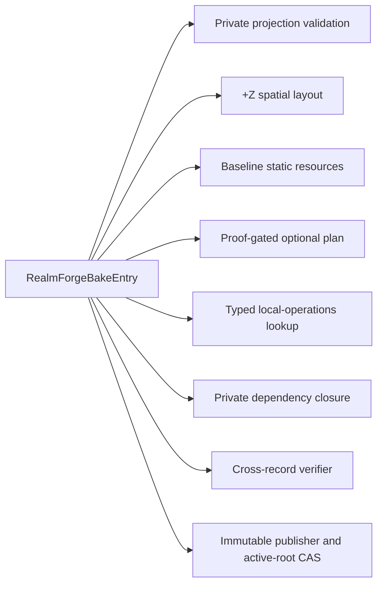
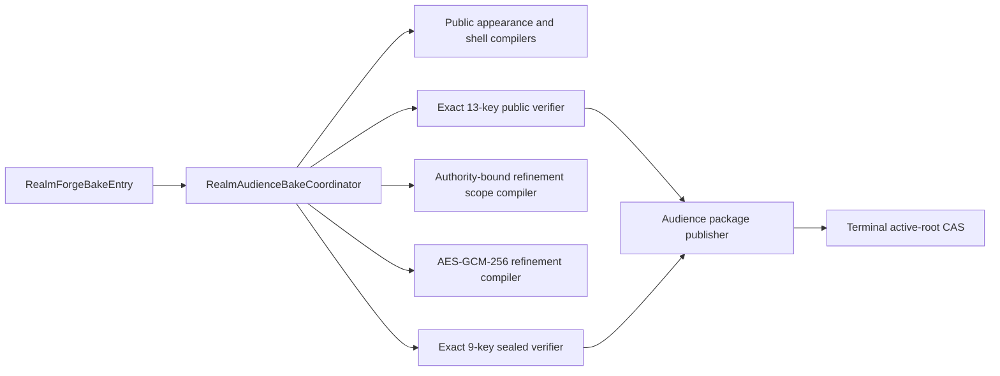
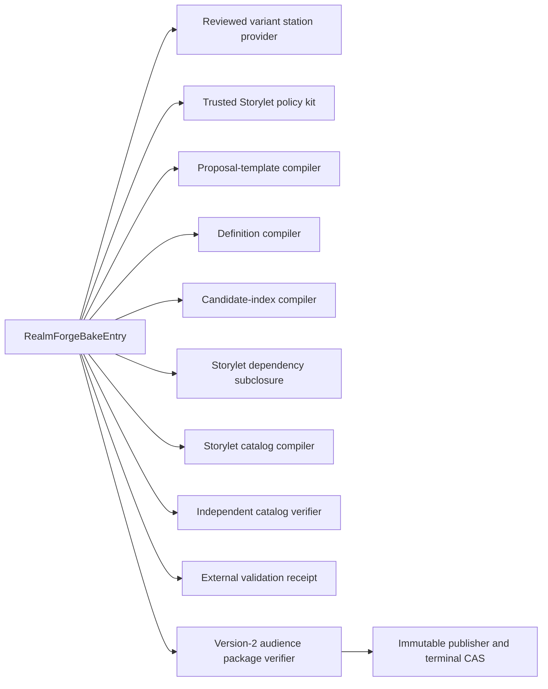
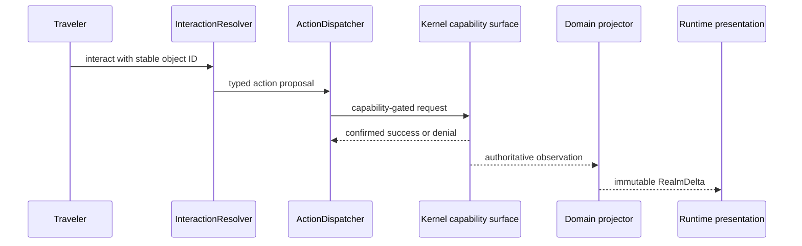

# Virtual Realm Architecture and Ownership

The Virtual Realm uses flat peer services with explicit, versioned contracts. Hierarchical world data remains a graph of stable IDs and edges. It never becomes recursively owned module state.

## Source-of-truth ownership

| Owner | Owns | Must never own |
| --- | --- | --- |
| RealmForge | Geography, visual grammar, materials, lighting intent, collision, navigation, station layout, bridge sockets, LOD rules, projection bindings, disclosure rules, and authored Storylet definitions | Live files, processes, peers, permissions, source bytes, or traffic |
| WebGPU OS | Filesystem, storage, processes, IPC, identities, capabilities, source bytes, and live metrics | Geometry, materials, or world composition |
| Virtual Realm runtime | Verified bake loading, ephemeral projections, ECS synchronization, grounded first-person play, owner-private local operations presentation, rendering, audio, and interaction requests | Editing RealmForge documents, granting permissions, exposing connected Cityforms in local operations, or becoming network authority |
| SecureMesh | Discovery, authentication, transport, routing, and content delivery | Station presentation or world rendering |
| Kernel and Realm Shield | Authorization, confinement, quotas, audit, and revocation | Trusting visible scenery as enforcement |
| Storylets | Deterministic presentation, explanation, proposals, waiting, and privacy-scoped replay records | Fabricating truth, direct system mutation, or authority grants |

## Composition roots

The architecture has one composition root for each independently started application.

### `RealmForgeBakeEntry`

`RealmForgeBakeEntry` receives RealmForge document services and compiler adapters. It constructs bake peers, orders pure compilation, publishes immutable artifacts, and disposes its resources. It never creates the live runtime.

`RealmForgeBakeEntry` is also the sole composition root for the M1A owner-private SecureMesh station slice. M1A peers do not construct or import one another. The entry passes closed immutable values through projection validation, deterministic +Z layout, baseline resource compilation, optional proof-gated optimization, local-operations lookup compilation, dependency closure, cross-record verification, immutable publication, and active-root compare-and-swap.

For M1B, the same entry exposes `compilePublicShell()`, `verifyPublicShell()`, `publishPublicShell()`, `compileAccessRefinement()`, `verifyAccessRefinement()`, and `publishAccessRefinement()`. It lazily owns one internal `RealmAudienceBakeCoordinator` composition delegate. That delegate assembles the flat public and refinement compiler peers from explicitly injected signature, authority, encryption, and publication ports; it is not a separately started application, service locator, runtime root, scanner, renderer, or network client. (Source: `webgpu-os/apps/realmforge/virtual-realm/RealmForgeBakeEntry.js`; `webgpu-os/apps/realmforge/virtual-realm/RealmAudienceBakeCoordinator.js`.)

M1C preserves that ownership boundary and adds three opt-in compilation paths: `compilePrivateBakeWithStorylets()`, `compilePublicShellWithStorylets()`, and `compileAccessRefinementWithStorylets()`. The entry composes reviewed station providers, a trusted Storylet policy resolver, data-only compilers, independent catalog verification, external receipt construction, existing audience assemblers, and existing publication peers. The legacy version-1 paths remain explicit and unchanged. The M1C module graph is frozen, and its complete integrated gate passed 35/35 on 2026-08-28. (Source: `webgpu-os/apps/realmforge/virtual-realm/RealmForgeBakeEntry.js`; `webgpu-os/apps/realmforge/virtual-realm/RealmAudienceBakeCoordinator.js`; `webgpu-os/apps/realmforge/virtual-realm/compilers/`; `webgpu-os/apps/realmforge/virtual-realm/station/`.)

### `VirtualRealmEntry`

`VirtualRealmEntry` receives narrow Engine and WebGPU OS ports. Its current M2
boundary is one exact 16-key dependency-version-2 record: dependency version,
Engine-adapter factory, legacy surface/frame, GPU presentation, resource
telemetry, lifecycle, process ownership, stable-runtime handoff, runtime
checkpoint, read-only composed bake admission, runtime activation, operator
context, action authority, local operator policy, clock, and sanitized logger.
M2D-B4F hardens the existing local-policy slot as the provider-free
`localOperatorPolicy@1` read/subscribe wire. M2D-B4G closes the existing
surface/frame slot with a reviewed terminal singleton; neither gate widens the
dependency record. The trusted kernel/service root,
not the application, owns M1 publication observation, immutable content,
external evidence and signature verification, migration, and M2 admission-head
CAS. The application receives no admission writer, raw GPU host, kernel manager,
generic network send, evidence-store handle, signing key, storage manager, or
global service locator. M4-M6 add a kernel-owned, wire-allowlisted
public-shell/exchange port only when those features are enabled.

The current M1 private publisher does not persist enough records to reconstruct
the exact private-v2 package after restart. Before M2 materialization, a trusted
owner-partitioned admission service stores the complete canonical package,
chunked resource/evidence/signature inventories, and the exact 71-field
`RealmPrivateBakeAdmissionIndexV1` through bounded exact-byte APIs beneath a
kernel-private operator/service root. It then reverifies the graph and advances
   a separate structured admission head through a service-generated operation,
   fixed seven-record slot containing pending, terminal-audit, intent, proposal,
   dispatch, retry, and result records, plus prior/current terminal-audit
lineage, bounded reclamation, and exact-byte CAS.
`RealmAdmissionSelectionCoordinator` closes the final M1-head/M2-policy/
Realm-scoped-signature-trust/M2-head selection interval. A separate operator/service
maintenance fence protects staged immutable bytes until verified pending-slot
readback makes its addressed intent/proposal the GC root; later Realm-scoped
prepared/active/abandoned/released runtime pins, checkpoints, handoffs, root-directory
updates, and future fail-closed collection use the same root-maintenance
boundary. Each durable root carries an exact kind payload; checkpoint/handoff
replacement releases an old root only through a successor-active retirement
receipt, and handoff reachability follows the complete protected checkpoint
edge. Immutable evidence policy plus authenticated reviewer provisioning
and a closed six-row/five-role signature map bridge opaque M1C references
without exposing stores or keys to the app. Final bundle visibility is guarded
by a current head/admission/evidence/trust/signature/profile assertion plus a
protected nondecreasing trusted-clock head. Under the retained selection fence
and closed candidate gates, the runtime first readbacks its exact durable pin
commit authorization, then makes the synchronous immediate-time expiry/rollback
predicate bound to that physical manager SHA only after the same no-await block
first rechecks work-root, activation-state, operator-generation, lifecycle, and
owner liveness. Both precede any CSE/pointer/source/controller/frame mutation.
Every active-bake CSE writer uses
the same fence and reasserts the exact predecessor before authorization. A
prepared commit independently binds the next exact active-bake record and an
exact safe prepared receipt plus acyclic expected step-8 swap-receipt digest;
live visibility exists only after the returned swap receipt matches. A hostile
post-step-8 mismatch closes both gate sets and enters explicit integrity
quarantine instead of success or ordinary abort. A verified replacement closes/readbacks old gates and transfers its superseded
teardown child to disposal ownership; public close remains lifecycle-retirement
only, binds the lifecycle authority's retirement receipt, and stale handles are
terminal no-effect. Activation IDs come from a narrow kernel secure-random port,
terminal replay is bounded, and the guard alone receives trusted signature-time
authority.
The M1 publication root, M2 admission head, and M2 in-memory active bundle never
imply one another. (Source:
`webgpu-os/apps/realmforge/virtual-realm/publication/RealmBakePublisher.js`.)

M2A originally froze the side-effect-free app and exact 15-key dependency-v1
object; additive accepted runtime gates now use the exact 16-key dependency-v2
object without widening it beyond the reserved GPU-presentation member. M2A also freezes the separate
11-definition/13-module runtime-contract graph, typed 65,536-byte handoff,
durable monotonic lifecycle generation, mandatory service-injected checkpoint
binding/edge over a one-field caller draft, and the complete exact 52-limit
runtime profile.
M2B freezes the durable private-v2 capsule,
versioned M1 head observation, protected storage/trust/evidence upgrade,
migration, restart, bounded control recovery, trusted current-active checkpoint
source plus commit lease/authorization, checkpoint/handoff binding-port and
graph-edge verification, kind-bound roots with successor retirement, and root/artifact/evidence
directory plus journal prerequisites with completed-sweep rollover for future
GC. M2 implementation is underway. M2A and the admission-only M2B slice are
accepted independently, but they do not constitute accepted integrated M2. See
[M2A runtime composition](m2a-runtime-composition.md) and
[M2B private-bake admission](m2b-private-bake-admission.md).

M3A and M3B are separate additive composition versions. M3A accepts exactly its
two prebound ports and owns safe observation admission. M3B accepts exactly
`realmObservationBatchReaderPort@1`, `realmProjectionContextPort@1`, and
`realmProjectionCommitPort@1`. Each port has its own byte-verified ten-field
descriptor, five-field ordered method rows, closed result-kind lists, and method
domain `particle-realms.m3b-port-result/<portName>/<methodId>@1`; the descriptors
are not mutually identical. Their request ceilings are exactly 65,536,
33,554,432, and 536,870,912 bytes in reader/context/commit order. Only their
exact 53-field logical runtime-binding pairs are byte-identical. The binding
includes a separately versioned M3
projection-transaction capability and semantic-axis policy but excludes the
separate 14-field presentation/authority/device fence. Every non-descriptor call
uses the same exact request-bound eight-key result envelope and its closed per-
method payload union. Result identity binds the method-specific result domain and
canonical data-only request digest, whose preimage begins with the exact
`portName` and `methodId`; caller signals are identity-free and excluded from
  canonical bytes. The catalog's exact 14-field receipt also binds the embedded
  17-field reference-descriptor pack containing 50 definitions, 50 extractors,
  78 authority rules, and 78 producer predicates, plus the compiled 12-field
  three-import/50-domain/78-carrier registry. The sole 21-field source matrix has
  exact counts 3/6/9/50/78/87/111/111/108/105/137 for imports, carrier shapes,
  recovery dispositions, domains, carriers, producer seeds, producer variants,
  direct edge tuples, alias source rows, literal alias rows, and derived alias
  references. These data-only tables freeze definition,
dependency, source-authority, producer-edge, owner, resolver, scoped-path, and
byte-carrier semantics without adding a callable port or wire definition. The
ports provide receipt-returning lifecycle, evidence-
complete bounded M3A reads and source-state changes, root-owned reader and
recorded-authority escrow, subject-only static closure resolution, complete
current-authority snapshots, immutable prior-state/floor reads, 28-field cuts
with exact service-issued expiry-due evidence grounded exclusively in M3A-owned
durable tick evidence, trusted prepare, one durable selector CAS, separate
24/18/18-field application/recovery/selector-retirement journals under one
quota, 37-field recovery, 24-field detach, internal root-store current/lineage-
to-retained ownership transitions, candidate-lease settlement, release, and
21-field quarantine-to-retained transfer.
They do not widen M2's 16-key dependency-version-2 object or M3A's two-key object. M3B remains an
implementation blueprint until accepted integrated M2 and accepted implemented
M3A exist. See
[M3A Observation Ingress](m3a-observation-ingress.md) and
[M3B Disclosure and Dynamic Projection](m3b-disclosure-projection.md).

The entry constructs only the peers enabled by the accepted milestone. M2
constructs the static runtime and projection peers while retaining M1C
Storylets as inert immutable content. M3 may add the Storylet runtime. M5-M6 may
add SecureMesh encounter peers. The entry controls startup and shutdown but
never imports RealmForge UI, modeler sessions, compiler/provider peers, preview
handles, or mutable document stores. Local compiler-package admission and
transported remote-shell admission are separate trust operations with separate
verifiers.

The composition roots may share contracts. They never instantiate or import one another.

### Clean-room Engine boundary

`VirtualRealmEntry` may receive selected public CSE/URC and State-First functions from the Engine namespace. It must validate and wrap them in Realm-owned adapters. It may not import any module under `tests/playground/`, resolve the Engine through globals or path probing, or adopt a demo fallback. The normative source-to-frame flow, exact adapter surface, lifecycle generation rules, truth-plane matrix, and audited source ledger are frozen in [Playground clean-room foundations](playground-clean-room-foundations.md).

The CSE-backed adapter supplies authority and causal-order evidence but does not replace the owning WebGPU OS, kernel, or SecureMesh service. The M3 State-First planner derives one flat unique semantic-only CPU source from the verified full ECS overlay; the M2 State-First adapter joins that source to representation, visibility, camera, and occlusion policy only after durable bundle selection. Neither planner nor adapter can create semantic state. Root Algebra remains an optional proof-gated M1 compiler optimization and is prohibited from runtime authority, disclosure, topology discovery, or post-publication bake mutation. `ExactCalculationReceipt` may provide immutable SHA-256 replay evidence for exact integer/rational calculations, but its explicit `not-a-formal-proof` boundary grants no story meaning, identity or provenance, Realm state, simulation authority, or mutation permission.

## Planned physical layout

Concern folders are namespaces only. They do not imply parent-child service ownership, automatic construction, or privileged inward imports.

```text
webgpu-os/apps/realmforge/virtual-realm/
  RealmForgeBakeEntry.js
  RealmAudienceBakeCoordinator.js
  authoring/       thin RealmForge document and Classic Editor adapters
  compilers/       pure audience compilers, closures, manifests, receipts
  publication/     exact package verification and immutable root publication
  station/         versioned private/public station kits and review evidence

webgpu-os/apps/the-virtual-realm/
  index.js         side-effect-free app export
  VirtualRealmEntry.js
  contracts/       one versioned contract per module
  observation-contracts/ complete opt-in M3A runtime coordination definitions
  observation/     separate M3A entry, aggregate batch reader, and session state
  projection-contracts/ complete opt-in M3B projection coordination definitions
  projection/      separate M3B entry, bounded batch consumer, and application/recovery coordinators
  runtime/         stores, ECS synchronization, interaction, lifecycle
  genesis/         optional sidecar verification, projection, foundry, ecology, and local Operations peers
  code-matter/     local source port, vault, nonce, tokens, line stream, leases, private atlas
  rendering/       geometry, materials, glyphs, lighting, effects, visor
  experience/      first-person, local operations, minimap, audio, accessibility, presentation
  station/         SecureMesh state, public shells, rendezvous, bridges
  storylets/       catalog, scheduling, episodes, proposals, replay
  security/        validation, audience filtering, epochs, cleanup
  telemetry/       sanitized measurements and release evidence

webgpu-os/kernel/
  OperatorPrivateServiceStorageView.js
  realm/RealmAdmissionPackageIndexCodec.js
  realm/RealmAdmissionOperationControlCodec.js
  realm/RealmAdmissionPolicyCodec.js
  realm/RealmSignatureTrustPolicyCodec.js
  realm/RealmAdmissionEvidenceBindingCodec.js
  realm/RealmAdmissionRootControlCodec.js
  realm/RealmAdmissionRootDirectoryCodec.js
  realm/RealmAdmissionArtifactDirectoryCodec.js
  realm/RealmAdmissionEvidenceDirectoryCodec.js
  realm/RealmAdmissionGarbageCollectionCodec.js
  realm/RealmPrivateBakeActivationCodec.js
  realm/RealmAdmissionSelectionCoordinator.js
  realm/RealmAdmissionPolicyStorageAdapter.js
  realm/RealmSignatureTrustPolicyStorageAdapter.js
  realm/RealmRuntimeCapabilityProfileRegistry.js
  realm/RealmPrivatePublicationHeadStorageAdapter.js
  realm/RealmPrivateBakeAdmissionService.js
  realm/RealmPrivateBakeActivationGuard.js
  realm/RealmRuntimeActivationService.js
  realm/RealmTrustedActivationClockStorageAdapter.js
  realm/RealmAdmissionEvidenceResolver.js
  realm/RealmAdmissionEvidenceProvisioningService.js
  realm/RealmAdmissionArtifactDirectoryService.js
  realm/RealmAdmissionArtifactDirectoryMutationArbiter.js
  realm/RealmAdmissionEvidenceBindingDirectoryService.js
  realm/RealmAdmissionRootLeaseService.js
  realm/RealmRuntimePinManager.js
  realm/RealmRuntimeCheckpointManager.js
  realm/RealmRuntimeHandoffManager.js
  realm/RealmM1PackageAdmissionAdapter.js
  realm/RealmObservationServiceRoot.js
  realm/RealmM2ContinuationProjectionService.js
  realm/RealmObservationExtensionOwner.js
  realm/RealmObservationSourceRegistry.js
  realm/RealmObservationIngressCoordinator.js
  realm/RealmObservationLedger.js
  realm/RealmObservationCheckpointStore.js
  realm/RealmObservationCausalValidator.js
  realm/RealmObservationIdentityProjector.js
  realm/RealmObservationProfileRegistry.js
  realm/RealmObservationDiagnostics.js
  realm/RealmBootObservationAdapter.js
  realm/RealmCanonicalStorageEventSink.js
  realm/RealmCanonicalStorageObservationAdapter.js
  realm/RealmProcessObservationAdapter.js
  realm/RealmIpcObservationSink.js
  realm/RealmSyscallObservationSink.js
  realm/RealmAuthorityObservationSink.js
  realm/RealmLocalNetworkObservationAdapter.js
  realm/RealmObservationBatchReaderProjectionService.js
  realm/RealmProjectionContextService.js
  realm/RealmProjectionExtensionOwner.js
  realm/RealmProjectionAuthorityEvidenceResolver.js
  realm/RealmProjectionStaticBindingResolver.js
  realm/RealmProjectionRootStore.js
  realm/RealmProjectionRootVerifier.js
  realm/RealmProjectionProtectedClosureVerifier.js
  realm/RealmProjectionBundleCommitService.js
  realm/RealmProjectionOperationJournal.js
  realm/RealmProjectionArtifactLeaseService.js
  realm/RealmProjectionLineageFloorStore.js
  realm/RealmProjectionQuarantineOwner.js
  realm/RealmProjectionDiagnostics.js

webgpu-os/shared/realm/projection/
  RealmProjectionSemanticKernel.js
  RealmProjectionDisclosureEvaluator.js
  Realm*Projector.js
  RealmProjectionMaintenanceCompiler.js
  RealmProjectionBatchAssembler.js
  RealmProjectionDeltaReducer.js
  RealmDynamicStoreCandidateBuilder.js
  RealmEcsProjectionPlanner.js
  RealmStateFirstSourcePlanner.js
  RealmProjectionProtectedClosureCompiler.js
  RealmProjectionCandidateVerifier.js

webgpu-os/storage/
  StorageManager.js       protected service roots, mutation exclusion, fences
  RealmContentStore.js    bounded cancellable raw exact-byte payloads

tests/virtual-realm/
  contracts/
  bake/
  observation/
  projection/
  code-matter/
  storylets/
  station/
  rendering/
  security/
  accessibility/
```

The implementation may split a concern folder when file count requires it, but it cannot introduce a nested runtime composition root, a manager tree, or a barrel module that secretly constructs peers. Cross-concern calls go through injected ports and immutable contracts.

The shared projection directory is one neutral, import-inert, flat package. App
and trusted prepare import the same pure functions; the package imports neither
side. The Engine keeps the separate bundle codec/adapter/durable selector and
exact ECS-overlay/State-First codecs in their established owner areas.

## Dependency rules

1. A peer module never constructs another peer module.
2. A peer module never imports another peer's concrete implementation.
3. The composition root injects every concrete dependency.
4. A module consumes typed ports and immutable records.
5. A module exposes narrow lifecycle methods such as `start()`, `snapshot()`, `subscribe(listener)`, `apply(record)`, and `dispose()` only where its role needs them.
6. No service locator, global manager, singleton registry, or omnipotent event bus coordinates the Realm.
7. Runtime entities refer to other entities by stable IDs.
8. Filesystem hierarchy uses graph edges such as `parentId`, `contains`, and `mounts` rather than recursively owned objects.
9. Bake, observation, projection, Storylet, station, bridge, reveal, presentation, and telemetry channels remain distinct.
10. The renderer imports no WebGPU OS driver. WebGPU OS adapters import no renderer.
11. Production modules import no Playground demo, wrapper, WGSL, UI, camera, loader, or fallback code.
12. Engine capability is injected into `VirtualRealmEntry`; no peer reads `window.PE`, another loader global, or a mutable ambient module cache.
13. Presentation order cannot create a causal edge, and a State-First representation decision cannot change semantic existence, authority, disclosure, topology, collision, or navigation.
14. The grounded first-person and owner-private local operations controllers are separate flat peers. Only first person traverses; the operations controller consumes a structurally local-only snapshot and never imports station or remote-world state.

## Contract modules

Each contract lives in its own module. The architecture does not create one large `RealmContracts` file.

| Contract | Purpose |
| --- | --- |
| `AudienceClassContract` | Exact owner, public, refinement, rendezvous, bridge, replay, or preview audience |
| `DisclosureClassContract` | Local, public, refinement, forbidden, construct, or historical export classification |
| `ProvenanceClassContract` | Authored, observed, derived, or construct lineage |
| `EvidenceQualityContract` | Exact, measured, computed, estimated, unknown, or not-applicable quality |
| `AvailabilityStateContract` | Available, sealed, denied, partial, or absent access state |
| `FreshnessStateContract` | Current, stale, expired, or unknown freshness |
| `TemporalModeContract` | Live, historical, or preview time context |
| `AssertionStateContract` | Confirmed, proposed, or hypothetical assertion status |
| `ResourceReferenceContract` | Audience-scoped resource identity, content locator, length, kind, and dependencies |
| `RealmSafeTextContract` | Normalized non-executable remote names, signs, labels, captions, and anti-spoof metadata |
| `SignatureEnvelopeContract` | External signer, algorithm, audience, policy, lifetime, nonce, digest, and signature binding |
| `RealmScanScopeContract` | Pre-enumeration allow roots, opaque hard-deny subtrees, canonical containment, link policy, and operation limits |
| `RealmSourceSnapshotContract` | Immutable authorized compiler input, source generations, relationships, coverage, and scan scope |
| `RealmCoverageReceiptContract` | Requested, granted, denied, omitted, truncated, cancelled, freshness, and per-domain evidence-quality classification |
| `RealmAudienceSourceProjectionContract` | Independently authorized private, public, or refinement compiler input created before topology compilation |
| `RealmSpatialLayoutPolicyContract` | Root Spine, parcel subdivision, growth, HLOD, routing, clearance, incremental stability, and numeric identity |
| `RealmBakeResourceLimitProfileContract` | Exact fail-closed source, topology, resource, byte, depth, local-operations, and compiler-work ceilings for one bake job |
| `RealmSpatialLayoutReceiptContract` | Node-to-cell and anchor map, routes, HLOD, relocation, collision, navigation, and deterministic layout evidence |
| `RealmTopologyNodeContract` | Stable audience-scoped semantic nodes |
| `RealmTopologyEdgeContract` | Typed containment, dependency, invocation, mount, route, guard, and attachment edges |
| `RealmGeometryResourceContract` | Bounded authored or compiled geometry resource |
| `RealmMaterialBindingContract` | Audience-safe material intent and binding |
| `RealmLightingIntentContract` | Semantic structural and activity-light intent |
| `RealmCollisionResourceContract` | Conservative collision solids and clearance evidence |
| `RealmNavigationResourceContract` | Walkable surfaces, portals, doors, and route links |
| `RealmSocketResourceContract` | Station, gate, bridge, refinement, and attachment sockets |
| `RealmLodResourceContract` | Far, mid, near, inspection, and HLOD records |
| `RealmProjectionBindingContract` | Semantic observation and delta bindings to stable anchors |
| `RealmGlyphStyleContract` | Sealed, structured, revealed, public, private, and historical glyph styles |
| `RealmAudioZoneContract` | Spatial emitters, reverb, occlusion, captions, and semantic audio zones |
| `RealmVisualBakeManifestContract` | Immutable package root, source projection, layout, compilers, closure, Storylets, compatibility, and signature |
| `RealmDependencyClosureContract` | Exact audience-specific sorted transitive resource closure and budgets |
| `RealmBakeReceiptContract` | Determinism, provenance, compatibility, privacy, validation, and publication evidence |
| `RealmProofGatedOptimizationReceiptContract` | Frozen proof obligations, counterexamples, bounds, baseline parity, CPU/WGSL decisions, versions, and baseline-fallback evidence |
| `RealmTopologyChangeSetContract` | Bounded source-generation changes and deterministic coalescing boundary |
| `RealmBakeRequestContract` | Cross-root request for one fresh audience-specific immutable bake |
| `RealmBakeActivationOfferContract` | Verified candidate manifest, watermarks, compatibility, anchors, and budgets |
| `RealmBakeActivationReceiptContract` | Atomic prepare, commit, reject, cancel, or pre-commit rollback evidence |
| `RealmPublicAppearanceSourceContract` | Caller-authored public-only appearance projection bound to the shipped kit, policies, safe text, resources, gates, sockets, lifetime, and publisher |
| `PublicRealmShellManifestContract` | Strict signed public shell root bound to appearance, source projection, bake, closure, visual manifest, policies, safe resources, limits, and lifetime |
| `RealmAccessRefinementContract` | Signed capability-refined root bound to the base public shell, socket, audience, authority, epochs, closure, visual manifest, and encryption envelope |
| `RealmRefinementEncryptionEnvelopeContract` | AES-GCM-256 ciphertext, authenticated-data, key-generation, audience, capability, scope, epoch, authority, base-shell, closure, and lifetime bindings |
| `RealmPublicNoninterferenceReceiptContract` | Owner-private local evidence for two byte-identical public compilations with zero private reads, cache hits, or forbidden reachability |
| `RealmRefinementScopeReceiptContract` | Owner-private local evidence for exact granted/projected refinement scope with no public, private, stale, forbidden, out-of-scope, or unlabeled record |
| `RealmObservationContract` | Normalized source-owned facts independent of presentation geography |
| `RealmObservationSnapshotContract` | Source schemas, generations, watermarks, facts, omissions, and freshness |
| `RealmMetricValueContract` | Units, quality, sampling, quantization, and bounded metric evidence |
| `RealmFilesystemObservationContract` | Filesystem object, mount, move, revision, and coverage payloads without ambient paths |
| `RealmProcessObservationContract` | Process lifecycle and quality-labeled metric payloads |
| `RealmIpcObservationContract` | IPC channel topology and aggregate traffic without message content |
| `RealmSyscallObservationContract` | Post-kernel invocation lifecycle, authority receipt, result, safe metrics, and reason without arguments or payloads |
| `RealmStorageObservationContract` | Store lifecycle, usage, capacity, pressure, and operation-class payloads |
| `RealmPermissionObservationContract` | Authority decisions, policy revisions, expiry, revocation, and safe reason codes |
| `RealmNetworkObservationContract` | Authenticated route state and aggregate metrics without addresses or packets |
| `RealmStationObservationContract` | Discovery, identity, consent, safe text, shell, arrival, docking, epoch, and departure stages |
| `RealmCodeMatterObservationContract` | Descriptor, state, lease, chunk, expiry, and revocation events without plaintext |
| `RealmBootObservationContract` | Boot phases, service readiness, dependencies, degradation, and safe failure state |
| `RealmDeltaContract` | Immutable bake- and anchor-bound runtime projection change |
| `RealmEntityDeltaContract` | Runtime entity activation, update, staleness, absence, and deactivation |
| `RealmRouteDeltaContract` | Proposed, open, degraded, closed, or revoked route presentation |
| `RealmGateDeltaContract` | Locked, pending, granted, denied, expired, or revoked gate presentation |
| `RealmTrafficDeltaContract` | Bounded traffic presentation from cited metrics |
| `RealmStructureDeltaContract` | Stable-geometry activity, fracture, recovery, and availability presentation |
| `RealmCodeDeltaContract` | Lease-backed sealed, structured, and revealed Code Matter transition |
| `RealmPresentationDeltaContract` | Reversible presentation-command attachment, update, and removal |
| `RealmActionProposalContract` | Powerless typed interaction or Storylet request with idempotency and expected state |
| `RealmActionAuthorityReceiptContract` | Kernel or Realm Network allow or deny result bound to action, object, policy, and active epochs |
| `RealmActionResultContract` | Authoritative result observation that permits completed-success presentation |
| `CodeMatterDescriptorContract` | Audience-safe source object, metadata policy, revision, state, glyph, and capability binding |
| `CodeMatterVaultKeyEpochContract` | Non-secret local vault key identity, epoch, IV policy, status, and wrapping reference |
| `VaultNonceAllocationReceiptContract` | Atomic durable per-key IV-counter reservation and crash-recovery evidence |
| `CodeRevealLeaseContract` | Object, revision, authority, visible range, active epochs, and expiry |
| `CodeMatterChunkContract` | Lease-bound exact ranges, encryption envelope, IV receipt, commitment, and private digest |
| `PresenceBeaconContract` | Signed rate-limited public identity reference, shell, protocols, intent, and expiry |
| `PresenceSessionContract` | Authenticated identities, mutual consent, safe shells, station scope, policy, expiry, and epoch |
| `RealmPoseContract` | Signed public Cityform pose inside a virtual or rendezvous frame |
| `TravelerAppearanceManifestContract` | Safe shipped-archetype Traveler appearance, safe name, expiry, and identity binding |
| `TravelerPresenceGrantContract` | Authentication, mutual consent, host scope, presence epoch, and conditional rendezvous or bridge scope |
| `TravelerMovementIntentContract` | Visitor locomotion request consumed by host collision, navigation, gate, and presence authority |
| `TravelerPoseContract` | Host-authoritative ordered bounded locomotion projection and correction |
| `RendezvousFrameContract` | Temporary federated coordinate frame, participants, interpolation, lifetime, and signatures |
| `DockingOfferContract` | Directional gates, route, action, active presence and rendezvous epochs, transcript, versions, offer and proposed-generation nonces, expiry, and signature |
| `DockingGrantContract` | Exact offer binding, strict directional capability intersection, scope, limits, transcript, policy, capability epoch, generation-nonce digest, and prospective bridge epoch |
| `BridgeRecipeContract` | Canonical endpoints, coordinates, safe archetypes, compiler, clearance, traversal, and epoch |
| `BridgeDigestContract` | Signed canonical semantic bridge-output agreement |
| `BridgeEpochContract` | Active grants, participants, keys, policy, start, end, and Chronicle generation |
| `RealmLogicalClockTickContract` | Logical tick, scope, term, participant set, and hash-linked shared timing |
| `RealmDeterministicRandomStreamContract` | Exact PCG semantic stream, purpose separation, draw index, and selection policy |
| `RealmStoryletCatalogContract` | Canonically ordered audience catalog, safe text, limits, policy, closure, and signature |
| `RealmStoryletCatalogValidationReceiptContract` | Signed external evidence for one accepted audience catalog, Storylet subclosure, policy, station kit, totals, and checked invariants |
| `RealmStoryletInputSnapshotContract` | Audience-filtered canonical facts, watermarks, logical time, metric hysteresis, participants, policy, and active epochs |
| `RealmStoryletPolicyContract` | Trusted category, priority, presentation-channel, work, and safety ceilings |
| `RealmStoryletCoordinatorLeaseContract` | Mutually signed coordinator term, failover barrier, participant set, and split-brain evidence |
| `RealmStoryletDefinitionContract` | Declarative triggers, predicates, phases, scopes, proposals, safe text, and policies |
| `RealmStoryletProposalTemplateContract` | Closed data-only presentation or action-request template with exact audience, truth, lifecycle, dependency, and safe-text bindings |
| `RealmStoryletDecisionContract` | Canonical candidate set, input snapshot, clock, random draw, tie-break, selection, and ordered zero-or-more proposal digests |
| `RealmStoryletProposalContract` | Bounded presentation or action-kind proposal, truth reference, termination, reversibility, and dependencies |
| `RealmStoryletActionCorrelationContract` | Storylet proposal and decision references correlated to the one generic Realm action and authority-receipt path |
| `RealmStoryletInstanceRecipeContract` | Shared definition, participants, clock, random stream, policy, channel reservations, and active epochs |
| `RealmStoryletInstanceHeadContract` | Persisted outer scheduler state, reservations, episode reference, coordination, interruption, recovery, and cleanup obligations |
| `RealmStoryletEpisodeHeadContract` | Data-only revisioned episode head bound to recipe, bake, policy, clock, and active epochs |
| `RealmStoryletPersistenceReceiptContract` | External encrypted compare-and-swap storage or restore evidence for an instance or episode head |
| `RealmPresentationCommandContract` | Typed reversible non-authoritative light, audio, particle, sign, actor, glyph, route, and visor command |
| `RealmChronicleEventContract` | Signed privacy-scoped semantic history with provenance, claim axes, parents, epochs, and receipts |
| `LocalOperatorViewPolicyContract` | Owner-private local Realm, approved first-person/isometric/eagle-eye modes, camera bounds, minimap limits, zone actions, and no-authority interaction rules |
| `LocalOperationsLookupResourceContract` | Typed private cells, anchors, zones, routes, landmarks, bounds, camera bounds, and map-HLOD closure compiled by M1A |
| `LocalOperatorViewSnapshotContract` | Current authority-bound local view, private bake/layout, camera, admitted local cells/anchors/zones, and exact connected-content exclusion receipt |
| `LocalCityMinimapSnapshotContract` | Referentially closed local zones, routes, landmarks, bounds, cells, and exact connected-content exclusion receipt |
| `LocalZoneManagementProposalContract` | Powerless local-zone visibility, alert-threshold, or rebake request bound to the current operator view and authority preconditions |

The M0 catalog contains 100 accepted flat contract modules. M1A adds `RealmBakeResourceLimitProfileContract`, `RealmProofGatedOptimizationReceiptContract`, and `LocalOperationsLookupResourceContract`. M1B adds `RealmPublicAppearanceSourceContract`, `RealmRefinementEncryptionEnvelopeContract`, `RealmPublicNoninterferenceReceiptContract`, and `RealmRefinementScopeReceiptContract`. M1C adds `RealmStoryletProposalTemplateContract` and `RealmStoryletCatalogValidationReceiptContract`, producing the verified ordered inventory of 109. Contract conformance, the accepted M1A/M1B regressions, and the full M1C compile, verify, publish, and import gate have executable passing evidence. The required fields and validation sequence are normative in the [contract catalog](contracts.md). (Source: `webgpu-os/apps/the-virtual-realm/contracts/VirtualRealmContractCatalog.js`.)

## M1A private bake graph

The M1A graph is a vertical implementation slice of the wider planned bake system. It produces one owner-private package and no live world.



The arrows show composition-root orchestration. They do not permit peer-to-peer concrete imports. The immutable package contains layout evidence, topology, ten typed static visual-resource families, the typed local-operations lookup, one exact closure, and one private manifest. Bake receipts, optimization receipts, signatures, and activation evidence remain external to the content DAG.

Publication writes and verifies content-addressed resources first, then the closure, then the manifest. It changes the selected private root only through an expected-prior-root compare-and-swap. Any rejection or conflict keeps the prior root active and never mutates the `.proasset` source.

See [M1A owner-private SecureMesh station bake](m1a-private-securemesh-bake.md) for the complete boundary and passing evidence ledger.

## M1B public and refinement package graph

M1B adds two independent audience jobs. The public job accepts only an explicit public projection, caller-authored public appearance, the shipped public-safe station kit, and public limits. The refinement job begins by reverifying the complete base public package, then accepts only authority-approved capability-refined records. Neither job derives a public shell by sanitizing an owner-private bake.



The public compiler performs two independent runs over the same public inputs and records byte-identical output in a signed owner-private/local-private noninterference receipt. The refinement compiler binds exact actions, scopes, capability and bridge epochs, base-shell identity, closure, authenticated data, ciphertext, key generation, and lifetime into signed records. Both local evidence receipts remain available to the local verifier but are stripped, with their signatures, from publication artifacts. The compiler-returned packages therefore are verifier packages, not directly transportable payloads. (Source: `webgpu-os/apps/realmforge/virtual-realm/RealmAudienceBakeCoordinator.js`; `webgpu-os/apps/realmforge/virtual-realm/publication/RealmAudiencePackagePublisher.js`.)

See [M1B public shell and access-refinement packages](m1b-public-refinement-packages.md) for exact package keys, authenticated-data fields, publication artifacts, and rollback behavior.

## M1C Storylet and reviewed station graph

The accepted M1C slice adds flat, data-only compilation peers to each audience job. Proposal templates, definitions, safe text, cues, and the candidate index enter one audience-local Storylet dependency subclosure. The catalog binds that subclosure but is excluded from it. The main audience closure then contains every Storylet member, the subclosure, and the catalog; the visual manifest names the catalog. Validation receipts and bake receipts remain external evidence and never create a content-address cycle.



The reviewed private provider and independently authored public provider each return `{ kit, authoringEvidence }`. Structural review covers deterministic identity, +Z and bounds where applicable, navigation, clearance, accessibility, captions, reduced motion, renderer compatibility, provenance, licensing, disclosure, and resource ceilings. `renderedPixelEvidenceAbsent: true` keeps final visual, performance, and device certification in later gates.

See [M1C Storylet and reviewed station bake](m1c-storylet-station-bake.md) for the exact input DTO, artifact graph, version-2 package boundaries, signing and publication stripping, 35-case gate, exclusions, and rollback boundary.

## RealmForge bake peers

The RealmForge application composes these peers:

- `RealmSourceAdapter`
- `RealmScanScopeVerifier`
- `RealmDisclosurePolicy`
- `RealmAudienceSourceProjectionBuilder`
- `RealmAudienceSourceProjectionValidator`
- `RealmAssetCatalog`
- `RealmEditorSceneAdapter`
- `RealmForgeMaterialPreviewAdapter`
- `RealmForgeTypographyPreviewAdapter`
- `RealmForgeVisorPreviewAdapter`
- `RealmForgeAccessibilityPreviewAdapter`
- `RealmTopologyCompiler`
- `RealmGeometryCompiler`
- `RealmMaterialCompiler`
- `RealmLightingCompiler`
- `RealmCollisionCompiler`
- `RealmNavigationCompiler`
- `RealmGlyphStyleCompiler`
- `RealmSocketCompiler`
- `RealmLodCompiler`
- `RealmProjectionBindingCompiler`
- `RealmAudienceBakeAssembler`
- `RealmDependencyClosure`
- `RealmStoryletAuthoringAdapter`
- `RealmStoryletCompiler`
- `RealmStoryletDependencyClosure`
- `RealmStoryletValidator`
- `RealmBakeValidator`
- `RealmBakePublisher`
- `RealmVisualQA`

`RealmBakePublisher` publishes supplied validated results. It contains no compiler or disclosure logic.

The implemented M1B RealmForge slice adds these flat modules and explicit ports:

- `RealmAudienceBakeCoordinator`, an implementation-local composition delegate owned by `RealmForgeBakeEntry`
- `PublicSecureMeshShellKit`, fixed public-safe archetype, HLOD, safe-text, gate, socket, protocol, and renderer data
- `RealmPublicAppearanceCompiler`
- `RealmPublicShellCompiler`
- `RealmPublicNoninterferenceCompiler`
- `RealmRefinementScopeCompiler`
- `RealmAccessRefinementCompiler`
- `RealmAudienceDependencyClosureCompiler`
- `RealmAudienceVisualBakeAssembler`
- `RealmPublicBakePackageVerifier`
- `RealmRefinementBakePackageVerifier`
- `RealmAudiencePackagePublisher`
- injected `signatureAdapter`, `refinementAuthorityAdapter`, `encryptionAdapter`, and immutable-storage/root-CAS port

The shipped public kit is appearance data, not a live SecureMesh connection. The current public coordinator path does not turn projection relationship records into roads and does not scan a Cityform. The refinement compiler encrypts authorized payload bytes, but remote exact-source delivery into Code Matter remains deferred.

The accepted M1C RealmForge slice adds these flat peers without introducing a Storylet runtime:

- `RealmStoryletPolicyKit`
- `RealmStoryletProposalTemplateCompiler`
- `RealmStoryletDefinitionCompiler`
- `RealmStoryletCandidateIndexCompiler`
- `RealmStoryletDependencyClosureCompiler`
- `RealmStoryletCatalogCompiler`
- `RealmStoryletCatalogVerifier`
- `RealmStoryletCatalogValidationReceiptBuilder`
- `ReviewedStationKitValidator`
- `ReviewedPrivateSecureMeshStationKit`
- `ReviewedPublicSecureMeshStationKit`

These modules compile and verify immutable authored records only. They do not schedule Storylets, observe live state, render, connect to SecureMesh, call a network API, or grant authority.

## WebGPU OS observation peers

WebGPU OS ports translate privileged services into bounded observations. They do not decide geometry or presentation.

M3A owns exactly seven internal source ports behind one prebound aggregate app
port:

- `BootObservationPort@1`;
- `CanonicalStorageObservationPort@1`, the one source for both filesystem and
  storage M0 observation kinds;
- `ProcessObservationPort@1`;
- `IpcObservationPort@1`;
- `SyscallObservationPort@1`;
- `AuthorityObservationPort@1`, the one source for permission and terminal
  action-result observation kinds;
- `LocalNetworkObservationPort@1`.

The application receives none of these ports directly. The trusted composition
root binds them behind `realmObservationIngressPort@1`, prebound to one exact
selection-fenced portable operator/Realm/process-owner/M2-lifecycle/active-
bundle/head/policy plus pseudonym-key-authority/epoch/commitment tuple. The
read-only continuation projection consumes M2's retained initial operator
projection plus current assertions and conditionally projects an accepted
device-recovery receipt through a closed kernel-only observation union; it never
calls the initial operator snapshot again. A restricted kernel-only HMAC port
projects raw identities without exposing key or preimage bytes, remains stable
across consumer restart, and forces a new binding plus seven new source
generations on explicit key rotation. Its kernel-only historical reference
ledger retains segment/checkpoint/recovery-journal epochs until exact retirement
evidence exists, uses one complete-set terminal binding CAS for final old-
binding references, derives eligibility through a seven-row continuation-reason
precedence map with a distinct normalization-policy-change reason, immutably
latches the first terminal row, requires released/absent-after-restart extension-
aggregate evidence, binds atomic projection issuance/row registration or sealed
nonissuance, object-identical close for the released generation, every required
prior cumulative zero-handle/zero-in-flight fence, or the sole fence for an
absent retired owner generation,
reports a blocked CAS through one closed seven-kind safe condition projection,
and keeps retired metadata permanently non-reactivating. A
separate kernel-private M3A extension owner claims one process-local aggregate
child and object-identical work/teardown roots without adding a tuple to M2's
frozen process-owner ledger. Its atomic source-open, cursor, durable binding-
scoped batch sequence, limit, ledger, semantic opening-cut plus attempt-specific
recovery, closed-edge checkpoint, deterministic oldest-prefix compaction,
identity-projection close readback, state-transition-paired live-cohort resource
proof, and lifecycle rules are frozen in
[M3A Observation Ingress](m3a-observation-ingress.md).

Later slices may add separate, independently gated ports:

- `RealmIdentityPort`
- `RealmLinkPort`
- `ChroniclePort`
- `RealmContentPort`
- `BackgroundLifecyclePort`

Each M3A source port provides immutable safe-normalized M0 records through an
exact manifest-bound adapter/port/source-schema-version tuple and an atomic
snapshot-and-retained-tail handshake. Raw paths or identities never
leave the trusted adapter. The canonical storage port emits one primary M0
observation for one raw mutation; deterministic storage metric windows cite
the primary observations they summarize rather than duplicating an operation.
Kernel safe normalization is irreversible before app or ledger delivery. M3B
owns only later pure disclosure over already safe records.

`RealmContentPort` resolves only verified content-addressed bake, public-shell,
and Realm resource records. It cannot request source bytes; exact local source
ranges belong exclusively to the separately gated M3D `CodeMatterSourcePort`.

## Live projection peers

M3B app peers are bounded session orchestrators and port consumers:

- `VirtualRealmM3BProjectionEntry`
- `RealmObservationBatchConsumer`
- `RealmProjectionApplicationCoordinator`
- `RealmProjectionRecoveryCoordinator`

Neutral shared peers are deterministic value transformers used byte-identically
by app planning and trusted prepare:

- `RealmProjectionSemanticKernel`
- `RealmProjectionDisclosureEvaluator`
- `RealmBootProjector`
- `RealmFilesystemProjector`
- `RealmStorageProjector`
- `RealmProcessProjector`
- `RealmIpcProjector`
- `RealmSyscallProjector`
- `RealmPermissionProjector`
- `RealmNetworkProjector`
- `RealmHistoricalWitnessProjector`
- `RealmProjectionMaintenanceCompiler`
- `RealmProjectionBatchAssembler`
- `RealmProjectionDeltaReducer`
- `RealmDynamicStoreCandidateBuilder`
- `RealmEcsProjectionPlanner`
- `RealmStateFirstSourcePlanner`
- `RealmProjectionProtectedClosureCompiler`
- `RealmProjectionCandidateVerifier`

The eight primary projectors uniquely own M3A's nine admitted kinds.
`RealmPermissionProjector` owns the one authority domain over both `permission`
and `action-result`. The embedded 16-field recipe matrix freezes 53 event rows,
130 primary operation slots, 16 descriptor roles, and one witness recipe.
`RealmHistoricalWitnessProjector` owns no observation kind; it can consume only
one complete already accepted historical primary outcome. It reuses the exact
accepted primary presentation command and can emit only one nonrecursive
historical presentation Delta, never a second command.

Trusted WebGPU OS peers own currentness and publication:

- `RealmObservationBatchReaderProjectionService`
- `RealmProjectionContextService`
- `RealmProjectionExtensionOwner`
- `RealmProjectionAuthorityEvidenceResolver`
- `RealmProjectionAuthorityFenceService`
- `RealmProjectionStaticBindingResolver`
- `RealmProjectionEvidenceEscrowStore`
- `RealmProjectionRootStore`
- `RealmProjectionRetainedRootOwner`
- `RealmProjectionRootVerifier`
- `RealmProjectionProtectedClosureVerifier`
- `RealmProjectionBundleCommitService`
- `RealmProjectionOperationJournal`
- `RealmProjectionRecoveryAttemptJournal`
- `RealmProjectionRecoveryJournalFloorStore`
- `RealmProjectionSelectorRetirementAttemptJournal`
- `RealmProjectionArtifactLeaseService`
- `RealmProjectionLineageFloorStore`
- `RealmProjectionRecoveryService`
- `RealmProjectionQuarantineOwner`
- `RealmProjectionDiagnostics`

App peers receive only the exact three M3B ports. Trusted peers alone inspect
selection-fenced M2/M3A state; return immutable complete-base plus root-store-
authored candidate-floor bytes; resolve only subject-authorized static binding/
anchor closures; and resolve complete recorded authority evidence before
disclosure separately from the complete fail-closed current-authority snapshot.
Reader, static, and authority resolution return their canonical receipt bytes
with their ID/digest pairs. Static resolution uses an exact 24-field receipt.
Authority resolution has one 21-field maximum vocabulary whose recorded and
current-only variants have exactly 19 and 13 own keys respectively; no hidden
resolver object can substitute. Trusted
peers copy required M3A retention/source/reader-escrow and recorded-authority-
escrow bytes into root-owned closure, verify the applicable expiry-due receipt,
retain/transfer roots, rerun the neutral semantic kernel, build one complete
immutable bundle off-active, journal dispatch, perform the sole durable selector-
generation CAS, reconcile or recover, and quarantine uncertainty. The candidate
root and intent remain lease-neutral until prepare acquires their deterministic
nonexpiring service-only M2 lease; selected and retained lease ownership belongs
to the root store. A process-local mirror is not a second commit. No M3B peer
imports a renderer, GPU object, scanner, RealmForge executor, remote network
session, raw manager, or another application's implementation.

The context owner claims one monotonically generated extension child and will
not open a successor binding until the predecessor's transition is proven. The
exact 21-field empty/present transition descriptor is the only predecessor input
accepted by commit-port detach. The exact 18-field selector-retirement attempt
record, complete M2 static fallback, 24-field detach receipt with exact ECS/
State-First evidence, and
conditional 21-field quarantine receipt then produce one exact 21/25-field
binding-transition receipt. Context closes last, after reader and commit, releases the
extension child exactly once, and returns the extension-release receipt.

The root store verifies a bounded suffix against its directly bound 12-field
lineage-floor anchor. That root-store-authored anchor is a root-owned protected-
closure entry with no candidate-root backlink; releasing a folded predecessor
requires successor selector readback and cannot strand reader or authority
escrow. Commit close always settles the candidate lease explicitly. `beginStop()`
first issues the exact 16-field stop receipt and captures/closes the presentation
fence. Final disposal is one exact 38-field receipt containing reader/context/extension/commit
close evidence, conditional retained-root/binding-transition/quarantine evidence,
and exact before/after 16-field session-resource snapshots. Their counters are
`candidateCount`, `preparedCount`, `readerEscrowCount`, `candidateLeaseCount`,
`sessionCandidateRootCount`, `callbackCount`, and `inFlightCount`; these are
service-owned session resources, never app-owned handles, and all reach zero
after transfer.

Application, recovery, detach, and quarantine receipt construction is data-only
and cross-language deterministic. Conditional receipts derive exact hash-only
presence vectors and ordered field/value rows; quarantine additionally persists
one dense immutable resource inventory whose ten-field rows and aggregate digest
join every adopted operation, candidate, lease, escrow, overlay, callback, and
in-flight obligation exactly once. The three journals, resource ledger,
quarantine owner, selector/root store, and M2 lease owner remain flat peers; no
aggregate coordinator becomes a fourth authority.

The exact 41-field projection batch carries equal-length dynamic
`presentationCommandIds` and `presentationCommandDigests` arrays. Presentation
commands are not a fourth static carrier: every command must join exactly one
batch pair, one pure-compiled or retained-origin protected-closure byte object,
and at least one admitted ID-only presentation Delta. Free, missing, uncited,
conflicting, or multiply resolved command bytes fail the candidate. Command
bytes count through protected closure, never `deltaByteCount`. Command
identity binds runtime binding, projector, observation, slot, binding subject,
selected anchor, command kind, and content digest; the current-presentation
semantic key is independent of that identity. Stateful same-key selection uses
an independently reconstructed sequential `transitionBase`, exhaustive
DynamicStore lowering, and a side-effect-free 16-field pre-freeze work-count
plan. The conservative independent-ceiling sum is 347137 work units without a
claim that the exclusive-cut maxima are simultaneously attainable. Current
traffic alone receives saturating cut-tick-plus-one expiry; every other primary
Delta uses expiry `"0"`. Every base-M3B IPC, syscall, and network route is
non-traversable. M3A admits six local-network events; `authenticated` is absent
because it requires `peerIdentityRef`, and peer authentication remains M5 work.

M3C separately owns `RealmTopologyChangeDetector`, the powerless bake-request
adapter, bounded transition buffer, full reprojection service, and bake-
transition reducer. M3D separately owns the Code Matter projector. These peers
are not M3B dependencies and cannot enter its catalog or output subset.

## Runtime peers

- `RealmBakeVerifier`
- `RealmBakeLoader`
- `RealmEngineAdapter`
- `RealmStateFirstPresentationAdapter`
- `RealmStaticStore`
- `RealmDynamicStore`
- `RealmEcsSynchronizer`
- `RealmGeometryRenderer`
- `RealmMaterialSystem`
- `RealmGlyphRenderer`
- `RealmTypography`
- `RealmLighting`
- `RealmEffects`
- `RealmAudio`
- `RealmVisorOverlay`
- `RealmAccessibilityProjection`
- `RealmFirstPersonController`
- `RealmLocalOperatorPolicyPortContract` (accepted provider-free B4F wire)
- `RealmLegacySurfaceFramePort` (accepted terminal B4G compatibility boundary)
- `LocalOperatorViewPolicyStore`
- `LocalOperatorViewProjector`
- `LocalOperatorCameraController`
- `LocalCityMinimapProjector`
- `LocalZoneSelectionStore`
- `LocalZoneManagementActionAdapter`
- `RealmCollision`
- `RealmNavigation`
- `InteractionResolver`
- `ActionDispatcher`
- `RealmTelemetry`

`RealmLocalOperatorPolicyPortContract` is a flat runtime boundary, not a policy
owner. It imports the accepted M0 policy contract and value preflight only; it
imports no provider, Engine, GPU, store, renderer, network service, or other B4
family. Its exact port methods are `readPolicy()` and `subscribe()`. Success
cross-binds the six-field operator/local-Realm context, the nested policy
ID/revision/digest head, and the accepted policy. Invalidation is the data-only
two-field event `{ eventKind, reasonCode }`, so it cannot disclose replacement
policy data or connected-Cityform state.

`RealmRuntimeDependencyContract` validates B4F in the existing exact 16-key
dependency-v2 record. `RealmM2RuntimeComposition` validates it after action
authority and before GPU syscall, runtime-profile, or process-owner acquisition,
then forwards the identical port in the lease. Ordinary startup invokes neither
method. The contract owns no state, protected head, camera, view, minimap,
renderer, or mutation authority. `LocalOperatorViewPolicyStore` remains future
trusted-owner work rather than an implementation supplied by B4F.

B4F acceptance recorded 60/60 hostile browser cases and 11/11 independent Python
proofs. At that gate, the B4F contract, shared dependency, Entry, and
production-composition closures were exactly 11, 23, 105, and 47 acyclic
error-free modules. Its scoped Python group passed 59/59, or 64/64 including
the then-29-module renderer closure; B4A-B4F plus M2A and B3 browser regressions
passed 328/328 with zero skips. These are historical B4F measurements, not the
current aggregate graph counts.

`RealmLegacySurfaceFramePort` closes B4G without owning a surface or frame
producer. Its configuration-free factory returns one immutable module-local
singleton with exactly `portName`, `version`, `acquireSurface`, and
`registerFrameProducer`. Both synchronous methods ignore every argument and
their receiver and return the same frozen null-prototype result:
`{ status: 'unavailable', reasonCode: 'realm-gpu-presentation-required', recoverable: false }`.
The port also has a null prototype. Its admission validator accepts only that
singleton identity, so copied ports, proxy wrappers, or substitute methods
cannot introduce another GPU path. This stateless value is not a service
registry or an authority owner.

The dependency contract requires this terminal identity in the existing
`surfaceFramePort` slot. Production composition validates it before GPU syscall
validation, runtime-profile verification, or process-owner processing, then
forwards the same object. Actual GPU work remains behind the separate accepted
owner-coupled `realmGpuPresentation@1` port. B4G's focused browser gate passes
24/24. The [B4G compatibility acceptance ledger](m2-runtime-foundation.md#m2d-b4g-terminal-legacy-surfaceframe-compatibility)
records B4G integration evidence. B4H is underway but unaccepted;
Operations View, minimap, controller, and visible-city acceptance remain
separate. (Sources:
`webgpu-os/apps/the-virtual-realm/runtime/RealmLegacySurfaceFramePort.js`;
`webgpu-os/apps/the-virtual-realm/runtime/RealmRuntimeDependencyContract.js`;
`webgpu-os/kernel/realm/RealmM2RuntimeComposition.js`;
`tests/virtual-realm/m2-legacy-surface-frame-port.test.js`.)

B4H's first genuine source is the kernel-only
`RealmLocalOperatorPolicyHeadStorage`. It reuses protected service storage and
canonical M0 policy validation. A captured account and explicit Realm bind one
nondeletable policy head with monotonic epochs, predecessor-SHA comparison,
verified readback, zero-write unchanged saves, and uncertain-write recovery.
It does not select the current Realm, implement the B4F live adapter, or
register a provider. The [flat B4H readiness ledger](m2-runtime-foundation.md#m2d-b4h-genuine-authority-provider-composition)
records the remaining sources and composition evidence. (Sources:
`webgpu-os/kernel/realm/RealmLocalOperatorPolicyHeadStorage.js`;
`webgpu-os/kernel/OperatorPrivateServiceStorageView.js`.)

The second genuine B4H source is `RealmLocalSelectionHeadStorage`. One protected
account-level head atomically binds the selected local Realm, or a deselection
tombstone, to a monotonic authority epoch. A-B-A selection cannot reuse the old
binding. Explicit authority invalidation retains the currently selected Realm
and grants nothing. Both selection and policy sources reuse the single
kernel-only `RealmProtectedHeadStorage` transaction implementation. The B4A/B4F
adapters must still compose these sources with current operator and lifecycle
state and publish bounded invalidation; neither source registers a provider.
(Sources: `webgpu-os/kernel/realm/RealmLocalSelectionHeadStorage.js`;
`webgpu-os/kernel/realm/RealmProtectedHeadStorage.js`.)

`RealmLocalOperatorSnapshotSource` now joins these heads with a synchronously
captured Kernel operator. It reads selection S1 and the selected policy P1, then
requires S1's exact authority epoch and storage SHA to remain equal. The result
is a coherent point-in-time cut at P1 under the trusted writer premise, not a
lock or ongoing lease. Missing/cleared selection avoids policy I/O; missing
policy still reasserts S1. It creates no partition or lifecycle identity and
has no write, subscribe, provider, or activation method. Live B4A/B4F adaptation
and invalidation remain required. (Source:
`webgpu-os/kernel/realm/RealmLocalOperatorSnapshotSource.js`.)

`RealmLifecycleGenerationHeadStorage` is a separate kernel-only reserved
high-water source, sharing `RealmProtectedHeadStorage` without owning or
constructing the selection/policy peers. One retained head per account/app
advances only through confirmed `allocateNext` reservations. Observations,
including recovery reads, cannot issue a value, assert liveness, or prove
retirement. The source creates no process owner, participant, teardown handle,
or lifecycle port. `RealmLifecycleSessionAuthority` now separately reserves a
new generation and owns private live/invalidated/retired session state. Its
single-method handle retires synchronously through an exact prebound teardown
root after operator switch, without retaining storage in its issued-session
closure. Newer same-app allocations do not globally revoke earlier sessions.
The digest is prepared privately, then exposed only on terminal transition.
Handles and retirement observations are process-local; the counter alone is
durable. Full lifecycle wiring, authentic process-owner participants, and
durable orphan/pin reconciliation remain pending.
This remains within flat piece 9, outside Entry/B3, with no new frozen catalog
or nested gate. (Source:
`webgpu-os/kernel/realm/RealmLifecycleGenerationHeadStorage.js`;
`webgpu-os/kernel/realm/RealmLifecycleSessionAuthority.js`.)

The host-attempt transport is a separate flat prerequisite. The runtime
composition registry keeps its legacy exact frozen `{ dependencies, close }`
lease unchanged and admits an explicit version-2 exact frozen
`{ leaseVersion: 2, dependencies, attemptBinding, close }` lease. The new member
is the identical frozen
`{ portName: 'realmRuntimeAttemptBinding', version: 1, bindAttempt }`
capability; it is not a seventeenth dependency. `Desktop` forwards only this
member as `virtualRealmRuntimeAttemptBinding`, and the factory passes it as the
optional second Entry argument. The host retains the other two members of its
exact frozen controller `{ binding, captureAttempt, close }`.

For each fresh attempt, Entry synchronously binds the exact frozen record of
three distinct live native construction, work, and teardown signals and accepts
only frozen `{ bound: true }`. This occurs once before Engine inspection, then
operator snapshot, then the existing lifecycle allocation. Host-private
`captureAttempt()` requires identity equality with the exact current
construction root while
all three roots remain live. Another attempt requires genuine prior teardown and
three fresh roots. Controller close does not abort, retire, release, or perform
resource cleanup. The 16 dependency keys, every frozen catalog, and
`lifecyclePort@1` remain unchanged. This prerequisite is not a complete genuine
lifecycle provider, process-owner or activation authority, camera, minimap, or
same-origin isolation mechanism, so B4H remains underway and unaccepted.
(Sources: `webgpu-os/kernel/AppRuntimeCompositionRegistry.js`;
`webgpu-os/kernel/realm/RealmRuntimeAttemptBinding.js`;
`webgpu-os/shell/Desktop.js`;
`webgpu-os/apps/the-virtual-realm/factory.js`;
`webgpu-os/apps/the-virtual-realm/VirtualRealmEntry.js`.)

`RealmLifecycleAllocationAuthority` now owns the attempt controller and uses
its captured roots to issue genuine sessions lazily at the existing allocation
step. The exact three-option factory captures the real operator and matching
protected generation view; the six-field source exposes the binding plus
allocation, currentness, retirement, observation, and close, never the private
controller or raw session. One accepted attempt shares one Promise. The issued
single-method wrapper captures genuine terminal evidence on direct or port-style
retirement before teardown ends. Close refuses pending, unretired, or
teardown-live authority; a late session whose retirement is unavailable remains
cleanup-required. It does not implement participant registration, process-owner
or activation authority, durable recovery, or provider registration. It remains
within flat piece 9 and outside Entry/B3 imports. (Source:
`webgpu-os/kernel/realm/RealmLifecycleAllocationAuthority.js`.)

These source tests assume trusted module construction. The existing
public storage-binding exports accept caller-supplied scopes and current-scope
providers; the view brand is not an acquisition permission or a same-origin
sandbox. Before activating B4A/B4F or the full provider, require authenticated
kernel-controlled acquisition and an enforced boundary against direct native
storage access. A binding token alone cannot prevent same-origin OPFS bypass.
Source-closure allowlists do not prove either guard; see the
[current enforcement gap](security-privacy.md#current-shared-origin-enforcement-gap).
(Sources:
`webgpu-os/storage/StorageManager.js` `bindOperatorServiceRoot`;
`webgpu-os/kernel/OperatorPrivateServiceStorageView.js`;
`webgpu-os/kernel/schema/OperatorScope.js`; `webgpu-os/storage/OPFSDriver.js`.)

`RealmStaticStore` contains verified immutable authored resources. M2 owns its
accepted static baseline, DynamicStore/ECS/State-First codecs, structural/frame
barriers, adapters, and renderer. The separate M3 projection-transaction
capability owns one immutable selected bundle containing the self-contained M3B
root/root-owned evidence closure, identical lineage-floor anchor, six-channel
DynamicStore snapshot, full stable-ID ECS overlay, flat dependency-complete
semantic State-First source, and covering nonexpiring root-store-owned M2
artifact lease.
`RealmProjectionBundleCommitService` builds it
off-active and publishes only its durable selector; it never sequentially
mutates a live store/ECS/source. The app receives neither concrete store nor ECS
world, and M2's frozen 16-key dependency-v2/CSE contract remains unchanged.

`LocalOperatorViewProjector` receives an explicit owner-private read port over the verified local static and dynamic stores. It accepts only the active private bake, spatial-layout receipt, current operator authority, and admitted local cells. It never imports or queries `SecureMeshPort`, `PublicShellCache`, PresenceSession, RendezvousFrame, bridge, or Traveler peers. The same closed snapshot feeds the operations camera, minimap, local selection, object-ID, accessibility, and telemetry surfaces. Connected content is therefore unaddressable rather than hidden after rendering.

`LocalZoneManagementActionAdapter` produces a generic powerless `RealmActionProposalV1` from an accepted local-zone proposal. It cannot dispatch, authorize, mutate a zone, start RealmForge, or claim completion. Existing `ActionDispatcher`, authority receipt, authoritative observation, and delta peers remain the only result path.

`RealmEngineAdapter` is constructed once from explicitly supplied public Engine functions and immutable enum/version values. It exposes only source registration, per-frame update, bounded measurement snapshot, and idempotent disposal. `RealmStateFirstPresentationAdapter` owns each detach handle. Missing exports, incompatible versions, invalid modes, absent bridges, or source-registration failure produce explicit unavailable presentation; they never fall back while claiming State-First operation.

M3B commits one flat unique semantic-only CPU source inside the selected bundle.
The M2 adapter and renderer consume it after logical commit and then choose
representation and visibility. GPU upload, a process-local selector mirror, and
frame visibility are not part of the durable selector CAS. Device or mirror
failure hides dynamic presentation and leaves the complete M2 static city
visible. After exact accepted M2 recovery establishes a `recovering` fence,
ordinary prepare/commit may advance only the bounded contiguous same-binding CPU
tail behind that closed fence. `RealmProjectionRecoveryService` then performs
retention/head/floor/cursor/source/authority/expiry catch-up, durable selector
readback, and the one protected recovering-to-ready presentation-gate
transition; no CPU catch-up commit may reveal itself. Current authority never
becomes DynamicStore/ECS/State-First/root truth: the adapter joins the selected
recorded gate with the latest complete fence-bound snapshot and can only preserve
or close it.

## Local Code Matter peers

- `CodeMatterSourcePort`
- `CodeMatterVault`
- `CodeMatterVaultNonceAllocator`
- `CodeMatterTokenizer`
- `CodeMatterLineStreamer`
- `CodeRevealLeaseTracker`
- `CodeMatterPrivateAtlasAllocator`

`CodeMatterSourcePort` is the only peer that requests exact bytes from the current WebGPU OS content authority, and it does so only for the exact object, revision, byte range, and capability receipt. `CodeMatterVault` owns local encrypted chunk storage and key epochs, while `CodeMatterVaultNonceAllocator` exclusively owns durable IV allocation. `CodeMatterTokenizer` creates lossless revision-bound token and line records. `CodeMatterLineStreamer` emits only the visible authorized chunks named by `CodeRevealLeaseTracker`. `CodeMatterPrivateAtlasAllocator` owns bounded private glyph pages and their disposal. The glyph renderer consumes verified instances but never opens source, grants leases, allocates nonces, or owns vault keys.

All V1 Code Matter peers are local and have no SecureMesh, station, docking, or remote-publication dependency. Remote exact-source delivery remains deferred; `RefinementReceiver` cannot route content into these peers under the V1 contract.

## SecureMesh station peers

- `SecureMeshPort`
- `StationEventAdapter`
- `StationStateReducer`
- `PresenceSessionReducer`
- `PresenceVerifier`
- `PublicShellVerifier`
- `PublicShellCache`
- `DockingProtocol`
- `BridgeRecipeCompiler`
- `BridgeDigestVerifier`
- `BridgeStateReducer`
- `RefinementReceiver`
- `RoutePresentationProjector`
- `TravelerAppearanceVerifier`
- `TravelerPresenceReducer`
- `TravelerMovementIntentPort`
- `TravelerMovementAuthority`
- `TravelerPoseProjector`

`StationEventAdapter` converts real SecureMesh events to typed station observations. It does not authenticate identities, open routes, grant capabilities, or render.

## Storylet peers

- `RealmStoryletCatalog`
- `RealmStoryletDefinitionValidator`
- `RealmStoryletTriggerEvaluator`
- `RealmStoryletCandidateIndex`
- `RealmStoryletScheduler`
- `RealmEpisodeRuntimePort`
- `RealmStoryletStateStore`
- `RealmStoryletPersistencePort`
- `RealmStoryletChronicleAdapter`
- `RealmStoryletProposalValidator`
- `RealmStoryletPresentationDispatcher`
- `RealmStoryletActionRequestPort`
- `RealmStoryletAuthorityPreconditionEvaluator`
- `RealmStoryletTruthReconciler`
- `RealmStoryletFailureCoordinator`
- `RealmStoryletMultiplayerSynchronizer`
- `RealmStoryletReplayReader`
- `RealmStoryletTelemetry`

The existing function-based `StoryletRuntime` remains useful for trusted authoring and local ambient integration, but it is an AI task-pipeline facade rather than a Realm world-state engine. The Virtual Realm uses the data-only episode pattern behind a narrow port, injects logical time and deterministic choice, and places proposal validation, authority, persistence, presentation, failure coordination, and Chronicle responsibilities in separate peers.

The composition root is the only module that connects those peers. The catalog does not own runtime state. The scheduler does not persist. Persistence does not evaluate triggers. Presentation does not authorize. The Storylet precondition evaluator only narrows eligibility and cannot issue authority receipts. Chronicle does not schedule. World projectors do not import or call Storylet modules.

## Interaction authority path

An interaction never calls an OS driver directly.



Visual changes that claim completion wait for the authoritative observation. A proposed operation may use an unmistakably provisional presentation while it waits.

## Presentation and owner-management boundary

The connected world, Traveler locomotion, station approach, gates, bridges, and every traversable Cityform remain grounded first-person experiences. M1B produces immutable bake and publication artifacts only; it introduces no camera, traversal, Traveler, live SecureMesh, minimap, or zone-management authority.

The sole non-first-person presentation is the owner-private/local-private Operations View for the local operator's own Cityform. Its bounded local-isometric or local-eagle-eye camera and minimap consume the same independently closed local-only snapshot, cannot name or display a connected Cityform, cannot traverse, and cannot grant authority. Zone controls emit powerless proposals through the existing action-authority-observation path. They never mutate world state directly.

## Genesis Ecology integration (runtime planned; authoring complete through RF-GE5)

Genesis Ecology adds an M2+ projection of verified software factories, product
and factory genomes, Soul Seed continuity, development, regulation,
homeostasis, reaction ecology, roles, culture, lineage, quality diversity,
dormancy, and higher-order organismality evidence. CSE remains canonical, ECS
remains the runtime materialization, RealmForge owns stable form, and WebGPU OS
owns authority. The plan preserves first-person traversal, the owner-local-only
Operations View, independent audience bakes, real Code Matter, and powerless
Storylets. See [Genesis Ecology integration](genesis-ecology-integration.md).

Genesis preserves a flat three-layer ownership split. Completion in an upstream
authoring layer never transfers authority into a later layer:

| Layer | Sole responsibility | Forbidden authority |
| --- | --- | --- |
| RealmForge RF-GE2 | Own the four inert Product/Factory/revision/Plan wire records, all-ten-operation deterministic compiler/verifier, and isolated constructive trust pack | No Factory execution, host-implementation resolution, persistence, publication, registry mutation, active-head selection, ECS access, or runtime activation |
| RealmForge RF-GE3 | Own the process-local audience-isolated exact Plan cache, one shared private mutable reverse-dependency index over immutable version heads and frozen dependency arrays, dependency-safe invalidation/eviction, verified Factory/Plan binding evidence, and inert recursive package-candidate preparation | No semantic partial compile, cross-audience reuse, execution, evidence collection, persistence, publication, Part installation, active-head selection, authority, or activation |
| RealmForge RF-GE4 | Own ten authored-program kinds represented by the accepted twelve-record golden corpus, eight deterministic interpreter fragments, one exact context-bound aggregate Plan, and a sealed eighteen-descriptor inert trust pack | No execution, persistence, publication, registry mutation, authority, or runtime interpretation |
| RealmForge RF-GE5 | Own eleven ecology-evidence program kinds, ten deterministic evidence fragments, one exact aggregate Plan bound to verified RF-GE4 closure, and a sealed twenty-one-descriptor inert trust pack | No execution, persistence, publication, identity minting, self-modification, authority, or runtime behavior |
| Future Virtual Realm M3F | Independently admit an exact Plan, verify sealed Factory/Plan bindings, deterministically recompile, obtain external execution/test evidence and authority, perform semantic promotion through the CSE/ECS barrier, present the Foundry, and roll back to last-good state | No trust in cache-hit status, candidate appearance, authoring preview, or RF-GE completion as runtime authority |

RF-GE0 through the bounded inert RF-GE5 authoring gate are complete. No RF-GE
completion advances M2, M3A, M3F, M2-GE,
M3-GE, or a VR-GE certification gate, and none widens the frozen 109-contract
Virtual Realm catalog.

Genesis is an opt-in sidecar, not a widening of the accepted base bake or
109-contract catalog. `GenesisRealmExtensionManifestV1` binds one exact base
bake and composes six flat district kits. `SoulSeedIdentityRootV1` identifies
immutable causal origin/policy lineage; `EidosIdentityV1` identifies one stable
admitted organism continuity under exactly one root while phenotype revisions
remain replaceable. A new or higher-order root requires explicit mint authority.
Base Virtual Realm V1 may certify without Genesis; the Living Digital World
track additionally requires M2-GE and VR-GE gates.

## Explicit anti-patterns

- Do not extend `EngineBootstrap` into a Realm composition root.
- Do not add Realm-specific branches to the large `EntityMeshRenderer`, `VirtualGPU`, `StandardCameraController`, or `StandardInputController` modules.
- Do not create `RealmWorldManager`, `VirtualRealmManager`, `StoryletManager`, or another god object.
- Do not build a recursive `Realm -> City -> District -> Building -> File` ownership tree.
- Do not import RealmForge preview handles into the shipping runtime.
- Do not use the immersive desktop compositor as the world renderer.
- Do not use visual doors, tracks, or glyphs as security enforcement.
- Do not import `tests/playground/**` into production or release fixtures.
- Do not copy Playground WGSL, DOM/CSS, panel text, camera choreography, object placement, shader-generated graph topology, or animation constants.
- Do not ship orbit, director, detached-observatory, free-camera, debug-camera, analytic graph navigation, third-person Traveler, or any overview of a visited or connected Cityform. The independently authored bounded local Operations View is the sole non-first-person presentation and never controls traversal.
- Do not read Engine capability from `window.PE`, shared loader promises, asset-base globals, path-probing fallbacks, service locators, or another mutable global.
- Do not let a projection, belief, similarity score, rejected witness, Storylet, representation decision, or frame grant authority or claim completed success.

## See also

- [Contract catalog](contracts.md)
- [RealmForge bake pipeline](realmforge-pipeline.md)
- [M1B public shell and access-refinement packages](m1b-public-refinement-packages.md)
- [M1C Storylet and reviewed station bake](m1c-storylet-station-bake.md)
- [Genesis Ecology integration](genesis-ecology-integration.md)
- [M2 runtime foundation](m2-runtime-foundation.md)
- [World districts and facilities](world-districts.md)
- [M3 living city runtime](m3-living-city-runtime.md)
- [M3A Observation Ingress](m3a-observation-ingress.md)
- [M3B Disclosure and Dynamic Projection](m3b-disclosure-projection.md)
- [Cityform encounter runtime](cityform-encounter-runtime.md)
- [World projection grammar](world-projection.md)
- [Local City Operations View](local-operator-view.md)
- [Storylets](storylets.md)
- [Playground clean-room foundations](playground-clean-room-foundations.md)
- [Security and privacy](security-privacy.md)
