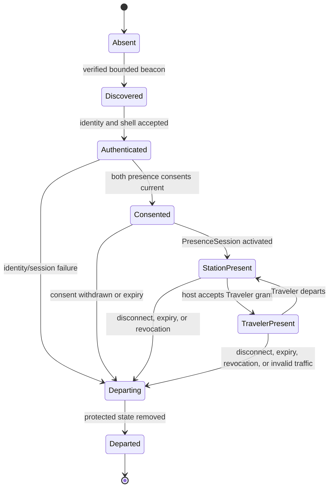

# Virtual Realm Cityform Encounter Runtime

This page turns the public-shell, SecureMesh, and docking architecture into
three independently releasable runtime milestones. M4 proves that another
machine can render a complete public Cityform without receiving private data.
M5 adds authenticated station presence and host-authoritative Travelers. M6
lets Cityforms approach like people, dock, and build one capability-bound road.

The milestones do not create a permanent global map, trust-by-proximity,
third-person play, remote Operations View, or a transport for private source.
The Traveler remains grounded first person throughout discovery, encounter,
Cityform motion, arrival, docking, traversal, and revocation.

## Current implementation boundary

The accepted M0 catalog already freezes the public shell, presence, Traveler,
pose, rendezvous, docking, bridge, epoch, observation, claim-axis, signature,
and safe-text contracts. M1B independently compiles public and refinement
packages, and M1C compiles public Storylets and reviewed station form.

The shipping application does not yet implement public-shell loading, presence,
Traveler hosting, rendezvous, docking, bridge activation, or encounter
rendering. `webgpu-os/apps/the-virtual-realm/` currently has a contract catalog,
not a `VirtualRealmEntry` runtime. M4-M6 therefore add runtime peers and runtime
receipts without changing the accepted 109-contract catalog or pretending the
later milestones are already present.

## Milestone separation

| Milestone | New capability | Deliberate stopping point |
| --- | --- | --- |
| M4 | Verify, cache, preview, publish, and render independently compiled public shells | No authenticated remote Traveler and no network bridge |
| M5 | SecureMesh observation, mutual presence, remote public shell, station-only Traveler, host-authoritative movement | No Cityform approach, RendezvousFrame, docking, or bridge |
| M6 | Station-mediated Cityform locomotion, temporary rendezvous, deterministic docking, directional bridge, shared encounter Storylets | No private refinement delivery or permanent global coordinates |

Each milestone has an off switch. Disabling M4 leaves the M3 private city.
Disabling M5 leaves local SecureMesh available through existing non-Realm
surfaces. Disabling M6 returns to station-only M5 presence.

## Truth and authority planes

| Plane | Owner | Encounter output |
| --- | --- | --- |
| Public appearance | Explicit owner publication plus RealmForge public compiler | Signed complete public shell |
| Identity | Realm Passport and trust policy | Verified opaque participant reference |
| Transport | SecureMesh and RealmLink | Ordered route/session observations |
| Presence | Mutual consent policy | Active bounded PresenceSession |
| Traveler movement | Destination host | Signed authoritative Traveler pose |
| Cityform locomotion | Owning Realm authority | Signed external pose transition |
| Rendezvous | Both participating Realms | Temporary federated frame and epoch |
| Capability | Destination OS authority per direction | Exact grant, scope, lifetime, and epoch |
| Bridge | Both clients plus deterministic compiler | Matching semantic digests and active bridge epoch |
| Presentation | Virtual Realm runtime | Reversible shell, Traveler, train, gate, and bridge state |

Presentation never writes upward into identity, consent, capability, transport,
pose, or bridge authority. A visible Cityform is not trusted. A visible gate is
not open. Proximity is only eligibility to negotiate.

## Flat composition

`VirtualRealmEntry` remains the only runtime composition root. It creates or
receives every concrete service and injects narrow ports into flat peers.

```text
VirtualRealmEntry
  -> PublicShellPackageVerifier
  -> PublicArchetypeRegistry
  -> PublicShellCache
  -> PublicShellSceneAssembler
  -> PublicPresencePublisher
  -> SecureMeshStationObservationPort
  -> StationStateReducer
  -> PresenceBeaconVerifier
  -> PresenceSessionReducer
  -> TravelerAppearanceVerifier
  -> TravelerPresenceReducer
  -> TravelerMovementIntentPort
  -> HostTravelerMovementAuthority
  -> TravelerPoseProjector
  -> RealmCoordinatePolicyVerifier
  -> CityformLocomotionProposalAdapter
  -> CityformPoseReducer
  -> RendezvousFrameReducer
  -> DockingCoordinator
  -> BridgeRecipeCompiler
  -> LocalBridgeHalfBuilder
  -> BridgeDigestCoordinator
  -> BridgeEpochReducer
  -> EncounterStoryletAdapter
  -> EncounterDisposalCoordinator
```

No peer constructs, imports, starts, stops, or disposes another concrete peer.
Network peers return records, never renderer objects. Render peers receive
verified semantic snapshots, never sockets, keys, capabilities, mutable
sessions, or source handles.

## Supplemental runtime receipts

M4-M6 need operational evidence that does not belong in the frozen semantic
wire catalog. These records live in a separate opt-in runtime catalog and bind
the accepted M0 records by digest.

| Record | Purpose |
| --- | --- |
| `RealmPublicShellLoadReceiptV1` | Package, signature, closure, compatibility, quota, archetype, and resource acceptance |
| `RealmPublicShellCacheReceiptV1` | Cache key, origin identity, expiry, replacement, pin, and disposal result |
| `RealmPublicPresencePublicationReceiptV1` | Exact explicit public inputs, schedule bucket, payload digest, and send result |
| `RealmPresenceActivationReceiptV1` | Beacon, identity, both consent receipts, shell, policy, and active epoch |
| `RealmTravelerHostPoseReceiptV1` | Intent range, collision/navigation decision, pose sequence, correction, and signature |
| `RealmCoordinateCertificationReceiptV1` | CPU/GPU frame transforms, quantization, rebase, error bounds, and tested subsystems |
| `RealmCityformLocomotionProposalV1` | Powerless owner request for approach, stop, separate, or return |
| `RealmCityformLocomotionReceiptV1` | Owning authority's admitted pose transition and safety envelope |
| `RealmRendezvousActivationReceiptV1` | Participants, coordinate policy, frame, pose heads, epoch, and signatures |
| `RealmBridgeHalfBuildReceiptV1` | Local socket, recipe, semantic output, collision/navigation, budget, and cleanup root |
| `RealmBridgeActivationReceiptV1` | Offer, grants, recipe, both digests, epoch, interaction install, and activation barrier |
| `RealmEncounterDisposalReceiptV1` | Ordered rejection, unload, cache, GPU, audio, object-ID, and subscription cleanup |

These receipts are exact-key, versioned, bounded, canonically ordered, and
externally signed where authority is claimed. They cannot carry secret keys,
capability tokens, private source, concrete service handles, executable
content, or arbitrary URLs.

## M4 public-shell runtime

M4 proves the privacy-preserving visual product before any authenticated
Traveler exists.

### Explicit public input

A public shell is compiled from an owner-controlled public appearance source:

- public Cityform name and safe-text identity label;
- application-shipped hull, territory silhouette, façade, station, weather,
  material, light, and motion archetype IDs;
- bounded public transforms and parameters;
- declared public station sockets and public destination categories;
- renderer, protocol, accessibility, and HLOD profiles;
- optional public Storylet and Genesis-appearance extension IDs;
- issue, expiry, publisher, and external signature references.

The compiler does not read the private bake and then redact it. Private file
counts, sizes, packages, paths, topology, coordinates, processes, traffic,
code, glyphs, genomes, learner state, roles, culture, lineage, and activity
cannot influence the public package, its digest, publication timing, public
Storylets, or reference pixels.

### Complete appearance without private transfer

Application-shipped archetypes provide the visual vocabulary. The transported
manifest selects and parameterizes that vocabulary. A receiver can therefore
render a coherent Cityform with hull, skyline, lighting, public station façade,
weather envelope, HLOD, and public approach geometry while receiving no private
interior.

The manifest may not introduce JavaScript, WGSL, shader source, WASM, data URL,
network URL, external font, custom binary decoder, dynamic import, arbitrary
mesh program, private collision/navigation, reversible glyph data, or
unbounded arrays. An unknown archetype or unsupported version produces a safe
authenticated beacon or station-board entry, never guessed geometry.

### Verification order

`PublicShellPackageVerifier` performs all checks before scene construction:

1. Envelope size, exact keys, type, version, canonical encoding, and numeric
   finiteness.
2. Publisher identity, external signature, issue time, expiry, replay policy,
   and revocation state.
3. Manifest digest, resource dependency closure, per-resource digest, and
   audience variant.
4. Renderer/protocol compatibility and application-shipped archetype presence.
5. Transform, count, text, HLOD, material, animation, memory, GPU, and cell
   quotas.
6. Public socket uniqueness, bounds, direction, collision, navigation, and
   accessibility closure.
7. Storylet catalog safety and public-only dependency closure.
8. Optional public Genesis extension independence and compatibility.

Only a successful load receipt enters `PublicShellCache`. The scene assembler
consumes the verified normalized product, not hostile input bytes.

### Cache and lifecycle

The cache key includes publisher identity, shell revision, manifest digest,
renderer profile, archetype catalog revision, and policy revision. Expiry,
identity revocation, catalog replacement, policy replacement, quota change, or
digest mismatch makes an entry unusable. Entries may remain dormant on disk,
but only current re-verification can stage them into a session.

CPU records, GPU buffers, textures, collision, navigation, object IDs, audio,
Storylet resources, observers, and cache pins have separate owners and exactly
one disposal path. A failed partial load releases every acquired resource in
reverse dependency order.

### Public publication discipline

`PublicPresencePublisher` accepts only the explicit public source and a
publication policy. It emits on owner action or an approved fixed/bucketed
schedule. Private activity cannot trigger or delay publication. The
noninterference harness runs paired private worlds with identical public input
and requires identical manifests, semantic scene, public Storylets, publication
decisions, payload-size class, and reference pixels within the accepted visual
tolerance.

### M4 slices

| Slice | Build | Gate |
| --- | --- | --- |
| M4A | Supplemental runtime receipts and public-runtime registry | Original 109-contract catalog remains byte-identical and in original order |
| M4B | Verifier, archetype registry, normalized shell store | Malformed, oversized, executable, URL-bearing, unknown, stale, and revoked packages fail before allocation |
| M4C | Cache, loader, scene assembler, disposal | Load/replace/expire/fail/device-loss cycles return CPU/GPU/resource counts to baseline |
| M4D | Public presence publisher and controls | Paired private-change noninterference produces identical public products and schedule decisions |
| M4E | Public Storylet cache and local preview | Data-only public Storylets use public facts only and grant no authority |
| M4F | Operations/network capture/privacy gate | Local Operations records and private sentinels are absent from packages, captures, logs, pixels, and timing decisions |

M4 can render a verified shell in an isolated local preview and cache it for a
future encounter. It does not authenticate or materialize another person.

## M5 SecureMesh station runtime

M5 binds real network state to the SecureMesh Exchange. It is deliberately
station-scoped. A remote Cityform may be visible as an accepted public presence,
and an authenticated Traveler may arrive at a declared station gate, but no
RendezvousFrame or bridge exists.

### Observation ingress

`SecureMeshStationObservationPort` adapts disclosed facts from SecureMesh,
RealmLink, identity, trust, capability, and transport services into immutable
ordered `RealmStationObservationV1` records. The adapter owns subscriptions and
source cursors. It never forwards transport objects, keys, raw addresses,
private peer metadata, or mutable sessions.

`StationStateReducer` rejects gaps, duplicates with different digests, stale
epochs, regressions, incompatible shell revisions, events illegal for the
current phase, and fields belonging to a later phase. A gap pauses that peer's
projection and requests a bounded snapshot; it does not invent intermediate
trains or arrivals.

### Presence state machine



The state order is strict:

- discovery permits only a sealed light or safe destination-board item;
- identity verification permits the independently verified public Cityform;
- mutual presence consent permits an active PresenceSession;
- a separate Traveler appearance and presence grant permit arrival;
- no stage grants a capability, RendezvousFrame, bridge, destination interior,
  source reveal, or local Operations record.

### Traveler appearance

`TravelerAppearanceVerifier` accepts only application-shipped body, animation,
material, accessory, and audio archetypes with bounded parameters. The identity
badge is rendered from verified identity evidence and remains distinct from a
safe display name. Unknown or invalid appearance falls back to a standard
authenticated silhouette; it never runs remote content.

Decorative inhabitants, process constructs, Storylet guides, and authenticated
Travelers use different mesh families, object-ID classes, animation language,
audio cues, and semantic labels. A public shell cannot smuggle a Traveler.

### Host-authoritative movement

The visitor sends `TravelerMovementIntentV1`, which contains bounded input and
claims no final position. `HostTravelerMovementAuthority` validates:

- active presence grant and presence-session epoch;
- sequence, rate, nonce, issue time, expiry, and participant signatures;
- host frame, station-only scope, allowed arrival gate, and permitted public
  destinations;
- speed, acceleration, stance, collision, navigation, gate, and safety rules;
- policy limits and any deterministic correction.

The host emits `TravelerPoseV1`. Picks, interactions, Code Matter requests,
Storylet facts, and other observers consume only host-authoritative poses.
Prediction is visual and reconciles without becoming an authority source.

### Station presentation

| Network fact | World product |
| --- | --- |
| Discovery | Distant signal or sealed board item |
| Identity and shell accepted | Verified Cityform silhouette at the station encounter horizon |
| Direct route | Express track class |
| Relay route | Connecting service and switching class |
| Route degraded | Signal instability with explicit measured/estimated quality |
| Backpressure | Bounded platform or freight congestion |
| Verified content chunk | Sealed freight object, not readable data |
| Consent active | Arrival gate eligibility |
| Traveler grant active | Authenticated Traveler at the exact gate |
| Disconnect/revocation | Immediate interaction rejection followed by departure presentation |

The station animation reflects the observation after it exists. It cannot call
connect, consent, grant, route, or revoke merely by playing.

### M5 slices

| Slice | Build | Gate |
| --- | --- | --- |
| M5A | SecureMesh observation port, cursor, snapshot, station reducer | Ordered replay and reordered delivery converge; gaps never fabricate state |
| M5B | Beacon, identity, shell, consent, and PresenceSession verification | No presence before exact identity plus both current consents |
| M5C | Station public Cityform staging and route presentation | Every visible state maps to an admitted station observation and truth tuple |
| M5D | Traveler appearance, identity badge, grant, arrival, and departure | No Traveler before verified appearance and active host-bound grant |
| M5E | Intent port, host movement authority, pose projector, reconciliation | Client intent cannot self-assert position, gate passage, pick, or interaction |
| M5F | Arrival/degradation/denial/departure Storylets | Storylets wait for terminal observations and cannot keep a peer alive |
| M5G | Expiry, disconnect, identity revocation, disposal, soak, Operations exclusion | Protected state disappears first; identical local input yields byte-identical local Operations products under any remote population |

## M6 Cityform locomotion and rendezvous

M6 makes Cityforms move like people without giving the Traveler an arcade
vehicle or third-person camera.

### Station-mediated macro locomotion

The owner walks to the SecureMesh station, selects a verified public presence
or rendezvous invitation, and submits a bounded
`RealmCityformLocomotionProposalV1`. Valid actions are:

- `approach` an authenticated compatible presence;
- `hold` at a certified separation;
- `dock` only through the later docking protocol;
- `separate` after traversal and bridge closure;
- `return` to the owner's prior admitted virtual pose.

The proposal names the local Realm, target opaque presence, current pose head,
policy, speed/acceleration class, collision envelope, expiry, and idempotency
key. It grants nothing. The owning Realm authority validates the request and
emits a signed `RealmCityformLocomotionReceiptV1` plus new `RealmPoseV1`
observations.

The private city's local coordinates, collision, navigation, ECS, camera, and
Operations projection do not move. Only the Cityform's external virtual pose
changes. The grounded Traveler perceives motion through station windows,
horizon parallax, inertial presentation, sound, signs, and Storylets. Reduced
motion replaces sweeping parallax with bounded transitions and explicit spatial
summaries.

There is no free steering, GPS, hidden physical location, global coordinate
service, remote control of another Cityform, or Operations View locomotion.

### Coordinate certification

Approach cannot enable until one coordinate policy passes the entire stack:

- hierarchical semantic coordinates and temporary federated frames;
- CPU fixed/quantized authoritative pose representation;
- camera-relative GPU transforms;
- floating-origin rebase thresholds and barriers;
- maximum certified separation, velocity, acceleration, and interpolation;
- deterministic bridge endpoint quantization;
- error bounds for rendering, culling, collision, navigation, picking, audio,
  object IDs, Chronicle, Traveler poses, and bridge digests.

A rebase changes presentation coordinates only. It cannot change semantic pose,
object identity, collision result, navigation reachability, pick target, audio
relationship, Storylet fact, or canonical bridge recipe.

### Rendezvous activation

Two compatible clients derive a temporary frame from signed virtual data:

1. Both PresenceSessions are current and name the same participant set.
2. Both public shells and coordinate-policy versions are accepted.
3. Each owner or policy admits approach through a locomotion receipt.
4. The peers exchange current signed `RealmPoseV1` heads and nonces.
5. Canonical participant order, frame seed, origin rule, quantization, bounds,
   and expiry produce one `RendezvousFrameV1`.
6. Both authorities sign `RealmRendezvousActivationReceiptV1` for one monotonic
   rendezvous epoch.
7. Public shells stage in that frame and interpolate only within certified
   error and freshness limits.

Loss of consent, identity, compatible pose, coordinate policy, expiry, or
transport begins revocation. Proximity alone never activates a frame.

## M6 deterministic docking

### Offer and directional grants

The requesting Traveler uses a local station console in first person. The
console submits `DockingOfferV1`; the offer binds both identities, direction,
public sockets, requested action/capability, active presence and rendezvous
epochs, link transcript, shell revisions, compiler versions, and non-reusable
generation nonce. It is visibly proposed and opens nothing.

Each direction is authorized independently:

```text
A -> B = A request
       intersection B public offer
       intersection B current Realm policy
       intersection B current WebGPU OS authority
       intersection mutually supported protocol
```

`DockingGrantV1` binds the exact offer digest, destination IDs, capability
intersection, limits, policy, current epochs, and prospective bridge epoch. A
grant in one direction never implies the reverse direction.

### Canonical bridge recipe

`BridgeRecipeCompiler` is pure and deterministic. Its inputs are only verified
semantic records:

- exact offer and required directional grant digests;
- declared public endpoint sockets;
- active PresenceSession and RendezvousFrame epochs;
- proposed generation-nonce digest and prospective bridge epoch;
- coordinate and quantization policy;
- safe application-shipped bridge archetype and compiler versions;
- width, clearance, collision, navigation, traversal, accessibility, and
  presentation classes.

It emits a canonical recipe and semantic output plan. It does not read either
private city, choose a capability, query a network, allocate GPU objects, or
compare floating-point render buffers.

### Independent bridge halves

Each client builds and verifies its local half against its own public socket:

1. Stage geometry, collision, navigation, occlusion, audio, object IDs, signs,
   interaction gates, and cleanup ownership outside the active scene.
2. Quantize endpoint, span, clearance, and portal records under the shared
   coordinate policy.
3. Verify local socket revision, active bake, shell, route direction, resource
   quotas, accessibility, and capability preconditions.
4. Produce `RealmBridgeHalfBuildReceiptV1` and `BridgeDigestV1` over semantic
   outputs, not driver-dependent GPU bytes.
5. Exchange and compare both signed digests.
6. Activate only after the signed `BridgeEpochV1` binds the same offer, grants,
   recipe, digests, participants, key generation, policy, and epoch.
7. Install collision, navigation, interaction, and visible track together at
   one logical/frame barrier.

A mismatch, timeout, stale shell, rebase failure, device loss, quota failure,
or revoked grant disposes the staged half and leaves station presence intact.

### Traversal and trains

The bridge is a real admitted navigation path. A Traveler crosses in first
person under a host-authoritative presence grant whose scope includes the
active bridge epoch and declared public destination. Trains and packet pulses
show only disclosed route state. A train is not proof that its payload is
readable; verified chunks remain sealed freight unless a separate action is
authorized.

M6 V1 reaches public destinations declared in the accepted shell. Private
access-refinement delivery is deferred even though M1B proves its package
format. No hidden private interior becomes traversable in M6.

### Shared Storylets

An encounter Storylet synchronizes semantic facts, never presentation frames.
Each participant independently selects the same accepted definition and binds:

- Storylet definition and catalog digest;
- participant set and roles;
- PresenceSession, RendezvousFrame, and Bridge epochs where applicable;
- canonical logical clock and source-sequence watermarks;
- offer, grant, recipe, digest, and terminal-result evidence;
- deterministic instance and decision IDs.

Arrival, inspection, negotiation, denial, opening, crossing, degradation,
revocation, and departure may have authored presentation. Security changes
occur before the Storylet explains them. A disconnected peer cannot be held in
the world because a Storylet still has a departure animation to play.

## Optional Genesis encounter extension

Genesis is an opt-in Living Digital World certification track bound to the same
M4-M6 milestones. It uses a signed sidecar extension rooted in explicit public
Genesis appearance input; it never widens the accepted public-shell manifest or
derives public ecology from private ecology.

| Milestone | Optional Genesis product |
| --- | --- |
| M4-GE | `PublicGenesisShellExtensionManifestV1` with reviewed public motifs, facilities, status channels, expiry, and independent noninterference evidence |
| M5-GE | Station-only exchange of bounded attributed cultural motifs and public ecology status under consent and retention policy |
| M6-GE | Capability-bound proposals to declared public factory or role sockets after bridge activation |

Public Genesis state cannot include private genome, epigenome, homeostasis,
resource inventory, candidate queue, role graph, culture store, lineage,
source, internal topology, learner state, or activity timing. Cultural exchange
requires publication, attribution, consent, bounded size, mutation provenance,
retention, withdrawal, and expiry. Receiving a motif records receipt; it does
not adopt the motif as fact or belief.

Remote factory and role operations remain typed proposals. They bind direction,
public socket, current PresenceSession, RendezvousFrame, bridge and capability
epochs, policy, expiry, rate, idempotency, and expected result class. The remote
host decides and emits a terminal observation. The caller cannot activate a
candidate, assign a role, mutate culture, mint a Soul Seed, or infer private
state through presentation.

## Operations View structural exclusion

The local Operations View has no encounter input port. Its closed schema admits
only the accepted local private bake, local layout, loaded local cells, local
authorized deltas, local owner identity, and local operator capability.

The following never enter its CPU snapshot, ECS, HLOD, culling, GPU resources,
object-ID buffer, picking, minimap, audio, accessibility tree, capture, or
telemetry:

- public shells and public Genesis extensions;
- peer, Cityform, Traveler, appearance, and identity records;
- PresenceSession, external RealmPose, and movement records;
- RendezvousFrame, docking, grant, capability, bridge, route, and train records;
- remote Storylets, culture, roles, lineages, factories, and public status;
- remote coordinate, collision, navigation, destination, and glyph data.

The local SecureMesh building and content-free local boundary status may remain.
For identical declared local inputs, every remote population, movement,
connection, and failure sequence must produce byte-identical local Operations
snapshots and minimaps.

## Revocation and disposal transaction

Security state changes before presentation:

1. Reject new protected messages, movement, picks, actions, chunks, and source
   requests at the owning authority boundary.
2. Advance or close the relevant capability, bridge, rendezvous, presence, and
   key epochs.
3. Invalidate stale packets, keys, grants, cached refinement references, and
   host pose scopes.
4. Remove protected interaction and picking.
5. Remove protected navigation, collision, route, and destination bindings.
6. Stop traffic projection, trains, shared Storylets, and remote live deltas.
7. Remove the bridge and Traveler, then release GPU, audio, object-ID, observer,
   cache-pin, and CPU resources exactly once.
8. Retain the sanitized public shell only while its independent presence/cache
   policy permits it; otherwise dispose it too.
9. Emit `RealmEncounterDisposalReceiptV1` and Chronicle semantic closure without
   secret or private payload data.

If only M6 fails, the reducer returns to M5 station presence. If M5 authority
also fails, it returns to an authenticated shell or absence as policy permits.
The local M3 city remains running throughout.

## Recovery rules

- A device loss freezes interaction immediately, retains semantic authority in
  CPU stores only where policy permits, and rebuilds GPU resources from verified
  products after recovery.
- No bridge interaction resumes until collision, navigation, picking, audio,
  both digests, and active epochs reverify.
- A network reconnect does not reuse a closed PresenceSession,
  RendezvousFrame, bridge epoch, nonce, movement sequence, or key generation.
- A public shell cache hit still rechecks expiry, identity, revocation, policy,
  archetype revision, and closure.
- Chronicle replay reconstructs semantic encounter history in first person but
  sends no network action and resurrects no live Traveler or bridge.
- Shutdown unsubscribes ingress first, closes proposal intake, rejects protected
  operations, disposes encounter state, then releases shared render resources.

## Performance and privacy budgets

Every profile fixes bounded ceilings for:

- beacons, peers, shells, shell cells, HLOD nodes, public Storylets, Travelers,
  movement intents, pose updates, routes, trains, rendezvous frames, offers,
  grants, bridge candidates, and Genesis extension records;
- canonical bytes, verification work, signatures, memory, cache, GPU buffers,
  textures, audio voices, object IDs, collision bodies, navigation portals,
  worker queues, per-frame deltas, and disposal backlog;
- shell prefetch distance and time, stale windows, interpolation history,
  backpressure, expiry sweeps, and Chronicle retention.

Load sheds in semantic order: stop new discovery, reduce distant shell LOD,
coalesce measured traffic, pause optional Storylets, reject new rendezvous, and
retain active security/control records. It never drops revocation, expiry,
identity, capability, bridge-epoch, movement-authority, or cleanup work.

Network captures and logs are inspected for private sentinels, paths, source,
topology, process data, Operations snapshots, keys, tokens, exact hidden counts,
eligibility facts, genomes, culture, lineage, and error-message reflection.

## Planned test layout

```text
tests/virtual-realm/
  m4-public-shell-contracts.test.js
  m4-public-shell-hostile.test.js
  m4-public-shell-cache-lifecycle.test.js
  m4-public-noninterference.test.js
  m4-public-storylets.test.js
  m4-operations-network-exclusion.test.js
  m5-station-observation-ordering.test.js
  m5-presence-session.test.js
  m5-traveler-appearance.test.js
  m5-host-authoritative-movement.test.js
  m5-station-storylets.test.js
  m5-expiry-revocation-disposal.test.js
  m6-coordinate-certification.test.js
  m6-cityform-locomotion.test.js
  m6-rendezvous-frame.test.js
  m6-docking-authority.test.js
  m6-bridge-determinism.test.js
  m6-bridge-revocation.test.js
  m6-shared-storylets.test.js
  m6-genesis-encounter-extension.test.js
  m6-operations-noninterference.test.js
  m6-device-loss-recovery.test.js
  m6-encounter-soak.test.js
```

Every test is browser-native and served over HTTP. No Node.js or npm harness is
introduced.

## M6 slices

| Slice | Build | Gate |
| --- | --- | --- |
| M6A | Coordinate policy and cross-subsystem certification | Maximum-separation rebase changes no semantic result or digest |
| M6B | Station-mediated Cityform locomotion and pose reducer | Only owning authority moves a Cityform; internal local world stays invariant |
| M6C | Rendezvous negotiation, frame activation, pose interpolation | Both clients agree on frame/epoch; stale or mismatched state fails closed |
| M6D | Docking offer and independent directional authority | No proximity, reverse grant, cached grant, or visible socket implies access |
| M6E | Canonical recipe, local half builds, digest agreement, activation barrier | Both semantic digests match and all collision/navigation/interaction resources activate together |
| M6F | First-person traversal, trains, shared Storylets, optional Genesis proposals | Host authority and exact current epochs gate every protected operation |
| M6G | Revocation, separation, reconnect, recovery, soak, privacy, Operations exclusion | Protected work stops first; resources plateau; M5 remains usable after M6 rollback |

## Approval boundary

M4, M5, and M6 require independent approval. M4 approval does not authorize a
network connection. M5 approval does not authorize approach. M6 approval does
not authorize private refinement delivery, arbitrary remote content, permanent
global coordinates, background presence after shutdown, or any overview of a
remote Cityform.

The first multiplayer release is accepted only when two users can see complete
independently prebaked Cityforms, meet through real SecureMesh state, appear as
authenticated host-authoritative Travelers, approach through virtual
rendezvous, build the same semantic bridge independently, cross one permitted
public route, revoke it, and retain no protected interactive residue.

First Shard content remains excluded. No source, test, architecture, mechanic,
art direction, runtime, or dependency from that application participates in
the encounter runtime.

## See also

- [Cityforms and SecureMesh](cityforms-securemesh.md)
- [World districts and facilities](world-districts.md)
- [M3 living city runtime](m3-living-city-runtime.md)
- [Security and privacy](security-privacy.md)
- [Storylets](storylets.md)
- [Rendering and experience](rendering-experience.md)
- [Implementation roadmap](implementation-roadmap.md)
- [Certification plan](certification-plan.md)
