# Virtual Realm Cityforms and SecureMesh

Each computer appears as a mobile Cityform. SecureMesh becomes that city's central train station and routing hub. The station presents real network state without replacing SecureMesh or weakening its trust model.

## Cityform and Traveler

A **Cityform** is the user's macro-scale embodiment. It carries a signed public skyline, station gates, appearance revision, and virtual pose. A **Traveler** is the user's human-scale first-person presence inside a Cityform or an authorized destination.

A public Cityform is a complete-looking representation. It is not an exact reconstruction of the private PC. Exact private geometry would leak file counts, sizes, types, adjacency, activity, and change timing.

Traveler presence uses a separately signed safe appearance and host-authoritative movement protocol. Remote people are rendered only from application-shipped Traveler archetypes, allowlisted materials and accessories, authenticated identity evidence, and mutual presence consent. A display name is safe text and never identity proof. The visitor sends bounded movement intents; the host Cityform validates navigation, collision, gates, presence scope, rate, expiry, and active epochs, then signs the authoritative pose projection. Client prediction is presentation-only.

## SecureMesh Exchange

The station is always a major landmark. Opening SecureMesh powers its live systems.

| Real network state | Station presentation |
| --- | --- |
| Discovery | Distant signal or destination-board entry |
| Authenticated identity | Remote Cityform becomes visible in the grounded first-person encounter presentation |
| Mutual presence consent | Traveler may appear at arrivals |
| Network protocol | Platform |
| Direct route | Express track |
| Relayed route | Connecting service or switching yard |
| Supernode | Major interchange |
| Provider or DHT discovery | Timetable or freight directory |
| Verified chunk | Sealed freight container |
| Packet flow | Train or track pulse |
| Latency | Journey time and pulse spacing |
| Jitter or packet loss | Signal instability |
| Backpressure | Platform congestion |
| Disconnect | Departure and track shutdown |
| Capability revocation | Route rejects traffic, gate closes, and track retracts |

The masterserver acts as a signal tower. It introduces peers and forwards signaling. It does not own identities, group data, trust decisions, Cityform poses, or world state.

## Presence stages

Discovery, identity, presence, and authority remain separate:

1. An unverified discovery signal may create a distant light or board entry.
2. Cryptographic identity verification permits the public Cityform shell to appear in the grounded first-person encounter presentation.
3. Mutual presence consent permits the Traveler to materialize.
4. Capability negotiation determines which destinations and services are available.
5. A bridge appears only after both clients accept the same recipe and active grant.

An authenticated Traveler receives no private authority automatically.

## Public shell transfer

A remote client must receive some representation to render a unique Cityform. The safe design ships universal architectural archetypes with the application and transfers a small signed `PublicRealmShellManifestV1` containing:

- Safe archetype identifiers.
- Bounded transforms.
- Public material parameters.
- Public HLOD references.
- Bounds and public station gate IDs.
- Protocol and renderer compatibility.
- Signature, publisher identity, version, and expiry.

The shell contains no arbitrary remote JavaScript, shaders, WASM, URLs, filesystem paths, private collision, private navigation, source-derived glyphs, or executable procedural assets.

## Local Operations View boundary

SecureMesh and the Local City Operations View never share a scene projection. The Operations View and its minimap are derived only from the owner's accepted private bake, local layout, admitted local cells, authorized local deltas, and current local operator authority.

Even after authentication, mutual presence consent, approach, docking, or bridge activation, a connected Cityform contributes no shell, pose, HLOD, route, geometry, collision, navigation, object ID, pick, name, destination, Traveler, rendezvous, bridge, or minimap record to the Operations View. The local SecureMesh Exchange remains local geography. A local platform may expose a content-free boundary status, but it never maps the remote Cityform or route beyond the local socket.

Remote Cityform visibility, Traveler arrival, rendezvous approach, and bridge traversal therefore remain grounded first-person experiences. Opening the Operations View cannot inspect, follow, frame, or manage a connected Cityform.

## Presence modes

- `invisible`: no public beacon or shell.
- `approved-contacts`: only explicitly approved identities receive the beacon.
- `public`: a rate-limited public beacon and sanitized shell are available.

Private activity does not alter the payload, digest, skyline, Storylet package, or scheduled update decision of the dedicated public beacon and public-shell publication channel. Public presence uses owner-selected public inputs, fixed contract envelopes where required, and bucketed publication timing.

This is not a claim that the entire network hides traffic analysis. SecureMesh session establishment, transport keepalives, route use, disconnects, congestion, and public interactions can expose their documented timing and size classes to network participants or observers. V1 deliberately hides private filesystem, source, process, topology, and private-activity changes from public presence publication. A future traffic-flow confidentiality feature would require a separately approved padding, cover-traffic, relay, and anonymity design.

## Federated rendezvous frames

The first release does not invent a permanent global coordinate authority. It uses temporary federated encounter spaces.

Cityform movement is a station-mediated owner proposal, not an arcade driving
mode. The owner remains a grounded first-person Traveler inside their city,
uses the SecureMesh Exchange to request `approach`, `hold`, `separate`, or
`return`, and waits for the owning Realm authority's signed pose transition.
Only the Cityform's external virtual pose changes; its internal bake, local
coordinates, collision, navigation, ECS, Traveler camera, and owner-private
Operations projection remain fixed. The detailed lifecycle and gates are in
[Cityform encounter runtime](cityform-encounter-runtime.md).

1. Each Cityform owns and signs a virtual `RealmPose`.
2. The pose uses virtual coordinates, never GPS or hidden network location.
3. Discovery permits two compatible clients to derive the same `RendezvousFrame`.
4. Grounded first-person encounter receivers interpolate public poses as Cityforms approach; local Operations View projectors never receive them.
5. Proximity permits negotiation only.
6. Successful docking locks the relative pose for one bridge epoch.
7. Traversal closes and the bridge retracts before either Cityform resumes movement.

A permanent shared Digital World may arrive later behind a separate spatial-authority and consensus contract.

## Docking state machine

```mermaid
stateDiagram-v2
  [*] --> Absent
  Absent --> Discovered: signed public beacon
  Discovered --> Authenticated: identity verified
  Authenticated --> PresenceConsented: mutual presence consent
  PresenceConsented --> StationPresent: PresenceSession active and shell accepted
  StationPresent --> TravelerPresent: TravelerPresenceGrant active
  TravelerPresent --> StationPresent: Traveler departs; presence remains
  TravelerPresent --> Approaching: rendezvous accepted
  Approaching --> Negotiating: station alignment
  Negotiating --> Baking: directional grants active
  Baking --> BridgeActive: bridge digest agrees
  BridgeActive --> Degraded: route quality declines
  Degraded --> BridgeActive: route recovers
  Approaching --> Revoking: rendezvous cancelled
  Negotiating --> Revoking: offer, grant, or consent invalid
  Baking --> Revoking: digest, expiry, or disconnect failure
  BridgeActive --> Revoking: close, expiry, revocation, or disconnect
  Degraded --> Revoking: close, expiry, revocation, or disconnect
  Revoking --> TravelerPresent: bridge removed; presence session remains active
  PresenceConsented --> Departing: consent withdrawn or session fails
  StationPresent --> Departing: consent withdrawn, expiry, or disconnect
  TravelerPresent --> Departing: consent withdrawn, expiry, or disconnect
  Revoking --> Departing: presence session is no longer active
  Authenticated --> Departing: disconnect or identity revocation
  Departing --> Departed: Traveler and protected state removed
  Departed --> [*]
```



## Protocol contracts

### `PresenceBeaconV1`

- Opaque Realm identity reference.
- Public shell digest.
- Supported protocol versions.
- Presence mode and rendezvous intent.
- Expiry and signature.

### `PresenceSessionV1`

- Authenticated local and remote Realm identities.
- Mutual presence-consent receipts.
- Verified public shell and Traveler appearance IDs.
- Public station gates, rate limits, policy revision, expiry, and monotonic presence-session epoch.

The presence session permits station-scoped arrival before any RendezvousFrame or bridge exists. Approach and docking add their own conditional epochs later.

### `PublicRealmShellManifestV1`

- Sanitized shell recipe.
- Bounds, HLOD, and public gate IDs.
- Safe materials and archetype versions.
- Renderer compatibility, expiry, and signature.

### `TravelerAppearanceManifestV1`

- Verified Traveler identity reference and separately rendered identity badge.
- Safe display-name text reference.
- Application-shipped body, animation, material, and accessory archetypes.
- Bounded public appearance parameters, version, expiry, and signature.

### `TravelerPresenceGrantV1`

- Authenticated Traveler, home Realm, and host Realm identities.
- Active PresenceSession and mutual consent receipts.
- Arrival gate, permitted public destinations, pose limits, expiry, and mutual signatures.
- RendezvousFrame and rendezvous epoch only after approach begins.
- Bridge epoch only while bridge-scoped presence is active.

### `TravelerPoseV1`

- Host-authoritative presence-grant ID, host frame, consumed movement-intent sequence, monotonic host pose sequence, logical tick, quantized pose, bounded motion, locomotion state, active presence and conditional bridge epochs, correction state, expiry, and host signature.

### `TravelerMovementIntentV1`

- Visitor-signed bounded input, last acknowledged host pose, current presence scope and epochs, expiry, and nonce. It claims no final position or authority.

Expiry, consent withdrawal, disconnect, identity revocation, bridge revocation, or invalid repeated movement traffic removes the Traveler. A departure Storylet may explain the removal after security state has already changed.

### `DockingOfferV1`

- Both Realm identities.
- Direction of requested access.
- Requester source and requested destination public gate IDs.
- Requested route kind and capability.
- Active PresenceSession ID and epoch.
- Active RendezvousFrame ID and rendezvous epoch.
- Link transcript, both shell revisions, protocol and bridge-compiler versions.
- A non-reusable offer nonce and separate proposed bridge-generation nonce.
- Expected previous bridge epoch only during renegotiation, plus issue time and expiry.

The offer is pre-bridge. It does not claim a current new bridge epoch and grants no authority.

### `DockingGrantV1`

- Strict capability intersection.
- Permitted destination IDs.
- Rate, lifetime, refinement, and revocation policy.
- Exact offer digest, identities, direction, gates, link transcript, shell revisions, active PresenceSession and RendezvousFrame epochs, policy revision, and capability epoch.
- Proposed bridge-generation nonce digest, optional previous bridge epoch, and newly allocated prospective bridge epoch.
- External authority signature envelope.

### `BridgeRecipeV1`

- Endpoint sockets.
- Active PresenceSession and RendezvousFrame epochs plus the generation-nonce digest.
- Rendezvous coordinate policy.
- Procedural seed.
- Shipped archetype and compiler versions.
- Width, clearance, traversal, and presentation class.
- Bridge epoch.

The bridge becomes active only after every required directional grant, the canonical recipe, both semantic bridge digests, and the signed `BridgeEpochV1` activation record agree.

### `BridgeDigestV1`

Both clients hash the canonical recipe and semantic output records. They do not compare floating-point GPU bytes as authority.

### `BridgeEpochV1`

The activation record binds the PresenceSession, RendezvousFrame, offer, directional grants, proposed generation-nonce digest, recipe, both bridge digests, participant set, key generation, policy, and newly allocated epoch. Every protected message, refinement, and route state then binds that active epoch. Revocation advances the epoch and rejects stale packets, keys, chunks, grants, and reconnect attempts.

## Directional authority

Access from A to B is calculated independently from access from B to A:

```text
A to B = A request
       intersection B offer
       intersection B current realm policy
       intersection B current OS authority
       intersection mutually supported protocol
```

No permission is inherited from proximity, the reverse lane, visible platforms, earlier sessions, cached shells, or social relationships.

## Revocation ordering

Security state changes before presentation:

1. Kernel or RealmLink revokes the capability.
2. The bridge epoch advances.
3. Protected payloads and stale keys fail.
4. Refinement loading stops.
5. Protected collision, navigation, interaction, and geometry unload.
6. The gate closes and track retracts.
7. The sanitized public skyline may remain until expiry.

## Existing foundations

- Peer discovery, identity events, presence, and channels: `engine/collab/CollabCore.js`
- Partial mesh and supernode topology: `engine/collab/CollabMeshTopology.js`
- Mesh sessions, metrics, chunks, routes, and carriers: `webgpu-os/drivers/NetworkDriver.js`
- Capability-gated network syscalls: `webgpu-os/kernel/Syscalls.js`
- Signed identities and device grants: `engine/network/realm/identity/RealmPassport.js`
- Capability intersection and transport epochs: `engine/network/realm/link/RealmLink.js`
- Gate policy and quotas: `engine/network/realm/shield/RealmShield.js`
- Verified Realm bundles: `engine/network/realm/capsule/RealmCapsule.js`
- Content-addressed storage: `webgpu-os/storage/RealmContentStore.js`

The browser extension's resident node stores public certificate material but does not provide a persistent private mesh identity. A closed browser or inactive foreground runtime must appear dormant or offline rather than falsely present (Source: `webgpu-os/browser-extension/services/ResidentService.js`; `webgpu-os/drivers/NetworkDriver.js`).

## See also

- [Local City Operations View](local-operator-view.md)
- [Contract catalog](contracts.md)
- [Security and privacy](security-privacy.md)
- [Storylets](storylets.md)
- [Rendering and experience](rendering-experience.md)
- [Cityform encounter runtime](cityform-encounter-runtime.md)
- [World districts and facilities](world-districts.md)
- [Realm Network](../realm-network.md)
