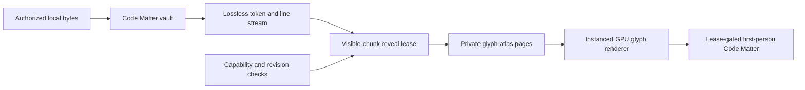

# Virtual Realm Code Matter

Code Matter makes real authorized source and data spatial. It never turns invented glyphs into purported code. Concealment is a presentation state, not a security mechanism.

## Authority states

### Sealed

The system knows that an object exists, but current authority does not permit its protected content.

- A public sealed surface uses generic public-seed seal marks unrelated to private bytes.
- A private local sealed surface may bind a non-reversible visual seal to a local salted commitment.
- The visual language clearly identifies the surface as concealment.
- The surface does not look like readable source.

### Structured

The system may display authorized structure without exact source.

- Real token classes, line grouping, syntax regions, and structural boundaries may appear.
- Protected identifiers, strings, literals, comments, and exact bytes remain hidden.
- Structured inspection requires its own capability.
- Public structured output exists only when its structure was explicitly made public.

### Revealed

The system displays exact authorized bytes.

- Unicode, line endings, byte offsets, and revision identity are preserved.
- Visible chunks stream only near the camera.
- Every chunk binds the Realm, object, revision, chunk index, authority, and reveal lease.
- The renderer verifies source identity before presenting it.
- Reveal requires an object-scoped capability and cannot be inferred from a nearby open door.

## Separate capabilities

The authority model keeps these actions independent:

- Inspect metadata.
- Inspect structure.
- Reveal exact source.
- Execute code.
- Modify code.
- Export code.

The first release implements local read-only reveal. Remote exact-source reveal, execution, modification, and export remain deferred.

## Source flow



Protected source bytes do not enter public bakes, general telemetry, Chronicle records, pick buffers, crash reports, or reusable public atlas pages.

The Local City Operations View and minimap may display only local far/mid aggregate Code Matter state from the verified private bake and authorized deltas. They never open a reveal lease, stream a source chunk, allocate a private glyph page, or render readable code. Exact revealed Code Matter remains a close-range first-person inspection so camera altitude or zoom cannot become a disclosure mechanism.

## Flat runtime ownership

`VirtualRealmEntry` injects these unnested local peers:

| Peer | Single responsibility |
| --- | --- |
| `CodeMatterSourcePort` | Requests only an authorized exact object revision and bounded byte range from WebGPU OS |
| `CodeMatterVault` | Owns local encrypted chunks, content-key epochs, wrapping references, and unavailable-key state |
| `CodeMatterVaultNonceAllocator` | Serializes durable per-key IV reservations and emits nonce-allocation receipts |
| `CodeMatterTokenizer` | Produces lossless revision-bound lines, tokens, byte ranges, and columns |
| `CodeMatterLineStreamer` | Emits only visible chunks admitted by the current reveal lease |
| `CodeRevealLeaseTracker` | Tracks local object, revision, range, capability epoch, expiry, and revocation |
| `CodeMatterPrivateAtlasAllocator` | Owns bounded private glyph pages, reuse barriers, and disposal evidence |

No peer constructs another peer or imports a concrete peer. The vault cannot authorize a reveal. The lease tracker cannot read source. The tokenizer cannot publish or render. The line streamer cannot widen a range. The atlas allocator cannot retain source as a public resource. `RealmGlyphRenderer` consumes verified instances and disposal handles but owns none of those responsibilities.

V1 exact reveal is local-only. These peers do not import SecureMesh, station, docking, bridge, or public-shell modules, and `RefinementReceiver` has no V1 route into the vault or line streamer. Remote exact-source delivery requires a separately approved future contract.

## Code-built three-dimensional form

Code Matter can form the visible body of a three-dimensional object rather than appearing only on a flat screen.

- M3 freezes one `CodeMatterFormBindingV1` policy. Stable authored inspection
  anchors define page-local origin, line axis, advance axis, outward normal,
  plane spacing, maximum extent, continuation sockets, clipping, and semantic
  LOD.
- A structure has a stable authored collision and navigation envelope from the active bake.
- Exact lines are packed by byte-range order into deterministic parallel line
  planes. A bounded 3D ribbon connects page continuations and admitted
  structural relationships. Readable glyphs never ride decorative particles or
  an unconstrained procedural strand.
- In revealed state, every readable glyph maps to exact authorized source bytes, token identity, line and column, byte range, object revision, and reveal lease.
- In structured state, only authorized real structure classes form the object; protected identifiers, values, comments, and bytes do not enter the instances.
- In sealed state, public and unauthorized forms use generic non-readable seal marks that do not encode private bytes, token counts, line counts, adjacency, or update timing.
- Transitioning from architecture to glyph matter changes presentation and streaming detail, not authority. The kernel-approved state controls which representation may exist.
- Token-to-instance placement is deterministic for a source revision and renderer policy, so Chronicle replay can reproduce the semantic form.
- A source revision can refresh the Code Matter skin at a safe projection boundary without moving the district or silently changing stable collision.

The accepted descriptor/chunk/lease records remain unchanged. Runtime sidecars
define `CodeMatterDisclosureProfileV1`, `CodeMatterLanguageProfileV1`,
`CodeMatterFormBindingV1`, `CodeMatterStructuredProjectionV1`,
`CodeMatterGlyphPageManifestV1`, `CodeMatterRevisionSwapReceiptV1`, and
`CodeMatterAtlasDisposalReceiptV1`. They bind exact disclosure fields,
tokenizer/encoding identity, budgets, layout, page ownership, atomic revision
swap, and cleanup without widening the M0 catalog.

This supports the intended effect of walking toward a machine, building, object, or inhabitant and seeing its matter resolve into the real code that constitutes it. When exact source is unavailable, the object remains honestly sealed or structured; invented Matrix-like text is never presented as source.

## Commitments and encrypted chunks

A local exact-source commitment uses a secret nonce and domain separation:

```text
commitment = SHA-256(domain || secretNonce || byteLength || exactBytes)
```

The nonce prevents public dictionary matching. The exact private digest remains local.

If protected chunks need storage or later refinement delivery, use authenticated encryption with:

- AES-GCM-256.
- A unique 96-bit IV for every key and chunk combination.
- Additional authenticated data binding Realm ID, object ID, revision, chunk index, commitment, audience, and capability epoch.
- Audience-specific envelopes and opaque locators.

### Vault key and nonce policy

- `CodeMatterVault` creates a 256-bit AES-GCM content-encryption key with Web Crypto and marks it non-extractable where the browser's durable key store supports that property. A durable wrapping key or platform-protected key-encryption key wraps any persistable content key; plaintext key bytes never enter Realm records, logs, telemetry, or exports.
- Every content key has a random `vaultKeyId` and monotonic `keyEpoch`. A key is scoped to one local vault and disclosure audience, never shared between public and private artifacts.
- Every AES-GCM operation reserves a unique 96-bit IV from an atomic durable per-key allocator before encryption. The V1 IV is a random 32-bit per-key prefix plus a 64-bit unsigned monotonic counter. The allocator transaction durably advances and records the reserved counter before ciphertext publication, so crash recovery can skip unused values but can never reuse one.
- Concurrent workers request disjoint counter ranges through the same serialized allocator. They cannot choose IVs locally.
- `VaultNonceAllocationReceiptV1` binds vault key ID, key epoch, prefix, reserved counter, allocator generation, transaction ID, issue time, and receipt digest. The chunk envelope binds the receipt ID and exact IV.
- If allocator durability, atomicity, monotonicity, key identity, or crash-recovery evidence cannot be proven, encryption stops before consuming plaintext. The system rotates to a new random key epoch only through a durable create-key then activate-key transaction; it never guesses the next counter.
- Rotation encrypts new chunks under the new epoch. Existing content may remain under the old epoch or be re-encrypted with new IVs. Envelope rewrap changes only the wrapping envelope for the same content key and never reuses that key with an existing IV.
- Revocation destroys accessible wrapping material and retires the key epoch where feasible. Browser secure erasure is not promised.
- If a persistent key cannot be recovered, the vault marks affected ciphertext `sealed-key-unavailable`, does not fabricate or silently rebuild plaintext, and requires the operator to reauthorize and reread the original local source to create a new revision and key epoch. Remote ciphertext alone is unrecoverable by design.

An unsalted plaintext content hash must not identify protected source across users or sessions.

A commitment proves that later-revealed bytes match the committed bytes. It does not prove that the original scanner was honest.

## GPU glyph renderer

The existing `CodeSurface` uses a Canvas2D texture and remains useful for close-range terminals and exact inspection (Source: `engine/surfaces/CodeSurface.js`). `TextMetricMath.glyphAtlasPlacementReport()` provides deterministic atlas placement math but not a complete 3D glyph lifecycle (Source: `engine/core/math/TextMetricMath.js`).

The Virtual Realm requires a new instanced GPU glyph renderer with:

- Versioned MSDF or equivalent signed atlas resources.
- Instanced glyph quads and indirect draws.
- Token, line, chunk, and object IDs.
- Near, mid, and far semantic LOD.
- Shaping, Unicode, fallback, and missing-glyph policies.
- Bounded private atlas pages.
- Per-object reveal leases.
- Atlas eviction and disposal.
- Device-loss rebuild.
- Object-ID picking that never exposes source through the pick buffer.
- Clear differentiation between abstract seal marks and real readable source.

Public seal marks use an atlas separate from private and revealed glyph pages.

## Semantic LOD

| Range | Code Matter presentation |
| --- | --- |
| Far | Architectural silhouette and non-readable semantic glow |
| Mid | Real authorized structure classes or generic sealed texture |
| Near | Interactive token groups and authorized glyph runs |
| Inspection | Exact visible lines under a current reveal lease |

Changing distance does not change authority. It changes only which already authorized representation is loaded and legible.

## Reveal lifecycle

1. The Traveler selects a stable Code Matter object.
2. The interaction system requests the exact reveal capability.
3. The kernel returns a grant, denial, expiry, or existing lease.
4. The vault verifies object revision and authority.
5. The line streamer emits only visible chunks.
6. The renderer allocates bounded private atlas pages.
7. Leaving range releases rendering resources but does not alter authority.
8. Expiry or revocation rejects future chunks before protected geometry disappears.
9. The runtime removes protected collision, interaction targets, atlas pages, and accessible caches within defined bounds.

Revocation cannot guarantee deletion of bytes, screenshots, or memory already received by another machine. V1 avoids that irreversible disclosure by keeping exact reveal local.

## Browser and GPU limitations

- Same-origin script compromise can steal unlocked data.
- JavaScript and GPU APIs cannot promise secure erasure.
- Browser file handles remain explicit, local, revocable grants.
- The vault uses a narrow worker or isolated origin boundary where feasible.
- The runtime uses strict content security policy, Trusted Types, no analytics, and no unnecessary network egress around unlocked source.
- Logs and telemetry record status and opaque IDs, not plaintext.

## Required gates

- Exact reveal matches authorized source byte for byte.
- Sealed public glyphs and every Local Operations View/minimap byte, geometry,
  label, timing, pick, accessibility output, and aggregate remain unchanged
  when only private revealed source changes.
- Structured state contains only its declared token classes and fields.
- No plaintext source appears in public manifests, network traces, logs, telemetry, Chronicle events, object IDs, GPU labels, or public caches.
- Expired or revoked leases cannot fetch or render new chunks.
- Atlas reuse never exposes another object's protected glyphs.
- Concurrent encryption, restart, crash, rotation, rewrap, allocator corruption, and lost-key tests prove that no `(vaultKeyId, keyEpoch, IV)` tuple repeats and that uncertain allocator state fails closed.
- Unicode, line endings, byte offsets, fallback glyphs, and missing-glyph behavior are deterministic.
- Sealed, structured, revealed, proposed, and historical states are distinguishable without color alone.

## See also

- [Local City Operations View](local-operator-view.md)
- [Contract catalog](contracts.md)
- [RealmForge bake pipeline](realmforge-pipeline.md)
- [Security and privacy](security-privacy.md)
- [Rendering and experience](rendering-experience.md)
- [M3 living city runtime](m3-living-city-runtime.md)
- [World districts and facilities](world-districts.md)
- [Certification plan](certification-plan.md)
