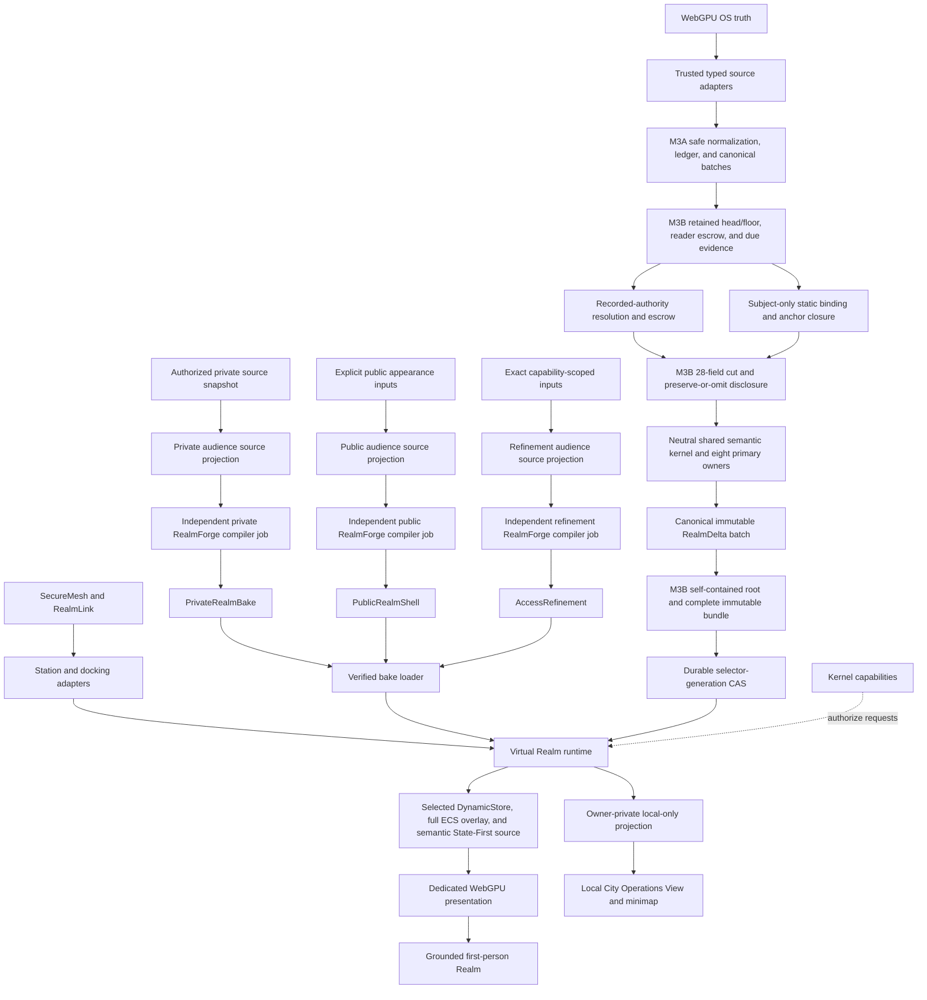

# The Virtual Realm

The Virtual Realm is the first Realm of Particle Realms Online. It is a living spatial twin in which authorized files create geography, software creates architecture, processes create inhabitants and machinery, communication creates transportation, and real source becomes Code Matter. Ordinary world use is grounded first person; the authenticated local operator may explicitly enter a bounded owner-private operations view of only their own Cityform.

This documentation set is the canonical planning and implementation baseline. It defines the product, architecture, contracts, privacy model, RealmForge pipeline, Storylet system, multiplayer protocol, rendering strategy, implementation roadmap, and certification gates. The M0-M1C product baseline is accepted. The verified contract foundation contains 109 flat V1 modules, including the two additive M1C contracts. M1C Storylet compilation, reviewed station kits, and version-2 audience packages are implemented, and the integrated gate passed 35/35 on 2026-08-28. M2 implementation is underway; M2A and the admission-only M2B slice are accepted independently, but they do not constitute accepted integrated M2. M3A and M3B remain executable blueprints: M3A requires accepted integrated M2, and M3B requires accepted integrated M2 plus accepted implemented M3A. Separately, RealmForge RF-GE0 through bounded inert RF-GE5 authoring evidence is accepted, while RF-GE6 remains planned. Those authoring results advance no M2, M3A, M3B, M3F, M2-GE, M3-GE, or VR-GE runtime gate. Renderer, scanner, Storylet runtime, and multiplayer runtime milestones remain controlled by their later roadmap gates.

Building has begun. Integrated M2 is the active first walkable, static-Cityform
gate and is not yet accepted. After M2, M3A, then M3B, then the later M3 slices
make the Cityform living. RF-GE6 may advance in parallel only as an inert
authoring compiler and grants no runtime or Virtual Realm gate.

M2A and the admission-only M2B slice are accepted; implementation now advances
to M2C static-store, ECS, and State-First materialization. The city first becomes
visible in M2D, traversable in M2E, locally manageable through the bounded
owner-only Operations View in M2F, and accepted as one integrated walkable
Cityform only at M2H.

## Locked product statement

The Virtual Realm is not a 3D file browser, detached graph viewer, virtual desktop, MindWalk clone, or imitation of an existing fictional world.

Each computer manifests as a mobile **Cityform**, its macro-scale body in the shared digital world. The user remains a human-scale, first-person **Traveler** inside that Cityform during exploration and every shared encounter. The same authenticated local operator may open a separate isometric or eagle-eye **Local City Operations View** and minimap for their own Cityform only. The filesystem shapes the city, WebGPU OS supplies live truth, RealmForge authors and compiles stable form, and SecureMesh becomes the central train station and network hub.

## Non-negotiable rules

1. Grounded first person is the only traversal mode for Travelers, visitors, multiplayer, bridges, Code Matter inspection, and replay.
2. The sole overview exception is an explicitly entered, authenticated, capability-authorized, owner-private Local City Operations View with bounded isometric or eagle-eye framing and a minimap for exactly the operator's own Cityform.
3. The Operations View is not third-person Traveler play. It has no orbit, free flight, avatar follow, detached graph navigation, remote-city view, or authority of its own.
4. Connected Cityforms and their shells, poses, rendezvous, bridges, Travelers, resources, picks, and map records are structurally absent from the Operations View and minimap before scene assembly.
5. Outside that exception, overview information appears through the first-person visor, signs, observatories, station boards, windows, and physical projections.
6. Readable code is always real, authorized code.
7. Decorative animation never masquerades as telemetry.
8. Unknown information appears as sealed, denied, stale, estimated, partial, or absent.
9. WebGPU OS and the kernel remain authoritative for files, processes, identities, permissions, networking, source bytes, and zone-management results.
10. Cameras, minimaps, picking, gameplay, and Storylets can request authority. They cannot grant it.
11. RealmForge authors and compiles the world. It does not own live runtime state.
12. Public, private, and capability-refined worlds compile independently.
13. Proximity never implies trust or permission.
14. Modules are flat peers connected by explicit contracts and application composition roots.
15. The implementation introduces no Node.js or npm dependency.
16. Stable geography changes only through a verified bake revision, never as a side effect of live telemetry.
17. The First Shard is excluded from all source, test, imported documentation content, dependency, scan, and design decisions for this Realm; only explicit exclusion assertions may name it.
18. Playground research contributes only public Engine API knowledge and independently restated behavioral invariants; no demo implementation, WGSL, UI, camera, authored topology, loader state, or fallback enters production.

## Authoritative flow

The authored bake and live system truth remain separate until the Virtual Realm runtime projects both into ECS state.

RealmForge controls static form and projection bindings. WebGPU OS controls live facts. The runtime loads immutable bakes and applies ephemeral projections. Nothing flows backward into an authored RealmForge document.

## Canonical terminology

| Term | Meaning |
| --- | --- |
| Virtual Realm | Canonical name of this Realm |
| Cityform | A computer's mobile macro-scale embodiment |
| Traveler | A user's human-scale first-person presence |
| Local City Operations View | Owner-private bounded isometric or eagle-eye management projection of exactly the operator's local Cityform |
| Mesh Expanse | Shared encounter space between Cityforms |
| RendezvousFrame | Temporary shared coordinate frame for approaching and docking Cityforms |
| Root Spine | Primary local orientation and transit landmark |
| SecureMesh Exchange | Train station, network hub, and visible trust boundary |
| Code Matter | Spatial matter backed by authorized source or data |
| RealmVisualBake | Immutable, runtime-ready authored world package |
| PrivateRealmBake | Exact authorized local topology and bindings, unpublished by default; plaintext source remains in the reveal-gated vault |
| PublicRealmShell | Sanitized, complete-looking public Cityform presence |
| AccessRefinement | Capability-scoped additional world content |
| RealmObservation | Normalized immutable fact from an authoritative source |
| RealmDelta | Immutable live projection change derived from observations |
| Storylet | Deterministic scenario that stages real events and authorized requests |
| Bridge Epoch | One authenticated docking and authorization generation |
| Chronicle | Signed semantic history and replay source |

Earlier planning names are normalized without losing their intent: `PublicCityBake` means `PublicRealmShell`, and `AccessRefinementPack` means `AccessRefinement`. The canonical names emphasize that a public shell is not a reconstruction of the private machine and that a refinement is separately authorized.

## Documentation map

- [Architecture and ownership](architecture.md) defines the flat module model, composition roots, dependency rules, and source-of-truth boundaries.
- [Playground clean-room foundations](playground-clean-room-foundations.md) freezes the CSE, URC, State-First, and Root Algebra adoption boundary, production adapter seam, truth planes, lifecycle, source ledger, and milestone placement.
- [Contract catalog](contracts.md) defines the complete V1 record families, fields, canonicalization, audience separation, authority receipts, and validation order.
- [RealmForge bake pipeline](realmforge-pipeline.md) defines authored resources, compilers, independent audience variants, dependency closure, and publication.
- [Genesis Ecology integration](genesis-ecology-integration.md) defines the M2+ living foundry, developmental city, truthful ecology projections, role/culture/lineage spaces, recipe acceleration, and private multiplayer shell boundary.
- [M2 runtime foundation](m2-runtime-foundation.md) defines the discoverable
  application, owner-partitioned M1C admission capsule, production artifact
  store, inert Storylet quarantine, lifecycle, Engine/ECS scene, first-person
  controller, local Operations View, guarded prepared-CSE activation, verified
  checkpoint-source lease, required binding/edge handoff, plural runtime-pin
  recovery, and static
  Genesis sidecar gate.
- [M2A runtime composition](m2a-runtime-composition.md) freezes the exact app
  dependency object, the trusted-service/app split, 13-module and 11-definition
  runtime-contract target, durable lifecycle state machine, typed 65,536-byte
  monotonic checkpoint-bound handoff with a one-field caller draft, exact
  binding-port claim/verify/settle/release-edge protocol, complete
  52-limit Engine/profile ID/digest/object/CSE-port binding, exact activation and
  caller/service cleanup result unions, bounded terminal replay, plural disposal
  order, 25-case contract plan, and 30-case runtime-composition plan without
  changing the M1C catalog.
- [M2B private-bake admission](m2b-private-bake-admission.md) freezes the exact
  71-field private-v2 admission index, chunked resource/evidence/signature
  inventories, immutable evidence policy and authenticated four-kind
  provisioning, four-to-five-envelope/six-row/five-role closure, protected
  operator-service exact-byte store, Realm-scoped Ed25519 trust/revocation
  policy, complete immutable runtime profile, selection/maintenance/activation
  fences, guard-private trusted time, flat activation/checkpoint-source/secure-
  random services, acyclic prepared-CSE swap and exact active-bake record
  evidence plus staged-abort and integrity-quarantine receipts, kind-bound root
  payloads, successor-active retirement, zero/one current plus candidate and bounded disposal ownership, 64
  fixed seven-record slots each including terminal-audit, bounded control reclamation,
  admission-head CAS, restart, migration, exact rollback preconditions, and
  gated root/artifact/evidence-directory GC with a 32-case durable admission
  plan. The integrated M2 runtime adds an independent 12-case stable
  checkpoint/OS-lifecycle handoff plan covering monotonic heads/tombstones,
  source-lease/manager/root recovery, guarded new-session activation, required
  verifiable checkpoint graph edges and retention release, completed GC-sweep
  rollover, and correctly owner-bound old-session pin retirement.
- [M2 Engine and ECS foundation](../../engine/virtual-realm-m2-engine-foundation.md)
  defines the exception-safe CSE, safe ECS handles/storage, full persistence,
  shared recipe kernel, verified materialization, dense State-First slots, and
  atomic activation with exact inactive genesis, active-output record,
  prepared-commit/discard/swap receipts, and empty external-effect outbox that
  must precede the renderer.
- [World districts and facilities](world-districts.md) freezes the Root Commons,
  Root Spine, SecureMesh Exchange, five territories, six Genesis kits, semantic
  roads, public silhouette, and first production itinerary.
- [M3 living city runtime](m3-living-city-runtime.md) defines normalized OS
  instrumentation, live projection, exact Code Matter, Storylet Algebra,
  Genesis Foundry/ecology, topology transitions, Chronicle, and handoff.
- [M3A observation ingress](m3a-observation-ingress.md) freezes the separate
  two-port composition, seven trusted sources over nine existing M0 observation
  kinds, exact profile/catalog/manifest/schema bindings, atomic cursor handshake,
  restart-stable deterministic ledger and pseudonym-key epoch, closed-edge
  checkpoint, empty/nonempty recovery, contiguous compaction, exact teardown,
  source privacy, and 22-gate/48-case plan without widening M2 V1.
- [M3B disclosure and dynamic projection](m3b-disclosure-projection.md) freezes
  the separate three-port composition, 16-definition/18-module catalog,
  exact 14-field catalog receipt with an embedded 17-field reference-descriptor
  pack containing 50 definitions, 50 extractors, 78 authority rules, and 78
  producer predicates, plus a compiled 12-field three-import/50-domain/78-carrier
  registry. Its sole 21-field source matrix freezes exact import/shape/recovery/
  domain/carrier/seed/variant/direct-edge/alias-source/literal/reference counts of
  3/6/9/50/78/87/111/111/108/105/137, and its derived alias graph contains the
  exact 137 reference rows,
  57-field/47-ceiling profile, 53-field logical binding, exact ten-field per-port
  descriptors with exact reader/context/commit request ceilings of 65,536/
  33,554,432/536,870,912 bytes, and exact eight-key method/request-bound results.
  Live requests are closed null-prototype objects with exact own-key order and
  conditional presence, while no-argument close uses the canonical empty-record
  digest; `canonicalRequestDigest` uses `particle-realms.m3b-port-request@1`
  over exact `portName`, `methodId`, and ordered data-only field-name/value rows;
  the existing M0 content ID covers `(resultDomainId, canonicalRequestDigest,
  format, version, status, runtimeBindingId, runtimeBindingDigest, payload)`
  with format `particle-realms.m3b-port-result` and version `1`; the envelope
  digest omits only `resultDigest`; and identity-free signals are excluded. It
  freezes three 28-field cut kinds with 11-field retained-head/floor state, complete
  reader escrow, canonical `readCallReceiptBytes` plus their pair, and an exact
  service-issued expiry-due receipt grounded exclusively in M3A-owned durable tick
  evidence. Current traffic alone derives finite expiry as saturating cut tick
  plus one; every other primary Delta uses expiry `"0"`. The retention value is always present on `ready`, `source-
  state-ready`, and byte-identical `idle`; `gap` is legal only when it verifies,
  otherwise the reader returns `unavailable`. It resolves every authority-domain
  observation into recorded escrow before preserve-or-omit disclosure; both
  resolution modes return
  canonical `authorityResolutionReceiptBytes` plus their pair under one closed
  21-field maximum receipt vocabulary: recorded mode has 19 own keys and also
  returns a 15-field escrow manifest, while current-only mode has 13 own keys.
  It keeps the separate complete 13-field current-authority
  snapshot fence-only and resolves bindings/anchors from subject IDs only with
  canonical `staticResolutionReceiptBytes` plus their pair under an exact
  24-field internal receipt. The package further freezes one neutral
  shared kernel, eight primary owners plus one audit-only witness, and an
  embedded 16-field recipe matrix with 53 event rows, 130 primary operation
  slots, 16 descriptor roles, and one witness recipe. Its exact 41-field
  `RealmProjectionBatchV1` carries dynamic `presentationCommandIds` and
  `presentationCommandDigests`; commands are not a fourth static carrier. Each
  command joins exactly one batch pair, one pure-compiled or retained-origin
  protected-closure byte object, and at least one ID-only presentation Delta.
  Command bytes count through protected closure, never `deltaByteCount`.
  The witness reuses the accepted primary command and emits only a witness Delta,
  never a second command. Command identity binds runtime binding, projector,
  observation, slot, binding subject, selected anchor, command kind, and content
  digest, while the current-presentation semantic key remains independent.
  Stateful same-key work uses the exact sequential `transitionBase` protocol,
  exhaustive DynamicStore lowering, and a 16-field pre-freeze work-count plan;
  the conservative independent-ceiling work sum is 347137 without claiming
  simultaneous attainability. All base-M3B IPC, syscall, and network routes are
  non-traversable. M3A contributes six local-network events; `authenticated` is
  excluded because it requires peer identity, which remains M5 work. M3B also freezes deterministic
  projection/progress-strict maintenance batches, a self-contained six-channel
  store, full stable-ID ECS overlay, dependency-complete flat semantic State-
  First source, root-owned reader/authority escrow and floor bytes, lease-target
  closure, 42-field intent, 37-field root, 27-field off-active bundle with a
  nonexpiring covering lease, 14-field authority/device presentation-fence
  vocabulary, durable selector reconciliation and separate 24/18/18-field
  application/recovery/selector-retirement journals under one shared quota,
  hidden CPU-tail commits
  behind an accepted `recovering` fence, commit-port `recover()` with an exact
  37-field recovery receipt bound to terminal 18-field attempt evidence, 13-field
  selector-read, and 22-field catch-up proof; a 21-field empty/present transition
  descriptor and 21/25-field receipt; exact 18-field selector-retirement record,
  24-field detach receipt, and 21-field quarantine receipt; and two-phase stop:
  `beginStop()` freezes the before
  inventory and captures/closes the presentation fence under its exact 16-field
  receipt, while terminal `closeSession()` runs last and returns the 38-field
  disposal receipt with paired 16-field
  resource snapshots that drive
  `candidateLeaseCount`, `sessionCandidateRootCount`, and every other session-
  service count to zero after internal current/lineage-to-retained or quarantine-
  to-retained transfer,
  while nonterminal `blocked` issues no terminal evidence. Conditional
  application/recovery/detach receipt hashes use exact presence vectors and
  ordered field/value rows; quarantine additionally binds dense operation-
  evidence and ten-field adopted-resource inventory rows under exact aggregate
  digests. It retains a 20-gate/
  48-case plan without
  widening M2 or M3A.
- [Cityform encounter runtime](cityform-encounter-runtime.md) defines the M4
  public-shell, M5 SecureMesh presence/Traveler, and M6
  locomotion/rendezvous/docking implementation slices.
- [M1A owner-private SecureMesh station bake](m1a-private-securemesh-bake.md) records the accepted private vertical slice and its evidence.
- [M1B public shell and access-refinement packages](m1b-public-refinement-packages.md) records the accepted independent transported-audience boundary.
- [M1C Storylet and reviewed station bake](m1c-storylet-station-bake.md) records the accepted flat Storylet compiler, reviewed station evidence, version-2 package boundaries, durable M2 handoff requirement, rollback, and verified 35-case acceptance gate.
- [World projection grammar](world-projection.md) maps real WebGPU OS data to stable first-person geography and live presentation.
- [Local City Operations View](local-operator-view.md) defines owner-private isometric/eagle-eye framing, the own-city minimap, zone proposals, and structural exclusion of connected Cityforms.
- [Code Matter](code-matter.md) defines sealed, structured, and revealed source states with exact authority and privacy rules.
- [Cityforms and SecureMesh](cityforms-securemesh.md) defines the station, public presence, rendezvous frames, docking, bridges, epochs, and revocation.
- [Storylets](storylets.md) defines deterministic event-driven scenarios, authoring, runtime arbitration, multiplayer scope, Chronicle records, and replay.
- [Rendering and experience](rendering-experience.md) defines the dedicated renderer, first-person controller, semantic LOD, visual language, audio, accessibility, and performance strategy.
- [Security and privacy](security-privacy.md) defines noninterference, hostile-content handling, capability boundaries, metadata protections, and threat invariants.
- [Implementation roadmap](implementation-roadmap.md) defines the dependency-ordered build milestones, deliverables, exclusions, approval gates, and rollback boundaries.
- [Certification plan](certification-plan.md) defines deterministic, privacy, rendering, network, recovery, accessibility, and architecture acceptance tests.
- [Research and originality ledger](research-originality.md) records the MindWalk and fictional-inspiration boundary without importing their expression or implementation.

## Scope of the first release

The first release includes:

- One locally authored and baked Cityform.
- The Root Spine and one SecureMesh Exchange district.
- Grounded first-person traversal with collision and interaction, plus the bounded owner-private Local City Operations View and own-city minimap.
- Real local boot, filesystem, process, syscall, IPC, permission, storage, and network projections.
- Local sealed, structured, and revealed Code Matter with byte-exact verification.
- An independently generated PublicRealmShell.
- Two authenticated peers and mutual presence consent.
- One public destination and one deterministic bridge.
- Directional capability grants, expiry, disconnect, and revocation.
- Public skyline persistence after departure until the signed shell expires.
- Storylet-driven orientation, inspection, station activity, incident explanation, and Chronicle replay.
- Device-loss recovery, performance evidence, privacy certification, and accessibility certification.

The first release defers permanent global coordinates, remote exact-source reveal, private interior refinement streaming, group docking, arbitrary remote visual assets, zero-knowledge shell proofs, guaranteed presence after the browser closes, native whole-PC scanning without a separately authorized companion, combat, economy, VR, and every camera or map mode other than grounded first person and the owner-private local Operations View.

## Living Digital World certification track

Genesis Ecology is an opt-in extension over the same M2-M7 milestones. Base
Virtual Realm V1 can certify without it; the **Living Digital World** label
requires the additional VR-GE gates. This preserves a modular rollback while
keeping the complete intended world explicit.

The upstream RealmForge authoring program and this runtime certification track
have distinct gates. RF-GE2 has delivered four inert Product Genome, Factory
Genome, revision-reference, and execution-plan records, deterministic compile
and verification for all ten constructive operations, and an isolated
trust-locked constructive pack. RF-GE3 has delivered an audience-isolated,
process-local exact verified-Plan cache, dependency-safe transitive
invalidation, verified Factory/Plan binding evidence, and deterministic inert
recursive package candidates. The Plans remain `not-executed`; the candidates
remain ineligible for publication. Neither result executes, persists, publishes,
installs, authorizes, activates, or renders anything. RF-GE4 and RF-GE5 add
only inert, digest-bound interpreter and ecology evidence, and no completed
RF-GE authoring gate satisfies a
VR-GE row by implication.

The track adds:

- a separately verified Genesis sidecar bound to one accepted base bake;
- the Continuity Core, Foundry District, Maintenance Works, Possibility Archive,
  Role Commons, and Culture Archive kits;
- stable Soul Seed roots, Eidos continuity, product/factory genomes, admitted
  phenotypes, lineage, dormancy, and organismality evidence;
- real recipe `BUILD`, `REPAIR`, and `RECYCLE` canaries through isolated
  evaluation, semantic authority, ECS commit barriers, packaging, and rollback;
- regulation, homeostasis, resource/reaction, role, culture, QD, and lifecycle
  projections with no automatic authority;
- deterministic Storylet Role Algebra lowered into the existing data-only
  Storylet boundary;
- independent public Genesis appearance, attributed cultural motif exchange,
  and capability-bound remote factory/role proposals in M4-GE through M6-GE.

Automatic evolution, automatic mutation, private ecology transport, belief
adoption, and higher-order Soul Seed minting remain disabled until separately
authorized and certified.

## First playable sequence

The vertical slice proves the complete architecture through grounded first-person traversal and one explicit owner-private operations interlude:

1. Launch The Virtual Realm from WebGPU OS.
2. Spawn at the Root Spine inside a locally generated Cityform.
3. Open the own-city minimap, explicitly enter the Local City Operations View, select and focus one local zone, submit one bounded management proposal, receive its authority result, and return to the preserved first-person anchor.
4. Walk through the five shipped foundational territories created from authorized repository structure.
5. Follow one real boot, syscall, IPC, storage, and network path through its roads and conduits.
6. Approach one Code Matter structure, inspect its identity and commitment, request local reveal authority, and verify exact source.
7. Diagnose one clearly simulated presentation fracture without modifying the real filesystem.
8. Enter and activate the SecureMesh Exchange.
9. Observe a signed remote public Cityform approach and see its Traveler arrive only after authentication and mutual presence consent.
10. Re-enter the Local City Operations View and prove that the connected Cityform, public shell, remote Traveler, rendezvous, and bridge records remain absent while the local station exists only as a local landmark; then return to first person.
11. Negotiate one directional capability, independently bake and verify one deterministic bridge, cross into one permitted public district, and inspect real route traffic.
12. Revoke the capability and verify that protected traffic stops, the track retracts, protected interaction disappears, and the sanitized remote skyline remains until shell expiry.

All Traveler traversal, remote encounters, bridge use, Code Matter reveal, and replay remain first person. The Operations View is an owner-private local management projection, never part of the shared spatial session. Route summaries, topology history, and MindWalk-like activity playback otherwise appear only as visor data or physical in-world projections.

## Existing foundations

The plan reuses the repository's current narrow contracts instead of extending its largest modules:

- Frame scheduling: `engine/core/framepipeline/FramePipeline.js`
- GPU pass dependencies: `engine/core/framegraph/FrameGraph.js`
- ECS: `engine/ecs/world/World.js`
- Culling: `engine/render/state/StateFirstGpuCuller.js`
- Picking: `engine/tools/picking/RayPicking.js`
- Close-range code surfaces: `engine/surfaces/CodeSurface.js`
- Spatial audio: `engine/audio/core/AudioEngine.js`
- Processes: `webgpu-os/kernel/ProcessTable.js`
- Filesystem: `webgpu-os/kernel/VirtualFS.js`
- Persistent storage events: `webgpu-os/storage/StorageManager.js`
- Permissions: `webgpu-os/kernel/Permissions.js`
- SecureMesh sessions: `webgpu-os/drivers/NetworkDriver.js`
- Authenticated Realm links: `engine/network/realm/link/RealmLink.js`
- Semantic history: `engine/network/realm/chronicle/RealmChronicle.js`
- RealmForge semantic hashes: `webgpu-os/apps/realmforge/document/hash/RealmForgeContentHash.js`
- RealmForge SystemGraph compilation: `webgpu-os/apps/realmforge/modeler/system-graph/RealmForgeSystemGraphCompiler.js`
- RealmForge assembly compilation: `webgpu-os/apps/realmforge/modeler/compile/AssemblyCompiler.js`
- RealmForge Engine materials: `webgpu-os/apps/realmforge/material/RealmForgeEngineMaterialAdapter.js`
- Storylet facade and eligibility: `webgpu-os/kernel/storylets/StoryletRuntime.js` and `webgpu-os/kernel/storylets/StoryletEligibilityBridge.js`

The CSE/URC public barrel at `engine/state/index.js` and the Engine State-First surface are eligible only through composition-root-injected adapters. The audited Playground files remain research evidence and are never production imports; the exact boundary and citations are recorded in [Playground clean-room foundations](playground-clean-room-foundations.md).

The existing immersive desktop compositor is not the Virtual Realm renderer. It presents windows as textured quads and does not supply continuous world traversal, city geometry, spatial audio, deterministic Cityform bakes, HLOD, or authoritative world interaction.

## See also

- [Realm Network](../realm-network.md)
- [WebGPU OS architecture](../architecture.md)
- [Engine rendering](../../engine/rendering.md)
- [Security and Trust Model](../../concepts/security-model.md)
