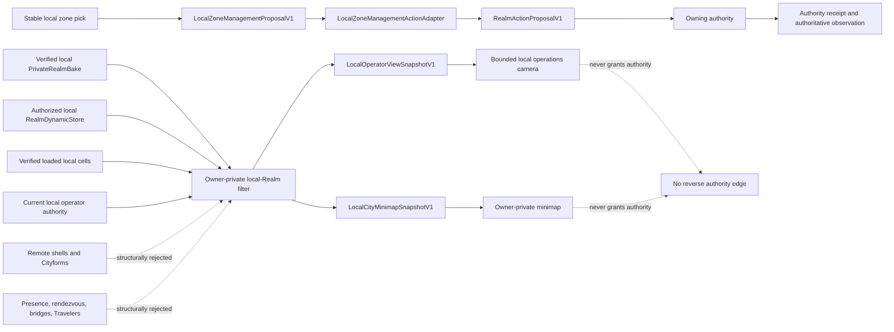

# Virtual Realm Local City Operations View

The Virtual Realm has exactly two approved presentation modes:

1. **Grounded Traveler mode** is the ordinary first-person world. Exploration, visitors, multiplayer encounters, bridge traversal, Code Matter inspection, and Chronicle replay remain first person.
2. **Local City Operations View** is an explicitly entered, owner-private management projection for exactly the local operator's own Cityform. It provides bounded isometric and eagle-eye framing and may also supply a local minimap while the operator remains in first person.

The Operations View is not third-person Traveler play. It does not follow an avatar, create another traversal controller, expose a free camera, or provide a way to survey another user's Cityform.

## Non-negotiable boundary

An Operations View exists only when all of these conditions hold:

- The current WebGPU OS identity is authenticated as a local operator for the viewed Realm.
- An active, nonzero, local operator capability epoch and authority receipt permit the view.
- The only representable Realm reference is `localRealmId`; there is no separate viewed-Realm field that could name another Cityform.
- The audience is exactly `owner-private` and disclosure is exactly `local-private`.
- The active private bake, spatial-layout receipt, policy revision, loaded-cell set, and dynamic revision all verify.
- Entry is an explicit local user action. A Storylet, remote message, station event, link, or proximity event cannot enter the mode.

The accepted M2D-B4F wire may return a policy only when both the authority and
policy epochs are positive. That result must echo the exact operator, local
Realm, lifecycle, and epoch context and bind the accepted policy's owner, local
Realm, ID, revision, and digest to one exact nested policy head. A read request
may carry zero authority or policy epochs so unavailable operator context can be
represented honestly, but that request cannot produce a successful policy
result or subscription.

Expiry, revocation, owner-identity change, active-bake replacement, policy mismatch, device loss, or invalid projection tears down the view and restores a collision-safe first-person anchor.

## Structural connected-Cityform exclusion

Connected content is excluded before ECS, HLOD, culling, picking, object-ID, draw-list, minimap, accessibility, or telemetry assembly. The filter admits no:

- Remote or connected Cityform ID.
- `PublicRealmShell` resource or revision.
- Remote `RealmPose` or Cityform transform.
- `PresenceSession`, RendezvousFrame, or bridge resource or epoch.
- Remote Traveler identity, appearance, presence grant, pose, or marker.
- Remote district, route, destination, topology, collision, navigation, glyph, text, audio, or Storylet record.

The local SecureMesh Exchange remains part of the owner's city. Its local building, platforms, and gates may appear as local landmarks. A platform may show a content-free local boundary status such as idle, occupied, degraded, or closed, but the Operations View does not show the connected City's identity, shell, location, geometry, route beyond the local socket, or destination board. Detailed encounter and network presentation remains in grounded first person.

An exclusion receipt reports zero **included** connected Cityforms, remote shells, rendezvous frames, bridges, and Travelers. Those zeros do not report how many remote objects actually exist; they prove that none entered this projection.

## Camera behavior

The local operations camera is independently authored Realm code. It does not reuse or adapt a Playground, editor, orbit, director, debug, or free-flight camera.

- Isometric mode uses a policy-bounded pitch, altitude, zoom, and local Cityform framing volume.
- Eagle-eye mode uses the same local bounds with a steeper policy-bounded pitch.
- Pan and zoom clamp to the verified local Cityform bounds and loaded-cell policy.
- Heading changes, if enabled, snap only to policy-approved orientations; continuous orbit is not a release input.
- The camera never crosses a local Realm boundary, follows a Traveler, enters a remote shell, or reveals content by changing angle or LOD.
- Entering Operations View stores the current first-person anchor. Exiting restores that anchor when still compatible or uses the collision-safe Root Spine fallback.
- The first-person controller remains the sole traversal controller and receives no movement input while the Operations View is active.

Camera state is presentation state. It cannot change a bake, capability, disclosure class, collision result, navigation graph, zone state, or authoritative observation.

## Local minimap

The minimap is a second rendering of `LocalCityMinimapSnapshotV1`, not a scan, graph query, or remote-world view. It may appear as a visor element in first-person mode or as part of the Operations View. Minimap acceptance cross-binds the supplied policy's `policyId`, `policyRevision`, `localRealmId`, and `ownerIdentity` to the snapshot before policy enablement or limits are consulted; a different schema-valid policy cannot be substituted.

It contains only bounded, canonically ordered local records:

- Local zones and their local anchors and cells.
- Local roads and routes whose endpoints both resolve inside the admitted local map.
- Local landmarks such as the Root Spine and SecureMesh Exchange.
- Current local availability, alert, and loaded-cell presentation state.

It contains no readable source, private path text, process arguments, packet data, remote identity, destination, bridge geometry, or remote topology. It uses the same safe-text, semantic-state, and accessibility rules as the world. Panning the map never triggers a filesystem scan, protected source read, public-shell fetch, rendezvous query, or network discovery.

## Zone selection and management

`select-zone` and `focus-zone` change local presentation only. They select stable local zone IDs and frame them without changing world truth.

An owner-private Storylet cannot enter, exit, steer, or expand the Operations
View and cannot join its local snapshot. If the owner has already entered, a
separately validated presentation-only proposal may create one reversible
highlight or focus overlay over an already visible authorized local zone. The
overlay owns a disposable handle, adds no map record, reveals no new state,
selects no hidden zone, and cannot authorize a management result.

V1 defines three management proposal classes:

- `set-zone-visibility` requests an owner-private visible, dimmed, or hidden presentation policy.
- `set-zone-alert-threshold` requests a bounded metric threshold using `RealmMetricValueV1` units and quality rules.
- `request-zone-rebake` requests that the independent RealmForge bake application consider a named source generation and canonical local anchor set.

The Operations View cannot directly apply any of them. `LocalZoneManagementActionAdapter` first verifies the current policy, view snapshot, local Realm, local target zone, bake, layout, target revision, lifetime, and idempotency key. Acceptance requires the supplied policy's `policyId`, `policyRevision`, `localRealmId`, and `ownerIdentity` to equal the proposal's four bindings before an allowed action is considered; a foreign but schema-valid policy cannot authorize the proposal. The view-session capability and the `manage-local-zone` capability are separate grants with independent nonzero epochs; possessing the former never implies the latter. A rebake request additionally proves every requested anchor is owned, loaded, and visible in the accepted local snapshot. The adapter then creates the corresponding generic `RealmActionProposalV1`. The owning WebGPU OS or RealmForge authority may allow, deny, expire, reject, or supersede it. Completed presentation waits for the existing authority receipt and authoritative observation chain.

M2 may ship this proposal submission seam, but it has no live observation
reconciliation. It presents the request only as `pending`, `denied`, `expired`,
`cancelled`, or `unknown`; it never infers completion from dispatch. M3 adds the
authoritative result observation and projection path.

No generic arbitrary zone mutation, script execution, filesystem write, permission bypass, network control, bridge control, remote-city management, or direct RealmForge document edit exists.

### Optional Genesis sidecars

The accepted V1 snapshot and action enum remain unchanged. The Living Digital
World track adds `LocalGenesisOperationsPolicyV1`,
`LocalGenesisOperationsSnapshotV1`, `LocalGenesisMinimapOverlayV1`,
`LocalGenesisManagementProposalV1`, and `LocalGenesisExclusionReceiptV1`, all
bound to the exact accepted base local-snapshot digest.

Genesis proposals cover only separately capability-gated district placement or
rebake, candidate evaluation/activation/rejection, repair, package, recycle,
dormancy, and reactivation requests. View authority implies none of those
capabilities. The exclusion receipt admits no remote phenotype, genome, role,
culture, lineage, reaction, factory job, public extension, rendezvous, bridge,
or Traveler record.

## Flat contracts and peers

M0 freezes four additional independently owned contracts:

| Contract | Purpose |
| --- | --- |
| `LocalOperatorViewPolicyV1` | Exact local Realm, owner, allowed modes, camera bounds, minimap limits, zone actions, and no-authority interaction rules |
| `LocalOperatorViewSnapshotV1` | Current authority-bound local view, private bake/layout and content-bound local-operations lookup binding, bounded camera, admitted local cells/anchors/zones, and exclusion receipt |
| `LocalCityMinimapSnapshotV1` | Referentially closed local zones, routes, landmarks, bounds, cells, exact trusted lookup projection, and exclusion receipt |
| `LocalZoneManagementProposalV1` | Powerless local-zone request with exact action parameters, revisions, authority precondition, lifetime, and idempotency |

Runtime implementation remains flat.

M2D-B4F accepts the separate provider-free `localOperatorPolicy@1` port with
exactly `readPolicy()` and `subscribe()`. Its read result is exactly `policy`,
`invalid`, or `unavailable`; a successful result carries the six-field context,
an exact nested `{ policyId, policyRevision, policyDigest }` head, and the
accepted `LocalOperatorViewPolicyV1`. Subscription invalidation carries only
`{ eventKind, reasonCode }`: it cannot include replacement policy data,
operator or Realm identity, connected-Cityform state, or projection content.
The wire owns no policy store, protected head, projector, camera, renderer,
minimap, mutation path, or provider.

Future runtime composition, after the genuine authority-provider gate, injects:

- `LocalOperatorViewPolicyStore`
- `LocalOperatorViewProjector`
- `LocalOperatorCameraController`
- `LocalCityMinimapProjector`
- `LocalZoneSelectionStore`
- `LocalZoneManagementActionAdapter`

No peer constructs or imports another concrete peer. The first-person and operations controllers share no mutable camera object; the composition root transfers an immutable transition record at a frame barrier. `LocalOperatorViewPolicyStore` remains future trusted-owner work and is not implemented by the B4F wire.

B4H now supplies the separate kernel-only `RealmLocalOperatorPolicyHeadStorage`
source. It verifies the canonical policy digest, binds the captured account and
explicit local Realm, and advances a protected policy epoch with exact
predecessor checks. Unchanged saves perform zero writes; uncertain writes
require a fresh recovery read. This source is not the complete policy store or
B4F adapter: lifecycle generation, coherent current-state composition, and
subscription invalidation remain required. (Source:
`webgpu-os/kernel/realm/RealmLocalOperatorPolicyHeadStorage.js`.)

`RealmLocalSelectionHeadStorage` now owns the protected current-Realm choice and
authority epoch for one operator account. Selecting a different Realm or
clearing the selection advances the epoch; clearing persists a tombstone.
Selecting the same Realm does no write. Explicit authority invalidation requires
and retains a selected Realm, advances its epoch, and grants no capability.
Both head sources reuse `RealmProtectedHeadStorage` for exact storage and
recovery. Missing or cleared selection must remain unavailable to B4A/B4F;
no sentinel Realm, default map, or foreign-city overview may fill the gap.
(Sources: `webgpu-os/kernel/realm/RealmLocalSelectionHeadStorage.js`;
`webgpu-os/kernel/realm/RealmProtectedHeadStorage.js`.)

The kernel-only `RealmLocalOperatorSnapshotSource` now joins the captured
operator, selected Realm, and verified policy at one coherent read cut. It
reasserts the exact selection epoch/SHA after policy read; a changed selection
cannot supply an Operations context. This snapshot is neither an ongoing
authority lease nor an Operations View snapshot. It provides no lifecycle
generation, partition ID, subscription, camera, map, or zone mutation.
(Source: `webgpu-os/kernel/realm/RealmLocalOperatorSnapshotSource.js`.)

The separate `RealmLifecycleGenerationHeadStorage` now reserves generations
for the captured account/app in protected retained storage. That high-water
mark neither authorizes an Operations session nor proves a lifecycle is live
or retired. It provides no view capability, local policy subscription, minimap,
camera, or zone-management authority. The separate
`RealmLifecycleSessionAuthority` now adds private per-session currentness and
exact teardown-only retirement over a new reservation, including after operator
switch. It neither reads a selected Realm/policy nor authorizes Operations
View. Its terminal state is process-local, not durable recovery evidence.
Complete lifecycle-port wiring and B4A/B4F adaptation remain required. (Sources:
`webgpu-os/kernel/realm/RealmLifecycleGenerationHeadStorage.js`;
`webgpu-os/kernel/realm/RealmLifecycleSessionAuthority.js`.)

The versioned host-attempt transport now binds Entry's exact distinct live
construction, work, and teardown roots before Engine inspection. The registry's
legacy frozen `{ dependencies, close }` lease remains unchanged; only an
explicit version-2 lease carries
`{ leaseVersion: 2, dependencies, attemptBinding, close }`. `Desktop` forwards
the frozen `realmRuntimeAttemptBinding@1` capability separately as
`virtualRealmRuntimeAttemptBinding`, not inside the exact 16-key dependency-v2
record, and the factory supplies it as Entry's optional second argument. Entry
accepts only the synchronous frozen `{ bound: true }` receipt, then preserves
the existing inspection, operator-snapshot, and lifecycle-allocation order.

The host keeps `captureAttempt()` and `close()` private. Capture requires the
identical currently bound construction root while all three roots remain live;
a later attempt requires actual prior teardown and three fresh roots. Close does
not manufacture teardown, lifecycle retirement, process-owner release, or
resource cleanup. The transport leaves `lifecyclePort@1`, all catalogs, and the
16 dependencies unchanged. It does not create a live B4A/B4F adapter, complete
authority provider, process owner, activation service, Operations View, camera,
minimap, or isolation boundary. (Sources:
`webgpu-os/kernel/AppRuntimeCompositionRegistry.js`;
`webgpu-os/kernel/realm/RealmRuntimeAttemptBinding.js`;
`webgpu-os/shell/Desktop.js`;
`webgpu-os/apps/the-virtual-realm/VirtualRealmEntry.js`.)

Source correctness does not establish hostile same-origin import isolation.
The [B4H provider gate](m2-runtime-foundation.md#m2d-b4h-genuine-authority-provider-composition)
must enforce kernel-controlled storage acquisition and prevent direct native
storage bypass before exposing these sources through app ports. Neither the
view brand nor a source-closure test supplies those guards. See the
[current enforcement gap](security-privacy.md#current-shared-origin-enforcement-gap).

B4F acceptance recorded 60/60 hostile browser cases and 11/11 independent Python
proofs. Its contract, shared dependency, Entry, and production-composition
closures were then exactly 11, 23, 105, and 47 acyclic error-free modules. The
scoped Python group passed 59/59, or 64/64 including the then-29-module renderer
closure. B4A-B4F plus M2A and B3 browser regressions passed 328/328 with zero
skips. This historical evidence accepts only the wire and the two
policy-substitution guards, not the Operations View or minimap runtime.

M2D-B4G closes the final legacy wire without creating another rendering path
for local operations. The existing `surfaceFramePort` slot now requires the
reviewed stateless singleton. Both methods return only
`{ status: 'unavailable', reasonCode: 'realm-gpu-presentation-required', recoverable: false }`;
they never inspect arguments or acquire a surface or frame producer. Future
local Operations and minimap presentation must use the accepted owner-coupled
GPU presentation boundary and still satisfy every local-only policy rule.
The host-private `RealmLifecycleAllocationAuthority` now connects the captured
attempt roots to genuine lazy sessions, currentness, and retirement evidence.
It preserves the existing lifecycle request shapes and caches genuine terminal
observations on either direct or method-mediated retirement. Pending or
unretired sessions prevent close; root abort cannot manufacture retirement or
resource cleanup. This supplies no policy approval, participant/process-owner
authority, camera, map, zone action, connected-city access, or full provider.
(Source: `webgpu-os/kernel/realm/RealmLifecycleAllocationAuthority.js`.)

The dependency-v2 record remains exactly 16 keys. B4H is underway but
unaccepted, with its protected policy, selection/authority-epoch,
lifecycle-generation/session, and host-attempt binding prerequisites verified.
It does not accept a complete provider, camera, view, or minimap. See the
[B4G compatibility acceptance ledger](m2-runtime-foundation.md#m2d-b4g-terminal-legacy-surfaceframe-compatibility).
(Source: `webgpu-os/apps/the-virtual-realm/runtime/RealmLegacySurfaceFramePort.js`.)

## RealmForge relationship

RealmForge M1 compiles a bounded local zone, anchor, cell, landmark, and route lookup resource into the `PrivateRealmBake`. The Operations View and minimap derive only from that verified private resource plus authorized local deltas. They are not new bake audiences, public shells, or access refinements, and they never influence the public bake.

The local map derivative has its own content ID and dependency closure. It includes no plaintext source bytes. Exact Code Matter reveal remains a close-range first-person inspection operation under a local reveal lease.

## Accessibility and privacy

- Keyboard, mouse, gamepad, screen-reader semantics, high contrast, and non-color alerts cover every required operation.
- Reduced motion replaces animated ascent/descent with a bounded fade and spatial orientation summary.
- The minimap has a DOM semantic equivalent with local zones, local routes, selection, alerts, and scale.
- A visible owner-private indicator remains present for the entire Operations View.
- In-application streaming, remote-control, public screenshot publication, and Chronicle sharing do not accept Operations View frames or snapshots.
- The browser cannot prevent operating-system screenshots, screen recording, or human observation. The owner-private indicator and documentation state that limitation directly.

## Certification summary

Release requires proof that:

- Exactly the two approved modes exist and only first-person controls traversal.
- Entry requires current local identity, capability, authority receipt, private bake, layout, and policy.
- Foreign Realm, public, refinement, replay, stale, zero-epoch, and expired inputs fail closed.
- Different connected-Cityform populations produce byte-identical local snapshots and minimaps for identical declared local input.
- Connected Cityform IDs and resources are absent from CPU snapshots, GPU resources, object-ID buffers, picks, accessibility output, captures, and telemetry.
- Minimap routes have no dangling or foreign endpoint and every admitted zone, anchor, and landmark resolves through loaded local cells.
- Camera, map, selection, and Storylets cannot grant authority or claim a management result.
- Revocation, policy replacement, bake transition, device loss, and exit dispose operations resources exactly once and safely restore first-person state.

## See also

- [Architecture and ownership](architecture.md)
- [Contract catalog](contracts.md)
- [World projection grammar](world-projection.md)
- [Rendering and experience](rendering-experience.md)
- [Security and privacy](security-privacy.md)
- [Certification plan](certification-plan.md)
- [M2 runtime foundation](m2-runtime-foundation.md)
- [M3 living city runtime](m3-living-city-runtime.md)
- [World districts and facilities](world-districts.md)
