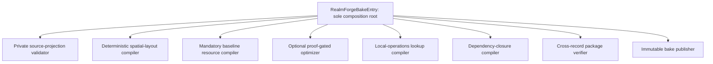

# M1A Owner-Private SecureMesh Station Bake

M1A is the first executable RealmForge vertical slice for The Virtual Realm. It compiles one deterministic owner-private Cityform package containing the first SecureMesh station and the static data needed by the later local Operations View. M1A does not render the city, observe live WebGPU OS state, discover peers, create a public shell, or establish a network session.

M0 is complete. Its 100 flat V1 contract modules, canonical encoding, registry, and conformance foundations remain the accepted base. M1A adds three contract modules to that inventory:

- `LocalOperationsLookupResourceContract`
- `RealmBakeResourceLimitProfileContract`
- `RealmProofGatedOptimizationReceiptContract`

The implemented inventory is therefore 103 contracts: 100 accepted M0 contracts plus three M1A additions. The ordered catalog, synthetic fixtures, browser conformance, independent M0 canonical vectors, deterministic M1A compilation, and adversarial publication harness have passed. M1B, M1C, and M2 remain separate unimplemented gates.

## Milestone boundary

M1A includes:

- One owner-private `RealmAudienceSourceProjectionV1` accepted through an explicit bake envelope.
- One deterministic +Z Root Spine and first SecureMesh station landmark.
- Quantized cells, stable anchors, bounded routes, collision, navigation, HLOD, and related static presentation resources.
- Ten typed static visual-resource families.
- One typed `LocalOperationsLookupResourceV1` for the local Cityform only.
- One strict `RealmBakeResourceLimitProfileV1` applied before allocation and throughout compilation.
- A mandatory unoptimized baseline compiler path.
- An optional proof-gated optimizer whose failure returns the baseline semantics.
- An audience-local dependency closure, cross-record package verification, immutable publication, and active-root compare-and-swap.

M1A explicitly excludes:

- `PublicRealmShell` compilation and public noninterference certification. These remain M1B.
- `AccessRefinement` compilation, encryption, capability-scoped delivery, and refinement overlays. These remain M1B.
- Storylet definition and catalog compilation. These remain M1C.
- Richer or interchangeable station kits, extended districts, and production visual-quality passes. These remain M1C.
- Live observations, ECS projection, first-person traversal, isometric or eagle-eye rendering, minimap UI, zone mutation, multiplayer, presence, rendezvous, bridges, and network transport. These remain M2 or later.

No M1A artifact grants authority. The package describes stable presentation data only.

## One composition root

`RealmForgeBakeEntry` is the sole M1A composition root. It receives every concrete adapter, compiler, verifier, canonical encoder, resource-limit profile, immutable store, and publication port through explicit construction arguments. It creates the peers and orders the pipeline.

No peer constructs or imports another concrete peer. A peer may import versioned contracts and side-effect-free compiler primitives. Only `RealmForgeBakeEntry` wires concrete implementations.



The arrows show composition-root calls and immutable value flow. They do not authorize peer-to-peer imports or nested ownership.

The M1A dependency shape is flat:

```text
RealmForgeBakeEntry
  -> private projection validator
  -> spatial layout compiler
  -> baseline static-resource compiler
  -> optional proof-gated optimizer
  -> local-operations lookup compiler
  -> dependency-closure compiler
  -> bake receipt builder
  -> cross-record verifier
  -> immutable package codec
  -> immutable publisher
```

Compiler outputs return to the entry as frozen values. The entry passes those values to the next peer. A compiler never holds the publisher, active-root pointer, RealmForge document store, runtime, renderer, or network service.

## Immutable input envelope

The M1A bake envelope is a closed in-memory value assembled by `RealmForgeBakeEntry`. It is not an ambient service bag and does not become a new network contract. It contains only:

- The accepted owner-private `RealmAudienceSourceProjectionV1`.
- The exact `RealmSpatialLayoutPolicyV1`.
- The exact `RealmBakeResourceLimitProfileV1`.
- Canonical compiler, primitive, coordinate, numeric, and compatibility identities.
- The requested deterministic station-kit identity.
- Explicit publisher identity and publication context.
- An optional prior verified private-package summary for incremental anchor comparison.

The envelope contains no mutable `.proasset` handle, editor session, preview object, renderer object, callback from document data, WebGPU resource, live filesystem handle, capability secret, current network peer, or wall-clock-derived compiler choice.

The entry validates the complete envelope before invoking a compiler. Unknown keys, missing identities, audience mismatch, private Realm mismatch, stale policy, unknown limit profile, invalid numeric policy, or mutable executable values fail before allocation.

## Stable +Z geography

M1A uses one local right-handed metre coordinate frame with +Y up and the Root Spine extending along positive Z from the origin.

- The origin anchor is stable for the same Realm, source projection, layout policy, and compiler identity.
- The first SecureMesh station occupies its policy-reserved landmark cell beside the Root Spine.
- Stable audience IDs, not discovery order, determine sibling ordering.
- Fixed-point grid arithmetic determines cells, parcels, clearances, and route coordinates.
- Required routes, station clearances, collision, and navigation either compile consistently or reject the package.
- Activity, current peers, current traffic, wall time, frame order, and GPU scheduling never alter static geography.
- A policy, numeric-policy, or compiler-version change creates new geography identity.

M1A may use a deliberately small canonical station fixture. Small does not mean approximate: its coordinates, anchors, bounds, resource IDs, and dependency edges remain complete and deterministic.

## Ten typed static resources

The private package contains records from exactly these ten existing static visual-resource families:

1. `RealmGeometryResourceV1`
2. `RealmMaterialBindingV1`
3. `RealmLightingIntentV1`
4. `RealmCollisionResourceV1`
5. `RealmNavigationResourceV1`
6. `RealmSocketResourceV1`
7. `RealmLodResourceV1`
8. `RealmProjectionBindingV1`
9. `RealmGlyphStyleV1`
10. `RealmAudioZoneV1`

Topology nodes, topology edges, the spatial-layout receipt, the dependency closure, the manifest, and publication evidence remain separate record families. They are not silently counted as an eleventh visual-resource family.

Every static resource envelope binds:

- Its stable resource ID and exact resource kind.
- Canonical content bytes and content ID.
- Owner-private audience and local-private disclosure.
- Stable source-anchor IDs and bounds.
- Canonically ordered direct dependency IDs.
- Compiler and numeric-policy identities.
- Exact byte length and resource-limit accounting evidence.
- One deeply frozen accepted contract record.

The envelope contains data, never a WebGPU object, DOM node, object URL, mutable editor handle, executable callback, or ambient loader reference.

## Typed local-operations lookup

`LocalOperationsLookupResourceV1` is an additional private static resource, not a fourth audience and not a remote map. Its contract is implemented in `webgpu-os/apps/the-virtual-realm/contracts/LocalOperationsLookupResourceContract.js`.

The lookup binds one `localRealmId`, one private source-projection revision, one layout policy, one spatial-layout receipt, one numeric policy, and canonical records for:

- City bounds and camera-position bounds.
- Loaded or streamable local cells.
- Stable local anchors.
- Local zones and their bounds.
- Local route endpoints and cell closure.
- Local landmarks, including the SecureMesh station.
- Map-HLOD membership for cells, zones, routes, and landmarks.
- Direct dependency IDs, compiler identity, content ID, and lookup digest.

Every reference closes over the same private Cityform. The resource rejects dangling anchors, cells, routes, landmarks, HLOD membership, invalid bounds, and unsorted or duplicate IDs.

The lookup structurally has no field for a public shell, refinement, PresenceSession, RendezvousFrame, bridge, remote Realm pose, remote Traveler, connected Cityform, remote route, remote destination, plaintext source, or capability secret. Such data is rejected before package assembly; it is never compiled into a mixed scene and hidden later.

M2 may project this verified lookup into the local Operations View and minimap. That later view may use bounded isometric or eagle-eye framing only for the authenticated operator's own private city. It cannot frame, pick, map, inspect, or manage a connected city.

## Strict resource-limit profile

`RealmBakeResourceLimitProfileV1` is implemented in `webgpu-os/apps/the-virtual-realm/contracts/RealmBakeResourceLimitProfileContract.js`. It uses exact-key validation and the single enforcement mode `fail-closed-before-allocation`.

The profile binds ceilings for:

- Canonical JSON bytes.
- Source resources and relationships.
- Topology nodes and edges.
- Manifest resources and dependency depth.
- Per-resource and total package bytes.
- Geometry payloads, vertices, and indices.
- Materials, lighting, collision, navigation, sockets, LOD, projection bindings, glyph styles, and audio zones.
- Storylet definitions, reserved for the later compiler stage.
- Local-operations cells, anchors, zones, routes, landmarks, and map HLOD.
- Total deterministic compiler work units.

Each compiler checks the relevant ceiling before a proportional allocation and again when it reports its final count. The closure compiler recomputes resource count, byte count, and maximum dependency depth from accepted canonical envelopes. The cross-record verifier rejects disagreement among resource bytes, resource envelopes, closure totals, manifest references, and the bound profile.

Reaching an exact ceiling is valid. Exceeding any ceiling by one fails the candidate before publication. M1A does not substitute truncation, sampling, hidden omission, or a smaller invented world for a rejected required resource.

## Baseline and proof-gated optimization

The baseline compiler is mandatory and authoritative for semantic comparison. Optimization is optional.

`RealmProofGatedOptimizationReceiptV1` records the optimizer decision. The exact M1A contract inventory includes `RealmProofGatedOptimizationReceiptContract`; its catalog fixture, missing-proof fallback, failed-adapter fallback, and accepted Root Algebra proof path are browser-verified.

An optimized execution plan is eligible only when the receipt binds and passes:

- Frozen law obligations.
- Declared numeric and resource bounds.
- Counterexample results.
- Baseline semantic and output digests.
- Optimizer, compiler, WGSL, and device compatibility identities.
- Exact CPU parity and required WGSL parity evidence.
- An immutable optimized-plan digest.

Missing proof, failed law, counterexample, exceeded bound, version mismatch, unsupported device, CPU mismatch, or WGSL mismatch closes the optimizer gate. The package continues with the mandatory baseline output when that baseline is valid. The fallback must retain identical semantics; it does not authorize an approximate or structurally different city.

The optimizer cannot authorize actions, classify disclosure, select an audience, discover hidden topology, choose a CSE branch, change Storylet eligibility, access the publisher, mutate a manifest, or update the active root.

## Dependency closure and package shape

The dependency closure is compiled from accepted resource envelopes. It never discovers dependencies by walking arbitrary object properties.

The closure contains:

- Canonically ordered root resource IDs.
- One owner-private audience.
- Canonically sorted entries with kind, content ID, byte length, disclosure, and sorted direct dependencies.
- Recomputed total bytes, resource count, and longest root-to-leaf depth.
- Zero unresolved dependencies.
- Compiler identity, limit-policy digest, and closure digest.

The closure rejects self-dependency, transitive cycles, unreachable records, missing records, foreign jobs, ambient dependencies, unknown disclosure, and any resource outside the private job.

The immutable M1A package value contains:

- The accepted input-envelope identity.
- The spatial-layout receipt.
- Canonically sorted topology records.
- The ten typed static resource families.
- The typed local-operations lookup.
- The accepted dependency closure.
- One owner-private `RealmVisualBakeManifestV1`.

`RealmBakeReceiptV1`, `RealmProofGatedOptimizationReceiptV1`, signature envelopes, validation reports, activation offers, and activation receipts are external evidence. The package may return them beside the immutable content, but neither the manifest nor dependency closure points back to post-manifest evidence.

## Cross-record verification

The M1A cross-record verifier receives the complete immutable candidate explicitly. It performs no filesystem scan and resolves no ambient cache entry.

It verifies, in order:

1. Exact format and major version for every record.
2. Owner-private audience, local-private disclosure, and one Realm identity.
3. Source projection, layout policy, numeric policy, compiler, station-kit, and resource-limit identities.
4. Layout receipt counts, +Z Root Spine, station landmark, anchors, routes, HLOD, collision, navigation, and overflow status.
5. Canonical resource bytes, content IDs, byte lengths, kinds, bounds, anchors, and direct dependencies.
6. Local-operations lookup identity, bounds, reverse membership, layout binding, and private-only structure.
7. Closure ordering, reachability, depth, totals, disclosure, and exact resource membership.
8. Manifest resource references, source and layout bindings, closure ID, compiler identities, compatibility profile, and explicit Storylet absence for M1A.
9. Proof-gated optimizer receipt or explicit baseline-only decision.
10. Deep immutability and absence of authoring, executable, renderer, runtime, or network handles.

Only a fully accepted candidate may reach the publisher. The verifier cannot repair, relabel, filter, or complete a candidate.

## Publication transaction

M1A publishes through an injected immutable store and active-root compare-and-swap port. Publication order is fixed:

1. Preflight the store, expected active root, authority context, complete candidate, and every required write capability.
2. Write all immutable content-addressed resources.
3. Read each resource back and verify exact bytes, length, and digest.
4. Write the dependency-closure record.
5. Read the closure back and verify its exact bytes and digest.
6. Write the manifest last.
7. Read the manifest back and verify its exact bytes and digest.
8. Compare-and-swap the active private-bake root from the expected prior root to the new manifest ID.
9. Emit external bake and optimization evidence without inserting it into the content DAG.

The manifest is not active merely because it exists. The compare-and-swap is the only M1A step that changes which immutable root is selected.

If a write, readback, digest, closure, manifest, authority, or compare-and-swap check fails, the previous root remains active. Newly written content-addressed resources may remain unreachable and eligible for later bounded garbage collection; they never become an implied partial package.

## Rollback and source preservation

M1A never mutates the `.proasset` source during compilation, validation, publication, activation, failure, or rollback.

- Discarding a candidate drops only its unpublished in-memory references.
- A failed publication leaves the previous active root unchanged.
- A compare-and-swap conflict rejects the candidate instead of overwriting a newer root.
- Selecting a previous verified root changes only the active-root reference.
- Immutable resources are never edited in place.
- Cleanup of unreachable resources is a separate bounded storage operation and cannot rewrite authoring history.

Rollback therefore means selecting an already verified immutable root, not reconstructing or editing the RealmForge document.

## Evidence ledger

M1A implementation evidence was recorded on 2026-08-28. These results certify this owner-private bake slice only; they do not certify a public shell, Storylets, rendering, live observation, multiplayer, or networking.

| Evidence | Current state |
| --- | --- |
| Ordered 103-contract catalog and minimal fixtures | Passed in the 36/36 M0 contract-conformance suite |
| Deterministic private station package bytes and digests | Passed in the 15/15 M1A private-bake suite |
| Stable +Z geography, anchor, route, HLOD, collision, and navigation vectors | Passed in the M1A private-bake suite |
| Typed local-operations lookup closure and M0 view/minimap compatibility | Passed in M1A and the 10/10 M0 local-operator suite |
| Exact-limit and limit-plus-one rejection matrix | Passed for every exercised M1A compiler and package ceiling |
| Proof-gated optimizer baseline fallback and parity | Passed for absent, failed, and accepted Root Algebra evidence |
| Cross-record package verifier adversarial matrix | Passed with self-consistent cross-record tampering rejected |
| Resource, closure, manifest, and active-root publication order | Passed with compare-and-swap as the terminal storage boundary |
| Failure injection and prior-root rollback | Passed at every normal-path boundary plus readback corruption and CAS rejection |
| Flat import-boundary and side-effect scan | Passed; the entry is the sole concrete composition root |

M1A is complete because the executable evidence above passed, not merely because this architecture page exists. M1B, M1C, and M2 remain pending.

## See also

- [Virtual Realm architecture and ownership](architecture.md)
- [RealmForge bake pipeline](realmforge-pipeline.md)
- [Implementation roadmap](implementation-roadmap.md)
- [Contract catalog](contracts.md)
- [Local City Operations View](local-operator-view.md)
- [Certification plan](certification-plan.md)
