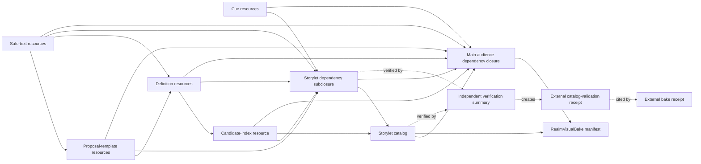

# M1C Storylet and Reviewed Station Bake

M1C is the completed final RealmForge bake-foundation slice. It compiles data-only Storylets and reviewed richer SecureMesh station kits into private, public, and capability-refined artifact variants. This page records the accepted implementation and evidence for developers and reviewers.

M1C remains an authoring, compilation, verification, and publication milestone. It does not observe a live operating system, render a world, move a Traveler, discover a peer, create a PresenceSession, negotiate a bridge, or grant authority.

## Current acceptance state

The complete M1C contract, compilation, package-verification, public/refinement signing and encryption, publication, and browser acceptance boundary is implemented and verified. Private packages bind external signature-envelope IDs; production runtime admission must resolve and cryptographically verify those envelopes through a trusted M2 port.

| Evidence | Current state |
| --- | --- |
| Ordered contract catalog | Verified at 109 flat V1 modules |
| Contract browser conformance | 39 passed, 0 failed |
| Independent Python canonical vectors | 6 passed, 0 failed |
| Legacy M1A private-bake regression | 15 passed, 0 failed |
| Legacy M1B public/refinement regression | 21 passed, 0 failed |
| Full M1C 35-case gate | Verified: 35 passed, 0 failed, 0 skipped on 2026-08-28 |
| Full M1C source-bundle and import audit | Verified: entry 110 modules, 0 skipped; harness 114 modules, 0 skipped |

These results verify the contract, backward-compatibility, and complete integrated M1C foundation. The exact 35-case gate passed with zero skips on 2026-08-28. (Source: `tests/network/realm/virtual-realm-m0.test.js`; `tests/network/test_virtual_realm_m0_vectors.py`; `tests/realmforge/virtual-realm-m1a-private-bake.test.js`; `tests/realmforge/virtual-realm-m1b-public-refinement.test.js`; `tests/realmforge/virtual-realm-m1c-storylet-station.test.js`.)

The independent vector evidence must be invoked through pytest:
`python -m pytest tests/network/test_virtual_realm_m0_vectors.py -q`.
Executing that file directly runs zero tests because it defines pytest cases
and no direct-run entry point.

## Locked milestone boundary

M1C adds four connected capabilities:

1. A declarative Storylet definition, proposal-template, candidate-index, subclosure, catalog, verifier, and validation-receipt pipeline.
2. Reviewed private and public SecureMesh station kit providers with deterministic content identity and structural authoring evidence.
3. Opt-in version-2 private, public, and refinement verification packages that preserve the version-1 paths.
4. Final bake-level certification fields that bind the station kit, Storylet validation receipt, and authoring evidence.

M1C does not add a second Storylet runtime. It compiles immutable data for a later runtime milestone. The existing function-based Storylet and episode implementations remain outside the bake graph. (Source: `webgpu-os/apps/realmforge/virtual-realm/compilers/RealmStoryletDefinitionCompiler.js`; `webgpu-os/apps/realmforge/virtual-realm/compilers/RealmStoryletCatalogCompiler.js`; `MD/webgpu-os/virtual-realm/storylets.md`.)

## Opt-in API and legacy compatibility

`RealmForgeBakeEntry` remains the sole application composition root. M1C adds three explicit compile entry points:

| API | Audience job | Additional input |
| --- | --- | --- |
| `compilePrivateBakeWithStorylets(input)` | Owner-private `PrivateRealmBake` | Exact `stationKitId` and `storyletAuthoring` |
| `compilePublicShellWithStorylets(input)` | Public-explicit `PublicRealmShell` | Exact `stationKitId` and `storyletAuthoring` |
| `compileAccessRefinementWithStorylets(input)` | Capability-refined `AccessRefinement` | `storyletAuthoring`; station binding derives from the verified base public shell |

The existing `compilePrivateBake()`, `compilePublicShell()`, and `compileAccessRefinement()` methods retain version-1 behavior. They continue to emit `storyletCatalogAbsent: true` and cannot silently opt into Storylet compilation. Existing verify and publish methods accept only their documented version-1 package or the exact version-2 package for the same audience variant.

The version discriminator is numeric and explicit:

| Package family | Legacy version | M1C version |
| --- | --- | --- |
| Private Realm bake package | `1` | `2` |
| Public Realm shell verification package | `1` | `2` |
| Sealed access-refinement verification package | `1` | `2` |
| Access-refinement canonical plaintext | `1` | `2` |

No content inspection, optional field, station-kit ID, or Storylet presence guesses the package version. Unknown versions and mixed version shapes fail before digest, signature, encryption, or publication work. (Source: `webgpu-os/apps/realmforge/virtual-realm/publication/RealmBakePackageCodec.js`; `webgpu-os/apps/realmforge/virtual-realm/publication/RealmAudiencePackageCodec.js`; `webgpu-os/apps/realmforge/virtual-realm/RealmForgeBakeEntry.js`.)

An M1C caller uses the opt-in method directly:

```javascript
const compiledPrivatePackage = await realmForgeBakeEntry.compilePrivateBakeWithStorylets({
  ...privateBakeInput,
  stationKitId: 'station-kit:securemesh-exchange-m1c-v1',
  storyletAuthoring,
});
```

The call supplies data only. It does not pass a runtime, callback, function-based Storylet, editor handle, renderer, filesystem handle, network session, or key object.

## Closed Storylet authoring input

The `storyletAuthoring` value is one exact plain-data transfer object:

| Key | Exact role |
| --- | --- |
| `catalogVersion` | Canonical semantic catalog version ID |
| `policyProfileId` | Exact application-owned policy ID; M1C accepts `storylet-policy:realmforge-m1c-v1` |
| `definitions` | Closed Storylet definition drafts without `format`, contract `version`, or `definitionHash` |
| `proposalTemplates` | Closed data-only proposal-template drafts without `format`, contract `version`, or `templateDigest` |
| `safeTextRecords` | Complete accepted `RealmSafeTextV1` records with exact audience and self digest |
| `cueResources` | Canonical records shaped as `{ resourceId, resourceKind, payload, dependencyIds }` |
| `authoringEvidenceRefs` | Canonically ordered external evidence IDs used by certification receipts |

The application resolves `policyProfileId`. Authored input cannot provide or modify the trusted policy body. `RealmStoryletPolicyKit` owns the shipped policy revision, source classes, category and scope/audience allowlists, priority bands, presentation channels, channel ceilings, action allowlist, candidate-work quotas, persistence limits, telemetry limits, and accessibility requirements. (Source: `webgpu-os/apps/realmforge/virtual-realm/compilers/RealmStoryletPolicyKit.js`.)

### Definition draft

Each definition draft supplies:

- `storyletId`, canonical `definitionVersion`, `realmType`, category, description safe-text ID, tags, and presentation channels.
- Exact audience, disclosure, scope, priority, concurrency class, and optional deterministic selection group.
- A bounded tagged-scalar trigger expression and canonically ordered semantic predicates.
- Cooldown, activation ceiling, required capabilities, anchors, bake revision, sockets, and complete dependency references.
- One sorted state set and deterministic transition set. Every `(fromStateId, eventKind)` pair has at most one transition.
- Per-transition presentation and action-request template references plus exact global template sets.
- Explicit expiry, cancellation, participant-drop, Chronicle, replay, accessibility, localization, and compiler policies.

Compilation rejects missing states, unreachable states, outgoing transitions from terminal states, non-terminal cycles with no terminal escape, unresolved templates, unused global templates, unsafe text references, audience crossing, and unresolved station anchors or sockets. (Source: `webgpu-os/apps/the-virtual-realm/contracts/RealmStoryletDefinitionContract.js`; `webgpu-os/apps/realmforge/virtual-realm/compilers/RealmStoryletDefinitionCompiler.js`.)

### Proposal-template draft

Each proposal template is a strict data-only record. It binds the trigger subject and trigger truth through closed binding objects. It contains tagged-scalar parameters, start and termination conditions, duration, reversibility, cleanup, dependencies, accessibility, safe text, and compiler identity.

A presentation template carries `presentationChannel` and no action fields. An action-request template carries `actionKind` and `idempotencyDomainId` and no presentation channel. An action request remains powerless; it must later pass through the generic action proposal, authority receipt, authoritative observation, and Realm delta path. (Source: `webgpu-os/apps/the-virtual-realm/contracts/RealmStoryletProposalTemplateContract.js`; `webgpu-os/apps/realmforge/virtual-realm/compilers/RealmStoryletProposalTemplateCompiler.js`.)

### Hostile-input boundary

The authoring input is validated as hostile plain JSON before semantic compilation. It rejects accessors, symbols, inherited fields, non-plain prototypes, cycles, unknown keys, executable values, malformed Unicode, non-canonical numbers, unbounded strings, scripts, workers, WASM, URLs, shaders, and dynamic code references.

The compiler receives no ambient clock or random source. Candidate semantics derive only from canonical content and the trusted policy. M1C source must not use `Math.random()`, `Date.now()`, dynamic imports, network APIs, or mutable process-global state. (Source: `webgpu-os/apps/the-virtual-realm/contracts/RealmContractValuePreflight.js`; `webgpu-os/apps/realmforge/virtual-realm/compilers/RealmCompilerPrimitives.js`; `tests/realmforge/virtual-realm-m1c-storylet-station.test.js`.)

## Flat peer architecture

M1C uses peer modules. No station provider, compiler, verifier, receipt builder, or publisher owns another application subsystem. `RealmForgeBakeEntry` selects the job and supplies every concrete dependency.

```mermaid
flowchart TB
  entry[RealmForgeBakeEntry composition root]
  station[Reviewed station-kit provider]
  policy[Application Storylet policy resolver]
  template[Proposal-template compiler]
  definition[Definition compiler]
  index[Candidate-index compiler]
  members[Member resource assembler]
  subclosure[Storylet dependency-subclosure compiler]
  catalog[Storylet catalog compiler]
  verifier[Independent Storylet catalog verifier]
  receipt[Catalog-validation receipt builder]
  assembler[Audience bake assembler]
  packageVerifier[Audience package verifier]
  publisher[Immutable publisher and terminal CAS]

  entry --> station
  entry --> policy
  entry --> template
  entry --> definition
  entry --> index
  entry --> members
  entry --> subclosure
  entry --> catalog
  entry --> verifier
  entry --> receipt
  entry --> assembler
  entry --> packageVerifier
  entry --> publisher
```



The diagram shows calls from the composition root and immutable value flow. It does not grant peer-to-peer ownership. Pure canonicalization and recomputation helpers may be shared without introducing a mutable manager.

| Peer module | Single responsibility |
| --- | --- |
| `RealmStoryletPolicyKit` | Resolve the one application-shipped M1C policy and verify its digest |
| `RealmStoryletProposalTemplateCompiler` | Compile exact data-only presentation or action-request templates |
| `RealmStoryletDefinitionCompiler` | Compile deterministic bounded definitions against templates, safe text, policy, and available dependencies |
| `RealmStoryletCandidateIndexCompiler` | Build and hash the canonical candidate lookup and enforce candidate-work quotas |
| `RealmStoryletDependencyClosureCompiler` | Build one audience-local acyclic subclosure that excludes the catalog |
| `RealmStoryletCatalogCompiler` | Bind definitions, totals, candidate index, policy, subclosure, station context, and audience |
| `RealmStoryletCatalogVerifier` | Independently recompute digests, refs, index, closure, station bindings, totals, and limits |
| `RealmStoryletCatalogValidationReceiptBuilder` | Convert an accepted verification summary into signed external evidence |
| `ReviewedStationKitValidator` | Validate immutable kit identity and structural authoring evidence |
| `ReviewedPrivateSecureMeshStationKit` | Resolve the versioned owner-private rich station family |
| `ReviewedPublicSecureMeshStationKit` | Resolve the independently authored public-explicit station family |
| Existing audience assemblers | Add the verified Storylet graph to the appropriate main closure and manifest |
| Existing package verifiers | Recompute the complete audience-specific v2 package |
| Existing publisher | Persist only approved immutable artifacts and commit the root last |

The modules live under `webgpu-os/apps/realmforge/virtual-realm/compilers/`, `station/`, and `publication/`. They import contract definitions and side-effect-free compiler primitives. They do not import a live Storylet runtime, Engine renderer, WebGPU OS driver, SecureMesh implementation, scanner, or editor session.

## Deterministic compile order

Every M1C audience job follows this dependency order:

1. Preflight the complete input and reject unknown or executable-shaped values.
2. Resolve the exact station kit through the injected variant-specific provider and verify its content ID and authoring evidence.
3. Resolve and digest-check the application-owned Storylet policy.
4. Compile and sort proposal templates.
5. Compile and sort Storylet definitions against templates, safe text, cues, station anchors, station sockets, and policy.
6. Compile the deterministic candidate index and recompute its work totals.
7. Build canonical member resource envelopes for definitions, templates, safe text, cue resources, and the candidate index.
8. Compile the Storylet dependency subclosure from the candidate index and cue roots.
9. Compile the Storylet catalog from exact member records, candidate-index digest, policy, and subclosure.
10. Independently verify the catalog, member set, subclosure, station binding, audience, totals, and resource ceilings.
11. Build and sign the external Storylet catalog-validation receipt.
12. Add the member resources, subclosure, and catalog to the main audience resource graph.
13. Assemble the `RealmVisualBakeManifestV1` with `storyletCatalogId`, never `storyletCatalogAbsent`.
14. Build the M1C-enriched bake receipt and required signatures.
15. Verify the complete version-2 package before returning it.
16. On an explicit publish call, write immutable artifacts, verify readback, and change the audience root by terminal compare-and-swap.

The access-refinement path performs base-public verification and exact authority verification before Storylet compilation, encryption, signing, or publication. A stale, revoked, mismatched, expired, extra-scope, or missing-scope authority result stops the job at that boundary. (Source: `webgpu-os/apps/realmforge/virtual-realm/RealmAudienceBakeCoordinator.js`; `webgpu-os/apps/realmforge/virtual-realm/compilers/RealmStoryletCatalogVerifier.js`; `webgpu-os/apps/realmforge/virtual-realm/publication/RealmRefinementBakePackageVerifier.js`.)

The public path performs two independent runs from the same explicit public input. The canonical comparison includes templates, definitions, safe text, cue resources, candidate index, Storylet subclosure, catalog, main closure, visual manifest, public shell, and all content-relevant signatures. Private-only variation cannot alter any compared public byte.

## Contract additions and hardening

M1C keeps every contract as a flat module. The ordered inventory is 109 contracts: 100 M0 contracts, three M1A additions, four M1B additions, and two M1C additions.

| Contract | M1C role |
| --- | --- |
| `RealmStoryletDefinitionContract` | Hardened semantic version, safe description, presentation channels, bake/socket bindings, state machine, template sets, Chronicle policy, replay policy, reachability, and terminal escape |
| `RealmStoryletProposalTemplateContract` | New closed data-only template with presentation/action-request exclusivity and exact audience-safe dependencies |
| `RealmStoryletCatalogContract` | Existing audience catalog with exact definition refs, totals, candidate-index digest, policy, and Storylet subclosure ID |
| `RealmStoryletCatalogValidationReceiptContract` | New narrow signed external receipt for catalog, closure, policy, station kit, totals, evidence, and passed invariants |
| `RealmBakeResourceLimitProfileContract` | Adds ceilings for Storylet states, transitions, proposal templates, and dependency references alongside definition count |
| `RealmBakeReceiptContract` | Adds the optional all-or-none M1C station kit, kit content, Storylet validation receipt, and authoring evidence bindings |
| `RealmVisualBakeManifestContract` | Requires exactly one of `storyletCatalogId` or `storyletCatalogAbsent` |

The Storylet validation receipt is local evidence. It is not a resource, a catalog member, a dependency-subclosure member, a main content-DAG dependency, a runtime authority receipt, or permission to perform an action. (Source: `webgpu-os/apps/the-virtual-realm/contracts/VirtualRealmContractCatalog.js`; `webgpu-os/apps/the-virtual-realm/contracts/RealmStoryletCatalogValidationReceiptContract.js`; `webgpu-os/apps/the-virtual-realm/contracts/RealmBakeReceiptContract.js`.)

## Storylet artifact graph

M1C builds two acyclic closures and keeps evidence outside both.



The text equivalent is:

- Definitions reference proposal templates, safe text, cues, and other declared audience-local dependencies.
- The candidate index summarizes canonical trigger and policy-relevant definition fields.
- The Storylet subclosure contains every definition, template, safe-text, cue, and candidate-index resource reachable from its roots.
- The Storylet catalog is deliberately absent from that subclosure, so the catalog can cite the completed subclosure without forming a cycle.
- The main bake closure contains the Storylet members, Storylet subclosure, and catalog alongside the static audience resources.
- The visual manifest cites the catalog and main closure.
- Validation and bake receipts remain external evidence after content identity is complete.

The independent verifier recomputes the candidate index, catalog definition refs, safe-text refs, subclosure roots and entries, station anchor/socket bindings, definition/state/transition/template totals, dependency-reference total, self digests, and every Storylet resource ceiling. (Source: `webgpu-os/apps/realmforge/virtual-realm/compilers/RealmStoryletCandidateIndexCompiler.js`; `webgpu-os/apps/realmforge/virtual-realm/compilers/RealmStoryletDependencyClosureCompiler.js`; `webgpu-os/apps/realmforge/virtual-realm/compilers/RealmStoryletCatalogVerifier.js`.)

## Reviewed rich station kits

M1C preserves both version-1 station kit modules and adds versioned reviewed providers. The private provider may compose the accepted private kit. The public provider composes only public-safe shipped data and never imports or derives from the private kit.

| Provider | Exact ID | Boundary |
| --- | --- | --- |
| Reviewed private station | `station-kit:securemesh-exchange-m1c-v1` | Owner-private, local-private rich station resources and local Operations landmarks |
| Reviewed public station | `station-kit:public-securemesh-shell-m1c-v1` | Public-explicit complete-looking shell resources with no live or private derivation |

Each provider returns `{ kit, authoringEvidence }`. The provider validates the requested ID, reconstructs the application-shipped expected kit, recomputes `kitContentId`, and rejects any difference. The selected provider is injected through the composition root; authored input cannot supply a replacement resolver. (Source: `webgpu-os/apps/realmforge/virtual-realm/station/ReviewedPrivateSecureMeshStationKit.js`; `webgpu-os/apps/realmforge/virtual-realm/station/ReviewedPublicSecureMeshStationKit.js`.)

### Private reviewed kit

The private kit extends the accepted +Z SecureMesh station with an accessible arrival zone, arrival canopy, semantic wayfinding arch, material and lighting intent, aligned collision, a step-free navigation lane, accessible ingress socket, LOD cluster, projection binding, glyph style, and audio zone. It retains deterministic ordering and the existing private station families.

The review binds the Root Spine orientation, station bounds, route widths, head clearance, socket clearance, local anchors, reachability, semantic captions, reduced-motion alternatives, renderer profile, provenance, license, and resource identities.

### Independent public reviewed kit

The public kit extends the public-safe station shell with shipped arrival and wayfinding archetypes, HLOD, captions, gate/socket references, protocol versions, renderer compatibility, and public resource envelopes. It remains complete-looking without encoding private building counts, file paths, topology, activity, peers, sessions, traffic, or capability state.

The public kit has its own source revision and content ID. A private kit change cannot alter its bytes. A public Storylet may reference only anchors, sockets, safe text, and cues present in its public audience closure.

### Review evidence boundary

Reviewed station evidence contains these closed sections:

| Section | Required evidence |
| --- | --- |
| Identity | Evidence ID, scope, kit ID, kit content ID, source revision, variant, audience, disclosure, and evidence digest |
| Accessibility | Step-free routes, accessible sockets, and semantic caption IDs |
| Clearance | Positive route width, socket clearance, and head clearance in metres |
| Navigation | Canonical routes and non-self reachability pairs between stable anchors |
| Provenance | Application-shipped source class, publisher, license, and asset content IDs |
| Renderer compatibility | Renderer profile, supported feature IDs, and limits profile |
| Reduced motion | Profile and semantic static alternatives |
| Semantic captions | Profile and canonical caption IDs |
| Visual QA | Passed structural checks with `renderedPixelEvidenceAbsent: true` |
| Invariants | Canonical checked-invariant IDs covering determinism, +Z, accessibility, safety, and privacy |

The M1C review is structural authoring evidence. It does not claim final rendered-pixel quality, device-specific lighting certification, final first-person sightlines, performance, or runtime accessibility. Those remain later rendering and release gates. (Source: `webgpu-os/apps/realmforge/virtual-realm/station/ReviewedStationKitValidator.js`.)

Station kits and evidence reject fields for live peers, packets, sessions, networks, routes from live transport, capability secrets, credentials, private keys, filesystem paths, source paths, processes, scripts, workers, WASM, URLs, or other executable and ambient data.

## Version-2 package boundaries

M1C preserves the audience separation established by M1B. Private, public, and refinement jobs never share a compiled Storylet resource, closure, catalog, station kit, ID namespace, or cache entry.

### Private version 2

The private version-2 verification package retains the version-1 private fields and adds the Storylet-bearing resource graph, reviewed private station binding, `storyletCatalogId`, Storylet catalog-validation receipt, enriched bake receipt, and required signature evidence.

- Every Storylet definition, template, text, cue, index, subclosure, and catalog is owner-private/local-private.
- The private catalog may remain local, but the validation and bake receipts are signed external evidence.
- Station authoring evidence remains local and is cited by ID. It does not enter the main content DAG.
- Publication writes immutable private resources, closures, catalog, manifest, and required content signatures. It retains local receipts outside the active root.

### Public version 2

The public version-2 compiler package adds the Storylet validation receipt and bake receipt to the local verification shape. Its content graph contains only public-explicit resources from explicit public input, the independently shipped public station kit, and public Storylet authoring.

The two-run noninterference comparison includes the complete Storylet compilation. It compares proposal templates, definitions, safe text, cues, candidate index, Storylet subclosure, catalog, main closure, visual manifest, public shell manifest, and content signatures. A difference rejects the candidate before a passing receipt exists.

Public publication strips local evidence and its signatures:

- Public noninterference receipt and signature.
- Storylet catalog-validation receipt and signature.
- Bake receipt and signature.
- Reviewed station authoring evidence.
- Compiler diagnostics and publication receipt.

The signed Storylet catalog and its reachable public content remain publishable. A remote consumer receives enough approved public architecture to render a complete embodied shell without receiving private data or local verification internals. (Source: `webgpu-os/apps/realmforge/virtual-realm/publication/RealmAudiencePackagePublisher.js`; `webgpu-os/apps/realmforge/virtual-realm/publication/RealmPublicBakePackageVerifier.js`.)

### Access-refinement version 2

The sealed version-2 access-refinement package retains the exact nine outer keys established by M1B. Storylet member resources, subclosure, catalog, validation receipt, bake receipt, and their inner signatures live only inside the canonical version-2 plaintext before encryption.

- The outer access root, encryption envelope, ciphertext, scope receipt, authenticated data, and exact outer signatures remain explicit.
- The station binding derives from the reverified base public shell and its refinement socket. The caller cannot substitute a private or foreign station kit.
- The refinement Storylet graph is capability-refined only and equals the authority-approved resource scope.
- Exact Storylet bytes, text, cues, receipts, and inner signatures remain ciphertext in publication artifacts.
- The local scope receipt, scope signature, authenticated-data convenience record, decrypted plaintext, and publication receipt are not published.

Authority verification occurs before Storylet compilation, encryption, or signing. Encryption still uses the M1B AES-GCM-256 adapter seam, fresh durable nonce identity, exact authenticated data, and immediate byte-identical open verification. (Source: `webgpu-os/apps/realmforge/virtual-realm/compilers/RealmAccessRefinementCompiler.js`; `webgpu-os/apps/realmforge/virtual-realm/publication/RealmRefinementBakePackageVerifier.js`; `webgpu-os/apps/realmforge/virtual-realm/publication/RealmAudiencePackagePublisher.js`.)

## Signing and evidence placement

| Record | Private v2 | Public v2 | Refinement v2 | Publication rule |
| --- | --- | --- | --- | --- |
| Storylet catalog | Local content identity | Signed transported content | Signed inside encrypted plaintext | Publish public signature; refinement signature remains encrypted |
| Storylet catalog-validation receipt | Signed local evidence | Signed local evidence | Signed inside encrypted plaintext | Strip from public; keep inside refinement ciphertext |
| Bake receipt | Signed local evidence | Signed local evidence | Signed inside encrypted plaintext | Strip from public; keep inside refinement ciphertext |
| Public noninterference receipt | Not applicable | Signed local evidence | Base public package is reverified | Strip receipt and signature |
| Refinement scope receipt | Not applicable | Not applicable | Signed outer local evidence | Strip receipt and signature |
| Reviewed station evidence | Digested local evidence | Digested local evidence | Derived station binding | Never a published content resource |

Every signature uses the existing external `SignatureEnvelopeV1` profile and binds the exact record digest, publisher, audience, policy context, lifetime where required, and operation context. Signature presence does not convert a receipt into runtime authority.

## The 35-case M1C gate

The accepted M1C run on 2026-08-28 registered exactly 35 non-skipped cases and reported 35 passes, 0 failures, and 0 skips.

| Case | Gate | Required success condition |
| --- | --- | --- |
| 1 | Private and public determinism | Fresh composition roots emit byte-identical private-v2 and public-v2 packages for identical inputs |
| 2 | Refinement deterministic semantics | Plaintext and authenticated data are byte-identical while independently allocated nonces produce fresh ciphertext |
| 3 | Immutability | Inputs remain unchanged and every returned package, record, array, and nested value is deeply frozen |
| 4 | Manifest catalog exclusivity | Every M1C manifest contains `storyletCatalogId`; every legacy manifest contains only `storyletCatalogAbsent: true` |
| 5 | Definition refs | Catalog definition refs are strict canonical `(storyletId, version, definitionHash)` tuples |
| 6 | Exact totals | Definition, state, transition, proposal-template, and dependency-reference totals recompute exactly |
| 7 | Candidate index | Independent recomputation equals the stored candidate index and catalog digest binding |
| 8 | Storylet subclosure | The subclosure is complete, reachable, acyclic, audience-local, and excludes the catalog |
| 9 | Main closure | The main closure contains every Storylet member, subclosure, and catalog with no dangling record |
| 10 | Graph attacks | Missing states, duplicate branches, terminal outgoing edges, unreachable states, and no-terminal-escape graphs reject |
| 11 | Strict templates | Unknown keys, functions, scripts, workers, WASM, URLs, shaders, and executable-shaped content reject |
| 12 | Proposal semantics | Presentation/action field exclusivity, idempotency domain, safe text, cleanup, and powerless action-request rules hold |
| 13 | Trusted policy | Only the application-resolved exact policy and its category, scope, channel, action, and work allowlists pass |
| 14 | Reserved remote bands | Remote/public definitions cannot claim kernel security, permission, identity, emergency, revocation, or warning bands |
| 15 | Hostile plain JSON | Accessors, symbols, cycles, prototypes, unknown keys, malformed strings, and unsafe values reject before semantic reads |
| 16 | Private disclosure | Every private Storylet member is owner-private/local-private and remains local |
| 17 | Public two-run coverage | Public noninterference compares the full Storylet graph and its content signatures |
| 18 | Private variation isolation | Radical private-only variation cannot change any public-v2 byte |
| 19 | Public sentinel omission | Public package, signatures, logs, diagnostics, and stored artifacts contain no private sentinel |
| 20 | Public dependency attacks | Cross-audience, local lookup, private, refinement, forbidden, and unlabeled dependencies reject |
| 21 | Refinement authority order | Base verification and authority verification complete before Storylet compilation, crypto, or signing |
| 22 | Exact granted subset | Refinement Storylet resources equal the capability-approved audience and resource scope |
| 23 | Ciphertext-only Storylets | Refinement Storylet definitions, text, cues, receipts, and inner signatures never appear outside ciphertext |
| 24 | Disjoint identity | Private, public, and refinement IDs, namespaces, station bindings, catalogs, and closures are disjoint |
| 25 | Re-digested tampering | Self-consistent digest changes still fail cross-record, policy, station, receipt, signature, and manifest verification |
| 26 | Definition ceiling | Exact definition limit passes and limit plus one fails before proportional allocation |
| 27 | Policy quotas | Candidate, predicate, work, channel, duration, and action quotas reject excess content |
| 28 | Resource limits | Bytes, member count, dependency refs, depth, fanout, states, transitions, and templates reject exact plus one |
| 29 | Rich-kit identity | Rich kits are deterministic, immutable, canonically ordered, versioned, provenance-bound, and content-addressed |
| 30 | Private station geography | +Z Root Spine, root/landmark bounds, collision, navigation, clearance, and step-free routes remain valid |
| 31 | Station QA attacks | Invalid evidence, mismatched kit identity, clearance, reachability, captions, provenance, renderer, or live fields reject |
| 32 | Independent public station | Public station remains complete-looking, independently authored, public-explicit, and free of live or private state |
| 33 | Station resource budgets | Every richer station family remains within the selected count, byte, and compiler-work ceilings |
| 34 | Publication and rollback | Readback, evidence stripping, terminal CAS, failure injection, and prior-root retention pass for all variants |
| 35 | Flat source boundary | Production imports no runtime Storylet, Playground implementation, network API, ambient random/time source, or dynamic import |

The executable matrix lives in `tests/realmforge/virtual-realm-m1c-storylet-station.test.js`. Its fixtures use only synthetic authored values. They do not scan a source tree or access an excluded application.

## Explicit exclusions and banned dependencies

M1C excludes:

- Live WebGPU OS observations, filesystem scanning, process inspection, IPC, syscalls, storage events, permissions, and network telemetry.
- ECS projection, scene loading, first-person traversal, the local Operations View, minimap rendering, picking, collision runtime, GPU rendering, audio playback, and visual effects.
- SecureMesh discovery, live nodes, peers, Travelers, PresenceSessions, RendezvousFrames, docking, bridges, route traffic, packets, and transport.
- Storylet scheduling, instance state, episode execution, Chronicle writing, replay, persistence, multiplayer synchronization, presentation dispatch, and action dispatch.
- Runtime imports from `StoryGraph`, `StoryletRuntime`, `StoryletEligibilityBridge`, `OSEventGraphAdapter`, `StoryletVersionManager`, `StoryletFailureHandler`, function-based RealmForge Storylets, or Navi runtime modules.
- Playground source, loader globals, demo WGSL, demo UI, demo camera behavior, demo authored topology, or fallback behavior.
- Any source, test, scan, dependency, fixture, or design input from the explicitly excluded First Shard.

M1C compiles authored records only. A Storylet can describe a later proposal but cannot execute it, grant a capability, claim success, mutate an OS resource, or fabricate telemetry.

## Rollback boundary

M1C is additive and recoverable:

1. Version-1 compile, verify, and publish methods remain available and retain their exact legacy shape.
2. A version-2 candidate stays in memory until complete Storylet, station, package, signature, and encryption verification passes.
3. A compile or verification failure creates no active root and mutates no `.proasset` source.
4. Publication writes immutable content-addressed artifacts and verifies each readback before the manifest or audience root becomes selectable.
5. Active-root compare-and-swap remains the terminal mutation. A conflict leaves the prior root active.
6. Newly written but unreachable immutable artifacts may remain for later bounded garbage collection. They never become an implied partial package.
7. Public rollback cannot select a private or refinement root. Refinement rollback cannot expose decrypted plaintext.
8. Removing the opt-in version-2 path leaves accepted version-1 packages and roots intact.

Rollback selects a previously verified immutable root. It never rewrites authored source, reclassifies disclosure, decrypts retained ciphertext, or filters a private graph into a public graph.

## Final evidence ledger

The complete integrated M1C acceptance gate ran successfully on 2026-08-28; the implementation evidence rows below are verified.

| Evidence | Acceptance requirement | Current state |
| --- | --- | --- |
| Contract inventory | 109 ordered, unique, accepted fixtures | Verified |
| Legacy regressions | M1A 15/15 and M1B 21/21 | Verified |
| M1C deterministic compile | Private, public, and refinement cases pass | Verified |
| M1C Storylet graph and policy attacks | Cases 4 through 28 pass | Verified |
| Reviewed station certification | Cases 29 through 33 pass | Verified |
| Publication and rollback | Case 34 passes across all variants | Verified |
| Flat import and forbidden-source audit | Case 35 passes | Verified |
| Full M1C harness | Exactly 35 passed, 0 failed, 0 skipped | Verified on 2026-08-28 |
| Documentation discovery rebuild | Search, nav, and LLM indexes rebuilt; 228,690 documentation checks pass across 2,727 API modules | Verified on 2026-08-28 |

### Frozen acceptance fixture and version lock

The version-1 non-authority-bearing integration ledger at
`tests/realmforge/fixtures/realmforge-m1c-rf-ge5-freeze-ledger-v1.json`
freezes this accepted producer boundary together with the existing RF-GE5
authoring-evidence owner. Its canonical `milestones` SHA-256 is
`328bd8322861ff3fa452726fb42e169d2630b5f814d3ee24e66a070ded04da7f`.

The M1C milestone pins the version-1
`particle-realms.realmforge.virtual-realm-m1c-freeze-vectors` fixture at
canonical JSON SHA-256
`d8b54fdac97a5f471142d5d0c4c72b138cbaca1ef2f47a00c20cf7ef4a4f6816`,
its version section at SHA-256
`a81b79e7a572e6ef457336761aa573462cfa8b465923872773287efb5b5cc7ce`,
and the normalized-LF historical 35-case suite at SHA-256
`d6b63bc967474bcb55336950745e920e78c8afe65b8d5402c23247907a265132`.
Private, public, refinement-outer, and refinement-plaintext formats and both
reviewed station kits remain version 2. Reviewed-station evidence, the Storylet
candidate index, and the Storylet policy remain version 1, and the eight
Storylet compiler identities remain `m1c-v1`.

The same ledger references, but does not replace, the existing RF-GE5 owner:
fixture version 1 is pinned at canonical JSON SHA-256
`184bc35cf8bd19d2a97ee403cfad6ae67e9d376c4523a098d0abfa5a357419f9`,
its normalized-LF historical 29-case suite is pinned at SHA-256
`e722450686fae9a009cac6dc861693f4b2b910edb853793d0bf13af46024c2ce`,
and its domain pack remains
`realmforge.genesis-ecology.evidence@5.0.0`.

The ledger fixes `authorityBearing: false` and `runtimeActivation: false`.
It freezes M1C acceptance evidence only and neither attests to nor advances M2.
Storylet records remain byte-identical and inert, and the ledger creates no
runtime, ECS, GPU, audio, input, rendering, publication, identity, activation,
or execution authority.

M1C is complete: its implementation, legacy regressions, bundles, exact 35-case gate, and documentation discovery artifacts are verified as of 2026-08-28. Later runtime milestones remain separately gated.

## M1C-to-M2 executable handoff

M1C is the immutable producer boundary for full base M2. M2 consumes the frozen
result of `verifyPrivateBake()`. It never consumes RealmForge authoring input,
constructs a station provider, imports a compiler, or recompiles the world at
application startup. (Source:
`webgpu-os/apps/realmforge/virtual-realm/RealmForgeBakeEntry.js`;
`webgpu-os/apps/realmforge/virtual-realm/publication/RealmBakePackageVerifier.js`.)

The accepted producer call sequence is:

```javascript
const compiledPackage = await realmForge.compilePrivateBakeWithStorylets(input);
const verifiedPackage = await realmForge.verifyPrivateBake(compiledPackage);
const publicationReceipt = await realmForge.publishPrivateBake({
    compiledPackage: verifiedPackage,
    storage,
    expectedActiveRootId,
});
```

Full M2 requires the owner-private version-2 package. Its format is
`particle-realms.private-realm-bake-package`, its version is `2`, and it has
exactly these 17 top-level keys:

```text
format
version
audienceProjection
layoutPolicy
resourceLimitProfile
topologyNodes
topologyEdges
layoutReceiptId
layoutReceipt
localOperationsLookup
resources
dependencyClosure
manifest
manifestDigest
optimizationReceipt
bakeReceipt
storyletValidationReceipt
```

An M2 diagnostic may inspect a legacy version-1 package. It cannot claim the
complete M1C station, safe-text, Storylet-catalog, or integrated M2 gate. A
shipping M2 launch rejects public-shell roots, access-refinement roots, unknown
private versions, and mixed version shapes before allocation.

### Runtime, dormant, and evidence planes

| Plane | M1C records handed forward | M2 rule |
| --- | --- | --- |
| Static runtime content | Topology, spatial layout, ten static visual-resource families, local Operations lookup, safe text, stable IDs, exact dependencies, canonical records, byte lengths, and content digests | May enter the immutable static store after complete admission |
| Dormant M3-forward content | Storylet definitions, proposal templates, cues, candidate index, Storylet subclosure, and Storylet catalog | Verify and retain as inert immutable content; do not evaluate, schedule, instantiate, reserve, present, persist, or dispatch |
| Admission evidence | Audience projection, layout policy, resource-limit profile, optimization receipt, bake receipt, and Storylet validation receipt | Verify before allocation; keep outside ECS and renderable resources |
| External trust evidence | Reviewed station evidence, Storylet policy, Storylet-authoring review, signature envelopes, publisher identity, and verifier identity | Resolve through owner-partitioned trusted ports under immutable evidence policy, authenticated reviewer/provisioner authority, and current five-role signature trust; an ID reference or self-asserted pass is not verification |

M3 may activate the inert Storylet catalog only through the separately gated
Storylet runtime. It must preserve the M1C catalog ID, catalog digest,
definition hashes, candidate-index digest, policy digest, and subclosure. M2
must not import `StoryGraph`, `StoryletRuntime`, `StoryletEligibilityBridge`,
`OSEventGraphAdapter`, or another function-based runtime to make the package
appear active.

### Current durable-publication gap

`RealmBakePublisher.publish()` currently writes each resource's canonical
record text under its semantic `resourceId`, writes the dependency-closure
record under `closureId`, writes the manifest under `bakeId`, and then selects
that `bakeId`. It does not store the complete 17-key package, resource-envelope
metadata, audience projection, policies, optimization receipt, bake receipt,
Storylet validation receipt, reviewed station evidence, or referenced
signature envelopes. An active `bakeId` therefore cannot reconstruct the exact
object required by `verifyPrivateBake()` after restart. (Source:
`webgpu-os/apps/realmforge/virtual-realm/publication/RealmBakePublisher.js`.)

This is an M2 production-admission prerequisite, not permission to widen or
silently rewrite the accepted M1C format. Existing private roots require one
fresh compile, verification, and admission migration before they become
runtime-selectable. A manifest-only root must fail closed instead of being
partially materialized.

### Locked durable admission capsule

M2 adds a separate local-only `RealmPrivateBakeAdmissionIndexV1` and a
content-addressed canonical package artifact. The exact history-independent
index has 71 top-level fields and binds:

- operator partition, local Realm, M1 publication scope/root/generation/exact
  head-file SHA, package format, and exact package version;
- exact canonical package blob identity and byte length, an independently
  recomputed RealmForge semantic hash, bake ID, manifest digest, dependency
  closure ID/digest, and ten exact package-member bindings;
- three deterministic chunked inventory roots for every resource envelope,
  authoring-evidence record, and signature envelope, including exact
  digest/blob/count/byte bindings and strong payload-byte addresses;
- resource-limit profile, layout policy, layout receipt, local Operations
  lookup, optimization receipt, and bake receipt identities and digests;
- Storylet catalog, validation receipt, reviewed station kit, policy, and
  authoring-evidence identities and digests;
- every required external signature-envelope reference, verifier identity,
  runtime capability profile, admission policy revision/digest, and the index's
  own canonical digest.

The admission service uses bounded exact-byte APIs beneath a kernel-private
operator/service root. It stores the complete verified package and required
local evidence, reads them back, recomputes every digest, resolves and verifies
the exact four-or-five external signatures through the closed six-row/five-role
table, and writes the admission index. Opaque evidence references first enter
through the four-kind absent-only provisioner under a complete immutable
evidence policy and authenticated Storylet reviewer authority. A shared maintenance fence
keeps concurrent collection away from in-flight bytes until a service-generated
fixed proposal/intent/pending slot is read back and makes its proposal graph the durable
root. Prior/current terminal lineage and reclaiming later bound control
retention. Admission then releases maintenance.
`RealmAdmissionSelectionCoordinator` closes the final versioned-M1,
admission-policy, Realm-scoped signature-trust, and exact-byte M2-head interval; durable
dispatch and recovery-retry markers bound any uncertain CAS recovery.
The M1 publication head, the durable M2 admission head, and the in-memory M2
active-bundle pointer are three distinct state transitions.

The current M1 publisher exposes a root ID but no durable generation or exact
head-byte observation. Its production storage adapter must add a versioned,
ABA-resistant private-head record while preserving the accepted publisher API.
Legacy roots without that observation remain explicit migration input; M2 does
not invent a publication generation.

At startup, M2 resolves the current admission index, reconstructs the exact
package through the app's read-only `bakeAdmissionPort`, and receives it only
after the trusted service internally performs M1C, evidence, signature, and
current-trust verification. The app performs its separate runtime/local-only
compatibility checks, builds the static store off-active, and only then offers
the candidate for atomic runtime activation. The trusted activation guard
retains selection while it reasserts both heads, current admission/evidence/
trust/signature closure, every envelope lifetime against the trusted service
clock, and the complete runtime profile, then swaps the
visible bundle before releasing the fence. A receipt cannot substitute for
the admission index because the load receipt exists only after reconstruction
and verification.

### Handoff continuity gates

M2 cannot pass unless all of these remain true:

1. The original 109-contract catalog stays byte-for-byte ordered and unchanged.
2. The M0 39-case catalog gate, six engine-foundation cases, ten local-operator
   cases, six signer-completion cases, six Python vectors, M1A 15-case gate,
   M1B 21-case gate, and M1C 35-case gate still pass with no skips.
3. The full M2 profile admits only a completely rehydrated and independently
   reverified private version-2 package.
4. Unknown keys, versions, resource kinds, compiler identities, evidence,
   signatures, digests, byte lengths, dependencies, or audience bindings fail
   before CPU, ECS, GPU, audio, or input allocation.
5. The local Operations lookup resolves only the current owner-private Realm.
6. M1C Storylet records remain byte-identical and dormant throughout M2.
7. Each authority obeys its own dispatch boundary. Failure before an M1/M2/root
   dispatch marker preserves that authority; post-dispatch uncertainty is
   reconciled only from exact predecessor/proposal observations. An explicit
   migration may leave a newly selected M1 publication if later M2 admission
   fails, and M2 may durably commit a head that current verification marks
   ineligible. Neither case changes the visible runtime bundle. Candidate
   staging or final activation denial before CSE step 8 always leaves the prior
   visible bundle unchanged. A hostile violation by the prevalidated CSE port
   after step 8 is not ordinary activation failure: it closes both gate sets,
   exposes neither world, and enters M2's explicit integrity-quarantine/restart-
   reconciliation state.
8. M2-GE, when enabled, binds a separate extension to the accepted M1C base
   bake and never mutates this package or its catalog.

The dependency-ordered implementation continues in the
[M2A runtime composition](m2a-runtime-composition.md),
[M2B private-bake admission](m2b-private-bake-admission.md),
[M2 runtime foundation](m2-runtime-foundation.md), and
[M2 Engine and ECS foundation](../../engine/virtual-realm-m2-engine-foundation.md).

## See also

- [Virtual Realm architecture and ownership](architecture.md)
- [RealmForge bake pipeline](realmforge-pipeline.md)
- [M1A owner-private SecureMesh station bake](m1a-private-securemesh-bake.md)
- [M1B public shell and access-refinement packages](m1b-public-refinement-packages.md)
- [M2A runtime composition](m2a-runtime-composition.md)
- [M2B private-bake admission](m2b-private-bake-admission.md)
- [Contract catalog](contracts.md)
- [Storylets](storylets.md)
- [Security and privacy](security-privacy.md)
- [Implementation roadmap](implementation-roadmap.md)
- [Certification plan](certification-plan.md)
