# Virtual Realm M3 Living City Runtime

After integrated M2 acceptance, M3 makes the accepted M2 static city live. WebGPU OS observations animate real
processes and routes, exact local source can become lease-bound Code Matter,
Storylets explain and request rather than mutate, and durable topology changes
still pass through RealmForge bake activation. The optional Living Digital
World track activates a controlled local Genesis extension and Software
Foundry without widening the base bake or the frozen contract catalog.

M3 is owner-private and local. It publishes no public shell and accepts no
remote presence, Traveler, rendezvous, bridge, or multiplayer state.

## Entry conditions

M3 begins only when:

- the integrated M2A-M2H gate passes;
- the active private bake, static store, ECS materialization, first-person
  controller, Operations View, device recovery, and disposal receipts are
  valid;
- CSE multi-store commit and deterministic RNG blockers required by the
  [Engine and ECS plan](../../engine/genesis-ecology-engine-plan.md) are closed;
- operator-scoped private storage and semantic promotion are available through
  the [WebGPU OS plan](../genesis-ecology-os-plan.md);
- observation ports can supply bounded immutable snapshots and subscriptions;
- the OS observation instrumentation below exists; current kernel services do
  not yet expose the complete normalized ports assumed by the projection plan;
- no M3 source depends on a Playground implementation or global Engine lookup.

The exact first slice is [M3A Observation Ingress](m3a-observation-ingress.md).
It preserves M2's frozen 15-key dependency object by using a separate two-port
M3A composition root and one prebound aggregate ingress service.

The exact second slice is
[M3B Disclosure and Dynamic Projection](m3b-disclosure-projection.md). It
preserves both prior dependency objects through a separate three-port root,
sixteen-definition catalog, and one protected derived-state commit boundary.
M3B implementation cannot begin merely because its plan exists; it requires an
accepted integrated M2 and accepted implemented M3A with all 22 gates and 48
cases passing, followed by separate acceptance of the M3 projection-transaction
profile, full-bundle codecs, nonexpiring artifact leases, root-owned reader and
recorded-authority escrow, retained-head/floor evidence, durable selector CAS,
separate 24/18/18-field application/recovery/selector-retirement journals under
one shared quota, exact 37-field commit-port recovery, and fail-closed process-
local mirror.

## Locked M3 outcome

The integrated M3 city can:

1. Show one causally cited boot-to-process-to-syscall-to-IPC-to-storage/network
   route using real local observations.
2. Distinguish observed, asserted, inferred, simulated, proposed, historical,
   stale, unavailable, and undisclosed state.
3. Show sealed and structured Code Matter, then reveal exact authorized source
   byte for byte under a local lease.
4. Run deterministic local Storylets whose actions remain proposals.
5. Present one local Software Foundry build, test, activation, repair, rollback,
   packaging, and recycling path from real receipts.
6. Project local development, regulation, homeostasis, resources, reactions,
   lineage, roles, culture, QD, and dormancy evidence without granting authority.
7. Submit local Operations View proposals and reconcile their actual result.
8. Stage and atomically activate an authorized topology rebake without losing
   ordered observations or the current safe Traveler anchor.
9. Replay Chronicle records with zero live side effects.

Items 5 and 6 are required for the opt-in Living Digital World track. The base
M3 city can certify its local observation, Code Matter, Storylet, topology, and
Chronicle path without enabling Genesis. Automatic evolution, automatic
mutation, higher-order Soul Seed minting, public ecology exchange, and remote
culture transmission remain disabled in both tracks.

## M3 runtime planes

```mermaid
flowchart LR
  os["WebGPU OS source authorities"] --> port["Domain observation ports"]
  port --> ingress["Cursor, dedupe, ordering, and gap detection"]
  ingress --> authorityEvidence["Batch recorded-authority resolution and escrow"]
  ingress --> staticEvidence["Subject-only static binding and anchor closure"]
  authorityEvidence --> disclosure["Owner-private disclosure evaluator"]
  staticEvidence --> disclosure
  disclosure --> domain["Neutral shared semantic kernel"]
  domain --> batch["Canonical projection batch"]
  batch --> reducer["RealmDelta reducer"]
  reducer --> bundle["Complete immutable projection bundle"]
  bundle --> selector["Durable selector-generation CAS"]
  selector --> dynamic["Six-channel DynamicStore snapshot"]
  selector --> ecs["Full stable-ID ECS overlay"]
  ecs --> render["State-First semantic source, then M2 presentation"]
  dynamic --> story["Storylet input snapshot"]
  story --> proposals["Presentation or action proposals"]
  proposals --> authority["WebGPU OS authority"]
  authority --> os
```



Presentation order cannot create causal order. A renderer, Storylet, inference,
or historic witness never writes back into a source authority.

## Source ownership matrix

| Domain | Owning source boundary | Projection examples | Prohibited payload |
| --- | --- | --- | --- |
| Boot | Kernel/bootstrap observations | Root Spine power-up, readiness gates, service sequence | Secrets, raw boot logs, inferred completion |
| Filesystem | Canonical storage source's filesystem observation view | Containment streets, file/package structures, change markers | Unauthorized paths or contents |
| Process | `ProcessTable` observation port | Buildings, machinery, activity, lifecycle | Command lines, environment, stack traces unless separately allowed |
| IPC | Kernel IPC/event observation port | Local service conduits and delivery pulses | Message payloads, raw handles, capability tokens |
| Syscall | Guarded syscall observation port | Typed request/completion routes | Arguments, return values, credentials, dispatch authority |
| Storage | Canonical storage source's storage observation view | Vault activity, capacity, pressure, transaction state | Keys, plaintext data, private record names |
| Permission/action result | Authority observation port | Gates, checkpoints, granted/denied state, terminal authoritative result | Capability token material or authority methods |
| Network | Local `NetworkDriver` observation port | Local station boundary and real local traffic classes | Remote presence or private packet contents in M3 |
| Code Matter | Exact local content authority | Sealed descriptors, structured tokens, revealed glyphs | Bytes outside the active lease |
| Genesis | CSE/semantic transaction and ECS projection ports | Foundry, phenotype, homeostasis, lineage, role, culture, QD | Private canonical records not admitted to the projection |

(Sources: `webgpu-os/kernel/ProcessTable.js`;
`webgpu-os/kernel/VirtualFS.js`; `webgpu-os/kernel/Syscalls.js`;
`webgpu-os/kernel/Permissions.js`; `webgpu-os/storage/StorageManager.js`;
`webgpu-os/drivers/NetworkDriver.js`.)

Filesystem and storage projections receive the same canonical injected storage
generation. One underlying VFS/storage event cannot become two semantic events
merely because two projectors use it.

## Required WebGPU OS observation instrumentation

Existing services are reusable authorities, but they are not yet normalized
Realm observation sources. M3 first adds trusted OS-side adapters; it does not
make projectors scrape mutable managers.

| Source gap | Required instrumentation |
| --- | --- |
| Boot progress is presentation-oriented and not retained as a normalized ledger | `RealmBootObservationAdapter` with generation, ordered milestones, terminal state, and bounded snapshot |
| `ProcessTable` metrics are browser-level estimates and some counters have no producer | `RealmProcessObservationAdapter` with explicit quality, sampling policy, lifecycle sequence, and no arguments/environment |
| VFS can re-emit storage events without preserving one canonical identity | `RealmCanonicalStorageEventSink` assigns one shared event ID before fan-out; `RealmCanonicalStorageObservationAdapter` owns one atomic authorized inventory/tail and emits exactly one primary M0 observation per raw mutation |
| Filesystem snapshots and storage listeners can carry raw paths | The combined canonical adapter performs irreversible kernel safe normalization, opaque identity projection, protected-root recursion exclusion, and separate filesystem/storage semantic sampling before the app boundary |
| IPC exposes no sanitized lifecycle/causal/latency/backpressure stream | `RealmIpcObservationSink` emits endpoints by opaque ID, lifecycle, causal references, metric quality, and no payload |
| Syscalls have no uniform entry/terminal observation sink | `RealmSyscallObservationSink` records typed call class, proposal/result linkage, safe outcome, timing class, and authority receipt reference without arguments/results |
| Permission auditing is denial-oriented and lacks one grant/revoke/policy/result stream | `RealmAuthorityObservationSink` uniquely sequences permission decisions and canonical terminal action-result observations with policy revision, capability epoch, expiry, revocation, safe reason, and retained authority correlation |
| Kernel events lack source generation and canonical sequence | Each one trusted source adapter assigns its own generation and sequence before normalization; `RealmObservationLedger` only validates and admits, freezes causal/vector cuts, and never renumbers source evidence |
| Network services expose transport state rather than Realm-safe observations | `RealmLocalNetworkObservationAdapter` emits only local boundary and audience-safe route classes in M3 |

The application never receives these internal adapters. One trusted
`realmObservationIngressPort@1` is prebound to the exact operator, Realm,
process owner, M2 lifecycle/active bundle/CSE output/visible commit/current
heads/runtime profile, owner-private/local-private audience, and M3A safe-
normalization/profile/catalog/manifest plus kernel pseudonym-key
authority/epoch/commitment portable scope. A restricted internal HMAC projector
exposes neither key nor preimage, remains stable across consumer restart, and
forces all source generations plus the portable binding to advance on explicit
rotation. Kernel-only append-only references retain historical segment,
checkpoint, and recovery-journal epochs until exact retirement evidence exists;
one atomic complete-set binding drain closes final old-binding references, and
old key material retires at verified zero references while its non-reactivating
metadata tombstone remains. Terminal eligibility follows one exact seven-row
continuation-reason precedence map, with normalization-policy change distinct
from M2 binding change, and its first result is durably latched for record-first
retry. Projection handles are owner-generation branded: a live generation
uses atomic issuance/row registration and requires object-identical close, while
a no-handle generation requires sealed nonissuance and only a durably retired
generation may use a cumulative zero-handle/zero-in-flight fence. Exact complete-
lineage released/absent-after-restart aggregate evidence binds the current proof
plus any required prior fence, or the sole absent fence, and gates the drain; a
blocked drain emits one of seven bounded safe condition kinds even when no
reference or protected-edge ID can be disclosed. A separate process-local
M3A extension claim binds its opaque work roots without widening the M2 process-
owner child domain. The continuation service reuses M2's retained initial
operator projection and later current assertions; it never takes a second
operator snapshot. Stable post-loss presentation is exposed as ready only with
the exact accepted `RealmDeviceRecoveryReceiptV1` ID/digest and twice-equal
kernel-only verification of its lost/replacement generations, runtime bundle,
restored source, and resumed state. `openCursor()`
establishes tail capture before freezing a snapshot watermark and returns only
ready/changed/gap/unavailable/closed;
`captureCut()` owns records/empty/gap/overflow/changed/unavailable/closed plus
retained floor/ACK. Both perform idempotent callback-quiescent close. The
complete port, cursor, limit, cut, ledger, recovery, and teardown contract is
frozen in
[M3A Observation Ingress](m3a-observation-ingress.md).

Raw events remain inside trusted kernel adapters. The application receives
immutable, bounded, sequenced, safe-normalized `owner-private + local-private`
M0 records. M3B owns any later pure audience disclosure. The M3A ledger and
operator-private checkpoint sidecar retain only safe records and coordination
evidence admitted by policy. Durable batch identity is binding-scoped and omits
the process-local ingress generation and scheduler cycle, so restart restores
the ledger sequence rather than creating different bytes.

## Separate M3 slice catalogs

The M0-M1C inventory remains frozen. M3 does not create one mutable catalog
containing future placeholders. Each implementation slice registers a complete,
opt-in, no-stub catalog through the existing registry.

M3A registers exactly eleven runtime coordination definitions: ingress profile,
source manifest, source descriptor, ingress binding, source cursor, observation
batch, separate ingress checkpoint, ingress recovery receipt, ledger-append
receipt, checkpoint-commit receipt, and ledger-compaction receipt. It reuses the
existing M0 observation/snapshot/domain/metric definitions. See
[M3A Observation Ingress](m3a-observation-ingress.md#separate-m3a-runtime-catalog).

Later slice catalogs add only when implemented:

| Slice | Planned contract families |
| --- | --- |
| M3B | A separate exact 16-definition catalog: runtime profile, domain manifest, runtime binding, disclosure policy, input cut, disclosure decision set, projection batch, applied cursor, DynamicStore snapshot, ECS change set, State-First source snapshot, application intent/receipt, recovery receipt, projection state root, and disposal receipt |
| M3C | `RealmBakeTransitionJournalV1` and exact projection-to-M2-activation linkage |
| M3D | Code Matter lease, vault, token, line-stream, atlas, glyph, and disposal sidecars |
| M3E | `RealmStoryletRuntimeReceiptV1` and exact local runtime correlations |
| M3F-M3G | Separate optional Genesis contracts and extension receipts |
| M3I | `RealmChronicleSegmentV1` plus a separately versioned, graph-verified living-runtime continuation sidecar |

No record contains live ports, callbacks, raw OS handles, storage keys, source
leases, GPU resources, or executable expressions. M3 does not widen the exact
M2 checkpoint or handoff V1. M3A keeps a separate protected checkpoint graph;
its closed edge schema is ordered, capped, self-digested, target-resolved, and
complete only over M3-owned roots, while its M2 binding is validation-only.
M3I may later define a new continuation sidecar. Runtime transfer never carries
subscriptions, abort controllers, rings, GPU objects, source leases, plaintext
atlases, network sessions, or kernel handles.

## Observation cursor protocol

Every base source follows the exact atomic-open, portable-cursor/live-binding,
retained-floor/ACK, seven-source vector-watermark, deterministic batching,
gap/overflow recovery, checkpoint-sidecar, and callback-quiescent teardown
protocol in [M3A Observation Ingress](m3a-observation-ingress.md). A push-only
`snapshot()` plus `subscribe()` pair is insufficient and is not an accepted
implementation seam.

Cross-source events remain concurrent unless explicit causal parents relate
them. Sorting by timestamp, arrival, frame, or visual route does not create a
happens-before edge.

## Pure disclosure and projectors

Each admitted M3A observation passes through the exact M3B preserve-or-omit and
primary-owner steps:

```text
RealmObservationBatchV1 bytes
  -> recorded authority resolution for every authority-domain observation
  -> RealmProjectionDisclosureEvaluator
  -> exactly one primary manifest owner
  -> immutable primary outcome, RealmDeltaV1 records, and optional exact
     RealmPresentationCommandV1 bytes
  -> 41-field RealmProjectionBatchV1 command pairs plus protected closure
  -> optional non-owning historical witness over one complete historical outcome
```

The disclosure projector either preserves a record's M3A ID, digest, and bytes
or emits a payload-free omission row with one closed reason. It never emits a
redacted variant under the same identity. A primary projector can emit zero or
more immutable deltas against existing admitted anchors. It cannot invent an
anchor, road, building, collision shape, navigation cell, capability, public
object, Code Matter object, Genesis object, station, bridge, or remote presence.

M3B primary projectors are separate peers in exact manifest order:

- `RealmBootProjector`
- `RealmFilesystemProjector`
- `RealmStorageProjector`
- `RealmProcessProjector`
- `RealmIpcProjector`
- `RealmSyscallProjector`
- `RealmPermissionProjector`
- `RealmNetworkProjector`

`RealmPermissionProjector` owns one authority domain over both `permission` and
`action-result`. `RealmHistoricalWitnessProjector` is a ninth manifest peer but
owns no observation kind. It receives only one complete already accepted
historical primary outcome, emits at most one historical presentation delta into
a disjoint audit-only store by reusing the exact accepted primary command, never
mints or rewrites a second command, never recurses, and cannot affect current keys, ECS,
picking, authority, or live State-First slots. It still consumes a valid
zero-primary-output outcome exactly once and freezes a zero-output witness row.
Historical primary deltas remain closure-only; only an emitted witness artifact
enters the disabled historical store. Code Matter joins only in M3D;
Genesis joins only in M3F.

Recorded-authority resolution runs once over every structurally valid authority-
domain observation in the frozen batch before the 28-field input cut and
disclosure decision set freeze. Its complete receipt/signature/trust evidence is
returned in root-owned escrow. The separate complete 13-field current-authority
snapshot remains presentation-fence-only and may only fail closed. Static
resolution accepts subject IDs only and returns the complete authorized binding/
anchor closure; no caller may probe or nominate an anchor before resolution.

One generic `RealmDomainProjector` switch over every payload family is rejected.

## Canonical projection batches

M3A creates the admitted observation batch. The separate M3B projection-batch
assembler creates one later batch only after:

- byte-for-byte M3A batch, record, append, recovery, source-state, and binding
  validation, one exact 11-field retained-head/floor state value, and complete
  bounded reader escrow-manifest bytes/read receipt;
- bounded recorded-authority resolution and escrow for every authority-domain
  observation before pure owner-private disclosure freezes one decision per
  record;
- exactly one primary-owner outcome per included observation;
- subject-only resolution of the complete authorized projection-binding/anchor,
  active-bake, layout, static-store, and projection-binding-index closure;
- a separate complete current-authority snapshot bound only to the presentation
  fence;
- semantic-axis non-upgrade, delta/payload identity recomputation, operation
  subset, per-record/per-batch/global work ceilings, and deterministic ordering;
- optional historical-witness output after all primary outcomes freeze.

The embedded 16-field recipe matrix contains exactly 53 event rows, 130 primary
operation slots, 16 descriptor roles, and one witness recipe. M3A contributes
exactly six local-network event variants; `authenticated` is excluded because it
requires `peerIdentityRef`, and peer authentication remains M5 work. Every base-
M3B IPC, syscall, and network route is `non-traversable`.

One M3A batch produces exactly one M3B batch, including a legal zero-delta batch.
The input schema has exactly three 28-field variants. `source-state-ready`
supplies evidence-complete changed source/tick state; unchanged `idle` creates no
artifact. Source-state and expiry are the only maintenance cuts; they emit no M0
delta and advance no M3A batch cursor. Current traffic alone derives finite
expiry as saturating cut tick plus one; every other primary Delta uses expiry
`"0"`. An expiry cut requires the exact service-
issued 16-field due receipt grounded exclusively in M3A-owned durable tick
evidence, selects only the least finite boundary above the prior
frontier and at or below the proven source tick, advances the frontier, and never
repeats it. `RealmProjectionDeltaReducer` and the separate
candidate builder purely create a complete six-channel snapshot, full stable-ID
ECS overlay, and one flat unique semantic-only State-First source whose bounded
dependency rows preserve every merged channel/source-generation/expiry input.
Trusted prepare reruns the same neutral kernel, verifies the root-owned M3A and
recorded-authority escrow, closes the deterministic M2 lease-target set in one
lease-neutral self-contained root, acquires the covering nonexpiring service-
only lease, builds the
immutable bundle with the identical floor anchor off-active, and publishes it
through the sole durable selector-generation
CAS. A pre-dispatch failure changes nothing. Uncertain dispatch remains retained
and reconciles from journal/selector readback; only proven noncommit permits
retry.

The exact 41-field batch carries equal-length dynamic
`presentationCommandIds` and `presentationCommandDigests` arrays. Commands are
not a fourth static carrier: each command joins exactly one batch pair, one
pure-compiled or retained-origin protected-closure byte object, and at least one
admitted ID-only presentation Delta. Free, missing, uncited, conflicting, or
multiply resolved command bytes reject the candidate. Command bytes count
through protected closure, never `deltaByteCount`. Command identity binds
runtime binding, projector, observation, slot, binding subject, selected anchor,
command kind, and content digest, while the current-presentation semantic key is
independent. Stateful same-key work uses an independently reconstructed exact
`transitionBase` sequence and exhaustive DynamicStore lowering. Its 16-field
pre-freeze work-count plan covers all 15 work components and produces the
conservative 347137 independent-ceiling sum without claiming simultaneous
attainability.

## Static versus dynamic changes across later M3 slices

The following list describes the combined M3A-M3F living-city program, not the
base M3B output subset. Base M3B owns only the six existing M0 operations and
nine source kinds frozen in its blueprint. Role, Storylet, reaction, Code Matter,
Genesis, and topology behavior remains gated to its named later slice.

Dynamic deltas may update:

- activity, health, metric, freshness, availability, assertion, and evidence
  presentation;
- admitted entity visibility and representation metadata;
- process, traffic, route, gate, signal, resource, reaction, role, and Storylet
  state bound to existing anchors;
- local map alerts and status;
- Code Matter sealed/structured/revealed state under the correct lease.

Dynamic deltas may not update:

- stable topology or spatial IDs;
- building, district, road, socket, collision, navigation, or HLOD ownership;
- public appearance or public shell;
- authority, capability, identity, or disclosure policy;
- source `.proasset` content.

Those changes require the topology transition lifecycle.

An unbound filesystem create, remove, move, mount, relationship, or coverage
change therefore produces zero new geometry. It may mark only an already bound
object stale/partial when an existing M0 operation permits, and may emit one
bounded powerless structural-intent evidence row for M3C review. That row is not
a topology change set, bake request, activation offer, or authority.

## Topology transition lifecycle

1. A confirmed structural source generation creates a bounded
   `RealmTopologyChangeSetV1` and powerless bake request.
2. WebGPU OS authority accepts, denies, expires, or supersedes the request.
3. RealmForge obtains a fresh owner-private source projection and compiles a
   complete candidate independently.
4. The runtime verifies the activation offer, package, closure, receipts,
   compiler identities, expected prior root, and policy.
5. Static resources, ECS materialization, collision, navigation, State-First
   source, and GPU data are built under a staging owner.
6. Incoming observations remain ordered in a bounded transition buffer.
7. The runtime reprojects the candidate from a fresh snapshot plus the buffered
   contiguous tail.
8. Camera, Operations View, selection, and interaction anchors are checked
   against the candidate.
9. One logical and frame barrier swaps static store, dynamic store, ECS source,
   scene resources, and active bake root.
10. The prior runtime resources dispose only after the new root is observable.

Any failure before step 9 preserves the prior active city. Buffer overflow,
sequence gap, stale offer, device loss, or authority change aborts and restarts
from a fresh snapshot. It never drops observations silently.

## Code Matter vertical slice

M3 implements the complete local disclosure ladder:

The accepted descriptor, chunk, lease, and commitment contracts remain
unchanged. A separate Code Matter runtime profile adds:

- `CodeMatterDisclosureProfileV1` for the exact admitted fields and budgets;
- `CodeMatterLanguageProfileV1` for tokenizer identity, encoding, syntax class,
  tab/line policy, and safe fallback;
- `CodeMatterFormBindingV1` for the immutable authored envelope, page axes,
  inspection anchors, and semantic LOD;
- `CodeMatterStructuredProjectionV1` for non-byte-exact authorized structure;
- `CodeMatterGlyphPageManifestV1` for lease, revision, ranges, atlas owner, and
  page-local layout;
- `CodeMatterRevisionSwapReceiptV1` and
  `CodeMatterAtlasDisposalReceiptV1` for atomic replacement and zeroization.

The stable building, collision, navigation, silhouette, and inspection envelope
come from the bake. Exact tokens are ordered by byte range and packed
deterministically into page-local line planes and connected 3D ribbons inside
that envelope. The policy fixes line direction, wrapping, plane spacing,
continuation links, glyph scale, clipping, and visible-page ceiling. Source
revision swaps the private skin at one projection barrier; it never moves the
building.

### Sealed

- Stable object identity and commitment.
- Authored structure, silhouette, material, bounds, and non-reversible public or
  local appearance.
- No exact bytes or fake code glyphs.

### Structured

- Authorized language, symbol, module, syntax, dependency, and line-count
  records under the exact local policy.
- Visual syntax structures remain distinguishable from exact revealed source.
- Aggregation retains completeness and partial/unknown labels.
- Structured geometry uses only fields named by the current disclosure profile;
  it cannot infer hidden tokens, byte counts, line lengths, or adjacency.

### Revealed

- `CodeMatterSourcePort` receives the exact object, revision, byte range,
  authority receipt, and nonzero lease epoch.
- Vault, durable nonce allocator, tokenizer, line streamer, reveal tracker,
  private atlas, and glyph renderer remain separate peers.
- Every readable glyph maps to real byte range, token, line, column, revision,
  and active lease.
- Expiry or revocation stops future source access, clears private atlas pages,
  zeroizes plaintext buffers, and returns the object to sealed or structured
  state.

Reveal never enters the Operations View or minimap. It remains close-range,
first-person, local, and lease-gated. See [Code Matter](code-matter.md).

Binary or undecodable content remains sealed unless an explicit non-text
structural profile is authorized. It is never transformed into invented source
or decorative glyph streams.

## Local Storylet runtime

M3 activates the exact inert Storylet catalog retained from the currently
admitted M1C private-v2 package. It binds the durable admission-index digest,
bake ID, manifest digest, catalog ID/digest, definition hashes,
candidate-index digest, Storylet subclosure, policy digest, and reviewed station
binding before it creates any runtime state. It never recompiles RealmForge
authoring input. A missing or mismatched catalog disables Storylet activation
while leaving the accepted M2 static city active.

The local data-only runtime uses exactly the 17 non-multiplayer flat peers from
the canonical [Storylet architecture](storylets.md#flat-peer-architecture):

- `RealmStoryletCatalog`;
- `RealmStoryletDefinitionValidator`;
- `RealmStoryletTriggerEvaluator`;
- `RealmStoryletCandidateIndex`;
- `RealmStoryletScheduler`;
- `RealmEpisodeRuntimePort`;
- `RealmStoryletStateStore`;
- `RealmStoryletPersistencePort`;
- `RealmStoryletChronicleAdapter`;
- `RealmStoryletProposalValidator`;
- `RealmStoryletPresentationDispatcher`;
- `RealmStoryletActionRequestPort`;
- `RealmStoryletAuthorityPreconditionEvaluator`;
- `RealmStoryletTruthReconciler`;
- `RealmStoryletFailureCoordinator`;
- `RealmStoryletReplayReader`;
- `RealmStoryletTelemetry`.

`RealmStoryletMultiplayerSynchronizer` remains M5 work. In M3E every proposal
passes the exact proposal validator, every presentation channel has an owned
reversible reservation and cleanup handle, and action success requires the
generic authority receipt plus matching terminal result observation.

The first local catalog contains bounded scenarios:

| Storylet | Required truth | Allowed output |
| --- | --- | --- |
| Root Spine orientation | Active bake and local anchor | Signs, guide light, captions |
| Boot route awakening | Confirmed ordered boot observations | Route presentation and explanation |
| Process/service tour | Admitted process and service observations | Focus suggestions and safe text |
| Storage pressure | Confirmed storage metric band | Warning presentation and inspection request |
| Code Matter reveal | Descriptor, authority result, and active lease | Reveal progress and exact-source inspection cues |
| Foundry first build | Recipe, candidate, evaluation, promotion, and observation receipts | Build-stage presentation and tour |
| Homeostasis repair | Confirmed degraded state and repair lifecycle | Warning, repair request, result explanation |
| Role recognition | Recognition receipt and admitted role projection | Ceremony presentation without capability grant |
| QD archive tour | Admitted archive descriptors and candidate evidence | Comparative museum route |
| Recovery | Device, source, bake, or projection recovery evidence | Degraded, waiting, restored, or failed presentation |

Storylets cannot source facts from the renderer, run code, mutate CSE/ECS, mint
authority, open a reveal lease, publish a bake, or claim a repair succeeded
before the terminal authoritative observation.

### Storylet Role Algebra

Genesis scenarios need richer eligibility without widening the accepted V1
Storylet definition. A separate bounded algebra lowers to one evidence-bound
derived fact that the unchanged `fact-present` trigger can consume:

```text
StoryletRoleAlgebraV1
  -> StoryletRoleAlgebraCompiler
  -> GenesisStoryletPredicatePlanV1
  -> GenesisStoryletPredicateEvaluator
  -> GenesisStoryletDerivedFactReceiptV1
  -> accepted V1 Storylet trigger and scheduler
```

The closed AST supports only:

- `all`, `any`, and `not`;
- `fact` and `metric-band`;
- `role-recognized`, `relation-present`, and `stage-equals`;
- `reaction-occurred` and `lifecycle-equals`;
- bounded `sequence`, `within-logical-ticks`, and `count-at-least`.

Policy fixes AST depth, node count, fan-in, temporal window, fact cardinality,
and evaluation work. Code, regex, dynamic paths, recursion, unbounded windows,
wall time, ambient randomness, network queries, authority queries, and renderer
state are invalid. Lowering binds compiler identity, source catalog, input
facts, plan digest, and derived-fact digest. Candidate merge order is canonical
by policy band, priority, Storylet ID, definition hash, source sequence, and
deterministic instance ID.

Role recognition remains external evidence. The algebra can observe that a
role is recognized; it cannot recognize the role, grant its capability, or
activate its Storylet action.

## Genesis Ecology local canary

M3 optionally activates Genesis Ecology as a controlled owner-private sidecar.
`GenesisRealmExtensionManifestV1` binds the exact accepted base-bake ID and
digest, spatial-layout receipt, variant, audience, independent Genesis source
revision, layout receipt, projection grammar, Operations lookup, compiler and
domain-pack identities, resource ceilings, dependency closure, issue, expiry,
publisher, and external signature. The base bake remains valid if the extension
is absent or rejected.

The Foundry canary is the first executable Genesis slice, not the complete
research program. Living Digital World certification additionally requires
cognition and endogenous goals, all inheritance channels, embodiment and
metamorphosis, niche construction, program ecology and immune recognition,
social-topology transmission, meta-evolution evidence, pruning/apoptosis, and
higher-order integration evidence. Each remains disabled until its own closed
records and gates pass.

RealmForge RF-GE1A reports the exact `GenesisPartV1`,
`GenesisInterfaceV1`, `GenesisConstraintV1`, and `GenesisAssemblyV1` wires plus
their digest-first closed-graph validator in a separate inert Parts catalog.
RF-GE2 has delivered the separate four-record Product Genome, Factory Genome,
revision-reference, and constructive-Plan catalog; its deterministic
compiler/verifier; and its sealed 25-registration constructive trust pack.
RF-GE3 has delivered only the bounded process-local exact verified Plan cache,
reverse-dependency invalidation evidence, and deterministic inert recursive
package candidates. These gates close M3F's upstream authored-parts,
constructive-authoring, and cache prerequisites, but they are not M3F
acceptance. RF-GE4 and RF-GE5 add only inert, verification-bound authoring
evidence. M3F still requires its
separate catalog-version adapter, Genesis extension closure/admission verifier,
safe projectors, rollback, and gates.

Any future M3F executor or admission adapter must require sealed RF-GE2 Factory
and Plan binding receipts plus successful deterministic RF-GE2 recompilation
from the exact `partsGraph`, `genomeGraph`, selected Product and Factory
revision, and `intent` input before admission. An RF-GE3 exact cache hit or
recursive package candidate is reusable inert evidence only; it is never
Factory execution, publication, installation, activation, or runtime authority.
Any digest, receipt, exact-input, recompilation, cache-context, audience, or
candidate mismatch rejects before side effects. Factory execution, admission,
active-head selection, persistence, promotion, rollback authority, ECS
materialization, publication, installation, and Virtual Realm projection remain
later independently gated work beyond RF-GE5 and cannot be inferred from Parts,
genome, Plan, cache, candidate, authored-program, or evidence-program
validation.

Genesis contracts live in `GenesisContractCatalogV1`, never in the accepted
`VIRTUAL_REALM_CONTRACT_DEFINITIONS`. The catalog separates bake resources,
observations, projection deltas, Operations sidecars, Storylet Algebra, and
activation/disposal receipts. A Genesis delta cannot create base or extension
collision, navigation, road, district, facility, or socket geometry.

The complete local extension composes six flat reviewed kits through
`GenesisDistrictAssemblyV1`:

1. Continuity Core.
2. Foundry District.
3. Maintenance Works.
4. Possibility Archive.
5. Role Commons.
6. Culture Archive.

M2-GE provides static kits 1-3 and reserved sockets for 4-6. M3 may activate
all six only when admitted evidence exists. Empty authored facilities are valid;
fake occupancy or activity is not.

### Identity and phenotype

- `SoulSeedIdentityRootV1` is the immutable causal origin and identity-policy
  lineage. It is not an ECS handle, secret random seed, current body, or claim
  of personhood.
- `EidosIdentityV1` is the stable admitted identity of one evolving software
  organism under exactly one Soul Seed root. A root may contain multiple Eidos
  branches created by explicit authority; each Eidos carries optional
  predecessor references and many versioned phenotypes.
- Recombination may cite multiple contributing Eidos, but the new Eidos still
  binds one explicitly selected primary Soul Seed root. Creating a new root or
  a higher-order root requires a separate mint proposal and authority receipt.
- One product genome and one factory genome referenced by content ID.
- One active phenotype manifest and complete lineage head.
- ECS uses stable references; runtime entity IDs remain replaceable handles.

### Foundry operations

- `BUILD`: compile, test, promote, materialize, and package one admitted product.
- `REPAIR`: respond to one confirmed invariant failure and retain prior evidence.
- `RECYCLE`: dispose one admitted assembly and record recovered resources.
- `BREAK`, `FUSE`, `SPLIT`, `SPECIALIZE`, `GENERALIZE`, `RECOMBINE`, and
  `MUTATE` remain authorable and testable in isolation but are not automatically
  promoted in the first M3 canary.

The first canary is not full factory acceptance. After its three automatic
paths pass, M3F expands through separately gated operation cases for `BREAK`,
`FUSE`, `SPLIT`, `SPECIALIZE`, `GENERALIZE`, `RECOMBINE`, and `MUTATE`. Living
Digital World certification requires all ten verbs to share the same bounded
proposal, deterministic plan, isolated execution, evidence, external admission,
atomic commit or rollback, lineage, and disposal lifecycle. It also requires
salvage and recursive packaging to preserve the exact recovered-part and
dependency provenance.

### Regulation and homeostasis

- Independent logical clocks drive one bounded regulatory network and one
  homeostatic profile.
- Real target/error state projects to signal lanes and stabilizer facilities.
- A threshold crossing creates evidence and a proposal opportunity, not an
  automatic privileged repair.

### Reaction, resources, and roles

- One bounded resource ledger and reaction rule set.
- Changed-input indexes select candidate reactions; no whole-city frame scan.
- One role can be proposed, recognized, degraded, released, and retained in
  history from exact evidence.
- Role recognition creates no capability.

### Culture and quality diversity

- One owner-private cultural belief space demonstrates attributed transmission,
  confidence, disagreement, and retention.
- One bounded QD archive stores distinct verified candidates across declared
  descriptor axes.
- Culture and QD may influence proposals but cannot promote a candidate.

### Dormancy and organismality

- Dormant, archived, extinct, recycled, and deleted states remain distinct.
- Organismality assessment is evidence only.
- Higher-order Soul Seed minting and public organismality claims remain disabled.

### Genesis record families

The separate Genesis catalog freezes flat records in four groups:

| Group | Records |
| --- | --- |
| Bake extension | `GenesisRealmExtensionManifestV1`, `GenesisDistrictKitV1`, `GenesisDistrictAssemblyV1`, `GenesisExtensionLayoutReceiptV1`, `GenesisProjectionGrammarV1`, `GenesisProjectionBindingV1`, `GenesisOperationsLookupV1`, `GenesisExtensionDependencyClosureV1`, `GenesisExtensionBakeReceiptV1` |
| Observation | `GenesisObservationEnvelopeV1` plus separate phenotype, regulation, homeostasis, cognition/goal, embodiment, inheritance/environmental-memory, resource/reaction/program-ecology, recognition, role, culture/social-topology, evolution-regime, and lineage/lifecycle payload records |
| Projection | `GenesisProjectionDeltaV1`, one closed payload per domain, `GenesisProjectionActivationReceiptV1`, and `GenesisProjectionDisposalReceiptV1` |
| Persistent adaptation | `GenesisTopologyIntentV1` and `GenesisTopologyAdmissionReceiptV1` |

Every observation binds the existing six claim axes, evidence references,
logical clock, source generation, audience, disclosure, freshness, causal
parents, and bounded payload. An envelope selects exactly one closed domain
payload. No runtime record enters the bake closure.

### Persistent adaptation policy

Live ecology may discover that stable form should change, but it can emit only
a powerless `GenesisTopologyIntentV1`. The admission policy binds:

- exact evidence interval and current base/extension roots;
- requested facility, socket, capacity, or route-class change;
- hysteresis band and minimum stable logical epochs;
- minimum observation coverage and maximum staleness;
- available reserved-cell and resource budget;
- operator/policy approval requirements;
- cooldown, deduplication, supersession, and idempotency;
- maximum affected deterministic ancestor and relocation ceiling;
- rollback root and expiry.

Only an accepted `GenesisTopologyAdmissionReceiptV1` may become the bounded
RealmForge request used by the normal topology transition. A transient signal,
role change, resource spike, Storylet, learner candidate, or renderer state
cannot create geography.

### Research-complete canary expansion

Later M3-GE slices extend the same owner-private sidecar without widening the
accepted base catalog:

- one bounded cognitive world model projects attributed observations,
  predictions, uncertainty, counterfactuals, prediction error, curiosity, and
  endogenous-goal proposals while preserving belief/fact separation;
- independent learning, development, evolution, and cultural clocks prove that
  an update in one domain cannot silently rewrite another;
- one embodiment profile and one bounded distributed-host example exercise
  host loss, migration, component replacement, metamorphosis, and Eidos
  continuity without exposing device handles or capabilities;
- one example of each genetic, epigenetic, developmental, behavioral, cultural,
  computational, and environmental inheritance channel preserves attribution;
- one environmental-memory and niche-construction path proceeds from
  observation to powerless intent, external admission, RealmForge rebake, and
  atomic topology activation;
- one bounded program ecology exercises cooperation or mutualism plus one
  adversarial recognition path through test, quarantine, reject, and release
  evidence;
- one role-proliferation proposal and one collective-integration assessment
  prove that neither role recognition nor organismality evidence mints identity;
- one cultural transmission follows explicit trust, geography, language,
  infrastructure, and noise, producing a receiver state that may differ from
  the source;
- one variation-program or evolution-regime candidate proves bounded
  meta-evolution through isolated compile, evaluate, admit, commit, or rollback;
- one repair, pruning, and apoptosis lifecycle preserves viable organization,
  recovered-part provenance, retention, and last-good rollback.

These are data and authority tests first. Rendering may visualize only admitted
outputs and cannot substitute animation for any missing receipt.

## Operations View live integration

The accepted M2 Operations contracts and action enum remain unchanged. Genesis
adds sidecars bound to the exact accepted local snapshot digest:

- `LocalGenesisOperationsPolicyV1`;
- `LocalGenesisOperationsSnapshotV1`;
- `LocalGenesisMinimapOverlayV1`;
- `LocalGenesisManagementProposalV1`;
- `LocalGenesisExclusionReceiptV1`.

The Operations View receives a separately closed owner-local projection:

- current private bake and layout;
- admitted local dynamic cells and zones;
- local phenotype, homeostasis, resources, repair, and dormancy summaries;
- local foundry queues and evaluation states;
- local QD and lineage aggregates;
- local alert thresholds and actual reconciled results.

It receives no exact source, private glyph atlas, remote network entity, public
shell, presence, Traveler, rendezvous, bridge, or foreign Realm record. The
local Network station may expose only content-free local boundary health.

Zone management follows:

```text
local selection
  -> bounded local proposal
  -> generic authority receipt
  -> authoritative OS observation
  -> disclosed Realm observation
  -> local delta
  -> reconciled presentation
```

No intermediate state can present completed success.

The Genesis proposal family has separately gated actions for district
placement/rebake, candidate evaluation/activation/rejection, repair, package,
recycle, dormancy, and reactivation. Each class has its own capability and
expected-revision rules. View authority never implies layout, factory,
promotion, repair, lifecycle, recycling, or identity-mint authority.

The Genesis exclusion receipt proves zero *included* remote phenotype, genome,
role, culture, lineage, reaction, factory-job, public-extension, rendezvous,
bridge, or Traveler records. It reveals nothing about whether such remote state
exists.

## Chronicle and replay

Chronicle records semantic event IDs, causal parents, audience, disclosure,
logical time, assertion, evidence, source watermarks, bake, policy, Storylet,
proposal, authority, and result references. It does not duplicate exact source
or private payloads unless the Chronicle audience and retention policy
explicitly admit them.

Replay:

- reads immutable segments and verifies their hash chain;
- uses the recorded compiler, policy, Storylet, and projection versions;
- produces historical presentation commands only;
- does not start observation ports, dispatch actions, renew leases, publish
  bakes, or alter current Storylet eligibility;
- stops if required content or version compatibility is unavailable.

## M3A: observation ingress

Implement the separate
[M3A Observation Ingress](m3a-observation-ingress.md): one two-port composition
root, seven trusted sources over nine existing M0 observation kinds, eleven
runtime definitions, the exact 34-field ingress profile, irreversible kernel
safe normalization plus a durable restricted pseudonym-key epoch and historical
reference lifecycle, atomic
source-open handshake, retained floors/ACKs,
bounded rings and causal work, seven-source vector-watermark cuts, deterministic
batching, protected ledger/checkpoint/recovery-journal sidecars, reproducible
semantic opening cuts plus attempt-specific exact recovery receipts,
source-specific privacy, durable restart sequence, multi-append and empty-cut
recovery, closed-graph retention verification, exact deterministic contiguous
compaction, identity-projection close readback, state-transition-paired live-
cohort resource cleanup, immutable terminal-reason latching, aggregate terminal
evidence, retired-generation projection fencing, bounded safe drain-blocker
projection, device-recovery currentness, and static-M2 fallback.

Gate: all 22 `VR-M3A-*` rows and exactly 48 `M3A-OBS-*` cases pass with zero
skips. The same sealed source generations reproduce byte-identical batches
under duplicate, reordered, delayed-to-consumer, and segmented delivery plus
same-generation consumer restart. A true source restart advances generation
and reproduces its semantic opening cut and committed output instead of a false
prior-generation byte-identity claim; independently executed attempt receipts
remain distinct. Pseudonym-key rotation advances every source generation,
requires a new binding and fresh snapshots, and cannot retire historical key
material before every exact protected reference is released.

## M3B: disclosure, projectors, deltas, and dynamic store

Implement the complete
[M3B Disclosure and Dynamic Projection](m3b-disclosure-projection.md) blueprint:
one exact three-port entry; a separate 16-definition/18-module catalog; exact
57-field/47-ceiling profile, 53-field logical binding, exact ten-field per-port
descriptors with reader/context/commit request ceilings of 65,536/33,554,432/
536,870,912 bytes; closed null-prototype live requests with exact own-key order/
conditional presence and a final identity-free signal when present, while no-
argument close uses the canonical empty-record digest;
  the catalog module's exact 14-field receipt binding an embedded 17-field
  50-definition/50-extractor/78-authority-rule/78-predicate reference-descriptor
  pack plus compiled 12-field three-import/50-domain/78-carrier registry and the
  sole 21-field source matrix with exact counts
  3/6/9/50/78/87/111/111/108/105/137; `canonicalRequestDigest` under
`particle-realms.m3b-port-request@1` over exact `portName`, `methodId`, and
ordered data-only field-name/value rows; and eight-key
method/request-bound results whose
existing M0 content ID covers `(resultDomainId, canonicalRequestDigest, format,
version, status, runtimeBindingId, runtimeBindingDigest, payload)`, with format
`particle-realms.m3b-port-result`, version `1`, and only `resultDigest` omitted
from the envelope digest. Work/cancellation signals are identity-free control
excluded from request bytes. Exactly three 28-field input-cut variants exist;
11-field retained-head/floor state always on `ready`, `source-state-ready`, and
byte-identical `idle`, with `gap` legal only when it verifies and `unavailable`
otherwise; 11-field policy plus exact semantic-axis transitions; recorded-
authority resolution/escrow before preserve-or-omit disclosure, including the 15-field
  recorded escrow manifest and canonical `authorityResolutionReceiptBytes` plus
  their pair from both modes under one closed 21-field maximum receipt vocabulary
  with 19 own keys in recorded mode and 13 in current-only mode; eight primary
  owners over nine M3A kinds; an embedded 16-field recipe matrix with 53 event
  rows, 130 primary operation slots, 16 descriptor roles, and one witness recipe;
  one audit-only zero-owner witness that reuses the exact primary command and
  emits only a witness Delta;
subject-only static resolution returning canonical `staticResolutionReceiptBytes`
  plus their pair under the exact 24-field internal receipt; a separate complete
13-field current-authority fence snapshot; frozen-M0 delta identity; canonical
outcomes, maintenance/structural evidence, and batches; an independent cursor;
pure reducer/builder split and seven-slot health overlay with exact nested source-
generation/finite-expiry evidence; self-contained six-channel store; full stable-
ID ECS overlay; flat dependency-complete semantic-only State-First source; exact
root-owned reader/authority escrow, canonical `readCallReceiptBytes` plus their
pair, retained-head/floor/due closure, and M2 lease-
target set; 42-field intent; 37-field root and matching lineage floor; off-active
27-field bundle with a nonexpiring covering lease; durable ten-field selector CAS
plus separate 24/18/18-field application/recovery/selector-retirement journals
under one shared quota and exact ABA rules; separate 14-field current-authority/device fence
vocabulary; commit-port `recover()` with a 37-field recovery receipt bound to
terminal 18-field recovery-attempt evidence, 13-field selector-read, and 22-field
catch-up proof issued through the trusted `RealmProjectionRecoveryService`;
  exact 21-field empty/present binding-transition descriptor and 21/25-field receipt;
exact 18-field selector-retirement record, 24-field detach receipt, and 21-field
quarantine receipt; and 38-field disposal with
an exact 16-field `beginStop()` receipt that captures/closes the presentation
fence, candidate-lease settlement, and paired 16-field resource snapshots whose
`candidateLeaseCount`, `sessionCandidateRootCount`, and remaining session-
service counts are all zero after internal retained-owner or quarantine transfer;
nonterminal `blocked` issues no terminal receipt, and context `closeSession()`
  verifies the snapshots and runs last; the exact 41-field batch with dynamic
  command ID/digest arrays and mandatory batch-pair/closure/ID-only-Delta join;
  six local-network recipes with `authenticated` excluded until M5; non-
  traversable base IPC/syscall/network routes; saturating cut-tick-plus-one
  current-traffic expiry and zero expiry for other primary Deltas; sequential
  `transitionBase`, exhaustive lowering, and the conservative 347137 work sum;
  and the exact 20-gate/48-case acceptance plan.

Application, recovery, detach, and quarantine receipt identities use explicit
domain-separated, cross-language preimages. Conditional variants derive fixed-
length hash-only presence vectors and ordered field-name/value rows; the
quarantine owner also persists dense ten-field resource-inventory rows and
four-field operation-evidence rows, with exact count and aggregate digests. This
closes every adopted journal/resource obligation once without nesting the three
journal owners beneath a new coordinator.

At M3B entry, the prerequisite accepted M2 static baseline retains its codecs,
barriers, State-First adapter,
renderer, and device recovery. The separate M3 capability selects the complete
immutable dynamic bundle; M3B does not mutate M2's CSE contract, expose an active
store/ECS handle, choose visibility/representation, or render a frame. Current
authority is never durable M3B state: the trusted presentation/action adapter
may only preserve or close a recorded gate using the latest synchronously
invalidated fence snapshot.

Gate: all 20 `VR-M3B-*` rows and exactly 48 `M3B-PROJ-*` cases pass with zero
skips. No projector can invent an anchor, authority, topology, Code Matter,
station, bridge, public object, or remote state; one failure changes no active
selector/bundle state; uncertain dispatch is never retried blindly; device or
mirror failure keeps dynamic hidden and static visible. Contiguous CPU catch-up
may commit only behind an unchanged `recovering` fence; device reveal then
requires retained head/floor/cursor/source/authority/expiry state, durable
selector-read/catch-up proof, and one protected closed-to-ready transition.
Healthy current or lineage roots are already root-store-owned and transition
internally to the retained owner rather than being transferred by the app;
quarantine-owned state uses its bounded quarantine-to-retained transition.
`beginStop()` freezes the trusted before inventory;
blocked close creates no terminal evidence; terminal `closeSession()` verifies
both resource snapshots and runs last. Static M2 remains usable when M3B is
disabled.

## M3C: topology transition and full reprojection

Build structural generation detection, coalesced bake requests, offer
verification, staging owners, bounded observation transition buffers, full
reprojection, safe-anchor transfer, atomic activation, rollback, and disposal.

Gate: every injected failure leaves either the complete prior city or the
complete candidate city active, never a mixed root.

## M3D: Code Matter

Build sealed and structured projections, exact local reveal authority, encrypted
vault, durable nonce allocation, tokenizer, visible-range line stream, private
atlas, glyph renderer, expiry, zeroization, and restart recovery.

Gate: every readable glyph is byte-exact and no public or Operations View output
changes when only private revealed source changes.

## M3E: Storylet runtime

Build flat runtime peers, logical clock and random stream injection, deterministic
candidate selection, persistence, proposals, presentation, reconciliation,
failure, Chronicle, and replay for the first local catalog.

Gate: the runtime activates only the catalog bound by the current M1C admission
index; identical input produces identical decisions; catalog or admission-head
replacement tears down prior instances at one barrier; and replay dispatches
zero live effects.

## M3F: Genesis Foundry canary

Build the separate Genesis catalog and extension verifier/loader, local
identity/phenotype references, one product/factory genome, trusted `BUILD`,
`REPAIR`, and `RECYCLE` plans, isolated worker evaluation, deterministic
verifier, semantic promotion transaction, ECS barrier projection, foundry
presentation, recursive package, and last-good rollback. The AGI side is a
capability-free shadow producer: it may emit candidates and evidence but cannot
mutate storage, ECS, networking, publication, or promotion state.

Admission must verify sealed Factory and Plan binding receipts, reconstruct the
exact RF-GE2 compilation input, deterministically recompile and verify a byte-
identical Plan, and then obtain separate external execution, test, current-
authority, and resource evidence. An RF-GE3 exact cache hit, invalidation
receipt, package descriptor, or `GenesisPartV1` candidate can reduce authoring
work but cannot satisfy any of those runtime proofs. A mismatch rejects before
worker dispatch, storage mutation, semantic promotion, ECS commands, world
presentation, publication, or installation.

Gate: a failed candidate cannot alter active CSE, ECS, resources, city, public
artifacts, or Storylet success state.

Expansion gate: all ten constructive verbs pass the versioned operation matrix;
recovered parts retain provenance; a recursively packaged assembly exposes only
its admitted external contract while authorized audit and repair can resolve its
immutable internal closure; and no factory plan can rewrite its trusted
constructor, policy, verifier, commit barrier, or authority service.

## M3G: local ecology evidence

Build multirate regulation, homeostasis, changed-input reactions, role evidence,
one cultural belief space, bounded QD archive, lineage, dormancy, and
organismality assessment projections, plus the bounded Storylet Role Algebra
compiler/evaluator and persistent-topology intent policy.

Gate: every output is bounded, deterministic where declared, audience-safe, and
non-authoritative. Automatic mutation and identity minting remain off.

## M3H: live Operations View

Add dynamic owner-local summaries, foundry queue, alert thresholds, lifecycle,
lineage/QD aggregates, zone proposals, and authoritative reconciliation to the
existing M2 view.

Gate: remote or exact-source state is structurally absent, and every local
proposal waits for the complete authority-to-observation chain.

## M3I: integrated recovery and performance

Run source restarts, gaps, overflow, topology transitions, Code Matter expiry,
Storylet failure, foundry rollback, device loss, runtime restart, Chronicle
replay, stable-runtime handoff, operator switch, and long-session
memory/resource tests together.

Gate: the first living-city sequence completes with stable frame/resource
budgets, exact evidence, no skipped tests, and unchanged M0-M2 acceptance.

## Planned test layout

```text
tests/virtual-realm/
  observation/
    m3a-observation-contracts.test.html
    m3a-source-handshake.test.html
    m3a-ledger-recovery.test.html
    m3a-source-privacy.test.html
    m3a-lifecycle-backpressure.test.html
  projection/
    m3b-projection-contracts.test.html
    m3b-disclosure-projectors.test.html
    m3b-projection-batch.test.html
    m3b-store-application.test.html
    m3b-recovery-security-lifecycle.test.html
  m3-topology-transition.test.html
  m3-code-matter-disclosure.test.html
  m3-code-matter-glyph-exactness.test.html
  m3-code-matter-disposal.test.html
  m3-storylet-runtime.test.html
  m3-storylet-role-algebra.test.html
  m3-genesis-extension-loader.test.html
  m3-genesis-foundry-canary.test.html
  m3-genesis-ecology-projection.test.html
  m3-genesis-cognition-inheritance.test.html
  m3-genesis-embodiment-niche-construction.test.html
  m3-genesis-program-ecology-recognition.test.html
  m3-genesis-meta-evolution-lifecycle.test.html
  m3-genesis-topology-intent.test.html
  m3-local-genesis-operations.test.html
  m3-chronicle-replay.test.html
  m3-runtime-handoff.test.html
  m3-living-city-integrated.test.html
```

Python vectors cover canonical records, logical clocks, deterministic random
streams, algebra lowering, recipes, content identities, and frozen traces.
Browser tests cover OS instrumentation, runtime integration, rendering,
authority, device loss, handoff, operator switch, and resource ownership. A
skip is not an acceptance result.

## Performance and backpressure

M3 measures:

- event rate and bytes per source;
- dedupe, gap, recovery, disclosure, projection, reducer, and ECS latency;
- dynamic entities, dirty chunks, route segments, signals, glyphs, lights,
  audio emitters, Storylet candidates, reactions, roles, and archive entries;
- transition-buffer occupancy and full-reprojection cost;
- Code Matter plaintext, ciphertext, atlas, token, and visible-line budgets;
- Storylet logical-tick work and persistence;
- foundry compile/evaluate/cache timings and exact resources;
- Operations View and semantic-mirror update cost;
- Chronicle segment and checkpoint growth;
- GPU/host resource plateau across repeated rebakes and reveals.

High-rate sources use bounded ring buffers and coalescing declared per payload
family. Security, failure, authority, revocation, and lifecycle events cannot be
coalesced away. Overflow is visible and triggers source recovery.

Before M5 admits Traveler pose traffic, every retained network-event hot path
must also use a bounded ring buffer rather than array-front removal. Plauna
Operations updates are batched and indexed by dirty zone/domain; a city-scale
update cannot scan every subscriber or computed dependency. Heavy recipe,
topology, token, glyph-atlas, Chronicle, and Genesis candidate work runs outside
the synchronous frame callback and returns generation-fenced prepared results.

## M3 approval boundary

Base M3 is approved when the non-Genesis portions of M3A-M3E, M3H, and M3I pass
with unchanged M0-M2 acceptance. The Living Digital World track additionally
requires M2-GE plus M3F-M3G and all Genesis portions of M3H-M3I. Its output is a
complete living owner-private local Cityform. Public shell runtime, peer
presence, remote Travelers, Cityform approach, docking, and bridges remain
M4-M6 work.

First Shard content remains excluded. No source, test, architecture, mechanic,
art direction, runtime, or dependency from that application participates in M3.

## See also

- [M3A Observation Ingress](m3a-observation-ingress.md)
- [M3B Disclosure and Dynamic Projection](m3b-disclosure-projection.md)
- [M2 Runtime Foundation](m2-runtime-foundation.md)
- [Architecture and ownership](architecture.md)
- [Security and privacy](security-privacy.md)
- [World districts and facilities](world-districts.md)
- [Genesis Ecology integration](genesis-ecology-integration.md)
- [World projection grammar](world-projection.md)
- [Code Matter](code-matter.md)
- [Storylets](storylets.md)
- [Local City Operations View](local-operator-view.md)
- [Implementation roadmap](implementation-roadmap.md)
- [Certification plan](certification-plan.md)
