# Virtual Realm Playground Clean-Room Foundations

The repository Playground proves several useful behaviors with real Engine APIs. It is still a demonstration environment, not a Virtual Realm runtime dependency. The Virtual Realm adopts only public Engine interfaces and independently specified behavioral invariants. It does not import, adapt, copy, bundle, or visually imitate Playground demo modules.

This boundary keeps the Realm flat and modular. The runtime owns no nested demo controller, the Engine remains injected through a narrow port, WebGPU OS remains the source of live facts, and M0 remains a contract-only milestone with no renderer, scanner, network runtime, or production Storylet implementation.

## Classification labels

Every item in this document carries one of four normative labels:

| Label | Meaning |
| --- | --- |
| `[ENGINE API]` | A public repository Engine capability that a production adapter may receive through `VirtualRealmEntry`. The label never authorizes importing a Playground wrapper or demo. |
| `[CLEAN-ROOM INVARIANT]` | Observable behavior to reimplement in a new Virtual Realm peer with Realm-native names, contracts, tests, limits, and lifecycle. No Playground implementation expression crosses this boundary. |
| `[PREVIEW ONLY]` | Demo camera, WGSL, DOM, layout, narrative, generated scene, loader, fallback, or control code that is prohibited from production. |
| `[DEFERRED]` | Planned work assigned to a later milestone. It is not implemented by the M0 contract freeze. |

## Adoption boundary

### What may cross

- `[ENGINE API]` Public exports from `engine/state/index.js`, selected explicitly by an injected adapter and version-checked before use.
- `[ENGINE API]` State-First rasterizer and source-bridge capabilities already exported by the Engine namespace, injected as function references and immutable enum/version values.
- `[CLEAN-ROOM INVARIANT]` Causal ordering is a partial order. A renderer cannot invent a universal clock.
- `[CLEAN-ROOM INVARIANT]` Proposed, tentative, concurrent, committed, rejected, historical, estimated, and unknown states remain semantically distinct.
- `[CLEAN-ROOM INVARIANT]` Projection does not select canonical truth, visual easing does not commit, similarity does not authorize, and belief does not become a fact.
- `[CLEAN-ROOM INVARIANT]` State-First chooses a bounded presentation representation from authoritative state. It does not create, amend, or authorize that state.
- `[CLEAN-ROOM INVARIANT]` Every asynchronous result is generation-fenced and ignored after cancellation, supersession, shutdown, or authority-epoch change.
- `[CLEAN-ROOM INVARIANT]` Every registered source, listener, pointer capture, subscription, GPU allocation, and presentation reservation has one idempotent owner cleanup path.

### What cannot cross

- `[PREVIEW ONLY]` No import from `tests/playground/**` may appear in a production Realm module, RealmForge compiler, shipping bundle, or release fixture.
- `[PREVIEW ONLY]` No Playground WGSL, DOM/CSS, panel, narrative copy, camera choreography, object placement, colors, shader composition, or animation constants may be copied or adapted.
- `[PREVIEW ONLY]` Playground orbit, broadcast-director, manual-orbit, detached-observatory, top-down, and analytic graph camera code and expression are forbidden. The independently authored release modes are grounded first person and the owner-private, bounded, local-only Cityform Operations View; neither derives from a Playground camera.
- `[PREVIEW ONLY]` Authored phase geometry, shader-generated nodes, synthetic ribbons, botanical witnesses, and demo particle layouts cannot stand in for real topology or observations.
- `[PREVIEW ONLY]` `window.PE`, `window.__PE_RUNTIME_READY`, `window.__PE_ASSET_BASE`, module-path probing, mutable module caches, or any equivalent global loader state cannot be a Virtual Realm dependency.
- `[PREVIEW ONLY]` Native, placeholder, compatibility, synthetic, raw-module, or silent visual fallback cannot claim State-First, CSE, live telemetry, accepted proof, or authoritative state. A missing required adapter fails closed with an explicit availability record.
- `[PREVIEW ONLY]` The legacy commit gate, in-memory Raft teaching model, bounded confluence search, fast non-cryptographic candidate hash, and quorum/equivocation teaching adapter are not production authority implementations.

## Normative live flow

The production flow is one-way. Each arrow crosses a versioned contract or injected port. No presentation path feeds authority.

```mermaid
flowchart LR
  source["Authorized WebGPU OS or SecureMesh source"] --> sourcePort["Typed source port"]
  sourcePort --> cse["CSE-backed authority and causal ordering"]
  cse --> observation["Immutable RealmObservationV1"]
  observation --> disclosure["Audience disclosure projector"]
  disclosure --> projector["Pure domain projector"]
  projector --> delta["Immutable RealmDeltaV1"]
  delta --> fpStateSource["First-person State-First source"]
  fpStateSource --> fpDecision["Bounded first-person representation decision"]
  fpDecision --> fpFrame["Grounded first-person frame"]
  delta --> localFilter["Owner-private local-Realm projector"]
  localFilter --> opsStateSource["Local-only State-First source"]
  opsStateSource --> opsDecision["Bounded local operations decision"]
  opsDecision --> opsFrame["Authorized local Cityform operations frame"]

  proposal["RealmActionProposalV1"] --> authority["Kernel or Realm Network authority"]
  authority --> receipt["RealmActionAuthorityReceiptV1"]
  receipt --> cse
  authority --> observation

  fpFrame -. "never grants, commits, or discloses" .-> nowhere["No reverse authority edge"]
  opsFrame -. "never grants, commits, or discloses" .-> nowhere
```



The steps are normative:

1. The owning WebGPU OS, kernel, storage, identity, or SecureMesh service emits a bounded source event under its own source generation and sequence.
2. A typed source port validates scope before access, strips ambient handles and protected values, and produces immutable source facts.
3. A CSE-backed authority adapter checks the exact action, object, principal, caveats, expected version, idempotency key, causal parents, and active epochs. Only the real authority may consume exclusive state or issue an authority receipt.
4. The owning observation port emits `RealmObservationV1` after the source event or terminal authority result. Proposed UI state and Storylet output never enter this step as confirmed truth.
5. `RealmDisclosureProjector` independently derives the owner-private, public, refinement, rendezvous, bridge, or replay record. It remaps identities before topology or presentation. It never filters an already compiled private scene.
6. One pure domain projector maps the disclosed observation into an immutable `RealmDeltaV1` bound to an active bake and stable anchor.
7. `RealmStateFirstPresentationAdapter` exposes bounded, non-recursive entity snapshots. The first-person source may consume its authorized encounter projection. A separate owner-private projector constructs the local Operations snapshot before its independent State-First source, so connected-Cityform inputs never reach that decision path.
8. The renderer consumes the corresponding verified static resources and bounded decision to build either the grounded first-person frame or the owner-private local Operations frame. Missing evidence stays sealed, denied, stale, estimated, partial, absent, or stopped.

For an action, the proposal path and observation path converge only through their content-addressed correlation records. An allow receipt permits dispatch; completed-success presentation waits for the authoritative terminal observation and `RealmActionResultV1`.

## Truth-plane matrix

| Truth plane | Owner and permitted input | Permitted world expression | Authority effect | Public and historical rule |
| --- | --- | --- | --- | --- |
| Canonical current | WebGPU OS, kernel, storage authority, identity authority, or SecureMesh; exact observation and active epochs | Stable current structure, active route, confirmed state, or terminal result | May support authority only through the owning service, never through the rendering | Public expression requires an independently authorized public projection |
| Proposed or tentative | Interaction resolver, Storylet scheduler, prediction sandbox, or pending transaction | Clearly provisional cue, pending gate, or reversible reservation | None | Public only when the proposal itself is public and leaks no hidden eligibility fact |
| Concurrent | Causally incomparable observations with explicit source sequence and parents | Parallel lanes or distinct local-order cues | None until an owning authority resolves the relevant invariant | Never linearize into a fabricated global order |
| Canonical historical | Signed Chronicle event, accepted receipt, or committed observation retained after it stops being current | Historical replay with explicit temporal mode and provenance | Cannot reactivate authority | Audience-scoped at creation; replay cannot widen it |
| Rejected historical witness | Rejected branch, denial, conflict, counterexample, or superseded proposal | Clearly rejected or counterfactual witness | None; cannot drive collision, navigation, interaction, eligibility, or current topology | Exact details remain owner-private unless a separate public projection explicitly declares safe fields |
| Derived exact or measured | Pure transform of cited canonical observations | Route intensity, aggregate metric, structural activity, or explanatory link | None | Carries source IDs, units, quality, sampling, and disclosure class |
| Estimated or belief | Model output, heuristic, prediction, or incomplete measurement | Visibly estimated or hypothetical overlay | None; cannot mint a capability, commit, or satisfy a truth predicate | Public only from public inputs and an explicit public policy |
| Authored construct | RealmForge document and verified bake | Geography, landmark, sign, socket, collision, navigation, or declared Storylet construct | None | Compiled independently for each audience |
| Preview or simulation | Authoring preview and synthetic development fixture | Preview-only visualization with an unmistakable preview assertion | None | Never ships as live evidence or public telemetry |
| Unknown, sealed, denied, partial, absent, or stale | Coverage and availability receipts | Exact negative state; no inferred replacement | None | Must not reveal the protected reason, name, count, topology, or timing |

The CSE Playground's nine experiments become the following independent requirements, not copied modules:

| Observable plane | `[CLEAN-ROOM INVARIANT]` for The Virtual Realm | Production boundary |
| --- | --- | --- |
| P1 exclusive state | One exclusive state output is consumed at most once; an idempotent retry returns the same semantic receipt | Implement only behind real kernel or Realm Network authority |
| P2 authority | Capability delegation can only attenuate action, object, principal, caveats, scope, lifetime, and epochs | Visibility and proximity never expand capability scope |
| P3 reliable effects | State transition and effect intent bind atomically; ambiguous delivery reconciles; pre-pivot failure compensates | No success animation before the terminal observation |
| P4 safe concurrency | Merge evidence is invariant-specific; bounded search is evidence or a counterexample, never a universal proof | Coordinate whenever the required invariant is not proven confluent |
| P5 world model | Belief, retrieved content, and prediction remain non-canonical and cannot mint authority | Estimated world matter is visually and contractually distinct |
| P6 distributed authority | Quorum and committed-log claims require a production protocol and receipts | The in-memory Raft demo is explicitly insufficient |
| P7 deterministic dynamics | Equal state, seed, logical clock, and inputs reproduce a trajectory; approximate retrieval must pass an exact gate | Similarity, fast hashes, and GPU output are never authority |
| P8 completeness | Irreversible work requires policy approval; reachable and pinned state remains retained; bounded checking states its bound | Finite exploration never claims general proof |
| P9 hardening | Signer quorum, equivocation handling, authenticated encryption, retention, and cryptographic erasure require production-grade evidence | Demo quorum and local key-drop behavior are teaching evidence only |

## Exact production adapter seams

### Engine surface

`VirtualRealmEntry` constructs one `RealmEngineAdapter` from an explicitly supplied Engine namespace. It imports no Playground code and reads no global.

```text
RealmEngineAdapter.create({
  createStateFirstRasterizer,
  createStateFirstSourceBridge,
  STATE_FIRST_SOURCE_VERSION,
  STATE_FIRST_SOURCE_KIND,
  STATE_FIRST_REPRESENTATION,
  STATE_FIRST_REPRESENTATION_NAMES,
  STATE_FIRST_DIRTY,
  RASTERIZER_MODE
})
```

- `[ENGINE API]` Every supplied value is validated before any source registration.
- `[ENGINE API]` The rasterizer delegate must expose `setMode`, `isStateFirstEnabled`, `beginFrame`, `getFramePolicy`, `planRenderBuckets`, `shouldCullEntity`, `classifyEntity`, and `getStats`.
- `[CLEAN-ROOM INVARIANT]` Shipping configuration requests `state-first` and treats any missing API, version mismatch, invalid mode, missing source bridge, or registration error as unavailable. It does not retain a native fallback while claiming a live Realm.
- `[CLEAN-ROOM INVARIANT]` `RealmEngineAdapter` exposes only `registerSource(source)`, `updateFrame(frameEvidence)`, `snapshotMeasurements()`, and `dispose()` to its peers.

Each `RealmStateFirstSourceV1` is an immutable descriptor with `version`, stable `id`, `kind`, `format`, `getCount`, `getEntities`, and `apply`. `getEntities` returns a fresh bounded snapshot derived from `RealmDynamicStore`; `apply` accepts representation decisions and may update only presentation metadata. It cannot mutate authoritative facts, disclosure, stable topology, collision authority, or capabilities.

### Authority and observation surfaces

`VirtualRealmEntry` injects two separate ports:

- `RealmActionAuthorityPort.dispatch(proposal, abortSignal)` returns a `RealmActionAuthorityReceiptV1` and never returns presentation state.
- Each trusted domain source participates in a prebound aggregate observation
  service with atomic cursor open, snapshot plus retained tail, bounded capture,
  retained floor/ACK, explicit recovery unions, wake-only notification, and
  idempotent close. It emits only its manifest-owned M0 observation kind. The
  exact M3A seam supersedes the earlier illustrative push-only method list.

`RealmDisclosureProjector.project(observation, audienceContext)` is pure and returns zero or one audience-scoped observation. `RealmDomainProjector.project(disclosedObservation, activeBake)` is pure and returns zero or more ordered deltas. Neither port imports the renderer or State-First adapter.

### Lifecycle

1. `VirtualRealmEntry.start()` validates all injected API versions and creates peers without ambient lookup.
2. Scan scope, disclosure policy, capability epochs, presence epochs, bridge epochs, and active bake are fixed before a source starts.
3. Live-tail capture is registered before the immutable snapshot and watermark
   are frozen; the atomic open proves the first retained sequence after the
   watermark so no event can fall between snapshot and subscription.
4. Every async start, snapshot, shader/pipeline creation, bake load, registration, commit, and transition carries an abort signal plus a monotonically increasing lifecycle generation.
5. A result applies only if the entry is active, its generation still matches, and every cited authority epoch is current.
6. Each source registration returns one idempotent detach handle. A peer records that handle before making the source externally visible.
7. Shutdown advances the lifecycle generation first, aborts pending work, closes action dispatch, detaches subscriptions and State-First sources, releases pointer lock, clears presentation reservations, destroys GPU resources, and disposes peers in reverse construction order.
8. Late results after step 7 are ignored and recorded only through bounded,
   non-sensitive diagnostics. Runtime restart creates a fresh owner/lifecycle
   generation and cannot reuse prior handles, pending promises, or presentation
   decisions. It may offer a serializable cursor only as a hint to the still
   authoritative source; no source sequence is reissued or skipped.

## URC historical-witness mapping

The URC experiment demonstrates the key distinction: selecting a branch is projection, committing exactly one branch establishes canonical truth, and the rejected branch may remain as history without becoming current state. The Virtual Realm adopts that distinction with stricter audience and privacy rules.

| Audience | Canonical branch | Rejected historical witness | Prohibited disclosure |
| --- | --- | --- | --- |
| Owner-private | Exact authorized observations, receipt, causal parents, and current-state transition | Exact rejected facts only when their source scope and retention policy permit it | Unscoped source bytes, secrets, capability tokens, raw handles, and denied subtree names |
| Refinement | Only fields independently selected by the refinement source projection and capability epoch; IDs are refinement-scoped | Optional sanitized witness with separately authorized fields and remapped IDs | Owner IDs, private branch count, private ordering, hidden candidates, and private receipt roots |
| Public shell | Only independently declared public outcome semantics and public-safe receipt reference | At most a generic public historical marker or safe, authored explanation whose entire dependency closure is public | Exact private facts, rejected values, candidate count, branch shape, selection timing, private hash, private eligibility, or evidence that a hidden alternative existed |
| Chronicle replay | The exact record originally authorized for that replay audience | The originally authorized rejected witness, still marked historical and rejected | Reprojection into a wider present-day audience or redispatch as a live action |

`RealmHistoricalWitnessProjector` is therefore a pure disclosure peer, not a CSE store and not a renderer. Its output carries `temporalMode=historical`, `assertionState` matching committed or rejected status, provenance, evidence quality, audience, disclosure, source record IDs, policy revision, and retention/expiry. A historical witness cannot satisfy current Storylet predicates unless the definition explicitly requests historical input, and it can never satisfy an authority precondition.

## State-First integration rule

The Playground demonstrates two useful facts: a source registers explicit authoritative entities, and representation decisions can be fed back separately. The production interpretation is narrower:

- `[ENGINE API]` Use the Engine source bridge and rasterizer through `RealmEngineAdapter`.
- `[CLEAN-ROOM INVARIANT]` The source snapshot contains stable entity IDs, bounds, importance derived from declared policy, dirty fields, current representation, and only the presentation metadata needed by the Engine contract.
- `[CLEAN-ROOM INVARIANT]` State-First may choose full mesh, reduced mesh, line, splat, point, state-only, or culled representation according to the injected Engine version. It does not decide which semantic entity exists.
- `[CLEAN-ROOM INVARIANT]` A frame receipt records source count, authoritative count, presentation count, quotas, selected profile, and adapter version. These are performance observations, not world truth.
- `[CLEAN-ROOM INVARIANT]` A disabled source or unavailable Engine path produces explicit unavailable presentation while preserving the authoritative stores and prior verified bake.
- `[PREVIEW ONLY]` Direct calls used to observe Playground demos and the `retained-native` compatibility behavior are not acceptable production integration.

## Root Algebra proof-gated optimizer

`[DEFERRED]` Root Algebra integration belongs to M1 RealmForge compilation, not M0 and not the live authority path. It may optimize repeated pure numeric work only after an exact proof gate.

The independent `RealmProofGatedOptimizer` method is:

1. Detect a fixed, repeated, pure compiler expression and capture its baseline evaluator.
2. Freeze the algebra specification, dimension, operand shape, numeric policy, reducer version, and required laws.
3. Run `rootAlgebraValidate` and, within declared exhaustive bounds, `rootAlgebraPropertyReport`. Record every proof obligation, checked bound, and first counterexample.
4. Call `rootAlgebraCompileExecutionPlan` only when the requested laws are appropriate to the detected transformation. Rejection emits no optimized plan and preserves the baseline evaluator.
5. Bind the immutable plan to `optimizerVersion`, `algebraSpecDigest`, `dimension`, `numericPolicyDigest`, `requiredLawSet`, `lawReportDigest`, and `baselineCompilerDigest`.
6. Evaluate the immutable plan through `rootAlgebraEvaluateExecutionPlan` against frozen vectors and adversarial counterexamples. Compare exact or policy-bounded results with the baseline evaluator.
7. Emit WGSL through `rootAlgebraExecutionPlanWGSL` only after steps 1 through 6 pass and only for a compatible GPU numeric profile. Shader compilation success is not proof of semantic equivalence.
8. Store operation counts and savings as performance evidence. Savings never weaken validation, authority, disclosure, topology, collision, navigation, or determinism.
9. On missing proof, failed law, unsupported dimension, version mismatch, counterexample, numerical disagreement, or device incompatibility, run the baseline compiler and record a closed optimization gate.

Root Algebra is prohibited from authorizing an action, choosing canonical truth, classifying disclosure, discovering hidden topology, minting IDs or capabilities, resolving CSE branches, changing Storylet eligibility, or modifying a verified bake after publication.

## Milestone placement

| Milestone | Clean-room foundation work |
| --- | --- |
| M0 | Freeze this boundary, adapter contracts, truth planes, lifecycle generations, public historical-witness rules, source citations, production bans, and synthetic conformance fixtures. No Playground import and no runtime implementation. |
| M1 | Implement and certify the optional `RealmProofGatedOptimizer` inside pure RealmForge compiler work. A baseline compiler remains mandatory. |
| M2 | Implement `RealmEngineAdapter`, the State-First source seam, grounded first-person integration, the independently authored static-bake Local Operations View and minimap, lifecycle teardown, and fail-closed adapter availability. |
| M3 | Implement CSE-backed action/observation adapters, pure disclosure and domain projectors, local historical witnesses, and live State-First source updates from real observations. |
| M4 | Certify independently projected public historical markers and private noninterference. |
| M5 to M6 | Extend the same causal, epoch, disclosure, cleanup, and no-presentation-authority rules to SecureMesh presence, rendezvous, bridges, and shared Storylets. |
| M7 | Rerun import, lifecycle, camera, authority, privacy, proof-gate, State-First, recovery, and resource-plateau certification under release load. |

## Certification requirements

The detailed gate IDs live in the [certification plan](certification-plan.md). This foundation requires, at minimum:

- Static import evidence proving that no production or release fixture imports `tests/playground/**`.
- Shipping bundle evidence proving that no Playground WGSL, UI text, CSS selector, demo identifier, camera director, orbit controller, loader global, or fallback label appears.
- Dependency-injection tests proving the Engine adapter reads only its supplied namespace and fails closed on every missing or incompatible API.
- Lifecycle race tests for cancellation before and after every await, double dispose, registration failure, source detach failure, GPU creation failure, device loss, restart, stale generation, and stale authority epoch.
- Causal fixtures proving that concurrent events remain unordered without explicit parents and that visual order cannot create a causal edge.
- Authority fixtures proving that a proposal, projection, belief, similarity result, rejected witness, State-First decision, Storylet, and rendered frame cannot mint authority or claim completion.
- Historical-witness noninterference tests proving private candidate count, topology, facts, order, timing, identity, and receipt material cannot affect public output.
- State-First fixtures proving that representation changes cannot create, remove, reparent, authorize, disclose, or semantically mutate an entity.
- Root Algebra positive, negative, counterexample, bound, version, numerical-parity, WGSL-parity, and mandatory-baseline tests before the optional optimizer can ship.
- View-mode release checks proving that only grounded first-person traversal and the independently authored, bounded, owner-private local Operations View exist; no Playground camera expression, orbit, director, detached observatory, free camera, analytic graph navigation, third-person Traveler, or connected-Cityform overview exists.

## Audited source ledger

The following allow-listed files were read as internal research inputs. Their paths are citations, not production dependencies.

| Exact repository path | Observed responsibility | Classification and disposition |
| --- | --- | --- |
| `tests/playground/src/core/engine.js` | Bundle-aware Playground resolution through cached module state, globals, module probing, and raw development imports | `[PREVIEW ONLY]` Do not reuse. Production receives a validated Engine namespace by injection. |
| `tests/playground/src/core/rasterizer.js` | Wrapper around Engine State-First rasterizer and source bridge; source registration, decisions, measurements, and cleanup | `[ENGINE API]` Adopt only the public Engine surface. `[CLEAN-ROOM INVARIANT]` Reimplement the narrow adapter and ownership rules. `[PREVIEW ONLY]` Do not reuse wrapper globals, direct-observation path, or native fallback. |
| `tests/playground/src/demos/cseTour.js` | Runs nine real CSE experiments, generation-fences phase work, registers a State-First source, and owns teardown | `[CLEAN-ROOM INVARIANT]` Adopt causal distinctions and lifecycle fencing. `[PREVIEW ONLY]` Do not reuse the demo, camera, generated entities, or renderer. |
| `tests/playground/src/demos/cseTour/phases.js` | Executable demonstrations for exclusive state, capabilities, reliable effects, concurrency, belief, distributed authority, deterministic dynamics, policy, and hardening | `[CLEAN-ROOM INVARIANT]` Translate only stated invariants and limitations into Realm-native contracts and tests. |
| `tests/playground/src/demos/cseTour/shaders.js` | Analytic causal-observatory WGSL with authored nodes, ribbons, horizons, and camera projection | `[PREVIEW ONLY]` Prohibited from production; real observations and RealmForge geometry must build the world. |
| `tests/playground/src/demos/cseTour/ui.js` | Detached experiment controls, frontier labels, scope notes, director controls, and DOM presentation | `[PREVIEW ONLY]` Prohibited from production. First-person in-world surfaces use Realm-safe text and dedicated presentation modules. |
| `tests/playground/src/demos/urcState.js` | Two-branch observation chamber, commit control, retained witnesses, orbit camera, GPU loop, and cleanup | `[CLEAN-ROOM INVARIANT]` Adopt selection-versus-truth and retained-history semantics. `[PREVIEW ONLY]` Do not reuse orbit, chamber, particles, or controls. |
| `tests/playground/src/demos/urcState/model.js` | Real `FactStore` branch orders, projection, USO coordinator commit, receipt, and one canonical branch | `[ENGINE API]` Demonstrates the public state barrel. `[CLEAN-ROOM INVARIANT]` Independently implement Realm authority and historical-witness mapping through existing Realm contracts. |
| `tests/playground/src/demos/urcState/shader.js` | Procedural botanical observation-chamber WGSL | `[PREVIEW ONLY]` Prohibited from production. |
| `tests/playground/src/demos/urcState/shaderChunks.js` | Playground loader for shared Engine camera, color, and SDF chunks | `[PREVIEW ONLY]` Do not reuse its module loader. A dedicated renderer may consume separately reviewed Engine shader APIs through its own build-time imports. |
| `tests/playground/src/demos/urcState/timeline.js` | Visual-only commit easing that cannot select or mutate the canonical model | `[CLEAN-ROOM INVARIANT]` Presentation state stays powerless and reversible. `[PREVIEW ONLY]` Do not copy easing expression or constants. |
| `tests/playground/src/demos/urcState/ui.js` | DOM proposal, facts, receipt, and commit panel | `[PREVIEW ONLY]` Prohibited from production, including HTML, CSS, text, and information layout. |
| `tests/playground/src/demos/rootAlgebra.js` | Validates exact Engine exports, builds lessons from real reports/plans, and owns the DOM lifecycle | `[ENGINE API]` Names the proof and plan APIs. `[DEFERRED]` Use them only through an M1 optimizer adapter. `[PREVIEW ONLY]` Do not reuse the lab. |
| `tests/playground/src/demos/rootAlgebra/lessons.js` | Pattern, proof, transform, execute sequence with counterexamples and immutable CPU/WGSL plans | `[CLEAN-ROOM INVARIANT]` Adopt proof-before-optimization and mandatory counterexamples. `[PREVIEW ONLY]` Do not copy lesson expression or examples into the Realm experience. |
| `tests/playground/src/demos/rootAlgebra/view.js` | Root Algebra learning and audit DOM/CSS renderer | `[PREVIEW ONLY]` Prohibited from production. |
| `engine/state/index.js` | Public CSE/URC barrel covering facts, causality, commit, capabilities, integrity, workflows, consistency, clocks, world model, replication, simulation, policy, retention, crypto, and bounded checking | `[ENGINE API]` This is the only direct state-engine source cited as an eligible public API surface. `VirtualRealmEntry` still injects the selected functions through narrow ports. |

The First Shard remains an existing exclusion assertion. It was not inspected, scanned, cited as a source, used as a fixture, or allowed to influence this foundation.

## See also

- [Architecture and ownership](architecture.md)
- [Contract catalog](contracts.md)
- [World projection grammar](world-projection.md)
- [Implementation roadmap](implementation-roadmap.md)
- [Certification plan](certification-plan.md)
- [Research and originality ledger](research-originality.md)
