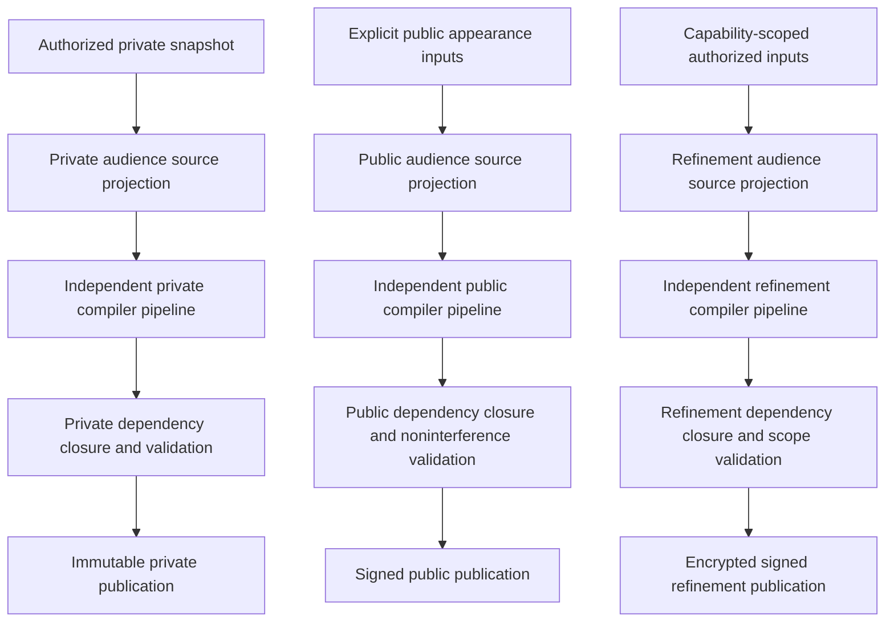

# Virtual Realm RealmForge Bake Pipeline

RealmForge is the authoring and compilation foundation for The Virtual Realm. It creates stable geography and presentation rules, then publishes immutable runtime artifacts. It never becomes the live world's authority.

## Current delivery boundary

M0 is complete with 100 accepted flat V1 contract modules and its canonical conformance foundation. M1A implements one deterministic owner-private SecureMesh station bake and adds three contracts. M1B implements independent public and sealed refinement verification packages, stripped immutable publication plans, and four contracts. M1C adds two flat contracts and implements the integrated Storylet/station boundary; its exact gate passed 35/35. The current verified ordered inventory is 109:

- `RealmBakeResourceLimitProfileContract`
- `RealmProofGatedOptimizationReceiptContract`
- `LocalOperationsLookupResourceContract`
- `RealmPublicAppearanceSourceContract`
- `RealmRefinementEncryptionEnvelopeContract`
- `RealmPublicNoninterferenceReceiptContract`
- `RealmRefinementScopeReceiptContract`
- `RealmStoryletProposalTemplateContract`
- `RealmStoryletCatalogValidationReceiptContract`

M1A compiles the private +Z geography, ten typed static visual-resource families, one typed local-operations lookup, one exact closure, and one private manifest. M1B compiles a public shell twice from the same explicit public input, proves byte-identical output, signs and verifies its exact records, and publishes only public-explicit artifacts. M1B also verifies one capability-refined scope, encrypts its canonical plaintext with authenticated context, verifies the sealed package, and publishes ciphertext through an opaque locator. M1C implements opt-in data-only Storylet compilation, reviewed private/public station kits, and version-2 audience packages; its exact integrated gate passed 35/35 on 2026-08-28. Live observation, rendering, the local Operations View, multiplayer presence, bridge activation, and network transport remain M2 or later. (Source: `webgpu-os/apps/realmforge/virtual-realm/RealmAudienceBakeCoordinator.js`; `webgpu-os/apps/realmforge/virtual-realm/publication/RealmPublicBakePackageVerifier.js`; `webgpu-os/apps/realmforge/virtual-realm/publication/RealmRefinementBakePackageVerifier.js`.)

M2A now supplies the separate import-inert runtime contract and composition
boundary. The accepted M2B admission-only slice adds authorized evidence and
signature provisioning, protected private publication selection, a durable
admission capsule/index, and exact restart reconstruction through a read-only
app face. It does not activate a bake, instantiate a runtime scheduler or
evaluator, collect or delete artifacts, or grant Genesis Factory execution
authority. (Sources:
`webgpu-os/kernel/realm/RealmM2PrivateBakeAdmissionComposition.js`;
`webgpu-os/kernel/realm/RealmPrivateBakeProvisioningCoordinator.js`;
`webgpu-os/kernel/realm/RealmPrivateBakeAdmissionService.js`.)

The complete implemented slices are specified in [M1A owner-private SecureMesh station bake](m1a-private-securemesh-bake.md), [M1B public shell and access-refinement packages](m1b-public-refinement-packages.md), the accepted [M1C Storylet and reviewed station bake](m1c-storylet-station-bake.md) boundary, [M2A runtime composition](m2a-runtime-composition.md), and the admission-only boundary in [M2B private-bake admission](m2b-private-bake-admission.md).

The version-1 acceptance-freeze ledger at
`tests/realmforge/fixtures/realmforge-m1c-rf-ge5-freeze-ledger-v1.json`
pins canonical milestone SHA-256
`328bd8322861ff3fa452726fb42e169d2630b5f814d3ee24e66a070ded04da7f`.
Its M1C fixture version 1 is pinned at canonical JSON SHA-256
`d8b54fdac97a5f471142d5d0c4c72b138cbaca1ef2f47a00c20cf7ef4a4f6816`,
the M1C version section at SHA-256
`a81b79e7a572e6ef457336761aa573462cfa8b465923872773287efb5b5cc7ce`,
and the normalized-LF 35-case suite at SHA-256
`d6b63bc967474bcb55336950745e920e78c8afe65b8d5402c23247907a265132`.
The same ledger pins the existing RF-GE5 fixture version 1 at canonical JSON
SHA-256
`184bc35cf8bd19d2a97ee403cfad6ae67e9d376c4523a098d0abfa5a357419f9`,
the normalized-LF 29-case suite at SHA-256
`e722450686fae9a009cac6dc861693f4b2b910edb853793d0bf13af46024c2ce`,
and its existing domain pack at
`realmforge.genesis-ecology.evidence@5.0.0`. The ledger is explicitly
non-authoritative (`authorityBearing: false`) and non-activating
(`runtimeActivation: false`). It does not start M2, change an accepted package,
or make an inert Storylet executable.

The cross-track order and the separation between checked-in acceptance evidence
and historical task provenance are canonical in the
[Genesis Ecology program continuity ledger](../../concepts/genesis-ecology.md#program-continuity-ledger).
The earlier `RealmForge integration ledger` Codex task is recorded there as a
pointer to prior work only; it is not a substitute for this immutable freeze
ledger. RealmForge resumes at RF-GE6 projection grammar and reviewed world kits,
while the Virtual Realm resumes at integrated M2 and then M3A/M3B under their
independent gates.

## Authoring responsibilities

RealmForge authors:

- District and building grammars.
- Root Spine and SecureMesh Exchange layouts.
- Road, rail, bridge, gate, and portal sockets.
- Code Matter forms and glyph styling.
- Materials and semantic visual states.
- Lighting and atmosphere intent.
- Collision and navigation surfaces.
- Spatial audio and reverb zones.
- HLOD and public-shell archetypes.
- Projection bindings between semantic IDs and observation types.
- Disclosure classifications for every resource and field.
- Declarative Storylet graphs and their stable presentation anchors.

RealmForge does not author current process activity, current network peers, current permissions, or current source bytes. Those facts enter through WebGPU OS observation ports.

## Existing RealmForge foundations

`.proasset` v2 already distinguishes `authored`, `baked`, and `external-pinned` resources and validates explicit references (Source: `webgpu-os/apps/realmforge/document/constants.js`; `webgpu-os/apps/realmforge/document/validation/ProAssetV2Validation.js`).

`computeDocumentContentHash()` and `buildDocumentSnapshot()` provide sorted semantic identity independent of incidental paths and timestamps (Source: `webgpu-os/apps/realmforge/document/hash/RealmForgeContentHash.js`). The revision repository binds immutable trees, entry points, resource hashes, previous commits, and exact binaries (Source: `webgpu-os/apps/realmforge/document/repository/RealmForgeRevisionRepository.js`).

`AssemblyCompiler` derives geometry from semantic ForgeSource structures and Engine primitive generators (Source: `webgpu-os/apps/realmforge/modeler/compile/AssemblyCompiler.js`). The SystemGraph compiler validates phases, cycles, fan-in, rates, and deterministic compiler output (Source: `webgpu-os/apps/realmforge/modeler/system-graph/RealmForgeSystemGraphCompiler.js`). The material resolver binds a pinned catalog and produces stable resolution hashes (Source: `webgpu-os/apps/realmforge/material/RealmForgeMaterialResolver.js`).

These systems provide the foundation. M1A wraps narrow verified portions of them to build the first private station package; it does not claim the later public/refinement audience system, city-scale content set, or bridge attachment implementation.

## Deterministic spatialization policy

`RealmTopologyCompiler` does not choose an arbitrary force layout. Every bake manifest binds `RealmSpatialLayoutPolicyV1`, whose exact compiler, numeric policy, input projection, and output digest make the city's geography reproducible.

### Coordinate frame and Root Spine

- Each audience-specific Cityform has a local right-handed metre coordinate frame.
- The Root Spine occupies the positive local Z axis from the origin. The SecureMesh Exchange receives the first fixed landmark cell beside the origin.
- Top-level territories attach to alternating Root Spine sides in canonical `(territoryKind, stableAudienceId)` order.
- The shipped Particle Realms public city reserves fixed landmark territories for Engine, Editor, Plauna, AGI, and WebGPU OS. Personal private roots use the same grammar without leaking into that public layout.
- Territory entries, transit stops, public gates, vertical datum, street widths, clearance classes, and bridge sockets lie on a quantized layout grid fixed by policy.

### Containment layout

1. Normalize the audience projection into typed nodes and edges.
2. Reject ambiguous containment. Every ordinary node has at most one containment parent; mounts and aliases use explicit non-owning edges.
3. Compute stable bottom-up weight from bucketed descendant count, authorized size class, semantic importance, and fixed minimum area. Exact private byte size never enters public layout.
4. Sort siblings by stable audience ID, never discovery order or current activity.
5. Assign each territory and district a deterministic rectangular macro-cell along the Root Spine.
6. Subdivide each macro-cell with a fixed-point slice-and-dice treemap whose axis alternates by depth and whose split arithmetic uses the bound integer layout grid.
7. Reserve deterministic growth cells and bounded slack after every sibling band. New children consume their parent's reserved cells in stable-ID order before any localized repack.
8. Represent shallow hierarchy as districts and parcels. Beyond the policy depth or node-count threshold, aggregate descendants into HLOD blocks with stable aggregate IDs, summarized bounds, count and weight buckets, and explicit partial or sealed state.
9. Compile buildings and Code Matter anchors inside parcels from semantic archetype, bucketed weight, minimum traversal clearance, and authored landmark overrides.

### Relationship route layers

Containment determines parcels and walkable local streets. Non-containment relationships never change ownership or parcel placement.

| Edge layer | Spatial treatment |
| --- | --- |
| Import and dependency | Non-traversable utility ducts routed through a deterministic service graph |
| Invocation, syscall, and event | Guarded local road, lift, or conduit overlays anchored to real endpoints |
| IPC | Traversable or visible internal streets only when the projection policy grants that affordance |
| Network | Station platforms, rail lines, ports, and horizon gates; never local IPC streets |
| RealmLink and bridge | Temporary epoch-bound sockets and bridge geometry outside stable containment layout |

- Directed relationships retain direction through lane, pulse, sign, and accessibility metadata.
- Strongly connected components are condensed into canonical route clusters for routing only; original nodes and edge directions remain inspectable.
- Parallel edges aggregate by registered relationship class and metric bucket at far LOD, then expand near the Traveler.
- Cross-links use deterministic orthogonal A* over a quantized routing grid with canonical neighbor order, fixed turn and crossing costs, reserved service layers, maximum search bounds, and stable tie-breaking.
- Road, rail, building, station, bridge-socket, vertical, and service-conduit clearance classes are hard constraints. An unsatisfied required route fails compilation; an optional route receives an explicit omitted receipt rather than intersecting geometry.
- Grade-separated crossings use policy-selected bridges or tunnels. At-grade intersections receive deterministic junction records, collision, navigation, signs, and visibility envelopes.

### Incremental stability

- Unchanged stable IDs retain territory, macro-cell, parcel, entrance, and landmark anchors while their reserved growth budget can absorb the change.
- Activity metrics never alter geography.
- A source rename that preserves authoritative object identity preserves the spatial anchor.
- A move between containment parents changes only the lowest layout region whose capacity cannot satisfy both old and new placements.
- When local capacity is exhausted, the compiler chooses the smallest deterministic ancestor that can repack, emits an explicit relocation set, and preserves all anchors outside that subtree.
- The bake activation protocol exposes old-to-new transition-anchor mappings and never interpolates collision or navigation between incompatible layouts.
- A policy or compiler version change is a new geography epoch and cannot masquerade as an incremental update.

### Audience independence

The complete architecture requires private, public, and refinement topology compilers to receive separate `RealmAudienceSourceProjectionV1` inputs and separate ID namespaces, and eventually to run spatialization independently. Public form may use only explicit public weights, public archetypes, public reserved-growth policy, and public source revisions. No private coordinate, cell, tree depth, weight, route, cache entry, topology digest, or relocation set may seed a public layout.

Implemented M1B proves the narrower package boundary: its public path validates the fixed public station appearance rather than running the complete city spatializer, and its refinement path compiles only supplied capability-scoped payload records. A refinement is content-bound to a socket declared by the reverified public shell; M1B does not load or overlay that content in a running world. Future spatial layout behind the socket must be compiled inside the granted envelope and cannot reveal the corresponding ungranted private layout.

### Collision, navigation, and HLOD outputs

The compiler derives conservative collision solids, walkable navigation surfaces, portal and door links, route clearances, streaming cells, occlusion groups, semantic HLOD clusters, interaction anchors, audio zones, and public refinement sockets from the same quantized spatial records. These outputs have separate content IDs and validation receipts but cannot disagree on bounds, coordinate policy, or stable anchor identity.

## Classic Editor and Plauna adapter audit

The Classic Editor remains a source and preview adapter, not a second Realm authoring authority.

Useful existing boundaries include:

- `SceneManager.prepareSceneForImport()` validates and migrates before mutation, while serialization and deserialization cover hierarchy, imported models, render state, lighting, physics, audio, navigation, and bake references. A Realm scene adapter can wrap these records without exposing the Editor object graph.
- `AssetRegistry` catalogs texture, model, point-cloud, audio, script, prefab, scene, shader, data, and font records and provides bounded load entry points.
- `ModelImporter` already parses OBJ, PLY, STL, GLB, and glTF and resolves PBR materials, embedded textures, skeletons, morphs, and animations.
- `Viewport` provides proven camera, depth, picking, labels, bloom, tonemap, warm-up, and device-recovery precedents.
- Plauna provides design tokens, hybrid DOM and GPU surfaces, typography primitives, widgets, transitions, and reduced-motion hooks.

The adapter must also close these audited gaps:

- The asset catalog advertises FBX while the current model importer rejects FBX. Realm authoring supports only formats with a verified importer or an explicit trusted conversion receipt.
- Existing project export collection recognizes fewer resource fields than scene serialization. Realm dependency closure replaces that heuristic and must include imported meshes, embedded textures, materials, fonts, audio, Storylet assets, and every external resource.
- Scene resource discovery currently uses property-name heuristics for some UUID references. Realm contracts require typed resource handles.
- Object URLs need explicit owners and revocation. Mesh, texture, atlas, audio, listener, observer, and GPU resource lifetimes require disposal evidence.
- Current scene and registry writes do not establish the immutable publish-last transaction required for a Realm bake. The Realm publisher writes resources first and the root manifest last.
- `EditorApp` and `Viewport` are large coupled application modules. Realm runtime and compilers wrap narrow contracts rather than importing the whole Editor as a service locator.
- Existing draggable overlays and DOM listeners are prototypes, not certified Realm visor or accessibility surfaces.
- Existing fonts and text utilities do not provide the required complete MSDF atlas, fallback, shaping, protected-page, reveal-lease, eviction, and recovery lifecycle.
- Existing visual fixtures are useful precedents but do not replace the required viewport/DPR, contrast, privacy, and final-frame regression matrix.
- Existing assets require provenance, license, and disclosure review before inclusion in a public shell.

The flat authoring adapter peers are `RealmAssetCatalog`, `RealmEditorSceneAdapter`, `RealmForgeMaterialPreviewAdapter`, `RealmForgeTypographyPreviewAdapter`, `RealmForgeVisorPreviewAdapter`, `RealmForgeAccessibilityPreviewAdapter`, and `RealmVisualQA`. The shipping runtime separately owns `RealmMaterialSystem`, `RealmTypography`, `RealmVisorOverlay`, and `RealmAccessibilityProjection`. Only the appropriate application composition root binds either set to concrete Editor, Engine, or Plauna services.

## Artifact model

The existing `.proasset` document remains the authoring authority. A separate runtime schema avoids overloading its current `assembly`, `systemGraph`, and `defaultScenario` entry points.

### `RealmVisualBakeManifestV1`

`RealmVisualBake` is the immutable package. `PrivateRealmBake`, `PublicRealmShell`, and `AccessRefinement` are its three artifact variants. Every package is rooted by one `RealmVisualBakeManifestV1`, which binds:

- Bake format and semantic version.
- Variant identity.
- Audience-specific source projection revision and digest. The private receipt may retain the exact local document revision; transported manifests never expose a private-document digest.
- Topology hash.
- Disclosure-policy hash.
- Compiler, adapter, primitive-generator, and numeric-policy versions.
- Coordinate units and precision policy.
- Material-resolution hashes.
- Storylet catalog digest.
- Canonical dependency-closure hash.
- Renderer compatibility contract.
- Resource records and content IDs.
- Publisher identity and expiry where applicable, plus an external `SignatureEnvelopeV1` computed only after the manifest digest.

Seeded randomness alone does not prove deterministic output. The root binds every compiler and generator version that can alter results.

### Flat resources

The runtime consumes independent resources connected by stable IDs:

- `topology.realm`
- `geometry.realm`
- `material.realm`
- `lighting.realm`
- `collision.realm`
- `navigation.realm`
- `socket.realm`
- `lod.realm`
- `projection-binding.realm`
- `glyph-style.realm`
- `storylet-catalog.realm`
- `dependency-closure.realm`

Relationships such as containment, inheritance, attachment, routes, and parenthood remain graph edges. Runtime ownership remains flat.

`bake-receipt.realm` is deliberately not a bake resource. `RealmBakeReceiptV1` is external publication evidence created only after the manifest digest exists. It may be stored beside a publication, but the manifest, resource list, and dependency closure never reference or walk it.

For M1A, the ten typed static visual-resource families are geometry, material binding, lighting intent, collision, navigation, socket, LOD, projection binding, glyph style, and audio zone. The typed `LocalOperationsLookupResourceV1` is an additional private resource. Topology records, the spatial-layout receipt, closure, manifest, bake receipt, and optimization receipt remain distinct record families.

M1B applies the same acyclic rule to publishable audience roots. `RealmPublicNoninterferenceReceiptV1` and `RealmRefinementScopeReceiptV1` are signed `owner-private + local-private` certification evidence. Neither receipt, its signature, a publication receipt, nor decrypted refinement plaintext enters a public or refinement resource closure. Public publication omits the noninterference receipt and its signature. Refinement publication omits the scope receipt, its signature, authenticated-data record, and canonical plaintext; it stores only the opaque ciphertext, its authenticated envelope, the publishable signatures, and the access-refinement root. (Source: `webgpu-os/apps/realmforge/virtual-realm/publication/RealmAudiencePackagePublisher.js`.)

M1C keeps Storylet catalog-validation and bake receipts outside the public content graph. Public version-2 publication strips both receipts, both receipt signatures, reviewed station evidence, noninterference evidence, and local diagnostics while retaining the signed public Storylet catalog. Refinement version-2 keeps Storylet records, validation and bake receipts, and their inner signatures only inside authenticated ciphertext; its exact nine-key outer package remains unchanged. This accepted boundary is verified by the 35/35 integrated M1C gate.

Every compiler result enters a frozen resource envelope containing its accepted record, canonical bytes, content ID, byte length, audience, disclosure, stable anchors, bounds, direct dependencies, compiler identity, and numeric-policy identity. The envelope contains no WebGPU object, mutable preview handle, authoring session, object URL, executable callback, or network capability.

## Audience source projections

Audience separation happens before topology, geometry, Storylet, or dependency compilation. `RealmAudienceSourceProjectionV1` is the only input accepted by an audience bake job.

- The `private` projection is built from the exact locally authorized `RealmSourceSnapshotV1` and remains local.
- The `public-shell` projection is built only from an explicit public appearance document, shipped public archetypes, public identity inputs, and public policy. The projection builder cannot read the private snapshot, private document digest, private counts, private timing, or private identifiers.
- An `access-refinement` projection is built in an isolated capability-scoped job from only the exact authorized resource scope, audience, policy, expiry, and epoch. It never receives the rest of the private snapshot.

All three jobs can use the same verified compiler implementations, but they share no topology, geometry, Storylet catalog, intermediate cache key, source digest, dependency closure, or output manifest. Cross-audience compiler caches are forbidden unless the cached input is itself a shipped public resource with the same public content ID.

## Compilation pipeline

The pipeline performs these stages:

1. Capture the private authorized `RealmSourceSnapshotV1` and `RealmCoverageReceiptV1` locally.
2. Build three separate `RealmAudienceSourceProjectionV1` inputs from their independently authorized source providers. The public provider cannot read private input.
3. Validate disclosure policy, audience namespace, source provenance, resource limits, and capability scope before any compiler runs.
4. Run separate topology compilers for private, public, and each refinement audience.
5. In each job, compile geometry, materials, lighting, collision, navigation, sockets, glyph style, LODs, projection bindings, and authored audio from only that job's topology.
6. In each job, compile declarative Storylet definitions and stable anchors from only that job's source projection.
7. Assemble each variant using only records produced in its own job and shipped public resources.
8. Compute a separate transitive dependency closure for each variant.
9. Reject missing, unlabeled, forbidden, cross-audience, ambient, unreachable, or foreign-job dependencies.
10. Validate determinism, schema limits, renderer compatibility, accessibility metadata, provenance, audience policy, and public noninterference.
11. Publish immutable resources first and the audience-specific root manifest last.

### Implemented M1B job order

The M1B public job follows one fixed order:

1. Validate the exact `public-shell + public-explicit` source projection, public appearance source, limit profile, schedule, publisher, and lifetime.
2. Resolve only the separately shipped `PublicSecureMeshShellKit` resources.
3. Compile two independent public runs and compare their canonical appearance, resources, closure, visual manifest, public shell, and semantic-scene digest.
4. Build and sign the local noninterference receipt only after the two runs match.
5. Verify the exact 13-key package, every digest and signature, the public-only closure, cross-record bindings, bounds, shipped archetypes, safe text, and local receipt exclusion.
6. Publish immutable public resources, closure, visual manifest, publishable signatures, and shell before the active-root compare-and-swap.

The M1B refinement job follows a separate fixed order:

1. Reverify the complete base public package and the selected public refinement socket.
2. Verify the authority adapter's exact audience, capability, actions, resource scope, policy, active capability and bridge epochs, publisher, and lifetime.
3. Compile only the capability-refined resource set, closure, and visual manifest.
4. Canonically encode the complete refinement plaintext, bind its context as AES-GCM additional authenticated data, seal it, and verify an immediate decrypt round trip.
5. Build and sign the encryption envelope, access-refinement root, and local refinement-scope receipt.
6. Reverify the nine-key sealed package, decrypt and validate the inner package, then publish only ciphertext, the authenticated envelope, publishable signatures, and the access-refinement root before compare-and-swap.

These bake jobs create immutable data packages. They create no camera, traversal, Traveler, minimap, or zone-management authority. Connected Realm traversal remains first-person. The sole non-first-person surface is the separately entered owner-private Operations View for the local owner's own Cityform; its minimap and management proposals never consume these audience package jobs. (Source: `webgpu-os/apps/realmforge/virtual-realm/RealmAudienceBakeCoordinator.js`; `webgpu-os/apps/realmforge/virtual-realm/compilers/RealmAccessRefinementCompiler.js`; `webgpu-os/apps/realmforge/virtual-realm/publication/RealmAudiencePackagePublisher.js`.)

## Independent audience variants

### `PrivateRealmBake`

The private bake may contain exact authorized local topology, private labels and paths where policy permits them, projection bindings, Code Matter descriptors, local commitments, opaque vault object references, stable process and service anchors, and granted-mount topology. It stays local by default and never implies write authority.

The immutable bake never contains plaintext source bytes, decrypted chunks, reusable reveal leases, cryptographic keys, capability secrets, or live process state. Exact source stays in the authority-gated Code Matter vault and streams only through visible-chunk leases. Ordinary source edits can update the Code Matter descriptor and skin without rebaking stable geography; only structural topology or authored-form changes request a new bake.

The private compiler also emits a bounded local operations lookup resource containing canonical local zone, anchor, cell, landmark, route, and map-HLOD references. It is a dependency of the `PrivateRealmBake`, has its own content ID and closure, and is the only static source accepted by `LocalOperatorViewProjector` and `LocalCityMinimapProjector`. It contains no plaintext source bytes and does not create a fourth audience variant.

The local operations lookup never consumes `PublicRealmShell`, AccessRefinement, PresenceSession, RendezvousFrame, bridge, remote RealmPose, remote Traveler, or connected-Cityform input. Public and refinement compiler jobs cannot reference it. Runtime operations and minimap snapshots derive from this verified local lookup plus authorized owner-private deltas and admitted loaded cells; they never filter a mixed local/remote scene after compilation.

### `PublicRealmShell`

The target public shell is a complete-looking public Cityform representation. It consumes only explicitly public inputs and safe owner-selected customization. It must not encode private file counts, sizes, names, types, adjacency, activity, ciphertext patterns, hashes, or update timing. Implemented M1B currently ships a small fixed public station shell; complete public-city generation remains later work.

Public IDs are audience-scoped opaque IDs. They are not reusable private resource IDs. A signature proves what the owner published. It does not prove that the shell exactly reconstructs the private machine.

M1B implements this boundary with `RealmPublicAppearanceSourceV1`, a deterministic shipped SecureMesh shell kit, `RealmPublicAppearanceCompiler`, `RealmPublicShellCompiler`, `RealmPublicBakePackageVerifier`, and the public branch of `RealmAudienceBakeCoordinator`. The public compiler API has no private snapshot, private lookup, local filesystem, live activity, network, or cache input. The verifier rejects unknown package keys, non-public resources, local-operations lookup records, forbidden payload fields, orphaned payloads, closure mismatches, unshipped public resources, invalid signatures, and local receipt reachability. (Source: `webgpu-os/apps/realmforge/virtual-realm/compilers/RealmPublicAppearanceCompiler.js`; `webgpu-os/apps/realmforge/virtual-realm/compilers/RealmPublicShellCompiler.js`; `webgpu-os/apps/realmforge/virtual-realm/publication/RealmPublicBakePackageVerifier.js`.)

### `AccessRefinement`

An access refinement is independently compiled for one audience, capability set, expiry, and scope. It has its own dependency closure and encrypted content envelope. It cannot reference private resources outside the granted scope.

M1B implements package compilation, sealing, verification, immutable publication, and rollback for the already authorized scoped payload supplied through the explicit refinement input. It binds the exact base public shell and socket, audience identity, capability, actions, resource scope, policy, capability epoch, bridge epoch, authority receipt, visual bake, closure, encryption profile, nonce-allocation receipt, ciphertext digest, lifetime, and signatures. `RealmRefinementScopeReceiptV1` remains local evidence and never travels with the published refinement. (Source: `webgpu-os/apps/realmforge/virtual-realm/compilers/RealmRefinementScopeCompiler.js`; `webgpu-os/apps/realmforge/virtual-realm/compilers/RealmAccessRefinementCompiler.js`; `webgpu-os/apps/realmforge/virtual-realm/publication/RealmRefinementBakePackageVerifier.js`.)

M1B does not discover private input, issue authority, negotiate a bridge, deliver exact source, or load a remote interior into a running world. The explicit authority and encrypted package seams are implemented; remote private-interior and exact-source product delivery remain deferred.

## Disclosure classification

Every authored resource and source-derived field receives one classification:

- `local-private`
- `public-explicit`
- `capability-refined`
- `forbidden-export`
- `construct-only`
- `historical-reference`

Unlabeled content fails closed. The compiler never builds a private intermediate and filters it afterward. Post-hoc redaction risks retaining private topology, transitive dependencies, cache keys, digests, counts, and derived metadata.

The bake root binds the classification policy separately because current RealmForge document hashing intentionally excludes record authority. Geometry cannot be relabeled from private to public without changing policy evidence.

## Dependency closure

`RealmDependencyClosure` walks:

- `basedOn` relationships.
- Explicit resource references.
- Binary descriptors.
- Mesh and material records.
- Texture and atlas bindings.
- Shader and render-feature requirements.
- Collision, navigation, and socket records.
- Archetype and HLOD references.
- Storylet definitions, anchors, captions, audio, and presentation assets.
- Owner-private local operations lookup records used by the private bake only.
- Pre-manifest compiler identity records and immutable versioned compatibility profiles.

The closure sorts entries canonically and records the audience of every reachable resource. A public bake fails if any reachable record is private, unlabeled, capability-refined, or forbidden.

The walk explicitly excludes `RealmBakeReceiptV1`, signature envelopes, activation offers and receipts, validation reports produced after manifest digest, and any other transport or publication evidence whose preimage binds the manifest. Those records point to already computed content; content never points back to them.

## Runtime separation

`RealmBakeLoader` lives outside RealmForge. It receives only immutable bake contracts and Engine-facing adapters. It does not import:

- RealmForge UI.
- Document stores.
- Modeler sessions.
- Preview runtimes.
- Mutable native authoring handles.
- Classic Editor service objects.

Classic Editor scenes and asset catalogs may enter through explicit input adapters. They never become parallel Realm authorities.

## Publication and rollback

Publication writes and reads back immutable resources first, writes and verifies the dependency closure next, and writes and verifies the root manifest last. Only then may the publisher compare-and-swap the active root from the exact expected prior manifest to the candidate manifest. A manifest that exists in immutable storage is not active until that compare-and-swap succeeds.

`RealmForgeBakeEntry` is the sole composition root for this sequence. It injects the immutable store, active-root port, projection validator, layout compiler, baseline resource compiler, optional proof-gated optimizer, local-operations lookup compiler, closure compiler, cross-record verifier, package codec, receipt builder, and publisher. No peer imports or constructs another concrete peer.

For M1B, the same entry exposes `compilePublicShell()`, `verifyPublicShell()`, `publishPublicShell()`, `compileAccessRefinement()`, `verifyAccessRefinement()`, and `publishAccessRefinement()`. Its internal `RealmAudienceBakeCoordinator` is a composition delegate, not an independently started application or runtime root. It owns orchestration only and exposes no scanner, live network, renderer, minimap, or zone-management port. Signature, authority, encryption, storage, and active-root behavior remain explicit injected adapters at the application boundary. (Source: `webgpu-os/apps/realmforge/virtual-realm/RealmForgeBakeEntry.js`; `webgpu-os/apps/realmforge/virtual-realm/RealmAudienceBakeCoordinator.js`.)

For M1C, opt-in `compilePrivateBakeWithStorylets()`, `compilePublicShellWithStorylets()`, and `compileAccessRefinementWithStorylets()` paths compose reviewed station providers and flat data-only Storylet peers. The corresponding version-1 paths remain unchanged and explicitly report absent Storylet catalogs. Access-refinement authority succeeds before Storylet compilation, encryption, or signing.

The cross-record verifier recomputes resource bytes and IDs, resource-limit totals, closure reachability and depth, layout and lookup bindings, manifest membership, compiler identities, and baseline or optimization evidence. It rejects rather than repairing, filtering, relabeling, or completing a candidate.

The strict `RealmBakeResourceLimitProfileV1` applies before proportional allocation and at final accounting. Exact ceilings pass. Any count, byte, dependency-depth, local-operations, Storylet definition/state/transition/template/dependency-reference, or compiler-work ceiling exceeded by one rejects before manifest publication.

The mandatory baseline compiler always remains available. Missing proof, failed law, counterexample, exceeded bound, incompatible version or device, or failed CPU/WGSL parity closes the optimizer gate and returns valid baseline semantics. Root Algebra cannot choose an audience, classify disclosure, discover hidden topology, grant authority, select a Storylet, reach the publisher, or mutate a published package.

Failed compilation, verification, write, readback, digest comparison, authority check, or compare-and-swap leaves the existing active root untouched. Content-addressed resources written before a later failure remain unreachable and may be collected separately; they never create a partial active package.

The public publisher returns its publication receipt to the local caller but never adds that receipt to immutable public artifacts. The refinement publisher follows the same rule. It also omits the local scope receipt and its signature from the immutable artifact plan. Publication evidence cannot become a dependency, leak certification internals, or alter the candidate's content identity. (Source: `webgpu-os/apps/realmforge/virtual-realm/publication/RealmAudiencePackagePublisher.js`.)

Generated bakes are disposable. Rolling back a bake never mutates the `.proasset` source. A previous verified bake root can be reselected without rewriting its resources.

### Private runtime admission seam

The accepted M1 private publisher is an authoring-publication boundary, not yet
a durable runtime-package repository. `RealmBakePublisher` stores each
resource's canonical record text under its semantic resource ID, then stores
the closure and manifest. It does not persist the exact private package,
resource envelopes, audience projection, policies, optimization and bake
receipts, M1C Storylet validation receipt, reviewed station evidence, or
referenced signature envelopes. The selected manifest root therefore cannot
rehydrate the 17-key private version-2 package after a process restart. (Source:
`webgpu-os/apps/realmforge/virtual-realm/publication/RealmBakePublisher.js`.)

M2 closes this gap outside RealmForge with a trusted, owner-partitioned
admission service. It requires an ABA-resistant M1 head observation containing
scope, root, generation, and exact head-file SHA. The production composition
first gives a kernel-owned provisioning coordinator the freshly verified
package. That coordinator requests only the package-named material from an
injected source, validates the exact four evidence records, four-or-five
signature envelopes, policy/trust observations, and single-use review
authorization before the first provisioning write, then invokes the separate
authorized provisioner/reviewer service. Admission itself has no provisioning
authority: it resolves and independently revalidates the stored bindings and
signature closure under the immutable evidence policy and five-role active-key
trust map. It then stores the exact canonical package plus chunked
resource/evidence/signature inventories through bounded cancellable exact-byte
APIs beneath a kernel-private operator/service root and writes the
history-independent 71-field `RealmPrivateBakeAdmissionIndexV1`. After recursive
readback and complete evidence/signature reverification, it
persists a service-generated fixed proposal, intent, prior terminal lineage, and
pending-slot root under the maintenance fence, releases that fence, then
rechecks the complete controls and writes a dispatch
marker and advances a separate structured admission head with one exact-byte
compare-and-swap under `RealmAdmissionSelectionCoordinator`. A second durable
marker bounds the sole recovery-retry opportunity; a fixed terminal audit and
reclaiming state bound retained controls. Production M1-head, admission-policy,
Realm-scoped signature-trust, and M2 admission/rollback paths join the selection
fence. A later activation authority must join that fence at its own gate;
activation is not implemented by this slice. Admission joins the separate
maintenance fence, while trusted root producers and collection remain future
participants.
Existing manifest-only roots need an explicit authorized recompile, reverify,
and admission migration. The runtime never infers missing records from a
manifest and never imports RealmForge to rebuild them.

First-versioned publication is safe only when the legacy publication writer
uses the closed cooperative legacy-writer port backed by the same selection
coordinator. A cooperative legacy write either wins before the versioned
transaction and becomes its observed predecessor, or loses after versioned
selection and is rejected. A direct legacy write that bypasses this port is an
unsupported authority and is not admitted as a production publication source.
(Source:
`webgpu-os/kernel/realm/RealmPrivatePublicationHeadStorageAdapter.js`.)

The M1 publication root, M2 durable admission head, and M2 active in-memory
bundle remain independent. This slice implements the first two transitions;
the active bundle remains future work. Final visibility will require a current
admission/evidence/trust/signature/profile assertion plus trusted-clock envelope
lifetime under the same selection fence as the bundle swap. Artifact deletion remains disabled until the
bounded root/artifact/evidence directories and their journals/recovery are
certified. This seam preserves the frozen M1C package while
making its full evidence reachable for restart, rollback, and device recovery.
See [M1C Storylet and reviewed station bake](m1c-storylet-station-bake.md#m1c-to-m2-executable-handoff)
and [M2 runtime foundation](m2-runtime-foundation.md#accepted-m1c-prerequisite).
The exact implementation sequence is [M2A runtime composition](m2a-runtime-composition.md)
followed by [M2B private-bake admission](m2b-private-bake-admission.md).
M2A and the M2B admission-only slice are accepted independently of the earlier
M1C/RF-GE5 freeze. The production M2B composition returns exactly
`realmForgePrivateBakeAdmissionPort` and `bakeAdmissionPort`; Desktop
instantiation waits for genuine later runtime authorities and receives no
placeholder capability. Activation execution, runtime scheduling/evaluation,
garbage collection/deletion, and Genesis Factory authority remain unstarted,
while the accepted M1C packages and Storylets remain byte-identical and inert.

## M2+ Genesis Ecology extension

The accepted M0-M1C compiler and package boundary remains frozen. Genesis
Ecology adds a separate opt-in contract catalog, domain pack, package generation,
compiler identities, and gates for product/factory genomes, constructive
metabolism, developmental plans, recursive parts, stable ecology geography, and
audience-safe projections. It does not add keys to exact V1 records or turn the
M1C Storylet compiler into a runtime.

### Implemented inert authoring substrate

The bounded RealmForge authoring substrate is complete through RF-GE5. Its
modules remain separate from the accepted M1C bake entry and from every future
Virtual Realm runtime composition root.

| Layer | Implemented responsibility | Explicit boundary |
| --- | --- | --- |
| RF-GE2 | Separate `ProductGenomeV1`, `FactoryGenomeV1`, `GenomeRevisionReferenceV1`, and `GenesisExecutionPlanV1` records; deterministic compile and verification for `BUILD`, `BREAK`, `REPAIR`, `FUSE`, `SPLIT`, `SPECIALIZE`, `GENERALIZE`, `RECOMBINE`, `RECYCLE`, and `MUTATE`; isolated trust-locked constructive domain pack | Every Plan is inert, authority-free, runtime-inactive, and `not-executed`; the compiler and pack do not execute a Factory, resolve or invoke host implementations, persist or publish a Plan, mutate a registry, select an active head, or activate runtime state |
| RF-GE3 | Process-local exact verified-Plan cache isolated by audience, disclosure, and audience scope; one shared private mutable reverse-dependency index over immutable version heads and frozen dependency arrays; dependency-safe FIFO eviction and transitive invalidation; exact Factory/Plan binding evidence; deterministic `GenesisPartV1` recursive package-candidate preparation with logical/content identity protection | Cache and derived-index state plus timings are non-authoritative and non-persistent; a candidate has not collected required external evidence and is not eligible for publication, installation, execution, active-head selection, or runtime activation |
| RF-GE4 | Twelve typed authored-program records, eight deterministic interpreter fragments, aggregate Plan verification, and an exact trust-locked interpreter domain pack | All outputs are inert authoring evidence; no compiler, verifier, or provider executes, persists, publishes, grants authority, or activates runtime state |
| RF-GE5 | Eleven typed evidence-program records, ten deterministic evidence fragments bound to the exact verified RF-GE4 Plan, aggregate verification, and an exact trust-locked evidence domain pack | All outputs are inert authoring evidence; no compiler, verifier, or provider executes, persists, publishes, mints identity, self-modifies, grants authority, or activates runtime state |

RF-GE2 through RF-GE5 therefore provide reusable authoring inputs and evidence,
not the Genesis
extension package path. A future executor must independently verify sealed
Factory and Plan binding receipts and deterministically recompile the exact
RF-GE2 inputs before admitting a Plan for execution. Publication, installation,
execution evidence, semantic promotion, ECS commit, rollback, and visible world
state remain outside all four completed RF-GE2 through RF-GE5 gates.

RF-GE6 plans `GenesisRealmExtensionManifestV1` as an inert, unpublished
72-field sidecar bound to an exact accepted base-bake ID/digest. Its exact
compilation input receives the complete accepted base manifest and signed
base-layout receipt, derives their ID/digest bindings, and covers both records.
It carries its own audience projection,
Genesis source revision, six-kit district assembly, unsigned
`GenesisSpatialLayoutEvidenceV1`, projection grammar, private-only Genesis
Operations evidence rows where applicable, compiler/domain-pack identities, both
resource-limit profiles, exact work accounting, dependency closure, and
issue/expiry logical ticks. Publisher and signature fields are exactly `null`.
Missing or rejected Genesis content leaves the accepted base bake usable.

The owner rows live inside unsigned layout evidence; public and refined records
carry literal `null` Operations fields. RF-GE6 cannot construct the accepted
`LocalOperationsLookupResourceContract`, because the extension has no accepted
signed layout receipt. RF-GE8 owns deterministic row conversion and accepted-
contract revalidation after signed-layout acceptance.

The manifest has no Storylet field. RF-GE7 may compile a separate 24-field
data-only `GenesisStoryletExtensionManifestV1` plus unsigned Storylet-
compilation evidence, with a one-way ID/digest binding to the verified RF-GE6
manifest; RF-GE6 never references it. RF-GE8 alone owns the
accepted signed `RealmSpatialLayoutReceiptContract`, combined publication and
rollback evidence, signing, admission, and activation.

A future RealmForge bake entry may expose opt-in private/public/refined Genesis
extension compile and verify methods beside the unchanged M1C APIs. RF-GE6 adds
no publish method. The three audience extensions compile independently, and the
manifest is constructed before its external disclosure receipt so neither
record references the other cyclically. The six reviewed kits are instances of
the single `GenesisWorldKitV1` contract with exact IDs/kinds: Continuity Core,
Foundry District, Maintenance Works, Possibility Archive, Role Commons, and
Culture Archive. They compose as flat resources through stable sockets. See
[World districts and facilities](world-districts.md),
[RealmForge Genesis Ecology](../realmforge-genesis-ecology.md) and the
[Virtual Realm Genesis Ecology integration](genesis-ecology-integration.md).

This future tense is intentional. RF-GE2 through RF-GE5 did not add these
extension compile or verify methods to `RealmForgeBakeEntry` and did not create
or publish a `GenesisRealmExtensionManifestV1`. RF-GE6 remains planned only.

## Required gates

- Identical authorized inputs and compiler identities produce byte-identical manifests and canonical resource digests.
- Every reference resolves through the declared closure.
- Public output contains no private dependency reachability.
- Private-only changes leave byte-identical public manifests and canonical semantic-scene digests. Reference-renderer pixels stay within the frozen device, browser, driver, resolution, DPR, and tolerance profile; cross-GPU byte-identical raster output is not an authority requirement.
- Preview and runtime produce compatible source-ID, color, depth, and semantic anchor results.
- Every mesh, material, texture, glyph atlas, font, audio asset, Storylet asset, and shader requirement has provenance and a bounded lifetime owner.
- No mutable preview handle enters a bake.
- Invalid or incomplete publication leaves the prior root active.
- The private local operations lookup is referentially closed over local zones, anchors, cells, routes, landmarks, HLOD, and bounds and has no public, refinement, presence, rendezvous, bridge, Traveler, or foreign-Realm dependency.
- The M1A local-operations lookup can later frame bounded isometric or eagle-eye presentation only for its own private `localRealmId`; it supplies no connected-city geometry, object IDs, routes, picks, accessibility records, or telemetry.
- The 109-contract catalog, deterministic M1A package, independent M1B public and sealed refinement packages, resource-limit boundary matrix, optimizer fallback and accepted-proof path, cross-record verification, publication order, rollback, and flat imports have executable implementation evidence. The complete M1C package and station boundary passed its exact 35/35 gate.
- The M2B admission-only evidence is owned by `tests/virtual-realm/m2-evidence-provisioning.test.html`, `tests/virtual-realm/m2-private-publication-bridge.test.html`, `tests/virtual-realm/m2-private-service-storage.test.html`, `tests/virtual-realm/m2b-admission-codecs.test.html`, `tests/virtual-realm/m2-m1c-admission-handoff.test.html`, and `tests/virtual-realm/test_m2b_app_import_confinement.py`. These suites do not certify activation, a Storylet scheduler/evaluator, collection/deletion, or Genesis Factory authority.

## See also

- [M1A owner-private SecureMesh station bake](m1a-private-securemesh-bake.md)
- [M1B public shell and access-refinement packages](m1b-public-refinement-packages.md)
- [M1C Storylet and reviewed station bake](m1c-storylet-station-bake.md)
- [Genesis Ecology integration](genesis-ecology-integration.md)
- [World districts and facilities](world-districts.md)
- [M2 runtime foundation](m2-runtime-foundation.md)
- [M3 living city runtime](m3-living-city-runtime.md)
- [RealmForge Genesis Ecology](../realmforge-genesis-ecology.md)
- [Architecture and ownership](architecture.md)
- [Contract catalog](contracts.md)
- [Code Matter](code-matter.md)
- [Storylets](storylets.md)
- [Certification plan](certification-plan.md)
