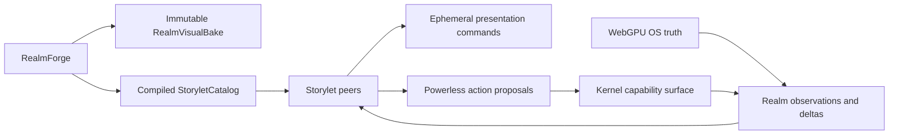
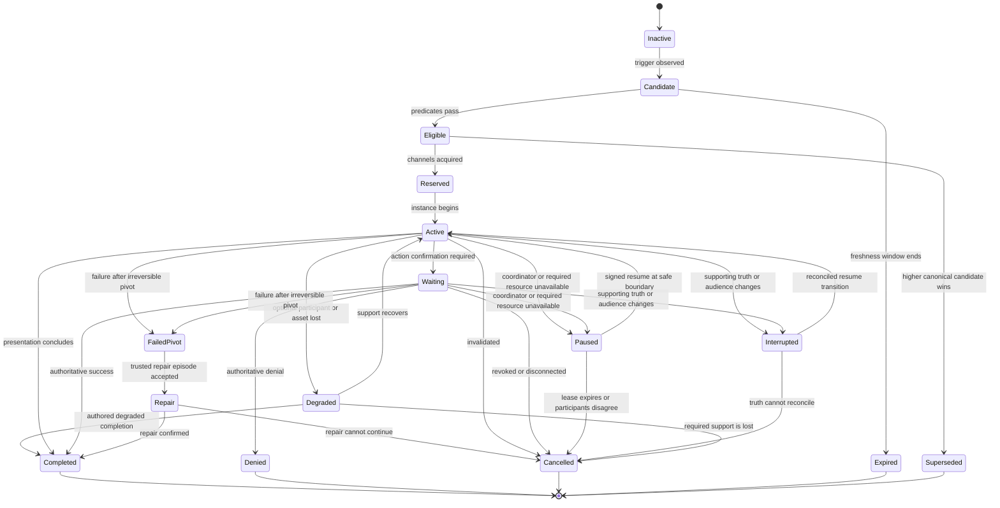

# Virtual Realm Storylets

Storylets make real system activity understandable, dramatic, and interactive without compromising truth, authority, privacy, or first-person immersion. They add orchestration and presentation to the master architecture. They do not replace RealmForge bakes, WebGPU OS observations, SecureMesh, Chronicle, or the renderer.

## Role and boundary



A Storylet may explain, stage, highlight, announce, propose, request, wait, react, cancel, and record. It may never fabricate system truth, mutate stable geography, edit RealmForge documents, grant authority, call a privileged driver directly, or claim that a proposal succeeded before an authoritative confirmation arrives.

## Existing Storylet foundation

The OS already has:

- `StoryletRuntime`, a facade over `StoryGraph` (Source: `webgpu-os/kernel/storylets/StoryletRuntime.js`).
- `StoryletEligibilityBridge`, which composes doctrine preconditions, resource allowlists, tool allowlists, and permission checks without creating a second eligibility engine (Source: `webgpu-os/kernel/storylets/StoryletEligibilityBridge.js`).
- `StoryletDescriptorSanitizer`, which reuses the shared descriptor scanner and validates IDs, handlers, cooldowns, priorities, and fire limits (Source: `webgpu-os/kernel/storylets/StoryletDescriptorSanitizer.js`).
- `StoryletTestRunner` and adversarial fixtures for isolated execution and hostile inputs (Source: `webgpu-os/kernel/storylets/StoryletTestRunner.js`; `webgpu-os/kernel/storylets/AdversarialFixtures.js`).
- `StoryletVersionManager` for in-memory definition history and rollback (Source: `webgpu-os/kernel/storylets/StoryletVersionManager.js`).
- `StoryletFailureHandler`, which uses the shared rollback engine for forward and compensating steps (Source: `webgpu-os/kernel/storylets/StoryletFailureHandler.js`).
- `OSEventGraphAdapter`, which emits bounded kernel events and optional ledger entries (Source: `webgpu-os/kernel/storylets/OSEventGraphAdapter.js`).
- `NaviTaskEpisodeRuntime`, which provides hashed, immutable, bounded, deterministic, resumable, revision-checked data-only episodes that cannot execute tools or grant authority (Source: `webgpu-os/kernel/storylets/NaviTaskEpisodeRuntime.js`).
- RealmForge storylet catalogs that inject handlers and share the existing runtime rather than creating another engine (Source: `webgpu-os/apps/realmforge/storylets/realmforge/RealmForgeStorylets.js`).

The existing generic `StoryGraph` supports injected random and time sources, but its default runtime uses `Math.random()` and wall-clock time. Multiplayer and replay require injected deterministic sources and recorded logical ticks (Source: `engine/gameplay/narrative/StoryGraph.js`).

### Two existing meanings of Storylet

The repository currently has two materially different foundations. The plan preserves that distinction.

| Foundation | Suitable reuse | Binding limitation |
| --- | --- | --- |
| Function-based `StoryGraph` and `StoryletRuntime` | Trusted RealmForge preview, build, and isolated test handlers; any shipping local decorative output must be adapted into the same validated proposal and channel path | Definitions contain executable functions and mutable fire state; registration can replace an existing ID; default time and randomness are nondeterministic; forced execution bypasses normal eligibility; an emitted fired event may precede async completion |
| Data-only `NaviTaskEpisodeRuntime` | Deterministic, revisioned, resumable Realm episode state behind a narrow port | It does not evaluate triggers, schedule candidates, persist durably, authenticate remote input, enforce authority, or retain a complete Chronicle |

The global OS `kernel.storylets` facade is an AI task and goal pipeline facility. Its `worldState` is explicitly task state, not game or Realm truth. It must not become the Virtual Realm scheduler, state store, persistence service, or authority boundary.

`NaviTaskEpisodeRuntime` supplies the safer state-machine pattern: versioned definitions and snapshots, bounded states and transitions, content hashes, deep freezing, optimistic revision checks, unique `(state, event)` transitions, interrupt, resume, expiry, restore, and data-only proposals. The integration still supplies a trusted logical clock, signatures, encryption, scope checks, domain proposal schemas, payload size and depth limits, and complete Chronicle persistence.

The source-backed integration model is:

```text
data-only episode runtime
    -> Realm Storylet coordinator
    -> proposal validator
    -> standard ActionDispatcher and kernel authority path
    -> encrypted and signed state persistence
    -> authoritative observation
    -> reversible presentation
```

The investigation path in `NaviInvestigationService` and `NaviCognitionService` demonstrates this powerless-runtime separation: data-only observation proposals remain separate from external authority, encrypted storage, expected revisions, signatures, and recovery evidence.

### Reuse restrictions

- `forceFire()` and `forceFireTrusted()` remain trusted test and recovery operations. Realm content, models, public shells, refinements, and remote peers cannot reach them.
- `StoryletEligibilityBridge` may inspire doctrine composition, but prefix matching and optional requested fields do not establish Realm object identity, bridge-epoch binding, or side-effect authority.
- `StoryletEffectsApplier` is not the Realm dispatcher. Its generic result projection and ledger spread are too broad for protected paths, source, peers, or capabilities.
- `OSEventGraphAdapter` and `TaskLedger` provide bounded observations, not deterministic durable history. The complete Chronicle remains separate.
- `StoryletVersionManager` is an in-memory helper, not a signed, immutable, persistent catalog authority.
- `StoryletDescriptorSanitizer` remains useful input screening, but it is not a strict complete Realm definition parser and is not automatically enforced by `StoryGraph.register()`.
- `StoryletTestRunner` supplies isolated and adversarial precedents, but Realm tests must cover the full eligibility path, async completion, strict rejection, replay, noninterference, epoch changes, and idempotency.
- Existing RealmForge Storylet files are definition catalogs. The audit did not establish a production registration and execution path, so the plan does not treat them as a completed authoring pipeline.
- The function-based graph never maintains an independent shipping presentation path. If trusted local legacy logic is temporarily retained, its output enters `RealmStoryletProposalValidator`, `RealmStoryletPolicyV1`, `RealmStoryletScheduler`, channel arbitration, Chronicle correlation, and disposable-handle cleanup exactly like compiled data-only content. It cannot dispatch the renderer or audio system directly.

## Flat peer architecture

No Storylet god object owns the subsystem. `VirtualRealmEntry` injects and connects these peer modules:

| Peer | Single responsibility |
| --- | --- |
| `RealmStoryletCatalog` | Immutable, versioned, audience-specific definition lookup |
| `RealmStoryletDefinitionValidator` | Exact-key, bounded-schema, dependency, and disclosure validation |
| `RealmStoryletTriggerEvaluator` | Pure data-expression evaluation over sanitized immutable snapshots |
| `RealmStoryletCandidateIndex` | Indexed lookup from registered event and fact kinds to candidate IDs |
| `RealmStoryletScheduler` | Deterministic priority, concurrency, cooldown, and tie-breaking |
| `RealmEpisodeRuntimePort` | Narrow adapter to deterministic data-only episode state |
| `RealmStoryletStateStore` | Current instance and episode heads, separate from definitions |
| `RealmStoryletPersistencePort` | Expected-revision, encrypted, signed head persistence and restore |
| `RealmStoryletChronicleAdapter` | Append-only semantic decisions and transition references |
| `RealmStoryletProposalValidator` | Allowlisted presentation and action-request schemas |
| `RealmStoryletPresentationDispatcher` | Reversible visual, audio, actor, signage, and emphasis handles |
| `RealmStoryletActionRequestPort` | Powerless requests to the standard kernel dispatcher |
| `RealmStoryletAuthorityPreconditionEvaluator` | Purely narrows eligibility from visible current authority facts; cannot issue, deny, or replace an authority receipt |
| `RealmStoryletTruthReconciler` | Interrupts or adjusts an instance when supporting truth disappears |
| `RealmStoryletFailureCoordinator` | Classifies pre-pivot compensation versus failed-pivot repair, proposes recovery transitions, and tracks cleanup without mutating OS state or issuing authority |
| `RealmStoryletMultiplayerSynchronizer` | Signed shared recipes and semantic phase synchronization |
| `RealmStoryletReplayReader` | Side-effect-free recorded-decision replay |
| `RealmStoryletTelemetry` | Sanitized bounded operational metrics only |

No peer constructs another peer or imports another concrete peer. The catalog never owns episode state. The scheduler never persists. Persistence never evaluates triggers. Presentation never authorizes. The precondition evaluator only narrows eligibility. Chronicle never schedules. World projectors do not know Storylets exist.

## Storylet categories

- **Orientation:** first arrival, Root Spine orientation, district discovery, and navigation guidance.
- **Inspection:** examining files, processes, IPC roads, services, devices, and Code Matter.
- **Operational:** presenting a real task and requesting an OS action through the authorized action path.
- **Ambient truth:** legible summaries of real storage activity, load, network health, or inactivity.
- **Incident and recovery:** real faults, congestion, route degradation, permission denial, process failure, and confirmed recovery.
- **SecureMesh station:** discovery signals, authentication, arrivals, departures, routes, freight, delays, relay switching, and disconnects.
- **Cityform encounter:** approach, rendezvous, docking negotiation, bridge bake, traversal, retraction, and departure.
- **Access and reveal:** capability requests, sealed structures, refinement arrival, local code reveal, expiry, and revocation.
- **Social and cooperative:** shared activity involving authenticated participants and mutually visible resources.
- **Chronicle:** physical, visibly historical replay of recorded events.
- **RealmForge guidance:** authoring preview and validation or a request to open RealmForge. A Storylet does not edit the document itself.
- **Milestone presentation:** celebrating a verified result without inventing the result.

Authored guides and decorative actors are explicitly classified as constructs. They never resemble verified peers, processes, routes, faults, or readable code.

## Declarative definition

RealmForge authors a data-only `RealmStoryletDefinitionV1` containing:

- Identity, semantic version, content digest, category, and description.
- Scope, audience, disclosure class, priority, and presentation channels.
- Typed triggers and pure predicates.
- Required bake revision, stable anchors, resources, and bridge sockets.
- Phase timeline and deterministic branches.
- Presentation directives.
- Typed action proposals and confirmation rules.
- Cooldown, repetition, re-entry, concurrency, cancellation, and supersession policy.
- Chronicle and replay policy.
- Multiplayer participant and drop policy.
- Localization, captions, reduced-motion alternatives, and non-color semantic cues.
- Exact dependency references.

Compilation rejects arbitrary executable scripts, direct OS or driver calls, unbound anchors, uncontrolled clocks or randomness, graph livelocks, unauthorized fields, cross-audience dependencies, fake readable code, missing captions, and inaccessible critical cues.

RealmForge preview fixtures remain visibly synthetic. They cannot enter production observations, signed shared recipes, or published Chronicle records.

Public and transported definitions contain data only. They cannot carry functions, modules, scripts, workers, WASM, shaders, URLs, or executable conditions. Every definition receives its own audience-specific dependency closure. Private-only IDs, values, event timing, assets, and eligibility facts are forbidden in public definitions.

The exact fields for `RealmStoryletDefinitionV1` are normative in the [contract catalog](contracts.md). The same catalog defines:

- `RealmStoryletDecisionV1`, which binds the catalog and definition, episode revision, canonical input snapshot, candidate set, logical clock, coordinator term, random-stream draw, tie-break, selection reason, and ordered zero-or-more proposal digests.
- `RealmStoryletProposalV1`, which binds the subject, truth reference, audience, parameters, termination, maximum duration, required capability, epoch, reversibility, dependencies, and idempotency key.
- `RealmActionProposalV1` and `RealmActionAuthorityReceiptV1`, the single generic interaction authority path used by both direct Traveler interactions and adapted Storylet action proposals.
- `RealmStoryletActionCorrelationV1`, a narrow reference record linking one Storylet decision and proposal to those generic action records without creating a second authority model.
- `RealmStoryletInstanceRecipeV1`, which synchronizes a shared semantic instance without conveying capability.
- `RealmStoryletInstanceHeadV1`, which persists the outer scheduler state, reservations, recovery, coordination, and cleanup obligations.
- `RealmStoryletEpisodeHeadV1`, which stores a hash-linked, revisioned, data-only episode head.
- `RealmStoryletPersistenceReceiptV1`, which records encrypted compare-and-swap storage or restore outside the head's content identity.

## Trigger sources

A Storylet may respond to:

- Typed Realm observations or deltas.
- A referenced immutable snapshot.
- First-person entry into an authored spatial volume.
- Explicit Traveler interaction.
- Authenticated SecureMesh presence.
- Confirmed route, capability, bridge, or refinement state.
- Threshold crossings with authored quantization and hysteresis.
- Deterministic elapsed logical ticks.
- A causal pattern of several ordered events.
- A signed shared encounter event.
- An explicit RealmForge preview fixture.

Unverified discovery creates only a distant signal or destination proposal. It cannot create a person or attributed Cityform.

## Eligibility

Every candidate must pass:

- Definition and bake-version match.
- Required anchors, assets, captions, and sockets exist.
- Source events are valid, ordered, fresh, and in the expected epoch.
- Required observations are visible to the current audience.
- Participant identity and rendezvous state are valid.
- The capability port confirms current authority.
- Disclosure classification permits the trigger and every output.
- Cooldown, repetition, concurrency, and supersession policy permit activation.
- Required content has loaded and verified.
- The current approved view-mode, traversal, privacy, and comfort constraints permit the presentation.
- Live and replay modes are not mixed.
- Outward presentation passes the audience filter.

Eligibility only narrows authority. It never widens it.

## Outer scheduler lifecycle

The outer lifecycle belongs to `RealmStoryletScheduler` and `RealmStoryletStateStore`. It controls candidate admission, presentation-channel reservation, shared coordination, cancellation, and terminal cleanup. The authored episode machine inside `RealmEpisodeRuntimePort` remains a separate state graph and cannot bypass the outer lifecycle.



`RealmStoryletScheduler` owns candidate, eligibility, reservation, pause, supersession, and ordinary cancellation transitions. `RealmEpisodeRuntimePort` owns only the definition's data-only phase transitions using expected revisions. `RealmStoryletTruthReconciler` requests interruption, degradation, resumption, or cancellation from cited facts. `RealmStoryletAuthorityPreconditionEvaluator` can only fail eligibility based on current audience-visible receipts; it cannot issue an allow or deny decision. Only the standard `ActionDispatcher`, kernel, RealmLink, or Realm Shield path issues `RealmActionAuthorityReceiptV1`. `RealmStoryletCoordinatorLeaseV1` controls shared pause and resume barriers. `RealmStoryletPersistencePort` records accepted heads but never chooses transitions. `RealmStoryletFailureCoordinator` alone may propose entry into failed-pivot or a trusted repair episode; the state store still requires the current expected revision and active scope evidence.

Permission revocation, disclosure loss, invalid epoch, or audience loss cancels affected protected presentation immediately after security state changes. A short network interruption may pause a non-sensitive shared presentation only when the authored policy and coordinator lease permit it; it cannot preserve stale authority or traversability.

## Authored episode lifecycle

Each `RealmStoryletDefinitionV1` contains a bounded deterministic state machine of domain-specific phase IDs. Every `(state, event)` pair resolves to exactly zero or one transition. Episode transitions emit only data-only proposals. The outer scheduler can pause, interrupt, degrade, cancel, or supersede an episode regardless of its authored phase, while an episode can never promote itself into the outer active state, acquire a channel, resume shared coordination, or grant authority.

## Arbitration

Storylets reserve narrow presentation channels such as:

- Station board.
- Guide lighting.
- Local announcement.
- Interaction focus.
- Route emphasis.
- Visor prompt.
- Environmental audio.
- Historical projection.

There is no global Storylet lock. Security and safety presentations outrank operational guidance, which outranks orientation, which outranks flavor. Equal candidates resolve by canonical priority, definition digest, source sequence, and deterministic instance ID.

The exact V1 arbitration order is:

1. Reject candidates outside `RealmStoryletPolicyV1`, audience, truth, capability-precondition, resource, freshness, and concurrency ceilings.
2. Partition by the application-shipped policy band. The reserved local-kernel safety band always wins and cannot contain remote definitions.
3. Within the winning band, the larger signed 16-bit `priority` wins.
4. Sort equal-priority candidates by normalized UTF-8 `storyletId`, definition hash bytes, trigger source adapter ID, source sequence, and deterministic instance ID.
5. A `canonical-first` group selects the first entry. An explicitly allowed `weighted-one` group uses positive unsigned 16-bit weights, a bounded unsigned 32-bit total, the exact `RealmDeterministicRandomStreamV1` rejection sampler, and a cumulative walk over the sorted entries.
6. Reserve the declared channels atomically in sorted channel-ID order. If reservation conflicts, apply the definition's policy-approved wait, supersede, or reject outcome without partial channel ownership.
7. Record the complete candidate-set digest, ordering, random draw state, selected definition, reservation result, and zero-or-more proposal digests.

## Allowed effects

- Emit typed light, sound, particle, sign, glyph-field, route-emphasis, construct-actor, and station-announcement commands.
- Add temporary presentation entities to `RealmDynamicStore`.
- Highlight stable authored geography without changing it.
- Advance Storylet-local phase state.
- Submit a typed request through an injected action port.
- Wait for authoritative success, denial, timeout, disconnect, or revocation.
- Append privacy-scoped Storylet presentation records.
- Propose docking or reveal with required confirmation.

Every presentation effect returns a bounded disposable handle. Cancellation cleans up that handle. Every action-kind Storylet proposal carries an idempotency key, adapts into `RealmActionProposalV1`, and remains pending until the corresponding `RealmActionAuthorityReceiptV1` and resulting authoritative observation arrive.

## Forbidden effects

- Direct filesystem, process, permission, network, RealmLink, or SecureMesh mutation.
- Capability grants or policy bypasses.
- Fake peers, routes, processes, failures, source text, or success results.
- Mutation of an immutable bake or RealmForge document.
- Permanent movement of stable districts or buildings.
- Entering, exiting, steering, or expanding the Local City Operations View; orbit, cutscene, detached-map, free-flight, third-person Traveler, or remote-overview camera changes.
- Historical replay actions applied to the live OS.
- Serialization of hidden eligibility facts into public effects or telemetry.

A provisional bridge may appear as an unmistakable signal trace. A solid traversable bridge appears only after grant activation, recipe agreement, and digest verification.

An owner-private Storylet may propose a reversible local zone highlight or focus cue while the operator has already entered the Operations View. It cannot enter the mode, widen its local-only projection, add a connected Cityform, select a hidden zone, or authorize a management action. `LocalZoneManagementProposalV1` follows the same generic action proposal, authority receipt, authoritative observation, and delta chain as a direct interaction.

## Storylet scopes

| Scope | Meaning |
| --- | --- |
| `local-private` | Evaluates exact private inputs on the owner's device |
| `local-presentation` | Uses public-safe input for one client's presentation |
| `host-realm` | Visible to authorized visitors inside one Cityform |
| `rendezvous-shared` | Shared by authenticated participants in one RendezvousFrame |
| `bridge-shared` | Bound to one active bridge epoch |
| `replay-local` | Historical playback with all action ports disabled |

Public Storylets consume public data-transfer objects only. They cannot reference a private trigger, private ID, private asset, hidden topology, protected source, or even a private eligibility result. Trigger occurrence can itself leak information.

## Multiplayer synchronization

A shared instance uses a signed canonical `RealmStoryletInstanceRecipeV1` containing:

- Definition digest.
- Source event references.
- Audience and scope.
- Realm and bridge epoch.
- Deterministic seed.
- Logical start tick.
- Allowed phase graph.
- Participant set and drop policy.
- Presentation-channel reservations.

The recipe conveys no capability. Every client verifies it and renders semantic timing independently. Cosmetic noise may vary only when it cannot communicate meaning or change interaction.

Hidden local branches never alter shared public presentation. If a Cityform attempts to move while docked, the Storylet requests bridge retraction. Relative pose remains locked until traversal closes and the epoch ends.

Shared outcomes require a signed coordinator decision. Peers do not independently infer authority from unsynchronized clocks or rerun permission checks to reconstruct a historical decision. A participant drop follows the authored continuation, pause, degrade, or cancel policy and advances the bridge epoch when authority changes.

## Chronicle and replay

Authoritative Realm Chronicle events and Storylet presentation records remain separate. A Storylet record references truth. It does not become truth.

A record contains:

- Definition ID, version, and digest.
- Deterministic instance ID.
- Source event and snapshot references.
- Audience and privacy class.
- Realm, bridge, and capability epochs.
- Seed, selected branch, logical ticks, and phase changes.
- Action request and confirmed result references.
- Audience-permitted participant references.
- Completion, denial, cancellation, degradation, or supersession reason.

Replay loads the original bake and Storylet definition by content ID, disables all action-request ports, and reproduces the semantic timeline. Missing protected content remains sealed. Missing required artifacts produce a visibly degraded replay rather than fabricated reconstruction. The Traveler remains first person and the environment clearly marks historical presentation.

Replay consumes the recorded Storylet decision, action correlation, generic authority receipt, and result observation. It does not reroll selection, re-query current permissions as a substitute for historical facts, or repeat an external side effect. A missing or mismatched definition hash stops exact replay unless a signed migration record identifies the replacement. Already delivered narrative information cannot be made unknown again, so disclosure is classified before a shared record is emitted.

## Determinism

- Eligibility is a pure function of versioned definitions, referenced snapshots, ordered observations, scope state, and capability facts.
- Instance IDs derive from the definition digest, trigger IDs, scope, and epoch.
- Candidate ordering is canonical.
- Random selection uses a recorded deterministic seed.
- Timers use logical ticks rather than uncontrolled wall-clock reads.
- Metric triggers use normalized samples, quantization, hysteresis, and recorded thresholds.
- Cancellation and participant-drop behavior are authored.
- Identical semantic inputs reproduce identical phases and outputs.
- Render-only noise may differ only when it cannot alter meaning.

Every authoritative or shared decision records the catalog and definition hashes, input-snapshot hash, candidate-set hash, logical clock and coordinator term, deterministic random stream and draw index, selected ID, ordered zero-or-more proposal digests, episode revision, action correlations, generic authority receipts, and resulting observation references. Equal-priority ordering is canonical. Default `Math.random()` and `Date.now()` are forbidden in shared or replayable semantics.

Local ambient use may temporarily retain the function-based graph only with injected seeded randomness and a simulation clock, and only behind the same proposal validator, trusted policy, scheduler, presentation-channel arbitration, Chronicle correlation, and cleanup path. It never becomes a parallel engine. Any permitted divergence is confined to non-semantic decoration and cannot affect topology, collision, navigation, permissions, disclosure, station availability, bridge state, or network truth.

## Persistence and reconciliation

Definitions, outer instance heads, authored episode heads, persistence receipts, Storylet Chronicle records, and authoritative action receipts are separate stores.

- Definitions are immutable and content-addressed.
- Outer instance heads use expected revisions and hash-linked predecessors to preserve scheduler state, channel reservations, episode-head references, pause, interruption, degradation, failed-pivot or repair state, and cleanup obligations.
- Authored episode heads use their own expected revisions and hash-linked predecessors; they never substitute for the outer lifecycle.
- Protected heads persist through an audience-scoped encrypted port, which returns an external `RealmStoryletPersistenceReceiptV1` after the head digest exists.
- Signatures authenticate remote or shared records; an unkeyed content hash is insufficient.
- Restore verifies exact Realm, task, participant, audience, bake, definition, policy, capability, presence-session, rendezvous, bridge, clock, and coordinator scope, with inactive-scope epoch fields absent.
- A stale revision cannot overwrite a newer head.
- The bounded episode history accelerates local recovery but never replaces Chronicle.
- `RealmStoryletTruthReconciler` cancels, denies, degrades, or interrupts an instance when a required real fact becomes stale, revoked, or absent.
- Presentation cleanup may compensate temporary cues and reservations. It cannot erase disclosed source, recall delivered packets, reverse another peer's observation, or undo an irreversible kernel operation.

## Failure and recovery

`RealmStoryletFailureCoordinator` may adapt the existing trusted `StoryletFailureHandler` and shared rollback engine behind narrow ports. It distinguishes reversible steps from an irreversible pivot. A failure after the pivot becomes an explicit repair state rather than a silent rollback. Neither the coordinator nor either reused helper owns authority or may mutate real state directly.

Every compensating or repair operation that touches real state becomes a new idempotent `RealmActionProposalV1`, receives fresh current authority for its exact object and action, and reconciles a new authoritative result observation. A prior grant, original forward-operation receipt, inverse-looking action, recovery label, or the fact that a step is called rollback never authorizes direct mutation. Presentation-only cleanup may dispose its own validated handles without an OS mutation.

Forced execution remains restricted to trusted testing and recovery. Model-authored or remote Storylets cannot call it.

A completed function callback is not automatically a completed Realm operation. The action remains unresolved until the authority path supplies a receipt and an authoritative observation. Async handler failure cannot be counted as semantic success merely because a generic StoryGraph fired event already occurred.

Before an irreversible pivot, recovery may release channel reservations, temporary entities, lights, audio, provisional routes, and reserved resources. After an irreversible pivot, the instance enters an explicit failed-pivot or repair state. Recovery never promises to undo disclosure, external transport, or an already committed OS mutation.

## M1C catalog activation seam

The shipping local runtime starts from the exact Storylet catalog inside the
currently admitted owner-private M1C version-2 package. M2 reconstructs and
reverifies the complete package after restart, then retains definitions,
proposal templates, cues, candidate index, dependency subclosure, catalog, and
safe text as inert immutable content. M2 creates no scheduler, instance,
episode, channel reservation, proposal, action, or Storylet presentation.

M3 activation binds the durable admission-index digest, bake and manifest,
catalog ID and digest, definition hashes, candidate-index digest, policy digest,
reviewed station kit, and current lifecycle generation. It does not compile
RealmForge authoring input. A mismatch, missing catalog, admission-head change,
or bake replacement closes Storylet admission or tears down the prior runtime
at one barrier while the static city remains usable.

The M1 publication root, M2 durable admission head, M2 visible static bundle,
and M3 Storylet-runtime generation are independent identities. Reusing a
catalog does not reuse an episode, authority receipt, channel reservation,
logical clock, random cursor, or action idempotency key.

## Genesis Role and Ecology Algebra (planned)

`StoryletRoleAlgebraV1` will describe declarative relationships among roles,
niches, developmental stages, reactions, lineages, cultures, dormancy, repairs,
and constructive operations. A dedicated compiler lowers eligible algebra into
the accepted data-only definition, proposal-template, candidate-index, catalog,
and dependency-closure artifacts. The richer source remains a versioned sidecar;
closed M1C records do not gain executable expressions or new keys.

The sidecar compiles a bounded closed AST containing only `all`, `any`, `not`,
`fact`, `metric-band`, `role-recognized`, `relation-present`, `stage-equals`,
`reaction-occurred`, `lifecycle-equals`, bounded `sequence`,
`within-logical-ticks`, and `count-at-least`. It permits no code, regex, dynamic
path, recursion, wall time, ambient randomness, authority query, or unbounded
window. The pure evaluator emits one evidence-bound derived fact that the
unchanged V1 `fact-present` trigger consumes. The exact lowering and merge order
are specified in [M3 living city runtime](m3-living-city-runtime.md#storylet-role-algebra).

The algebra can stage truthful orientation, apprenticeship, repair, cultural
transmission, resource recovery, QD archive tours, and SecureMesh encounters.
It cannot recognize a role, mutate a genome, execute a reaction, mint a Soul
Seed, open a bridge, or claim success. Those remain external receipts and
observations. See [Genesis Ecology integration](genesis-ecology-integration.md).

## Required gates

- Every factual cue traces to an authorized observation or is labeled construct, proposal, estimate, stale, or history.
- No Storylet fabricates a peer, route, process, capability, source line, or success result.
- No person appears before authentication and mutual consent.
- No readable code appears without real authorized source.
- Public Storylets pass private-data noninterference.
- Every bake variant has independent Storylet dependency closure.
- Identical inputs produce identical semantic timelines and instance IDs.
- Shared clients agree on definition, recipe, epoch, phase, and completion.
- Replay performs zero live actions.
- Revocation cancels affected Storylets and unloads protected presentation.
- Stable geography remains immutable.
- Every shared, Traveler, visitor, bridge, Code Matter, and replay presentation remains first-person and diegetic. Owner-private operations cues may use the explicitly authorized local Operations View, but never switch into it or expose connected-city content.
- Telemetry contains no unauthorized payload or hidden eligibility fact.
- Strict definition parsing rejects unknown fields, executable content, oversized or deeply nested proposals, ambiguous transitions, stale revisions, invalid signatures, and incomplete dependency closure.
- Every action proposal is validated, idempotent, separately authorized, and reconciled against its authoritative observation.
- Replaying a Storylet never repeats an external side effect.
- Catalog, state, persistence, scheduling, authority, presentation, Chronicle, and telemetry remain separate peers.
- No First Shard source, test, concept, or dependency is used.

## See also

- [Architecture and ownership](architecture.md)
- [Contract catalog](contracts.md)
- [World projection grammar](world-projection.md)
- [Cityforms and SecureMesh](cityforms-securemesh.md)
- [Genesis Ecology integration](genesis-ecology-integration.md)
- [M3 living city runtime](m3-living-city-runtime.md)
- [Cityform encounter runtime](cityform-encounter-runtime.md)
- [Certification plan](certification-plan.md)
