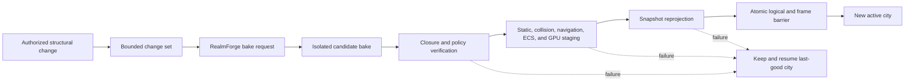

# Virtual Realm World Districts and Facilities

This page defines what RealmForge must build for the first production Virtual
Realm city. It turns the architecture into a coherent place without turning
every file or graph edge into arbitrary geometry. The result is one stable,
walkable, first-person city whose form comes from authorized structure and
whose activity comes from authoritative observations.

The shipped Particle Realms city and a user's private Cityform use the same
grammar but are different products. The shipped city has five reviewed
foundational territories. A personal Cityform is compiled independently from
that computer's authorized projection and may use different territory kits.
Neither product can seed the other's IDs, dimensions, coordinates, topology,
resource closure, or disclosure state.

## Locked spatial model

The world has three nested *scales*, but its software remains a flat peer graph:

| Scale | What the Traveler perceives | Authority |
| --- | --- | --- |
| Mesh Expanse | Complete Cityforms approaching, separating, or docking | Signed public shells, presence, and rendezvous receipts |
| Cityform | One computer embodied as a city-scale moving body | Audience-specific RealmForge bake plus host authority |
| Walkable city | Streets, districts, facilities, interiors, Code Matter, and Travelers | Active bake, local observations, and exact capabilities |

“Nested” here describes spatial containment only. A territory, district, or
facility is a flat resource identified by a stable ID and related through typed
records. It does not own a child manager, construct a peer, or hide a second
runtime. `RealmForgeBakeEntry` composes bake peers; `VirtualRealmEntry` composes
runtime peers.

Each Cityform uses a right-handed local metre frame:

- local `+Z` is the longitudinal direction of the Root Spine;
- local `+X` crosses the Root Spine and alternates territory sides;
- local `+Y` is height;
- the Cityform exterior pose is separate from every internal local coordinate;
- rendezvous never rewrites the local bake or internal navigation frame.

The Traveler never changes scale or leaves grounded first person to understand
the city. Distant Cityforms are perceived at macro scale from admitted lookout,
station, and horizon positions. Bridge geometry performs the authored scale and
frame transition after docking; it does not teleport a camera through private
space.

## RealmForge kit grammar

RealmForge builds the city from independent data kits. These are planned M2+
RealmForge resources, not additions to the accepted M0-M1C wire catalog.

| Resource | Responsibility | Forbidden contents |
| --- | --- | --- |
| `RealmCityformEnvelopeKitV1` | Local bounds, hull sockets, skyline bands, weather volume, horizon occlusion, and external pose anchor | Private topology in a public variant |
| `RealmRootSpineKitV1` | Origin, spawn atrium, principal axis, stops, crossings, fallback anchors, and orientation signs | Live activity or authority state |
| `RealmTerritoryKitV1` | Macro-cell policy, landmark silhouette, entrances, growth bands, materials, HLOD, and accessibility identity | Concrete runtime service objects |
| `RealmDistrictKitV1` | Parcels, local streets, public rooms, service layers, interaction anchors, and semantic bindings | An implicit capability grant |
| `RealmFacilityKitV1` | A reviewable building or machine grammar with typed sockets and state presentation slots | Executable arbitrary content |
| `RealmRouteKitV1` | One semantic route class, endpoint requirements, clearance, direction, traversal, LOD, and presentation rules | An untyped graph edge |
| `RealmLandmarkKitV1` | Stable orientation object, approach sequence, name policy, audio beacon, and fallback anchor | Private source text in public form |
| `RealmGenesisFacilityKitV1` | Foundry, regulation, reaction, lineage, culture, QD, dormancy, or continuity facility grammar | A claim that life or authority exists |
| `RealmPublicSilhouetteKitV1` | Complete authored exterior and public approach surfaces | Coordinates or proportions derived from private form |
| `RealmFacilityStateBindingV1` | Typed slots that a runtime projector may update | Direct subscription, syscall, or mutable store handle |

Every kit is immutable, content-addressed, versioned, bounded, independently
validated, and selected by an explicit audience projection. A kit describes
form and legal presentation slots. It does not observe the OS, open source,
perform a syscall, connect a peer, or decide that an action succeeded.

## City assembly order

The topology compiler assembles a Cityform in this deterministic order:

1. Validate the audience projection, kit catalog, policy, units, budgets, and
   independent ID namespace.
2. Place the Cityform envelope, origin, Root Spine, spawn atrium, vertical
   datum, and collision-safe fallback anchors.
3. Place the SecureMesh Exchange in its reserved landmark cell beside the
   origin, without opening any route.
4. Sort top-level territories by `(territoryKind, stableAudienceId)` and place
   their macro-cells on alternating Root Spine sides.
5. Allocate stable district cells, reserved growth cells, entrances, transit
   stops, emergency returns, and accessibility paths.
6. Place facilities from reviewed kits and bind each state slot to an admitted
   authored anchor.
7. Route containment streets first, then each non-containment semantic layer
   through its own clearance graph.
8. Compile collision, navigation, interaction, audio, occlusion, streaming,
   HLOD, signage, Operations View lookup, and public refinement sockets from
   the same quantized records.
9. Verify referential closure, walkability, disclosure, safe text, budgets,
   resource provenance, and deterministic rebuild identity.
10. Publish dependencies first and the signed root manifest last.

No live process count, traffic sample, learner state, queue depth, signal, or
presence changes these placements. Structural change follows the separately
gated topology-transition lifecycle.

## Root Commons and Root Spine

The Root Commons makes the city legible before the Traveler understands its
systems. It is not another technical territory; it is the common civic and
orientation layer.

| Place | Stable purpose | Live bindings |
| --- | --- | --- |
| Spawn Atrium | Collision-safe session entry, recovery return, and first orientation | Session health, active bake identity, recovery state |
| Root Spine | Primary walkable axis joining all territory entrances | Admitted local route health and accessibility state |
| Fivefold Plaza | First view of the Engine, Editor, Plauna, AGI, and WebGPU OS silhouettes | Territory availability without private detail |
| Chronicle Observatory | Physical first-person playback and topology history surface | Signed semantic history under the current audience |
| Provenance Hall | Legend for authored, observed, derived, construct, freshness, quality, and disclosure | Current legend and selected-object evidence |
| Recovery Shelter | Safe destination for device loss, bake transition, or incompatible anchor | Recovery receipt and last-good bake state |
| SecureMesh Approach | Public concourse leading to the Exchange boundary | Local station state only |

The Root Spine is broad enough to preserve a continuous accessible route even
when adjacent cells stream independently. Territory façades, lighting profiles,
audio beacons, pavement language, and signs make the five entrances distinct.
The Spine does not pulse with fabricated activity. Authored ambient motion is
marked as construct presentation; observed traffic uses a separate legend.

## SecureMesh Exchange

SecureMesh is the city's train station, border terminal, and network hub. The
building and the Platform Ring's content-free socket architecture always exist
in the private bake, but tracks, Travelers, named destinations and destination
boards, gates, trains, and bridges appear only from admitted state.

### Static station anatomy

| Facility | Purpose |
| --- | --- |
| Identity Hall | Presents local public identity and verification affordances without exposing secrets |
| Presence Concourse | Stages discoverable, authenticated, consented, and departed states as distinct zones |
| Platform Ring | Hosts typed public sockets declared by the active bake |
| Route Interlocking | Visualizes proposed, negotiating, admitted, degraded, revoked, and closed routes |
| Capability Customs | Explains directional grants, scope, epoch, lifetime, and denial; the kernel remains authoritative |
| Shell Gallery | Displays verified public Cityform silhouettes and cache/freshness state |
| Bridge Works | Stages the local bridge half and its collision/navigation verification |
| Quarantine Siding | Contains invalid, stale, incompatible, or hostile packages without rendering their content |
| Network Observatory | Shows audience-safe aggregates, topology history, latency class, and route health |

### Station state law

- Discovery may light a sealed arrival indicator; it cannot create a Traveler.
- Authentication may reserve a platform; it cannot imply mutual consent.
- Presence consent may admit a station-only Traveler; it cannot open a bridge.
- A route proposal may animate interlocking in a visibly proposed state.
- An exact capability and matching bridge epoch may open only the admitted gate.
- Revocation changes security state first, then removes interaction, traffic,
  train, track, Traveler, and bridge presentation in that order.
- The owner-private Operations View sees only the local station landmark and a
  content-free local boundary state. Remote identities and geometry are absent.

Internet Computer Protocol, conventional Internet transport, RealmLink,
SecureMesh, local IPC, and syscalls remain separate route classes. If an ICP
adapter is added, its routes enter a reviewed station annex or horizon service;
they never masquerade as local streets and never gain authority by being drawn.

## Engine Territory

The Engine Territory is the physical substrate of rendering, simulation,
timing, resources, and entity materialization. Its architecture is low,
structural, kinetic, and visibly load-bearing: frame viaducts, state reservoirs,
geometry mills, and disciplined machine halls.

| District | Facilities | Truth represented |
| --- | --- | --- |
| Bootstrap Gate | Engine entry hall, device negotiation chamber, capability profile desk | Engine startup and selected runtime profile |
| Frameworks | Frame Pipeline Hall, FrameGraph Switchyard, scheduler clocks, barrier gantries | Ordered frame stages, pass dependencies, timing, and backpressure |
| ECS Borough | Entity Registry, component stacks, archetype blocks, query concourse, commit barrier | Stable entity identity, components, queries, dirty generations, and commits |
| State-First Basin | CSE Observatory, source docks, broadcast channels, raster halls | Registered sources, semantic state, projection, and render measurements |
| Rendering Works | Mesh foundry, materials quarter, light plant, atmosphere towers, HLOD depot | Real render resources and presentation pipeline state |
| Resource Harbor | Manifest customs, loader cranes, cache warehouses, disposal yard | Resource identity, load lifecycle, ownership, and release |
| Simulation Ward | Physics, navigation, animation, and world-query test chambers | Admitted simulation services and measured status |
| Audio Quarter | Listener plaza, synthesis halls, voice and effect bays | Spatial audio graph and accessible sound cues |

The Engine source boundary is narrow. The Virtual Realm runtime receives the
Engine through the injected adapter described in the clean-room foundation; it
does not import Playground implementations or treat the full Engine as a
service locator. Principal implementation seams include
`engine/core/framepipeline/FramePipeline.js`,
`engine/core/framegraph/FrameGraph.js`, `engine/ecs/world/World.js`,
`engine/render/state/StateFirstRasterizer.js`,
`engine/render/mesh/EntityMeshRenderer.js`, and
`engine/audio/core/AudioEngine.js`.

## Editor Territory

The Editor Territory is a city of deliberate authorship. It uses studios,
vaults, galleries, review bridges, and revision strata instead of presenting
the Editor UI as giant floating windows.

| District | Facilities | Truth represented |
| --- | --- | --- |
| Scene Atelier | Hierarchy hall, transform studio, environment chamber | Authorized scene structure and authored spatial relationships |
| Asset Customs | Import docks, format inspection, provenance desk, quarantine vault | Asset type, importer support, validation, and provenance |
| Registry Vaults | Models, textures, audio, fonts, scripts, prefabs, scenes, shaders, and data stacks | Typed asset catalog and dependency identity |
| Viewport Studios | Material stage, light stage, camera review room, visual-QA theatre | Preview products only, never runtime authority |
| Revision Quarter | History arcade, diff chamber, recovery archive | Authored revisions, accepted saves, and recoverable history |
| Export Yard | Dependency closure hall, package inspection, publication gate | Complete reviewed export and its evidence |

The Editor supplies authoring adapters to RealmForge, not a second world
runtime. `editor/js/project/SceneManager.js`,
`editor/js/project/AssetRegistry.js`, `editor/js/modules/ModelImporter.js`, and
`editor/js/panels/Viewport.js` are existing seams that require narrow adapters.
Preview state is labeled `preview + hypothetical`; it cannot collide, navigate,
or appear in an active public shell until an accepted bake activates it.

## Plauna Territory

Plauna becomes the city's interface fabric: legible surfaces embedded in the
world, accessible civic signage, workspaces, layout systems, and motion that
never obscure truth.

| District | Facilities | Truth represented |
| --- | --- | --- |
| Surface Weave | DOM/GPU surface halls, compositor looms, panel foundry | Hybrid surface composition and current surface lifecycle |
| Layout Courts | Constraint galleries, responsive chambers, spatial UI test lanes | Authored layout relationships and bounded responsive state |
| Theme Gardens | Token conservatory, material palettes, contrast pavilion | Reviewed design tokens and selected local theme |
| Typography Archive | Font vault, shaping room, glyph atlas, fallback desk | Approved text resources, atlas ownership, and safe rendering |
| Input Transit | Keyboard, pointer, gamepad, focus, and command junctions | Current input mode and focus routing, never capability |
| Accessibility Forum | Semantic mirror, screen-reader desk, reduced-motion and high-contrast rooms | Accessibility alternatives and certification state |
| Workspace Galleries | Window and tool surfaces shown as in-world workspaces | Authorized local surface state |

Plauna supports visor, signs, controls, and semantic equivalents through narrow
runtime and authoring adapters. It does not become a giant desktop layered over
the Realm, and no UI affordance grants the operation it describes.

## AGI Territory

The AGI Territory is an observatory and learning landscape. Its visual language
distinguishes experiment, measurement, inference, proposal, accepted policy,
and historical evidence so that intelligence is never implied by decorative
motion.

| District | Facilities | Truth represented |
| --- | --- | --- |
| Causal Observatory | CSE experiment chambers, scenario stage, evidence gallery | Registered causal experiments and declared truth limitations |
| Policy Grounds | Training arena, evaluation lanes, reward and constraint towers | Authorized learner runs and bounded metrics |
| Tensor Foundry | Tensor stores, compute halls, transfer docks, inspection scopes | Real admitted tensor resources and compute lifecycle |
| Quality-Diversity Gardens | Descriptor map, candidate habitats, comparison walks | Archive coverage and distinct viable candidates |
| Lineage Observatory | Ancestry strata, recombination bridges, divergence archive | Chronicle-backed lineage and developmental events |
| Culture Library | Attributed beliefs, practices, disagreements, and transmission halls | Assertion class, source, audience, confidence, and logical time |
| Dormancy Vault | Cold chambers, archived candidates, extinction memorial, reactivation desk | Distinct dormant, archived, extinct, pruned, recycled, and deleted evidence |

The territory consumes admitted AGI observations through typed WebGPU OS ports.
It never reaches directly into learner state, and public shells contain no
private policy, model, tensor, genome, epigenome, culture, or evaluation data.

## WebGPU OS Territory

WebGPU OS is the civic and authority core. Its architecture uses gates,
registries, archives, service towers, and visibly separated trust boundaries.

| District | Facilities | Truth represented |
| --- | --- | --- |
| Kernel Citadel | Boot chamber, runtime mode hall, driver registry, device broker | Kernel lifecycle and admitted driver/service state |
| Process Ward | Process towers, lineage machinery, scheduling plaza | Process identity, parentage, lifecycle, and estimated metrics |
| Syscall Gates | Typed request halls, result exits, denial court | Proposed calls and authoritative completion receipts |
| Command and Event Exchange | Command bus, patch bus, effect bus, state channels | Typed local communication without confusing it with networking |
| VFS Archive | Mount atrium, namespace stacks, sealed collections, watch desk | Authorized filesystem and mount structure, never ungranted path text |
| Storage Reservoir | Durable stores, cache cisterns, quota locks, eviction works | Storage lifecycle, capacity class, and persistence evidence |
| Permission District | Capability customs, policy court, epoch beacons, revocation locks | Current authority boundaries and receipts |
| Application Borough | Reviewed app façades, launch terminals, package registry | Installed and running application state under disclosure policy |
| RealmForge Foundry | Blueprint halls, recipe compiler, bake chambers, verification line, publication gate | Authored world compilation and immutable package lifecycle |
| Storylet House | Catalog archive, eligibility desk, arbitration chamber, presentation stage | Data-only scenario state and powerless action requests |
| Trust and Attestation Row | Signing lineage, provenance, trust store, security clinic | Exact trust evidence without exposing secret material |

Primary observation seams include `webgpu-os/kernel/ProcessTable.js`,
`webgpu-os/kernel/VirtualFS.js`, `webgpu-os/kernel/Syscalls.js`,
`webgpu-os/kernel/Permissions.js`, `webgpu-os/storage/StorageManager.js`, and
`webgpu-os/kernel/storylets/StoryletRuntime.js`. The city sees disclosed
observations derived by injected adapters, never these concrete services or
their mutable state.

## Genesis Ecology civic belt

Genesis Ecology is not a sixth monolithic territory. It is a cross-territory
set of independently gated facilities joined by semantic construction,
resource, regulatory, lineage, role, and cultural routes.

Planned RF-GE6 packages Genesis as an inert, unpublished
`GenesisRealmExtensionManifestV1` sidecar bound to one exact accepted base-bake
ID/digest. Its exact compilation input receives the complete accepted base
manifest and signed base-layout receipt, derives their ID/digest bindings, and
covers both records in the input digest. The extension layout is an unsigned
`GenesisSpatialLayoutEvidenceV1`; signing, admission, and
activation remain RF-GE8 work. It cannot add keys to the base manifest or
invalidate the base city when absent. `GenesisDistrictAssemblyV1` composes six
reviewed instances of the single `GenesisWorldKitV1` contract by stable IDs,
closed kinds, and typed sockets:

| `kitId` | `kitKind` | Included facilities |
| --- | --- | --- |
| `genesis-world-kit:continuity-core` | `continuity-core` | Continuity Chamber, Soul Seed mint-status surface, lineage-head socket, collective-integration evidence field, distributed-body continuity routes |
| `genesis-world-kit:foundry-district` | `foundry-district` | Product and Factory Genome halls, immutable Part Vault, Interface Docks, Candidate Staging, developmental/morphogenesis labs, test chambers, build/break/repair/fuse/split/specialize/generalize/recombine/recycle/mutate lines, recursive packaging |
| `genesis-world-kit:maintenance-works` | `maintenance-works` | Homeostasis towers, resource reservoirs, Reaction Refinery, program-ecology docks, recognition/quarantine checkpoints, repair/compensation bays, pruning, recycling, and zeroization vaults |
| `genesis-world-kit:possibility-archive` | `possibility-archive` | QD gardens, lineage and evolution-regime archive, cognitive observatory, environmental-memory exhibits, dormancy cold vault, rejected-candidate evidence, distinct extinction/archive/recycle/deletion spaces |
| `genesis-world-kit:role-commons` | `role-commons` | Niche infrastructure, role-proliferation forum, major-transition chamber, and candidate, recognized, contested, degraded, released, historical, and vacant role stations |
| `genesis-world-kit:culture-archive` | `culture-archive` | Libraries, schools, forums, civic-memory towers, social-topology routes, attribution, mutation, disagreement, and cultural-factory influence surfaces |

M2-GE loads static kits 1-3 and reserves sockets for 4-6. M3 activates all six
only from admitted evidence. A kit is not a nested runtime manager; its
facilities remain flat resources with authored containment relations.

| Facility | Home territory | Static function | Dynamic evidence |
| --- | --- | --- | --- |
| Software Foundry | WebGPU OS / Engine boundary | Part vaults, typed docks, staging, test, package, repair, and recycle lines | Proposed, compiling, evaluating, accepted, activating, active, degraded, repairing, rolled-back, packaged, and recycling states |
| Product Genome Hall | RealmForge Foundry | Reviewable assembly and phenotype grammar | Active genome head and admitted phenotype revision |
| Factory Genome Control Hall | Engine Territory | Factory recipe and bounded execution grammar | Current plan, resource ceiling, result, and rollback receipt |
| Regulation Garden | Engine / AGI boundary | Signal lanes, gates, mark anchors, target-band towers | Exact or measured regulation and homeostasis observations |
| Cognitive Observatory | AGI / Engine boundary | Belief, prediction, uncertainty, counterfactual, curiosity, and endogenous-goal presentation grammar | Attributed observations, prediction error, learner updates, goal proposals, decisions, and outcomes |
| Embodiment Dockyard | Engine / WebGPU OS boundary | Body/host capabilities, distributed morphology, migration, metamorphosis, and host-loss recovery grammar | Admitted host set, capabilities, phase transition, loss, repair, replacement, and continuity evidence |
| Environmental Memory Works | RealmForge / Engine boundary | Seven inheritance-channel bindings, external-memory anchors, and niche-construction intent sockets | Attributed inheritance events and admitted durable roads, works, repositories, institutions, or topology changes |
| Reaction Refinery | Engine Territory | Typed reaction rules, catalyst bays, resource reservoirs | Proposed, admitted, consumed, produced, failed, and compensated events |
| Program Ecology Exchange | Engine / WebGPU OS boundary | Cooperation, competition, mutualism, commensalism, parasitism, predation, recognition, test, and quarantine grammar | Exact relationship intervals, damage, resource exchange, quarantine, reject, repair, and release evidence |
| Role Guild Hall | WebGPU OS / AGI boundary | Versioned recognition criteria and vacant role spaces | Candidate, recognized, degraded, contested, released, and historical roles |
| Culture Library | AGI Territory | Attributed practice and belief archive | Transmission, disagreement, confidence, audience, and assertion class |
| QD Gardens | AGI Territory | Descriptor axes and archive cells | Candidate coverage, niches, tradeoffs, and evidence |
| Lineage Observatory | AGI Territory | Stable ancestry anchors and Chronicle paths | Birth, recombination, divergence, repair, dormancy, and reactivation |
| Dormancy Vault | AGI / Storage boundary | Cold, archive, extinction, prune, recycle, and deletion chambers | Exact lifecycle and retention evidence |
| Continuity Chamber | Root Commons / Trust boundary | Soul Seed identity seal and continuity inspection surface | Stable causal-root and mint evidence across phenotype changes |

The completed RF-GE2 through RF-GE5 authoring gates do not populate the dynamic-
evidence column. Planned RF-GE6 may compile reviewed static world-kit evidence,
but it likewise cannot make that evidence live. Their exact world truth is:

| Upstream artifact | Permitted use now | World state it cannot claim |
| --- | --- | --- |
| RF-GE2 `GenesisExecutionPlanV1` | RealmForge-local inspection of a deterministic, verified, `not-executed` Plan and its Factory/Plan binding evidence | A queued, executing, evaluated, accepted, activating, active, repaired, rolled-back, packaged, recycled, or otherwise live Factory operation |
| RF-GE3 exact cache entry | Process-local authoring acceleration only when its complete audience, disclosure, audience-scope, source, context, version, trust-pack, and binding identity still matches | Persistence, publication, execution, installation, authority, active-head state, or any visible facility activity |
| RF-GE3 `GenesisPartV1` package candidate | RealmForge-local review of a deterministic inert candidate whose logical and content identities remain distinct and whose required external evidence is uncollected | An admitted or installed Part, a published package, a populated vault, an active production line, or a `packaged` lifecycle state |
| RF-GE4 authored-program and interpreter Plan evidence | RealmForge-local review and deterministic byte verification of the twelve typed programs and eight interpreter fragments under their exact context | A running developmental, regulatory, homeostatic, cognitive, embodiment, inheritance, or reaction process; an ECS state; a facility event; or any authority |
| RF-GE5 evidence-program and evidence Plan evidence | RealmForge-local review and deterministic byte verification of eleven evidence programs and ten fragments bound to the verified RF-GE4 Plan | A recognized role, living organism, lineage event, QD archive cell, culture state, environmental work, lifecycle transition, identity mint, or self-modification |
| Planned RF-GE6 projection grammar and reviewed world kits | Offline compile/recompile, unsigned layout agreement, stable-coordinate, HLOD, accessibility, closure, manifest-bound disclosure, owner-only Operations evidence rows, and explicit noninterference/refinement-isolation evidence for the six flat kits | An accepted Operations lookup, signed layout receipt, live scan, admitted extension, active geometry, ECS mutation, visible facility, dynamic event, public publication, or runtime authority |

No RF-GE2 Plan, RF-GE3 cache receipt or candidate, RF-GE4/RF-GE5 authored
evidence, RF-GE6 planning artifact, compiler event, or passing test
may light a facility, animate a line, create traffic, populate a queue, or set a
Foundry lifecycle state. A future M3F projector may do so only from separately
admitted runtime observations after sealed binding verification, deterministic
recompilation, external execution/evidence, authority, and commit. Accepted
RF-GE4 and RF-GE5 authoring evidence contributes no world-visible state. The
cross-track next-gate order is canonical in the
[Genesis Ecology program continuity ledger](../../concepts/genesis-ecology.md#program-continuity-ledger).

No facility claims that software is alive, conscious, authorized, repaired, or
accepted merely because it is beautiful or animated. Organismality is an
evidence-bearing assessment. A higher-order Soul Seed requires its own explicit
proposal and mint authority; it never appears through automatic visual nesting.

## Semantic road and conduit plan

Roads exist because a registered relationship class has a world rule, not
because two nodes are adjacent in a graph.

| Route class | World form | Human traversal | Stable or live | Required authority |
| --- | --- | --- | --- | --- |
| Containment | Streets, stairs, lifts, floors, and parcel entries | Yes where navigation admits it | Stable bake | Bake and local access policy |
| Boot | Root Spine express route and startup gates | Guided first-person route | Stable anchors, live progress | Local observation only |
| Frame | Viaduct and timed gantries | Observation walkways only | Stable anchors, live pulses | Disclosed Engine evidence |
| Dependency/import | Utility duct, service tunnel, or overhead cable tray | Normally no | Stable relation, live health optional | Disclosure policy |
| Invocation/syscall | Guarded lane through Syscall Gates | Only authored inspection paths | Stable anchors, live proposal/result | Kernel authority for action |
| IPC/event | Local street, lift, conduit, or junction | Policy-specific | Stable anchors, live traffic | Local disclosure |
| Storage | Freight line and reservoir pipe | No ordinary traversal | Stable anchors, live flow | Storage disclosure |
| Regulatory | Luminous signal lane and control gate | No | Stable binding, live signal | Genesis disclosure |
| Reaction/resource | Freight track, catalyst dock, and supply pipe | Foundry-local only | Stable binding, live event | Foundry authority |
| Lineage | Root path and Chronicle trail | Inspectable | Stable archive, historical events | Audience and retention policy |
| Culture | Attributed civic path | Inspectable | Stable archive, live/historical transmission | Audience and assertion policy |
| Network | Rail, port, horizon gate, and train | Station-local until admitted | Static sockets, live route | Network and presence receipts |
| RealmLink/bridge | Epoch-bound docking bridge | Yes after full admission | Temporary | Matching directional capabilities and bridge receipts |
| ICP adapter | Reviewed network annex or horizon service | Protocol-specific, never implicit | Optional separate adapter | Exact ICP/network policy |

All routed geometry uses canonical endpoint order, quantized coordinates,
bounded orthogonal search, fixed tie-breaking, clearance classes, and explicit
omission receipts. Direction remains visible through lane geometry, pulses,
signs, audio, and accessible text. Far LOD aggregates parallel edges only by a
registered class and metric bucket; it never combines IPC with network or
authority with traffic.

## Buildings, files, and Code Matter

The city does not create one full building for every file. RealmForge applies
semantic scale:

| Source scale | Near representation | Far representation |
| --- | --- | --- |
| Territory root | Landmark territory and entrance | Distinct skyline mass |
| Application or major package | Building or functional complex | Named HLOD block |
| Directory or package | District, parcel group, floor, or interior wing | Aggregated block with count/weight class |
| File, module, asset, or dataset | Code Matter object, room, machine part, or archive object | Sealed aggregate with no reversible detail |
| Authorized source range | Lease-bound exact glyph surface at inspection distance | Never readable at distance |

Sealed geometry may communicate public archetype and non-reversible form.
Structured geometry may communicate authorized type, syntax, dependency, or
module structure. Revealed glyphs are generated only from exact bytes for the
exact revision and visible range. Decorative Matrix-like code is prohibited.

## Stable growth and topology change

Every territory and district reserves bounded growth cells. A new object first
consumes its parent's reserved cells in stable-ID order. If capacity is
exhausted, RealmForge selects the smallest deterministic ancestor that can
repack and emits the exact relocation set. Unaffected anchors do not move.

The running city treats a topology change as a transaction:

Prospective buildings are visibly hypothetical and have no collision,
navigation, picking authority, public presence, or source reveal. Live activity
never causes a rebake by itself.

## Public Cityform appearance

A complete public shell is an authored product, not a censored private bake.
Its inputs are explicit public identity, visual kit selections, silhouette,
materials, public landmarks, socket declarations, accessibility labels, and
bounded public state channels.

The public shell must be convincing at every permitted approach distance while
remaining independent of private reality:

- a complete hull, skyline, lights, weather envelope, horizon occlusion, and
  distant motion grammar;
- reviewed public façades and approach surfaces;
- public station sockets and collision/navigation limited to public approach;
- no private coordinates, block counts, package weights, paths, process data,
  source commitments, glyphs, learner state, culture, genome, or hidden routes;
- no arbitrary shader, script, WASM, URL, font, or runtime asset fetch;
- no inference from missing detail: sealed and unavailable states are explicit
  products, not blurred private geometry.

An access refinement fills only a declared public socket and compiles from the
exact granted projection. It cannot reveal or reconstruct the private layout
behind that socket.

## Living Digital World optional first-playable itinerary

This is the optional end-to-end Living Digital World acceptance itinerary, not
the integrated-M2 first-walkable gate. Integrated M2 certifies the static local
Cityform and steps 1 through 4. The route extends only as each owning base or
Genesis gate is accepted; base Virtual Realm V1 never waits for an optional
Genesis gate.

1. Spawn in the Root Commons and learn the provenance legend.
2. Walk the Root Spine to the Engine Territory and watch one real frame/ECS
   path without treating animation as authority.
3. Cross to the Editor Territory and inspect one authored asset's provenance,
   preview status, and accepted package closure.
4. Enter Plauna and exercise the same information through visual, keyboard,
   gamepad, reduced-motion, high-contrast, and semantic equivalents.
5. After the owning M3 observation and projection gates pass, visit the AGI
   Causal Observatory and compare observed, inferred, hypothetical, and
   historical claims.
6. Under those same M3 gates, reach WebGPU OS through the boot, process,
   syscall, permission, storage, and application civic route.
7. After the M3 Code Matter slice passes, inspect one sealed Code Matter object,
   request reveal, and see only exact authorized bytes for the accepted lease.
8. Only for the Living Digital World label, after the separate M2-GE static
   extension and M3F/M3-GE runtime gates pass, visit the Software Foundry and
   observe one real recipe move through proposal, isolated evaluation,
   authority, ECS activation, repair, and packaging.
9. After M5, enter SecureMesh Exchange and authenticate a station-only
   encounter; after M6, cross one independently verified bridge under a
   directional capability.
10. Under M6, revoke the capability and observe interaction removal, route
    teardown, and shell-cache behavior without losing the local city.

The optional owner-private Operations View is an interlude for local zone
management and minimap orientation. It is not used to traverse any part of this
itinerary or inspect another Cityform.

## Operations View derivative

RealmForge emits a separate local lookup resource from the accepted private
bake. It contains only local zone, anchor, cell, landmark, route, bounds, and
selection records needed by the Operations View and minimap. It contains no
readable source and no remote-compatible record family.

The runtime closes the input set before scene assembly. Public shells, remote
poses, presence, Travelers, rendezvous frames, bridge epochs, destinations,
remote audio, remote object IDs, and remote telemetry have no representation in
the lookup schema. A station route ends at the local platform boundary.

## Semantic LOD and streaming

The same truth remains recognizable at five presentation bands:

| Band | Visible product | Never introduced |
| --- | --- | --- |
| Cityform horizon | Hull, skyline, major landmarks, presence and freshness class | Private internal layout |
| Territory | Silhouette, entrance, major state aggregate, orientation beacon | Invented building activity |
| District | Streets, facilities, route classes, aggregate occupancy and health | Unregistered graph edges |
| Facility | Machines, state slots, interactions, evidence surfaces | Authority inferred from appearance |
| Inspection | Exact object identity, provenance, commitments, and leased glyph range | Unauthorized bytes or fake code |

Streaming cells follow stable district and route boundaries. Each cell declares
geometry, collision, navigation, audio, interaction, typography, HLOD, private
atlas references, and disposal dependencies. The loader may degrade to a lower
truthful LOD or explicit partial state; it cannot fill missing data with a
plausible fiction.

## Visual and audio identity

The Realm may evoke luminous digital architecture, monumental machine cities,
and living data flow, but it must use an original visual system:

- territory-specific silhouette, structure, material, rhythm, and audio motif;
- one consistent provenance/disclosure/authority legend across all districts;
- readable routes and landmarks before decorative density;
- geometric glyphs only when bound to structured or revealed content;
- authenticated Travelers, constructs, processes, and decorative inhabitants
  have unmistakably different forms;
- proposed, hypothetical, stale, degraded, denied, sealed, and revoked states
  remain distinguishable without color alone;
- reduced motion preserves state order and spatial meaning.

Storylets may guide attention, populate reviewed constructs, or stage an
explanation. They cannot fabricate a process, peer, route, permission, repair,
recipe result, or code surface.

## RealmForge and runtime touch map

| System | Bake-time responsibility | Runtime responsibility | Milestone |
| --- | --- | --- | --- |
| RealmForge topology compiler | Stable cells, anchors, routes, sockets, relocation set | None | M2/M3 |
| RealmForge assembly/material pipeline | Geometry, materials, collision, navigation, HLOD, closures | None | M2 |
| Engine ECS | Component schema compatibility and staging validation | Materialize and update admitted world entities | M2/M3 |
| State-First/CSE adapter | Source-binding compatibility | Consume injected registered sources and frame updates | M2/M3 |
| Engine renderer | Resource compatibility evidence | Dedicated static/dynamic world presentation | M2/M3 |
| WebGPU OS observation adapters | Projection-schema declarations | Authoritative snapshots and ordered subscriptions | M3 |
| Storylet compiler/runtime | Data-only catalog and presentation command validation | Eligibility, arbitration, explanation, powerless proposals | M1C/M3 |
| Genesis recipe kernel | Foundry kit and recipe closure | Plan, evaluate, request authority, and report receipts | M2/M3 |
| Public shell compiler | Independent public appearance product | Verified load and bounded public state channels | M4 |
| SecureMesh/RealmLink | Socket and protocol compatibility | Presence, Traveler, rendezvous, route, epoch, and revocation | M5/M6 |
| Local Operations projector | Bake lookup closure | Owner-private local-only map and management proposals | M2/M3 |

## Acceptance gates

| Gate | Required evidence |
| --- | --- |
| `VR-WD0` | Exact kit schemas, independent audience namespaces, hostile vectors, and deterministic canonicalization |
| `VR-WD1` | Root Commons, Root Spine, Exchange, five territory macro-cells, collision, navigation, HLOD, signs, audio, and accessibility compile twice identically |
| `VR-WD2` | Every facility state slot resolves to a typed projector binding and no facility imports a runtime service |
| `VR-WD3` | Every road belongs to one registered semantic class; dangling, ambiguous, crossing, and clearance failures fail closed |
| `VR-WD4` | With every owning gate accepted, the full Living Digital World itinerary is continuous on keyboard, mouse, and gamepad and has semantic equivalents; integrated M2 certifies only steps 1 through 4 |
| `VR-WD5` | Exact Code Matter appears only under a valid reveal lease and no decorative glyph resembles code |
| `VR-WD6` | Genesis facilities show exact lifecycle and claim axes without granting authority or minting identity |
| `VR-WD7` | Identical public inputs produce identical shells for different private machines; private changes cause no public difference |
| `VR-WD8` | Operations View and minimap contain only local lookup records and zero remote-compatible schema families |
| `VR-WD9` | Cell streaming, HLOD, device recovery, transition rollback, disposal, and reference-tier budgets pass |

First Shard content remains excluded. No source, test, architecture, mechanic,
art direction, runtime, or dependency from that application participates in
this world grammar.

## See also

- [RealmForge bake pipeline](realmforge-pipeline.md)
- [World projection grammar](world-projection.md)
- [M2 runtime foundation](m2-runtime-foundation.md)
- [M3 living city runtime](m3-living-city-runtime.md)
- [Genesis Ecology integration](genesis-ecology-integration.md)
- [Local City Operations View](local-operator-view.md)
- [Code Matter](code-matter.md)
- [Cityforms and SecureMesh](cityforms-securemesh.md)
- [Rendering and experience](rendering-experience.md)
- [Certification plan](certification-plan.md)
